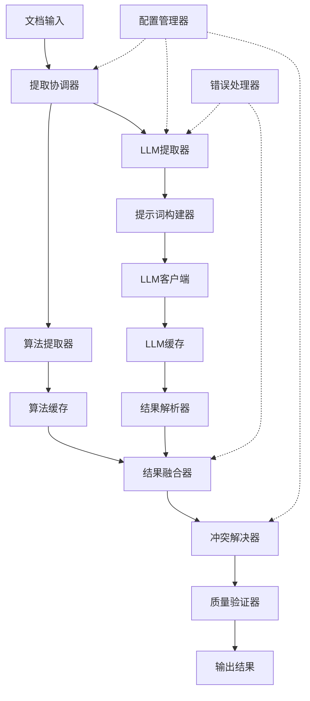

# Design Document: LLM增强实体提取系统

## Overview

LLM增强实体提取系统是一个混合架构的实体提取解决方案，结合了基于规则的算法提取器和基于大语言模型的语义提取器。系统的核心设计理念是"算法保证准确性，LLM增强语义"，在保持现有数值参数提取100%准确率的基础上，通过LLM增加语义概念、细粒度实体和语义关系的提取能力。

系统采用三阶段处理流程：
1. **算法提取阶段**：使用现有的规则和模式提取数值参数
2. **LLM增强阶段**：使用LLM提取语义信息
3. **结果融合阶段**：合并两种提取结果，解决冲突

该设计确保了向后兼容性，可以作为可选模块集成到现有的universal_document_pipeline中。

## Architecture

### 系统架构图



### 核心组件

1. **提取协调器 (ExtractionCoordinator)**
   - 协调算法提取和LLM提取的执行顺序
   - 管理提取流程的生命周期
   - 处理降级策略

2. **算法提取器 (AlgorithmExtractor)**
   - 复用现有的universal_extractor
   - 提取数值参数（焦距、光圈、快门速度、ISO等）
   - 保证100%准确率

3. **LLM提取器 (LLMExtractor)**
   - 提取语义概念实体
   - 提取细粒度实体
   - 提取语义关系
   - 生成描述性文本

4. **结果融合器 (ResultFusion)**
   - 合并算法提取和LLM提取的结果
   - 标记每个字段的提取来源
   - 生成统一的输出格式

5. **冲突解决器 (ConflictResolver)**
   - 处理算法和LLM提取结果的冲突
   - 应用冲突解决策略（优先算法提取的数值）
   - 记录冲突日志

6. **质量验证器 (QualityValidator)**
   - 验证提取结果的完整性
   - 计算质量指标
   - 生成验证报告

## Components and Interfaces

### 1. ExtractionCoordinator

**职责**：协调整个提取流程

**接口**：
```javascript
class ExtractionCoordinator {
  /**
   * 执行混合提取
   * @param {string} documentText - 文档文本
   * @param {Object} options - 提取选项
   * @returns {Promise<ExtractionResult>}
   */
  async extract(documentText, options = {}) {}
  
  /**
   * 配置提取策略
   * @param {Object} config - 配置对象
   */
  configure(config) {}
}
```

**配置选项**：
- `enableLLM`: 是否启用LLM提取（默认true）
- `enableAlgorithm`: 是否启用算法提取（默认true）
- `timeout`: 超时时间（默认5000ms）
- `language`: 文档语言（'zh' | 'en' | 'auto'）

### 2. AlgorithmExtractor

**职责**：使用规则和模式提取数值参数

**接口**：
```javascript
class AlgorithmExtractor {
  /**
   * 提取数值参数
   * @param {string} text - 文档文本
   * @returns {Promise<AlgorithmExtractionResult>}
   */
  async extract(text) {}
}
```

**输出格式**：
```javascript
{
  entities: [
    {
      type: 'numerical_parameter',
      name: '焦距',
      value: '35mm',
      confidence: 1.0,
      source: 'algorithm'
    }
  ],
  metadata: {
    extractionTime: 100,
    parametersFound: 5
  }
}
```

### 3. LLMExtractor

**职责**：使用LLM提取语义信息

**接口**：
```javascript
class LLMExtractor {
  /**
   * 提取语义信息
   * @param {string} text - 文档文本
   * @param {Object} context - 上下文信息（如算法提取的结果）
   * @returns {Promise<LLMExtractionResult>}
   */
  async extract(text, context = {}) {}
  
  /**
   * 批量提取
   * @param {Array<string>} texts - 文档文本数组
   * @returns {Promise<Array<LLMExtractionResult>>}
   */
  async batchExtract(texts) {}
}
```

**提取内容**：
1. 语义概念实体（拍摄技巧、场景类型、概念）
2. 细粒度实体（具体的镜头型号、设备）
3. 语义关系（适用于、推荐用于、应用于、影响）
4. 描述性文本

**输出格式**：
```javascript
{
  entities: [
    {
      type: 'semantic_concept',
      name: '人物肖像',
      description: '以人物为主体的摄影类型',
      confidence: 0.95,
      source: 'llm'
    },
    {
      type: 'lens',
      name: 'SEL35F18F',
      properties: {
        focalLength: '35mm',
        maxAperture: 'F1.8',
        description: '适合人文和街拍的定焦镜头',
        suitableScenes: ['街拍', '人文摄影', '室内拍摄']
      },
      confidence: 0.92,
      source: 'llm'
    }
  ],
  relations: [
    {
      type: 'suitable_for',
      source: 'SEL35F18F',
      target: '人文摄影',
      confidence: 0.90,
      source: 'llm'
    }
  ],
  metadata: {
    extractionTime: 2500,
    tokensUsed: 1200,
    llmModel: 'qwen-plus'
  }
}
```

### 4. PromptBuilder

**职责**：构建LLM提示词

**接口**：
```javascript
class PromptBuilder {
  /**
   * 构建实体提取提示词
   * @param {string} text - 文档文本
   * @param {Object} context - 上下文信息
   * @returns {string}
   */
  buildEntityExtractionPrompt(text, context) {}
  
  /**
   * 构建关系提取提示词
   * @param {Array} entities - 已提取的实体
   * @param {string} text - 文档文本
   * @returns {string}
   */
  buildRelationExtractionPrompt(entities, text) {}
}
```

**提示词策略**：
- 使用Few-shot示例提高准确性
- 根据文档语言选择提示词模板
- 包含输出格式规范（JSON Schema）
- 提供上下文信息（如算法提取的数值参数）

### 5. ResultFusion

**职责**：融合算法和LLM的提取结果

**接口**：
```javascript
class ResultFusion {
  /**
   * 融合提取结果
   * @param {AlgorithmExtractionResult} algorithmResult
   * @param {LLMExtractionResult} llmResult
   * @returns {FusedResult}
   */
  fuse(algorithmResult, llmResult) {}
  
  /**
   * 检测冲突
   * @param {FusedResult} result
   * @returns {Array<Conflict>}
   */
  detectConflicts(result) {}
}
```

**融合策略**：
1. **实体融合**：
   - 算法提取的数值参数实体保持不变
   - LLM提取的语义实体直接添加
   - 如果LLM提取的实体包含数值字段，标记为需要验证

2. **关系融合**：
   - 保留算法提取的共现关系
   - 添加LLM提取的语义关系
   - 去重相似关系

3. **元数据融合**：
   - 合并提取时间
   - 记录token使用量
   - 标记每个字段的来源

### 6. ConflictResolver

**职责**：解决提取结果的冲突

**接口**：
```javascript
class ConflictResolver {
  /**
   * 解决冲突
   * @param {Array<Conflict>} conflicts
   * @param {Object} strategy - 解决策略
   * @returns {Array<Resolution>}
   */
  resolve(conflicts, strategy = {}) {}
}
```

**冲突类型**：
1. **数值冲突**：算法和LLM提取的数值不一致
2. **实体重复**：同一对象被创建多个实体
3. **关系冲突**：相同实体对之间有矛盾的关系

**解决策略**：
- 数值冲突：优先使用算法提取的结果
- 实体重复：合并实体，保留置信度最高的字段
- 关系冲突：保留置信度最高的关系，记录其他候选

### 7. QualityValidator

**职责**：验证提取结果的质量

**接口**：
```javascript
class QualityValidator {
  /**
   * 验证结果
   * @param {FusedResult} result
   * @returns {ValidationReport}
   */
  validate(result) {}
  
  /**
   * 计算质量指标
   * @param {FusedResult} result
   * @returns {QualityMetrics}
   */
  calculateMetrics(result) {}
}
```

**验证规则**：
1. 实体完整性：必需字段是否存在
2. 关系有效性：关系的源和目标实体是否存在
3. 置信度合理性：置信度是否在0-1范围内
4. 数量阈值：实体和关系数量是否达到预期

**质量指标**：
- 实体提取完整性：提取的实体数量 / 预期实体数量
- 关系提取完整性：提取的关系数量 / 预期关系数量
- 平均置信度：所有提取结果的平均置信度
- 字段完整率：包含完整字段的实体比例

## Data Models

### ExtractionResult

完整的提取结果数据模型：

```javascript
{
  // 实体列表
  entities: [
    {
      id: string,              // 实体唯一标识
      type: string,            // 实体类型：'lens', 'technique', 'concept', 'scene', 'numerical_parameter'
      name: string,            // 实体名称
      properties: {            // 实体属性（根据类型不同）
        // 镜头实体
        focalLength?: string,
        maxAperture?: string,
        description?: string,
        suitableScenes?: string[],
        
        // 技巧实体
        method?: string,
        difficulty?: string,
        
        // 数值参数实体
        value?: string,
        unit?: string
      },
      confidence: number,      // 置信度 0-1
      source: string,          // 提取来源：'algorithm' | 'llm'
      metadata: {
        extractedAt: string,   // 提取时间戳
        context?: string       // 提取上下文
      }
    }
  ],
  
  // 关系列表
  relations: [
    {
      id: string,              // 关系唯一标识
      type: string,            // 关系类型：'suitable_for', 'recommended_for', 'applies_to', 'affects', 'co_occurrence'
      source: string,          // 源实体ID或名称
      target: string,          // 目标实体ID或名称
      confidence: number,      // 置信度 0-1
      source: string,          // 提取来源：'algorithm' | 'llm'
      metadata: {
        extractedAt: string,
        evidence?: string      // 支持该关系的文本证据
      }
    }
  ],
  
  // 元数据
  metadata: {
    documentId?: string,       // 文档ID
    language: string,          // 文档语言
    processingTime: number,    // 总处理时间（ms）
    algorithmTime: number,     // 算法提取时间（ms）
    llmTime: number,           // LLM提取时间（ms）
    tokensUsed: number,        // LLM token使用量
    cost: number,              // 估算成本
    llmModel: string,          // 使用的LLM模型
    conflicts: number,         // 冲突数量
    status: string             // 处理状态：'success' | 'partial_success' | 'failed'
  },
  
  // 质量报告
  quality: {
    entityCompleteness: number,    // 实体完整性 0-1
    relationCompleteness: number,  // 关系完整性 0-1
    averageConfidence: number,     // 平均置信度 0-1
    fieldCompleteness: number,     // 字段完整率 0-1
    warnings: string[]             // 警告信息
  }
}
```

### Configuration

系统配置数据模型：

```javascript
{
  // LLM配置
  llm: {
    enabled: boolean,              // 是否启用LLM提取
    model: string,                 // LLM模型名称
    apiKey: string,                // API密钥
    baseURL: string,               // API基础URL
    timeout: number,               // 超时时间（ms）
    maxRetries: number,            // 最大重试次数
    temperature: number,           // 温度参数
    maxTokens: number              // 最大token数
  },
  
  // 算法配置
  algorithm: {
    enabled: boolean,              // 是否启用算法提取
    extractorType: string          // 提取器类型
  },
  
  // 融合配置
  fusion: {
    conflictStrategy: string,      // 冲突解决策略：'prefer_algorithm' | 'prefer_llm' | 'merge'
    deduplication: boolean,        // 是否去重
    confidenceThreshold: number    // 置信度阈值
  },
  
  // 性能配置
  performance: {
    enableCache: boolean,          // 是否启用缓存
    cacheExpiry: number,           // 缓存过期时间（秒）
    batchSize: number,             // 批处理大小
    maxProcessingTime: number      // 最大处理时间（ms）
  },
  
  // 质量配置
  quality: {
    minEntities: number,           // 最小实体数量
    minRelations: number,          // 最小关系数量
    minConfidence: number,         // 最小置信度
    requiredFields: string[]       // 必需字段列表
  },
  
  // 语言配置
  language: {
    default: string,               // 默认语言
    supported: string[],           // 支持的语言列表
    autoDetect: boolean            // 是否自动检测语言
  }
}
```

## Correctness Properties

*A property is a characteristic or behavior that should hold true across all valid executions of a system—essentially, a formal statement about what the system should do. Properties serve as the bridge between human-readable specifications and machine-verifiable correctness guarantees.*

### Property Reflection

After analyzing all acceptance criteria, I identified several areas where properties can be consolidated:

1. **Entity extraction properties (1.1, 1.2, 1.3)** can be combined into a single comprehensive property about semantic entity extraction
2. **Required field properties (1.5, 2.2, 2.5)** can be combined into one property about entity completeness
3. **Relation extraction properties (3.1, 3.2, 3.3, 3.4)** can be combined into one property about semantic relation extraction
4. **Language support properties (6.1, 6.2, 6.3)** can be combined into one property about multilingual support
5. **Example tests (7.1-7.4)** are specific examples, not properties, and will be unit tests

### Properties

**Property 1: Semantic Entity Extraction Completeness**

*For any* document containing semantic concepts (photography techniques, scenes, or concepts), the LLM_Extractor should extract entities for all identifiable concepts with confidence scores between 0 and 1.

**Validates: Requirements 1.1, 1.2, 1.3**

**Property 2: Entity Field Completeness**

*For any* extracted entity, all required fields for that entity type should be present (either with values or marked as null), and descriptive text should be generated for concept entities.

**Validates: Requirements 1.5, 2.2, 2.5**

**Property 3: Fine-Grained Entity Independence**

*For any* document mentioning multiple instances of the same entity type (e.g., multiple lens models), the system should create separate entities for each instance rather than aggregating them.

**Validates: Requirements 2.1, 2.3**

**Property 4: Semantic Relation Extraction**

*For any* document describing relationships between entities (suitability, recommendations, applications, effects), the LLM_Extractor should create appropriately typed relations with confidence scores between 0 and 1.

**Validates: Requirements 3.1, 3.2, 3.3, 3.4, 3.5**

**Property 5: Algorithm Extraction Preservation**

*For any* document, when both algorithm and LLM extraction are performed, all numerical parameters extracted by the algorithm should appear unchanged in the final fused result (100% preservation).

**Validates: Requirements 4.1, 4.4**

**Property 6: Conflict Resolution Priority**

*For any* extraction result where algorithm and LLM produce conflicting numerical values, the final result should contain the algorithm's value.

**Validates: Requirements 4.3**

**Property 7: Extraction Source Traceability**

*For any* field in the extraction result, it should be tagged with its source ('algorithm' or 'llm').

**Validates: Requirements 4.5**

**Property 8: Cache Effectiveness**

*For any* identical input processed twice, the second processing should use cached results, resulting in zero LLM calls and significantly reduced processing time.

**Validates: Requirements 5.1**

**Property 9: Batch Processing Efficiency**

*For any* batch of N documents processed together, the number of LLM API calls should be less than or equal to N (ideally much less through batching).

**Validates: Requirements 5.2**

**Property 10: Processing Time Bound**

*For any* single document under 10KB, processing time (including LLM calls) should not exceed 5000ms.

**Validates: Requirements 5.3**

**Property 11: Metadata Completeness**

*For any* extraction result, metadata should include processing time, token usage, cost estimation, and extraction source for all fields.

**Validates: Requirements 5.4**

**Property 12: Multilingual Support**

*For any* document in Chinese, English, or mixed Chinese-English, the system should successfully extract entities and relations while preserving the original language of entity names.

**Validates: Requirements 6.1, 6.2, 6.3, 6.4**

**Property 13: Quality Metrics Reporting**

*For any* extraction result, the system should calculate and report quality metrics including entity completeness, relation completeness, average confidence, and field completeness.

**Validates: Requirements 7.5**

**Property 14: Graceful LLM Failure Handling**

*For any* LLM failure scenario (timeout, error, malformed response), the system should still return a valid result containing at least the algorithm extraction results, with status marked appropriately.

**Validates: Requirements 8.1**

**Property 15: Error Logging Completeness**

*For any* error or warning that occurs during processing, an entry should be written to the log with timestamp, error type, and context.

**Validates: Requirements 8.5**

**Property 16: Status Reporting**

*For any* processing request, the system should return a status ('success', 'partial_success', or 'failed') based on whether both extractors completed successfully.

**Validates: Requirements 8.6**

**Property 17: Schema Conformance**

*For any* extraction result, all entities and relations should conform to the defined schema structure with required fields present.

**Validates: Requirements 10.2**

## Error Handling

### Error Categories

1. **LLM Errors**
   - API timeout
   - Rate limiting
   - Malformed response
   - Authentication failure
   - Network errors

2. **Processing Errors**
   - Invalid input format
   - Empty document
   - Unsupported language
   - Memory overflow

3. **Validation Errors**
   - Schema violation
   - Missing required fields
   - Invalid confidence scores
   - Circular relations

### Error Handling Strategy

**Graceful Degradation**:
```javascript
try {
  // Attempt full extraction
  algorithmResult = await algorithmExtractor.extract(text);
  llmResult = await llmExtractor.extract(text, algorithmResult);
  return fusion.fuse(algorithmResult, llmResult);
} catch (llmError) {
  // LLM failed, return algorithm results only
  logger.warn('LLM extraction failed, using algorithm only', llmError);
  return {
    ...algorithmResult,
    metadata: { status: 'partial_success', llmError: llmError.message }
  };
} catch (algorithmError) {
  // Critical failure
  logger.error('Algorithm extraction failed', algorithmError);
  throw new ExtractionError('Complete extraction failure', algorithmError);
}
```

**Retry Logic**:
- LLM calls: 3 retries with exponential backoff (1s, 2s, 4s)
- Network errors: 3 retries with exponential backoff
- Rate limiting: Wait and retry based on Retry-After header

**Validation and Sanitization**:
- Validate LLM response against JSON schema
- Sanitize confidence scores to [0, 1] range
- Remove invalid relations (missing source/target)
- Fill missing required fields with null values

**Error Reporting**:
- All errors logged with context
- User-facing errors include actionable messages
- Internal errors include stack traces
- Metrics tracked for error rates

## Testing Strategy

### Dual Testing Approach

The system will use both unit tests and property-based tests for comprehensive coverage:

- **Unit tests**: Verify specific examples, edge cases, and error conditions
- **Property tests**: Verify universal properties across all inputs

### Unit Testing

**Focus Areas**:
1. **Specific Examples**:
   - Test with "摄影课2.md" document (Requirements 7.1-7.4)
   - Test with known Chinese documents
   - Test with known English documents
   - Test with mixed-language documents

2. **Edge Cases**:
   - Empty documents
   - Documents with no extractable entities
   - Documents with < 3 concept entities (Requirement 1.4)
   - Entities missing required fields (Requirement 2.4)
   - Low confidence relations < 0.5 (Requirement 3.6)
   - Token usage exceeding threshold (Requirement 5.5)
   - LLM malformed responses (Requirement 8.2)
   - Network timeouts and retries (Requirements 8.3, 8.4)
   - Missing configuration file (Requirement 9.6)

3. **Integration Tests**:
   - Integration with universal_document_pipeline (Requirement 10.1)
   - Backward compatibility with existing extraction (Requirement 10.3)

4. **Error Conditions**:
   - LLM API failures
   - Invalid input formats
   - Schema violations
   - Network errors

### Property-Based Testing

**Testing Library**: fast-check (for JavaScript/TypeScript)

**Configuration**: Minimum 100 iterations per property test

**Property Test Suite**:

Each property test will be tagged with:
```javascript
// Feature: llm-enhanced-entity-extraction, Property 1: Semantic Entity Extraction Completeness
```

**Test 1: Semantic Entity Extraction Completeness**
- Generate random documents with known semantic concepts
- Verify all concepts are extracted
- Verify confidence scores are in [0, 1]
- **Tag**: Feature: llm-enhanced-entity-extraction, Property 1

**Test 2: Entity Field Completeness**
- Generate random entities of various types
- Verify all required fields are present (value or null)
- Verify concept entities have descriptions
- **Tag**: Feature: llm-enhanced-entity-extraction, Property 2

**Test 3: Fine-Grained Entity Independence**
- Generate documents with multiple instances of same type
- Verify entity count matches instance count
- Verify no aggregation occurred
- **Tag**: Feature: llm-enhanced-entity-extraction, Property 3

**Test 4: Semantic Relation Extraction**
- Generate documents with various relation types
- Verify relations are created with correct types
- Verify confidence scores are in [0, 1]
- **Tag**: Feature: llm-enhanced-entity-extraction, Property 4

**Test 5: Algorithm Extraction Preservation**
- Generate documents with numerical parameters
- Run both extractors
- Verify all algorithm results appear unchanged in fusion
- **Tag**: Feature: llm-enhanced-entity-extraction, Property 5

**Test 6: Conflict Resolution Priority**
- Generate scenarios with conflicting numerical values
- Verify algorithm values are preferred
- **Tag**: Feature: llm-enhanced-entity-extraction, Property 6

**Test 7: Extraction Source Traceability**
- Generate random extraction results
- Verify all fields have source tags
- **Tag**: Feature: llm-enhanced-entity-extraction, Property 7

**Test 8: Cache Effectiveness**
- Process same input twice
- Verify second call uses cache (0 LLM calls)
- Verify processing time is significantly reduced
- **Tag**: Feature: llm-enhanced-entity-extraction, Property 8

**Test 9: Batch Processing Efficiency**
- Generate batches of N documents
- Verify LLM calls ≤ N
- **Tag**: Feature: llm-enhanced-entity-extraction, Property 9

**Test 10: Processing Time Bound**
- Generate documents under 10KB
- Verify processing time < 5000ms
- **Tag**: Feature: llm-enhanced-entity-extraction, Property 10

**Test 11: Metadata Completeness**
- Generate random extraction results
- Verify metadata contains all required fields
- **Tag**: Feature: llm-enhanced-entity-extraction, Property 11

**Test 12: Multilingual Support**
- Generate documents in Chinese, English, and mixed
- Verify successful extraction for all
- Verify language preservation
- **Tag**: Feature: llm-enhanced-entity-extraction, Property 12

**Test 13: Quality Metrics Reporting**
- Generate random extraction results
- Verify quality metrics are calculated and present
- **Tag**: Feature: llm-enhanced-entity-extraction, Property 13

**Test 14: Graceful LLM Failure Handling**
- Simulate various LLM failures
- Verify system returns algorithm results
- Verify status is marked appropriately
- **Tag**: Feature: llm-enhanced-entity-extraction, Property 14

**Test 15: Error Logging Completeness**
- Generate various error scenarios
- Verify all errors appear in logs
- **Tag**: Feature: llm-enhanced-entity-extraction, Property 15

**Test 16: Status Reporting**
- Generate various processing scenarios
- Verify correct status is returned
- **Tag**: Feature: llm-enhanced-entity-extraction, Property 16

**Test 17: Schema Conformance**
- Generate random extraction results
- Validate against schema
- Verify all required fields present
- **Tag**: Feature: llm-enhanced-entity-extraction, Property 17

### Test Data

**Generators**:
- Document generator: Creates random documents with known entities and relations
- Entity generator: Creates random entities of various types
- Relation generator: Creates random relations between entities
- Error scenario generator: Creates various error conditions

**Test Documents**:
- Real document: "摄影课2.md" (for unit tests)
- Synthetic documents: Generated with known ground truth
- Edge case documents: Empty, minimal, oversized

### Coverage Goals

- Line coverage: > 90%
- Branch coverage: > 85%
- Property test iterations: 100 per property
- Unit test coverage: All edge cases and examples
