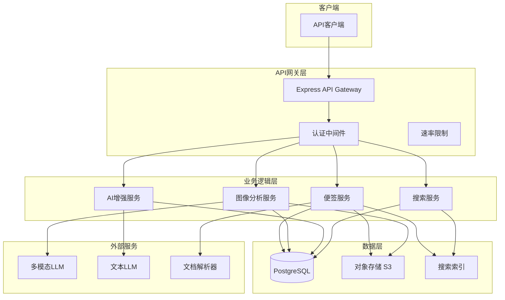

# 设计文档

## 概述

便签功能是一个后端API系统,用于内容捕获和AI增强。系统提供RESTful API接口支持创建包含文本、图片、文档和表格的便签,使用LLM技术自动分析和增强内容。设计采用Node.js/Express后端、PostgreSQL数据库和S3兼容对象存储的架构。

注意:本spec仅涵盖后端API开发,前端开发不在此范围内。

### 核心功能
- 文本输入与标签支持（#标签）
- 多模态内容上传（图片、文档、表格）
- LLM驱动的图像分析（文字识别和内容理解）
- AI文本增强（智能生成、校对、表格生成、脑图生成）
- 全文搜索与标签过滤

### 技术栈
- **后端**: Node.js + Express
- **数据库**: PostgreSQL + Prisma ORM
- **对象存储**: S3兼容服务（AWS S3 / MinIO）
- **LLM服务**: 
  - 多模态LLM（图像分析）：GPT-4 Vision / Claude 3 / Qwen-VL
  - 文本LLM（文本增强）：GPT-4 / Claude 3 / Qwen

## 架构

### 系统架构图



### 数据流

#### 1. 文本便签创建流程
```
API请求 → 标签解析 → JSON序列化 → 数据库存储 → 搜索索引更新 → API响应
```

#### 2. 图片便签创建流程
```
API请求 → 对象存储 → 多模态LLM分析 → 结构化数据提取 → 数据库存储 → 搜索索引更新 → API响应
```

#### 3. AI增强流程
```
API请求 → 发送到LLM → 处理响应 → 更新便签 → 数据库存储 → API响应
```

## 组件和接口

### 后端API接口

#### 便签API

```typescript
// POST /api/notes - 创建便签
interface CreateNoteRequest {
  content: string;
  tags: string[];
  attachments?: AttachmentReference[];
}

interface CreateNoteResponse {
  id: string;
  content: string;
  tags: string[];
  attachments: Attachment[];
  createdAt: string;
  updatedAt: string;
}

// GET /api/notes/:id - 获取便签
interface GetNoteResponse {
  id: string;
  content: string;
  tags: string[];
  attachments: Attachment[];
  createdAt: string;
  updatedAt: string;
}

// PUT /api/notes/:id - 更新便签
interface UpdateNoteRequest {
  content?: string;
  tags?: string[];
}

// DELETE /api/notes/:id - 删除便签
interface DeleteNoteResponse {
  success: boolean;
}

// GET /api/notes - 列出便签
interface ListNotesRequest {
  page: number;
  limit: number;
  tags?: string[];
  sortBy?: 'createdAt' | 'updatedAt';
  order?: 'asc' | 'desc';
}

interface ListNotesResponse {
  notes: Note[];
  total: number;
  page: number;
  limit: number;
}
```

#### 附件API

```typescript
// POST /api/attachments/upload - 上传附件
interface UploadAttachmentRequest {
  file: File;
  type: AttachmentType;
  noteId?: string;
}

interface UploadAttachmentResponse {
  id: string;
  url: string;
  type: AttachmentType;
  size: number;
  mimeType: string;
  analysis?: ImageAnalysis | DocumentAnalysis;
}

// GET /api/attachments/:id - 获取附件
interface GetAttachmentResponse {
  id: string;
  url: string;
  type: AttachmentType;
  analysis?: ImageAnalysis | DocumentAnalysis;
}
```

#### 图像分析API

```typescript
// POST /api/image-analysis - 分析图片
interface ImageAnalysisRequest {
  imageId: string;
  analysisType: 'text' | 'content' | 'full';
}

interface ImageAnalysisResponse {
  imageId: string;
  textContent?: string;
  description?: string;
  tags?: string[];
  metadata: {
    width: number;
    height: number;
    format: string;
  };
}
```

#### AI增强API

```typescript
// POST /api/ai/generate - 智能生成
interface GenerateRequest {
  text: string;
  context?: string;
}

interface GenerateResponse {
  expandedText: string;
  imagePrompt: string;
}

// POST /api/ai/proofread - 智能校对
interface ProofreadRequest {
  text: string;
}

interface ProofreadResponse {
  correctedText: string;
  changes: Change[];
}

interface Change {
  type: 'spelling' | 'grammar' | 'punctuation' | 'word-choice';
  original: string;
  corrected: string;
  position: { start: number; end: number };
}

// POST /api/ai/generate-table - 生成表格
interface GenerateTableRequest {
  text: string;
}

interface GenerateTableResponse {
  table: {
    headers: string[];
    rows: string[][];
  };
}

// POST /api/ai/generate-mindmap - 生成脑图
interface GenerateMindmapRequest {
  text: string;
}

interface GenerateMindmapResponse {
  mindmap: {
    central: string;
    branches: Branch[];
  };
}

interface Branch {
  label: string;
  children?: Branch[];
}
```

#### 搜索API

```typescript
// GET /api/search - 搜索便签
interface SearchRequest {
  query: string;
  tags?: string[];
  page: number;
  limit: number;
}

interface SearchResponse {
  results: SearchResult[];
  total: number;
  page: number;
  limit: number;
}

interface SearchResult {
  note: Note;
  highlights: {
    field: 'title' | 'content' | 'tags';
    snippet: string;
  }[];
  score: number;
}
```

## 数据模型

### 数据库Schema（Prisma）

```prisma
model Note {
  id          String   @id @default(uuid())
  userId      String
  content     String   @db.Text
  tags        String[]
  createdAt   DateTime @default(now())
  updatedAt   DateTime @updatedAt
  
  attachments Attachment[]
  user        User     @relation(fields: [userId], references: [id])
  
  @@index([userId])
  @@index([tags])
  @@index([createdAt])
}

model Attachment {
  id          String         @id @default(uuid())
  noteId      String
  type        AttachmentType
  storageKey  String         // S3对象键
  url         String
  size        Int
  mimeType    String
  createdAt   DateTime       @default(now())
  
  analysis    AttachmentAnalysis?
  note        Note           @relation(fields: [noteId], references: [id], onDelete: Cascade)
  
  @@index([noteId])
}

enum AttachmentType {
  IMAGE
  DOCUMENT
  TABLE
}

model AttachmentAnalysis {
  id           String     @id @default(uuid())
  attachmentId String     @unique
  textContent  String?    @db.Text
  description  String?    @db.Text
  tags         String[]
  metadata     Json
  createdAt    DateTime   @default(now())
  
  attachment   Attachment @relation(fields: [attachmentId], references: [id], onDelete: Cascade)
}

model User {
  id        String   @id @default(uuid())
  email     String   @unique
  name      String
  createdAt DateTime @default(now())
  
  notes     Note[]
}
```

### JSON数据结构

#### 便签JSON格式
```json
{
  "id": "uuid",
  "userId": "uuid",
  "content": "这是一条便签 #工作 #重要",
  "tags": ["工作", "重要"],
  "attachments": [
    {
      "id": "uuid",
      "type": "image",
      "url": "https://s3.../image.jpg",
      "analysis": {
        "textContent": "识别的文字内容",
        "description": "图片描述",
        "tags": ["风景", "自然"]
      }
    }
  ],
  "createdAt": "2024-01-01T00:00:00Z",
  "updatedAt": "2024-01-01T00:00:00Z"
}
```

#### 表格JSON格式
```json
{
  "headers": ["列1", "列2", "列3"],
  "rows": [
    ["数据1", "数据2", "数据3"],
    ["数据4", "数据5", "数据6"]
  ]
}
```

#### 脑图JSON格式
```json
{
  "central": "中心主题",
  "branches": [
    {
      "label": "分支1",
      "children": [
        { "label": "子分支1.1" },
        { "label": "子分支1.2" }
      ]
    },
    {
      "label": "分支2",
      "children": [
        { "label": "子分支2.1" }
      ]
    }
  ]
}
```

## LLM提示词设计

### 图像分析提示词

#### 文字识别提示词
```
你是一个专业的图像文字识别助手。请分析这张图片并提取其中的所有文字内容。

要求：
1. 识别图片中的所有可见文字，包括印刷体和手写体
2. 保持原文的格式和结构
3. 如果文字不清晰，标注[不清晰]
4. 按照从上到下、从左到右的顺序输出

输出格式：
纯文本，保持原文格式
```

#### 图像内容分析提示词
```
你是一个专业的图像内容分析助手。请分析这张图片并提供详细描述。

要求：
1. 描述图片的主要内容和主题
2. 识别图片类型（风景、人物、产品、艺术作品等）
3. 提取关键元素和特征
4. 生成3-5个相关标签

输出格式（JSON）：
{
  "description": "详细描述",
  "type": "图片类型",
  "elements": ["元素1", "元素2"],
  "tags": ["标签1", "标签2", "标签3"]
}
```

### AI增强提示词

#### 智能生成提示词
```
你是一个创意写作助手。请根据用户提供的文本进行扩展，并生成适合图像生成的提示词。

用户文本：
{text}

要求：
1. 扩展文本：在保持原意的基础上，增加细节、描述和想象力
2. 图像提示词：生成一个详细的、适合Midjourney/DALL-E的图像生成提示词
3. 扩展后的文本应该是原文的2-3倍长度
4. 图像提示词应包含风格、构图、色彩、氛围等元素

输出格式（JSON）：
{
  "expandedText": "扩展后的文本",
  "imagePrompt": "图像生成提示词"
}
```

#### 智能校对提示词
```
你是一个专业的文本校对助手。请校对以下文本，纠正错误但保持原意和风格。

文本：
{text}

要求：
1. 纠正拼写错误
2. 修正语法错误
3. 纠正标点符号错误
4. 修正明显的用词不当
5. 保持原意、写作风格和句式结构
6. 列出所有修改

输出格式（JSON）：
{
  "correctedText": "校对后的文本",
  "changes": [
    {
      "type": "spelling|grammar|punctuation|word-choice",
      "original": "原文",
      "corrected": "修正后",
      "position": {"start": 0, "end": 10}
    }
  ]
}
```

#### 生成表格提示词
```
你是一个数据整理助手。请从以下文本中提取信息并整理成表格。

文本：
{text}

要求：
1. 识别文本中的结构化信息
2. 确定最合适的表格结构（列数和列名）
3. 提取数据并填充表格
4. 确保数据准确、清晰、可读

输出格式（JSON）：
{
  "headers": ["列1", "列2", "列3"],
  "rows": [
    ["数据1", "数据2", "数据3"],
    ["数据4", "数据5", "数据6"]
  ]
}
```

#### 生成脑图提示词
```
你是一个思维导图专家。请将以下文本转换为脑图结构。

文本：
{text}

要求：
1. 识别中心主题
2. 创建3-6个一级分支
3. 为每个一级分支创建2-4个二级分支（如果适用）
4. 使用简短的关键词作为标签（不超过10个字）
5. 确保层级结构清晰

输出格式（JSON）：
{
  "central": "中心主题",
  "branches": [
    {
      "label": "分支1",
      "children": [
        {"label": "子分支1.1"},
        {"label": "子分支1.2"}
      ]
    }
  ]
}
```


## 正确性属性

属性是一个特征或行为，应该在系统的所有有效执行中保持为真——本质上是关于系统应该做什么的正式陈述。属性是人类可读规范和机器可验证正确性保证之间的桥梁。

### 属性1：标签识别和存储

*对于任何*包含"#"符号的文本输入，系统应该正确识别所有标签并将它们与便签内容关联存储。

**验证：需求 1.2, 1.3**

### 属性2：文本数据往返一致性

*对于任何*便签文本和标签，将其序列化为JSON然后反序列化应该产生等价的数据。

**验证：需求 1.4, 12.1**

### 属性3：便签存储完整性

*对于任何*创建的便签，保存后从数据库查询应该返回相同的内容、标签和元数据。

**验证：需求 1.5**

### 属性4：图片上传和分析端到端

*对于任何*上传的图片，系统应该将文件保存到对象存储，使用LLM分析内容，并将结构化结果存储到数据库，同时保持图片和分析结果的关联。

**验证：需求 2.1, 2.2, 2.5, 2.6, 12.3**

### 属性5：LLM图像分析输出结构

*对于任何*图像分析请求，LLM的输出应该包含有效的结构化数据（文字内容和/或描述）。

**验证：需求 2.4, 2.5**

### 属性6：文档处理端到端

*对于任何*上传的文档，系统应该保存到对象存储，使用现有管道解析，并将结构化内容存储到数据库。

**验证：需求 3.1, 3.2, 3.3**

### 属性7：表格处理端到端

*对于任何*上传的表格文件，系统应该保存到对象存储，使用现有管道解析，并将结构化数据存储到数据库。

**验证：需求 4.1, 4.2, 4.3**

### 属性8：智能生成输出格式

*对于任何*文本扩展请求，AI增强器的输出应该包含扩展后的文本和图像生成提示词两个字段。

**验证：需求 5.3, 5.4**

### 属性9：智能校对保留原意

*对于任何*不包含明显错误的文本，智能校对应该返回与原文语义等价的文本。

**验证：需求 6.1, 6.2, 6.3, 6.4**

### 属性10：表格生成JSON有效性

*对于任何*表格生成请求，输出应该是有效的JSON格式，包含headers和rows字段。

**验证：需求 7.4**

### 属性11：表格结构合理性

*对于任何*生成的表格，headers数组的长度应该等于每个row数组的长度。

**验证：需求 7.2**

### 属性12：脑图结构完整性

*对于任何*脑图生成请求，输出应该包含中心主题和3-6个一级分支，每个分支标签长度应该合理（不超过20个字符）。

**验证：需求 8.1, 8.2, 8.4**

### 属性13：脑图JSON有效性

*对于任何*脑图生成请求，输出应该是有效的JSON格式，包含central和branches字段，且branches是有效的层级结构。

**验证：需求 8.3, 8.5**

### 属性14：搜索完整性

*对于任何*搜索查询，搜索引擎应该在便签的标题、内容和标签字段中查找匹配项，并返回所有包含该关键词的便签。

**验证：需求 9.2, 9.3, 9.4**

### 属性15：搜索结果高亮

*对于任何*搜索结果，返回的数据应该包含高亮信息，指示匹配关键词的位置。

**验证：需求 9.5**

### 属性16：API错误响应格式

*对于任何*API错误,响应应该包含标准的错误格式,包含错误代码和消息。

**验证：需求 11.2, 11.3**

### 属性17：文件存储唯一性

*对于任何*保存到对象存储的文件，应该使用唯一标识符作为存储键，确保不会发生冲突。

**验证：需求 12.2**

### 属性18：存储重试机制

*对于任何*存储操作失败的情况，系统应该重试最多3次；如果所有重试都失败，应该在本地保留数据。

**验证：需求 12.4, 12.5**

## 错误处理

### 错误类型

#### 1. 客户端错误（4xx）
- **400 Bad Request**: 请求参数无效
- **401 Unauthorized**: 未认证
- **403 Forbidden**: 无权限
- **404 Not Found**: 资源不存在
- **413 Payload Too Large**: 文件过大
- **429 Too Many Requests**: 请求过于频繁

#### 2. 服务器错误（5xx）
- **500 Internal Server Error**: 服务器内部错误
- **502 Bad Gateway**: LLM服务不可用
- **503 Service Unavailable**: 服务暂时不可用
- **504 Gateway Timeout**: LLM请求超时

### 错误响应格式

```typescript
interface ErrorResponse {
  error: {
    code: string;
    message: string;
    details?: any;
  };
}
```

### 错误处理策略

#### 1. 网络错误
```typescript
// 自动重试策略
const retryConfig = {
  maxRetries: 3,
  backoff: 'exponential', // 100ms, 200ms, 400ms
  retryableErrors: ['ECONNRESET', 'ETIMEDOUT', 'ENOTFOUND']
};
```

#### 2. LLM服务错误
```typescript
// 降级策略
if (llmServiceUnavailable) {
  // 1. 使用缓存结果（如果有）
  // 2. 返回基础功能（不使用AI增强）
  // 3. 将请求加入队列，稍后重试
}
```

#### 3. 存储错误
```typescript
// 本地持久化
if (storageOperationFailed && retriesExhausted) {
  // 1. 保存到本地存储（AsyncStorage / IndexedDB）
  // 2. 显示通知给用户
  // 3. 后台同步队列
}
```

#### 4. 文件上传错误
```typescript
// 分块上传和断点续传
const uploadConfig = {
  chunkSize: 1024 * 1024, // 1MB
  resumable: true,
  maxRetries: 3
};
```

### 错误日志

```typescript
interface ErrorLog {
  timestamp: string;
  userId: string;
  operation: string;
  errorCode: string;
  errorMessage: string;
  stackTrace?: string;
  context: {
    noteId?: string;
    attachmentId?: string;
    requestId: string;
  };
}
```

## 测试策略

### 双重测试方法

本系统采用单元测试和基于属性的测试相结合的方法，以确保全面覆盖：

- **单元测试**：验证特定示例、边缘情况和错误条件
- **属性测试**：通过随机化验证所有输入的通用属性
- 两者是互补的，对于全面覆盖都是必要的

### 单元测试

单元测试专注于：
- 特定示例，展示正确行为
- 组件之间的集成点
- 边缘情况和错误条件

避免编写过多的单元测试——基于属性的测试处理大量输入的覆盖。

### 基于属性的测试

#### 配置
- 每个属性测试最少100次迭代（由于随机化）
- 每个测试必须引用其设计文档属性
- 标签格式：**Feature: notes-feature, Property {number}: {property_text}**

#### 测试库
- **JavaScript/TypeScript**: fast-check
- **Python**: Hypothesis

#### 示例属性测试

```typescript
import fc from 'fast-check';

// Feature: notes-feature, Property 2: 文本数据往返一致性
describe('Note serialization round-trip', () => {
  it('should preserve data through JSON serialization', () => {
    fc.assert(
      fc.property(
        fc.record({
          content: fc.string(),
          tags: fc.array(fc.string())
        }),
        (note) => {
          const serialized = JSON.stringify(note);
          const deserialized = JSON.parse(serialized);
          expect(deserialized).toEqual(note);
        }
      ),
      { numRuns: 100 }
    );
  });
});

// Feature: notes-feature, Property 1: 标签识别和存储
describe('Tag extraction', () => {
  it('should extract all hashtags from text', () => {
    fc.assert(
      fc.property(
        fc.array(fc.string().filter(s => !s.includes('#'))),
        (words) => {
          const tags = words.slice(0, 3);
          const text = words.join(' ') + ' ' + tags.map(t => `#${t}`).join(' ');
          const extracted = extractTags(text);
          expect(extracted).toEqual(tags);
        }
      ),
      { numRuns: 100 }
    );
  });
});

// Feature: notes-feature, Property 11: 表格结构合理性
describe('Table structure', () => {
  it('should have consistent row lengths', () => {
    fc.assert(
      fc.property(
        fc.record({
          headers: fc.array(fc.string(), { minLength: 1, maxLength: 10 }),
          rows: fc.array(fc.array(fc.string()))
        }),
        async (tableData) => {
          const result = await generateTable(JSON.stringify(tableData));
          const headerLength = result.headers.length;
          result.rows.forEach(row => {
            expect(row.length).toBe(headerLength);
          });
        }
      ),
      { numRuns: 100 }
    );
  });
});

// Feature: notes-feature, Property 14: 搜索完整性
describe('Search completeness', () => {
  it('should find all notes containing the keyword', () => {
    fc.assert(
      fc.property(
        fc.array(fc.record({
          content: fc.string(),
          tags: fc.array(fc.string())
        })),
        fc.string(),
        async (notes, keyword) => {
          // 创建测试数据
          await Promise.all(notes.map(n => createNote(n)));
          
          // 执行搜索
          const results = await searchNotes(keyword);
          
          // 验证所有包含关键词的便签都被返回
          const expected = notes.filter(n => 
            n.content.includes(keyword) || 
            n.tags.some(t => t.includes(keyword))
          );
          
          expect(results.length).toBe(expected.length);
        }
      ),
      { numRuns: 100 }
    );
  });
});
```

### 集成测试

```typescript
describe('End-to-end note creation with image', () => {
  it('should create note with image analysis', async () => {
    // 1. 上传图片
    const image = await uploadImage(testImage);
    expect(image.id).toBeDefined();
    
    // 2. 等待分析完成
    const analysis = await waitForAnalysis(image.id);
    expect(analysis.textContent).toBeDefined();
    
    // 3. 创建便签
    const note = await createNote({
      content: '测试便签 #测试',
      tags: ['测试'],
      attachments: [{ id: image.id }]
    });
    
    // 4. 验证便签包含图片和分析结果
    const retrieved = await getNote(note.id);
    expect(retrieved.attachments[0].analysis).toEqual(analysis);
  });
});
```

### 性能测试

```typescript
describe('Performance requirements', () => {
  it('should save text data within 500ms', async () => {
    const start = Date.now();
    await createNote({ content: 'test', tags: [] });
    const duration = Date.now() - start;
    expect(duration).toBeLessThan(500);
  });
  
  it('should complete image upload within 3s', async () => {
    const start = Date.now();
    await uploadImage(testImage);
    const duration = Date.now() - start;
    expect(duration).toBeLessThan(3000);
  });
  
  it('should return search results within 500ms', async () => {
    const start = Date.now();
    await searchNotes('test');
    const duration = Date.now() - start;
    expect(duration).toBeLessThan(500);
  });
});
```

### 测试覆盖率目标

- **单元测试覆盖率**: > 80%
- **属性测试覆盖率**: 所有正确性属性
- **集成测试覆盖率**: 所有主要用户流程
- **E2E测试覆盖率**: 关键业务场景

### 测试环境

#### 开发环境
- 本地PostgreSQL数据库
- MinIO（本地S3兼容存储）
- Mock LLM服务（快速响应）

#### 测试环境
- 测试数据库（隔离）
- 测试对象存储
- Mock LLM服务（可配置响应）

#### 生产环境
- 生产数据库
- AWS S3 / 生产对象存储
- 真实LLM服务
