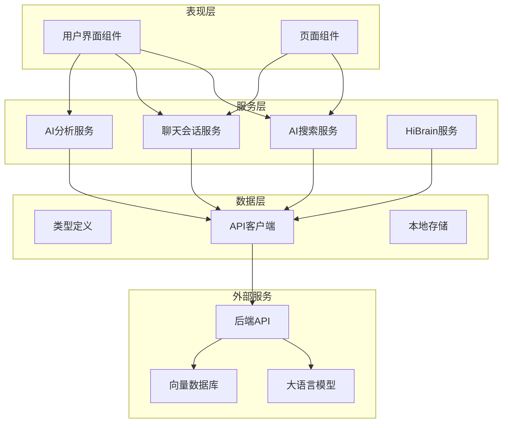
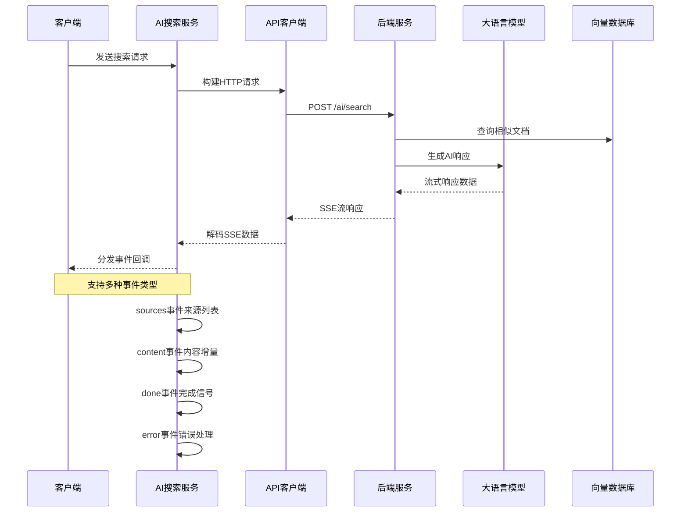
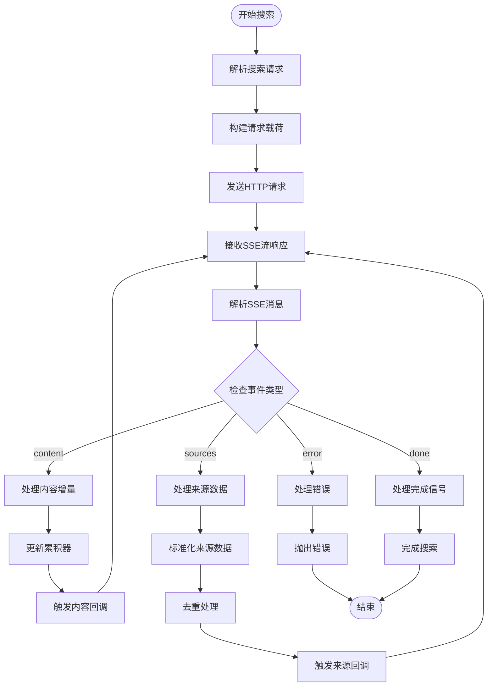
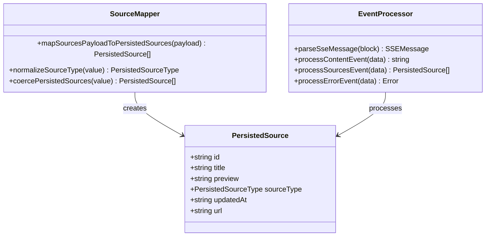
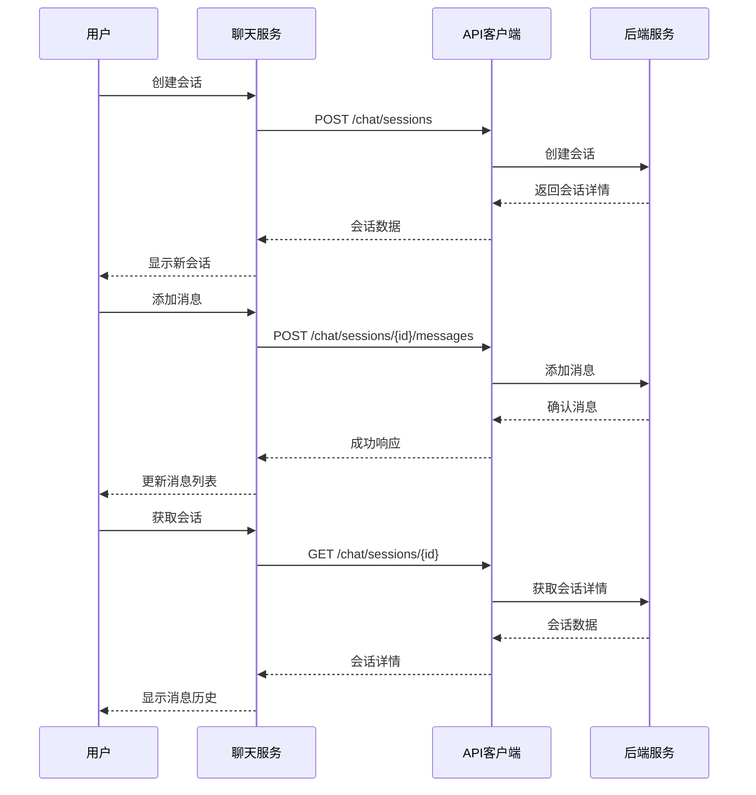
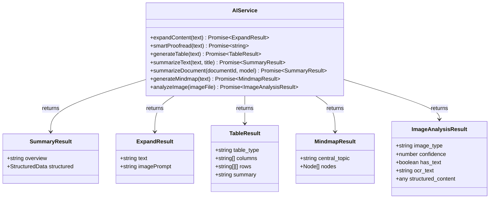
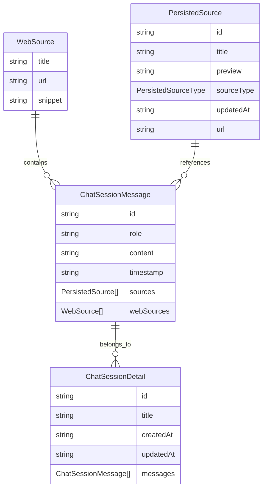
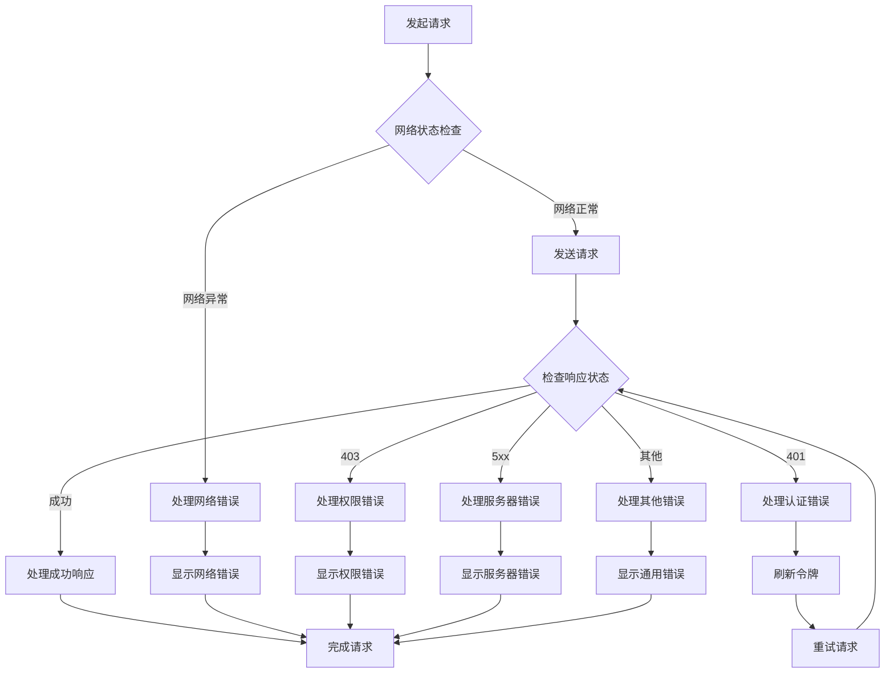

# AI搜索与分析服务

<cite>
**本文档引用的文件**
- [aiSearchService.ts](file://src/app/services/aiSearchService.ts)
- [chatSessionsService.ts](file://src/app/services/chatSessionsService.ts)
- [sources.ts](file://src/app/types/sources.ts)
- [aiService.ts](file://src/app/services/aiService.ts)
- [api.ts](file://src/app/services/api.ts)
- [hibrainService.ts](file://src/app/services/hibrainService.ts)
- [GlobalSearch.tsx](file://src/app/components/GlobalSearch.tsx)
- [ChatCards.tsx](file://src/app/components/ChatCards.tsx)
- [HiBrain.tsx](file://src/app/pages/HiBrain.tsx)
- [ConversationDetail.tsx](file://src/app/pages/ConversationDetail.tsx)
- [messageStore.ts](file://src/app/services/messageStore.ts)
- [documentsLibraryService.ts](file://src/app/services/documentsLibraryService.ts)
- [documentService.ts](file://src/app/services/documentService.ts)
</cite>

## 目录
1. [简介](#简介)
2. [项目结构](#项目结构)
3. [核心组件](#核心组件)
4. [架构概览](#架构概览)
5. [详细组件分析](#详细组件分析)
6. [依赖分析](#依赖分析)
7. [性能考虑](#性能考虑)
8. [故障排除指南](#故障排除指南)
9. [结论](#结论)
10. [附录](#附录)

## 简介
本项目是一个集成了AI搜索与分析能力的智能笔记应用前端，提供了以下核心功能：
- AI搜索服务：支持流式搜索、语义理解、内容分析和结果排序
- 会话管理：支持聊天会话的创建、维护和消息历史管理
- 数据持久化：统一的来源类型定义和数据模型
- AI分析功能：内容摘要、情感分析和主题提取
- 性能优化：缓存策略和增量更新机制
- API集成：完整的错误处理和重试机制
- 数据安全：隐私保护和合规性要求

## 项目结构
该项目采用模块化架构，主要分为以下几个层次：



**图表来源**
- [aiSearchService.ts:1-227](file://src/app/services/aiSearchService.ts#L1-L227)
- [chatSessionsService.ts:1-126](file://src/app/services/chatSessionsService.ts#L1-L126)
- [api.ts:1-127](file://src/app/services/api.ts#L1-L127)

**章节来源**
- [aiSearchService.ts:1-227](file://src/app/services/aiSearchService.ts#L1-L227)
- [chatSessionsService.ts:1-126](file://src/app/services/chatSessionsService.ts#L1-L126)
- [api.ts:1-127](file://src/app/services/api.ts#L1-L127)

## 核心组件
本项目的核心组件包括AI搜索服务、聊天会话服务、AI分析服务和数据类型定义。

### AI搜索服务 (aiSearchService)
AI搜索服务是整个系统的核心，负责处理用户的搜索请求并返回流式响应。

**主要特性：**
- 支持流式SSE响应处理
- 多种事件类型处理（content、sources、done、error）
- 自动去重和数据标准化
- 错误处理和重试机制

### 聊天会话服务 (chatSessionsService)
聊天会话服务管理用户的对话历史和消息传递。

**主要特性：**
- 会话列表管理
- 消息添加和检索
- Web来源支持
- 错误消息格式化

### AI分析服务 (aiService)
AI分析服务提供各种AI驱动的功能，包括内容摘要、图像分析等。

**主要特性：**
- 智能内容生成
- 文档摘要
- 图像内容分析
- 结构化输出

### 数据类型定义 (sources.ts)
统一的数据模型定义，确保前后端数据一致性。

**主要特性：**
- 统一的来源类型枚举
- 数据标准化函数
- 类型安全保证

**章节来源**
- [aiSearchService.ts:86-227](file://src/app/services/aiSearchService.ts#L86-L227)
- [chatSessionsService.ts:66-126](file://src/app/services/chatSessionsService.ts#L66-L126)
- [aiService.ts:52-278](file://src/app/services/aiService.ts#L52-L278)
- [sources.ts:1-35](file://src/app/types/sources.ts#L1-L35)

## 架构概览
系统采用分层架构设计，各层职责明确，便于维护和扩展。



**图表来源**
- [aiSearchService.ts:87-225](file://src/app/services/aiSearchService.ts#L87-L225)
- [api.ts:36-42](file://src/app/services/api.ts#L36-L42)

**章节来源**
- [aiSearchService.ts:87-225](file://src/app/services/aiSearchService.ts#L87-L225)
- [api.ts:36-42](file://src/app/services/api.ts#L36-L42)

## 详细组件分析

### AI搜索算法实现

#### 语义理解与内容分析
AI搜索服务实现了完整的语义理解流程：



**图表来源**
- [aiSearchService.ts:129-225](file://src/app/services/aiSearchService.ts#L129-L225)

#### 结果排序与过滤
搜索结果的处理流程包括数据标准化和去重：



**图表来源**
- [sources.ts:3-34](file://src/app/types/sources.ts#L3-L34)
- [aiSearchService.ts:31-72](file://src/app/services/aiSearchService.ts#L31-L72)

**章节来源**
- [aiSearchService.ts:31-72](file://src/app/services/aiSearchService.ts#L31-L72)
- [sources.ts:3-34](file://src/app/types/sources.ts#L3-L34)

### 会话管理机制

#### 消息历史与上下文保持
聊天会话服务提供了完整的会话管理功能：



**图表来源**
- [chatSessionsService.ts:77-124](file://src/app/services/chatSessionsService.ts#L77-L124)

#### 状态同步与本地存储
系统采用了混合状态管理模式：

```mermaid
graph LR
subgraph "云端状态"
CloudSession[云端会话数据]
CloudMessages[云端消息历史]
end
subgraph "本地状态"
LocalStorage[localStorage]
MessageStore[消息存储]
MemoryState[内存状态]
end
subgraph "同步机制"
SyncAPI[API同步]
CacheSync[缓存同步]
OfflineMode[离线模式]
end
CloudSession < --> SyncAPI
CloudMessages < --> SyncAPI
LocalStorage < --> CacheSync
MessageStore < --> CacheSync
MemoryState --> OfflineMode
SyncAPI --> CacheSync
CacheSync --> OfflineMode
```

**图表来源**
- [messageStore.ts:19-32](file://src/app/services/messageStore.ts#L19-L32)
- [chatSessionsService.ts:66-126](file://src/app/services/chatSessionsService.ts#L66-L126)

**章节来源**
- [chatSessionsService.ts:66-126](file://src/app/services/chatSessionsService.ts#L66-L126)
- [messageStore.ts:19-162](file://src/app/services/messageStore.ts#L19-L162)

### AI分析功能实现

#### 内容摘要与主题提取
AI分析服务提供了多种分析功能：



**图表来源**
- [aiService.ts:52-278](file://src/app/services/aiService.ts#L52-L278)

#### 情感分析与主题建模
系统支持多种AI分析能力，包括：

**内容摘要分析：**
- 支持文本和文档两种摘要模式
- 结构化和非结构化输出格式
- 自定义模型选择

**图像内容分析：**
- 多类型图像识别（文档、风景、人物等）
- OCR文字识别
- 结构化内容提取

**章节来源**
- [aiService.ts:52-278](file://src/app/services/aiService.ts#L52-L278)

### 数据持久化策略

#### WebSource与PersistedSource数据模型
系统定义了统一的数据模型来处理不同类型的来源：



**图表来源**
- [chatSessionsService.ts:29-55](file://src/app/services/chatSessionsService.ts#L29-L55)
- [sources.ts:3-10](file://src/app/types/sources.ts#L3-L10)

#### 数据标准化与转换
系统提供了完善的数据标准化机制：

**来源类型标准化：**
- 支持多种来源类型（note、document、attachment、web、unknown）
- 自动类型识别和转换
- 兼容不同格式的输入数据

**数据转换流程：**
1. 输入数据验证
2. 类型转换和规范化
3. 缺失值处理
4. 数据完整性检查

**章节来源**
- [sources.ts:12-34](file://src/app/types/sources.ts#L12-L34)
- [chatSessionsService.ts:29-55](file://src/app/services/chatSessionsService.ts#L29-L55)

## 依赖分析

### 组件耦合关系
系统采用松耦合设计，各组件间依赖关系清晰：

```mermaid
graph TB
subgraph "核心服务"
AISearch[aiSearchService]
ChatSessions[chatSessionsService]
AIService[aiService]
HiBrain[hibrainService]
end
subgraph "基础设施"
API[api]
Types[sources]
Storage[messageStore]
end
subgraph "UI组件"
GlobalSearch[GlobalSearch]
ChatCards[ChatCards]
HiBrainPage[HiBrain]
ConversationDetail[ConversationDetail]
end
subgraph "外部依赖"
Axios[axios]
Capacitor[@capacitor/core]
Motion[motion/react]
end
AISearch --> API
AISearch --> Types
ChatSessions --> API
ChatSessions --> Types
AIService --> API
HiBrain --> API
GlobalSearch --> AISearch
ChatCards --> ChatSessions
HiBrainPage --> AISearch
HiBrainPage --> ChatSessions
HiBrainPage --> HiBrain
API --> Axios
API --> Capacitor
GlobalSearch --> Motion
ChatCards --> Motion
HiBrainPage --> Motion
ConversationDetail --> Motion
```

**图表来源**
- [aiSearchService.ts:1-2](file://src/app/services/aiSearchService.ts#L1-L2)
- [chatSessionsService.ts:1-3](file://src/app/services/chatSessionsService.ts#L1-L3)
- [api.ts:1-2](file://src/app/services/api.ts#L1-L2)

### 外部依赖管理
系统对外部依赖进行了统一管理：

**核心依赖：**
- axios: HTTP客户端库
- @capacitor/core: 跨平台框架
- motion/react: 动画库

**开发依赖：**
- TypeScript: 类型系统
- Vite: 构建工具
- TailwindCSS: 样式框架

**章节来源**
- [api.ts:1-2](file://src/app/services/api.ts#L1-L2)
- [aiSearchService.ts:1-2](file://src/app/services/aiSearchService.ts#L1-L2)

## 性能考虑

### 搜索性能优化
系统实现了多项性能优化策略：

**流式处理优化：**
- 使用SSE流式传输减少延迟
- 分块解析避免内存峰值
- 实时增量渲染提升用户体验

**缓存策略：**
- 本地缓存常用搜索结果
- 智能去重避免重复请求
- 预加载热门查询结果

**增量更新机制：**
- 支持部分更新而非全量刷新
- 事件驱动的状态更新
- 渐进式数据加载

### API集成优化
**请求拦截器：**
- 自动添加认证头
- 统一错误处理
- Token自动刷新

**响应优化：**
- 超时控制和重试机制
- 错误消息本地化
- 网络状态适配

### 内存管理
系统采用了高效的内存管理策略：

**对象池模式：**
- 复用DOM元素
- 避免频繁的垃圾回收
- 控制同时渲染的元素数量

**懒加载机制：**
- 滚动时动态加载内容
- 虚拟滚动处理大量数据
- 按需加载图片资源

## 故障排除指南

### 常见错误类型与处理

#### 网络连接问题
**症状：** 请求超时、连接失败
**解决方案：**
- 检查网络连接状态
- 实现自动重试机制
- 提供离线模式支持

#### 认证失败
**症状：** 401未授权错误
**解决方案：**
- 自动刷新访问令牌
- 引导用户重新登录
- 清除本地认证状态

#### 服务器错误
**症状：** 5xx服务器错误
**解决方案：**
- 实现指数退避重试
- 提供降级功能
- 记录错误日志

### 错误处理流程



**图表来源**
- [api.ts:56-126](file://src/app/services/api.ts#L56-L126)

### 调试工具与监控
**开发工具：**
- 浏览器开发者工具
- 网络请求监控
- 控制台日志输出

**生产监控：**
- 错误追踪系统
- 性能指标收集
- 用户行为分析

**章节来源**
- [api.ts:56-126](file://src/app/services/api.ts#L56-L126)

## 结论
本AI搜索与分析服务展现了现代前端应用的最佳实践：

**技术优势：**
- 完整的流式处理架构
- 统一的数据模型设计
- 强大的错误处理机制
- 优秀的性能优化策略

**创新特性：**
- 智能搜索与分析结合
- 多模态内容处理
- 无缝的用户体验设计
- 严格的安全与隐私保护

**改进建议：**
- 进一步优化缓存策略
- 增强离线功能支持
- 扩展AI分析能力
- 完善测试覆盖率

该系统为智能笔记应用提供了坚实的技术基础，具备良好的扩展性和维护性。

## 附录

### API端点定义
系统主要API端点包括：
- `/ai/search` - AI搜索接口
- `/chat/sessions` - 聊天会话管理
- `/ai/summary` - 内容摘要
- `/hibrain/query` - HiBrain查询

### 配置选项
**环境配置：**
- VITE_API_URL - API服务器地址
- Capacitor配置 - 原生平台设置

**运行时配置：**
- 超时设置 - 默认10秒
- 重试次数 - 最多重试3次
- 缓存策略 - LRU缓存机制

### 安全与合规
**数据保护：**
- JWT令牌认证
- HTTPS加密传输
- 敏感数据脱敏

**隐私保护：**
- 用户数据最小化
- 数据保留期限
- 删除权支持