# AI智能助手系统

<cite>
**本文档引用的文件**
- [HiBrain.tsx](file://src/app/pages/HiBrain.tsx)
- [HiBrainClassic.tsx](file://src/app/pages/HiBrainClassic.tsx)
- [aiService.ts](file://src/app/services/aiService.ts)
- [speechService.ts](file://src/app/services/speechService.ts)
- [hibrainService.ts](file://src/app/services/hibrainService.ts)
- [aiSearchService.ts](file://src/app/services/aiSearchService.ts)
- [chatSessionsService.ts](file://src/app/services/chatSessionsService.ts)
- [audioRecordService.ts](file://src/app/services/audioRecordService.ts)
- [api.ts](file://src/app/services/api.ts)
- [ChatCards.tsx](file://src/app/components/ChatCards.tsx)
- [sources.ts](file://src/app/types/sources.ts)
- [telemetryService.ts](file://src/app/services/telemetryService.ts)
- [README.md](file://README.md)
</cite>

## 目录
1. [简介](#简介)
2. [项目结构](#项目结构)
3. [核心组件](#核心组件)
4. [架构总览](#架构总览)
5. [详细组件分析](#详细组件分析)
6. [依赖分析](#依赖分析)
7. [性能考量](#性能考量)
8. [故障排查指南](#故障排查指南)
9. [结论](#结论)
10. [附录](#附录)

## 简介
本项目为“AI智能助手系统”的前端实现，围绕HiBrain AI助手构建，提供自然语言处理、知识分析与智能推荐能力。系统通过统一的服务层封装后端API，集成语音识别与合成（通过Capacitor插件）、流式搜索与对话、知识图谱与笔记串联、以及聊天会话管理。本文档面向开发者与产品人员，系统阐述功能设计、实现原理、架构与扩展方法，并给出性能优化、隐私与安全建议。

## 项目结构
前端采用React + Capacitor混合开发，核心目录与职责如下：
- 页面层：HiBrain.tsx为主入口，负责知识生长面板、AI串联、搜索与聊天卡片渲染。
- 组件层：ChatCards.tsx提供富卡片系统（图像、图谱、笔记、增长、来源）。
- 服务层：aiService.ts、speechService.ts、hibrainService.ts、aiSearchService.ts、chatSessionsService.ts、audioRecordService.ts、api.ts等，封装API调用、鉴权、错误处理与流式响应。
- 类型与工具：sources.ts定义持久化来源类型，telemetryService.ts提供遥测上报。
- 平台集成：README.md说明AudioRecord Capacitor插件的使用方式。

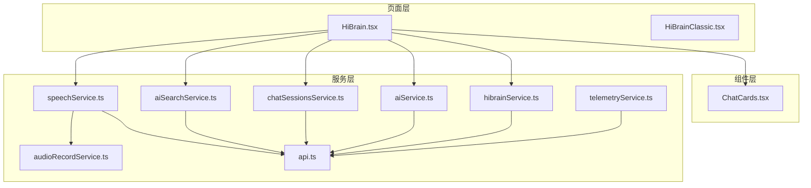

图表来源
- [HiBrain.tsx:1-2037](file://src/app/pages/HiBrain.tsx#L1-L2037)
- [ChatCards.tsx:1-946](file://src/app/components/ChatCards.tsx#L1-L946)
- [aiService.ts:1-278](file://src/app/services/aiService.ts#L1-L278)
- [speechService.ts:1-759](file://src/app/services/speechService.ts#L1-L759)
- [audioRecordService.ts:1-35](file://src/app/services/audioRecordService.ts#L1-L35)
- [hibrainService.ts:1-118](file://src/app/services/hibrainService.ts#L1-L118)
- [aiSearchService.ts:1-227](file://src/app/services/aiSearchService.ts#L1-L227)
- [chatSessionsService.ts:1-126](file://src/app/services/chatSessionsService.ts#L1-L126)
- [api.ts:1-127](file://src/app/services/api.ts#L1-L127)
- [telemetryService.ts:1-22](file://src/app/services/telemetryService.ts#L1-L22)

章节来源
- [HiBrain.tsx:1-2037](file://src/app/pages/HiBrain.tsx#L1-L2037)
- [README.md:1-41](file://README.md#L1-L41)

## 核心组件
- 知识生长与串联：HiBrain.tsx中的“知识生长面板”与“AI串联覆盖层”，通过聚类算法将同主题碎片组织为“主题簇”，并提供“生成完整攻略”的可视化流程。
- 富卡片系统：ChatCards.tsx提供图像、知识图谱、笔记、增长、来源五类卡片，支持来源高亮、图谱节点联动、笔记预览与加入串联。
- AI服务封装：aiService.ts提供内容扩写、智能校对、表格生成、文本/文档摘要、脑图生成与图片分析等能力，统一错误映射与结构化解析。
- 语音识别：speechService.ts统一封装原生、Web Speech API与云端流式识别，支持权限检查、兜底策略、事件回调与超时控制。
- 搜索与对话：aiSearchService.ts以SSE流式接收内容增量与来源列表，支持消息上下文传递；chatSessionsService.ts管理会话与消息。
- 知识检索：hibrainService.ts封装RAG查询、记忆增删与遗忘接口。
- 基础设施：api.ts统一配置Axios实例、鉴权头注入与刷新逻辑；telemetryService.ts提供轻量遥测上报。

章节来源
- [HiBrain.tsx:68-98](file://src/app/pages/HiBrain.tsx#L68-L98)
- [ChatCards.tsx:64-83](file://src/app/components/ChatCards.tsx#L64-L83)
- [aiService.ts:52-277](file://src/app/services/aiService.ts#L52-L277)
- [speechService.ts:92-758](file://src/app/services/speechService.ts#L92-L758)
- [aiSearchService.ts:86-226](file://src/app/services/aiSearchService.ts#L86-L226)
- [chatSessionsService.ts:66-125](file://src/app/services/chatSessionsService.ts#L66-L125)
- [hibrainService.ts:89-117](file://src/app/services/hibrainService.ts#L89-L117)
- [api.ts:36-126](file://src/app/services/api.ts#L36-L126)
- [telemetryService.ts:9-21](file://src/app/services/telemetryService.ts#L9-L21)

## 架构总览
系统采用“页面-组件-服务-后端API”的分层架构，页面与组件负责交互与渲染，服务层负责业务编排与API封装，后端通过统一的API网关提供AI、语音、搜索、会话等功能。

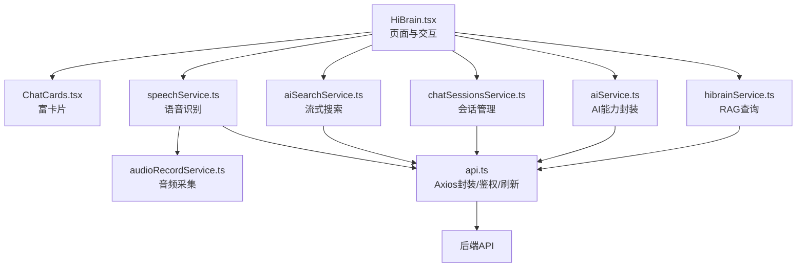

图表来源
- [HiBrain.tsx:1-2037](file://src/app/pages/HiBrain.tsx#L1-L2037)
- [ChatCards.tsx:1-946](file://src/app/components/ChatCards.tsx#L1-L946)
- [speechService.ts:1-759](file://src/app/services/speechService.ts#L1-L759)
- [audioRecordService.ts:1-35](file://src/app/services/audioRecordService.ts#L1-L35)
- [aiSearchService.ts:1-227](file://src/app/services/aiSearchService.ts#L1-L227)
- [chatSessionsService.ts:1-126](file://src/app/services/chatSessionsService.ts#L1-L126)
- [hibrainService.ts:1-118](file://src/app/services/hibrainService.ts#L1-L118)
- [aiService.ts:1-278](file://src/app/services/aiService.ts#L1-L278)
- [api.ts:1-127](file://src/app/services/api.ts#L1-L127)

## 详细组件分析

### 知识生长与串联（HiBrain.tsx）
- 聚类算法：基于笔记标签的并查集合并，形成“主题簇”，统计完成度与阶段（种子/萌芽/生长/成熟），驱动UI展示与可串联提示。
- 串联流程：通过“AI串联覆盖层”模拟生成进度，最终产出“完整攻略”，并支持进入策略视图。
- 交互体验：使用Motion动画与Portal渲染，确保覆盖层与主内容的层级关系与流畅过渡。

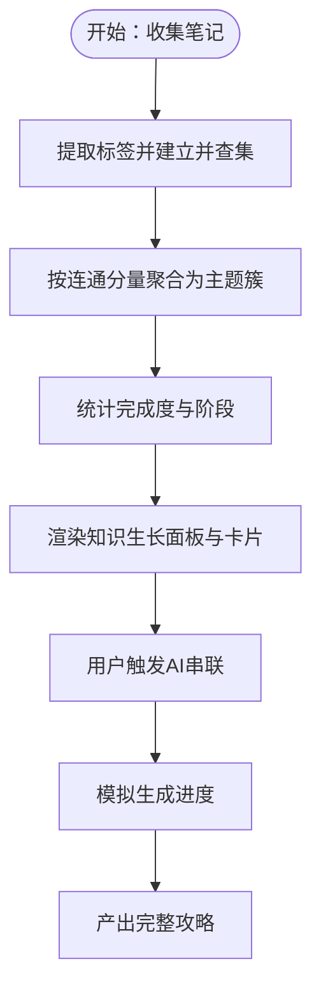

图表来源
- [HiBrain.tsx:68-98](file://src/app/pages/HiBrain.tsx#L68-L98)
- [HiBrain.tsx:171-405](file://src/app/pages/HiBrain.tsx#L171-L405)

章节来源
- [HiBrain.tsx:68-98](file://src/app/pages/HiBrain.tsx#L68-L98)
- [HiBrain.tsx:171-405](file://src/app/pages/HiBrain.tsx#L171-L405)

### 富卡片系统（ChatCards.tsx）
- 数据模型：CardPayload定义四种卡片类型及承载数据，SourcesCard支持将HiBrainSourcesDetails转换为持久化来源列表。
- 图谱卡片：GraphCard基于边集合计算选中节点的连通域，实现高亮与联动。
- 笔记卡片：NoteCard支持展开预览、标签展示与加入串联操作。
- 增长卡片：GrowthCard展示主题完成度与片段数量，提供“立即串联”按钮。
- 来源卡片：SourcesCard汇总笔记/文档/附件/Web来源，支持跳转至思库。

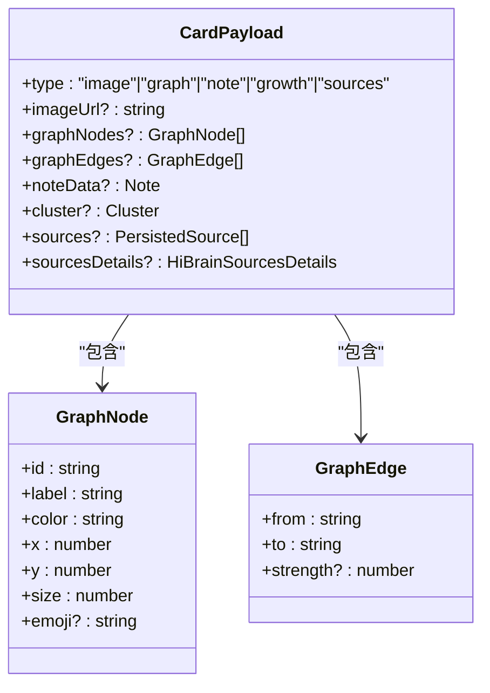

图表来源
- [ChatCards.tsx:64-83](file://src/app/components/ChatCards.tsx#L64-L83)
- [ChatCards.tsx:26-31](file://src/app/components/ChatCards.tsx#L26-L31)

章节来源
- [ChatCards.tsx:64-83](file://src/app/components/ChatCards.tsx#L64-L83)
- [ChatCards.tsx:243-406](file://src/app/components/ChatCards.tsx#L243-L406)
- [ChatCards.tsx:410-541](file://src/app/components/ChatCards.tsx#L410-L541)
- [ChatCards.tsx:571-684](file://src/app/components/ChatCards.tsx#L571-L684)
- [ChatCards.tsx:722-800](file://src/app/components/ChatCards.tsx#L722-L800)

### AI服务封装（aiService.ts）
- 能力清单：内容扩写、智能校对、表格生成、文本/文档摘要、脑图生成、图片分析。
- 错误映射：统一将Axios错误映射为可读的错误详情，区分后端未升级、网络异常、未知错误等场景。
- 结构化解析：对摘要接口返回的结构化字段与JSON字符串进行兼容处理。

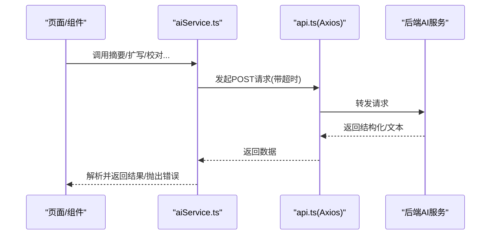

图表来源
- [aiService.ts:99-155](file://src/app/services/aiService.ts#L99-L155)
- [api.ts:36-42](file://src/app/services/api.ts#L36-L42)

章节来源
- [aiService.ts:52-277](file://src/app/services/aiService.ts#L52-L277)
- [api.ts:36-126](file://src/app/services/api.ts#L36-L126)

### 语音识别服务（speechService.ts）
- 提供者选择：优先级为“用户偏好/URL参数/localStorage > 原生平台 > Web Speech API > 无”。
- 三种模式：
  - 原生（Capacitor）：权限检查、可用性检测、事件监听（部分结果/最终结果/状态变化）、兜底轮询与超时。
  - Web：标准Web Speech API，支持连续识别与中间结果。
  - 云端流式：本地录音采集（AudioRecord），分块上传至后端STT接口，流式返回部分/最终文本。
- 错误处理：针对权限、麦克风、网络、超时等场景提供统一错误映射与兜底行为。

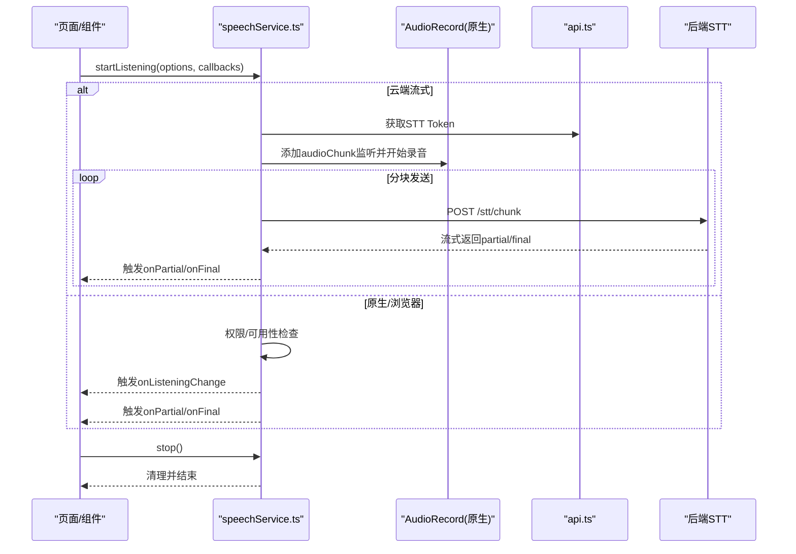

图表来源
- [speechService.ts:146-387](file://src/app/services/speechService.ts#L146-L387)
- [speechService.ts:388-687](file://src/app/services/speechService.ts#L388-L687)
- [speechService.ts:688-757](file://src/app/services/speechService.ts#L688-L757)
- [audioRecordService.ts:26-33](file://src/app/services/audioRecordService.ts#L26-L33)
- [api.ts:1-127](file://src/app/services/api.ts#L1-L127)

章节来源
- [speechService.ts:92-124](file://src/app/services/speechService.ts#L92-L124)
- [speechService.ts:146-387](file://src/app/services/speechService.ts#L146-L387)
- [speechService.ts:388-687](file://src/app/services/speechService.ts#L388-L687)
- [speechService.ts:688-757](file://src/app/services/speechService.ts#L688-L757)
- [audioRecordService.ts:1-35](file://src/app/services/audioRecordService.ts#L1-L35)
- [README.md:12-39](file://README.md#L12-L39)

### 流式搜索与来源解析（aiSearchService.ts）
- SSE流式：解析事件行与数据行，支持content、sources、error与[DONE]标记。
- 来源归一化：将后端返回的笔记/文档/附件/Web来源统一为PersistedSource数组，去重与类型标准化。
- 上下文消息：支持传入messages作为对话上下文，增强检索语义。

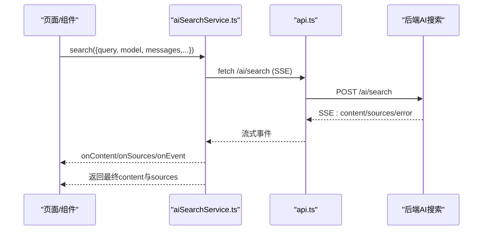

图表来源
- [aiSearchService.ts:86-226](file://src/app/services/aiSearchService.ts#L86-L226)
- [api.ts:36-42](file://src/app/services/api.ts#L36-L42)

章节来源
- [aiSearchService.ts:86-226](file://src/app/services/aiSearchService.ts#L86-L226)
- [sources.ts:1-35](file://src/app/types/sources.ts#L1-L35)

### 会话管理（chatSessionsService.ts）
- 能力：列出会话、创建会话、获取会话详情、删除/重命名会话、追加消息。
- 数据解包：对后端返回的data/result进行兼容处理，保证调用方拿到期望对象。

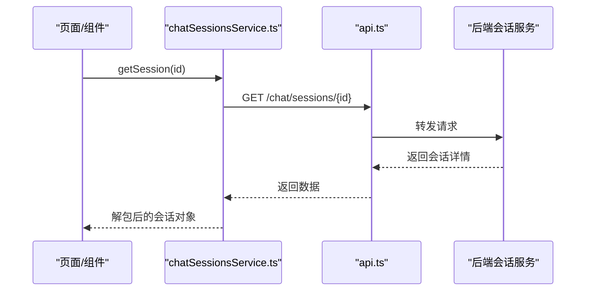

图表来源
- [chatSessionsService.ts:86-93](file://src/app/services/chatSessionsService.ts#L86-L93)
- [api.ts:36-42](file://src/app/services/api.ts#L36-L42)

章节来源
- [chatSessionsService.ts:66-125](file://src/app/services/chatSessionsService.ts#L66-L125)

### RAG检索（hibrainService.ts）
- 查询：统一查询入口，兼容answer/content/response/message等字段，抽取有效答案。
- 记忆：支持添加记忆与全部遗忘（GDPR）。

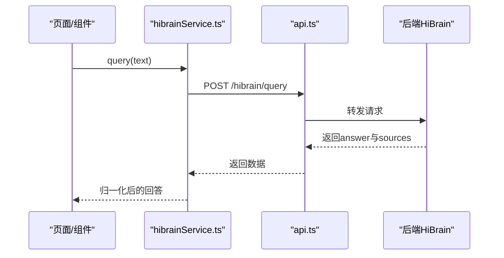

图表来源
- [hibrainService.ts:95-98](file://src/app/services/hibrainService.ts#L95-L98)
- [api.ts:36-42](file://src/app/services/api.ts#L36-L42)

章节来源
- [hibrainService.ts:89-117](file://src/app/services/hibrainService.ts#L89-L117)

### 统一API与鉴权（api.ts）
- 基础配置：根据环境变量与平台动态确定BASE_URL，统一超时与Content-Type。
- 请求拦截：自动附加JWT令牌。
- 响应拦截：统一401刷新逻辑与错误消息翻译，必要时重定向登录。

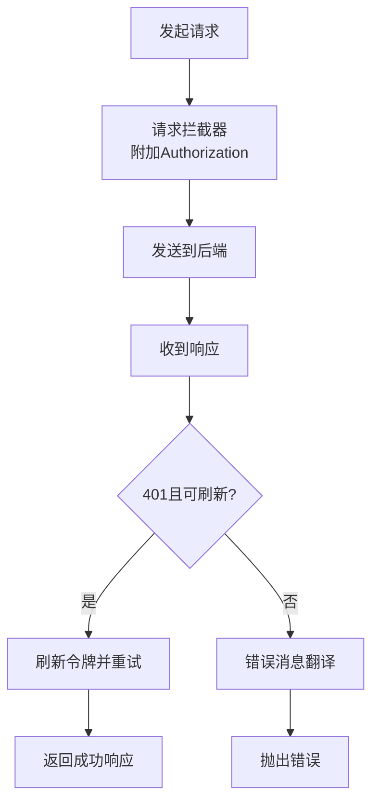

图表来源
- [api.ts:36-126](file://src/app/services/api.ts#L36-L126)

章节来源
- [api.ts:1-127](file://src/app/services/api.ts#L1-L127)

## 依赖分析
- 组件耦合：HiBrain.tsx依赖ChatCards.tsx、hibrainService.ts、aiSearchService.ts、chatSessionsService.ts、aiService.ts与speechService.ts；ChatCards.tsx依赖类型定义与图谱工具。
- 服务依赖：各服务均通过api.ts进行HTTP通信，避免直接依赖具体后端实现。
- 平台依赖：speechService.ts依赖Capacitor生态（原生）与Web Speech API；AudioRecord通过registerPlugin接入原生插件。

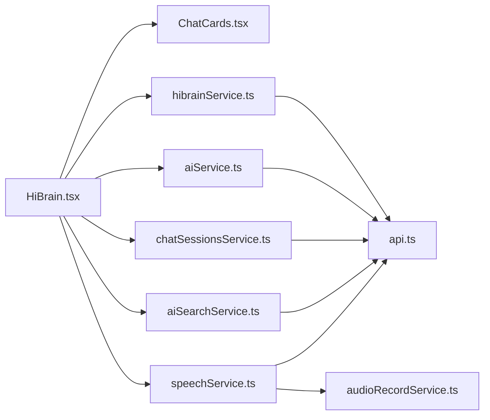

图表来源
- [HiBrain.tsx:1-2037](file://src/app/pages/HiBrain.tsx#L1-L2037)
- [ChatCards.tsx:1-946](file://src/app/components/ChatCards.tsx#L1-L946)
- [speechService.ts:1-759](file://src/app/services/speechService.ts#L1-L759)
- [audioRecordService.ts:1-35](file://src/app/services/audioRecordService.ts#L1-L35)
- [aiSearchService.ts:1-227](file://src/app/services/aiSearchService.ts#L1-L227)
- [chatSessionsService.ts:1-126](file://src/app/services/chatSessionsService.ts#L1-L126)
- [hibrainService.ts:1-118](file://src/app/services/hibrainService.ts#L1-L118)
- [aiService.ts:1-278](file://src/app/services/aiService.ts#L1-L278)
- [api.ts:1-127](file://src/app/services/api.ts#L1-L127)

章节来源
- [HiBrain.tsx:1-2037](file://src/app/pages/HiBrain.tsx#L1-L2037)
- [ChatCards.tsx:1-946](file://src/app/components/ChatCards.tsx#L1-L946)
- [speechService.ts:1-759](file://src/app/services/speechService.ts#L1-L759)
- [audioRecordService.ts:1-35](file://src/app/services/audioRecordService.ts#L1-L35)
- [aiSearchService.ts:1-227](file://src/app/services/aiSearchService.ts#L1-L227)
- [chatSessionsService.ts:1-126](file://src/app/services/chatSessionsService.ts#L1-L126)
- [hibrainService.ts:1-118](file://src/app/services/hibrainService.ts#L1-L118)
- [aiService.ts:1-278](file://src/app/services/aiService.ts#L1-L278)
- [api.ts:1-127](file://src/app/services/api.ts#L1-L127)

## 性能考量
- 语音识别
  - 云端流式：合理设置采样率与分块时长，避免过大导致延迟，过小增加网络负担；控制并发分块数，及时清理队列与监听器。
  - 原生/浏览器：注意Android特定机型的事件缺失问题，采用轮询兜底与超时控制，防止UI卡死。
- 流式搜索
  - 使用AbortSignal中断长时间无响应的请求；对SSE事件进行节流与去抖，避免频繁重绘。
- UI渲染
  - 使用React.memo与useMemo缓存计算结果；对长列表与SVG图谱使用虚拟滚动或分帧渲染。
- 网络与鉴权
  - 合理设置超时与重试；利用请求拦截器统一处理401刷新，减少重复鉴权开销。

[本节为通用指导，无需特定文件引用]

## 故障排查指南
- 语音识别
  - 无麦克风权限：检查权限状态与请求流程；原生模式下确保插件可用性。
  - 无语音输入/超时：关注兜底轮询与超时回调，必要时切换到弹窗模式。
  - 云端流式：检查STT Token获取与分块上传是否成功，关注网络异常与HTTP状态码。
- 流式搜索
  - SSE解析失败：确认事件/数据行格式，处理[DONE]与error事件；对异常进行捕获并提示。
- AI服务
  - 摘要/扩写失败：查看错误映射详情，区分后端未升级、网络异常与未知错误。
- 会话与RAG
  - 401自动刷新失败：检查刷新令牌有效性与存储；必要时引导重新登录。
- 遥测
  - 上报失败：忽略异常，不影响主流程。

章节来源
- [speechService.ts:146-387](file://src/app/services/speechService.ts#L146-L387)
- [speechService.ts:388-687](file://src/app/services/speechService.ts#L388-L687)
- [speechService.ts:688-757](file://src/app/services/speechService.ts#L688-L757)
- [aiSearchService.ts:129-226](file://src/app/services/aiSearchService.ts#L129-L226)
- [aiService.ts:12-50](file://src/app/services/aiService.ts#L12-L50)
- [api.ts:56-126](file://src/app/services/api.ts#L56-L126)
- [telemetryService.ts:9-21](file://src/app/services/telemetryService.ts#L9-L21)

## 结论
本系统通过清晰的分层架构与统一的服务封装，实现了从语音输入、知识检索、富卡片呈现到会话管理的完整闭环。在保证跨平台兼容与用户体验的同时，提供了可扩展的AI能力与良好的错误处理机制。建议在生产环境中进一步完善监控与日志、引入重试与熔断策略，并持续优化语音与流式搜索的性能与稳定性。

[本节为总结性内容，无需特定文件引用]

## 附录
- 配置与环境
  - API基础地址与平台适配：根据环境变量与平台动态决定BASE_URL。
  - 语音识别提供者偏好：支持通过环境变量、URL参数与localStorage指定。
- 扩展与自定义
  - 新增AI能力：在aiService.ts中扩展方法，遵循统一错误映射与结构化解析。
  - 自定义模型集成：通过aiSearchService.ts与aiService.ts的model参数传递，对接后端模型路由。
  - 隐私与合规：提供记忆遗忘接口（GDPR），严格限制敏感数据传输；遥测上报可选关闭。
- 最佳实践
  - 对外暴露的API调用统一通过服务层；避免在组件中直接处理鉴权与错误。
  - 对长耗时任务提供进度反馈与中断能力（如语音停止、搜索取消）。
  - 对SSE与流式上传进行严格的边界检查与异常捕获。

章节来源
- [api.ts:13-34](file://src/app/services/api.ts#L13-L34)
- [speechService.ts:71-90](file://src/app/services/speechService.ts#L71-L90)
- [hibrainService.ts:113-116](file://src/app/services/hibrainService.ts#L113-L116)
- [telemetryService.ts:9-21](file://src/app/services/telemetryService.ts#L9-L21)