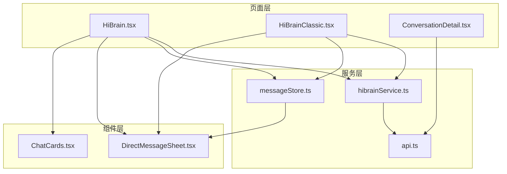
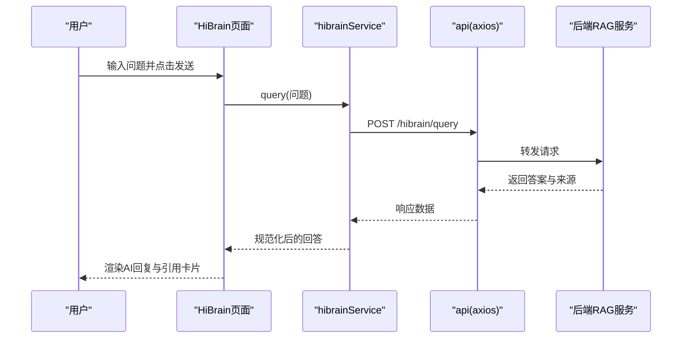
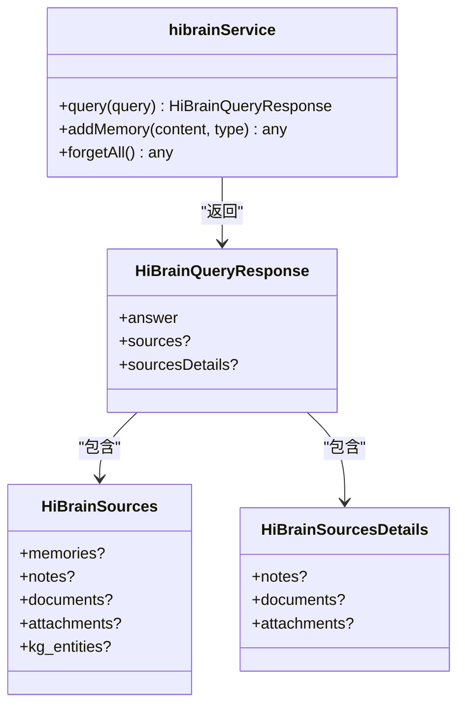
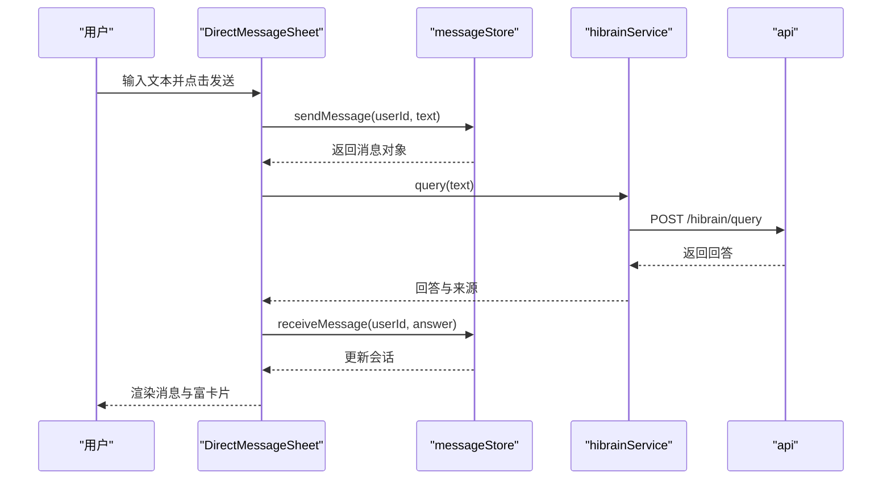
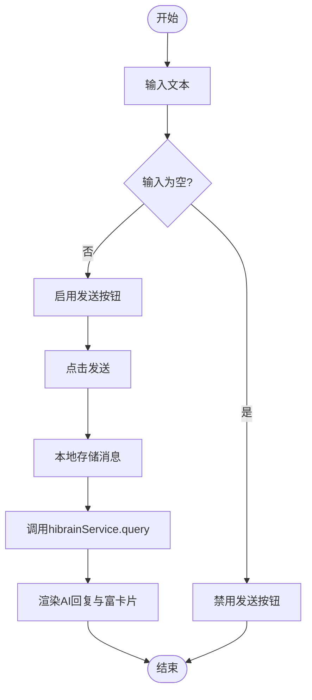
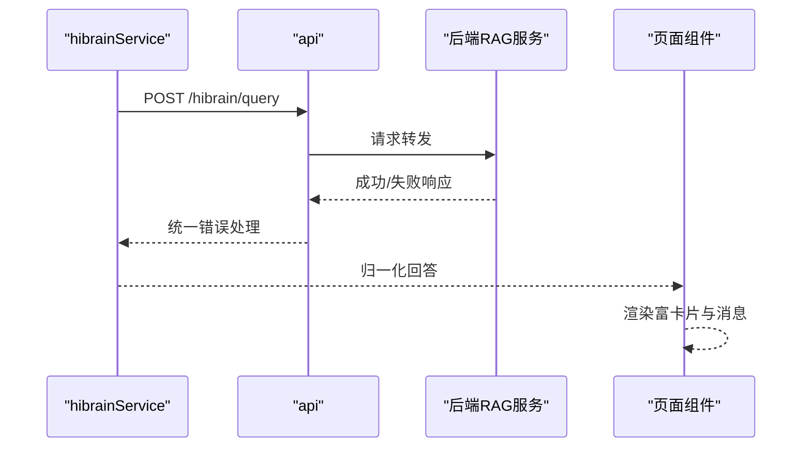
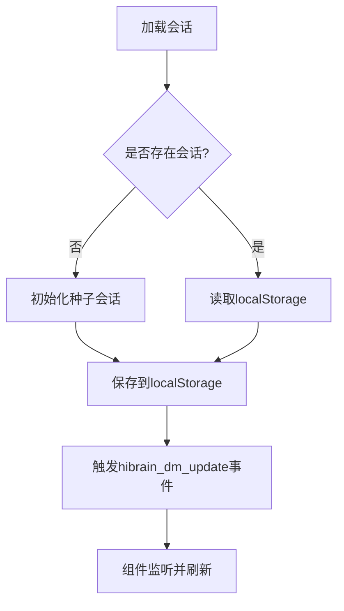
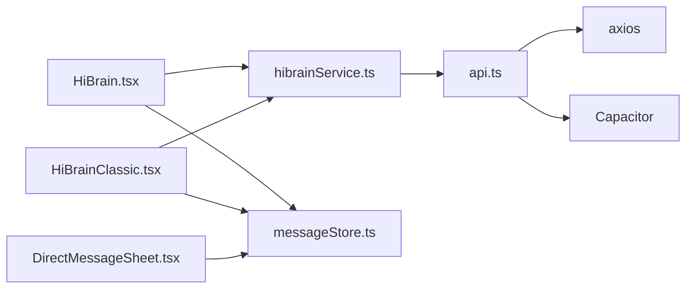

# HiBrain对话系统

<cite>
**本文档引用的文件**
- [HiBrain.tsx](file://src/app/pages/HiBrain.tsx)
- [hibrainService.ts](file://src/app/services/hibrainService.ts)
- [messageStore.ts](file://src/app/services/messageStore.ts)
- [ConversationDetail.tsx](file://src/app/pages/ConversationDetail.tsx)
- [api.ts](file://src/app/services/api.ts)
- [DirectMessageSheet.tsx](file://src/app/components/DirectMessageSheet.tsx)
- [ChatCards.tsx](file://src/app/components/ChatCards.tsx)
- [HiBrainClassic.tsx](file://src/app/pages/HiBrainClassic.tsx)
</cite>

## 目录
1. [简介](#简介)
2. [项目结构](#项目结构)
3. [核心组件](#核心组件)
4. [架构总览](#架构总览)
5. [详细组件分析](#详细组件分析)
6. [依赖关系分析](#依赖关系分析)
7. [性能考量](#性能考量)
8. [故障排除指南](#故障排除指南)
9. [结论](#结论)

## 简介
本文件面向HiBrain对话系统，聚焦于对话功能实现、消息处理、上下文管理与会话状态维护。文档覆盖以下关键点：
- 服务接口设计：hibrainService的消息发送、接收与处理流程
- 对话界面交互：消息气泡、输入框与发送按钮的实现
- AI回复生成机制：实时响应与错误处理策略
- 历史管理与持久化：本地存储与离线处理方案
- 用户体验优化：加载状态与动画效果

## 项目结构
HiBrain对话系统主要由页面层、服务层与组件层构成：
- 页面层：负责用户交互与路由跳转，如HiBrain主页面、经典对话页、会话详情页
- 服务层：封装API调用与数据持久化，如hibrainService、messageStore、api
- 组件层：提供可复用的UI组件，如消息气泡、富卡片等

图表来源
- [HiBrain.tsx](file://src/app/pages/HiBrain.tsx)
- [hibrainService.ts](file://src/app/services/hibrainService.ts)
- [messageStore.ts](file://src/app/services/messageStore.ts)
- [api.ts](file://src/app/services/api.ts)
- [DirectMessageSheet.tsx](file://src/app/components/DirectMessageSheet.tsx)
- [ChatCards.tsx](file://src/app/components/ChatCards.tsx)
- [HiBrainClassic.tsx](file://src/app/pages/HiBrainClassic.tsx)

章节来源
- [HiBrain.tsx](file://src/app/pages/HiBrain.tsx)
- [hibrainService.ts](file://src/app/services/hibrainService.ts)
- [messageStore.ts](file://src/app/services/messageStore.ts)
- [api.ts](file://src/app/services/api.ts)
- [DirectMessageSheet.tsx](file://src/app/components/DirectMessageSheet.tsx)
- [ChatCards.tsx](file://src/app/components/ChatCards.tsx)
- [HiBrainClassic.tsx](file://src/app/pages/HiBrainClassic.tsx)

## 核心组件
- hibrainService：封装与后端RAG服务的交互，提供查询、记忆增删与遗忘能力
- messageStore：基于localStorage的对话消息持久化，支持消息发送、接收、删除与分组
- DirectMessageSheet：对话抽屉式界面，包含消息气泡、输入区、表情板与长按菜单
- ChatCards：富卡片系统，支持图像、图谱、笔记与知识生长等卡片类型
- ConversationDetail：传统消息列表页，展示历史消息与发送新消息

章节来源
- [hibrainService.ts](file://src/app/services/hibrainService.ts)
- [messageStore.ts](file://src/app/services/messageStore.ts)
- [DirectMessageSheet.tsx](file://src/app/components/DirectMessageSheet.tsx)
- [ChatCards.tsx](file://src/app/components/ChatCards.tsx)
- [ConversationDetail.tsx](file://src/app/pages/ConversationDetail.tsx)

## 架构总览
HiBrain对话系统采用“页面-服务-组件”分层架构，页面通过服务访问后端API并管理本地状态；组件负责渲染与交互。

图表来源
- [HiBrain.tsx](file://src/app/pages/HiBrain.tsx)
- [hibrainService.ts](file://src/app/services/hibrainService.ts)
- [api.ts](file://src/app/services/api.ts)

## 详细组件分析

### hibrainService服务接口设计
hibrainService提供统一的查询入口，并对不同后端响应格式进行归一化处理，确保上层调用稳定可靠。

图表来源
- [hibrainService.ts](file://src/app/services/hibrainService.ts)

章节来源
- [hibrainService.ts](file://src/app/services/hibrainService.ts)

### 消息处理与上下文管理
消息处理分为两类场景：
- 在线对话：通过DirectMessageSheet与messageStore协作，实现消息发送、接收与滚动定位
- 会话详情：通过ConversationDetail加载历史消息并发送新消息

图表来源
- [DirectMessageSheet.tsx](file://src/app/components/DirectMessageSheet.tsx)
- [messageStore.ts](file://src/app/services/messageStore.ts)
- [hibrainService.ts](file://src/app/services/hibrainService.ts)
- [api.ts](file://src/app/services/api.ts)

章节来源
- [DirectMessageSheet.tsx](file://src/app/components/DirectMessageSheet.tsx)
- [messageStore.ts](file://src/app/services/messageStore.ts)
- [hibrainService.ts](file://src/app/services/hibrainService.ts)
- [api.ts](file://src/app/services/api.ts)

### 对话界面交互设计
消息气泡、输入框与发送按钮的实现细节如下：
- 消息气泡：支持文本、图片与笔记三种形态，具备回复引用、长按菜单与动画过渡
- 输入区：自适应高度、表情面板、快捷操作与发送按钮
- 发送按钮：根据输入状态启用/禁用，支持回车发送

图表来源
- [DirectMessageSheet.tsx](file://src/app/components/DirectMessageSheet.tsx)
- [messageStore.ts](file://src/app/services/messageStore.ts)
- [hibrainService.ts](file://src/app/services/hibrainService.ts)

章节来源
- [DirectMessageSheet.tsx](file://src/app/components/DirectMessageSheet.tsx)
- [HiBrainClassic.tsx](file://src/app/pages/HiBrainClassic.tsx)

### AI回复生成机制与实时响应
- 实时响应：前端在收到回答后立即渲染，同时触发富卡片（如知识图谱、笔记引用、知识生长）展示
- 错误处理：通过api拦截器统一处理401、网络异常与后端错误信息，向用户友好提示

图表来源
- [hibrainService.ts](file://src/app/services/hibrainService.ts)
- [api.ts](file://src/app/services/api.ts)
- [ChatCards.tsx](file://src/app/components/ChatCards.tsx)

章节来源
- [hibrainService.ts](file://src/app/services/hibrainService.ts)
- [api.ts](file://src/app/services/api.ts)
- [ChatCards.tsx](file://src/app/components/ChatCards.tsx)

### 对话历史管理与消息持久化
- 本地存储：messageStore以localStorage为后端，提供会话读取、消息增删与分组显示
- 事件驱动：通过自定义事件通知UI更新，保证多组件间状态一致
- 离线处理：消息在本地存储，网络恢复后仍可继续对话

图表来源
- [messageStore.ts](file://src/app/services/messageStore.ts)
- [DirectMessageSheet.tsx](file://src/app/components/DirectMessageSheet.tsx)

章节来源
- [messageStore.ts](file://src/app/services/messageStore.ts)
- [DirectMessageSheet.tsx](file://src/app/components/DirectMessageSheet.tsx)

### 会话状态维护与路由集成
- 会话详情页：加载指定会话的历史消息，支持标记已读与发送新消息
- 经典对话页：提供快速提示、语音输入与发送按钮，适配移动端输入体验

章节来源
- [ConversationDetail.tsx](file://src/app/pages/ConversationDetail.tsx)
- [HiBrainClassic.tsx](file://src/app/pages/HiBrainClassic.tsx)

## 依赖关系分析
- 页面依赖服务：HiBrain与HiBrainClassic依赖hibrainService与messageStore
- 组件依赖：DirectMessageSheet依赖messageStore与富卡片组件
- 服务依赖：hibrainService依赖api；api依赖axios与Capacitor环境判断

图表来源
- [HiBrain.tsx](file://src/app/pages/HiBrain.tsx)
- [HiBrainClassic.tsx](file://src/app/pages/HiBrainClassic.tsx)
- [hibrainService.ts](file://src/app/services/hibrainService.ts)
- [messageStore.ts](file://src/app/services/messageStore.ts)
- [DirectMessageSheet.tsx](file://src/app/components/DirectMessageSheet.tsx)
- [api.ts](file://src/app/services/api.ts)

章节来源
- [HiBrain.tsx](file://src/app/pages/HiBrain.tsx)
- [HiBrainClassic.tsx](file://src/app/pages/HiBrainClassic.tsx)
- [hibrainService.ts](file://src/app/services/hibrainService.ts)
- [messageStore.ts](file://src/app/services/messageStore.ts)
- [DirectMessageSheet.tsx](file://src/app/components/DirectMessageSheet.tsx)
- [api.ts](file://src/app/services/api.ts)

## 性能考量
- 渲染优化：使用动画库与条件渲染减少不必要的DOM更新
- 存储优化：本地分组与增量更新，避免全量重绘
- 网络优化：统一超时与重试策略，降低弱网影响
- 移动端体验：自适应输入框高度、触摸反馈与拖拽关闭抽屉

## 故障排除指南
- 网络异常：api拦截器将网络错误翻译为用户可理解的提示
- 401未授权：自动尝试刷新令牌，失败则引导至登录页
- 后端错误：优先使用后端提供的错误字符串，避免暴露内部细节
- 消息不显示：检查localStorage是否可用，确认事件监听是否注册

章节来源
- [api.ts](file://src/app/services/api.ts)
- [DirectMessageSheet.tsx](file://src/app/components/DirectMessageSheet.tsx)

## 结论
HiBrain对话系统通过清晰的分层架构与完善的本地存储机制，实现了流畅的对话体验。hibrainService提供了稳定的RAG接口封装，messageStore保障了消息持久化与离线可用性，DirectMessageSheet与富卡片组件提升了交互与可视化效果。配合统一的错误处理与性能优化策略，系统在移动端与多平台环境下均具备良好的可用性与扩展性。