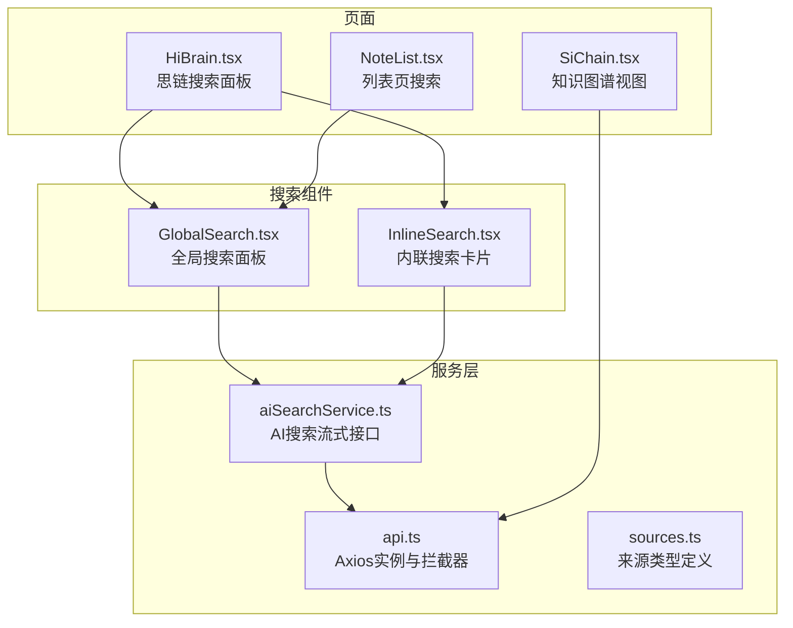
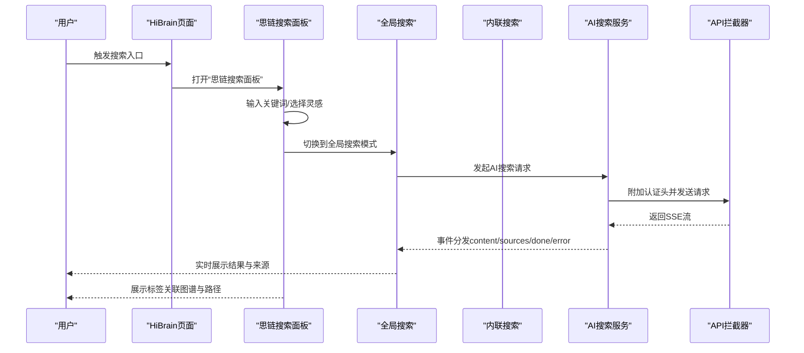
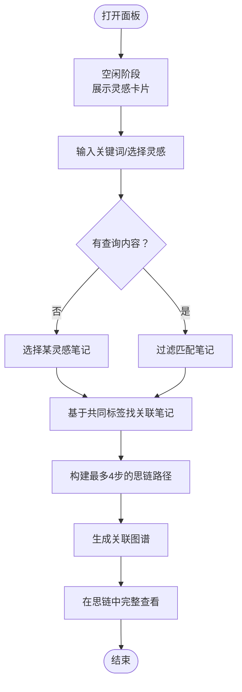
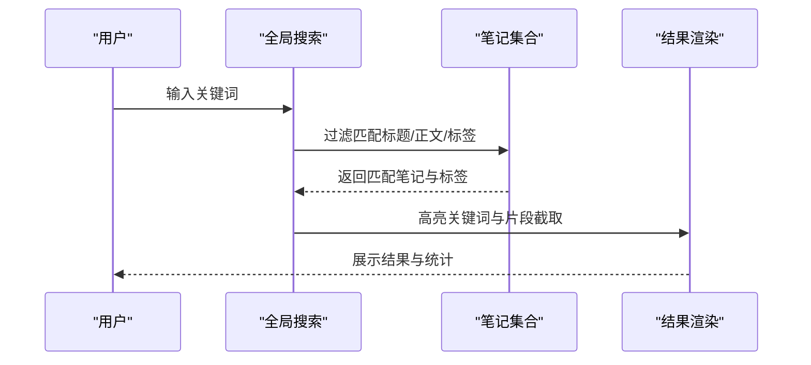
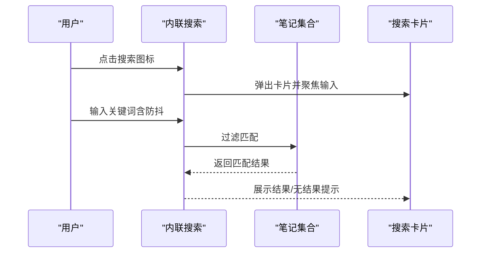
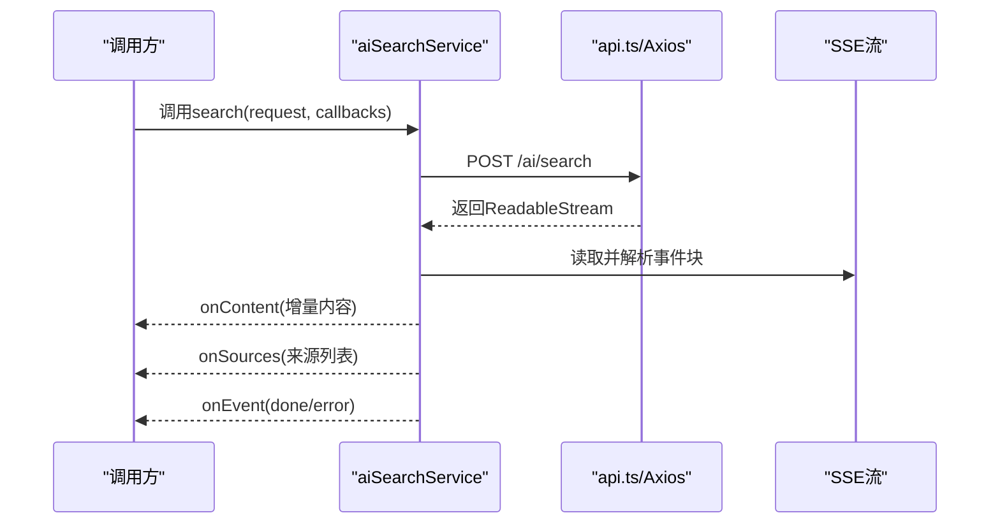
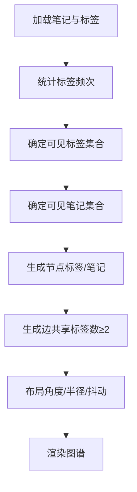
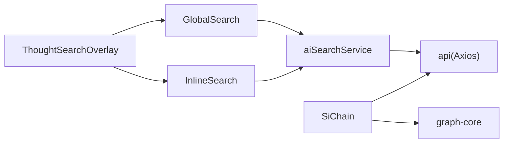

# 思链搜索系统

<cite>
**本文档引用的文件**
- [HiBrain.tsx](file://src/app/pages/HiBrain.tsx)
- [GlobalSearch.tsx](file://src/app/components/GlobalSearch.tsx)
- [InlineSearch.tsx](file://src/app/components/InlineSearch.tsx)
- [aiSearchService.ts](file://src/app/services/aiSearchService.ts)
- [api.ts](file://src/app/services/api.ts)
- [SiChain.tsx](file://src/app/pages/SiChain.tsx)
- [sources.ts](file://src/app/types/sources.ts)
- [NoteList.tsx](file://src/app/pages/NoteList.tsx)
</cite>

## 目录
1. [简介](#简介)
2. [项目结构](#项目结构)
3. [核心组件](#核心组件)
4. [架构总览](#架构总览)
5. [详细组件分析](#详细组件分析)
6. [依赖关系分析](#依赖关系分析)
7. [性能考虑](#性能考虑)
8. [故障排查指南](#故障排查指南)
9. [结论](#结论)
10. [附录](#附录)

## 简介
本文件为“思链搜索系统”的技术文档，聚焦于基于标签与内容的智能搜索算法、搜索界面与交互设计、全局与内联搜索组件的集成方案、以及“思链路径”发现算法。同时覆盖搜索性能优化、缓存策略与实时搜索的实现思路，并提供用户体验设计与搜索建议、快捷操作的实现细节。

## 项目结构
该系统主要由页面级组件、通用搜索组件、服务层与类型定义构成：
- 页面组件：HiBrain（包含“思链搜索面板”）、SiChain（知识图谱视图）
- 搜索组件：GlobalSearch（全局搜索面板）、InlineSearch（内联搜索卡片）
- 服务层：aiSearchService（AI搜索流式接口封装）、api（统一API基地址与拦截器）
- 类型定义：sources（持久化来源类型与归一化）

图表来源
- [HiBrain.tsx](file://src/app/pages/HiBrain.tsx)
- [GlobalSearch.tsx](file://src/app/components/GlobalSearch.tsx)
- [InlineSearch.tsx](file://src/app/components/InlineSearch.tsx)
- [aiSearchService.ts](file://src/app/services/aiSearchService.ts)
- [api.ts](file://src/app/services/api.ts)
- [sources.ts](file://src/app/types/sources.ts)
- [NoteList.tsx](file://src/app/pages/NoteList.tsx)

章节来源
- [HiBrain.tsx](file://src/app/pages/HiBrain.tsx)
- [GlobalSearch.tsx](file://src/app/components/GlobalSearch.tsx)
- [InlineSearch.tsx](file://src/app/components/InlineSearch.tsx)
- [aiSearchService.ts](file://src/app/services/aiSearchService.ts)
- [api.ts](file://src/app/services/api.ts)
- [sources.ts](file://src/app/types/sources.ts)
- [NoteList.tsx](file://src/app/pages/NoteList.tsx)

## 核心组件
- 思链搜索面板（ThoughtSearchOverlay）：以灵感笔记为起点，支持关键词/标签搜索、标签关联图谱、路径构建与导航跳转。
- 全局搜索（GlobalSearch）：顶部滑入式搜索面板，支持标签与笔记结果、高亮与片段截取、最近搜索与热门标签。
- 内联搜索（InlineSearch）：点击触发的卡片式搜索，带输入动画、搜索建议、实时结果与无结果提示。
- AI搜索服务（aiSearchService）：封装SSE流式事件，按事件类型分发内容增量、来源列表与错误。
- 知识图谱（SiChain）：基于笔记标签与实体构建图谱，支持单笔记扩展与多标签聚合视图。

章节来源
- [HiBrain.tsx](file://src/app/pages/HiBrain.tsx)
- [GlobalSearch.tsx](file://src/app/components/GlobalSearch.tsx)
- [InlineSearch.tsx](file://src/app/components/InlineSearch.tsx)
- [aiSearchService.ts](file://src/app/services/aiSearchService.ts)
- [SiChain.tsx](file://src/app/pages/SiChain.tsx)

## 架构总览
系统采用“页面组件 + 搜索组件 + 服务层”的分层架构：
- 页面组件负责业务场景与交互编排（如HiBrain中的“思链搜索面板”）。
- 搜索组件负责输入、过滤、结果展示与用户交互（GlobalSearch、InlineSearch）。
- 服务层负责与后端通信与数据处理（aiSearchService、api）。
- 类型定义确保来源对象的结构一致性（sources.ts）。

图表来源
- [HiBrain.tsx](file://src/app/pages/HiBrain.tsx)
- [GlobalSearch.tsx](file://src/app/components/GlobalSearch.tsx)
- [InlineSearch.tsx](file://src/app/components/InlineSearch.tsx)
- [aiSearchService.ts](file://src/app/services/aiSearchService.ts)
- [api.ts](file://src/app/services/api.ts)

## 详细组件分析

### 思链搜索面板（ThoughtSearchOverlay）
- 功能概述
  - 关键词/标签搜索：对笔记标题、正文（去除HTML标签）与标签进行模糊匹配。
  - 标签关联分析：基于共同标签寻找相关笔记，构建最多4步的“思链路径”。
  - 图谱可视化：以中心节点为核心，围绕其生成标签关联节点，形成小型关联图。
  - 导航跳转：支持在“思链图谱”中进一步查看完整图谱。
- 数据流与算法
  - 搜索匹配：对query进行小写化，分别匹配标题、正文与标签，限制返回数量。
  - 关联分析：从选中笔记出发，遍历未访问节点，若存在共同标签则加入路径。
  - 图谱布局：中心节点固定，周边节点按等角度分布，半径与标签频次相关。
- 交互逻辑
  - 输入框自动聚焦，清空查询或切换阶段时重置状态。
  - 结果阶段展示关联图与路径，提供“在思链中完整查看”按钮。

图表来源
- [HiBrain.tsx](file://src/app/pages/HiBrain.tsx)

章节来源
- [HiBrain.tsx](file://src/app/pages/HiBrain.tsx)

### 全局搜索（GlobalSearch）
- 功能概述
  - 顶部滑入式面板，支持标签与笔记结果展示。
  - 高亮显示匹配关键词，片段截取展示上下文。
  - 提供“最近搜索”与“热门标签”快捷入口。
- 搜索算法
  - 对query进行小写化，匹配笔记标题、正文与标签。
  - 标签去重后按出现次数排序，限制返回数量。
- 用户体验
  - 空状态提供“新建笔记”引导与占位提示。
  - 结果区域支持动画过渡与滚动条隐藏。

图表来源
- [GlobalSearch.tsx](file://src/app/components/GlobalSearch.tsx)

章节来源
- [GlobalSearch.tsx](file://src/app/components/GlobalSearch.tsx)

### 内联搜索（InlineSearch）
- 功能概述
  - 点击触发，从按钮右上角弹出卡片式搜索。
  - 输入防抖（约320ms），避免频繁过滤。
  - 提供“最近搜索”与“探索发现”快捷标签。
- 搜索算法
  - 组合标题、正文（去HTML标签）与标签进行包含匹配。
  - 结果按“正在搜索”“找到结果”“无结果”三种状态展示。
- 交互细节
  - 输入聚焦时显示高光底纹，按键支持Esc关闭。
  - “AI正在理解你的意图…”动画增强反馈。

图表来源
- [InlineSearch.tsx](file://src/app/components/InlineSearch.tsx)

章节来源
- [InlineSearch.tsx](file://src/app/components/InlineSearch.tsx)

### AI搜索服务（aiSearchService）
- 能力概述
  - 基于SSE流式接收事件，支持content、sources、done、error四类事件。
  - 自动解析事件块，拼接content增量，映射来源列表为统一结构。
  - 提供回调分发：onEvent/onContent/onSources。
- 错误处理
  - 对非OK响应抛出错误，对流式错误事件也抛出异常。
- 与API集成
  - 通过api.ts提供的Axios实例与拦截器自动附加认证头。

图表来源
- [aiSearchService.ts](file://src/app/services/aiSearchService.ts)
- [api.ts](file://src/app/services/api.ts)

章节来源
- [aiSearchService.ts](file://src/app/services/aiSearchService.ts)
- [api.ts](file://src/app/services/api.ts)

### 知识图谱（SiChain）
- 功能概述
  - 基于笔记标签与后端实体构建图谱，支持“全部视图”与“单笔记视图”。
  - “全部视图”聚合核心标签与可见笔记，按标签频次与笔记创建时间排序。
  - “单笔记视图”以笔记为中心，扩展其标签与关联笔记。
- 图构建算法
  - 标签计数与笔记映射，确定可见标签与笔记集合。
  - 计算节点坐标（角度、半径、抖动），边权重为共享标签数。
  - 边过滤：仅保留共享标签数≥2的笔记间连接。
- 视图控制
  - 支持展开标签、展开笔记、切换“显示全部标签”等视图参数。

图表来源
- [SiChain.tsx](file://src/app/pages/SiChain.tsx)

章节来源
- [SiChain.tsx](file://src/app/pages/SiChain.tsx)

## 依赖关系分析
- 组件耦合
  - ThoughtSearchOverlay与GlobalSearch/InlineSearch共享“笔记集合”与“导航”能力。
  - aiSearchService独立于UI，通过回调与事件驱动结果渲染。
- 外部依赖
  - axios用于统一请求与拦截器，自动附加认证头与刷新逻辑。
  - graph-core用于图谱数据结构归一化与匹配计算（在SiChain中使用）。
- 类型一致性
  - sources.ts确保来源对象字段一致，便于跨组件传递与消费。

图表来源
- [GlobalSearch.tsx](file://src/app/components/GlobalSearch.tsx)
- [InlineSearch.tsx](file://src/app/components/InlineSearch.tsx)
- [aiSearchService.ts](file://src/app/services/aiSearchService.ts)
- [api.ts](file://src/app/services/api.ts)
- [SiChain.tsx](file://src/app/pages/SiChain.tsx)

章节来源
- [GlobalSearch.tsx](file://src/app/components/GlobalSearch.tsx)
- [InlineSearch.tsx](file://src/app/components/InlineSearch.tsx)
- [aiSearchService.ts](file://src/app/services/aiSearchService.ts)
- [api.ts](file://src/app/services/api.ts)
- [SiChain.tsx](file://src/app/pages/SiChain.tsx)

## 性能考虑
- 搜索性能
  - 全局/内联搜索均采用小写化与包含匹配，复杂度约为O(N·M)，N为笔记数，M为平均匹配长度。可通过以下手段优化：
    - 预构建小写化索引与前缀树（Trie）以加速关键词匹配。
    - 对标签建立倒排索引，按标签快速筛选笔记ID集合。
    - 使用Web Worker离线预处理与缓存匹配结果。
- 实时搜索
  - 内联搜索已内置约320ms防抖，建议配合节流与增量渲染，避免高频重绘。
  - 全局搜索在输入为空时直接返回空结果，减少不必要的计算。
- 缓存策略
  - 本地缓存最近搜索与热门标签，降低重复输入成本。
  - 对AI搜索结果按query与时间戳做短期缓存，命中则优先返回缓存并异步刷新。
- 图谱渲染
  - SiChain中对节点与边数量进行上限控制（如可见笔记与边数），避免大规模渲染阻塞。
  - 布局计算采用数学公式与随机抖动，尽量保持稳定与可预测的性能。

## 故障排查指南
- AI搜索无响应或报错
  - 检查网络状态与后端可用性；确认api.ts拦截器是否正确附加认证头。
  - 若SSE流中断，aiSearchService会抛出错误事件，需在UI层提示用户重试。
- 全局/内联搜索无结果
  - 确认query非空且已触发防抖；检查笔记集合是否为空或标签为空数组。
  - 对于HTML正文，确保已正确去除标签后再匹配。
- 图谱渲染卡顿
  - 控制可见节点/边数量，必要时关闭“显示全部标签”选项。
  - 检查布局计算参数（半径、角度、抖动）是否过大导致重绘频繁。

章节来源
- [aiSearchService.ts](file://src/app/services/aiSearchService.ts)
- [api.ts](file://src/app/services/api.ts)
- [GlobalSearch.tsx](file://src/app/components/GlobalSearch.tsx)
- [InlineSearch.tsx](file://src/app/components/InlineSearch.tsx)
- [SiChain.tsx](file://src/app/pages/SiChain.tsx)

## 结论
思链搜索系统通过“思链搜索面板 + 全局/内联搜索 + AI搜索服务 + 知识图谱”的组合，实现了从灵感出发的标签关联与路径发现，并提供了流畅的实时搜索体验。未来可在索引与缓存层面进一步优化性能，在图谱布局与交互上增强可探索性与可定制性。

## 附录
- 搜索建议与快捷操作
  - 全局搜索提供“最近搜索”“热门标签”，内联搜索提供“探索发现”快捷标签，帮助用户快速定位内容。
  - 思链搜索面板提供“在思链中完整查看”按钮，便于深入探索图谱。
- 相关性排序
  - 当前实现以标签共同性与笔记创建时间作为排序依据；可引入TF-IDF、BM25或嵌入相似度进行更精细的排序。