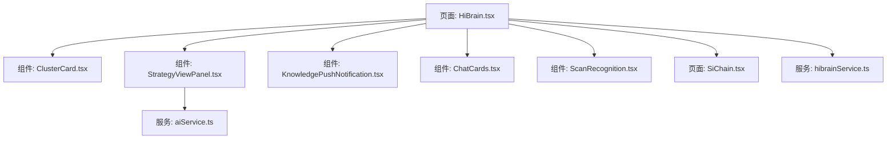
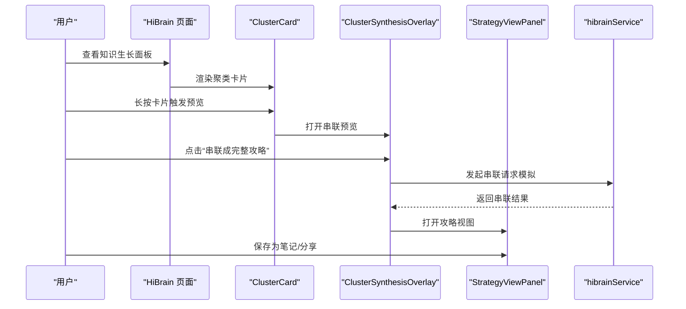
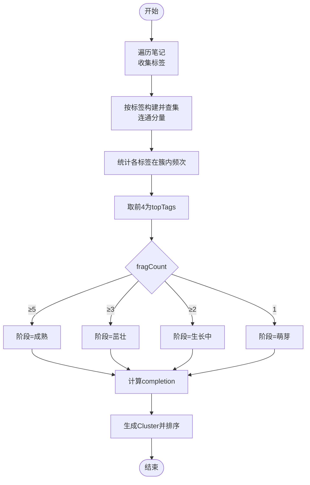
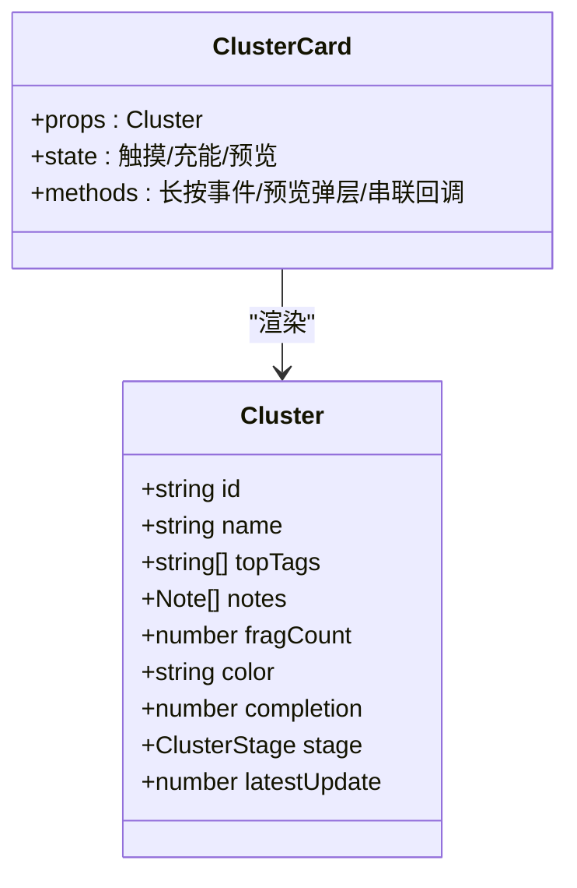
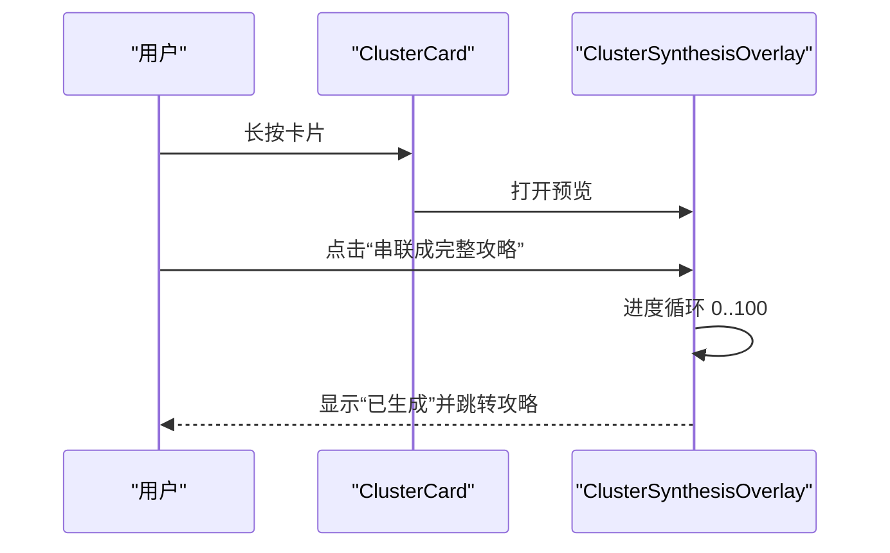
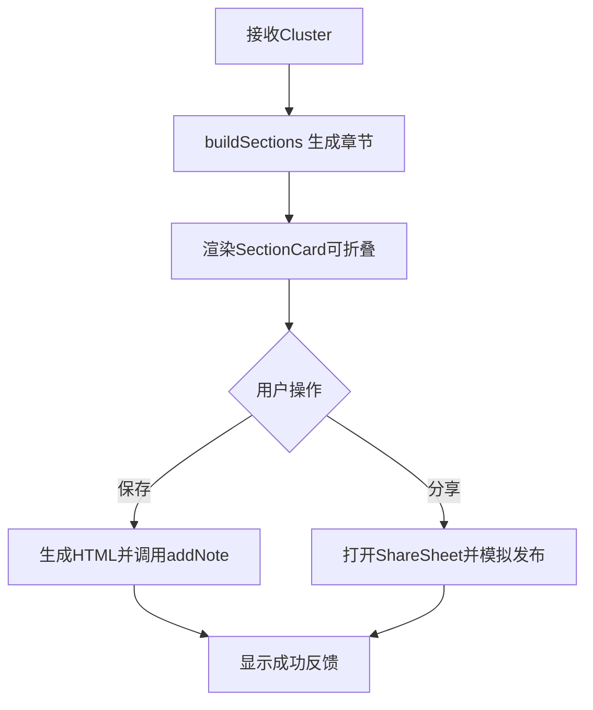
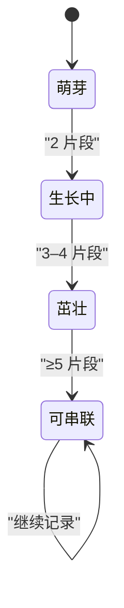
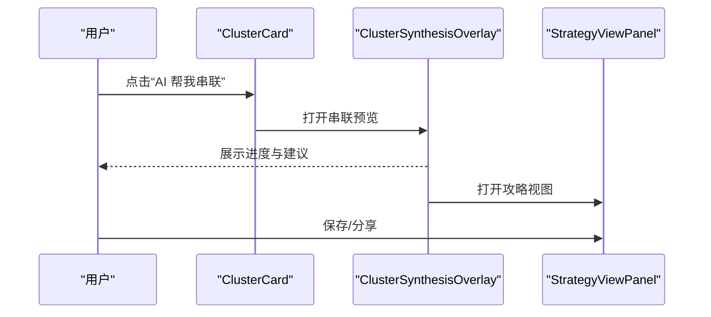
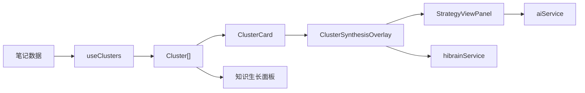

# 知识串联与合并

<cite>
**本文引用的文件**
- [HiBrain.tsx](file://src/app/pages/HiBrain.tsx)
- [ClusterCard.tsx](file://src/app/components/ClusterCard.tsx)
- [StrategyViewPanel.tsx](file://src/app/components/StrategyViewPanel.tsx)
- [hibrainService.ts](file://src/app/services/hibrainService.ts)
- [aiService.ts](file://src/app/services/aiService.ts)
- [KnowledgePushNotification.tsx](file://src/app/components/KnowledgePushNotification.tsx)
- [ChatCards.tsx](file://src/app/components/ChatCards.tsx)
- [ScanRecognition.tsx](file://src/app/components/ScanRecognition.tsx)
- [SiChain.tsx](file://src/app/pages/SiChain.tsx)
</cite>

## 目录
1. [简介](#简介)
2. [项目结构](#项目结构)
3. [核心组件](#核心组件)
4. [架构总览](#架构总览)
5. [详细组件分析](#详细组件分析)
6. [依赖关系分析](#依赖关系分析)
7. [性能考量](#性能考量)
8. [故障排查指南](#故障排查指南)
9. [结论](#结论)
10. [附录](#附录)

## 简介
本文件聚焦“知识串联与合并”能力，系统阐述：
- 基于笔记标签与内容的智能聚类分析与主题识别
- ClusterCard 组件的可视化与交互状态管理
- StrategyViewPanel 的知识攻略生成机制（内容补全、结构化输出、个性化推荐）
- 知识生长阶段的判断逻辑与从种子到成熟的生命周期
- AI 合并建议的算法实现与用户交互流程
- 性能优化、大数据处理与内存管理的最佳实践

## 项目结构
本功能主要分布在页面、组件与服务三层：
- 页面层：HiBrain.tsx 提供聚类入口、长按预览、串联面板与知识生长面板
- 组件层：ClusterCard 展示单个聚类卡片；StrategyViewPanel 展示完整攻略；ChatCards/KnowledgePushNotification 提供快捷串联入口；ScanRecognition 提供标签建议；SiChain 展示思维链图谱
- 服务层：hibrainService 提供 RAG 查询与记忆接口；aiService 提供通用 AI 能力（此处用于示意）

图表来源
- [HiBrain.tsx:1-200](file://src/app/pages/HiBrain.tsx#L1-L200)
- [ClusterCard.tsx:1-120](file://src/app/components/ClusterCard.tsx#L1-L120)
- [StrategyViewPanel.tsx:1-120](file://src/app/components/StrategyViewPanel.tsx#L1-L120)
- [hibrainService.ts:1-118](file://src/app/services/hibrainService.ts#L1-L118)
- [aiService.ts:1-120](file://src/app/services/aiService.ts#L1-L120)
- [KnowledgePushNotification.tsx:429-446](file://src/app/components/KnowledgePushNotification.tsx#L429-L446)
- [ChatCards.tsx:662-692](file://src/app/components/ChatCards.tsx#L662-L692)
- [ScanRecognition.tsx:537-558](file://src/app/components/ScanRecognition.tsx#L537-L558)
- [SiChain.tsx:89-110](file://src/app/pages/SiChain.tsx#L89-L110)

章节来源
- [HiBrain.tsx:1-200](file://src/app/pages/HiBrain.tsx#L1-L200)

## 核心组件
- 聚类与阶段判定：useClusters 计算每个聚类的主题标签、片段数量、完成度与阶段，并排序展示
- 长按预览与串联：ClusterSynthesisOverlay 提供串联预览与进度动画，点击后进入攻略视图
- 攻略生成：StrategyViewPanel 构建结构化章节（概览、要点、AI 补全、行动建议），支持保存为笔记与分享
- 可视化卡片：ClusterCard 展示聚类名称、阶段、标签、片段列表、完成度进度与操作按钮
- 快捷串联：ChatCards/KnowledgePushNotification 提供“立即 AI 串联”入口
- 标签建议：ScanRecognition 提供 AI 建议标签，辅助主题识别
- 思维链图谱：SiChain 展示基于标签的关联网络

章节来源
- [HiBrain.tsx:68-98](file://src/app/pages/HiBrain.tsx#L68-L98)
- [HiBrain.tsx:171-405](file://src/app/pages/HiBrain.tsx#L171-L405)
- [StrategyViewPanel.tsx:39-79](file://src/app/components/StrategyViewPanel.tsx#L39-L79)
- [ClusterCard.tsx:11-34](file://src/app/components/ClusterCard.tsx#L11-L34)
- [KnowledgePushNotification.tsx:429-446](file://src/app/components/KnowledgePushNotification.tsx#L429-L446)
- [ChatCards.tsx:662-692](file://src/app/components/ChatCards.tsx#L662-L692)
- [ScanRecognition.tsx:537-558](file://src/app/components/ScanRecognition.tsx#L537-L558)
- [SiChain.tsx:89-110](file://src/app/pages/SiChain.tsx#L89-L110)

## 架构总览
下图展示从笔记到聚类、再到串联与攻略生成的整体流程。

图表来源
- [HiBrain.tsx:171-405](file://src/app/pages/HiBrain.tsx#L171-L405)
- [ClusterCard.tsx:455-756](file://src/app/components/ClusterCard.tsx#L455-L756)
- [StrategyViewPanel.tsx:605-1023](file://src/app/components/StrategyViewPanel.tsx#L605-L1023)
- [hibrainService.ts:89-117](file://src/app/services/hibrainService.ts#L89-L117)

## 详细组件分析

### 聚类与主题识别（useClusters）
- 输入：所有笔记 Note[]
- 输出：按片段数降序排列的聚类 Cluster[]，包含 id、name、topTags、notes、fragCount、color、completion、stage、latestUpdate
- 主题识别策略：
  - 使用并查集按标签连通分量聚合笔记，形成主题簇
  - 统计每个标签在簇内的出现频次，取前 4 作为 topTags
  - 名称优先取 topTag，否则取标题或内容首段
- 阶段判定：
  - 片段数 ≥ 5：成熟（可串联）
  - 片段数 ≥ 3：茁壮（可串联）
  - 片段数 ≥ 2：生长中（可串联）
  - 片段数 = 1：萌芽（不可串联）
- 完成度计算：片段数权重为主，标签数权重为辅，上限 95%

图表来源
- [HiBrain.tsx:68-98](file://src/app/pages/HiBrain.tsx#L68-L98)

章节来源
- [HiBrain.tsx:68-98](file://src/app/pages/HiBrain.tsx#L68-L98)

### ClusterCard 组件（可视化与状态）
- 视觉元素：
  - 成长环（GrowthRing/BigRing）：展示完成度百分比与片段数
  - 标签云：展示 topTags
  - 片段列表：展示前若干条笔记的标题与摘要
  - 阶段徽章：阶段图标与颜色
  - 完成度条：横向进度条
- 交互行为：
  - 长按 520ms 触发预览弹层（PreviewOverlay）
  - 预览中可直接执行“AI 帮我串联”或“继续积累碎片”
  - 预览弹层包含粒子动画、渐变边框追踪、提示进度等动效
- 状态管理：
  - 触摸状态（触摸/充能）、进度条（长按进度）、涟漪效果、预览开关
  - 动画使用 Motion 库，过渡自然，避免阻塞

图表来源
- [ClusterCard.tsx:11-34](file://src/app/components/ClusterCard.tsx#L11-L34)
- [ClusterCard.tsx:455-756](file://src/app/components/ClusterCard.tsx#L455-L756)

章节来源
- [ClusterCard.tsx:1-756](file://src/app/components/ClusterCard.tsx#L1-L756)

### ClusterSynthesisOverlay（串联预览与进度）
- 功能点：
  - 展示聚类的碎片来源、标签、完成度与阶段
  - 基于片段数选择“缺口补全”建议清单
  - 模拟串联进度（0–100%，分步推进）
  - 串联完成后跳转至攻略视图
- 用户体验：
  - 圆形进度环、步骤指示器、渐进式动画
  - “可串联”状态高亮提示

图表来源
- [HiBrain.tsx:171-405](file://src/app/pages/HiBrain.tsx#L171-L405)

章节来源
- [HiBrain.tsx:171-405](file://src/app/pages/HiBrain.tsx#L171-L405)

### StrategyViewPanel（攻略生成与保存）
- 结构化输出：
  - buildSections 生成章节：全面概述、核心要点、AI 补全（深度解析/落地行动建议）
  - 每节支持是否 AI 生成标记与片段摘录
- 个性化推荐：
  - 基于 topTags 与 completion 动态生成建议标题与内容
- 保存与分享：
  - 保存为笔记：将章节 HTML 内容写入 Note
  - 分享到“思圈”：本地模拟发布，支持预览卡片与文案编辑

图表来源
- [StrategyViewPanel.tsx:39-79](file://src/app/components/StrategyViewPanel.tsx#L39-L79)
- [StrategyViewPanel.tsx:605-1023](file://src/app/components/StrategyViewPanel.tsx#L605-L1023)

章节来源
- [StrategyViewPanel.tsx:39-79](file://src/app/components/StrategyViewPanel.tsx#L39-L79)
- [StrategyViewPanel.tsx:605-1023](file://src/app/components/StrategyViewPanel.tsx#L605-L1023)

### 知识生长阶段判断与生命周期
- 阶段定义与配色：
  - 萌芽（seed）：1 片段
  - 生长中（sprouting）：2 片段
  - 茁壮（growing）：3–4 片段
  - 可串联（mature）：≥5 片段
- 生命周期流转：
  - 从“萌芽”到“可串联”，通过持续记录与标签关联增强
  - 阶段变化伴随 UI 颜色与徽章变化，提示用户可进行串联

图表来源
- [HiBrain.tsx:53-66](file://src/app/pages/HiBrain.tsx#L53-L66)
- [HiBrain.tsx:89-94](file://src/app/pages/HiBrain.tsx#L89-L94)

章节来源
- [HiBrain.tsx:53-66](file://src/app/pages/HiBrain.tsx#L53-L66)
- [HiBrain.tsx:89-94](file://src/app/pages/HiBrain.tsx#L89-L94)

### AI 合并建议与交互流程
- 建议来源：
  - 基于片段数选择缺口补全建议清单（整体概况/深度解析/注意事项/费用预算等）
  - 基于 topTags 与 completion 生成“落地行动建议”
- 交互入口：
  - ClusterCard：长按预览后“AI 帮我串联”
  - ChatCards/KnowledgePushNotification：快捷“立即 AI 串联”
- 流程：
  - 用户点击 → 预览串联进度 → 生成完整攻略 → 可保存/分享

图表来源
- [HiBrain.tsx:171-405](file://src/app/pages/HiBrain.tsx#L171-L405)
- [ClusterCard.tsx:703-718](file://src/app/components/ClusterCard.tsx#L703-L718)
- [ChatCards.tsx:662-692](file://src/app/components/ChatCards.tsx#L662-L692)
- [KnowledgePushNotification.tsx:429-446](file://src/app/components/KnowledgePushNotification.tsx#L429-L446)
- [StrategyViewPanel.tsx:605-1023](file://src/app/components/StrategyViewPanel.tsx#L605-L1023)

章节来源
- [HiBrain.tsx:163-169](file://src/app/pages/HiBrain.tsx#L163-L169)
- [HiBrain.tsx:171-405](file://src/app/pages/HiBrain.tsx#L171-L405)
- [ClusterCard.tsx:703-718](file://src/app/components/ClusterCard.tsx#L703-L718)
- [ChatCards.tsx:662-692](file://src/app/components/ChatCards.tsx#L662-L692)
- [KnowledgePushNotification.tsx:429-446](file://src/app/components/KnowledgePushNotification.tsx#L429-L446)
- [StrategyViewPanel.tsx:605-1023](file://src/app/components/StrategyViewPanel.tsx#L605-L1023)

### 标签建议与主题识别增强
- ScanRecognition 提供 AI 建议标签，辅助用户为笔记打上更精准的标签
- SiChain 展示基于标签的思维链图谱，帮助发现知识间的潜在关联

章节来源
- [ScanRecognition.tsx:537-558](file://src/app/components/ScanRecognition.tsx#L537-L558)
- [SiChain.tsx:89-110](file://src/app/pages/SiChain.tsx#L89-L110)

## 依赖关系分析
- 组件间依赖：
  - HiBrain.tsx 依赖 ClusterCard、StrategyViewPanel、ClusterSynthesisOverlay、ChatCards、KnowledgePushNotification、ScanRecognition、SiChain
  - StrategyViewPanel 依赖 aiService（示意）
  - ClusterSynthesisOverlay 依赖 hibrainService（示意）
- 数据流：
  - Notes → useClusters → Cluster[] → ClusterCard/知识生长面板
  - 用户在卡片/推送/聊天中触发串联 → ClusterSynthesisOverlay → StrategyViewPanel

图表来源
- [HiBrain.tsx:68-98](file://src/app/pages/HiBrain.tsx#L68-L98)
- [ClusterCard.tsx:455-756](file://src/app/components/ClusterCard.tsx#L455-L756)
- [StrategyViewPanel.tsx:605-1023](file://src/app/components/StrategyViewPanel.tsx#L605-L1023)
- [hibrainService.ts:89-117](file://src/app/services/hibrainService.ts#L89-L117)
- [aiService.ts:52-155](file://src/app/services/aiService.ts#L52-L155)

章节来源
- [HiBrain.tsx:68-98](file://src/app/pages/HiBrain.tsx#L68-L98)
- [StrategyViewPanel.tsx:605-1023](file://src/app/components/StrategyViewPanel.tsx#L605-L1023)
- [hibrainService.ts:89-117](file://src/app/services/hibrainService.ts#L89-L117)
- [aiService.ts:52-155](file://src/app/services/aiService.ts#L52-L155)

## 性能考量
- 渲染优化
  - 使用 Motion 动画时启用硬件加速，避免大范围重排
  - 预览弹层使用 Portal 渲染，减少 DOM 树层级
  - 长按进度与粒子动画采用帧率可控的过渡，避免卡顿
- 数据处理
  - 聚类阶段使用并查集与哈希统计，时间复杂度近似 O(N+α(N)) + O(T log T)，T 为标签数
  - 对笔记列表做切片（如最多 5/3 条）限制渲染与计算负载
- 内存管理
  - 预览弹层在关闭时销毁，及时清理定时器与动画引用
  - 避免在渲染路径中创建临时对象，减少 GC 压力
- 大数据场景
  - 分页加载与懒渲染：仅渲染可视区域卡片
  - 缓存聚类结果，当笔记集合无变化时不重复计算
- I/O 与网络
  - 串联与查询使用服务封装，统一超时与错误处理
  - 串联过程采用模拟进度，避免真实网络抖动影响体验

## 故障排查指南
- 串联失败
  - 检查 hibrainService.query 是否返回有效 answer 字段
  - 若后端未就绪，前端应提示“后端未升级/接口不存在”
- 保存失败
  - 检查 StrategyViewPanel 中 addNote 调用是否成功
  - 若保存状态卡在“保存中”，检查异步流程是否被中断
- 动画卡顿
  - 检查长按进度与粒子动画是否过多，必要时降低数量或简化样式
  - 确认未在主线程执行重型计算
- 标签建议无效
  - 确认 ScanRecognition 的标签建议逻辑与笔记标签一致
  - 检查标签去重与截断逻辑

章节来源
- [hibrainService.ts:59-87](file://src/app/services/hibrainService.ts#L59-L87)
- [StrategyViewPanel.tsx:621-645](file://src/app/components/StrategyViewPanel.tsx#L621-L645)
- [ClusterCard.tsx:474-527](file://src/app/components/ClusterCard.tsx#L474-L527)
- [ScanRecognition.tsx:537-558](file://src/app/components/ScanRecognition.tsx#L537-L558)

## 结论
本功能通过“标签连通 + 主题统计”的聚类策略，结合阶段化 UI 与动效，实现了从碎片到完整攻略的自然生长路径。ClusterCard 与 StrategyViewPanel 提供了直观的可视化与结构化输出，配合快捷串联入口与标签建议，显著提升了知识串联效率与用户体验。在性能方面，通过合理的渲染与数据处理策略，可在大数据场景下保持流畅体验。

## 附录
- 相关服务接口
  - hibrainService.query：RAG 查询与答案提取
  - aiService.summarizeText/summarizeDocument：文本总结（示意）
- 关键常量
  - STAGE_CONFIG：阶段标签与配色映射
  - FRAGMENT_SOURCE_LABELS/GAP_SUGGESTIONS：串联缺口建议清单

章节来源
- [hibrainService.ts:89-117](file://src/app/services/hibrainService.ts#L89-L117)
- [aiService.ts:99-155](file://src/app/services/aiService.ts#L99-L155)
- [HiBrain.tsx:61-66](file://src/app/pages/HiBrain.tsx#L61-L66)
- [HiBrain.tsx:163-169](file://src/app/pages/HiBrain.tsx#L163-L169)