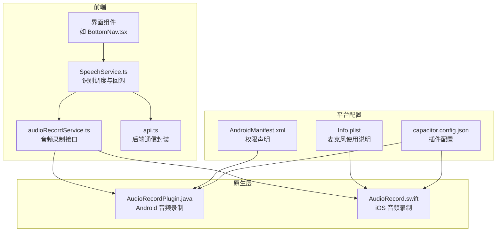
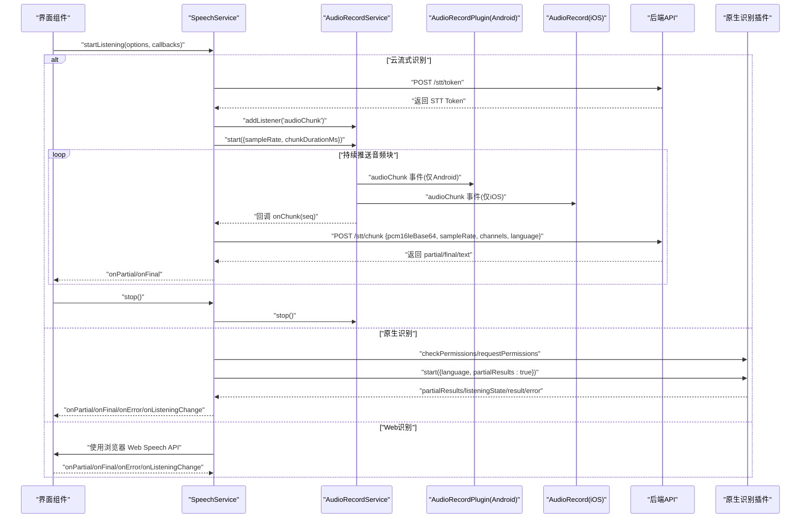
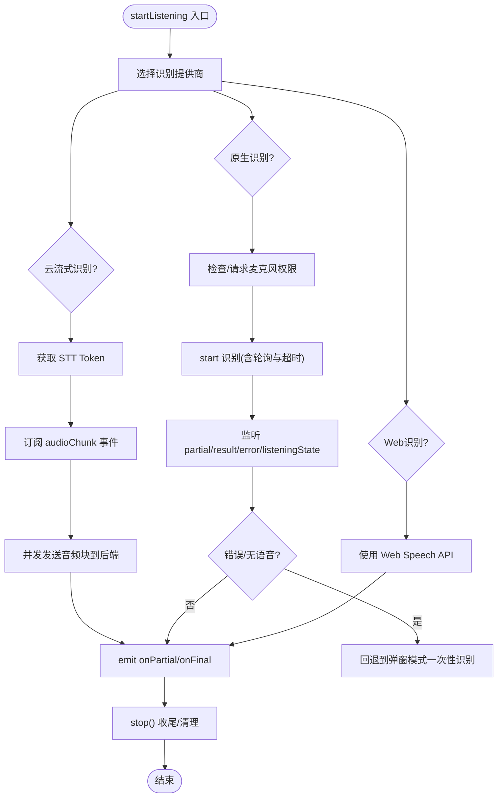
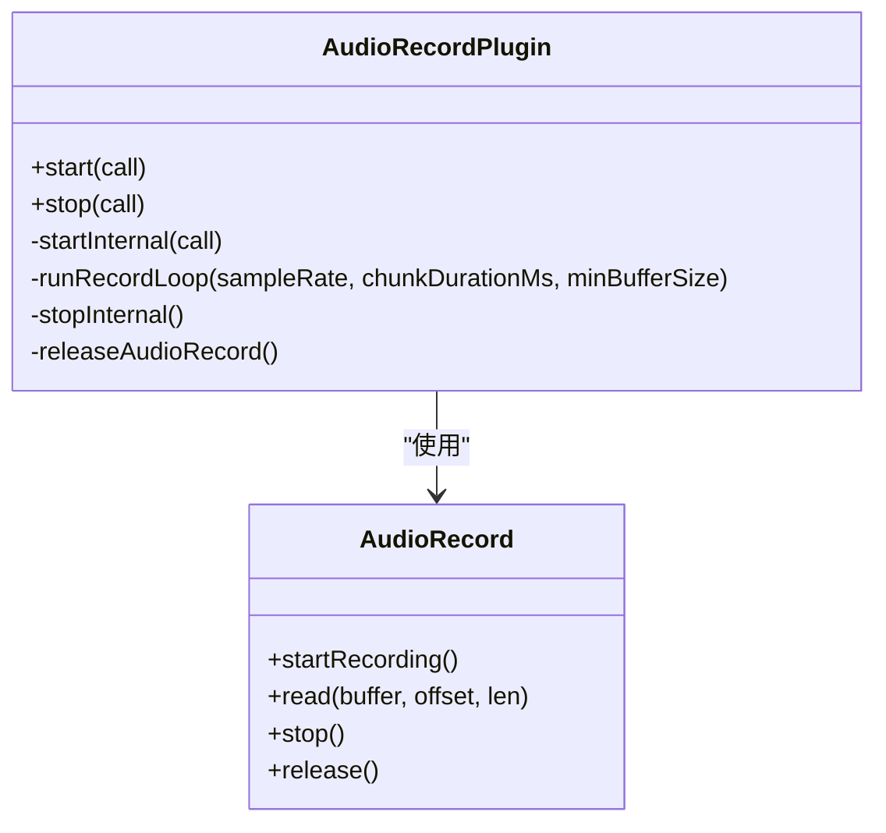
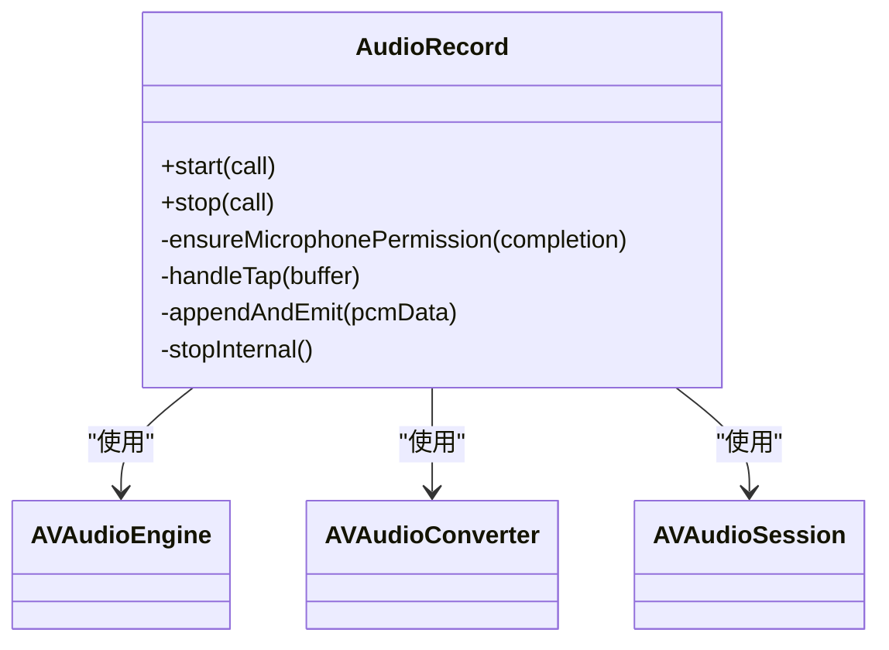
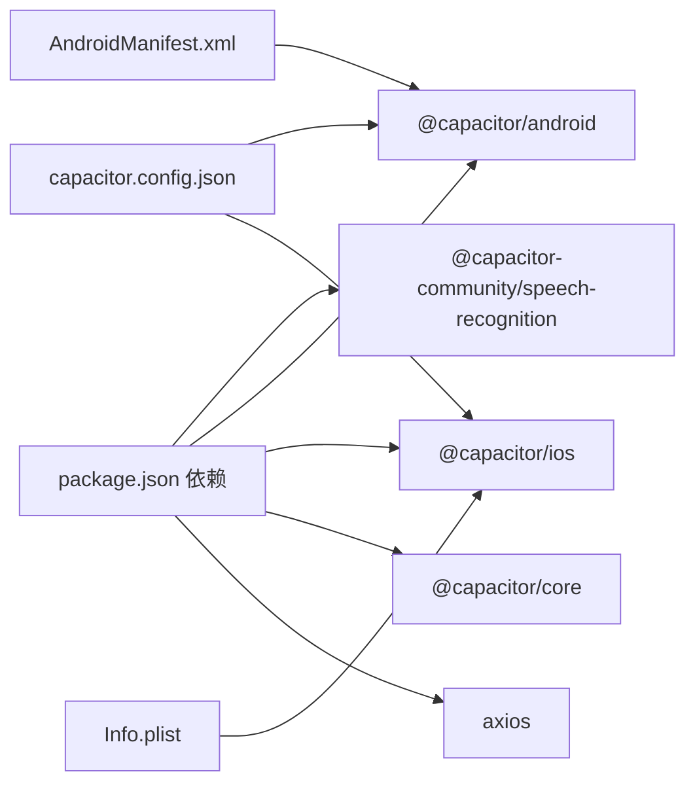

# 语音识别与合成服务

<cite>
**本文引用的文件列表**
- [speechService.ts](file://src/app/services/speechService.ts)
- [audioRecordService.ts](file://src/app/services/audioRecordService.ts)
- [AudioRecordPlugin.java](file://android/app/src/main/java/com/shisi/app/v2/plugins/AudioRecordPlugin.java)
- [AppDelegate.swift](file://ios/App/App/AppDelegate.swift)
- [AndroidManifest.xml](file://android/app/src/main/AndroidManifest.xml)
- [Info.plist](file://ios/App/App/Info.plist)
- [api.ts](file://src/app/services/api.ts)
- [BottomNav.tsx](file://src/app/components/BottomNav.tsx)
- [README.md](file://README.md)
- [capacitor.config.json](file://capacitor.config.json)
- [package.json](file://package.json)
</cite>

## 目录
1. [简介](#简介)
2. [项目结构](#项目结构)
3. [核心组件](#核心组件)
4. [架构总览](#架构总览)
5. [详细组件分析](#详细组件分析)
6. [依赖关系分析](#依赖关系分析)
7. [性能考量](#性能考量)
8. [故障排查指南](#故障排查指南)
9. [结论](#结论)
10. [附录](#附录)

## 简介
本技术文档围绕语音识别与合成服务展开，重点覆盖以下方面：
- 语音识别API集成：包括原生插件、Web Speech API以及云端流式识别三种模式。
- 音频录制机制：权限管理、格式转换与存储策略，以及跨平台（Android/iOS）实现。
- Capacitor插件AudioRecordPlugin的原生实现：Android端基于AudioRecord，iOS端基于AVAudioEngine。
- 语音合成服务集成：TTS引擎配置与多语言支持建议。
- 音频质量优化、降噪处理与实时流媒体实现细节。
- 隐私保护、数据安全与用户权限管理最佳实践。

## 项目结构
前端采用React + Capacitor混合架构，核心语音能力由JS层服务与原生插件协同完成：
- JS层服务：语音识别与音频录制接口封装。
- 原生插件：Android端AudioRecordPlugin，iOS端AudioRecord Swift桥接。
- 平台配置：Android权限声明、iOS麦克风使用说明、Capacitor配置与插件注册。

图表来源
- [speechService.ts:1-759](file://src/app/services/speechService.ts#L1-L759)
- [audioRecordService.ts:1-35](file://src/app/services/audioRecordService.ts#L1-L35)
- [AudioRecordPlugin.java:1-230](file://android/app/src/main/java/com/shisi/app/v2/plugins/AudioRecordPlugin.java#L1-L230)
- [AppDelegate.swift:52-252](file://ios/App/App/AppDelegate.swift#L52-L252)
- [AndroidManifest.xml:34-38](file://android/app/src/main/AndroidManifest.xml#L34-L38)
- [Info.plist:9-10](file://ios/App/App/Info.plist#L9-L10)
- [capacitor.config.json:1-31](file://capacitor.config.json#L1-L31)

章节来源
- [speechService.ts:1-759](file://src/app/services/speechService.ts#L1-L759)
- [audioRecordService.ts:1-35](file://src/app/services/audioRecordService.ts#L1-L35)
- [AudioRecordPlugin.java:1-230](file://android/app/src/main/java/com/shisi/app/v2/plugins/AudioRecordPlugin.java#L1-L230)
- [AppDelegate.swift:52-252](file://ios/App/App/AppDelegate.swift#L52-L252)
- [AndroidManifest.xml:34-38](file://android/app/src/main/AndroidManifest.xml#L34-L38)
- [Info.plist:9-10](file://ios/App/App/Info.plist#L9-L10)
- [capacitor.config.json:1-31](file://capacitor.config.json#L1-L31)

## 核心组件
- SpeechService：统一的语音识别服务入口，支持三种识别模式（native/web/cloud_streaming），并负责权限检查、错误映射、兜底超时与回退策略。
- AudioRecordService：Capacitor插件的JS封装，定义音频块事件与启动参数，提供start/stop/addListener/removeAllListeners等方法。
- AudioRecordPlugin（Android）：基于AudioRecord进行16kHz单声道PCM16LE采样，按800ms切片，Base64编码推送audioChunk事件。
- AudioRecord（iOS）：基于AVAudioEngine与AVAudioConverter，确保采样率与格式转换，同样以800ms切片推送audioChunk事件。
- 后端API封装：统一的axios实例，自动注入JWT令牌，处理刷新与全局错误翻译。

章节来源
- [speechService.ts:92-757](file://src/app/services/speechService.ts#L92-L757)
- [audioRecordService.ts:4-33](file://src/app/services/audioRecordService.ts#L4-L33)
- [AudioRecordPlugin.java:39-136](file://android/app/src/main/java/com/shisi/app/v2/plugins/AudioRecordPlugin.java#L39-L136)
- [AppDelegate.swift:58-251](file://ios/App/App/AppDelegate.swift#L58-L251)
- [api.ts:36-126](file://src/app/services/api.ts#L36-L126)

## 架构总览
整体工作流如下：
- UI触发开始录音与识别，SpeechService根据平台与偏好选择识别模式。
- 若为云流式识别，先向后端获取STT Token，然后通过AudioRecordService持续推送音频块，后端实时返回部分/最终识别结果。
- 若为原生识别，先检查/申请麦克风权限，调用原生插件进行识别，监听部分结果与最终结果事件，同时设置兜底超时与轮询监听。
- 若为Web识别，使用浏览器Web Speech API，开启连续识别与中间结果，结束后汇总最终文本。

图表来源
- [speechService.ts:146-387](file://src/app/services/speechService.ts#L146-L387)
- [speechService.ts:389-687](file://src/app/services/speechService.ts#L389-L687)
- [speechService.ts:690-757](file://src/app/services/speechService.ts#L690-L757)
- [audioRecordService.ts:26-33](file://src/app/services/audioRecordService.ts#L26-L33)
- [AudioRecordPlugin.java:138-187](file://android/app/src/main/java/com/shisi/app/v2/plugins/AudioRecordPlugin.java#L138-L187)
- [AppDelegate.swift:108-154](file://ios/App/App/AppDelegate.swift#L108-L154)
- [api.ts:36-126](file://src/app/services/api.ts#L36-L126)

## 详细组件分析

### SpeechService：识别调度与容错
- 识别模式选择：优先读取环境变量/URL参数/localStorage偏好，否则在原生平台默认native，在Web平台检测Web Speech API可用性。
- 权限管理：仅当选择native模式时检查/请求麦克风权限。
- 云流式识别：
  - 获取STT Token后，订阅AudioRecordService的audioChunk事件，按队列并发发送至后端，维护序号与待发射队列，保证有序输出。
  - 设置硬超时与“无语音”兜底计时器，避免UI卡死。
  - 对后端响应进行解析与错误映射，支持partial/final/text字段。
- 原生识别：
  - 监听partialResults、listeningState、result、error事件，若无listeningState停止事件，则通过轮询isListening兜底。
  - 在特定错误或无语音场景触发回退到弹窗模式（popup: true）一次性识别。
  - 提供stop()的优雅收尾，确保最终文本提交与资源释放。
- Web识别：
  - 使用浏览器SpeechRecognition构造函数，开启连续识别与中间结果，结束时汇总最终文本。

图表来源
- [speechService.ts:92-107](file://src/app/services/speechService.ts#L92-L107)
- [speechService.ts:146-387](file://src/app/services/speechService.ts#L146-L387)
- [speechService.ts:389-687](file://src/app/services/speechService.ts#L389-L687)
- [speechService.ts:690-757](file://src/app/services/speechService.ts#L690-L757)

章节来源
- [speechService.ts:92-757](file://src/app/services/speechService.ts#L92-L757)

### AudioRecordService：录制接口与事件模型
- 定义AudioChunkEvent与启动选项，暴露start/stop/addListener/removeAllListeners方法。
- 默认采样率16kHz、单声道、PCM16LE编码、800ms切片，事件包含时间戳与字节数，便于后端解码与统计。

章节来源
- [audioRecordService.ts:4-33](file://src/app/services/audioRecordService.ts#L4-L33)

### Android：AudioRecordPlugin（原生实现）
- 权限：声明RECORD_AUDIO权限，首次调用start时请求权限。
- 初始化：根据传入采样率与切片时长计算字节大小，创建AudioRecord并启动录音线程。
- 录制循环：以AudioRecord.read读取音频，拼接到chunkBuffer，达到阈值后Base64编码并通过JS通知audioChunk事件。
- 资源释放：stopInternal中停止录音、释放AudioRecord并等待线程退出。

图表来源
- [AudioRecordPlugin.java:39-136](file://android/app/src/main/java/com/shisi/app/v2/plugins/AudioRecordPlugin.java#L39-L136)
- [AudioRecordPlugin.java:138-187](file://android/app/src/main/java/com/shisi/app/v2/plugins/AudioRecordPlugin.java#L138-L187)
- [AudioRecordPlugin.java:189-229](file://android/app/src/main/java/com/shisi/app/v2/plugins/AudioRecordPlugin.java#L189-L229)

章节来源
- [AudioRecordPlugin.java:1-230](file://android/app/src/main/java/com/shisi/app/v2/plugins/AudioRecordPlugin.java#L1-L230)
- [AndroidManifest.xml:34-38](file://android/app/src/main/AndroidManifest.xml#L34-L38)

### iOS：AudioRecord（Swift桥接）
- 权限：通过AVAudioSession.recordPermission检查/请求麦克风权限。
- 会话配置：设置播放与录音类别、测量模式、允许蓝牙与默认扬声器，设置首选采样率。
- 数据流：安装tap回调，使用AVAudioConverter将输入格式转换为目标PCM16LE，按800ms切片拼接并Base64编码推送audioChunk事件。
- 资源释放：停止引擎、移除tap、释放converter与session。

图表来源
- [AppDelegate.swift:58-251](file://ios/App/App/AppDelegate.swift#L58-L251)

章节来源
- [AppDelegate.swift:52-252](file://ios/App/App/AppDelegate.swift#L52-L252)
- [Info.plist:9-10](file://ios/App/App/Info.plist#L9-L10)

### 云端流式识别：鉴权与传输
- 鉴权：先向后端获取STT Token，随后在发送音频块时携带Authorization头。
- 传输：每次发送包含pcm16leBase64、sampleRate、channels、language等字段，后端返回partial/final/text或text字段。
- 错误处理：对HTTP错误与业务错误进行统一映射，避免UI卡死。

章节来源
- [speechService.ts:348-387](file://src/app/services/speechService.ts#L348-L387)
- [api.ts:36-126](file://src/app/services/api.ts#L36-L126)

### Web识别：浏览器API适配
- 使用浏览器SpeechRecognition构造函数，设置语言、连续识别与中间结果。
- 事件映射：onresult中区分isFinal与中间文本，onerror映射为用户可读错误信息，onend触发最终文本提交。

章节来源
- [speechService.ts:690-757](file://src/app/services/speechService.ts#L690-L757)

### UI集成示例：底部导航按钮
- 触发startListening，绑定onPartial/onFinal/onError/onListeningChange回调，记录当前文本与停止句柄，支持一键停止。

章节来源
- [BottomNav.tsx:135-175](file://src/app/components/BottomNav.tsx#L135-L175)

## 依赖关系分析
- 依赖项：
  - @capacitor-community/speech-recognition：原生识别插件。
  - @capacitor/android、@capacitor/ios、@capacitor/core：Capacitor运行时与平台支持。
  - axios：HTTP客户端与拦截器。
- 插件注册与配置：
  - Android：通过AndroidManifest.xml声明RECORD_AUDIO权限。
  - iOS：在Info.plist中添加麦克风使用说明；在BridgeViewController中注册AudioRecord插件实例。
  - Capacitor配置：server.cleartext启用明文HTTP，便于开发调试。

图表来源
- [package.json:10-84](file://package.json#L10-L84)
- [capacitor.config.json:1-31](file://capacitor.config.json#L1-L31)
- [AndroidManifest.xml:34-38](file://android/app/src/main/AndroidManifest.xml#L34-L38)
- [Info.plist:9-10](file://ios/App/App/Info.plist#L9-L10)

章节来源
- [package.json:10-84](file://package.json#L10-L84)
- [capacitor.config.json:1-31](file://capacitor.config.json#L1-L31)
- [AndroidManifest.xml:34-38](file://android/app/src/main/AndroidManifest.xml#L34-L38)
- [Info.plist:9-10](file://ios/App/App/Info.plist#L9-L10)

## 性能考量
- 采样率与切片：
  - 默认16kHz、800ms切片，适合移动端实时传输与云端识别延迟平衡。
  - 可通过start选项调整采样率与切片时长，需与后端解码一致。
- 并发与背压：
  - 云流式识别中限制最大并发（如2），队列满时阻塞，避免内存峰值。
- 线程优先级与资源释放：
  - Android线程设置音频优先级，停止时等待线程退出并释放AudioRecord。
  - iOS停止时移除tap、停止引擎、释放converter与session。
- 超时与兜底：
  - 硬超时与“无语音”计时器避免UI卡死；原生识别通过轮询isListening兜底。
- 网络与错误：
  - axios拦截器统一处理401刷新与全局错误翻译，减少重复逻辑。

章节来源
- [AudioRecordPlugin.java:138-187](file://android/app/src/main/java/com/shisi/app/v2/plugins/AudioRecordPlugin.java#L138-L187)
- [AppDelegate.swift:130-154](file://ios/App/App/AppDelegate.swift#L130-L154)
- [speechService.ts:179-181](file://src/app/services/speechService.ts#L179-L181)
- [speechService.ts:525-543](file://src/app/services/speechService.ts#L525-L543)
- [api.ts:56-126](file://src/app/services/api.ts#L56-L126)

## 故障排查指南
- 权限问题：
  - Android：确认AndroidManifest.xml包含RECORD_AUDIO权限；首次调用start会触发权限请求。
  - iOS：Info.plist包含NSMicrophoneUsageDescription；首次录音会触发系统权限弹窗。
- 云流式识别失败：
  - 检查STT Token获取是否成功；查看后端返回的错误消息；确认网络连通性。
  - 关注onError回调中的映射信息，如“未获得麦克风权限”、“网络异常导致语音识别失败”等。
- 原生识别无结果：
  - 检查权限是否被拒绝；确认设备支持本地识别；留意轮询isListening与超时兜底。
  - 若出现“未检测到语音”，可尝试提高环境噪声或靠近麦克风。
- Web识别不可用：
  - 浏览器需支持Web Speech API；若不支持则回退到其他模式。
- 资源释放与内存：
  - 确保stop()调用后移除所有监听器；Android/iOS均需释放底层资源。

章节来源
- [AndroidManifest.xml:34-38](file://android/app/src/main/AndroidManifest.xml#L34-L38)
- [Info.plist:9-10](file://ios/App/App/Info.plist#L9-L10)
- [speechService.ts:211-218](file://src/app/services/speechService.ts#L211-L218)
- [speechService.ts:389-412](file://src/app/services/speechService.ts#L389-L412)
- [speechService.ts:512-543](file://src/app/services/speechService.ts#L512-L543)
- [speechService.ts:690-703](file://src/app/services/speechService.ts#L690-L703)

## 结论
该语音识别与合成服务通过统一的SpeechService抽象，结合Capacitor插件在Android/iOS两端提供稳定的音频录制与识别能力。云流式识别模式具备良好的实时性与准确性，原生识别模式在离线场景表现稳定，Web识别模式提供跨浏览器兼容性。配合完善的权限管理、错误映射与兜底策略，系统在复杂环境下仍能保持较好的用户体验。

## 附录

### 语音合成服务集成建议
- TTS引擎配置：
  - Android：可使用系统TTS（如Pico/TTS）或第三方SDK（如百度、讯飞、腾讯）。需在AndroidManifest.xml声明相应权限与服务。
  - iOS：使用AVSpeechSynthesizer，支持多语言与音色切换，注意在Info.plist中声明网络权限（如需在线TTS）。
- 多语言支持：
  - 通过设置语言参数与音色选择，实现多语种播报；注意不同引擎的语言覆盖范围差异。
- 实时流媒体：
  - 将TTS输出的音频流与播放器（如ExoPlayer/AVPlayer）结合，实现边合成边播放，降低延迟。
- 隐私与安全：
  - 本地TTS无需上传音频；云端TTS需加密传输与最小化数据留存；在UI中明确提示用户TTS用途与数据处理方式。

[本节为概念性内容，不直接分析具体文件，故无章节来源]

### 音频质量优化与降噪处理
- 采样率与编码：
  - 16kHz单声道PCM16LE适合大多数移动端场景；如需更高清晰度可提升采样率但会增加带宽与延迟。
- 降噪与回声消除：
  - 建议在原生层引入AEC/AGC/ANS等算法（Android端可使用OpenSL ES或NDK音频API，iOS端使用AVAudioSession的内置能力）。
- 编码与压缩：
  - 如需进一步降低带宽，可在前端进行轻量压缩（如Opus）并在后端解码；需权衡CPU占用与延迟。
- 实时流控：
  - 根据网络状况动态调整切片时长与并发数，避免拥塞与抖动。

[本节为概念性内容，不直接分析具体文件，故无章节来源]

### 隐私保护与数据安全最佳实践
- 权限最小化：
  - 仅在录音时请求麦克风权限，录音结束后立即释放相关资源。
- 数据最小化：
  - 仅传输必要字段（PCM Base64、采样率、通道数、语言），避免携带用户标识或上下文。
- 加密传输：
  - 使用HTTPS与TLS，确保音频数据在传输过程中的机密性与完整性。
- 用户控制：
  - 提供关闭录音/识别的开关，允许用户随时停止并删除历史记录。
- 透明度：
  - 在设置或帮助页面明确说明数据用途、存储期限与删除方式。

[本节为概念性内容，不直接分析具体文件，故无章节来源]