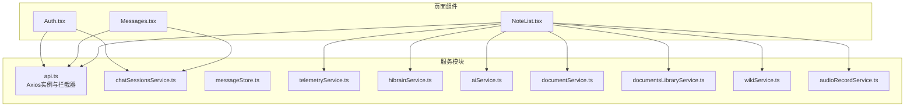
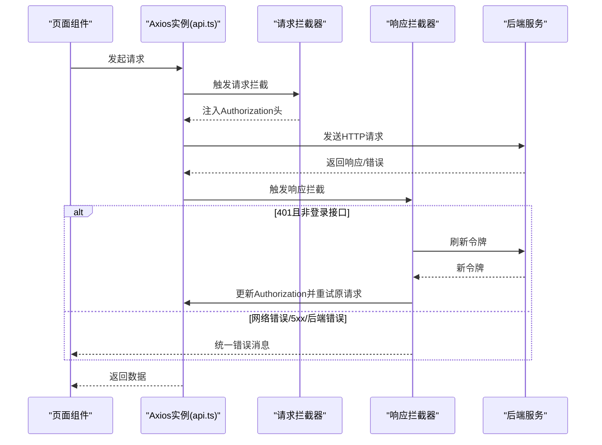
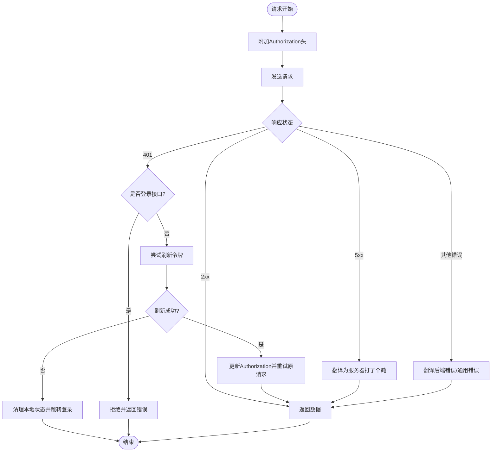
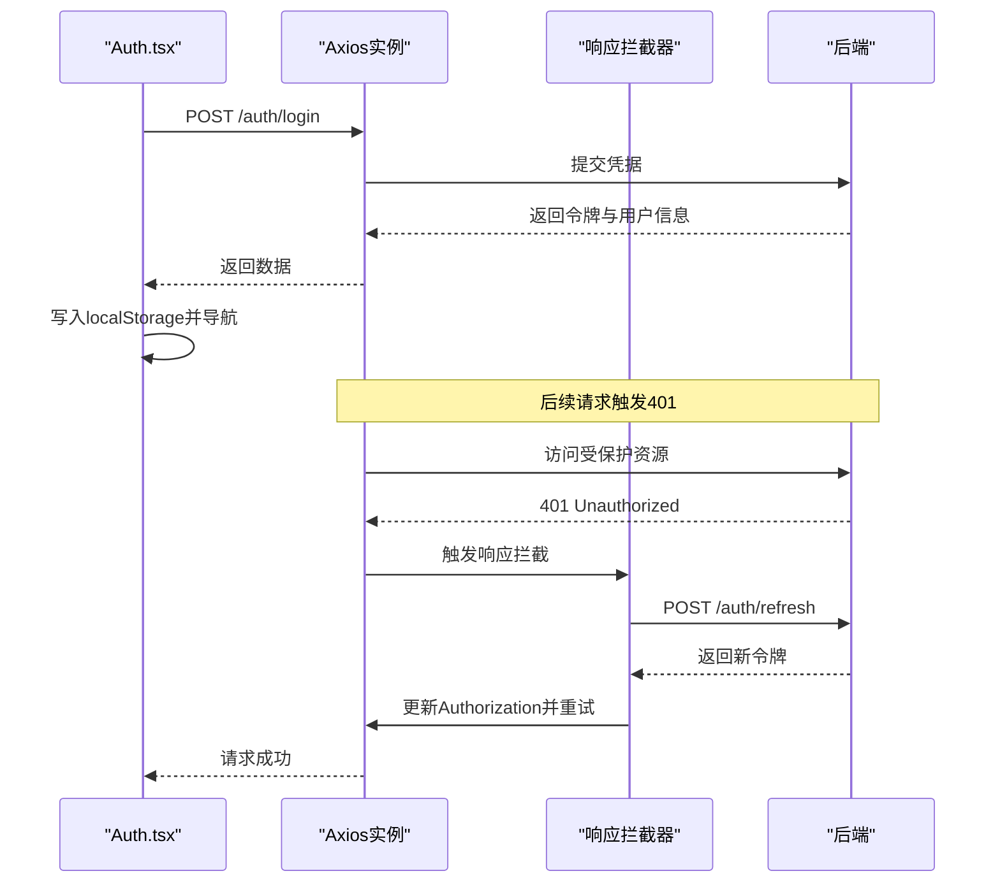
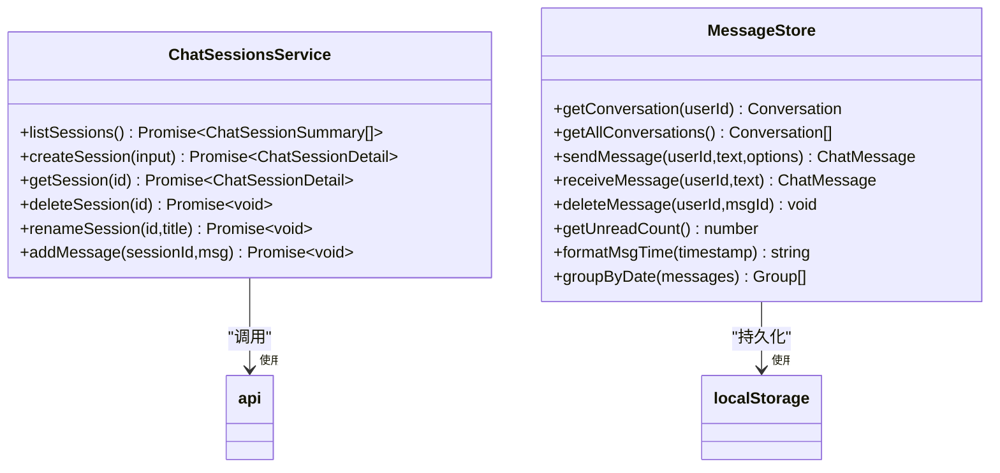
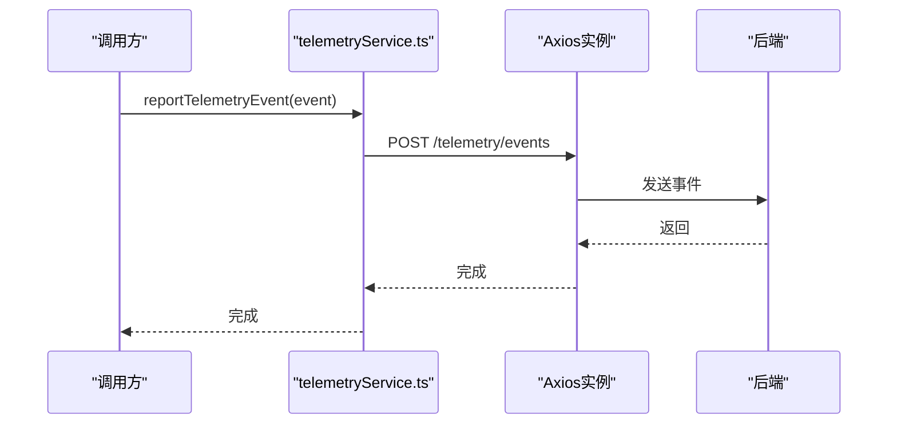
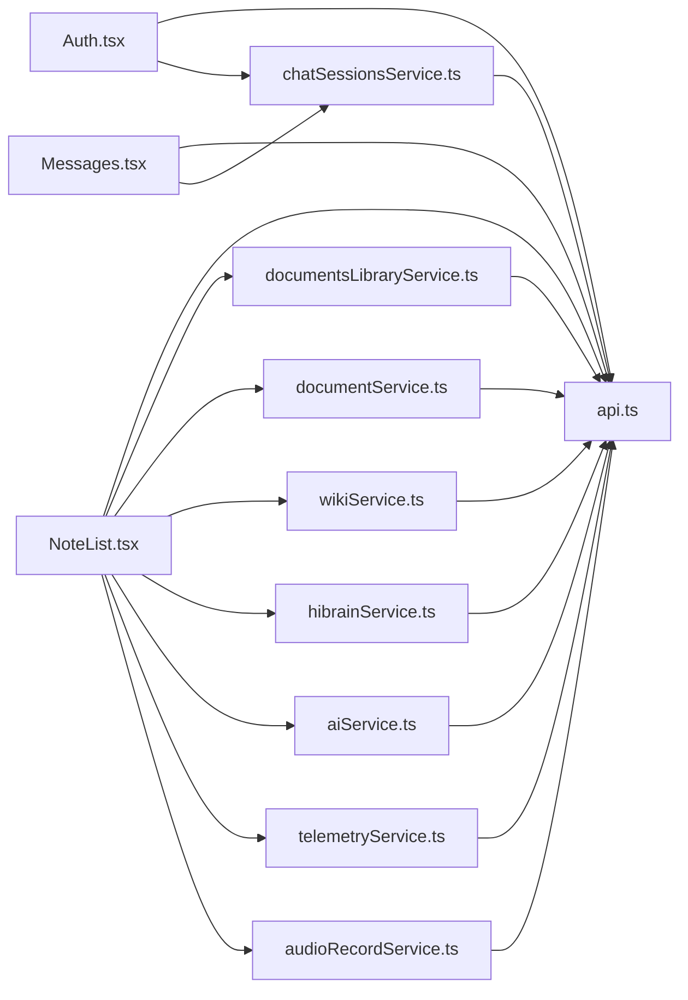

# API通信层

<cite>
**本文引用的文件**
- [api.ts](file://src/app/services/api.ts)
- [chatSessionsService.ts](file://src/app/services/chatSessionsService.ts)
- [messageStore.ts](file://src/app/services/messageStore.ts)
- [telemetryService.ts](file://src/app/services/telemetryService.ts)
- [hibrainService.ts](file://src/app/services/hibrainService.ts)
- [aiService.ts](file://src/app/services/aiService.ts)
- [documentService.ts](file://src/app/services/documentService.ts)
- [documentsLibraryService.ts](file://src/app/services/documentsLibraryService.ts)
- [wikiService.ts](file://src/app/services/wikiService.ts)
- [audioRecordService.ts](file://src/app/services/audioRecordService.ts)
- [Auth.tsx](file://src/app/pages/Auth.tsx)
- [Messages.tsx](file://src/app/pages/Messages.tsx)
- [NoteList.tsx](file://src/app/pages/NoteList.tsx)
</cite>

## 目录
1. [简介](#简介)
2. [项目结构](#项目结构)
3. [核心组件](#核心组件)
4. [架构总览](#架构总览)
5. [详细组件分析](#详细组件分析)
6. [依赖关系分析](#依赖关系分析)
7. [性能考虑](#性能考虑)
8. [故障排查指南](#故障排查指南)
9. [结论](#结论)
10. [附录](#附录)

## 简介
本文件面向API通信层，系统性阐述HTTP客户端封装、认证与令牌管理、错误处理策略、聊天会话与消息存储、遥测上报、API版本与缓存策略、离线处理、网络安全与隐私保护，以及扩展与自定义通信协议的实现方案。目标是帮助开发者在现有代码基础上进行维护、优化与二次开发。

## 项目结构
API通信层主要由以下部分组成：
- HTTP客户端封装与拦截器：统一基地址、超时、默认头、请求/响应拦截与错误翻译
- 业务服务模块：聊天会话、消息存储、遥测、RAG/HiBrain、AI能力、文档库、维基等
- 页面组件：认证页、消息页、笔记页等对服务模块的调用示例

图表来源
- [api.ts:1-127](file://src/app/services/api.ts#L1-L127)
- [chatSessionsService.ts:1-126](file://src/app/services/chatSessionsService.ts#L1-L126)
- [messageStore.ts:1-162](file://src/app/services/messageStore.ts#L1-L162)
- [telemetryService.ts:1-22](file://src/app/services/telemetryService.ts#L1-L22)
- [hibrainService.ts:1-118](file://src/app/services/hibrainService.ts#L1-L118)
- [aiService.ts:1-278](file://src/app/services/aiService.ts#L1-L278)
- [documentService.ts:1-48](file://src/app/services/documentService.ts#L1-L48)
- [documentsLibraryService.ts:1-94](file://src/app/services/documentsLibraryService.ts#L1-L94)
- [wikiService.ts:1-63](file://src/app/services/wikiService.ts#L1-L63)
- [audioRecordService.ts:1-35](file://src/app/services/audioRecordService.ts#L1-L35)
- [Auth.tsx:1-800](file://src/app/pages/Auth.tsx#L1-L800)
- [Messages.tsx:1-348](file://src/app/pages/Messages.tsx#L1-L348)
- [NoteList.tsx:1-800](file://src/app/pages/NoteList.tsx#L1-L800)

章节来源
- [api.ts:1-127](file://src/app/services/api.ts#L1-L127)
- [Auth.tsx:1-800](file://src/app/pages/Auth.tsx#L1-L800)
- [Messages.tsx:1-348](file://src/app/pages/Messages.tsx#L1-L348)
- [NoteList.tsx:1-800](file://src/app/pages/NoteList.tsx#L1-L800)

## 核心组件
- Axios客户端与拦截器
  - 基础URL与平台适配、默认超时与Content-Type
  - 请求拦截：自动附加Authorization头
  - 响应拦截：401自动刷新、错误翻译、全局提示
- 认证与令牌管理
  - 登录成功写入access_token/refresh_token/user_info
  - 自动刷新失败时清理本地状态并跳转登录
- 错误处理
  - 网络异常、5xx服务器错误、后端错误字段翻译
  - 统一错误消息映射，避免泄露内部细节
- 聊天与消息存储
  - 会话与消息的增删改查
  - 本地消息存储（localStorage）用于即时展示与离线体验
- 遥测
  - 异步上报事件，带超时保护
- 其他业务服务
  - HiBrain问答、AI总结/扩写/校对、文档上传/库管理、维基、音频录制插件

章节来源
- [api.ts:1-127](file://src/app/services/api.ts#L1-L127)
- [Auth.tsx:516-549](file://src/app/pages/Auth.tsx#L516-L549)
- [Messages.tsx:137-148](file://src/app/pages/Messages.tsx#L137-L148)
- [messageStore.ts:1-162](file://src/app/services/messageStore.ts#L1-L162)
- [telemetryService.ts:1-22](file://src/app/services/telemetryService.ts#L1-L22)
- [hibrainService.ts:1-118](file://src/app/services/hibrainService.ts#L1-L118)
- [aiService.ts:1-278](file://src/app/services/aiService.ts#L1-L278)
- [documentService.ts:1-48](file://src/app/services/documentService.ts#L1-L48)
- [documentsLibraryService.ts:1-94](file://src/app/services/documentsLibraryService.ts#L1-L94)
- [wikiService.ts:1-63](file://src/app/services/wikiService.ts#L1-L63)
- [audioRecordService.ts:1-35](file://src/app/services/audioRecordService.ts#L1-L35)

## 架构总览
下图展示API层与各业务服务的交互关系，以及认证与拦截器在整个请求生命周期中的作用。

图表来源
- [api.ts:44-126](file://src/app/services/api.ts#L44-L126)
- [Auth.tsx:526-549](file://src/app/pages/Auth.tsx#L526-L549)

## 详细组件分析

### HTTP客户端与拦截器（api.ts）
- 基础配置
  - 基础URL根据环境变量与平台动态决定；移动端默认回退到内网地址
  - 默认超时10秒，Content-Type为application/json
- 请求拦截
  - 从localStorage读取access_token并注入Authorization头
- 响应拦截
  - 401自动刷新：防无限循环、避免对登录接口生效
  - 刷新成功：更新本地令牌并重试原请求
  - 刷新失败：清理本地状态并跳转登录
  - 错误翻译：网络异常、5xx、后端错误字段统一为用户友好提示
- 错误处理策略
  - 未响应：网络开小差
  - 5xx：服务器打了个盹
  - 后端错误：过滤敏感信息，保留简洁提示

图表来源
- [api.ts:44-126](file://src/app/services/api.ts#L44-L126)

章节来源
- [api.ts:1-127](file://src/app/services/api.ts#L1-L127)

### 认证与令牌管理（Auth.tsx + api.ts）
- 登录流程
  - 调用/api/auth/login，接收success及令牌与用户信息
  - 成功后写入access_token、refresh_token、user_info、hi_brain_authed
  - 刷新笔记列表并导航至首页
- 令牌刷新
  - 响应拦截器在401时自动发起/api/auth/refresh
  - 成功后更新本地令牌并重试原请求
  - 失败则清理状态并跳转登录页

图表来源
- [Auth.tsx:516-549](file://src/app/pages/Auth.tsx#L516-L549)
- [api.ts:56-106](file://src/app/services/api.ts#L56-L106)

章节来源
- [Auth.tsx:1-800](file://src/app/pages/Auth.tsx#L1-L800)
- [api.ts:1-127](file://src/app/services/api.ts#L1-L127)

### 聊天会话与消息存储（chatSessionsService.ts + messageStore.ts）
- 聊天会话服务
  - 列表、创建、获取、删除、重命名、新增消息
  - 对后端响应进行解包（data/result兼容）
  - 错误统一封装为API错误消息
- 本地消息存储
  - 基于localStorage的消息持久化
  - 支持发送/接收消息、删除、未读统计、时间格式化、分组显示
  - 通过自定义事件通知订阅者

图表来源
- [chatSessionsService.ts:1-126](file://src/app/services/chatSessionsService.ts#L1-L126)
- [messageStore.ts:1-162](file://src/app/services/messageStore.ts#L1-L162)

章节来源
- [chatSessionsService.ts:1-126](file://src/app/services/chatSessionsService.ts#L1-L126)
- [messageStore.ts:1-162](file://src/app/services/messageStore.ts#L1-L162)
- [Messages.tsx:137-148](file://src/app/pages/Messages.tsx#L137-L148)

### 遥测服务（telemetryService.ts）
- 上报接口：POST /telemetry/events
- 参数：事件名称、时间戳、数据载荷
- 超时2秒，异常静默（不影响主流程）

图表来源
- [telemetryService.ts:1-22](file://src/app/services/telemetryService.ts#L1-L22)
- [api.ts:36-42](file://src/app/services/api.ts#L36-L42)

章节来源
- [telemetryService.ts:1-22](file://src/app/services/telemetryService.ts#L1-L22)

### RAG/HiBrain服务（hibrainService.ts）
- 查询：POST /hibrain/query，标准化答案字段
- 记忆：POST /hibrain/memory、DELETE /hibrain/memory/forget
- 数据归一化：兼容不同根结构（data/result/choices）

章节来源
- [hibrainService.ts:1-118](file://src/app/services/hibrainService.ts#L1-L118)

### AI能力服务（aiService.ts）
- 智能扩写、校对、表格生成、思维导图生成
- 文本/文档总结：POST /ai/summary/text 或 /ai/summary
- 错误映射：将后端错误结构映射为用户可见的标题/副标题/状态码/错误ID

章节来源
- [aiService.ts:1-278](file://src/app/services/aiService.ts#L1-L278)

### 文档与文档库（documentService.ts + documentsLibraryService.ts）
- 文档上传：multipart/form-data，解析返回的分析结果
- 文档库：列出、获取、上传、更新、删除
- 错误处理：重复文档、上传失败、返回结构校验

章节来源
- [documentService.ts:1-48](file://src/app/services/documentService.ts#L1-L48)
- [documentsLibraryService.ts:1-94](file://src/app/services/documentsLibraryService.ts#L1-L94)

### 维基服务（wikiService.ts）
- 健康检查、编译源、分页查询、按来源查询、详情获取
- 本地缓存：最近浏览、条目详情

章节来源
- [wikiService.ts:1-63](file://src/app/services/wikiService.ts#L1-L63)

### 音频录制插件（audioRecordService.ts）
- Capacitor插件封装：开始/停止、音频块事件监听
- 用于移动端语音输入场景

章节来源
- [audioRecordService.ts:1-35](file://src/app/services/audioRecordService.ts#L1-L35)

## 依赖关系分析
- 组件耦合
  - 页面组件仅依赖服务模块，服务模块依赖api.ts
  - chatSessionsService与messageStore职责分离：远端会话与本地消息
- 外部依赖
  - Axios作为HTTP客户端
  - Capacitor用于移动端能力（音频录制）
- 循环依赖
  - 未见明显循环依赖；服务模块之间通过api.ts间接通信

图表来源
- [api.ts:1-127](file://src/app/services/api.ts#L1-L127)
- [Auth.tsx:1-800](file://src/app/pages/Auth.tsx#L1-L800)
- [Messages.tsx:1-348](file://src/app/pages/Messages.tsx#L1-L348)
- [NoteList.tsx:1-800](file://src/app/pages/NoteList.tsx#L1-L800)
- [chatSessionsService.ts:1-126](file://src/app/services/chatSessionsService.ts#L1-L126)
- [documentsLibraryService.ts:1-94](file://src/app/services/documentsLibraryService.ts#L1-L94)
- [documentService.ts:1-48](file://src/app/services/documentService.ts#L1-L48)
- [wikiService.ts:1-63](file://src/app/services/wikiService.ts#L1-L63)
- [hibrainService.ts:1-118](file://src/app/services/hibrainService.ts#L1-L118)
- [aiService.ts:1-278](file://src/app/services/aiService.ts#L1-L278)
- [telemetryService.ts:1-22](file://src/app/services/telemetryService.ts#L1-L22)
- [audioRecordService.ts:1-35](file://src/app/services/audioRecordService.ts#L1-L35)

章节来源
- [api.ts:1-127](file://src/app/services/api.ts#L1-L127)
- [Auth.tsx:1-800](file://src/app/pages/Auth.tsx#L1-L800)
- [Messages.tsx:1-348](file://src/app/pages/Messages.tsx#L1-L348)
- [NoteList.tsx:1-800](file://src/app/pages/NoteList.tsx#L1-L800)

## 性能考虑
- 超时控制
  - 全局默认10秒；遥测2秒；AI总结60秒；按需调整
- 重试与幂等
  - 响应拦截器防止无限循环；刷新令牌后重试一次
- 本地缓存
  - 消息存储与维基条目使用localStorage，减少网络往返
- 并发与节流
  - 文档库列表加载采用一次性拉取并缓存；短视频来源轮询6秒
- UI体验
  - 加载态与骨架屏提升感知性能；错误提示明确但不过度阻断

[本节为通用指导，无需特定文件引用]

## 故障排查指南
- 登录后仍提示未授权
  - 检查请求拦截器是否注入Authorization头
  - 确认localStorage中access_token/refresh_token存在
- 401频繁触发
  - 检查刷新逻辑是否被触发（非登录接口）
  - 确认刷新接口返回的新令牌是否写入localStorage
- 网络错误/“服务器打了个盹”
  - 检查网络连通性与代理设置
  - 查看响应拦截器的错误翻译逻辑
- 上传失败
  - 校验multipart/form-data构造与后端期望字段
  - 关注重复文档与返回结构校验
- 遥测不上报
  - 检查超时与静默处理逻辑
  - 确认后端/网络可达

章节来源
- [api.ts:56-126](file://src/app/services/api.ts#L56-L126)
- [Auth.tsx:516-549](file://src/app/pages/Auth.tsx#L516-L549)
- [documentService.ts:36-46](file://src/app/services/documentService.ts#L36-L46)
- [documentsLibraryService.ts:64-82](file://src/app/services/documentsLibraryService.ts#L64-L82)
- [telemetryService.ts:9-21](file://src/app/services/telemetryService.ts#L9-L21)

## 结论
该API通信层以Axios为核心，通过拦截器实现了统一的认证、令牌刷新与错误翻译；业务服务模块围绕聊天、消息、遥测、RAG、AI、文档与维基展开，职责清晰、耦合度低。配合localStorage的本地存储与合理的超时策略，既保证了用户体验，也为扩展与自定义提供了清晰的边界。

[本节为总结，无需特定文件引用]

## 附录

### API版本管理与缓存策略
- 版本管理
  - 基础URL通过环境变量与平台动态决定，便于灰度与多环境管理
- 缓存策略
  - localStorage用于消息与维基条目缓存
  - 文档库列表一次性拉取并标记已加载，避免重复请求
  - 短视频来源每6秒轮询，保持状态同步

章节来源
- [api.ts:21-34](file://src/app/services/api.ts#L21-L34)
- [messageStore.ts:19-32](file://src/app/services/messageStore.ts#L19-L32)
- [wikiService.ts:31-46](file://src/app/services/wikiService.ts#L31-L46)
- [NoteList.tsx:413-459](file://src/app/pages/NoteList.tsx#L413-L459)

### 离线处理
- 消息即时展示：本地消息存储先于远端同步
- 会话列表：页面首次加载后可基于本地状态渲染，再异步刷新
- 上传/同步：失败时保留本地状态，引导用户重试

章节来源
- [messageStore.ts:78-104](file://src/app/services/messageStore.ts#L78-L104)
- [Messages.tsx:137-148](file://src/app/pages/Messages.tsx#L137-L148)

### 网络安全与隐私保护
- 传输安全
  - 使用HTTPS（基础URL以http开头时需在生产环境替换为https）
- 令牌安全
  - 仅在内存与localStorage中持有，避免在URL或日志中暴露
  - 401自动刷新，降低长期持有令牌的风险
- 隐私保护
  - 错误翻译过滤敏感信息，避免泄露SQL/JSON细节
  - 遥测静默处理，不阻断主流程

章节来源
- [api.ts:4-34](file://src/app/services/api.ts#L4-L34)
- [api.ts:108-122](file://src/app/services/api.ts#L108-L122)

### 开发者扩展与自定义通信协议
- 新增业务服务
  - 在src/app/services目录下创建新服务文件，统一使用api.ts实例
  - 如需特殊头或序列化规则，在服务内部封装
- 自定义拦截器
  - 在api.ts中扩展interceptors.request/interceptors.response
  - 注意避免与现有401刷新逻辑冲突
- 插件化能力
  - 音频录制等移动端能力通过Capacitor插件接入
  - 保持与Web端的接口一致性

章节来源
- [api.ts:36-54](file://src/app/services/api.ts#L36-L54)
- [audioRecordService.ts:1-35](file://src/app/services/audioRecordService.ts#L1-L35)