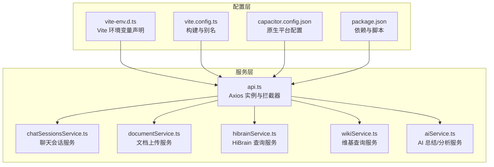
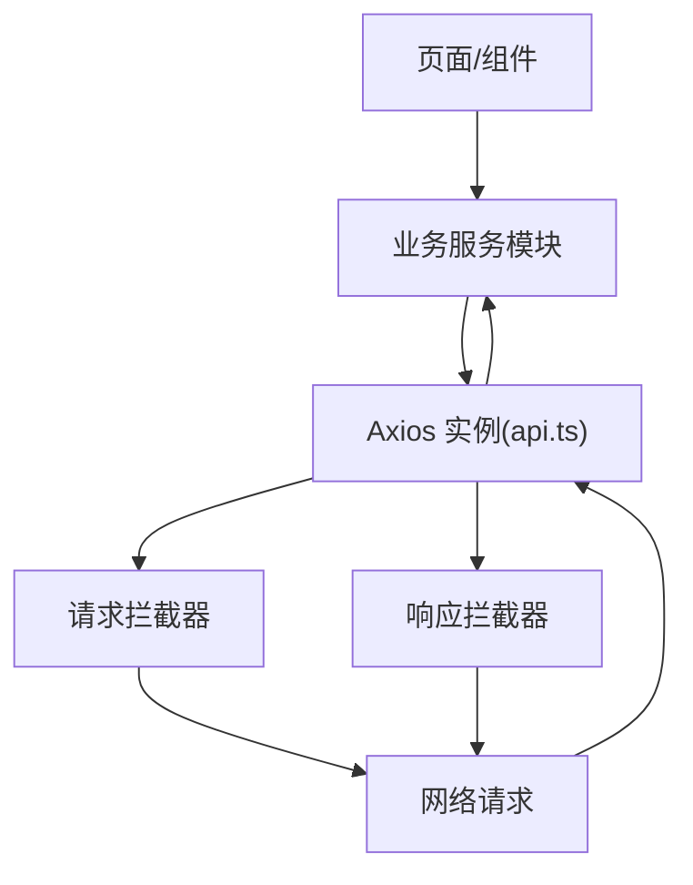
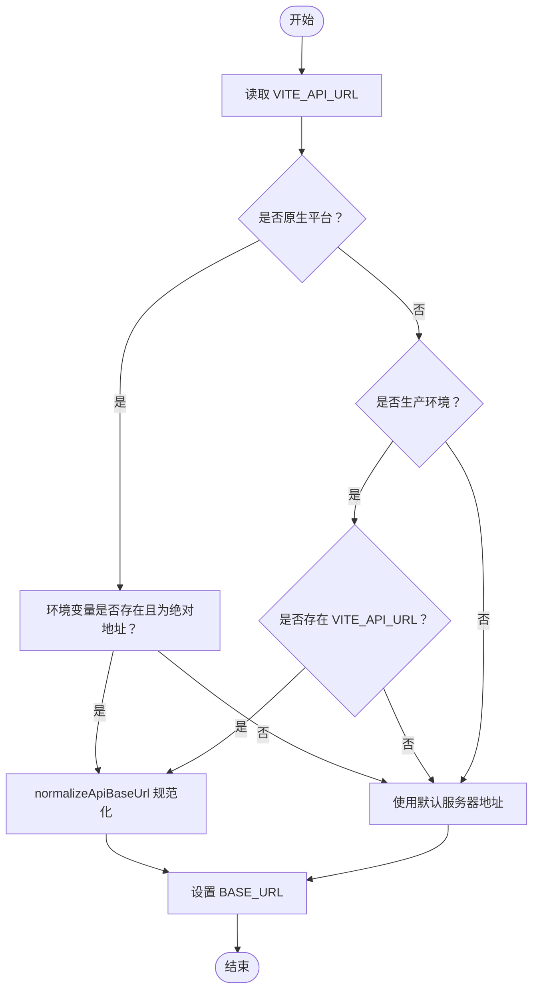
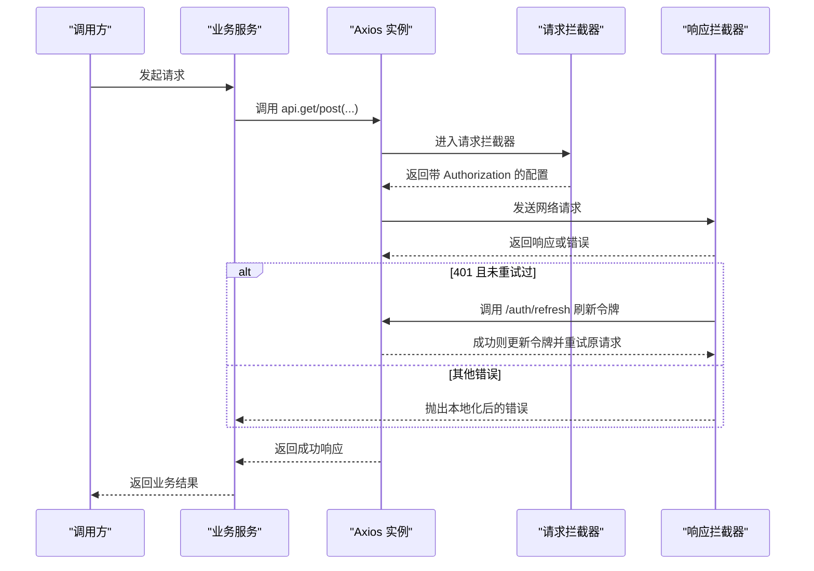
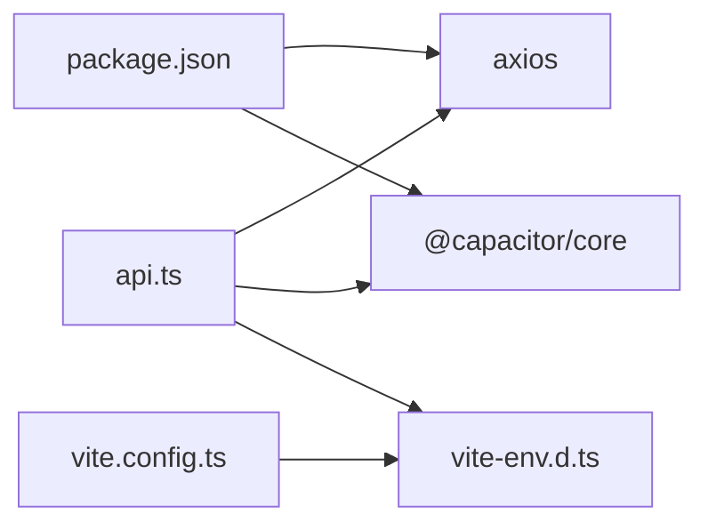

# HTTP客户端配置

<cite>
**本文引用的文件**
- [src/app/services/api.ts](file://src/app/services/api.ts)
- [src/app/services/chatSessionsService.ts](file://src/app/services/chatSessionsService.ts)
- [src/app/services/documentService.ts](file://src/app/services/documentService.ts)
- [src/app/services/hibrainService.ts](file://src/app/services/hibrainService.ts)
- [src/app/services/wikiService.ts](file://src/app/services/wikiService.ts)
- [src/app/services/aiService.ts](file://src/app/services/aiService.ts)
- [src/vite-env.d.ts](file://src/vite-env.d.ts)
- [vite.config.ts](file://vite.config.ts)
- [capacitor.config.json](file://capacitor.config.json)
- [package.json](file://package.json)
</cite>

## 目录
1. [简介](#简介)
2. [项目结构](#项目结构)
3. [核心组件](#核心组件)
4. [架构总览](#架构总览)
5. [详细组件分析](#详细组件分析)
6. [依赖关系分析](#依赖关系分析)
7. [性能考量](#性能考量)
8. [故障排查指南](#故障排查指南)
9. [结论](#结论)
10. [附录](#附录)

## 简介
本文件面向前端工程中的HTTP客户端配置，围绕基于 Axios 的统一客户端实例进行系统化技术说明。重点覆盖以下方面：
- Axios 实例创建与配置：baseURL 动态设置、超时、默认请求头
- URL 规范化函数：绝对路径与相对路径的处理逻辑
- 环境变量与平台检测：Vite 环境变量、Capacitor 原生平台检测
- Web 与原生环境的差异化 API 配置策略
- 请求拦截器与响应拦截器：鉴权令牌附加、自动刷新与错误翻译
- CORS 处理与安全注意事项
- 最佳实践、常见问题与扩展建议

## 项目结构
本项目的 HTTP 客户端集中于服务层的统一入口，各业务模块通过该入口发起请求，形成清晰的分层与职责分离。

图表来源
- [src/app/services/api.ts:1-127](file://src/app/services/api.ts#L1-L127)
- [src/app/services/chatSessionsService.ts:1-126](file://src/app/services/chatSessionsService.ts#L1-L126)
- [src/app/services/documentService.ts:1-48](file://src/app/services/documentService.ts#L1-L48)
- [src/app/services/hibrainService.ts:1-118](file://src/app/services/hibrainService.ts#L1-L118)
- [src/app/services/wikiService.ts:1-63](file://src/app/services/wikiService.ts#L1-L63)
- [src/app/services/aiService.ts:1-278](file://src/app/services/aiService.ts#L1-L278)
- [src/vite-env.d.ts:1-12](file://src/vite-env.d.ts#L1-L12)
- [vite.config.ts:1-44](file://vite.config.ts#L1-L44)
- [capacitor.config.json:1-31](file://capacitor.config.json#L1-L31)
- [package.json:1-113](file://package.json#L1-L113)

章节来源
- [src/app/services/api.ts:1-127](file://src/app/services/api.ts#L1-L127)
- [src/vite-env.d.ts:1-12](file://src/vite-env.d.ts#L1-L12)
- [vite.config.ts:1-44](file://vite.config.ts#L1-L44)
- [capacitor.config.json:1-31](file://capacitor.config.json#L1-L31)
- [package.json:1-113](file://package.json#L1-L113)

## 核心组件
- 统一 Axios 实例与配置
  - baseURL 动态计算：根据环境变量与平台特性决定最终值
  - 超时设置：全局超时时间
  - 默认请求头：Content-Type 等
- URL 规范化工具
  - 判断是否为绝对 HTTP(S) 地址
  - 规范化 base URL，确保以 /api 结尾
- 平台与环境检测
  - Capacitor 原生平台检测
  - Vite 环境变量读取
- 拦截器体系
  - 请求拦截器：自动附加 Authorization 头
  - 响应拦截器：401 自动刷新、错误消息本地化

章节来源
- [src/app/services/api.ts:1-127](file://src/app/services/api.ts#L1-L127)

## 架构总览
下图展示 HTTP 客户端在应用中的位置与调用关系：

图表来源
- [src/app/services/api.ts:36-54](file://src/app/services/api.ts#L36-L54)
- [src/app/services/api.ts:56-126](file://src/app/services/api.ts#L56-L126)

## 详细组件分析

### Axios 实例与配置
- 实例创建
  - 通过 axios.create 初始化，传入 baseURL、timeout、headers 等参数
- baseURL 动态设置
  - 依据 import.meta.env.VITE_API_URL 与 Capacitor.isNativePlatform() 计算
  - 在原生平台且环境变量为空或非绝对地址时，回退到默认服务器地址
- 超时与请求头
  - 全局超时 10 秒
  - 默认 Content-Type 为 application/json
- 请求拦截器
  - 从 localStorage 读取 access_token，并附加到 Authorization 头
- 响应拦截器
  - 401 无刷新或刷新失败时跳转登录页
  - 自动刷新流程：调用 /auth/refresh 获取新令牌并重试原请求
  - 错误消息本地化：网络异常、5xx、后端错误字段等

章节来源
- [src/app/services/api.ts:36-42](file://src/app/services/api.ts#L36-L42)
- [src/app/services/api.ts:44-54](file://src/app/services/api.ts#L44-L54)
- [src/app/services/api.ts:56-126](file://src/app/services/api.ts#L56-L126)

### URL 规范化函数
- isAbsoluteHttpUrl
  - 用于判断字符串是否为 http(s) 绝对地址
- normalizeApiBaseUrl
  - 去除空格与尾随斜杠
  - 若末尾不为 /api，则补全为 /api
  - 空字符串时返回 /api
- baseURL 决策流程
  - 原生平台：若环境变量为空、以 / 开头或不是绝对地址，则使用默认服务器地址；否则按 normalizeApiBaseUrl 规范化
  - 生产环境 Web：若存在环境变量则规范化，否则使用默认服务器地址

图表来源
- [src/app/services/api.ts:21-32](file://src/app/services/api.ts#L21-L32)
- [src/app/services/api.ts:8-19](file://src/app/services/api.ts#L8-L19)

章节来源
- [src/app/services/api.ts:8-19](file://src/app/services/api.ts#L8-L19)
- [src/app/services/api.ts:21-32](file://src/app/services/api.ts#L21-L32)

### 平台与环境检测机制
- Capacitor 原生平台检测
  - 使用 Capacitor.isNativePlatform() 判断运行环境
- Vite 环境变量
  - 通过 import.meta.env.VITE_API_URL 注入
  - 在 vite-env.d.ts 中声明类型
- 构建与别名
  - vite.config.ts 提供路径别名与依赖优化，间接影响打包与运行时解析

章节来源
- [src/app/services/api.ts:5-6](file://src/app/services/api.ts#L5-L6)
- [src/app/services/api.ts:23-32](file://src/app/services/api.ts#L23-L32)
- [src/vite-env.d.ts:3-10](file://src/vite-env.d.ts#L3-L10)
- [vite.config.ts:22-24](file://vite.config.ts#L22-L24)

### Web 与原生环境的 API 配置策略
- 原生平台
  - 优先使用 VITE_API_URL；若为空或无效，则回退到默认服务器地址
  - 便于在不同部署环境下灵活切换
- 生产环境 Web
  - 严格依赖 VITE_API_URL；若未提供则回退默认地址
- 开发环境 Web
  - 可通过 VITE_API_URL 指向开发后端；未提供时可使用默认地址

章节来源
- [src/app/services/api.ts:23-32](file://src/app/services/api.ts#L23-L32)

### 请求拦截器与响应拦截器
- 请求拦截器
  - 自动附加 Bearer Token
  - 不对登录接口进行拦截，避免循环
- 响应拦截器
  - 401 时尝试刷新令牌并重试
  - 刷新失败或无刷新令牌时清理本地存储并跳转登录
  - 对网络异常、5xx 与后端错误进行本地化提示

图表来源
- [src/app/services/api.ts:44-54](file://src/app/services/api.ts#L44-L54)
- [src/app/services/api.ts:56-126](file://src/app/services/api.ts#L56-L126)

章节来源
- [src/app/services/api.ts:44-54](file://src/app/services/api.ts#L44-L54)
- [src/app/services/api.ts:56-126](file://src/app/services/api.ts#L56-L126)

### 业务服务模块与统一客户端的协作
- chatSessionsService
  - 通过 api.get/post/delete 等方法访问 /chat/sessions 及其子资源
- documentService
  - 上传文件时使用 multipart/form-data，并在成功后解析分析结果
- hibrainService
  - 通过 api.post 访问 /hibrain/query、/hibrain/memory 等接口
- wikiService
  - 通过 api.get/post 访问 /wiki/* 接口
- aiService
  - 通过 api.post 访问 /ai/summary 等接口，并在部分调用中覆盖超时时间

章节来源
- [src/app/services/chatSessionsService.ts:66-125](file://src/app/services/chatSessionsService.ts#L66-L125)
- [src/app/services/documentService.ts:15-46](file://src/app/services/documentService.ts#L15-L46)
- [src/app/services/hibrainService.ts:89-117](file://src/app/services/hibrainService.ts#L89-L117)
- [src/app/services/wikiService.ts:55-61](file://src/app/services/wikiService.ts#L55-L61)
- [src/app/services/aiService.ts:99-155](file://src/app/services/aiService.ts#L99-L155)

## 依赖关系分析
- Axios 版本与拦截器
  - 项目依赖 axios，拦截器使用 axios 内置能力
- Capacitor 平台检测
  - 通过 @capacitor/core 提供的 isNativePlatform 判断运行环境
- 构建与环境变量
  - Vite 提供 import.meta.env，vite-env.d.ts 声明类型
  - vite.config.ts 提供路径别名与依赖优化，减少重复包

图表来源
- [package.json:57-14](file://package.json#L57-L14)
- [vite.config.ts:1-44](file://vite.config.ts#L1-L44)
- [src/vite-env.d.ts:1-12](file://src/vite-env.d.ts#L1-L12)
- [src/app/services/api.ts:1-2](file://src/app/services/api.ts#L1-L2)

章节来源
- [package.json:57-14](file://package.json#L57-L14)
- [vite.config.ts:1-44](file://vite.config.ts#L1-L44)
- [src/vite-env.d.ts:1-12](file://src/vite-env.d.ts#L1-L12)
- [src/app/services/api.ts:1-2](file://src/app/services/api.ts#L1-L2)

## 性能考量
- 超时设置
  - 全局超时 10 秒，针对长耗时任务（如 AI 总结）可在业务层单独覆盖
- 依赖预打包
  - vite.config.ts 中对关键依赖进行预打包，降低冷启动与重复包风险
- 请求头复用
  - 通过 axios.defaults.headers.common 统一维护 Authorization，避免重复设置

章节来源
- [src/app/services/api.ts:36-42](file://src/app/services/api.ts#L36-L42)
- [src/app/services/aiService.ts:104-134](file://src/app/services/aiService.ts#L104-L134)
- [vite.config.ts:27-41](file://vite.config.ts#L27-L41)

## 故障排查指南
- 网络异常
  - 未获取到响应时，错误消息会被本地化为“网络开小差了，请检查网络连接或稍后再试”
- 服务器内部错误
  - 5xx 时本地化为“服务器打了个盹，请稍后再试”
- 后端错误字段
  - 若后端返回 error 字段，且不包含敏感信息（如 SQL/JSON），则直接使用；否则使用通用提示
- 401 未授权
  - 首次 401 时尝试刷新；若刷新失败或无刷新令牌，清除本地存储并跳转登录页
- CORS 与原生平台
  - 原生平台通过 Capacitor 的 server 配置允许明文传输与自定义 scheme，注意仅在受控环境下启用
- 环境变量未生效
  - 确认 VITE_API_URL 是否在构建时注入，以及在运行时可通过 import.meta.env 读取

章节来源
- [src/app/services/api.ts:108-122](file://src/app/services/api.ts#L108-L122)
- [src/app/services/api.ts:62-106](file://src/app/services/api.ts#L62-L106)
- [capacitor.config.json:5-8](file://capacitor.config.json#L5-L8)

## 结论
本项目通过统一的 Axios 客户端与拦截器体系，实现了跨平台一致的 HTTP 访问体验。baseURL 的动态计算与 URL 规范化保证了在 Web 与原生环境下的稳定行为；请求与响应拦截器提供了鉴权、刷新与错误本地化的完整链路。配合 Vite 环境变量与 Capacitor 平台检测，能够在多环境下灵活配置与快速定位问题。

## 附录

### CORS 处理与安全建议
- CORS 由后端服务控制，前端需确保请求域名与协议与后端一致
- 原生平台允许明文 HTTP（cleartext=true），仅在开发或受控环境下使用
- 建议生产环境使用 HTTPS，避免混合内容与中间人攻击

章节来源
- [capacitor.config.json:5-8](file://capacitor.config.json#L5-L8)

### 扩展与自定义指导
- 新增业务服务
  - 在 src/app/services 下新增服务文件，导入 api 并封装具体接口
  - 对于需要特殊超时或头部的请求，在调用时传入对应配置
- 自定义 baseURL
  - 通过 VITE_API_URL 注入；在原生平台下若为空或无效将回退默认地址
- 自定义拦截器
  - 可在现有拦截器基础上扩展，但需避免无限重试与循环
- 错误处理
  - 保持统一的错误本地化策略，避免泄露后端敏感信息

章节来源
- [src/app/services/api.ts:36-42](file://src/app/services/api.ts#L36-L42)
- [src/app/services/api.ts:56-126](file://src/app/services/api.ts#L56-L126)
- [src/app/services/aiService.ts:104-134](file://src/app/services/aiService.ts#L104-L134)