# 聊天通信服务

<cite>
**本文档引用的文件**
- [chatSessionsService.ts](file://src/app/services/chatSessionsService.ts)
- [messageStore.ts](file://src/app/services/messageStore.ts)
- [api.ts](file://src/app/services/api.ts)
- [Messages.tsx](file://src/app/pages/Messages.tsx)
- [ConversationDetail.tsx](file://src/app/pages/ConversationDetail.tsx)
- [DirectMessageSheet.tsx](file://src/app/components/DirectMessageSheet.tsx)
- [HiBrain.tsx](file://src/app/pages/HiBrain.tsx)
- [README.md](file://README.md)
</cite>

## 目录
1. [简介](#简介)
2. [项目结构](#项目结构)
3. [核心组件](#核心组件)
4. [架构概览](#架构概览)
5. [详细组件分析](#详细组件分析)
6. [依赖关系分析](#依赖关系分析)
7. [性能考虑](#性能考虑)
8. [故障排除指南](#故障排除指南)
9. [结论](#结论)

## 简介

本项目是一个基于 React 的笔记应用前端，包含完整的聊天通信服务实现。该服务提供了会话管理、消息存储、实时通信和富文本卡片等功能。系统采用前后端分离架构，通过 RESTful API 进行通信，并实现了本地消息缓存和云端同步机制。

聊天通信服务主要分为两个层面：
- **云端会话服务**：基于 `/chat/sessions` 和 `/chat/conversations` 的 REST API
- **本地消息存储**：基于 localStorage 的消息缓存系统

## 项目结构

项目采用模块化的组织方式，核心聊天功能分布在以下目录结构中：

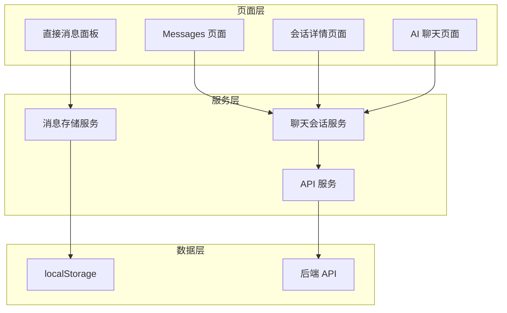

**图表来源**
- [Messages.tsx:130-152](file://src/app/pages/Messages.tsx#L130-L152)
- [chatSessionsService.ts:66-125](file://src/app/services/chatSessionsService.ts#L66-L125)
- [messageStore.ts:19-32](file://src/app/services/messageStore.ts#L19-L32)

**章节来源**
- [Messages.tsx:1-348](file://src/app/pages/Messages.tsx#L1-L348)
- [chatSessionsService.ts:1-126](file://src/app/services/chatSessionsService.ts#L1-L126)
- [messageStore.ts:1-162](file://src/app/services/messageStore.ts#L1-L162)

## 核心组件

### 聊天会话服务 (ChatSessionsService)

聊天会话服务是云端聊天功能的核心，负责与后端 API 进行交互，管理聊天会话的生命周期。

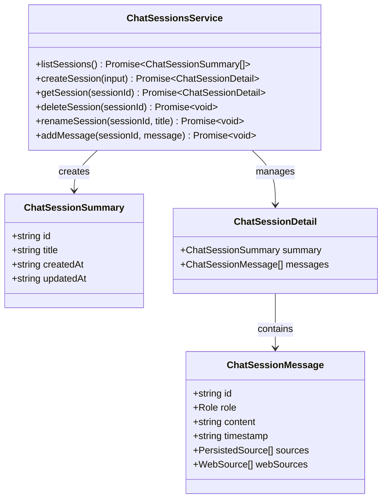

**图表来源**
- [chatSessionsService.ts:27-55](file://src/app/services/chatSessionsService.ts#L27-L55)
- [chatSessionsService.ts:66-125](file://src/app/services/chatSessionsService.ts#L66-L125)

### 消息存储服务 (MessageStore)

消息存储服务提供本地消息缓存功能，基于 localStorage 实现消息的持久化存储。

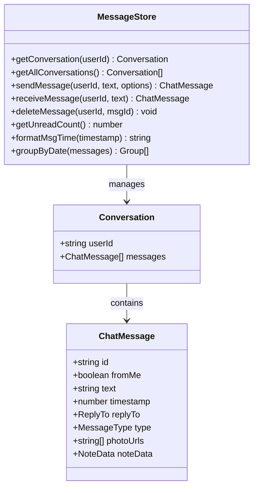

**图表来源**
- [messageStore.ts:3-17](file://src/app/services/messageStore.ts#L3-L17)
- [messageStore.ts:68-162](file://src/app/services/messageStore.ts#L68-L162)

### API 服务

API 服务封装了 HTTP 请求的配置和拦截器，提供了统一的 API 访问接口。

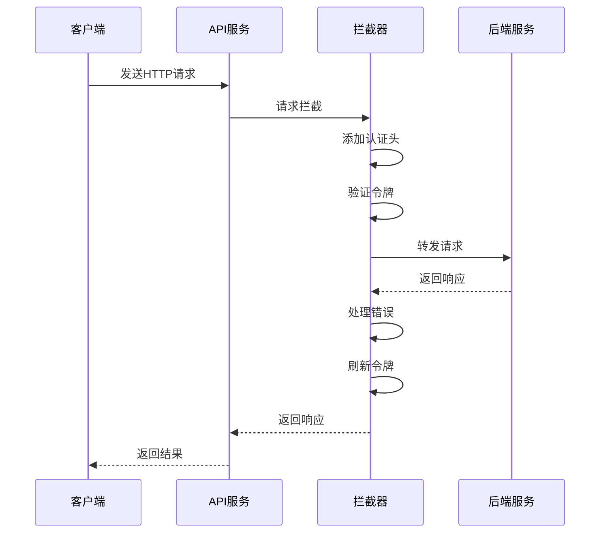

**图表来源**
- [api.ts:36-126](file://src/app/services/api.ts#L36-L126)

**章节来源**
- [chatSessionsService.ts:27-125](file://src/app/services/chatSessionsService.ts#L27-L125)
- [messageStore.ts:3-162](file://src/app/services/messageStore.ts#L3-L162)
- [api.ts:36-126](file://src/app/services/api.ts#L36-L126)

## 架构概览

系统采用分层架构设计，实现了清晰的关注点分离：

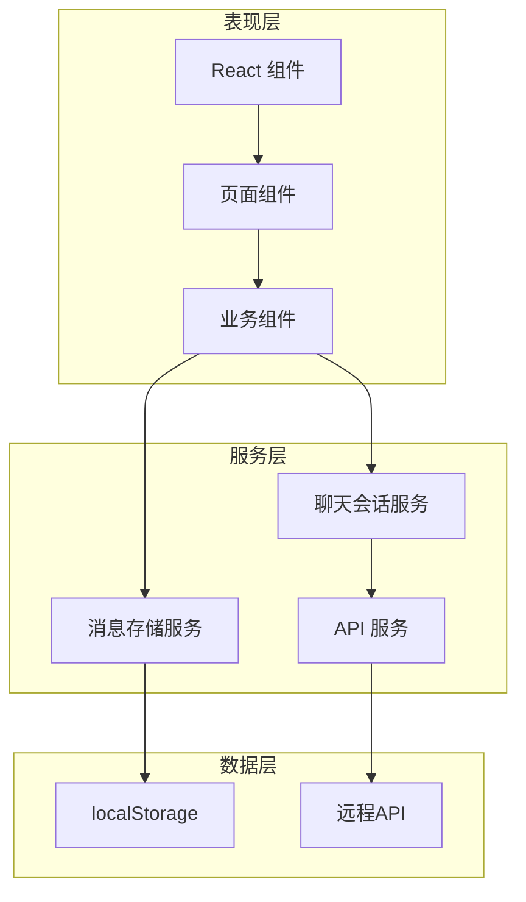

**图表来源**
- [HiBrain.tsx:25-45](file://src/app/pages/HiBrain.tsx#L25-L45)
- [DirectMessageSheet.tsx:8-11](file://src/app/components/DirectMessageSheet.tsx#L8-L11)

### 数据流架构

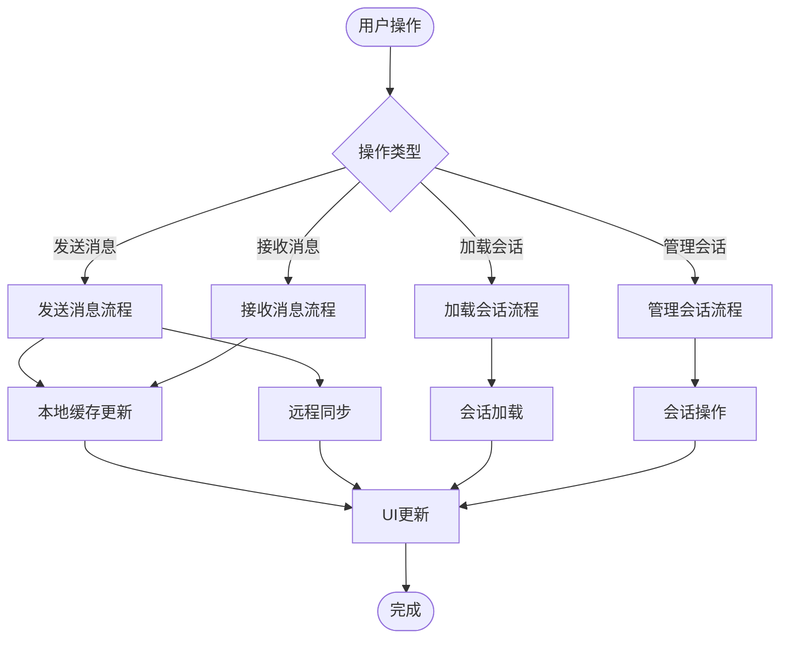

**图表来源**
- [DirectMessageSheet.tsx:620-646](file://src/app/components/DirectMessageSheet.tsx#L620-L646)
- [chatSessionsService.ts:111-124](file://src/app/services/chatSessionsService.ts#L111-L124)

## 详细组件分析

### 会话管理系统

会话管理系统提供了完整的聊天会话生命周期管理：

#### 会话创建流程

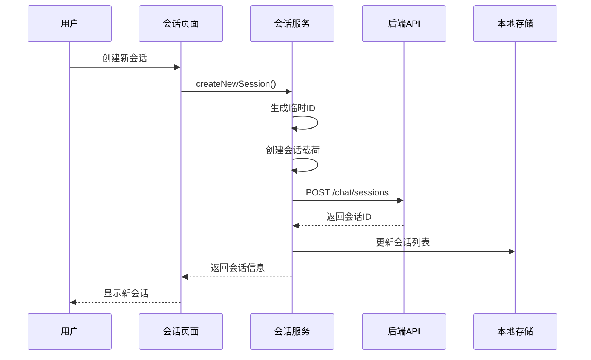

**图表来源**
- [HiBrain.tsx:1007-1052](file://src/app/pages/HiBrain.tsx#L1007-L1052)
- [chatSessionsService.ts:77-84](file://src/app/services/chatSessionsService.ts#L77-L84)

#### 会话管理功能

会话管理功能包括会话列表显示、会话切换、会话重命名等操作：

**章节来源**
- [HiBrain.tsx:1054-1094](file://src/app/pages/HiBrain.tsx#L1054-L1094)
- [chatSessionsService.ts:66-109](file://src/app/services/chatSessionsService.ts#L66-L109)

### 消息存储机制

消息存储机制实现了本地缓存、数据同步和离线消息处理：

#### 本地消息缓存

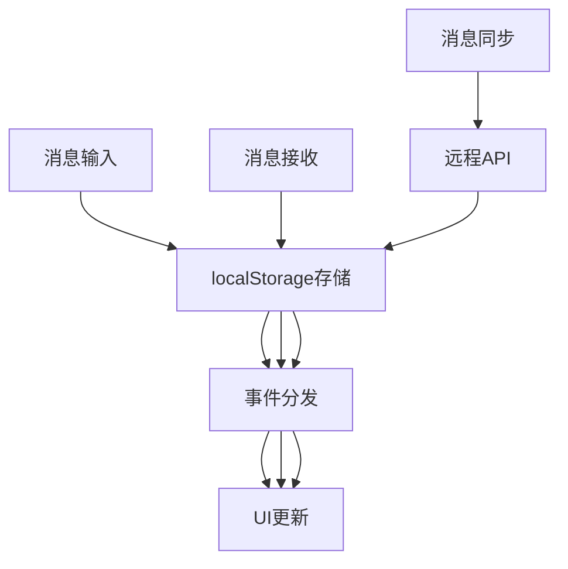

**图表来源**
- [messageStore.ts:21-32](file://src/app/services/messageStore.ts#L21-L32)
- [DirectMessageSheet.tsx:541-552](file://src/app/components/DirectMessageSheet.tsx#L541-L552)

#### 消息格式化和分组

消息存储服务提供了多种消息格式化和分组功能：

**章节来源**
- [messageStore.ts:138-162](file://src/app/services/messageStore.ts#L138-L162)
- [DirectMessageSheet.tsx:648](file://src/app/components/DirectMessageSheet.tsx#L648)

### 实时通信实现

虽然项目中没有直接的 WebSocket 实现，但通过以下机制实现了准实时通信：

#### 轮询机制

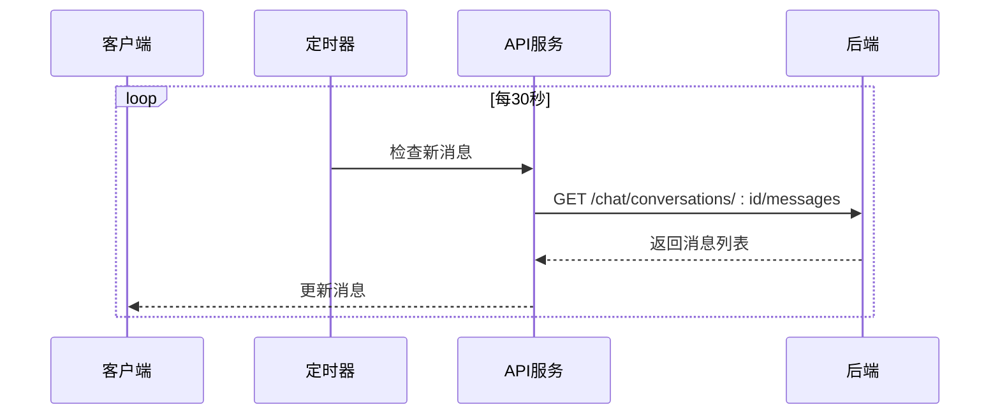

**图表来源**
- [ConversationDetail.tsx:54-72](file://src/app/pages/ConversationDetail.tsx#L54-L72)

#### 事件驱动更新

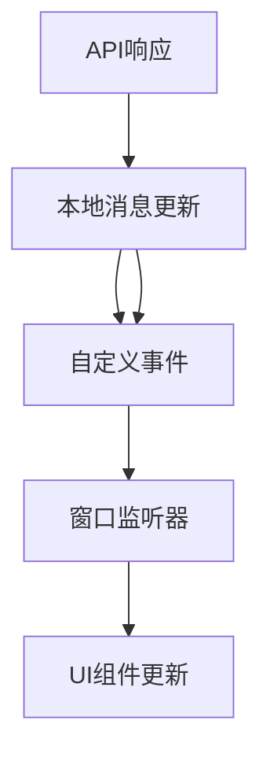

**图表来源**
- [messageStore.ts:29-32](file://src/app/services/messageStore.ts#L29-L32)
- [DirectMessageSheet.tsx:541-552](file://src/app/components/DirectMessageSheet.tsx#L541-L552)

### 消息队列和确认机制

系统实现了简单但有效的消息队列和确认机制：

#### 消息发送队列

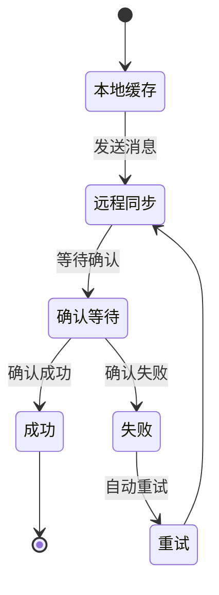

**图表来源**
- [DirectMessageSheet.tsx:620-629](file://src/app/components/DirectMessageSheet.tsx#L620-L629)
- [chatSessionsService.ts:111-124](file://src/app/services/chatSessionsService.ts#L111-L124)

### 聊天历史持久化

聊天历史持久化策略采用了混合存储方案：

#### 本地持久化

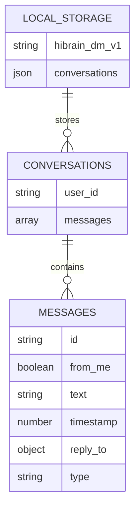

**图表来源**
- [messageStore.ts:19](file://src/app/services/messageStore.ts#L19)
- [messageStore.ts:14](file://src/app/services/messageStore.ts#L14)

#### 云端同步

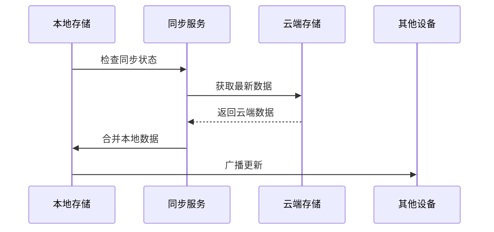

**图表来源**
- [chatSessionsService.ts:66-125](file://src/app/services/chatSessionsService.ts#L66-L125)

**章节来源**
- [messageStore.ts:19-66](file://src/app/services/messageStore.ts#L19-L66)
- [chatSessionsService.ts:66-125](file://src/app/services/chatSessionsService.ts#L66-L125)

## 依赖关系分析

系统各组件之间的依赖关系如下：

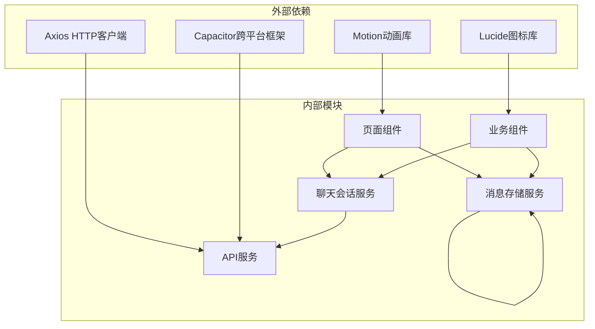

**图表来源**
- [api.ts:1-127](file://src/app/services/api.ts#L1-L127)
- [Messages.tsx:1-348](file://src/app/pages/Messages.tsx#L1-L348)
- [DirectMessageSheet.tsx:1-800](file://src/app/components/DirectMessageSheet.tsx#L1-L800)

### 错误处理和重连机制

系统实现了完善的错误处理和重连机制：

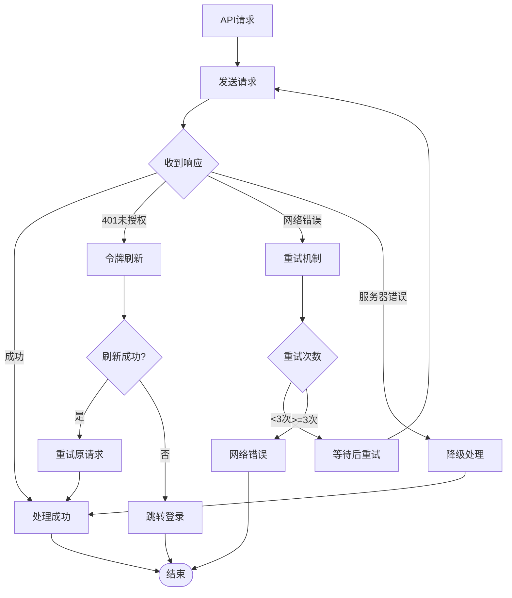

**图表来源**
- [api.ts:56-126](file://src/app/services/api.ts#L56-L126)

**章节来源**
- [api.ts:56-126](file://src/app/services/api.ts#L56-L126)
- [chatSessionsService.ts:15-25](file://src/app/services/chatSessionsService.ts#L15-L25)

## 性能考虑

### 缓存策略

系统采用了多层次的缓存策略来提升性能：

1. **本地缓存**：使用 localStorage 存储消息历史
2. **内存缓存**：React 组件状态缓存当前会话
3. **CDN 缓存**：静态资源通过 CDN 加速

### 优化建议

1. **虚拟滚动**：对于大量消息的会话，建议实现虚拟滚动
2. **消息分页**：实现消息分页加载，避免一次性加载过多数据
3. **图片懒加载**：对消息中的图片实现懒加载
4. **防抖处理**：对频繁的 API 调用添加防抖机制

## 故障排除指南

### 常见问题及解决方案

#### 1. 消息不同步问题

**症状**：消息在不同设备间不同步
**解决方案**：
- 检查网络连接状态
- 确认用户已登录且令牌有效
- 手动触发数据同步

#### 2. 会话加载失败

**症状**：会话列表无法加载
**解决方案**：
- 检查 API 服务可用性
- 验证用户认证状态
- 清除浏览器缓存后重试

#### 3. 消息发送失败

**症状**：消息发送后状态异常
**解决方案**：
- 检查网络连接
- 验证服务器状态
- 查看浏览器控制台错误信息

**章节来源**
- [api.ts:108-125](file://src/app/services/api.ts#L108-L125)
- [chatSessionsService.ts:15-25](file://src/app/services/chatSessionsService.ts#L15-L25)

## 结论

本聊天通信服务实现了完整的聊天功能，包括会话管理、消息存储、实时通信和富文本卡片等特性。系统采用模块化设计，具有良好的可扩展性和维护性。

### 主要优势

1. **模块化设计**：清晰的组件分离和职责划分
2. **混合存储**：本地缓存与云端同步相结合
3. **错误处理**：完善的错误处理和重试机制
4. **用户体验**：流畅的动画效果和响应式设计

### 改进建议

1. **WebSocket 支持**：考虑引入 WebSocket 实现实时双向通信
2. **消息加密**：实现端到端消息加密
3. **离线模式**：增强离线功能支持
4. **性能优化**：实现消息分页和虚拟滚动

该系统为笔记应用提供了强大的聊天功能基础，为未来的功能扩展和性能优化奠定了良好基础。