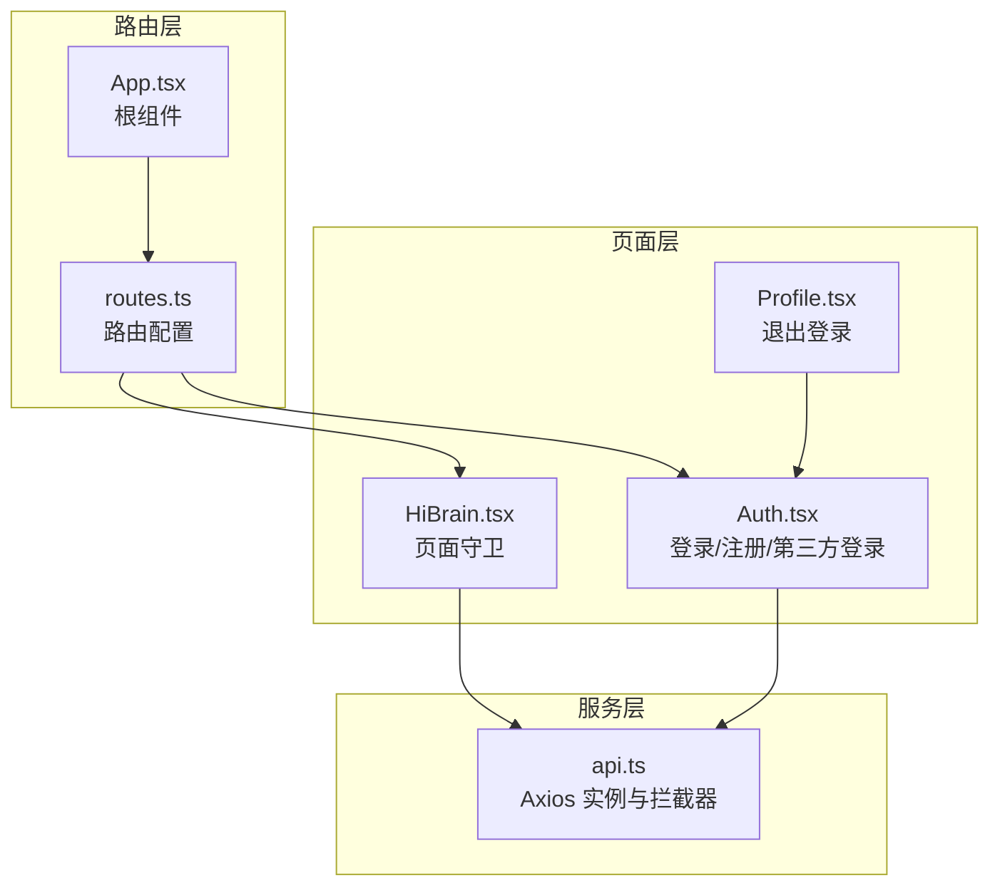
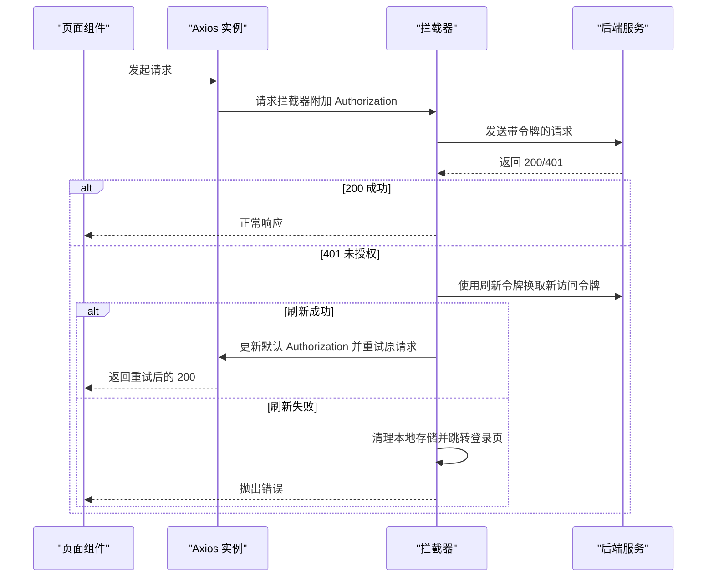
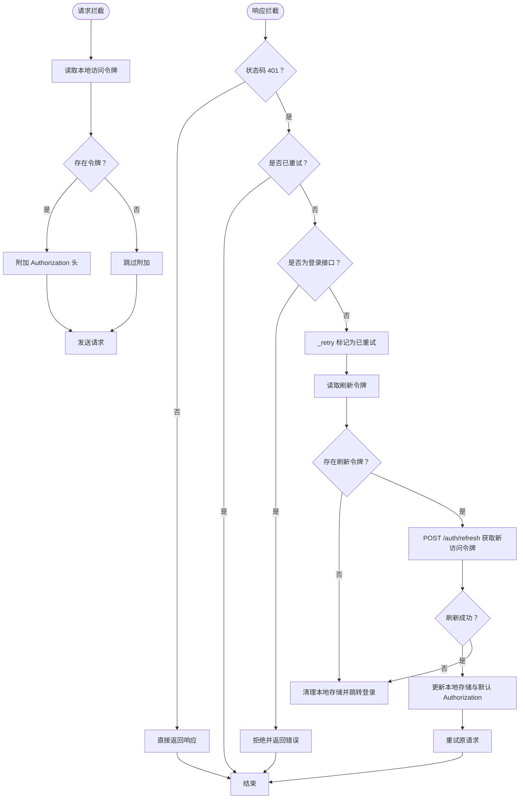
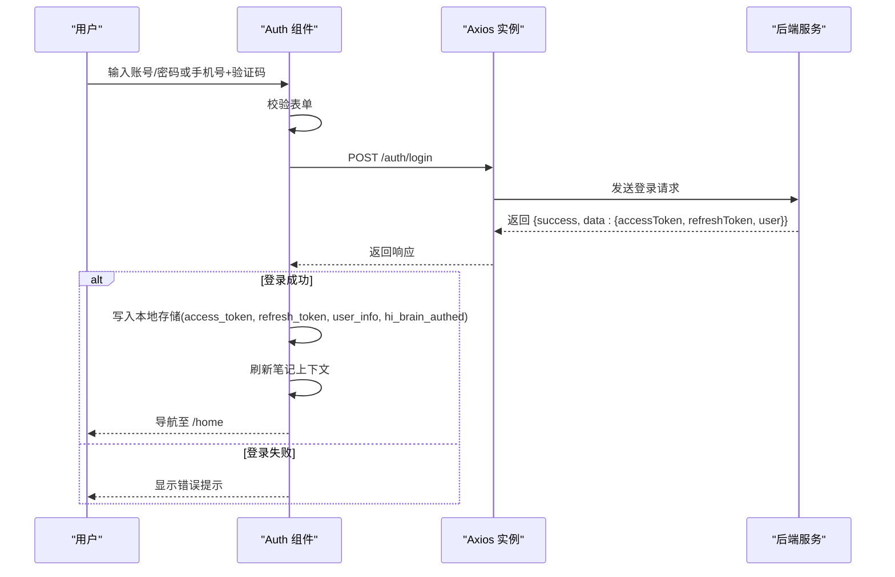
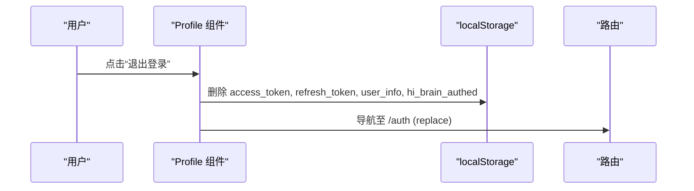
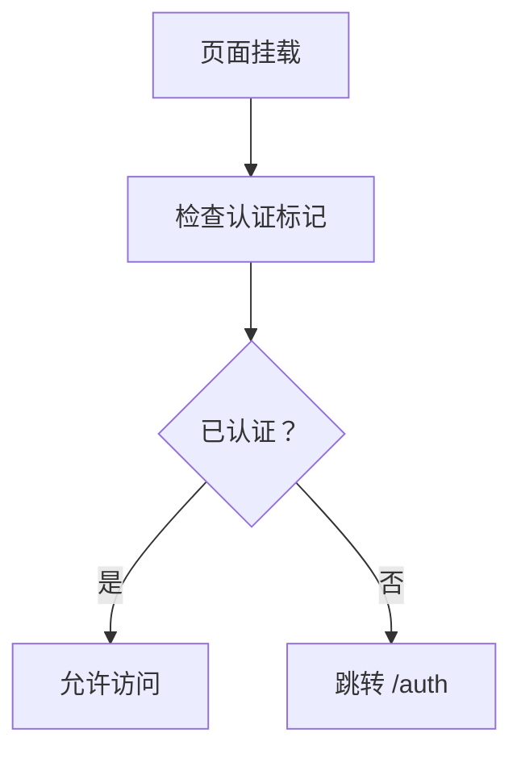
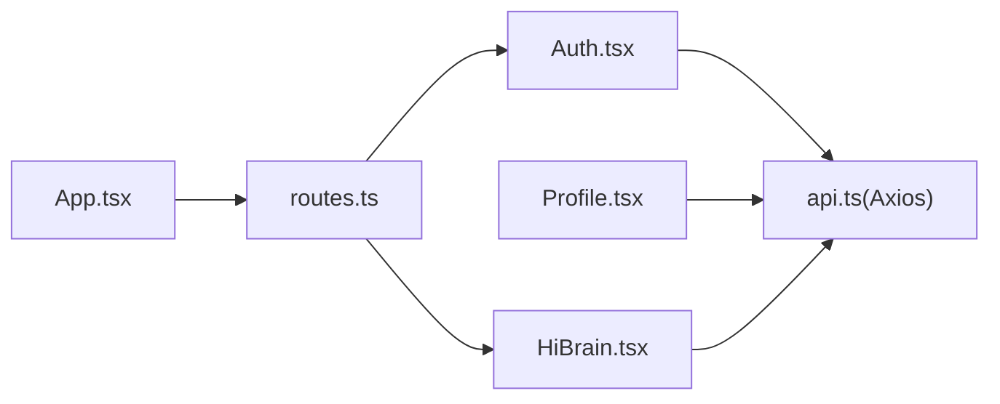

# 认证系统

<cite>
**本文档引用的文件**
- [src/app/services/api.ts](file://src/app/services/api.ts)
- [src/app/pages/Auth.tsx](file://src/app/pages/Auth.tsx)
- [src/app/pages/Profile.tsx](file://src/app/pages/Profile.tsx)
- [src/app/routes.ts](file://src/app/routes.ts)
- [src/app/App.tsx](file://src/app/App.tsx)
- [src/app/pages/HiBrain.tsx](file://src/app/pages/HiBrain.tsx)
</cite>

## 目录
1. [简介](#简介)
2. [项目结构](#项目结构)
3. [核心组件](#核心组件)
4. [架构总览](#架构总览)
5. [详细组件分析](#详细组件分析)
6. [依赖关系分析](#依赖关系分析)
7. [性能考虑](#性能考虑)
8. [故障排除指南](#故障排除指南)
9. [结论](#结论)

## 简介
本文件面向认证系统的使用者与维护者，系统性阐述前端侧基于 Axios 的认证与会话管理机制，包括：
- JWT 访问令牌与刷新令牌的存储、验证与轮换
- 请求拦截器中令牌的自动附加与响应拦截器中的刷新逻辑
- 登录失败处理、401 错误的重试机制与无限循环防护
- 用户登出流程（本地清理与页面跳转）
- 不同端点的认证例外处理（如登录请求不进行拦截）
- 安全最佳实践与常见问题排查

## 项目结构
认证相关代码主要分布在以下模块：
- 服务层：Axios 实例与拦截器定义
- 页面层：登录页、个人资料页等与认证状态交互
- 路由层：全局路由配置与页面守卫逻辑

**图表来源**
- [src/app/services/api.ts:36-127](file://src/app/services/api.ts#L36-L127)
- [src/app/pages/Auth.tsx:414-549](file://src/app/pages/Auth.tsx#L414-L549)
- [src/app/pages/Profile.tsx:411-427](file://src/app/pages/Profile.tsx#L411-L427)
- [src/app/pages/HiBrain.tsx:997-1000](file://src/app/pages/HiBrain.tsx#L997-L1000)
- [src/app/routes.ts:26-60](file://src/app/routes.ts#L26-L60)
- [src/app/App.tsx:7-17](file://src/app/App.tsx#L7-L17)

**章节来源**
- [src/app/services/api.ts:36-127](file://src/app/services/api.ts#L36-L127)
- [src/app/pages/Auth.tsx:414-549](file://src/app/pages/Auth.tsx#L414-L549)
- [src/app/pages/Profile.tsx:411-427](file://src/app/pages/Profile.tsx#L411-L427)
- [src/app/pages/HiBrain.tsx:997-1000](file://src/app/pages/HiBrain.tsx#L997-L1000)
- [src/app/routes.ts:26-60](file://src/app/routes.ts#L26-L60)
- [src/app/App.tsx:7-17](file://src/app/App.tsx#L7-L17)

## 核心组件
- Axios 实例与拦截器
  - 请求拦截器：从本地存储读取访问令牌并附加到 Authorization 头
  - 响应拦截器：处理 401 未授权，触发刷新流程；对登录接口进行例外放行；失败时清理本地状态并跳转登录页
- 登录页组件
  - 组织登录/注册表单提交，接收后端返回的访问与刷新令牌，写入本地存储，并导航至首页
- 个人资料页组件
  - 提供“退出登录”按钮，清理本地存储并跳转登录页
- 页面守卫
  - 部分受保护页面在挂载时检查认证状态，未认证则跳转登录页

**章节来源**
- [src/app/services/api.ts:44-54](file://src/app/services/api.ts#L44-L54)
- [src/app/services/api.ts:56-127](file://src/app/services/api.ts#L56-L127)
- [src/app/pages/Auth.tsx:516-549](file://src/app/pages/Auth.tsx#L516-L549)
- [src/app/pages/Profile.tsx:411-427](file://src/app/pages/Profile.tsx#L411-L427)
- [src/app/pages/HiBrain.tsx:997-1000](file://src/app/pages/HiBrain.tsx#L997-L1000)

## 架构总览
认证系统采用“集中式 Axios 拦截器 + 页面级状态”的组合：
- 所有业务请求统一经由 Axios 实例发出，拦截器自动附加访问令牌
- 当收到 401 时，拦截器尝试使用刷新令牌换取新的访问令牌，并重试原请求
- 登录页负责首次获取令牌并写入本地存储；个人资料页负责清理并跳转
- 页面守卫在关键页面加载时检查认证状态

**图表来源**
- [src/app/services/api.ts:44-54](file://src/app/services/api.ts#L44-L54)
- [src/app/services/api.ts:56-127](file://src/app/services/api.ts#L56-L127)

**章节来源**
- [src/app/services/api.ts:44-54](file://src/app/services/api.ts#L44-L54)
- [src/app/services/api.ts:56-127](file://src/app/services/api.ts#L56-L127)

## 详细组件分析

### 认证与令牌管理（服务层）
- 访问令牌与刷新令牌的存储
  - 登录成功后将访问令牌、刷新令牌、用户信息与认证标记写入本地存储
  - 退出登录时清理上述键值
- 请求拦截器
  - 自动从本地存储读取访问令牌并附加到 Authorization 头
- 响应拦截器
  - 401 且非重试请求时，对登录接口放行（避免拦截器自身处理登录失败）
  - 其他 401：尝试使用刷新令牌刷新访问令牌
  - 刷新成功：更新本地存储与默认 Authorization，重试原请求
  - 刷新失败或无刷新令牌：清理本地存储并跳转登录页
  - 全局错误文案翻译：网络异常、服务器错误、后端错误字符串友好化

**图表来源**
- [src/app/services/api.ts:44-54](file://src/app/services/api.ts#L44-L54)
- [src/app/services/api.ts:56-127](file://src/app/services/api.ts#L56-L127)

**章节来源**
- [src/app/services/api.ts:44-54](file://src/app/services/api.ts#L44-L54)
- [src/app/services/api.ts:56-127](file://src/app/services/api.ts#L56-L127)

### 登录流程（页面层）
- 表单校验与提交
  - 支持手机号+验证码与邮箱/用户名+密码两种登录方式
  - 校验通过后调用登录接口，接收返回的访问令牌、刷新令牌与用户信息
- 本地存储与导航
  - 写入访问令牌、刷新令牌、用户信息与认证标记
  - 触发笔记上下文刷新，随后导航至首页
- 登录失败处理
  - 组件层面根据后端消息设置错误提示，支持动画抖动反馈

**图表来源**
- [src/app/pages/Auth.tsx:516-549](file://src/app/pages/Auth.tsx#L516-L549)
- [src/app/services/api.ts:36-42](file://src/app/services/api.ts#L36-L42)

**章节来源**
- [src/app/pages/Auth.tsx:516-549](file://src/app/pages/Auth.tsx#L516-L549)
- [src/app/pages/Auth.tsx:477-481](file://src/app/pages/Auth.tsx#L477-L481)

### 登出流程（页面层）
- 本地清理
  - 删除访问令牌、刷新令牌、用户信息与认证标记
- 页面跳转
  - 导航至登录页并替换当前历史记录，避免返回到受保护页面

**图表来源**
- [src/app/pages/Profile.tsx:411-427](file://src/app/pages/Profile.tsx#L411-L427)

**章节来源**
- [src/app/pages/Profile.tsx:411-427](file://src/app/pages/Profile.tsx#L411-L427)

### 页面守卫与认证例外
- 页面守卫
  - 部分受保护页面在挂载时检查认证标记，未认证则跳转登录页
- 认证例外
  - 登录接口在响应拦截器中被明确放行，避免拦截器自身处理登录失败导致的死循环

**图表来源**
- [src/app/pages/HiBrain.tsx:997-1000](file://src/app/pages/HiBrain.tsx#L997-L1000)
- [src/app/services/api.ts:64-67](file://src/app/services/api.ts#L64-L67)

**章节来源**
- [src/app/pages/HiBrain.tsx:997-1000](file://src/app/pages/HiBrain.tsx#L997-L1000)
- [src/app/services/api.ts:64-67](file://src/app/services/api.ts#L64-L67)

## 依赖关系分析
- 组件耦合
  - 页面组件依赖 Axios 实例与拦截器进行网络请求
  - 登录页与个人资料页分别承担“获取令牌”和“清理令牌”的职责
  - 路由层控制页面可见性与守卫行为
- 外部依赖
  - Axios 作为 HTTP 客户端
  - 浏览器本地存储用于持久化令牌与用户状态

**图表来源**
- [src/app/pages/Auth.tsx:414-549](file://src/app/pages/Auth.tsx#L414-L549)
- [src/app/pages/Profile.tsx:411-427](file://src/app/pages/Profile.tsx#L411-L427)
- [src/app/pages/HiBrain.tsx:997-1000](file://src/app/pages/HiBrain.tsx#L997-L1000)
- [src/app/routes.ts:26-60](file://src/app/routes.ts#L26-L60)
- [src/app/App.tsx:7-17](file://src/app/App.tsx#L7-L17)

**章节来源**
- [src/app/pages/Auth.tsx:414-549](file://src/app/pages/Auth.tsx#L414-L549)
- [src/app/pages/Profile.tsx:411-427](file://src/app/pages/Profile.tsx#L411-L427)
- [src/app/pages/HiBrain.tsx:997-1000](file://src/app/pages/HiBrain.tsx#L997-L1000)
- [src/app/routes.ts:26-60](file://src/app/routes.ts#L26-L60)
- [src/app/App.tsx:7-17](file://src/app/App.tsx#L7-L17)

## 性能考虑
- 请求头附加成本极低，仅涉及一次本地存储读取与字符串拼接
- 刷新令牌仅在 401 时触发，正常请求不会产生额外网络往返
- 错误文案翻译与日志输出在拦截器内完成，避免重复计算
- 建议
  - 控制刷新频率：合理设置令牌有效期与刷新策略，减少频繁刷新
  - 缓存用户信息：在内存中缓存必要字段以降低渲染压力
  - 优化导航：使用 replace 导航减少历史栈冗余

## 故障排除指南
- 登录后仍提示未认证
  - 检查登录成功分支是否写入认证标记与用户信息
  - 确认页面守卫逻辑是否正确读取本地存储
- 401 后无限刷新
  - 确认拦截器已设置重试标记并在登录接口路径放行
  - 检查刷新令牌是否有效且后端 /auth/refresh 接口可用
- 刷新失败后无法回到登录页
  - 确认拦截器在刷新失败时清理本地存储并跳转登录
- 退出登录后仍可访问受保护页面
  - 检查退出登录流程是否删除了所有认证相关键值
  - 确认页面守卫在挂载时执行了认证检查

**章节来源**
- [src/app/services/api.ts:62-106](file://src/app/services/api.ts#L62-L106)
- [src/app/pages/Auth.tsx:528-534](file://src/app/pages/Auth.tsx#L528-L534)
- [src/app/pages/Profile.tsx:416-422](file://src/app/pages/Profile.tsx#L416-L422)
- [src/app/pages/HiBrain.tsx:997-1000](file://src/app/pages/HiBrain.tsx#L997-L1000)

## 结论
该认证系统通过集中式的 Axios 拦截器实现了访问令牌的自动附加与刷新，结合页面级的状态管理与守卫逻辑，提供了简洁可靠的前端认证能力。遵循本文的安全最佳实践与排障建议，可在保证用户体验的同时提升系统的健壮性与安全性。