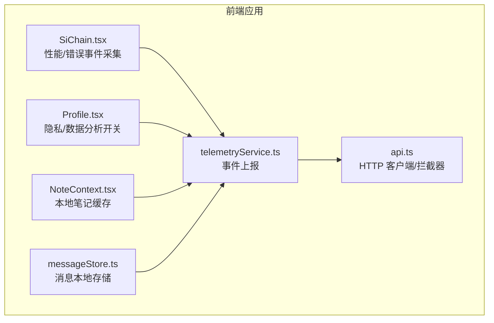
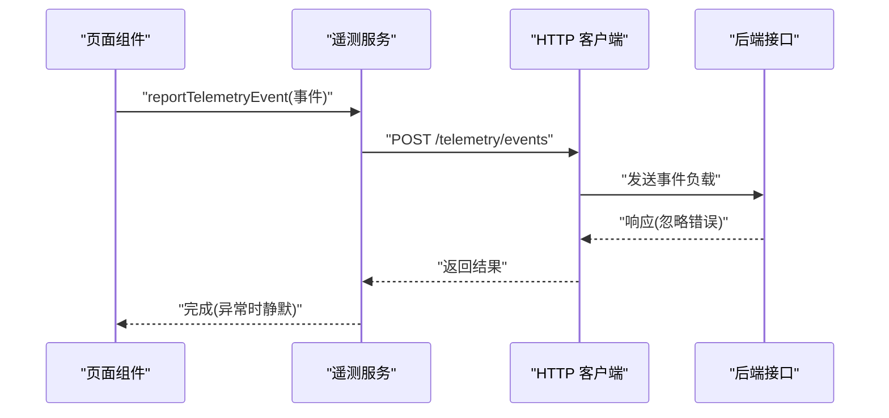
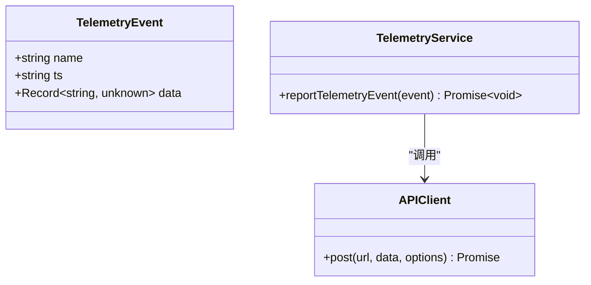
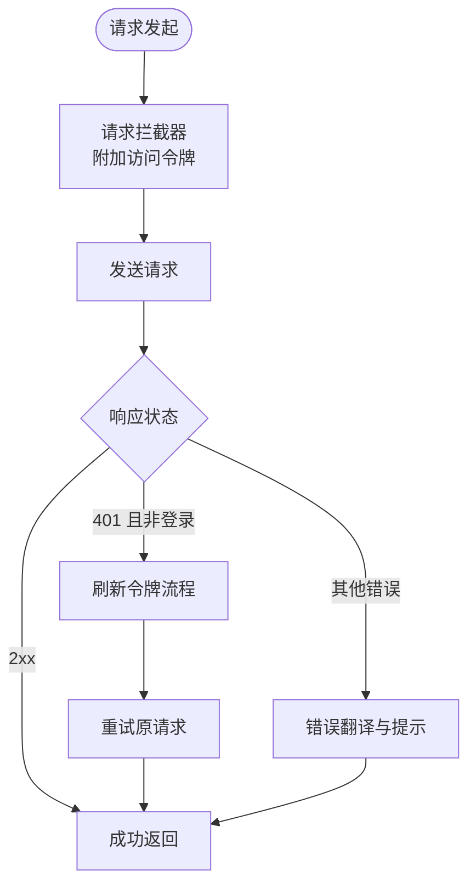
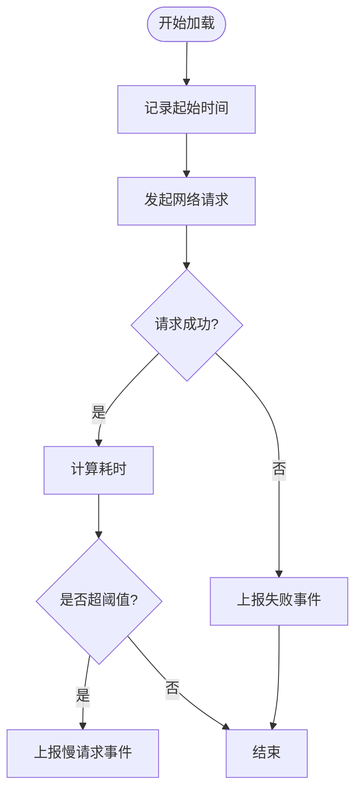
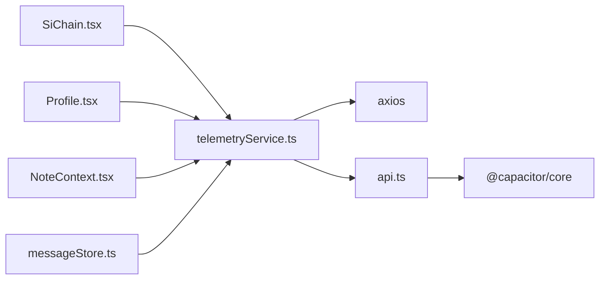

# 遥测监控服务

<cite>
**本文引用的文件**
- [telemetryService.ts](file://src/app/services/telemetryService.ts)
- [api.ts](file://src/app/services/api.ts)
- [SiChain.tsx](file://src/app/pages/SiChain.tsx)
- [Profile.tsx](file://src/app/pages/Profile.tsx)
- [NoteContext.tsx](file://src/app/components/context/NoteContext.tsx)
- [messageStore.ts](file://src/app/services/messageStore.ts)
- [README.md](file://README.md)
- [package.json](file://package.json)
</cite>

## 目录
1. [简介](#简介)
2. [项目结构](#项目结构)
3. [核心组件](#核心组件)
4. [架构总览](#架构总览)
5. [详细组件分析](#详细组件分析)
6. [依赖关系分析](#依赖关系分析)
7. [性能考量](#性能考量)
8. [故障排查指南](#故障排查指南)
9. [结论](#结论)
10. [附录](#附录)

## 简介
本文件面向“遥测监控服务”的技术文档，聚焦于前端应用中的用户行为追踪、性能指标采集与上报、本地存储与离线缓存策略、匿名化与隐私保护、数据分析与可视化建议，以及扩展与自定义指标的接入方式。当前仓库中遥测能力主要通过轻量级事件上报接口实现，并在部分页面中结合性能计时进行慢请求与错误事件的记录。

## 项目结构
遥测相关的核心代码集中在以下位置：
- 遥测事件上报：src/app/services/telemetryService.ts
- HTTP 客户端与拦截器：src/app/services/api.ts
- 性能与错误事件采集示例：src/app/pages/SiChain.tsx
- 用户隐私与数据分析开关：src/app/pages/Profile.tsx
- 本地持久化与缓存清理：src/app/components/context/NoteContext.tsx、src/app/services/messageStore.ts
- 项目依赖与运行说明：README.md、package.json

**图表来源**
- [telemetryService.ts:1-22](file://src/app/services/telemetryService.ts#L1-L22)
- [api.ts:1-127](file://src/app/services/api.ts#L1-L127)
- [SiChain.tsx:3064-3200](file://src/app/pages/SiChain.tsx#L3064-L3200)
- [Profile.tsx:1580-1595](file://src/app/pages/Profile.tsx#L1580-L1595)
- [NoteContext.tsx:95-160](file://src/app/components/context/NoteContext.tsx#L95-L160)
- [messageStore.ts:1-32](file://src/app/services/messageStore.ts#L1-L32)

**章节来源**
- [telemetryService.ts:1-22](file://src/app/services/telemetryService.ts#L1-L22)
- [api.ts:1-127](file://src/app/services/api.ts#L1-L127)
- [SiChain.tsx:3064-3200](file://src/app/pages/SiChain.tsx#L3064-L3200)
- [Profile.tsx:1580-1595](file://src/app/pages/Profile.tsx#L1580-L1595)
- [NoteContext.tsx:95-160](file://src/app/components/context/NoteContext.tsx#L95-L160)
- [messageStore.ts:1-32](file://src/app/services/messageStore.ts#L1-L32)
- [README.md:1-41](file://README.md#L1-L41)
- [package.json:1-113](file://package.json#L1-L113)

## 核心组件
- 遥测事件模型与上报函数
  - 事件类型包含名称、可选时间戳、可选数据载荷。
  - 上报函数负责向后端发送事件，带超时控制；异常时静默处理，避免阻塞业务。
- HTTP 客户端与拦截器
  - 统一基地址、超时、请求头配置。
  - 请求拦截器自动附加访问令牌；响应拦截器统一处理 401 并触发刷新流程。
- 页面级采集示例
  - 在关键网络请求前后记录耗时与错误事件，用于慢请求与失败率统计。
- 隐私与数据分析开关
  - 提供“数据使用优化”开关，体现用户对数据分析的同意状态。
- 本地存储与缓存清理
  - 本地笔记与消息采用 localStorage 存储，提供清理入口，释放缓存空间。

**章节来源**
- [telemetryService.ts:3-21](file://src/app/services/telemetryService.ts#L3-L21)
- [api.ts:36-126](file://src/app/services/api.ts#L36-L126)
- [SiChain.tsx:3064-3200](file://src/app/pages/SiChain.tsx#L3064-L3200)
- [Profile.tsx:1580-1595](file://src/app/pages/Profile.tsx#L1580-L1595)
- [NoteContext.tsx:95-160](file://src/app/components/context/NoteContext.tsx#L95-L160)
- [messageStore.ts:1-32](file://src/app/services/messageStore.ts#L1-L32)

## 架构总览
遥测上报的整体流程如下：
- 业务页面在关键事件点构造遥测事件对象。
- 调用遥测服务的上报函数，内部通过 HTTP 客户端发送 POST 请求到后端接口。
- 若网络异常或超时，上报函数捕获异常并忽略，保证业务不中断。
- 后端接口由客户端统一基地址拼接，支持开发与生产环境切换。

**图表来源**
- [telemetryService.ts:9-21](file://src/app/services/telemetryService.ts#L9-L21)
- [api.ts:36-42](file://src/app/services/api.ts#L36-L42)
- [SiChain.tsx:3072-3075](file://src/app/pages/SiChain.tsx#L3072-L3075)

## 详细组件分析

### 遥测事件模型与上报
- 事件模型
  - 字段：名称、时间戳、数据载荷。
  - 时间戳默认使用当前时间，载荷为空时填充空对象。
- 上报流程
  - 使用 HTTP 客户端发起 POST 请求至统一路径。
  - 设置较短超时，降低对用户体验的影响。
  - 异常捕获并忽略，确保业务连续性。
- 扩展建议
  - 可增加事件队列与批量上报策略，减少请求次数。
  - 可引入本地持久化队列，在网络恢复时补报。

**图表来源**
- [telemetryService.ts:3-21](file://src/app/services/telemetryService.ts#L3-L21)
- [api.ts:36-42](file://src/app/services/api.ts#L36-L42)

**章节来源**
- [telemetryService.ts:3-21](file://src/app/services/telemetryService.ts#L3-L21)

### HTTP 客户端与拦截器
- 基础配置
  - 统一基地址、超时、内容类型。
  - 支持原生平台与浏览器平台的基地址推导逻辑。
- 请求拦截器
  - 自动从本地存储读取访问令牌并附加到请求头。
- 响应拦截器
  - 处理 401 未授权：尝试刷新令牌；若失败则清空本地认证信息并跳转登录页。
  - 全局错误提示：根据状态码与后端错误信息进行友好提示。
- 与遥测的关系
  - 遥测上报同样复用该客户端，共享认证与错误处理策略。

**图表来源**
- [api.ts:44-126](file://src/app/services/api.ts#L44-L126)

**章节来源**
- [api.ts:1-127](file://src/app/services/api.ts#L1-L127)

### 页面级性能与错误事件采集（以 SiChain 为例）
- 性能采集
  - 在关键网络请求前后记录起始时间，计算耗时。
  - 当耗时超过阈值时，上报“慢请求”事件，包含端点与耗时。
- 错误采集
  - 捕获异常并上报“请求失败”事件，包含端点与错误信息。
- 适用场景
  - 图谱加载、文档/笔记图谱获取等长耗时请求。

**图表来源**
- [SiChain.tsx:3064-3085](file://src/app/pages/SiChain.tsx#L3064-L3085)
- [SiChain.tsx:3167-3199](file://src/app/pages/SiChain.tsx#L3167-L3199)

**章节来源**
- [SiChain.tsx:3064-3200](file://src/app/pages/SiChain.tsx#L3064-L3200)

### 隐私与数据分析开关
- 用户界面提供“数据使用优化”开关，体现对数据分析的同意状态。
- 该开关可作为遥测事件采集的前置条件，仅在开启时上报。

**章节来源**
- [Profile.tsx:1580-1595](file://src/app/pages/Profile.tsx#L1580-L1595)

### 本地存储与缓存清理
- 本地笔记与消息采用 localStorage 进行持久化。
- 提供“清除本地缓存”入口，释放缓存空间，改善性能。
- 与遥测的关系
  - 缓存清理可视为一种健康度事件，可在清理完成后上报一次事件，便于统计用户主动维护行为。

**章节来源**
- [NoteContext.tsx:95-160](file://src/app/components/context/NoteContext.tsx#L95-L160)
- [messageStore.ts:1-32](file://src/app/services/messageStore.ts#L1-L32)
- [Profile.tsx:1597-1636](file://src/app/pages/Profile.tsx#L1597-L1636)

## 依赖关系分析
- 遥测服务依赖 HTTP 客户端，后者提供统一的基地址、认证与错误处理。
- 页面组件通过遥测服务上报事件，形成“页面 → 遥测 → HTTP → 后端”的链路。
- 依赖库
  - axios：HTTP 客户端。
  - @capacitor/core：平台判断与基地址推导。
  - recharts：页面内可视化组件（与遥测数据展示相关）。

**图表来源**
- [telemetryService.ts:1-2](file://src/app/services/telemetryService.ts#L1-L2)
- [api.ts:1-6](file://src/app/services/api.ts#L1-L6)
- [package.json:57-83](file://package.json#L57-L83)

**章节来源**
- [package.json:1-113](file://package.json#L1-L113)

## 性能考量
- 上报超时
  - 遥测上报设置较短超时，避免拖慢关键路径。
- 错误处理
  - 上报异常静默处理，防止影响主流程。
- 批量与节流
  - 当前实现逐条上报；建议引入事件队列与批量上报策略，降低请求频率。
- 网络恢复
  - 可考虑在网络恢复时补报本地队列中的事件，提升数据完整性。

[本节为通用性能讨论，无需特定文件来源]

## 故障排查指南
- 现象：遥测事件未上报
  - 检查网络状态与后端接口可达性。
  - 查看请求拦截器是否正确附加访问令牌。
  - 确认页面是否在隐私开关关闭状态下仍尝试上报。
- 现象：401 未授权导致页面跳转
  - 检查刷新令牌流程是否成功；若失败，需重新登录。
- 现象：本地缓存占用过高
  - 使用“清除本地缓存”功能释放空间；观察后续性能变化。

**章节来源**
- [api.ts:56-126](file://src/app/services/api.ts#L56-L126)
- [Profile.tsx:1597-1636](file://src/app/pages/Profile.tsx#L1597-L1636)

## 结论
当前遥测监控服务以轻量事件上报为核心，结合页面级性能与错误采集，形成基础的可观测性能力。建议后续引入事件队列、批量上报与网络恢复补报机制，完善离线与高并发场景下的可靠性；同时在隐私与合规层面明确匿名化策略与用户同意流程，保障数据安全与透明。

[本节为总结性内容，无需特定文件来源]

## 附录

### 关键指标定义与采集建议
- 加载时间
  - 指标：端点平均耗时、P95/P99 耗时。
  - 采集：在请求前后记录时间，上报“慢请求”事件。
- 交互延迟
  - 指标：点击到渲染完成的时间。
  - 采集：在用户交互后记录时间，上报“交互延迟”事件。
- 资源使用情况
  - 指标：内存占用、CPU 使用率（如可用）。
  - 采集：结合浏览器性能 API 或第三方 SDK 上报。
- 错误率
  - 指标：请求失败次数/总请求数。
  - 采集：捕获异常并上报“请求失败”事件。

[本节为概念性内容，无需特定文件来源]

### 遥测数据的分析与可视化
- 可视化工具
  - 使用图表库（如仓库中使用的图表组件）展示趋势与分布。
- 建议图表
  - 慢请求趋势、失败率折线图、端点耗时箱线图。
- 告警设置
  - 对慢请求比例、失败率设置阈值告警，结合日志与仪表盘联动。

[本节为概念性内容，无需特定文件来源]

### 扩展与自定义指标
- 新增事件
  - 在页面合适位置构造事件对象并调用上报函数。
  - 事件命名遵循统一规范，载荷字段保持简洁与一致。
- 批量上报
  - 引入本地队列与定时器，合并多条事件后一次性上报。
- 匿名化与隐私
  - 不在事件载荷中包含个人身份信息；尊重用户隐私开关。

[本节为概念性内容，无需特定文件来源]