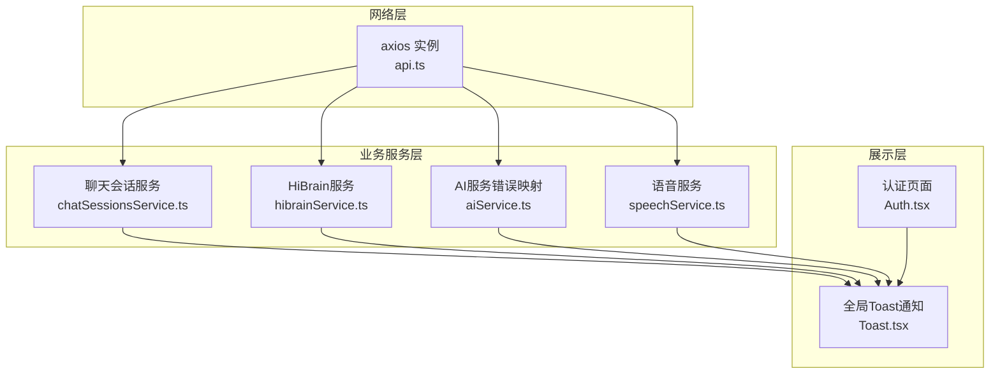
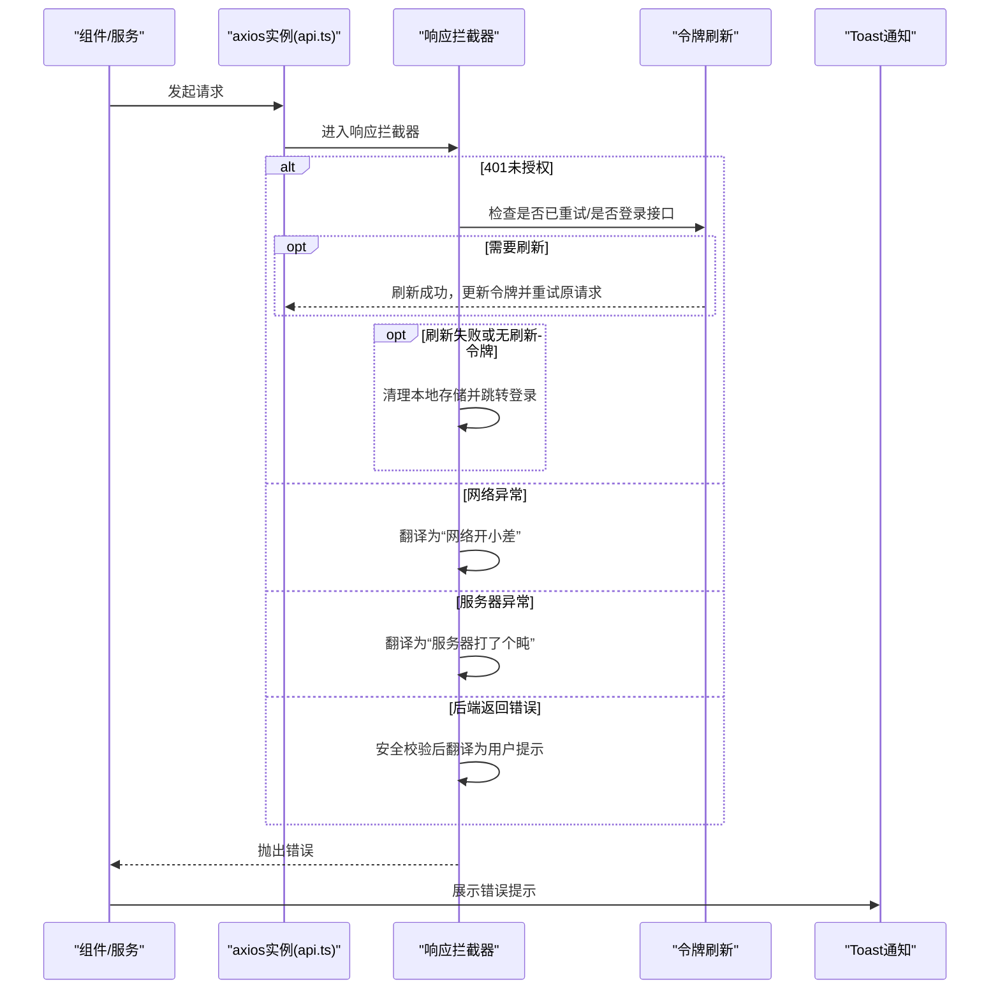
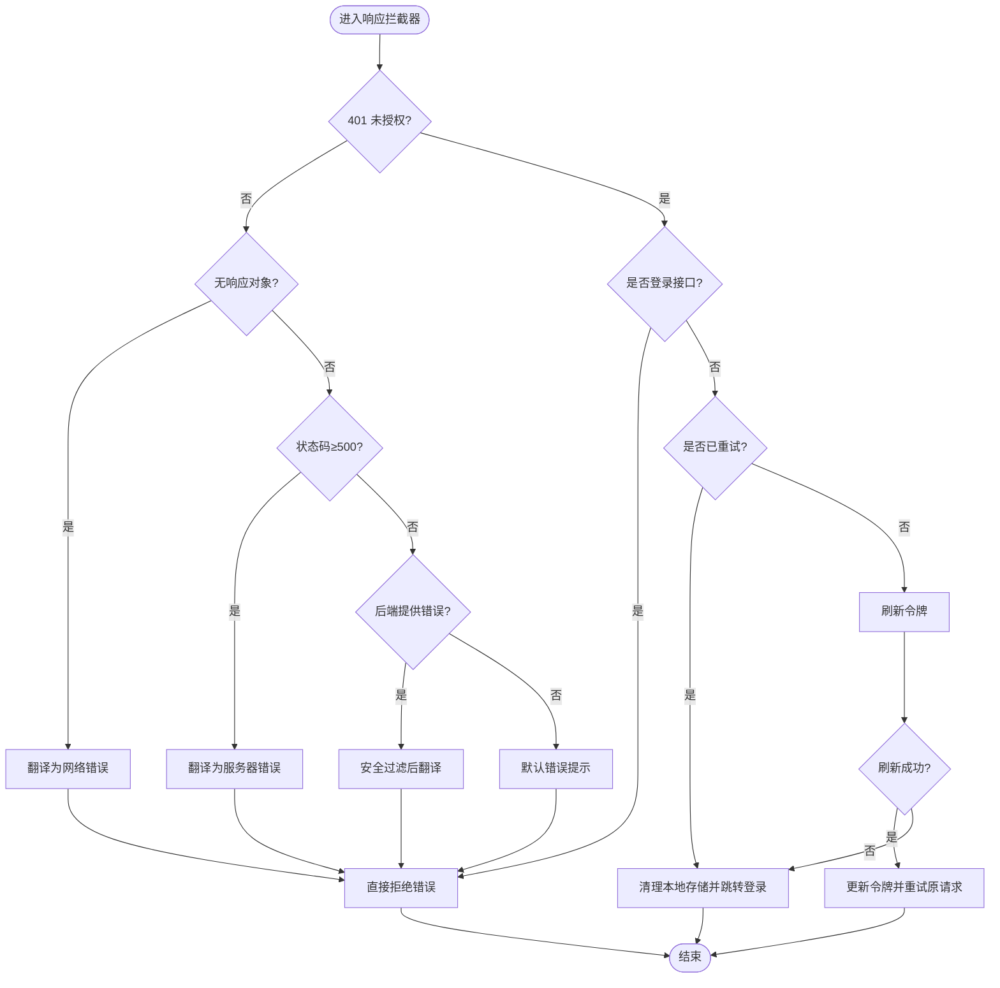
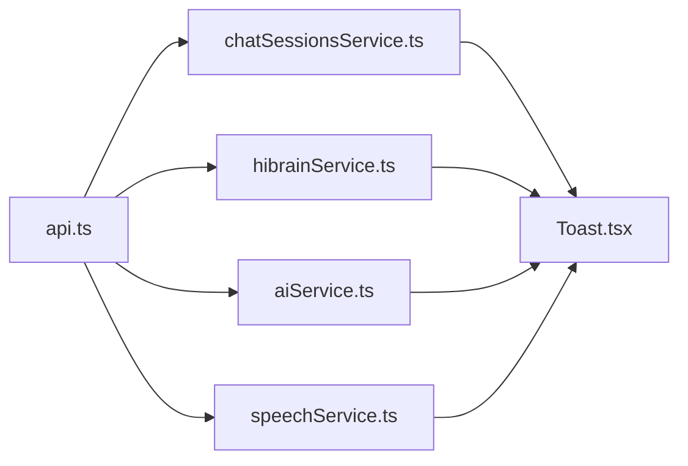

# 错误处理机制

<cite>
**本文引用的文件**
- [api.ts](file://src/app/services/api.ts)
- [chatSessionsService.ts](file://src/app/services/chatSessionsService.ts)
- [hibrainService.ts](file://src/app/services/hibrainService.ts)
- [speechService.ts](file://src/app/services/speechService.ts)
- [Toast.tsx](file://src/app/components/ui/Toast.tsx)
- [Auth.tsx](file://src/app/pages/Auth.tsx)
- [aiService.ts](file://src/app/services/aiService.ts)
</cite>

## 目录
1. [简介](#简介)
2. [项目结构](#项目结构)
3. [核心组件](#核心组件)
4. [架构总览](#架构总览)
5. [详细组件分析](#详细组件分析)
6. [依赖关系分析](#依赖关系分析)
7. [性能考量](#性能考量)
8. [故障排查指南](#故障排查指南)
9. [结论](#结论)
10. [附录](#附录)

## 简介
本文件系统性梳理前端错误处理机制，重点覆盖：
- 响应拦截器中的错误分类与处理：网络错误、服务器错误、API错误
- 全局错误翻译：将技术错误转化为用户可理解的提示
- 401未授权的特殊流程：令牌刷新与用户登出
- 错误重试机制、无限循环防护与错误传播策略
- 错误日志记录、监控与调试最佳实践
- 自定义与扩展错误处理的能力指引

## 项目结构
围绕错误处理的关键代码主要分布在以下位置：
- 通用HTTP客户端与拦截器：src/app/services/api.ts
- 业务服务封装与错误映射：src/app/services/chatSessionsService.ts、src/app/services/hibrainService.ts、src/app/services/aiService.ts
- 独立流式语音服务的错误处理：src/app/services/speechService.ts
- 用户可见的错误提示系统：src/app/components/ui/Toast.tsx
- 认证页面对401的特殊处理：src/app/pages/Auth.tsx

图表来源
- [api.ts:36-126](file://src/app/services/api.ts#L36-L126)
- [chatSessionsService.ts:66-125](file://src/app/services/chatSessionsService.ts#L66-L125)
- [hibrainService.ts:89-117](file://src/app/services/hibrainService.ts#L89-L117)
- [aiService.ts:12-50](file://src/app/services/aiService.ts#L12-L50)
- [speechService.ts:293-327](file://src/app/services/speechService.ts#L293-L327)
- [Toast.tsx:107-126](file://src/app/components/ui/Toast.tsx#L107-L126)
- [Auth.tsx:1-200](file://src/app/pages/Auth.tsx#L1-L200)

章节来源
- [api.ts:36-126](file://src/app/services/api.ts#L36-L126)
- [chatSessionsService.ts:66-125](file://src/app/services/chatSessionsService.ts#L66-L125)
- [hibrainService.ts:89-117](file://src/app/services/hibrainService.ts#L89-L117)
- [aiService.ts:12-50](file://src/app/services/aiService.ts#L12-L50)
- [speechService.ts:293-327](file://src/app/services/speechService.ts#L293-L327)
- [Toast.tsx:107-126](file://src/app/components/ui/Toast.tsx#L107-L126)
- [Auth.tsx:1-200](file://src/app/pages/Auth.tsx#L1-L200)

## 核心组件
- 通用HTTP客户端与拦截器
  - 请求头注入：自动附加访问令牌
  - 响应拦截：统一处理401、网络异常、服务器异常与后端错误消息
  - 令牌刷新：在401且非登录接口时尝试刷新令牌并重试原请求
  - 无限循环防护：通过重试标记避免重复刷新
  - 登出与跳转：刷新失败或无刷新令牌时清理本地存储并跳转至认证页
  - 全局错误翻译：将技术错误映射为用户友好提示
- 业务服务封装
  - 聊天会话服务：对Axios错误进行格式化，便于上层展示
  - HiBrain服务：通过api封装RAG查询、记忆增删等
  - AI服务：针对特定状态码与后端错误字段进行摘要化错误映射
  - 语音服务：对流式响应进行解析与错误抛出
- 通知系统
  - 提供多种Toast类型，包含网络、超时、权限等场景
  - 统一的全局分发与容器渲染，便于在错误发生时快速反馈

章节来源
- [api.ts:44-126](file://src/app/services/api.ts#L44-L126)
- [chatSessionsService.ts:15-25](file://src/app/services/chatSessionsService.ts#L15-L25)
- [hibrainService.ts:89-117](file://src/app/services/hibrainService.ts#L89-L117)
- [aiService.ts:12-50](file://src/app/services/aiService.ts#L12-L50)
- [speechService.ts:293-327](file://src/app/services/speechService.ts#L293-L327)
- [Toast.tsx:107-126](file://src/app/components/ui/Toast.tsx#L107-L126)

## 架构总览
下图展示了从发起请求到错误拦截、翻译与反馈的整体流程。

图表来源
- [api.ts:56-126](file://src/app/services/api.ts#L56-L126)
- [Toast.tsx:107-126](file://src/app/components/ui/Toast.tsx#L107-L126)

## 详细组件分析

### 响应拦截器与错误分类处理
- 分类策略
  - 网络错误：无响应对象时统一提示“网络开小差”
  - 服务器错误：状态码≥500时提示“服务器打了个盹”
  - API错误：优先使用后端提供的错误字符串，但过滤掉SQL/JSON/raw等不友好内容
- 401未授权特殊流程
  - 防止无限循环：通过重试标记判断是否已尝试刷新
  - 登录接口放行：避免对登录页的401进行拦截，让组件自行处理“密码错误”等
  - 刷新令牌：携带刷新令牌向后端请求新令牌
  - 成功重试：更新默认与请求头Authorization，重试原请求
  - 失败登出：清理本地存储并跳转登录页
- 错误传播
  - 统一设置message并reject，确保上层捕获

图表来源
- [api.ts:56-126](file://src/app/services/api.ts#L56-L126)

章节来源
- [api.ts:56-126](file://src/app/services/api.ts#L56-L126)

### 全局错误翻译机制
- 网络错误：统一提示“网络开小差了，请检查网络连接或稍后再试”
- 服务器错误：统一提示“服务器打了个盹，请稍后再试”
- 后端错误：若包含SQL/JSON/raw等敏感词则降级为“系统遇到一点小问题，请稍后重试”，否则使用后端原始错误文本

章节来源
- [api.ts:108-122](file://src/app/services/api.ts#L108-L122)

### 401未授权的特殊处理流程
- 防环保护：originalRequest._retry防止重复刷新
- 登录接口豁免：避免对登录页401进行拦截
- 刷新与重试：成功后更新Authorization并重试
- 登出与跳转：失败或无刷新令牌时清理本地存储并跳转登录页

章节来源
- [api.ts:62-106](file://src/app/services/api.ts#L62-L106)

### 错误重试机制与无限循环防护
- 重试标记：originalRequest._retry仅允许一次刷新重试
- 登录接口放行：避免登录页因401被拦截导致无法提示“密码错误”

章节来源
- [api.ts:63-67](file://src/app/services/api.ts#L63-L67)
- [api.ts:69](file://src/app/services/api.ts#L69)

### 错误传播策略
- 统一设置error.message并Promise.reject(error)，保证上层能稳定捕获
- 业务服务层可进一步格式化错误，如聊天会话服务将Axios错误映射为“HTTP状态+后端消息”的组合

章节来源
- [api.ts:124](file://src/app/services/api.ts#L124)
- [chatSessionsService.ts:15-25](file://src/app/services/chatSessionsService.ts#L15-L25)

### 业务服务中的错误处理
- 聊天会话服务
  - 对Axios错误进行格式化，包含HTTP状态与后端消息
- HiBrain服务
  - 通过api封装查询、记忆增删等，错误由全局拦截器统一处理
- AI服务
  - 针对404/501等状态进行摘要化错误映射，增强可读性
- 语音服务
  - 流式响应解析失败或后端返回失败时抛出错误，便于上层统一处理

章节来源
- [chatSessionsService.ts:66-125](file://src/app/services/chatSessionsService.ts#L66-L125)
- [hibrainService.ts:89-117](file://src/app/services/hibrainService.ts#L89-L117)
- [aiService.ts:12-50](file://src/app/services/aiService.ts#L12-L50)
- [speechService.ts:293-327](file://src/app/services/speechService.ts#L293-L327)

### 用户可见的错误提示系统
- Toast类型覆盖：成功、失败、警告、信息、加载、网络、复制、保存、删除、上传、下载、成就、无权限、超时、点赞、通知等
- 统一分发与容器：通过上下文与单例分发，集中管理Toast队列与自动关闭
- 在错误发生时快速反馈，提升用户体验

章节来源
- [Toast.tsx:107-126](file://src/app/components/ui/Toast.tsx#L107-L126)
- [Toast.tsx:458-478](file://src/app/components/ui/Toast.tsx#L458-L478)

### 认证页面的401处理
- 登录页对401不进行拦截，以便组件自行处理“密码错误”等场景
- 其他页面在401时触发全局刷新与登出流程

章节来源
- [api.ts:65-67](file://src/app/services/api.ts#L65-L67)
- [Auth.tsx:1-200](file://src/app/pages/Auth.tsx#L1-L200)

## 依赖关系分析
- api.ts作为唯一axios实例，被所有业务服务依赖
- 业务服务通过api封装具体接口，错误在api拦截器统一处理
- Toast.tsx作为统一展示层，被各业务服务在错误路径调用

图表来源
- [api.ts:36-42](file://src/app/services/api.ts#L36-L42)
- [chatSessionsService.ts:2](file://src/app/services/chatSessionsService.ts#L2)
- [hibrainService.ts:1](file://src/app/services/hibrainService.ts#L1)
- [aiService.ts:2](file://src/app/services/aiService.ts#L2)
- [speechService.ts:1](file://src/app/services/speechService.ts#L1)
- [Toast.tsx:107-126](file://src/app/components/ui/Toast.tsx#L107-L126)

章节来源
- [api.ts:36-42](file://src/app/services/api.ts#L36-L42)
- [chatSessionsService.ts:2](file://src/app/services/chatSessionsService.ts#L2)
- [hibrainService.ts:1](file://src/app/services/hibrainService.ts#L1)
- [aiService.ts:2](file://src/app/services/aiService.ts#L2)
- [speechService.ts:1](file://src/app/services/speechService.ts#L1)
- [Toast.tsx:107-126](file://src/app/components/ui/Toast.tsx#L107-L126)

## 性能考量
- 拦截器内尽量避免昂贵操作，减少对正常请求的影响
- 错误翻译与过滤逻辑保持轻量，避免阻塞主线程
- Toast的动画与自动关闭采用合理的时长，兼顾体验与性能

## 故障排查指南
- 网络错误
  - 现象：提示“网络开小差”
  - 排查：检查设备网络、代理、DNS；确认CORS配置
- 服务器错误
  - 现象：提示“服务器打了个盹”
  - 排查：查看后端日志与健康检查，确认服务可用性
- API错误
  - 现象：显示后端提供的错误信息
  - 排查：核对请求参数、权限与接口文档；关注错误字段是否包含敏感内容
- 401未授权
  - 现象：自动刷新令牌或跳转登录
  - 排查：确认刷新令牌是否存在；检查刷新接口返回；避免登录页被拦截
- 无限循环
  - 现象：反复刷新仍401
  - 排查：确认originalRequest._retry标记是否生效；检查刷新接口逻辑
- 日志与监控
  - 建议：在拦截器中记录关键错误上下文（URL、状态码、错误消息），结合后端追踪ID定位问题
  - 建议：对频繁发生的错误类型进行聚合统计，辅助定位系统性问题

章节来源
- [api.ts:56-126](file://src/app/services/api.ts#L56-L126)

## 结论
该错误处理机制以api.ts为核心，通过拦截器实现统一的401刷新、网络/服务器/API错误分类与翻译，并配合Toast系统提供一致的用户反馈。业务服务层仅需专注接口封装，错误处理细节由底层统一承担，既保证了可维护性，也提升了用户体验。

## 附录
- 自定义错误处理
  - 在业务服务中可新增错误映射函数，将Axios错误转换为更贴近业务的描述
  - 示例：参考聊天会话服务的toApiErrorMessage与AI服务的toSummaryApiError
- 扩展错误处理能力
  - 可在拦截器中增加更多状态码分支与错误类型
  - 可引入错误上报SDK，将错误上下文与追踪ID上报至监控平台
- 最佳实践
  - 保持错误消息简洁、明确，避免泄露内部实现细节
  - 对可恢复错误（如网络异常）提供重试或重试提示
  - 对不可恢复错误（如401）提供清晰的引导（如跳转登录）

章节来源
- [chatSessionsService.ts:15-25](file://src/app/services/chatSessionsService.ts#L15-L25)
- [aiService.ts:12-50](file://src/app/services/aiService.ts#L12-L50)