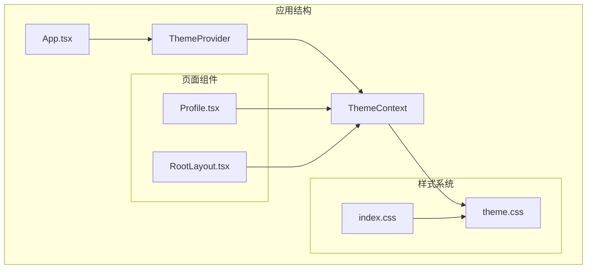
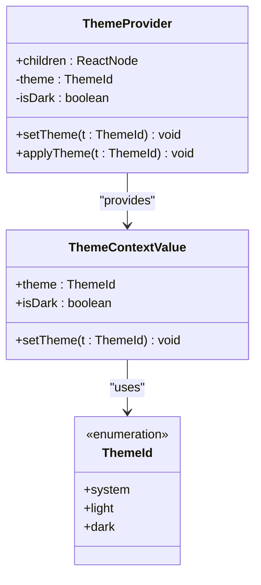
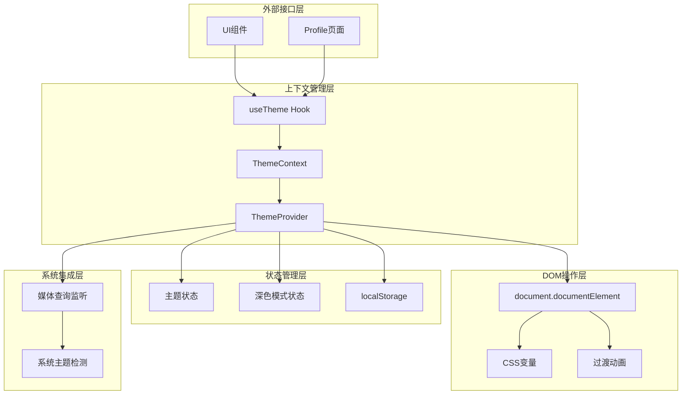
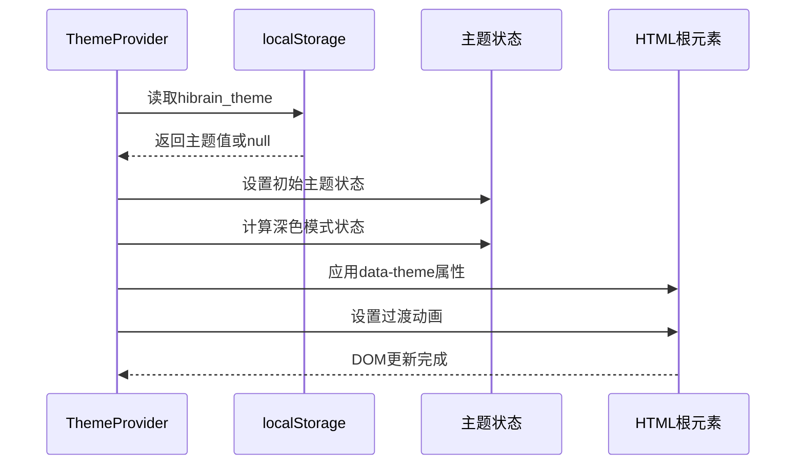
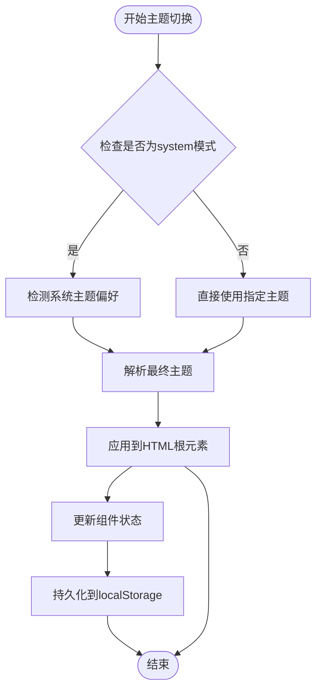
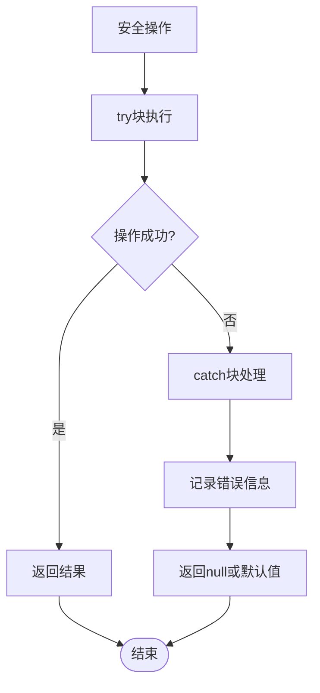
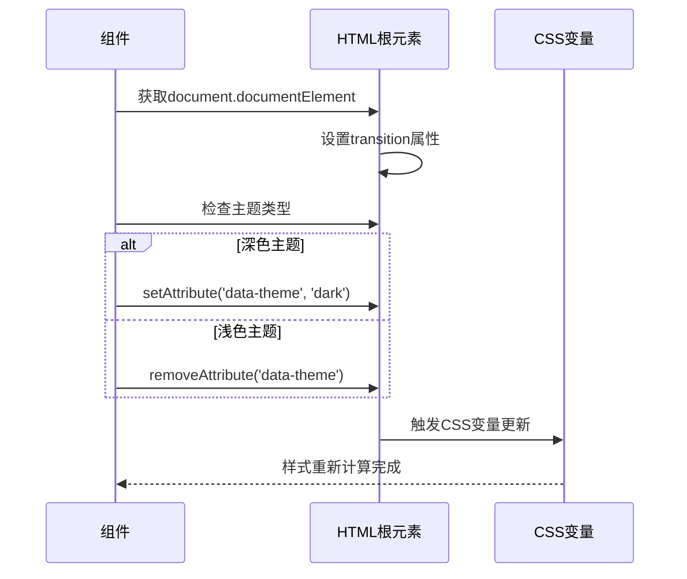
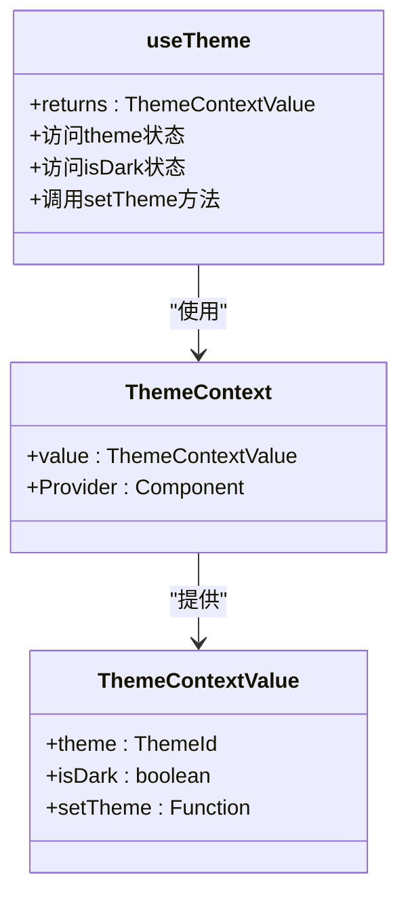
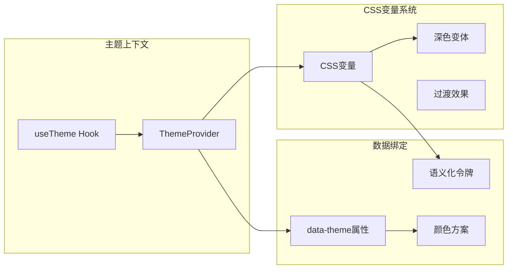
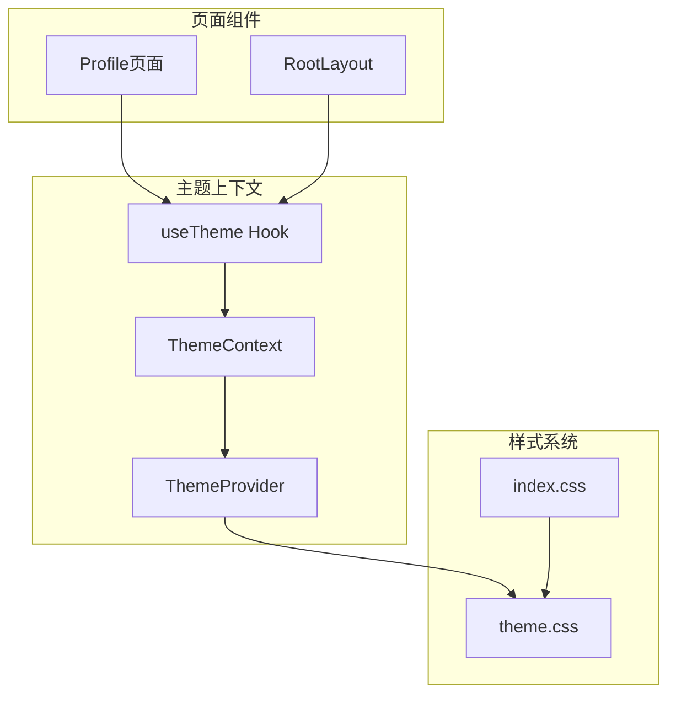

# 主题上下文提供者

<cite>
**本文档引用的文件**
- [ThemeContext.tsx](file://src/app/components/context/ThemeContext.tsx)
- [App.tsx](file://src/app/App.tsx)
- [theme.css](file://src/styles/theme.css)
- [index.css](file://src/styles/index.css)
- [Profile.tsx](file://src/app/pages/Profile.tsx)
- [RootLayout.tsx](file://src/app/components/RootLayout.tsx)
</cite>

## 目录
1. [简介](#简介)
2. [项目结构](#项目结构)
3. [核心组件](#核心组件)
4. [架构概览](#架构概览)
5. [详细组件分析](#详细组件分析)
6. [依赖关系分析](#依赖关系分析)
7. [性能考虑](#性能考虑)
8. [故障排除指南](#故障排除指南)
9. [结论](#结论)

## 简介

主题上下文提供者是本项目中用于管理应用主题状态的核心模块。它实现了完整的主题状态管理、系统主题检测、用户偏好存储和DOM操作等功能，为整个应用提供了统一的主题切换体验。

该模块采用React Context API设计模式，通过ThemeProvider组件提供主题状态给整个应用，并通过useTheme Hook让各个组件能够访问和修改主题设置。系统实现了安全的localStorage操作封装、沙箱环境兼容性和优雅的样式切换动画。

## 项目结构

主题上下文提供者位于应用的组件上下文层，与样式系统紧密集成：

**图表来源**
- [App.tsx:7-16](file://src/app/App.tsx#L7-L16)
- [ThemeContext.tsx:100-105](file://src/app/components/context/ThemeContext.tsx#L100-L105)

**章节来源**
- [App.tsx:1-17](file://src/app/App.tsx#L1-L17)
- [ThemeContext.tsx:1-110](file://src/app/components/context/ThemeContext.tsx#L1-L110)

## 核心组件

### ThemeContext类型定义

主题上下文提供者定义了完整的类型系统：

**图表来源**
- [ThemeContext.tsx:3](file://src/app/components/context/ThemeContext.tsx#L3-L9)

### 主要功能特性

1. **主题状态管理**：维护当前主题状态和深色模式判断
2. **系统主题检测**：自动检测操作系统主题偏好
3. **用户偏好存储**：持久化用户主题选择到localStorage
4. **DOM操作封装**：安全地应用data-theme属性到<html>元素
5. **样式切换动画**：提供平滑的主题过渡效果

**章节来源**
- [ThemeContext.tsx:5-15](file://src/app/components/context/ThemeContext.tsx#L5-L15)
- [ThemeContext.tsx:63-105](file://src/app/components/context/ThemeContext.tsx#L63-L105)

## 架构概览

主题上下文提供者采用了分层架构设计，确保了良好的可维护性和扩展性：

**图表来源**
- [ThemeContext.tsx:17-61](file://src/app/components/context/ThemeContext.tsx#L17-L61)
- [ThemeContext.tsx:83-92](file://src/app/components/context/ThemeContext.tsx#L83-L92)

## 详细组件分析

### ThemeProvider组件

ThemeProvider是主题上下文提供者的核心组件，负责管理主题状态的生命周期：

#### 状态初始化流程

**图表来源**
- [ThemeContext.tsx:63-81](file://src/app/components/context/ThemeContext.tsx#L63-L81)

#### 主题切换工作流程

**图表来源**
- [ThemeContext.tsx:28-32](file://src/app/components/context/ThemeContext.tsx#L28-L32)
- [ThemeContext.tsx:72-76](file://src/app/components/context/ThemeContext.tsx#L72-L76)

**章节来源**
- [ThemeContext.tsx:63-105](file://src/app/components/context/ThemeContext.tsx#L63-L105)

### 安全的localStorage操作封装

系统实现了多层安全防护机制来处理localStorage操作：

#### 错误处理机制

**图表来源**
- [ThemeContext.tsx:34-48](file://src/app/components/context/ThemeContext.tsx#L34-L48)

#### 沙箱环境兼容性

系统通过以下方式确保在各种环境下的兼容性：

1. **window对象检测**：在访问window对象前进行存在性检查
2. **matchMedia检测**：验证浏览器媒体查询API可用性
3. **localStorage检测**：确认本地存储功能可用
4. **异常捕获**：使用try-catch包装所有可能失败的操作

**章节来源**
- [ThemeContext.tsx:17-26](file://src/app/components/context/ThemeContext.tsx#L17-L26)
- [ThemeContext.tsx:34-48](file://src/app/components/context/ThemeContext.tsx#L34-L48)

### DOM操作安全性考虑

#### data-theme属性应用

系统通过安全的DOM操作确保主题切换的可靠性：

**图表来源**
- [ThemeContext.tsx:50-61](file://src/app/components/context/ThemeContext.tsx#L50-L61)

#### 样式切换动画

系统实现了平滑的主题切换动画效果：

1. **过渡时长**：0.35秒的缓动过渡
2. **过渡属性**：背景色和文字颜色的平滑变化
3. **硬件加速**：利用CSS3硬件加速优化性能

**章节来源**
- [ThemeContext.tsx:50-61](file://src/app/components/context/ThemeContext.tsx#L50-L61)
- [theme.css:233-236](file://src/styles/theme.css#L233-L236)

### useTheme Hook的实现

useTheme Hook提供了简洁的API供组件使用主题功能：

#### Hook设计模式

**图表来源**
- [ThemeContext.tsx:107-109](file://src/app/components/context/ThemeContext.tsx#L107-L109)

**章节来源**
- [ThemeContext.tsx:107-109](file://src/app/components/context/ThemeContext.tsx#L107-L109)

## 依赖关系分析

### 样式系统集成

主题上下文提供者与样式系统的深度集成体现在多个层面：

**图表来源**
- [theme.css:1-280](file://src/styles/theme.css#L1-L280)
- [ThemeContext.tsx:50-61](file://src/app/components/context/ThemeContext.tsx#L50-L61)

### 组件间依赖关系

#### 页面组件集成

**图表来源**
- [Profile.tsx:3256-3276](file://src/app/pages/Profile.tsx#L3256-L3276)
- [RootLayout.tsx:10-30](file://src/app/components/RootLayout.tsx#L10-L30)

**章节来源**
- [Profile.tsx:3172-3220](file://src/app/pages/Profile.tsx#L3172-L3220)
- [RootLayout.tsx:10-30](file://src/app/components/RootLayout.tsx#L10-L30)

## 性能考虑

### 优化策略

#### 内存管理

1. **状态提升**：将主题状态提升到应用根级别，避免重复渲染
2. **回调函数缓存**：使用useCallback确保回调函数引用稳定
3. **依赖数组优化**：精确控制effect的执行时机

#### 渲染性能

1. **最小化DOM操作**：只在必要时修改data-theme属性
2. **CSS变量优化**：利用CSS变量减少重排重绘
3. **过渡动画优化**：使用transform和opacity属性实现硬件加速

#### 存储性能

1. **懒加载初始化**：延迟读取localStorage直到需要时
2. **批量操作**：避免频繁的localStorage写入操作
3. **错误降级**：在存储不可用时优雅降级到内存状态

### 最佳实践建议

1. **主题切换防抖**：对于频繁的主题切换操作，建议添加防抖机制
2. **缓存策略**：对解析后的主题结果进行缓存
3. **异步加载**：对于大型主题资源，考虑异步加载策略
4. **监控指标**：添加主题切换性能监控指标

## 故障排除指南

### 常见问题及解决方案

#### 主题不生效

**问题描述**：主题切换后样式没有变化

**可能原因**：
1. CSS变量未正确更新
2. data-theme属性未正确设置
3. 样式优先级冲突

**解决方案**：
1. 检查浏览器开发者工具中的CSS变量值
2. 验证data-theme属性是否存在于<html>标签上
3. 确认CSS选择器的优先级

#### 系统主题检测失败

**问题描述**：在system模式下无法正确检测系统主题

**可能原因**：
1. 浏览器不支持matchMedia API
2. 沙箱环境中window对象不可用
3. 用户代理字符串异常

**解决方案**：
1. 检查浏览器兼容性
2. 在沙箱环境中降级到light主题
3. 添加用户代理检测逻辑

#### localStorage访问异常

**问题描述**：主题偏好无法保存或读取

**可能原因**：
1. 浏览器禁用了localStorage
2. 同源策略限制
3. 浏览器隐私模式

**解决方案**：
1. 检查浏览器设置中的存储权限
2. 实现备用存储方案（如sessionStorage）
3. 提供无状态的默认主题

**章节来源**
- [ThemeContext.tsx:17-26](file://src/app/components/context/ThemeContext.tsx#L17-L26)
- [ThemeContext.tsx:34-48](file://src/app/components/context/ThemeContext.tsx#L34-L48)

## 结论

主题上下文提供者是一个设计精良的主题管理系统，具有以下特点：

### 设计优势

1. **模块化设计**：清晰的职责分离和模块边界
2. **安全性考虑**：全面的错误处理和环境兼容性
3. **性能优化**：合理的状态管理和渲染优化
4. **可扩展性**：灵活的架构支持未来功能扩展

### 技术亮点

1. **安全的DOM操作**：通过try-catch包装确保操作安全
2. **优雅的降级机制**：在各种环境下提供一致的用户体验
3. **平滑的过渡动画**：提升用户的视觉体验
4. **完整的类型系统**：提供强类型的开发体验

### 改进建议

1. **主题预加载**：实现主题资源的预加载机制
2. **主题验证**：添加主题配置的有效性验证
3. **性能监控**：集成主题切换性能监控
4. **国际化支持**：扩展多语言主题描述支持

该主题系统为整个应用提供了坚实的基础，确保了用户在不同设备和环境下都能获得一致且优质的主题体验。