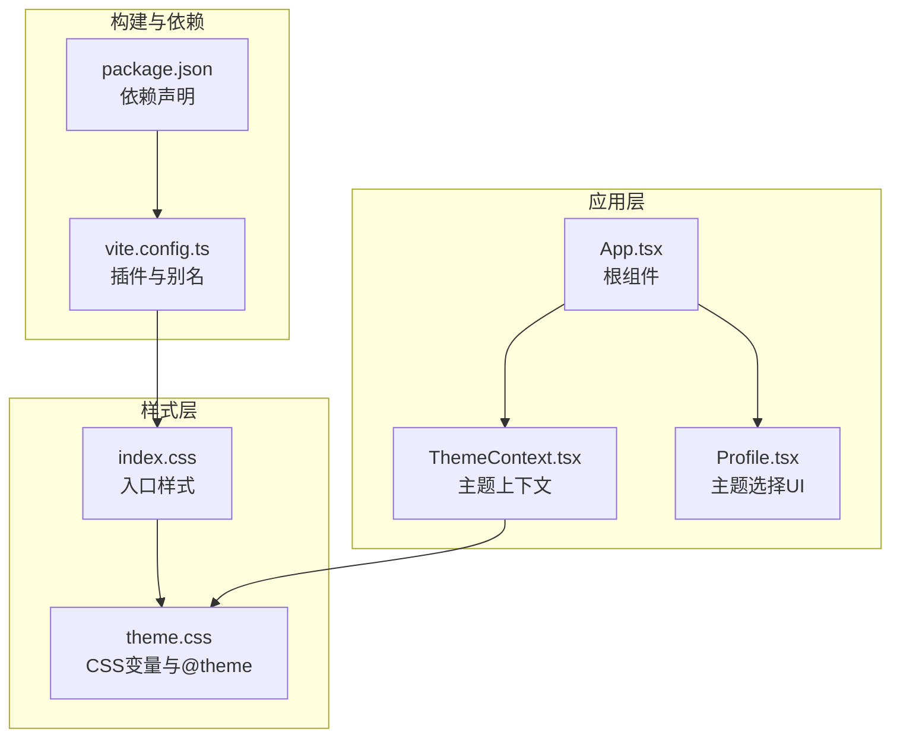
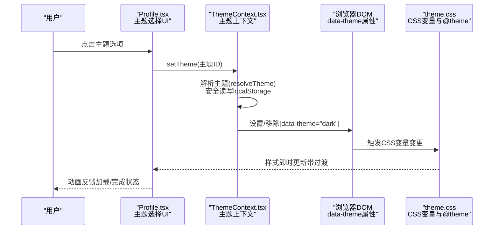
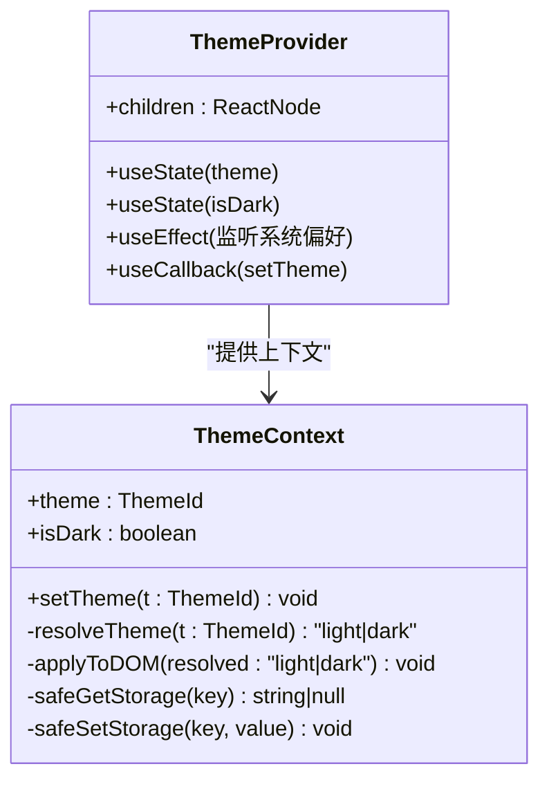
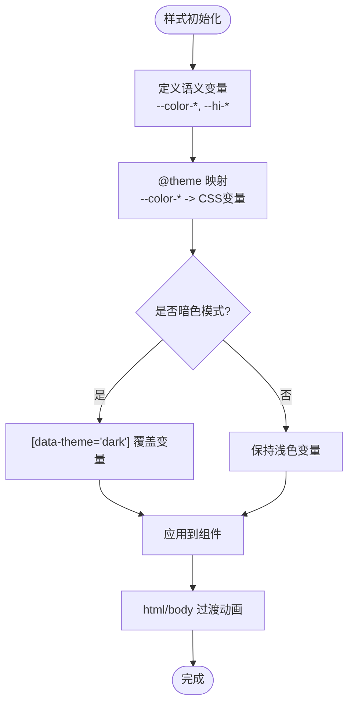
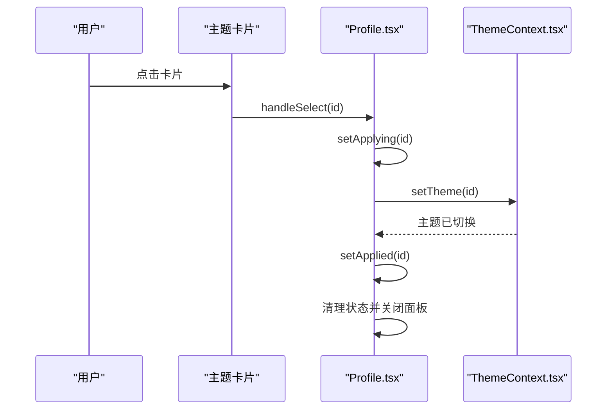
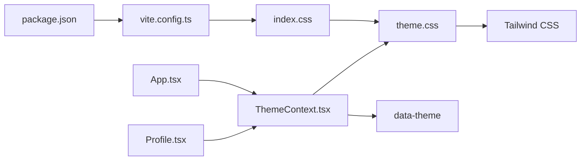

# 主题定制与扩展

<cite>
**本文引用的文件**
- [ThemeContext.tsx](file://src/app/components/context/ThemeContext.tsx)
- [theme.css](file://src/styles/theme.css)
- [index.css](file://src/styles/index.css)
- [App.tsx](file://src/app/App.tsx)
- [Profile.tsx](file://src/app/pages/Profile.tsx)
- [package.json](file://package.json)
- [vite.config.ts](file://vite.config.ts)
- [README.md](file://README.md)
</cite>

## 目录
1. [简介](#简介)
2. [项目结构](#项目结构)
3. [核心组件](#核心组件)
4. [架构总览](#架构总览)
5. [详细组件分析](#详细组件分析)
6. [依赖关系分析](#依赖关系分析)
7. [性能考量](#性能考量)
8. [故障排查指南](#故障排查指南)
9. [结论](#结论)
10. [附录](#附录)

## 简介
本指南面向需要为该笔记应用前端进行“主题定制与扩展”的工程师与产品同学，目标是：
- 在不破坏现有体系的前提下，扩展主题系统以支持自定义颜色方案与品牌定制
- 明确新增主题的添加流程与现有主题的修改方法
- 优化主题切换的用户体验（平滑过渡与加载状态）
- 设计可维护的主题配置组织方式与版本管理策略
- 支持多品牌部署与国际化（含界面文案与品牌元素）

## 项目结构
主题系统由三层构成：
- 上层：React Provider 提供主题上下文与切换能力
- 中层：CSS 变量与 @theme 声明，定义语义化颜色令牌与暗色变体
- 下层：Tailwind 层与基础样式，统一应用变量与过渡效果

图表来源
- [App.tsx:1-17](file://src/app/App.tsx#L1-L17)
- [ThemeContext.tsx:63-105](file://src/app/components/context/ThemeContext.tsx#L63-L105)
- [Profile.tsx:3256-3276](file://src/app/pages/Profile.tsx#L3256-L3276)
- [index.css:1-4](file://src/styles/index.css#L1-L4)
- [theme.css:183-222](file://src/styles/theme.css#L183-L222)
- [vite.config.ts:1-44](file://vite.config.ts#L1-L44)
- [package.json:1-113](file://package.json#L1-L113)

章节来源
- [App.tsx:1-17](file://src/app/App.tsx#L1-L17)
- [ThemeContext.tsx:63-105](file://src/app/components/context/ThemeContext.tsx#L63-L105)
- [Profile.tsx:3256-3276](file://src/app/pages/Profile.tsx#L3256-L3276)
- [index.css:1-4](file://src/styles/index.css#L1-L4)
- [theme.css:183-222](file://src/styles/theme.css#L183-L222)
- [vite.config.ts:1-44](file://vite.config.ts#L1-L44)
- [package.json:1-113](file://package.json#L1-L113)

## 核心组件
- 主题上下文（ThemeContext）
  - 负责：读取/写入存储、解析系统偏好、应用到 DOM、响应式切换
  - 关键点：通过 data-theme 属性与 CSS 变量驱动样式；在 SSR/受限环境安全降级
- 主题样式（theme.css）
  - 负责：定义语义化 CSS 变量、@theme 映射、暗色变体与品牌语义令牌
  - 关键点：使用 oklch 颜色空间与 @custom-variant dark 实现明暗适配
- 入口样式（index.css）
  - 负责：引入 Tailwind 与主题样式，统一过渡与视口处理
- 主题选择 UI（Profile.tsx）
  - 负责：提供主题卡片预览与平滑切换动画
- 应用根组件（App.tsx）
  - 负责：包裹 Provider，确保全局主题生效

章节来源
- [ThemeContext.tsx:1-110](file://src/app/components/context/ThemeContext.tsx#L1-L110)
- [theme.css:1-280](file://src/styles/theme.css#L1-L280)
- [index.css:1-229](file://src/styles/index.css#L1-L229)
- [Profile.tsx:3172-3400](file://src/app/pages/Profile.tsx#L3172-L3400)
- [App.tsx:1-17](file://src/app/App.tsx#L1-L17)

## 架构总览
主题系统采用“变量驱动 + 上下文管理 + UI 交互”的分层架构。切换流程如下：

图表来源
- [Profile.tsx:3264-3276](file://src/app/pages/Profile.tsx#L3264-L3276)
- [ThemeContext.tsx:72-81](file://src/app/components/context/ThemeContext.tsx#L72-L81)
- [ThemeContext.tsx:51-61](file://src/app/components/context/ThemeContext.tsx#L51-L61)
- [theme.css:183-222](file://src/styles/theme.css#L183-L222)

## 详细组件分析

### 组件A：主题上下文（ThemeContext）
职责与特性：
- 主题状态管理：支持 'system' | 'light' | 'dark'
- 系统偏好监听：当处于 'system' 时监听系统深浅色变化
- 存储持久化：localStorage 容错处理
- DOM 应用：通过 data-theme 属性与 CSS 变量驱动样式
- 过渡动画：为 html/body 设置过渡时间，保证平滑切换

图表来源
- [ThemeContext.tsx:3-15](file://src/app/components/context/ThemeContext.tsx#L3-L15)
- [ThemeContext.tsx:63-105](file://src/app/components/context/ThemeContext.tsx#L63-L105)

章节来源
- [ThemeContext.tsx:1-110](file://src/app/components/context/ThemeContext.tsx#L1-L110)

### 组件B：主题样式（theme.css）
职责与特性：
- 语义化变量：定义 --color-* 与 --hi-* 品牌语义令牌
- @theme 映射：将语义变量映射为框架可用的颜色变量
- 暗色变体：基于 [data-theme="dark"] 与 .dark 类覆盖变量
- 过渡与排版：在 html/body 层设置过渡与字号、行高等

图表来源
- [theme.css:3-92](file://src/styles/theme.css#L3-L92)
- [theme.css:94-144](file://src/styles/theme.css#L94-L144)
- [theme.css:183-222](file://src/styles/theme.css#L183-L222)
- [theme.css:229-236](file://src/styles/theme.css#L229-L236)

章节来源
- [theme.css:1-280](file://src/styles/theme.css#L1-L280)

### 组件C：主题选择 UI（Profile.tsx）
职责与特性：
- 提供三种主题选项与预览卡片
- 切换时展示“应用中/已应用”状态与动画
- 使用 Portal 渲染底部弹层，配合动效与安全区适配

图表来源
- [Profile.tsx:3264-3276](file://src/app/pages/Profile.tsx#L3264-L3276)
- [Profile.tsx:3347-3400](file://src/app/pages/Profile.tsx#L3347-L3400)

章节来源
- [Profile.tsx:3172-3400](file://src/app/pages/Profile.tsx#L3172-L3400)

### 组件D：入口样式与构建（index.css、vite.config.ts）
职责与特性：
- index.css 引入 Tailwind 与主题样式，统一滚动与视口处理
- vite.config.ts 配置 Tailwind 插件与别名，避免 React 多实例问题

章节来源
- [index.css:1-229](file://src/styles/index.css#L1-L229)
- [vite.config.ts:1-44](file://vite.config.ts#L1-L44)

## 依赖关系分析
- 主题上下文依赖浏览器 API（matchMedia、localStorage）与 DOM 属性（data-theme）
- 样式层依赖 Tailwind 与 @theme 机制，通过 CSS 变量驱动组件
- UI 层依赖动画库（motion）与 Portal 渲染，提升交互体验
- 构建层通过 Vite 插件链路确保样式正确打包与别名解析

图表来源
- [ThemeContext.tsx:51-61](file://src/app/components/context/ThemeContext.tsx#L51-L61)
- [theme.css:183-222](file://src/styles/theme.css#L183-L222)
- [index.css:1-4](file://src/styles/index.css#L1-L4)
- [Profile.tsx:3256-3276](file://src/app/pages/Profile.tsx#L3256-L3276)
- [App.tsx:5-16](file://src/app/App.tsx#L5-L16)
- [vite.config.ts:1-44](file://vite.config.ts#L1-L44)
- [package.json:85-92](file://package.json#L85-L92)

章节来源
- [ThemeContext.tsx:1-110](file://src/app/components/context/ThemeContext.tsx#L1-L110)
- [theme.css:1-280](file://src/styles/theme.css#L1-L280)
- [index.css:1-229](file://src/styles/index.css#L1-L229)
- [Profile.tsx:3172-3400](file://src/app/pages/Profile.tsx#L3172-L3400)
- [App.tsx:1-17](file://src/app/App.tsx#L1-L17)
- [vite.config.ts:1-44](file://vite.config.ts#L1-L44)
- [package.json:1-113](file://package.json#L1-L113)

## 性能考量
- CSS 变量切换成本低，仅触发布局与绘制，无需重排
- 过渡时间（0.35s）平衡感知与性能，建议在弱设备上可进一步延长
- 避免在主题切换期间执行昂贵操作（如大数据渲染），可在切换后异步加载
- Tailwind 与 Vite 已内置按需与预打包优化，保持默认配置即可

## 故障排查指南
常见问题与定位要点：
- 切换无效或闪烁
  - 检查 data-theme 是否正确设置与移除
  - 确认 CSS 变量覆盖顺序与 @theme 映射
- SSR/受限环境报错
  - 确保对 matchMedia、localStorage 的安全调用
- 动画卡顿
  - 检查是否有额外重绘/回流操作
  - 适当增加过渡时间或减少复杂阴影
- 多品牌/多主题冲突
  - 确保每个主题拥有独立的变量集与命名空间
  - 避免直接硬编码颜色值，统一通过语义变量引用

章节来源
- [ThemeContext.tsx:17-26](file://src/app/components/context/ThemeContext.tsx#L17-L26)
- [ThemeContext.tsx:35-48](file://src/app/components/context/ThemeContext.tsx#L35-L48)
- [theme.css:229-236](file://src/styles/theme.css#L229-L236)

## 结论
该主题系统以 CSS 变量为核心，结合 React 上下文与 UI 动效，实现了可维护、可扩展且具备良好用户体验的主题体系。通过本文档的扩展指引，可在不破坏现有架构的前提下，快速添加新主题、定制品牌色彩与标识，并支持多品牌部署与国际化。

## 附录

### A. 扩展主题系统：添加新主题的步骤
- 新增主题变量
  - 在 theme.css 中新增一组语义变量与品牌令牌
  - 如需暗色变体，在 [data-theme="dark"] 块中覆盖对应变量
- 注册主题选项
  - 在 Profile.tsx 的 THEME_OPTIONS 中添加新主题项（包含预览与标签）
- 应用与测试
  - 通过 UI 选择新主题，验证过渡与暗色覆盖
  - 确认 data-theme 属性与 CSS 变量生效

章节来源
- [theme.css:3-92](file://src/styles/theme.css#L3-L92)
- [theme.css:94-144](file://src/styles/theme.css#L94-L144)
- [Profile.tsx:3172-3220](file://src/app/pages/Profile.tsx#L3172-L3220)

### B. 自定义颜色方案：CSS 变量与 @theme 的使用
- 语义变量
  - 使用 --color-* 作为框架通用变量，@theme 将其映射为组件可用变量
- 品牌令牌
  - 使用 --hi-* 定义品牌专属颜色，便于跨主题复用
- 暗色覆盖
  - 在 [data-theme="dark"] 与 .dark 中覆盖关键变量，确保对比度与可读性

章节来源
- [theme.css:183-222](file://src/styles/theme.css#L183-L222)
- [theme.css:146-181](file://src/styles/theme.css#L146-L181)

### C. 品牌定制：Logo 替换与企业标识集成
- Logo 与品牌元素
  - 可参考 Profile.tsx 中的品牌展示区域，替换为自有 Logo 或动态标识
  - 保持与主题变量一致的配色与对比度
- 动效与粒子
  - 可保留或替换粒子轨道动效，确保与品牌主色协调

章节来源
- [Profile.tsx:1960-2026](file://src/app/pages/Profile.tsx#L1960-L2026)

### D. 主题切换的用户体验优化
- 平滑过渡
  - 通过 html/body 的过渡时间与 CSS 变量变更实现自然过渡
- 加载状态
  - 在切换过程中显示“应用中/已应用”状态与轻动效，避免误触
- 安全区与弹层
  - 使用 Portal 渲染底部弹层，适配安全区与手势返回

章节来源
- [Profile.tsx:3264-3276](file://src/app/pages/Profile.tsx#L3264-L3276)
- [Profile.tsx:3301-3321](file://src/app/pages/Profile.tsx#L3301-L3321)

### E. 可维护性设计：配置文件组织与版本管理
- 配置组织
  - 将主题变量集中于 theme.css，语义映射于 @theme 区域
  - 将 UI 交互与状态管理置于 Profile.tsx，保持关注点分离
- 版本管理
  - 通过 CSS 变量命名规范与注释，明确版本演进
  - 在 package.json 中锁定关键依赖版本，避免样式层差异

章节来源
- [theme.css:1-280](file://src/styles/theme.css#L1-L280)
- [package.json:85-92](file://package.json#L85-L92)

### F. 多品牌部署与国际化
- 多品牌
  - 为不同品牌建立独立的变量集与品牌令牌，通过构建时注入或运行时切换
- 国际化
  - UI 文案与品牌展示可随语言切换而更新，保持与主题变量一致的视觉节奏

章节来源
- [Profile.tsx:441-452](file://src/app/pages/Profile.tsx#L441-L452)
- [Profile.tsx:460-659](file://src/app/pages/Profile.tsx#L460-L659)