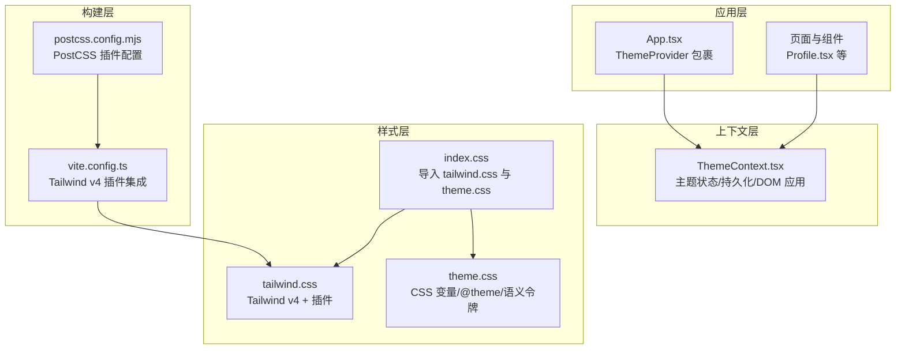
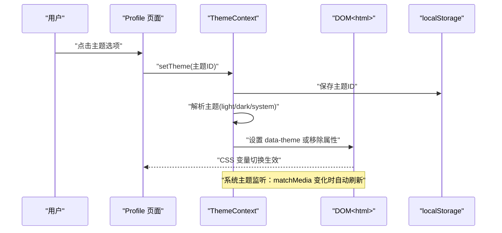
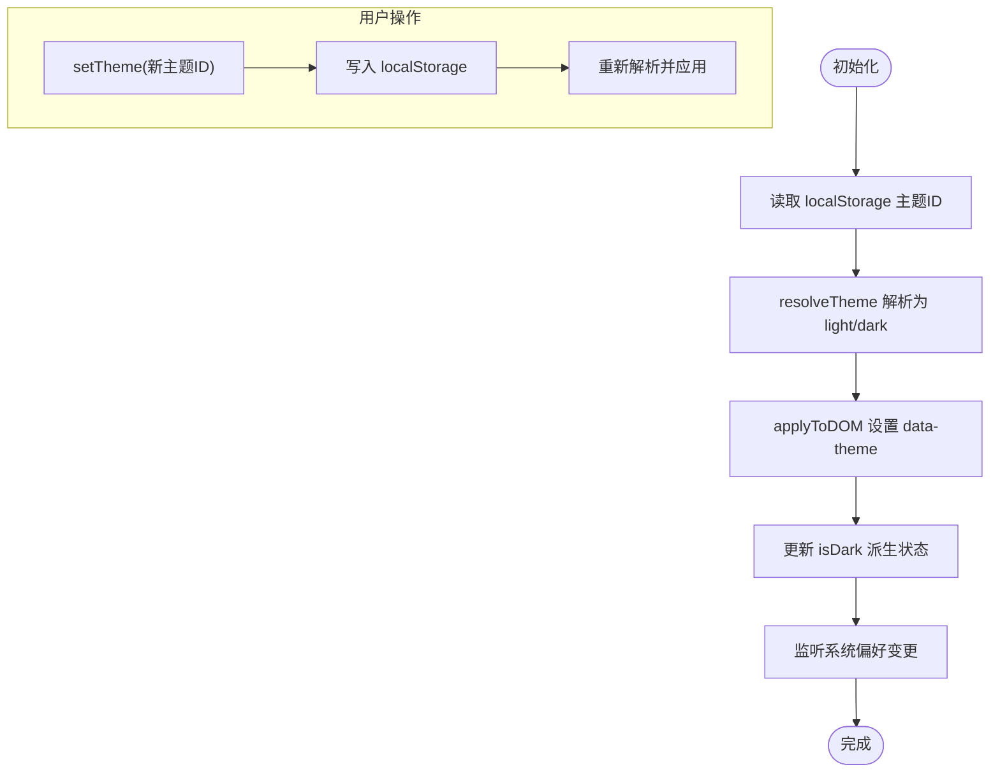
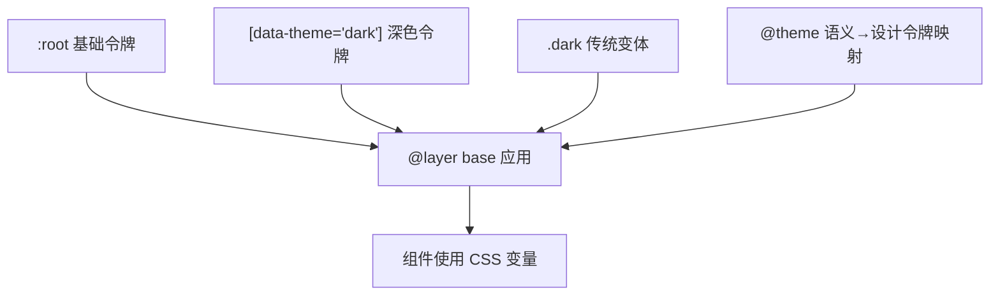
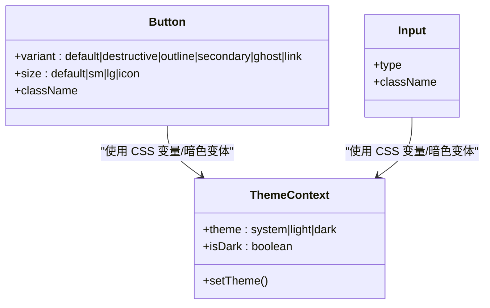
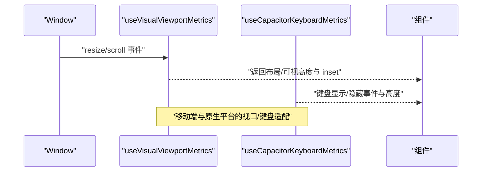
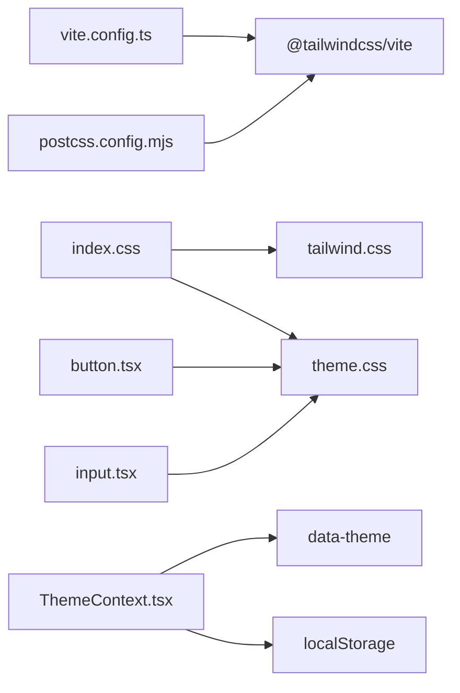

# 主题系统设计

<cite>
**本文引用的文件**
- [ThemeContext.tsx](file://src/app/components/context/ThemeContext.tsx)
- [theme.css](file://src/styles/theme.css)
- [index.css](file://src/styles/index.css)
- [tailwind.css](file://src/styles/tailwind.css)
- [postcss.config.mjs](file://postcss.config.mjs)
- [vite.config.ts](file://vite.config.ts)
- [use-capacitor-keyboard.ts](file://src/app/components/ui/use-capacitor-keyboard.ts)
- [use-visual-viewport.ts](file://src/app/components/ui/use-visual-viewport.ts)
- [use-mobile.ts](file://src/app/components/ui/use-mobile.ts)
- [button.tsx](file://src/app/components/ui/button.tsx)
- [input.tsx](file://src/app/components/ui/input.tsx)
- [App.tsx](file://src/app/App.tsx)
- [Profile.tsx](file://src/app/pages/Profile.tsx)
- [package.json](file://package.json)
</cite>

## 目录
1. [简介](#简介)
2. [项目结构](#项目结构)
3. [核心组件](#核心组件)
4. [架构总览](#架构总览)
5. [详细组件分析](#详细组件分析)
6. [依赖关系分析](#依赖关系分析)
7. [性能考量](#性能考量)
8. [故障排查指南](#故障排查指南)
9. [结论](#结论)
10. [附录](#附录)

## 简介
本文件面向“主题系统设计”的技术文档，围绕以下目标展开：
- 主题切换机制与状态管理：基于 React Context 的 ThemeContext 设计、状态持久化与系统偏好联动。
- 样式管理策略：CSS 变量体系、Tailwind v4 主题变量映射、暗色模式与语义令牌、样式缓存与过渡动画。
- 响应式设计：移动端断点、键盘高度检测、视口动态高度管理。
- Tailwind 定制与组件主题化：Tailwind v4 插件链、@theme 映射、组件级变体与暗色模式适配。
- 扩展与定制：主题扩展、自定义颜色方案、品牌定制、无障碍与跨平台一致性。
- 最佳实践：可维护性、性能优化与调试建议。

## 项目结构
主题系统由三层构成：
- 上层：React Provider 层（ThemeContext），负责主题状态、持久化与 DOM 应用。
- 中层：样式层（theme.css + index.css），定义 CSS 变量、@theme 映射、语义令牌与基础样式。
- 下层：构建层（Tailwind v4 + PostCSS + Vite），负责样式生成、按需扫描与插件链。

**图表来源**
- [App.tsx:1-17](file://src/app/App.tsx#L1-L17)
- [ThemeContext.tsx:63-105](file://src/app/components/context/ThemeContext.tsx#L63-L105)
- [index.css:1-4](file://src/styles/index.css#L1-L4)
- [tailwind.css:1-7](file://src/styles/tailwind.css#L1-L7)
- [theme.css:183-222](file://src/styles/theme.css#L183-L222)
- [postcss.config.mjs:1-16](file://postcss.config.mjs#L1-L16)
- [vite.config.ts:1-44](file://vite.config.ts#L1-L44)

**章节来源**
- [App.tsx:1-17](file://src/app/App.tsx#L1-L17)
- [index.css:1-4](file://src/styles/index.css#L1-L4)
- [tailwind.css:1-7](file://src/styles/tailwind.css#L1-L7)
- [theme.css:183-222](file://src/styles/theme.css#L183-L222)
- [postcss.config.mjs:1-16](file://postcss.config.mjs#L1-L16)
- [vite.config.ts:1-44](file://vite.config.ts#L1-L44)

## 核心组件
- ThemeContext：提供主题状态（当前主题、是否深色）、设置主题方法；在挂载时从本地存储读取并应用；监听系统偏好变化；将主题映射到 data-theme 属性以驱动 CSS 变量切换。
- CSS 变量与 @theme：通过 :root 与 [data-theme="dark"] 定义两套语义令牌；@theme 将语义令牌映射为 Tailwind v4 的设计令牌；基础层（@layer base）统一应用到全局。
- Tailwind v4 集成：通过 @tailwindcss/vite 在 Vite 中启用 Tailwind v4；引入 @tailwindcss/typography 与 tw-animate-css 插件；PostCSS 配置为空，便于后续扩展。
- 组件主题化：按钮、输入框等组件使用 CSS 变量与暗色模式变体，确保在不同主题下具有一致的视觉与交互体验。

**章节来源**
- [ThemeContext.tsx:3-15](file://src/app/components/context/ThemeContext.tsx#L3-L15)
- [ThemeContext.tsx:63-105](file://src/app/components/context/ThemeContext.tsx#L63-L105)
- [theme.css:3-92](file://src/styles/theme.css#L3-L92)
- [theme.css:94-144](file://src/styles/theme.css#L94-L144)
- [theme.css:183-222](file://src/styles/theme.css#L183-L222)
- [tailwind.css:1-7](file://src/styles/tailwind.css#L1-L7)
- [vite.config.ts:1-44](file://vite.config.ts#L1-L44)
- [button.tsx:7-35](file://src/app/components/ui/button.tsx#L7-L35)
- [input.tsx:5-18](file://src/app/components/ui/input.tsx#L5-L18)

## 架构总览
主题系统采用“状态驱动样式”的架构：React Context 负责状态与副作用，CSS 变量与 @theme 负责样式渲染，Tailwind v4 提供原子化工具类与组件变体。

**图表来源**
- [Profile.tsx:3256-3352](file://src/app/pages/Profile.tsx#L3256-L3352)
- [ThemeContext.tsx:94-98](file://src/app/components/context/ThemeContext.tsx#L94-L98)
- [ThemeContext.tsx:51-61](file://src/app/components/context/ThemeContext.tsx#L51-L61)
- [ThemeContext.tsx:84-92](file://src/app/components/context/ThemeContext.tsx#L84-L92)

## 详细组件分析

### 主题上下文与状态管理（ThemeContext）
- 状态模型
  - 主题枚举：system | light | dark
  - isDark：派生状态，用于条件渲染与组件变体
  - setTheme：写入 localStorage 并触发 DOM 切换
- 解析与应用
  - resolveTheme：将 system 解析为 light/dark
  - applyToDOM：向 <html> 写入 data-theme="dark" 或移除属性
- 生命周期
  - 挂载：从 localStorage 读取初始主题并应用
  - 监听：matchMedia 监听系统偏好变化，system 模式下自动刷新
  - SSR 安全：prefersColorSchemeDark、safeGetStorage、safeSetStorage、applyToDOM 均包含沙箱/受限环境保护

**图表来源**
- [ThemeContext.tsx:63-105](file://src/app/components/context/ThemeContext.tsx#L63-L105)
- [ThemeContext.tsx:28-32](file://src/app/components/context/ThemeContext.tsx#L28-L32)
- [ThemeContext.tsx:50-61](file://src/app/components/context/ThemeContext.tsx#L50-L61)

**章节来源**
- [ThemeContext.tsx:3-15](file://src/app/components/context/ThemeContext.tsx#L3-L15)
- [ThemeContext.tsx:17-48](file://src/app/components/context/ThemeContext.tsx#L17-L48)
- [ThemeContext.tsx:63-105](file://src/app/components/context/ThemeContext.tsx#L63-L105)

### 样式管理策略（CSS 变量、动态主题与缓存）
- CSS 变量体系
  - :root 定义基础令牌与“浅色语义令牌”
  - [data-theme="dark"] 定义“深色语义令牌”
  - .dark 为传统暗色模式变体，覆盖基础令牌
- @theme 映射
  - 将语义令牌映射为 Tailwind v4 设计令牌，如 --color-background、--radius-* 等
- 基础层（@layer base）
  - 全局边框、轮廓、字体大小、标题与表单控件的基础样式均基于 CSS 变量
- 样式缓存与过渡
  - HTML 与根元素设置过渡动画，减少主题切换闪烁
  - index.css 对 h-screen 使用 100dvh 以适配动态视口

**图表来源**
- [theme.css:3-92](file://src/styles/theme.css#L3-L92)
- [theme.css:94-144](file://src/styles/theme.css#L94-L144)
- [theme.css:146-181](file://src/styles/theme.css#L146-L181)
- [theme.css:183-222](file://src/styles/theme.css#L183-L222)
- [theme.css:224-279](file://src/styles/theme.css#L224-L279)
- [index.css:19-47](file://src/styles/index.css#L19-L47)

**章节来源**
- [theme.css:3-92](file://src/styles/theme.css#L3-L92)
- [theme.css:94-144](file://src/styles/theme.css#L94-L144)
- [theme.css:183-222](file://src/styles/theme.css#L183-L222)
- [theme.css:224-279](file://src/styles/theme.css#L224-L279)
- [index.css:19-47](file://src/styles/index.css#L19-L47)

### Tailwind CSS 定制与组件主题化
- Tailwind v4 集成
  - 通过 @tailwindcss/vite 在 Vite 中启用 Tailwind v4
  - @source 指定扫描范围，确保按需生成
  - 引入 @tailwindcss/typography 与 tw-animate-css 插件
- 组件主题化
  - 按钮与输入框使用 CSS 变量与暗色模式变体，确保在不同主题下具备一致的前景/背景/边框/轮廓表现
  - 组件变体（variant/size）与焦点/禁用/错误态结合 CSS 变量，避免硬编码颜色

**图表来源**
- [button.tsx:7-35](file://src/app/components/ui/button.tsx#L7-L35)
- [input.tsx:5-18](file://src/app/components/ui/input.tsx#L5-L18)
- [ThemeContext.tsx:3-15](file://src/app/components/context/ThemeContext.tsx#L3-L15)

**章节来源**
- [tailwind.css:1-7](file://src/styles/tailwind.css#L1-L7)
- [vite.config.ts:1-44](file://vite.config.ts#L1-L44)
- [button.tsx:7-35](file://src/app/components/ui/button.tsx#L7-L35)
- [input.tsx:5-18](file://src/app/components/ui/input.tsx#L5-L18)

### 响应式设计与视口管理
- 移动端断点
  - useIsMobile 基于 matchMedia 的断点（768px）判断移动端
- 动态视口高度
  - useVisualViewportMetrics 读取 window.visualViewport，计算布局高度、可视高度、偏移与底部 inset，处理旋转与键盘弹出场景
- 键盘高度检测（原生平台）
  - useCapacitorKeyboardMetrics 通过 Capacitor Keyboard 插件监听键盘显示/隐藏事件，返回可见性与高度
- 视口与全屏适配
  - index.css 使用 100dvh 与 -webkit-fill-available 适配 Android Chrome 与 iOS Safari 的动态视口差异

**图表来源**
- [use-visual-viewport.ts:40-72](file://src/app/components/ui/use-visual-viewport.ts#L40-L72)
- [use-capacitor-keyboard.ts:12-59](file://src/app/components/ui/use-capacitor-keyboard.ts#L12-L59)
- [use-mobile.ts:5-21](file://src/app/components/ui/use-mobile.ts#L5-L21)
- [index.css:19-47](file://src/styles/index.css#L19-L47)

**章节来源**
- [use-visual-viewport.ts:11-38](file://src/app/components/ui/use-visual-viewport.ts#L11-L38)
- [use-visual-viewport.ts:40-72](file://src/app/components/ui/use-visual-viewport.ts#L40-L72)
- [use-capacitor-keyboard.ts:12-59](file://src/app/components/ui/use-capacitor-keyboard.ts#L12-L59)
- [use-mobile.ts:3-21](file://src/app/components/ui/use-mobile.ts#L3-L21)
- [index.css:19-47](file://src/styles/index.css#L19-L47)

### 主题扩展、自定义颜色方案与品牌定制
- 自定义颜色方案
  - 在 :root 与 [data-theme="dark"] 中新增或覆盖语义令牌，即可实现品牌色系与功能色系的定制
  - 通过 @theme 映射新增设计令牌，使 Tailwind 工具类与组件变体自动适配
- 主题扩展
  - 新增主题 ID（如 'auto'）并在 resolveTheme 中处理；在 UI 中提供入口并调用 setTheme
  - 保持 localStorage 键名约定（如 'hibrain_theme'），确保持久化兼容
- 品牌定制
  - 使用语义令牌（如 --hi-*）表达品牌色彩与业务语义，避免直接绑定固定色值
  - 在组件中优先使用 CSS 变量而非硬编码颜色，确保主题切换时的一致性

**章节来源**
- [theme.css:3-92](file://src/styles/theme.css#L3-L92)
- [theme.css:94-144](file://src/styles/theme.css#L94-L144)
- [theme.css:183-222](file://src/styles/theme.css#L183-L222)
- [ThemeContext.tsx:28-32](file://src/app/components/context/ThemeContext.tsx#L28-L32)
- [ThemeContext.tsx:94-98](file://src/app/components/context/ThemeContext.tsx#L94-L98)

### 无障碍访问与跨平台一致性
- 无障碍
  - 组件使用 outline-ring/50 与 focus-visible:ring-*，确保键盘导航可见性
  - 暗色模式下错误态与焦点态对比度提升，满足 WCAG 基本要求
- 跨平台一致性
  - 通过 CSS 变量与 @theme 统一样式源，避免平台差异导致的视觉漂移
  - 视口与键盘适配逻辑在 Web 与原生平台分别处理，保证交互一致性

**章节来源**
- [theme.css:224-279](file://src/styles/theme.css#L224-L279)
- [button.tsx:7-35](file://src/app/components/ui/button.tsx#L7-L35)
- [input.tsx:5-18](file://src/app/components/ui/input.tsx#L5-L18)
- [use-visual-viewport.ts:40-72](file://src/app/components/ui/use-visual-viewport.ts#L40-L72)
- [use-capacitor-keyboard.ts:12-59](file://src/app/components/ui/use-capacitor-keyboard.ts#L12-L59)

## 依赖关系分析
- 构建依赖
  - Tailwind v4 通过 @tailwindcss/vite 集成，PostCSS 配置为空，便于扩展
  - package.json 中包含 @tailwindcss/typography 与 tw-animate-css 插件
- 运行时依赖
  - ThemeContext 依赖 localStorage 与 window.matchMedia；组件依赖 CSS 变量与暗色模式变体
- 关系图

**图表来源**
- [vite.config.ts:1-44](file://vite.config.ts#L1-L44)
- [postcss.config.mjs:1-16](file://postcss.config.mjs#L1-L16)
- [index.css:1-4](file://src/styles/index.css#L1-L4)
- [tailwind.css:1-7](file://src/styles/tailwind.css#L1-L7)
- [ThemeContext.tsx:50-61](file://src/app/components/context/ThemeContext.tsx#L50-L61)
- [button.tsx:7-35](file://src/app/components/ui/button.tsx#L7-L35)
- [input.tsx:5-18](file://src/app/components/ui/input.tsx#L5-L18)

**章节来源**
- [vite.config.ts:1-44](file://vite.config.ts#L1-L44)
- [postcss.config.mjs:1-16](file://postcss.config.mjs#L1-L16)
- [index.css:1-4](file://src/styles/index.css#L1-L4)
- [tailwind.css:1-7](file://src/styles/tailwind.css#L1-L7)
- [ThemeContext.tsx:50-61](file://src/app/components/context/ThemeContext.tsx#L50-L61)
- [button.tsx:7-35](file://src/app/components/ui/button.tsx#L7-L35)
- [input.tsx:5-18](file://src/app/components/ui/input.tsx#L5-L18)

## 性能考量
- 样式体积控制
  - Tailwind v4 按需扫描（@source）仅生成实际使用的类，降低包体
  - CSS 变量集中管理，避免重复定义与冗余样式
- 切换性能
  - HTML 根元素设置过渡时间，减少主题切换的闪烁
  - 仅在必要时重绘（data-theme 变更），避免全局强制布局
- 运行时开销
  - ThemeContext 使用 useCallback 与 useMemo 化简依赖，减少重渲染
  - matchMedia 监听在 system 模式下才启用，避免不必要事件

**章节来源**
- [ThemeContext.tsx:72-76](file://src/app/components/context/ThemeContext.tsx#L72-L76)
- [ThemeContext.tsx:84-92](file://src/app/components/context/ThemeContext.tsx#L84-L92)
- [theme.css:233-236](file://src/styles/theme.css#L233-L236)

## 故障排查指南
- 主题未生效
  - 检查 <html> 是否正确设置 data-theme；确认 localStorage 键名与读取逻辑
  - 确认 index.css 导入顺序：tailwind.css → theme.css
- 深色模式异常
  - 检查 [data-theme="dark"] 与 .dark 的令牌覆盖是否完整
  - 确认 @theme 映射是否包含缺失的令牌
- 视口与键盘问题
  - Web 端：检查 window.visualViewport 支持与事件监听
  - 原生端：确认 Capacitor Keyboard 插件安装与权限
- 构建问题
  - 确认 @tailwindcss/vite 已正确安装与配置
  - 如需额外 PostCSS 插件，可在 postcss.config.mjs 中添加

**章节来源**
- [ThemeContext.tsx:50-61](file://src/app/components/context/ThemeContext.tsx#L50-L61)
- [index.css:1-4](file://src/styles/index.css#L1-L4)
- [theme.css:94-144](file://src/styles/theme.css#L94-L144)
- [theme.css:146-181](file://src/styles/theme.css#L146-L181)
- [theme.css:183-222](file://src/styles/theme.css#L183-L222)
- [use-visual-viewport.ts:40-72](file://src/app/components/ui/use-visual-viewport.ts#L40-L72)
- [use-capacitor-keyboard.ts:12-59](file://src/app/components/ui/use-capacitor-keyboard.ts#L12-L59)
- [postcss.config.mjs:1-16](file://postcss.config.mjs#L1-L16)

## 结论
该主题系统以 React Context 为核心，结合 CSS 变量与 Tailwind v4 的 @theme 映射，实现了可维护、高性能且可扩展的主题切换机制。通过语义令牌与组件变体，系统在多平台与多设备上提供了稳定一致的视觉与交互体验。配合动态视口与键盘适配，进一步提升了移动端与原生平台的可用性。建议在后续迭代中持续优化令牌粒度与按需生成策略，以获得更优的构建与运行性能。

## 附录
- 主题选项与 UI 示例
  - Profile 页面中的主题选择器展示了主题切换流程与状态反馈
- Tailwind 插件与版本
  - Tailwind v4、@tailwindcss/typography、tw-animate-css 已在依赖中声明

**章节来源**
- [Profile.tsx:3256-3352](file://src/app/pages/Profile.tsx#L3256-L3352)
- [package.json:85-91](file://package.json#L85-L91)