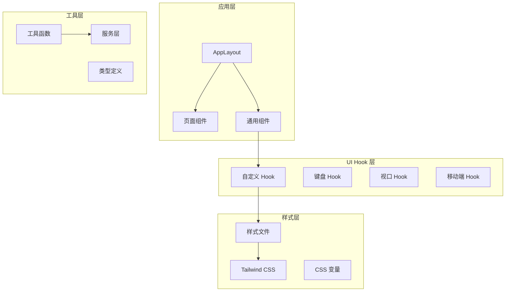
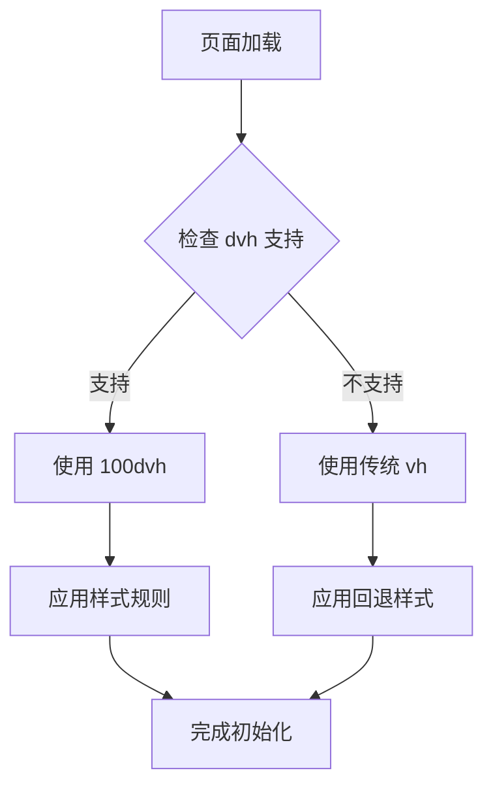
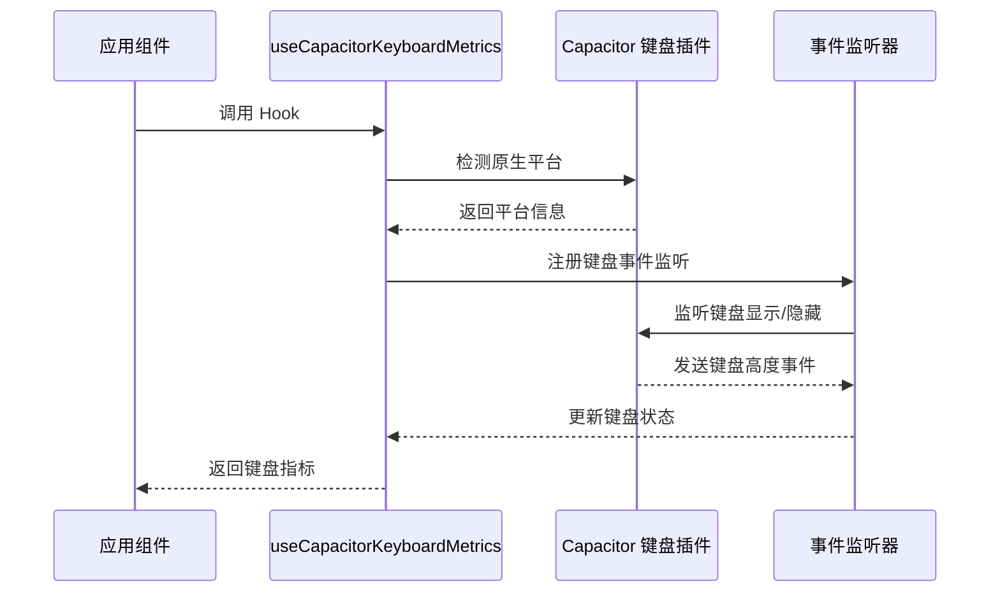
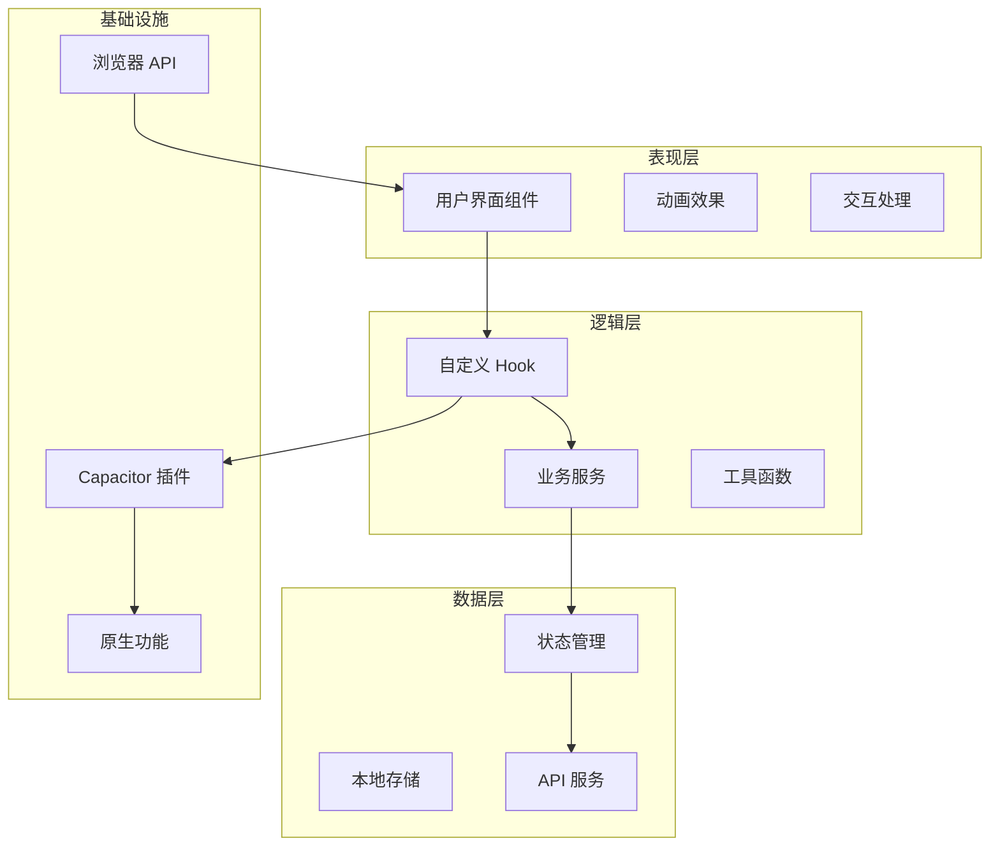
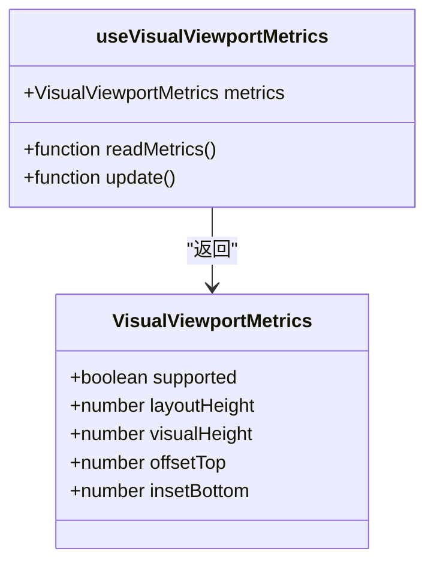
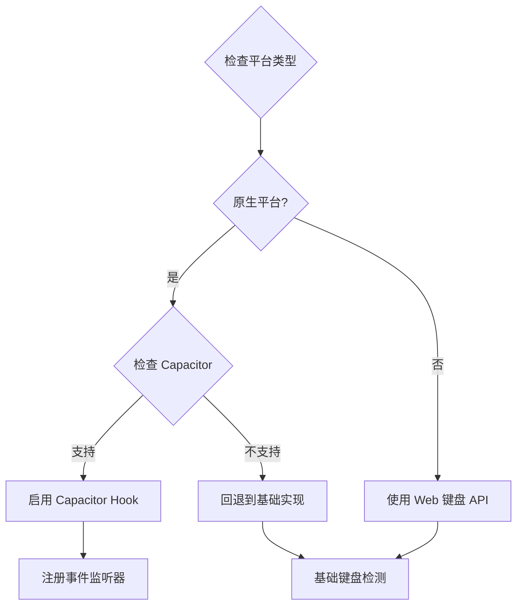
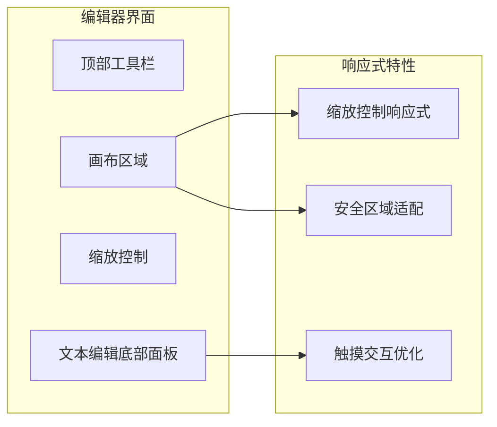
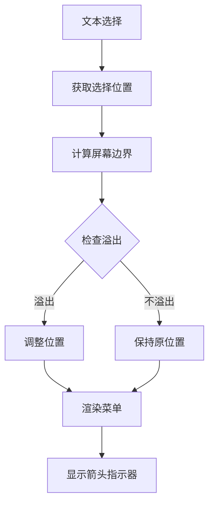
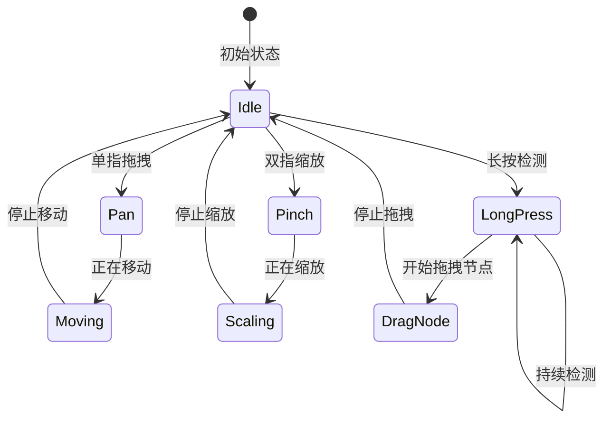

# 响应式设计实现

<cite>
**本文档引用的文件**
- [use-capacitor-keyboard.ts](file://src/app/components/ui/use-capacitor-keyboard.ts)
- [use-visual-viewport.ts](file://src/app/components/ui/use-visual-viewport.ts)
- [use-mobile.ts](file://src/app/components/ui/use-mobile.ts)
- [index.css](file://src/styles/index.css)
- [tailwind.css](file://src/styles/tailwind.css)
- [vite.config.ts](file://vite.config.ts)
- [HiBrain.tsx](file://src/app/pages/HiBrain.tsx)
- [NoteList.tsx](file://src/app/pages/NoteList.tsx)
- [MindmapEditor.tsx](file://src/app/components/MindmapEditor.tsx)
- [BottomNav.tsx](file://src/app/components/BottomNav.tsx)
- [TextSelectionMenu.tsx](file://src/app/components/TextSelectionMenu.tsx)
- [SiChain.tsx](file://src/app/pages/SiChain.tsx)
- [package.json](file://package.json)
</cite>

## 目录
1. [简介](#简介)
2. [项目结构](#项目结构)
3. [核心组件](#核心组件)
4. [架构概览](#架构概览)
5. [详细组件分析](#详细组件分析)
6. [依赖关系分析](#依赖关系分析)
7. [性能考虑](#性能考虑)
8. [故障排除指南](#故障排除指南)
9. [结论](#结论)

## 简介

本项目是一个基于 React 和 Capacitor 的跨平台笔记应用前端，专注于响应式设计和移动端优化。项目实现了完整的移动端适配策略，包括视口配置、屏幕尺寸检测、键盘高度检测、视觉视口管理等核心功能。

项目采用现代化的前端技术栈，结合 Capacitor 插件系统，在 Web 和原生应用之间提供了统一的开发体验。通过精心设计的 Hook 组件和 CSS 实现，确保了在各种设备和屏幕尺寸下的最佳用户体验。

## 项目结构

项目采用模块化的组织方式，主要分为以下几个核心部分：



**图表来源**
- [AppLayout.tsx:1-15](file://src/app/components/AppLayout.tsx#L1-L15)
- [index.css:1-229](file://src/styles/index.css#L1-L229)

**章节来源**
- [AppLayout.tsx:1-15](file://src/app/components/AppLayout.tsx#L1-L15)
- [index.css:1-229](file://src/styles/index.css#L1-L229)

## 核心组件

### 视口适配系统

项目实现了多层次的视口适配机制，确保在不同设备和浏览器环境下的一致表现。

#### 动态视口高度 (dvh) 支持

项目采用了现代的动态视口高度解决方案，通过 CSS @supports 规则检测浏览器支持情况：



**图表来源**
- [index.css:36-47](file://src/styles/index.css#L36-L47)

#### 视觉视口检测

通过 `use-visual-viewport` Hook 实现了对视觉视口变化的实时监控：

**章节来源**
- [use-visual-viewport.ts:1-73](file://src/app/components/ui/use-visual-viewport.ts#L1-L73)
- [index.css:19-47](file://src/styles/index.css#L19-L47)

### 键盘适配系统

项目集成了 Capacitor 键盘插件，提供了精确的键盘高度检测和状态管理：



**图表来源**
- [use-capacitor-keyboard.ts:20-56](file://src/app/components/ui/use-capacitor-keyboard.ts#L20-L56)

**章节来源**
- [use-capacitor-keyboard.ts:1-60](file://src/app/components/ui/use-capacitor-keyboard.ts#L1-L60)

### 移动端检测

通过 `use-is-mobile` Hook 实现了智能的移动端检测机制：

**章节来源**
- [use-mobile.ts:1-22](file://src/app/components/ui/use-mobile.ts#L1-L22)

## 架构概览

项目采用分层架构设计，各层职责明确，耦合度低：



**图表来源**
- [HiBrain.tsx:28-31](file://src/app/pages/HiBrain.tsx#L28-L31)
- [package.json:10-83](file://package.json#L10-L83)

## 详细组件分析

### 视觉视口 Hook 分析

`use-visual-viewport` Hook 提供了对视觉视口变化的全面监控：

#### 核心功能特性

1. **多维度指标收集**：支持布局高度、视觉高度、顶部偏移、底部 inset 等指标
2. **降级兼容性**：在不支持 visualViewport API 的环境中提供回退方案
3. **实时更新机制**：监听窗口 resize 和滚动事件，确保数据准确性

#### 数据结构设计



**图表来源**
- [use-visual-viewport.ts:3-38](file://src/app/components/ui/use-visual-viewport.ts#L3-L38)

**章节来源**
- [use-visual-viewport.ts:1-73](file://src/app/components/ui/use-visual-viewport.ts#L1-L73)

### 键盘 Hook 分析

`use-capacitor-keyboard` Hook 实现了跨平台的键盘适配：

#### 事件处理机制

Hook 监听四个关键事件：
- `keyboardWillShow`：键盘即将显示
- `keyboardDidShow`：键盘已显示
- `keyboardWillHide`：键盘即将隐藏
- `keyboardDidHide`：键盘已隐藏

#### 平台兼容性



**图表来源**
- [use-capacitor-keyboard.ts:12-56](file://src/app/components/ui/use-capacitor-keyboard.ts#L12-L56)

**章节来源**
- [use-capacitor-keyboard.ts:1-60](file://src/app/components/ui/use-capacitor-keyboard.ts#L1-L60)

### 移动端 Hook 分析

`use-is-mobile` Hook 提供了智能的移动端检测能力：

#### 断点策略

项目采用 768px 作为移动端断点，这是基于现代移动设备屏幕尺寸的合理选择。

#### 响应式检测

Hook 使用 `window.matchMedia` API 进行媒体查询检测，确保在断点变化时能够及时响应。

**章节来源**
- [use-mobile.ts:1-22](file://src/app/components/ui/use-mobile.ts#L1-L22)

### 页面组件响应式设计

#### 主页 (NoteList) 响应式布局

主页实现了复杂的响应式布局，包括：

1. **卡片网格系统**：使用 `react-responsive-masonry` 实现自适应网格
2. **安全区域适配**：通过 `env(safe-area-inset-*)` CSS 变量适配刘海屏和底部安全区域
3. **动态高度计算**：结合视觉视口 Hook 实现精确的高度控制

#### 思维导图编辑器响应式设计

MindmapEditor 实现了完整的全屏编辑体验：



**图表来源**
- [MindmapEditor.tsx:238-299](file://src/app/components/MindmapEditor.tsx#L238-L299)

**章节来源**
- [NoteList.tsx:609-641](file://src/app/pages/NoteList.tsx#L609-L641)
- [MindmapEditor.tsx:1-390](file://src/app/components/MindmapEditor.tsx#L1-L390)

### 导航组件响应式设计

底部导航组件实现了完整的移动端导航体验：

#### 触摸优化

1. **触摸反馈**：使用 `whileTap` 动画提供即时反馈
2. **安全区域适配**：通过 `env(safe-area-inset-bottom)` 适配 iPhone 底部安全区域
3. **动态布局**：根据功能开关动态调整导航项布局

#### 录音功能集成

导航组件集成了语音录制功能，通过 Capacitor 插件实现跨平台录音能力。

**章节来源**
- [BottomNav.tsx:1-387](file://src/app/components/BottomNav.tsx#L1-L387)

### 文本选择菜单响应式设计

TextSelectionMenu 组件提供了智能的文本选择上下文菜单：

#### 溢出保护机制

组件实现了智能的位置计算，确保菜单不会超出屏幕边界：



**图表来源**
- [TextSelectionMenu.tsx:64-76](file://src/app/components/TextSelectionMenu.tsx#L64-L76)

**章节来源**
- [TextSelectionMenu.tsx:1-277](file://src/app/components/TextSelectionMenu.tsx#L1-L277)

### 触摸交互优化

项目在多个组件中实现了高级的触摸交互优化：

#### 思链页面手势支持

SiChain 页面实现了复杂的手势识别系统：

1. **多点触控支持**：支持双指缩放和拖拽
2. **长按检测**：实现节点长按拖拽功能
3. **手势状态管理**：通过状态机管理不同的手势模式

#### 触摸行为优化



**图表来源**
- [SiChain.tsx:1940-1992](file://src/app/pages/SiChain.tsx#L1940-L1992)

**章节来源**
- [SiChain.tsx:1940-2181](file://src/app/pages/SiChain.tsx#L1940-L2181)

## 依赖关系分析

项目的技术栈和依赖关系如下：

```mermaid
graph TB
subgraph "核心框架"
React[React 18.3.1]
Vite[Vite 6.3.5]
Capacitor[Capacitor 6.2.1]
end
subgraph "UI 框架"
Motion[Motion 12.23.24]
Radix[Radix UI]
Tailwind[Tailwind CSS 4.1.12]
end
subgraph "第三方库"
Emotion[@emotion/react]
Material[@mui/material]
Recharts[Recharts 2.15.2]
Lucide[Lucide React]
end
subgraph "工具库"
Axios[Axios]
DateFns[date-fns]
clsx[clsx]
tailwind-merge[tailwind-merge]
end
React --> Motion
React --> Emotion
Vite --> Capacitor
Capacitor --> Keyboard[Capacitor Keyboard]
Tailwind --> Plugins[Tailwind 插件]
```

**图表来源**
- [package.json:10-83](file://package.json#L10-L83)
- [vite.config.ts:1-44](file://vite.config.ts#L1-L44)

**章节来源**
- [package.json:1-113](file://package.json#L1-L113)
- [vite.config.ts:1-44](file://vite.config.ts#L1-L44)

## 性能考虑

### 优化策略

1. **懒加载和代码分割**：通过 Vite 的原生支持实现按需加载
2. **动画性能优化**：使用 Motion 库的硬件加速动画
3. **内存管理**：Hook 组件正确清理事件监听器和定时器
4. **渲染优化**：使用 React.memo 和 useMemo 优化重渲染

### 性能监控

项目集成了多种性能监控机制：
- 视觉视口变化的节流处理
- 键盘事件的防抖处理
- 组件卸载时的资源清理

## 故障排除指南

### 常见问题及解决方案

#### 视口高度异常

**问题描述**：在某些 Android 设备上出现视口高度计算错误

**解决方案**：
1. 检查 CSS 中的 `@supports (height: 100dvh)` 规则
2. 确认 `use-visual-viewport` Hook 的降级逻辑正常工作
3. 验证 `env(safe-area-inset-*)` CSS 变量的兼容性

#### 键盘适配失效

**问题描述**：键盘高度检测在某些平台上不工作

**解决方案**：
1. 确认 Capacitor 键盘插件已正确安装和配置
2. 检查 `use-capacitor-keyboard` Hook 的平台检测逻辑
3. 验证事件监听器的注册和清理机制

#### 触摸交互问题

**问题描述**：移动端触摸事件响应异常

**解决方案**：
1. 检查 `touch-action` CSS 属性设置
2. 验证手势识别算法的参数配置
3. 确认事件冒泡和阻止机制的正确使用

**章节来源**
- [use-visual-viewport.ts:11-38](file://src/app/components/ui/use-visual-viewport.ts#L11-L38)
- [use-capacitor-keyboard.ts:40-56](file://src/app/components/ui/use-capacitor-keyboard.ts#L40-L56)

## 结论

本项目成功实现了全面的响应式设计解决方案，涵盖了现代移动应用开发的所有关键方面：

### 主要成就

1. **完整的移动端适配**：从基础的视口配置到复杂的触摸交互
2. **跨平台兼容性**：通过 Capacitor 插件系统实现 Web 和原生应用的一致体验
3. **性能优化**：采用多种优化策略确保在低端设备上的流畅运行
4. **可维护性**：模块化的架构设计便于后续的功能扩展和维护

### 技术亮点

- **创新的视口管理**：结合 CSS @supports 和 JavaScript 实现最佳的视口适配
- **精确的键盘检测**：通过 Capacitor 插件实现跨平台的键盘高度检测
- **智能的触摸交互**：支持多点触控、手势识别和长按检测
- **优雅的降级处理**：在不支持某些特性的环境中提供合理的回退方案

该项目为类似的跨平台笔记应用开发提供了优秀的参考模板，展示了如何在保证功能完整性的同时实现卓越的用户体验。