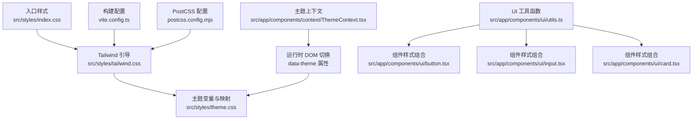
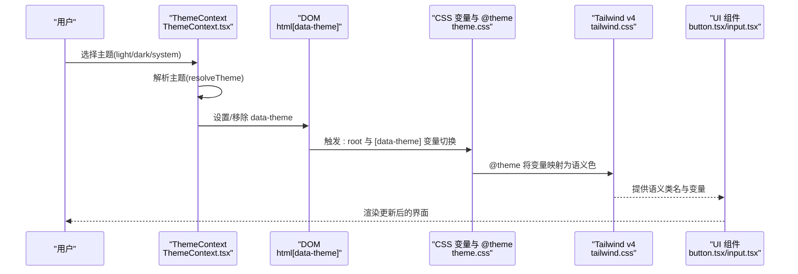
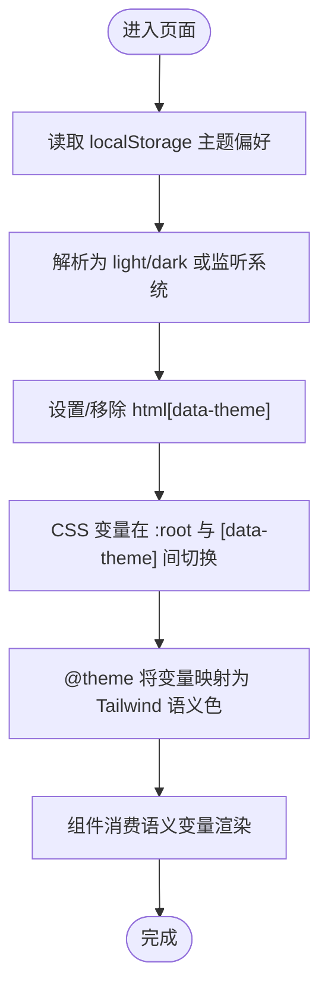
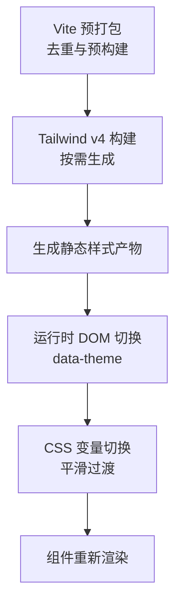
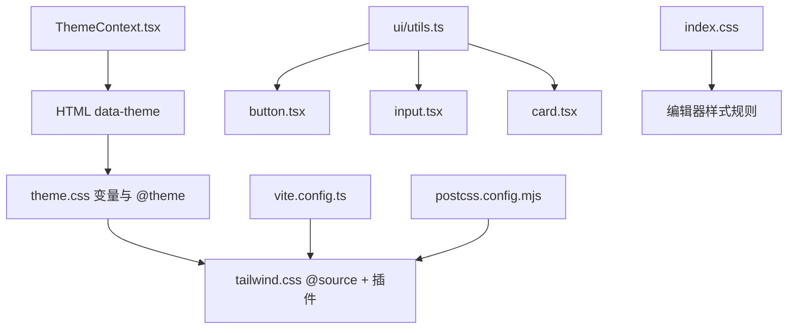

# 样式管理策略

<cite>
**本文引用的文件**
- [src/styles/index.css](file://src/styles/index.css)
- [src/styles/tailwind.css](file://src/styles/tailwind.css)
- [src/styles/theme.css](file://src/styles/theme.css)
- [src/app/components/context/ThemeContext.tsx](file://src/app/components/context/ThemeContext.tsx)
- [src/app/components/ui/utils.ts](file://src/app/components/ui/utils.ts)
- [src/app/components/ui/button.tsx](file://src/app/components/ui/button.tsx)
- [src/app/components/ui/input.tsx](file://src/app/components/ui/input.tsx)
- [src/app/components/ui/card.tsx](file://src/app/components/ui/card.tsx)
- [src/app/components/ui/use-mobile.ts](file://src/app/components/ui/use-mobile.ts)
- [src/app/components/ui/use-visual-viewport.ts](file://src/app/components/ui/use-visual-viewport.ts)
- [postcss.config.mjs](file://postcss.config.mjs)
- [vite.config.ts](file://vite.config.ts)
</cite>

## 目录
1. [简介](#简介)
2. [项目结构](#项目结构)
3. [核心组件](#核心组件)
4. [架构总览](#架构总览)
5. [详细组件分析](#详细组件分析)
6. [依赖关系分析](#依赖关系分析)
7. [性能考量](#性能考量)
8. [故障排除指南](#故障排除指南)
9. [结论](#结论)
10. [附录](#附录)

## 简介
本文件系统性阐述本项目的样式管理策略，覆盖以下要点：
- CSS 自定义属性与主题系统：通过 CSS 变量与 Tailwind CSS v4 的 @theme 机制，构建可动态切换的主题体系。
- Tailwind CSS 定制与主题化：基于 @source 扫描源码、插件化扩展与颜色语义映射，实现组件级样式的一致性与可维护性。
- 样式缓存与性能优化：构建时产物与运行时 DOM 切换相结合，减少重排与闪烁，提升交互体验。
- 样式作用域与命名约定：以 BEM 风格与数据槽（data-slot）命名法结合，确保类名清晰、作用域可控。
- 调试与排障：利用浏览器开发者工具定位样式冲突、检查变量覆盖与媒体查询生效情况。
- 响应式设计与移动端适配：基于断点与视口 API 的组合策略，兼顾桌面与移动场景。

## 项目结构
样式相关文件组织遵循“入口聚合 + 主题定义 + 组件样式”三层结构：
- 入口层：index.css 聚合字体、Tailwind 与主题样式，补充编辑器与通用工具样式。
- 主题层：theme.css 定义 CSS 变量与 @theme 映射，提供明暗两套语义色值与过渡动画。
- 构建层：tailwind.css 使用 @source 扫描源码，启用 typography 与动画插件；postcss.config.mjs 保持最小化配置；vite.config.ts 注入 Tailwind 插件并进行依赖去重与预打包。



图表来源
- [src/styles/index.css:1-229](file://src/styles/index.css#L1-L229)
- [src/styles/tailwind.css:1-7](file://src/styles/tailwind.css#L1-L7)
- [src/styles/theme.css:1-280](file://src/styles/theme.css#L1-L280)
- [src/app/components/context/ThemeContext.tsx:1-110](file://src/app/components/context/ThemeContext.tsx#L1-L110)
- [src/app/components/ui/utils.ts:1-7](file://src/app/components/ui/utils.ts#L1-L7)
- [src/app/components/ui/button.tsx:1-59](file://src/app/components/ui/button.tsx#L1-L59)
- [src/app/components/ui/input.tsx:1-22](file://src/app/components/ui/input.tsx#L1-L22)
- [src/app/components/ui/card.tsx:1-93](file://src/app/components/ui/card.tsx#L1-L93)
- [vite.config.ts:1-44](file://vite.config.ts#L1-L44)
- [postcss.config.mjs:1-16](file://postcss.config.mjs#L1-L16)

章节来源
- [src/styles/index.css:1-229](file://src/styles/index.css#L1-L229)
- [src/styles/tailwind.css:1-7](file://src/styles/tailwind.css#L1-L7)
- [src/styles/theme.css:1-280](file://src/styles/theme.css#L1-L280)
- [vite.config.ts:1-44](file://vite.config.ts#L1-L44)
- [postcss.config.mjs:1-16](file://postcss.config.mjs#L1-L16)

## 核心组件
- 主题上下文与运行时切换：通过 ThemeContext 提供主题状态与切换能力，持久化到 localStorage，并在 DOM 上设置 data-theme 属性，驱动 CSS 变量与 @custom-variant 生效。
- Tailwind v4 主题映射：theme.css 中的 @theme 将 CSS 变量映射为 Tailwind 语义色，使组件直接消费语义变量而非硬编码色值。
- 组件样式组合：ui/utils.ts 的 cn 函数整合 clsx 与 tailwind-merge，避免重复类名与冲突；各 UI 组件通过 cn 统一合并类名，保证样式一致性。
- 编辑器与通用样式：index.css 对富文本编辑器、滚动条、视口高度等进行统一处理，确保跨平台一致体验。

章节来源
- [src/app/components/context/ThemeContext.tsx:1-110](file://src/app/components/context/ThemeContext.tsx#L1-L110)
- [src/styles/theme.css:183-222](file://src/styles/theme.css#L183-L222)
- [src/app/components/ui/utils.ts:1-7](file://src/app/components/ui/utils.ts#L1-L7)
- [src/styles/index.css:1-229](file://src/styles/index.css#L1-L229)

## 架构总览
整体架构围绕“变量定义—映射—运行时切换—组件消费”的闭环展开：



图表来源
- [src/app/components/context/ThemeContext.tsx:63-105](file://src/app/components/context/ThemeContext.tsx#L63-L105)
- [src/styles/theme.css:1-280](file://src/styles/theme.css#L1-L280)
- [src/styles/tailwind.css:1-7](file://src/styles/tailwind.css#L1-L7)
- [src/app/components/ui/button.tsx:1-59](file://src/app/components/ui/button.tsx#L1-L59)

## 详细组件分析

### 主题系统与 CSS 变量
- 变量定义：:root 定义基础变量，包含背景、前景、卡片、弹出层、主次色、输入、开关、字体权重、环形光晕、图表色阶与圆角半径等。
- 暗色主题覆盖：[data-theme="dark"] 与 .dark 选择器提供暗色语义色值，确保对比度与可读性。
- @theme 映射：将 CSS 变量映射为 Tailwind 语义色与圆角变量，使组件无需关心具体色值。
- 动态切换：ThemeContext 在 DOM 上设置 data-theme 属性，配合 CSS 变量与 @custom-variant 实现平滑切换。



图表来源
- [src/app/components/context/ThemeContext.tsx:63-105](file://src/app/components/context/ThemeContext.tsx#L63-L105)
- [src/styles/theme.css:1-280](file://src/styles/theme.css#L1-L280)

章节来源
- [src/styles/theme.css:1-280](file://src/styles/theme.css#L1-L280)
- [src/app/components/context/ThemeContext.tsx:1-110](file://src/app/components/context/ThemeContext.tsx#L1-L110)

### Tailwind CSS 定制与主题化
- 源码扫描：tailwind.css 使用 @source 指向 TSX 源码目录，确保仅生成实际使用的样式，减少体积。
- 插件扩展：启用 typography 插件与动画插件，统一排版与动效风格。
- 语义映射：@theme 将 CSS 变量映射为 Tailwind 语义色，组件通过语义类名消费变量，避免硬编码色值。
- 组件样式：button、input、card 等组件均通过 cn 合并类名，优先使用语义类名与变量，保证一致性。

```mermaid
classDiagram
class ThemeCSS {
"+CSS 变量"
"+[data-theme] 覆盖"
"+@theme 映射"
}
class TailwindCSS {
"+@source 扫描"
"+插件 : typography, animate"
}
class UtilsCN {
"+cn(...inputs)"
}
class Button {
"+buttonVariants(variants,size)"
"+cn(...) 合并"
}
class Input {
"+语义类名 + 变量"
"+cn(...) 合并"
}
class Card {
"+语义类名 + 变量"
"+cn(...) 合并"
}
ThemeCSS --> TailwindCSS : "提供语义色"
UtilsCN --> Button : "合并类名"
UtilsCN --> Input : "合并类名"
UtilsCN --> Card : "合并类名"
TailwindCSS --> Button : "语义类名"
TailwindCSS --> Input : "语义类名"
TailwindCSS --> Card : "语义类名"
```

图表来源
- [src/styles/tailwind.css:1-7](file://src/styles/tailwind.css#L1-L7)
- [src/styles/theme.css:183-222](file://src/styles/theme.css#L183-L222)
- [src/app/components/ui/utils.ts:1-7](file://src/app/components/ui/utils.ts#L1-L7)
- [src/app/components/ui/button.tsx:1-59](file://src/app/components/ui/button.tsx#L1-L59)
- [src/app/components/ui/input.tsx:1-22](file://src/app/components/ui/input.tsx#L1-L22)
- [src/app/components/ui/card.tsx:1-93](file://src/app/components/ui/card.tsx#L1-L93)

章节来源
- [src/styles/tailwind.css:1-7](file://src/styles/tailwind.css#L1-L7)
- [src/app/components/ui/utils.ts:1-7](file://src/app/components/ui/utils.ts#L1-L7)
- [src/app/components/ui/button.tsx:1-59](file://src/app/components/ui/button.tsx#L1-L59)
- [src/app/components/ui/input.tsx:1-22](file://src/app/components/ui/input.tsx#L1-L22)
- [src/app/components/ui/card.tsx:1-93](file://src/app/components/ui/card.tsx#L1-L93)

### 样式缓存与性能优化
- 构建期优化：vite.config.ts 预打包核心依赖，减少重复包与 Hook 失效风险；Tailwind v4 仅扫描实际使用源码，降低样式体积。
- 运行时优化：ThemeContext 在 DOM 上设置 data-theme，CSS 变量切换具备 0.35 秒过渡，避免闪烁；index.css 中对滚动条与视口高度的处理减少布局抖动。
- 类名合并：ui/utils.ts 的 cn 函数使用 tailwind-merge 避免类名冲突，减少无效样式应用。



图表来源
- [vite.config.ts:27-41](file://vite.config.ts#L27-L41)
- [src/styles/tailwind.css:1-7](file://src/styles/tailwind.css#L1-L7)
- [src/app/components/context/ThemeContext.tsx:50-61](file://src/app/components/context/ThemeContext.tsx#L50-L61)
- [src/styles/index.css:19-47](file://src/styles/index.css#L19-L47)

章节来源
- [vite.config.ts:1-44](file://vite.config.ts#L1-L44)
- [src/app/components/context/ThemeContext.tsx:50-61](file://src/app/components/context/ThemeContext.tsx#L50-L61)
- [src/styles/index.css:19-47](file://src/styles/index.css#L19-L47)

### 样式作用域与命名约定
- 数据槽（data-slot）：组件根节点统一添加 data-slot 属性，便于样式作用域与可测试性。
- BEM 风格：组件内部结构采用 BEM 风格命名，如 card-header、card-title 等，确保层级清晰。
- 语义化类名：优先使用 Tailwind 语义类名与 CSS 变量，避免硬编码尺寸与颜色，提升可维护性。

章节来源
- [src/app/components/ui/button.tsx:49-56](file://src/app/components/ui/button.tsx#L49-L56)
- [src/app/components/ui/input.tsx:5-18](file://src/app/components/ui/input.tsx#L5-L18)
- [src/app/components/ui/card.tsx:5-82](file://src/app/components/ui/card.tsx#L5-L82)

### 响应式设计与移动端适配
- 断点与工具：useIsMobile 基于媒体查询判断移动端，便于条件渲染与布局调整。
- 视口适配：index.css 使用 dvh 与 -webkit-fill-available 适配动态视口，减少地址栏遮挡导致的留白；use-visual-viewport.ts 提供视口变化监听，辅助全屏与键盘弹起场景下的布局修正。
- 移动端样式：第三方库（如通知组件）自带移动端媒体查询，确保在小屏设备上的显示与交互体验。

章节来源
- [src/app/components/ui/use-mobile.ts:1-22](file://src/app/components/ui/use-mobile.ts#L1-L22)
- [src/styles/index.css:19-47](file://src/styles/index.css#L19-L47)
- [src/app/components/ui/use-visual-viewport.ts:1-73](file://src/app/components/ui/use-visual-viewport.ts#L1-L73)

## 依赖关系分析
- 主题依赖：ThemeContext 依赖 localStorage 与 window.matchMedia；DOM 切换依赖 HTML 元素；CSS 变量与 @theme 依赖 Tailwind v4。
- 组件依赖：UI 组件依赖 cn 工具函数与 Tailwind 语义类名；编辑器样式依赖 index.css 的特定规则。
- 构建依赖：Tailwind v4 依赖 @source 与插件；Vite 依赖去重与预打包配置。



图表来源
- [src/app/components/context/ThemeContext.tsx:1-110](file://src/app/components/context/ThemeContext.tsx#L1-L110)
- [src/styles/theme.css:1-280](file://src/styles/theme.css#L1-L280)
- [src/styles/tailwind.css:1-7](file://src/styles/tailwind.css#L1-L7)
- [src/app/components/ui/utils.ts:1-7](file://src/app/components/ui/utils.ts#L1-L7)
- [src/app/components/ui/button.tsx:1-59](file://src/app/components/ui/button.tsx#L1-L59)
- [src/app/components/ui/input.tsx:1-22](file://src/app/components/ui/input.tsx#L1-L22)
- [src/app/components/ui/card.tsx:1-93](file://src/app/components/ui/card.tsx#L1-L93)
- [src/styles/index.css:1-229](file://src/styles/index.css#L1-L229)
- [vite.config.ts:1-44](file://vite.config.ts#L1-L44)
- [postcss.config.mjs:1-16](file://postcss.config.mjs#L1-L16)

章节来源
- [src/app/components/context/ThemeContext.tsx:1-110](file://src/app/components/context/ThemeContext.tsx#L1-L110)
- [src/styles/theme.css:1-280](file://src/styles/theme.css#L1-L280)
- [src/styles/tailwind.css:1-7](file://src/styles/tailwind.css#L1-L7)
- [src/app/components/ui/utils.ts:1-7](file://src/app/components/ui/utils.ts#L1-L7)
- [src/app/components/ui/button.tsx:1-59](file://src/app/components/ui/button.tsx#L1-L59)
- [src/app/components/ui/input.tsx:1-22](file://src/app/components/ui/input.tsx#L1-L22)
- [src/app/components/ui/card.tsx:1-93](file://src/app/components/ui/card.tsx#L1-L93)
- [src/styles/index.css:1-229](file://src/styles/index.css#L1-L229)
- [vite.config.ts:1-44](file://vite.config.ts#L1-L44)
- [postcss.config.mjs:1-16](file://postcss.config.mjs#L1-L16)

## 性能考量
- 构建体积：Tailwind v4 仅扫描实际使用源码，结合去重与预打包，显著减少冗余样式与重复依赖。
- 运行时切换：CSS 变量切换具备过渡动画，避免频繁重排；index.css 对滚动条与视口的处理减少布局抖动。
- 类名合并：tailwind-merge 避免重复类名，降低样式冲突与计算成本。
- 建议：对大型组件树进一步拆分样式模块，按需加载；对高频交互组件使用 CSS 变量而非内联样式。

## 故障排除指南
- 主题不生效
  - 检查是否正确设置/移除 html[data-theme] 属性。
  - 确认 [data-theme] 与 :root 的变量覆盖顺序与优先级。
  - 查看浏览器开发者工具的 Elements 面板，确认变量值是否被覆盖。
- 样式冲突
  - 使用 cn 合并类名，避免重复设置相同属性。
  - 检查 Tailwind 生成顺序与自定义样式优先级。
- 视口问题
  - 确认 index.css 中 dvh 与 -webkit-fill-available 的支持情况。
  - 使用 use-visual-viewport.ts 获取视口变化，排查键盘弹起或旋转导致的布局异常。
- 构建问题
  - 确认 tailwind.css 的 @source 路径与插件已正确加载。
  - 检查 vite.config.ts 的去重与预打包配置是否影响组件渲染。

章节来源
- [src/app/components/context/ThemeContext.tsx:50-61](file://src/app/components/context/ThemeContext.tsx#L50-L61)
- [src/styles/theme.css:1-280](file://src/styles/theme.css#L1-L280)
- [src/styles/index.css:19-47](file://src/styles/index.css#L19-L47)
- [src/app/components/ui/use-visual-viewport.ts:40-72](file://src/app/components/ui/use-visual-viewport.ts#L40-L72)
- [vite.config.ts:27-41](file://vite.config.ts#L27-L41)
- [src/styles/tailwind.css:1-7](file://src/styles/tailwind.css#L1-L7)

## 结论
本项目通过 CSS 变量与 Tailwind CSS v4 的 @theme 机制，实现了可动态切换且语义化的主题系统；结合 cn 工具函数与数据槽命名约定，确保组件样式的一致性与可维护性；在构建与运行时层面采取多项优化策略，兼顾性能与体验。响应式与移动端适配通过断点与视口 API 的组合得到完善支持。建议持续关注 Tailwind v4 的新特性与生态插件，进一步精简样式体积与提升开发效率。

## 附录
- 关键路径参考
  - 主题上下文与切换：[ThemeContext.tsx:1-110](file://src/app/components/context/ThemeContext.tsx#L1-L110)
  - 主题变量与映射：[theme.css:1-280](file://src/styles/theme.css#L1-L280)
  - Tailwind 引导与插件：[tailwind.css:1-7](file://src/styles/tailwind.css#L1-L7)
  - 类名合并工具：[utils.ts:1-7](file://src/app/components/ui/utils.ts#L1-L7)
  - 组件示例：[button.tsx:1-59](file://src/app/components/ui/button.tsx#L1-L59)、[input.tsx:1-22](file://src/app/components/ui/input.tsx#L1-L22)、[card.tsx:1-93](file://src/app/components/ui/card.tsx#L1-L93)
  - 视口与移动端：[use-mobile.ts:1-22](file://src/app/components/ui/use-mobile.ts#L1-L22)、[use-visual-viewport.ts:1-73](file://src/app/components/ui/use-visual-viewport.ts#L1-L73)
  - 构建配置：[vite.config.ts:1-44](file://vite.config.ts#L1-L44)、[postcss.config.mjs:1-16](file://postcss.config.mjs#L1-L16)