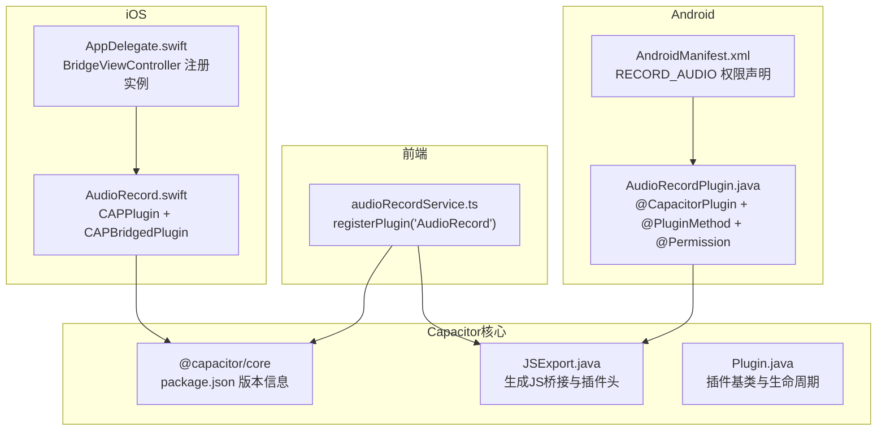
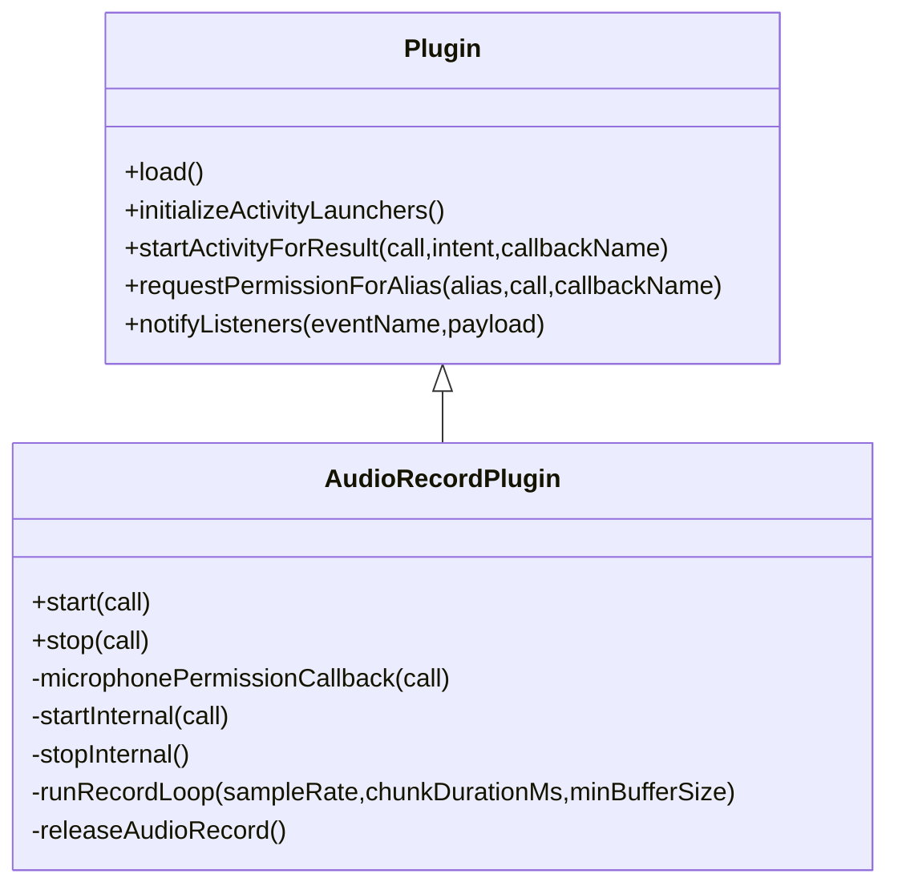
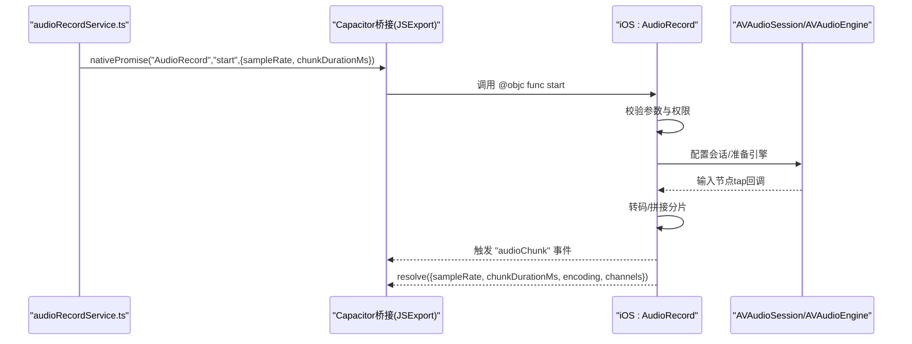
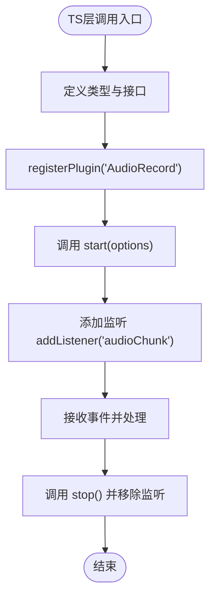
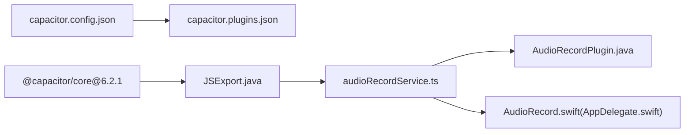

# Capacitor插件系统架构

<cite>
**本文档引用的文件**
- [capacitor.config.json](file://capacitor.config.json)
- [capacitor.plugins.json](file://android/app/src/main/assets/capacitor.plugins.json)
- [AudioRecordPlugin.java](file://android/app/src/main/java/com/shisi/app/v2/plugins/AudioRecordPlugin.java)
- [audioRecordService.ts](file://src/app/services/audioRecordService.ts)
- [AppDelegate.swift](file://ios/App/App/AppDelegate.swift)
- [JSExport.java](file://node_modules/@capacitor/android/capacitor/src/main/java/com/getcapacitor/JSExport.java)
- [Plugin.java](file://node_modules/@capacitor/android/capacitor/src/main/java/com/getcapacitor/Plugin.java)
- [package.json](file://node_modules/@capacitor/core/package.json)
- [AndroidManifest.xml](file://android/app/src/main/AndroidManifest.xml)
</cite>

## 目录
1. [引言](#引言)
2. [项目结构](#项目结构)
3. [核心组件](#核心组件)
4. [架构总览](#架构总览)
5. [详细组件分析](#详细组件分析)
6. [依赖分析](#依赖分析)
7. [性能考虑](#性能考虑)
8. [故障排除指南](#故障排除指南)
9. [结论](#结论)
10. [附录](#附录)

## 引言
本文件面向Capacitor跨平台应用的插件系统，围绕JS与原生代码之间的通信机制、插件注册与生命周期管理、注解系统（@CapacitorPlugin、@PluginMethod、@Permission等）、插件加载流程、权限管理与事件传递、配置选项与参数校验、错误处理策略、最佳实践与性能优化、跨平台兼容性与版本管理进行系统化技术说明。文中所有分析均基于仓库中实际存在的配置文件、服务层封装与原生插件实现。

## 项目结构
本项目采用Capacitor标准目录组织，前端通过registerPlugin在TS层暴露插件接口，Android与iOS分别实现对应原生插件，并通过桥接层完成JS与原生的双向调用。



**图表来源**
- [audioRecordService.ts:1-35](file://src/app/services/audioRecordService.ts#L1-L35)
- [AudioRecordPlugin.java:1-230](file://android/app/src/main/java/com/shisi/app/v2/plugins/AudioRecordPlugin.java#L1-L230)
- [AppDelegate.swift:52-56](file://ios/App/App/AppDelegate.swift#L52-L56)
- [package.json:1-62](file://node_modules/@capacitor/core/package.json#L1-L62)
- [JSExport.java:1-194](file://node_modules/@capacitor/android/capacitor/src/main/java/com/getcapacitor/JSExport.java#L1-L194)
- [Plugin.java:1-200](file://node_modules/@capacitor/android/capacitor/src/main/java/com/getcapacitor/Plugin.java#L1-L200)
- [AndroidManifest.xml:1-39](file://android/app/src/main/AndroidManifest.xml#L1-L39)

**章节来源**
- [capacitor.config.json:1-31](file://capacitor.config.json#L1-L31)
- [capacitor.plugins.json:1-11](file://android/app/src/main/assets/capacitor.plugins.json#L1-L11)
- [audioRecordService.ts:1-35](file://src/app/services/audioRecordService.ts#L1-L35)
- [AudioRecordPlugin.java:1-230](file://android/app/src/main/java/com/shisi/app/v2/plugins/AudioRecordPlugin.java#L1-L230)
- [AppDelegate.swift:52-56](file://ios/App/App/AppDelegate.swift#L52-L56)
- [package.json:1-62](file://node_modules/@capacitor/core/package.json#L1-L62)
- [JSExport.java:1-194](file://node_modules/@capacitor/android/capacitor/src/main/java/com/getcapacitor/JSExport.java#L1-L194)
- [Plugin.java:1-200](file://node_modules/@capacitor/android/capacitor/src/main/java/com/getcapacitor/Plugin.java#L1-L200)
- [AndroidManifest.xml:1-39](file://android/app/src/main/AndroidManifest.xml#L1-L39)

## 核心组件
- 插件接口定义与注册
  - 前端通过registerPlugin导出类型安全的插件接口，统一暴露方法与事件监听能力。
  - 参考路径：[audioRecordService.ts:26-35](file://src/app/services/audioRecordService.ts#L26-L35)

- Android原生插件
  - 使用@CapacitorPlugin标注插件元数据与权限别名；使用@PluginMethod标注可从JS调用的方法；使用@Permission声明所需权限。
  - 参考路径：[@CapacitorPlugin/@PluginMethod/@Permission:19-22](file://android/app/src/main/java/com/shisi/app/v2/plugins/AudioRecordPlugin.java#L19-L22)

- iOS原生插件
  - 在BridgeViewController中通过registerPluginInstance注册插件实例；Swift侧实现CAPPlugin与CAPBridgedPlugin协议，声明方法返回类型。
  - 参考路径：[BridgeViewController注册:52-56](file://ios/App/App/AppDelegate.swift#L52-L56)，[Swift插件声明:58-66](file://ios/App/App/AppDelegate.swift#L58-L66)

- 桥接与JS导出
  - Capacitor在Android侧通过JSExport动态生成JS桥接代码与插件头，使JS能以Promise或回调形式调用原生方法。
  - 参考路径：[JSExport生成逻辑:44-77](file://node_modules/@capacitor/android/capacitor/src/main/java/com/getcapacitor/JSExport.java#L44-L77)

- 插件基类与生命周期
  - Plugin基类提供权限请求、活动结果回调、事件监听存储与保留、生命周期钩子等通用能力。
  - 参考路径：[Plugin基类:44-96](file://node_modules/@capacitor/android/capacitor/src/main/java/com/getcapacitor/Plugin.java#L44-L96)

**章节来源**
- [audioRecordService.ts:26-35](file://src/app/services/audioRecordService.ts#L26-L35)
- [AudioRecordPlugin.java:19-22](file://android/app/src/main/java/com/shisi/app/v2/plugins/AudioRecordPlugin.java#L19-L22)
- [AppDelegate.swift:52-66](file://ios/App/App/AppDelegate.swift#L52-L66)
- [JSExport.java:44-77](file://node_modules/@capacitor/android/capacitor/src/main/java/com/getcapacitor/JSExport.java#L44-L77)
- [Plugin.java:44-96](file://node_modules/@capacitor/android/capacitor/src/main/java/com/getcapacitor/Plugin.java#L44-L96)

## 架构总览
Capacitor插件系统通过“前端接口 + 原生实现 + 桥接导出”的三层协作实现跨平台能力。前端以Promise/回调形式发起调用，桥接层将调用序列化为跨语言消息，原生插件执行业务逻辑并返回结果或触发事件。

```mermaid
sequenceDiagram
participant UI as "前端页面"
participant TS as "audioRecordService.ts"
participant BR as "Capacitor桥接(JSExport)"
participant AND as "Android : AudioRecordPlugin"
participant IOS as "iOS : AudioRecord"
UI->>TS : 调用 AudioRecord.start({sampleRate, chunkDurationMs})
TS->>BR : nativePromise("AudioRecord","start",{...})
BR->>AND : 转发调用(PluginCall)
AND->>AND : 校验权限/参数
AND->>AND : 启动录音线程/引擎
AND-->>BR : resolve({sampleRate, chunkDurationMs, encoding, channels})
BR-->>TS : 返回Promise结果
AND-->>BR : 触发事件 "audioChunk"
BR-->>TS : 通知监听器
```

**图表来源**
- [audioRecordService.ts:27-33](file://src/app/services/audioRecordService.ts#L27-L33)
- [JSExport.java:167-170](file://node_modules/@capacitor/android/capacitor/src/main/java/com/getcapacitor/JSExport.java#L167-L170)
- [AudioRecordPlugin.java:39-136](file://android/app/src/main/java/com/shisi/app/v2/plugins/AudioRecordPlugin.java#L39-L136)
- [AppDelegate.swift:80-155](file://ios/App/App/AppDelegate.swift#L80-L155)

## 详细组件分析

### 组件A：音频录制插件（Android）
- 注解与权限
  - @CapacitorPlugin定义插件名称与权限别名；@Permission声明RECORD_AUDIO权限；@PermissionCallback处理授权回调。
  - 参考路径：[@CapacitorPlugin/@Permission/@PermissionCallback:19-61](file://android/app/src/main/java/com/shisi/app/v2/plugins/AudioRecordPlugin.java#L19-L61)

- 方法与事件
  - start/stop方法通过@PluginMethod暴露；内部通过bridge向WebView.post触发事件"audioChunk"。
  - 参考路径：[start/stop与事件触发:39-187](file://android/app/src/main/java/com/shisi/app/v2/plugins/AudioRecordPlugin.java#L39-L187)

- 参数校验与错误处理
  - 对采样率、分片时长、缓冲区大小进行边界检查；对AudioRecord初始化与状态进行校验；异常时reject并释放资源。
  - 参考路径：[参数与初始化校验:76-119](file://android/app/src/main/java/com/shisi/app/v2/plugins/AudioRecordPlugin.java#L76-L119)

- 生命周期与资源回收
  - handleOnDestroy中停止录音并释放AudioRecord；stopInternal中确保线程中断与释放。
  - 参考路径：[生命周期与释放:63-219](file://android/app/src/main/java/com/shisi/app/v2/plugins/AudioRecordPlugin.java#L63-L219)



**图表来源**
- [Plugin.java:44-200](file://node_modules/@capacitor/android/capacitor/src/main/java/com/getcapacitor/Plugin.java#L44-L200)
- [AudioRecordPlugin.java:23-230](file://android/app/src/main/java/com/shisi/app/v2/plugins/AudioRecordPlugin.java#L23-L230)

**章节来源**
- [AudioRecordPlugin.java:19-230](file://android/app/src/main/java/com/shisi/app/v2/plugins/AudioRecordPlugin.java#L19-L230)
- [AndroidManifest.xml:34-39](file://android/app/src/main/AndroidManifest.xml#L34-L39)

### 组件B：音频录制插件（iOS）
- 插件注册与方法声明
  - BridgeViewController在capacitorDidLoad中注册插件实例；Swift插件声明identifier/jsName与pluginMethods。
  - 参考路径：[注册与声明:52-66](file://ios/App/App/AppDelegate.swift#L52-L66)

- 录音流程与事件
  - start方法校验参数与麦克风权限后，配置AVAudioSession与AVAudioEngine，安装tap捕获PCM数据，按分片大小拼接并触发"audioChunk"事件。
  - 参考路径：[start/stop与事件:80-181](file://ios/App/App/AppDelegate.swift#L80-L181)，[appendAndEmit:225-250](file://ios/App/App/AppDelegate.swift#L225-L250)

- 权限与会话管理
  - ensureMicrophonePermission根据AVAudioSession.recordPermission状态决定授权；停止时清理engine与会话。
  - 参考路径：[权限与会话:183-200](file://ios/App/App/AppDelegate.swift#L183-L200)，[stopInternal:166-181](file://ios/App/App/AppDelegate.swift#L166-L181)



**图表来源**
- [audioRecordService.ts:27-33](file://src/app/services/audioRecordService.ts#L27-L33)
- [JSExport.java:167-170](file://node_modules/@capacitor/android/capacitor/src/main/java/com/getcapacitor/JSExport.java#L167-L170)
- [AppDelegate.swift:80-181](file://ios/App/App/AppDelegate.swift#L80-L181)

**章节来源**
- [AppDelegate.swift:52-250](file://ios/App/App/AppDelegate.swift#L52-L250)

### 组件C：前端服务层封装
- 类型与接口
  - 定义AudioRecordStartOptions/AudioRecordStartResult/AudioChunkEvent与PluginListenerHandle，保证TS层类型安全。
  - 参考路径：[类型定义:4-31](file://src/app/services/audioRecordService.ts#L4-L31)

- 插件实例与事件监听
  - 通过registerPlugin('AudioRecord')获取插件实例；add/removeListener用于订阅/取消"audioChunk"事件。
  - 参考路径：[注册与监听:26-33](file://src/app/services/audioRecordService.ts#L26-L33)



**图表来源**
- [audioRecordService.ts:4-33](file://src/app/services/audioRecordService.ts#L4-L33)

**章节来源**
- [audioRecordService.ts:4-33](file://src/app/services/audioRecordService.ts#L4-L33)

## 依赖分析
- 配置与插件清单
  - capacitor.config.json定义应用基础配置与内置插件参数；android/app/src/main/assets/capacitor.plugins.json列出已打包的原生插件包与类路径。
  - 参考路径：[配置:1-31](file://capacitor.config.json#L1-L31)，[插件清单:1-11](file://android/app/src/main/assets/capacitor.plugins.json#L1-L11)

- 核心库版本
  - @capacitor/core版本号用于约束桥接行为与API稳定性。
  - 参考路径：[版本信息:2-4](file://node_modules/@capacitor/core/package.json#L2-L4)



**图表来源**
- [capacitor.config.json:1-31](file://capacitor.config.json#L1-L31)
- [capacitor.plugins.json:1-11](file://android/app/src/main/assets/capacitor.plugins.json#L1-L11)
- [package.json:2-4](file://node_modules/@capacitor/core/package.json#L2-L4)
- [JSExport.java:1-194](file://node_modules/@capacitor/android/capacitor/src/main/java/com/getcapacitor/JSExport.java#L1-L194)

**章节来源**
- [capacitor.config.json:1-31](file://capacitor.config.json#L1-L31)
- [capacitor.plugins.json:1-11](file://android/app/src/main/assets/capacitor.plugins.json#L1-L11)
- [package.json:2-4](file://node_modules/@capacitor/core/package.json#L2-L4)

## 性能考虑
- 线程与优先级
  - Android录音线程设置为音频优先级，避免音频抖动；iOS使用独立队列处理音频数据，主线程仅做事件通知。
  - 参考路径：[Android线程优先级:138-139](file://android/app/src/main/java/com/shisi/app/v2/plugins/AudioRecordPlugin.java#L138-L139)，[iOS队列:67-67](file://ios/App/App/AppDelegate.swift#L67-L67)

- 缓冲与分片
  - Android根据采样率与时长计算分片字节数，最小缓冲区不小于两倍最小值；iOS按目标分片大小估算输出帧数并转码。
  - 参考路径：[Android分片计算:89-90](file://android/app/src/main/java/com/shisi/app/v2/plugins/AudioRecordPlugin.java#L89-L90)，[iOS分片计算:104-106](file://ios/App/App/AppDelegate.swift#L104-L106)

- 资源释放与超时
  - 停止录音时强制stop/release并中断线程，设置join超时；iOS停止引擎并清理会话。
  - 参考路径：[Android停止与释放:189-219](file://android/app/src/main/java/com/shisi/app/v2/plugins/AudioRecordPlugin.java#L189-L219)，[iOS停止:166-181](file://ios/App/App/AppDelegate.swift#L166-L181)

- 事件频率控制
  - 分片大小与采样率共同决定事件发送频率，建议在JS层聚合或节流处理高频事件，降低主线程压力。
  - 参考路径：[事件触发位置](file://android/app/src/main/java/com/shisi/app/v2/plugins/AudioRecordPlugin.java#L182)，[iOS事件触发:238-249](file://ios/App/App/AppDelegate.swift#L238-L249)

## 故障排除指南
- 权限相关
  - Android需在AndroidManifest.xml声明RECORD_AUDIO；若授权被拒绝，插件回调中应明确reject并提示用户。
  - 参考路径：[权限声明:34-39](file://android/app/src/main/AndroidManifest.xml#L34-L39)，[授权拒绝处理:54-61](file://android/app/src/main/java/com/shisi/app/v2/plugins/AudioRecordPlugin.java#L54-L61)

- 初始化失败
  - AudioRecord初始化失败或状态异常时，应reject并释放资源，避免泄漏。
  - 参考路径：[初始化校验与释放:92-119](file://android/app/src/main/java/com/shisi/app/v2/plugins/AudioRecordPlugin.java#L92-L119)

- 事件未收到
  - 确认前端已正确添加监听；检查原生插件是否在主线程或WebView线程上调用notifyListeners。
  - 参考路径：[事件触发](file://android/app/src/main/java/com/shisi/app/v2/plugins/AudioRecordPlugin.java#L182)，[iOS事件触发:238-249](file://ios/App/App/AppDelegate.swift#L238-L249)

- iOS会话问题
  - 若录音无法开始，检查AVAudioSession配置与权限状态，确保会话激活成功。
  - 参考路径：[会话配置与激活:109-113](file://ios/App/App/AppDelegate.swift#L109-L113)

**章节来源**
- [AndroidManifest.xml:34-39](file://android/app/src/main/AndroidManifest.xml#L34-L39)
- [AudioRecordPlugin.java:54-61](file://android/app/src/main/java/com/shisi/app/v2/plugins/AudioRecordPlugin.java#L54-L61)
- [AppDelegate.swift:109-113](file://ios/App/App/AppDelegate.swift#L109-L113)

## 结论
本项目通过清晰的前端接口封装、规范的原生插件实现与完善的桥接导出机制，构建了稳定的跨平台音频录制能力。注解系统与权限回调简化了插件开发流程，生命周期管理与资源释放保障了运行时稳定性。建议在后续迭代中进一步完善参数校验、事件节流与错误日志上报，提升用户体验与可观测性。

## 附录
- 最佳实践
  - 明确插件职责边界，避免在插件内直接操作UI线程。
  - 使用@CapacitorPlugin统一声明权限与别名，便于跨平台一致性。
  - 在前端服务层提供类型安全的接口与事件订阅，屏蔽底层差异。
  - 对高频事件进行聚合或降频处理，减少主线程压力。

- 版本与兼容性
  - 关注@capacitor/core版本变更，确保桥接API与注解语义一致。
  - Android需在AndroidManifest.xml声明必要权限；iOS通过Info.plist与会话配置满足隐私要求。
  - 参考路径：[版本信息:2-4](file://node_modules/@capacitor/core/package.json#L2-L4)，[权限声明:34-39](file://android/app/src/main/AndroidManifest.xml#L34-L39)