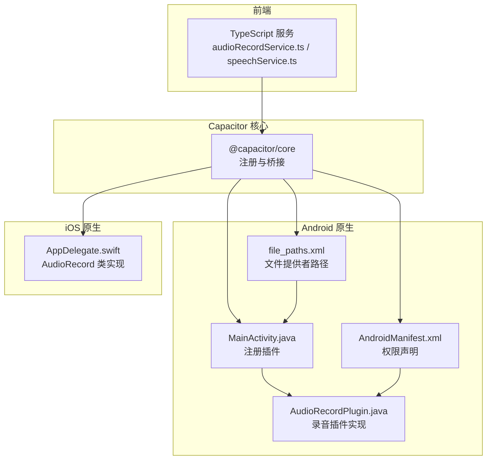
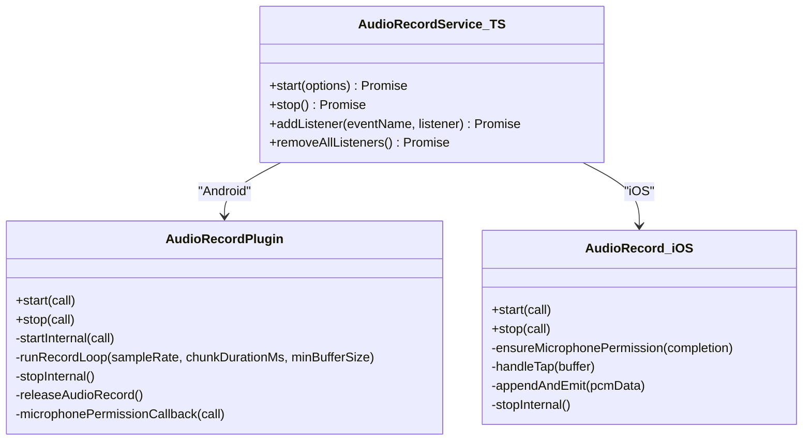
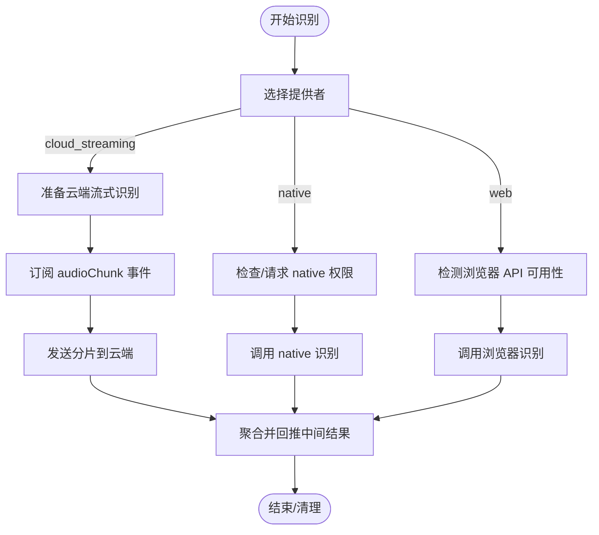
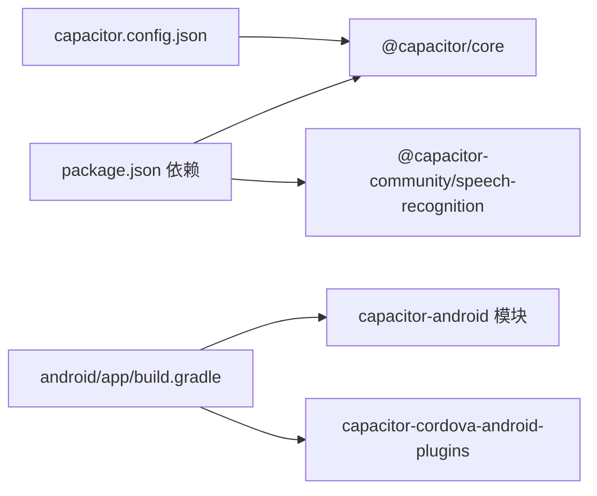

# 原生功能集成

<cite>
**本文引用的文件**   
- [AudioRecordPlugin.java](file://android/app/src/main/java/com/shisi/app/v2/plugins/AudioRecordPlugin.java)
- [AudioRecord（iOS 实现）.swift](file://ios/App/App/AppDelegate.swift)
- [audioRecordService.ts](file://src/app/services/audioRecordService.ts)
- [AndroidManifest.xml](file://android/app/src/main/AndroidManifest.xml)
- [MainActivity.java](file://android/app/src/main/java/com/shisi/app/v2/MainActivity.java)
- [capacitor.config.json](file://capacitor.config.json)
- [package.json](file://package.json)
- [README.md](file://README.md)
- [speechService.ts](file://src/app/services/speechService.ts)
- [file_paths.xml](file://android/app/src/main/res/xml/file_paths.xml)
- [build.gradle（Android 应用）](file://android/app/build.gradle)
</cite>

## 目录
1. [简介](#简介)
2. [项目结构](#项目结构)
3. [核心组件](#核心组件)
4. [架构总览](#架构总览)
5. [详细组件分析](#详细组件分析)
6. [依赖分析](#依赖分析)
7. [性能考虑](#性能考虑)
8. [故障排查指南](#故障排查指南)
9. [结论](#结论)
10. [附录](#附录)

## 简介
本文件面向希望在 Capacitor 应用中深度集成原生能力的开发者，系统化阐述插件体系的架构与工作机制，重点覆盖 JS 与原生之间的双向通信、音频录制插件的跨平台实现（Android Java/Kotlin 与 iOS Swift）、以及相机访问、文件系统操作与设备权限管理的集成方案。同时给出平台差异与兼容性处理策略、插件开发与测试流程、安全与性能优化建议，以及扩展与自定义插件的实践指导。

## 项目结构
该项目采用 Capacitor 跨平台框架，前端使用 TypeScript/React，原生层分别在 Android 与 iOS 平台实现插件桥接与系统能力调用。关键目录与文件如下：
- 前端服务与类型定义：src/app/services/audioRecordService.ts、src/app/services/speechService.ts 等
- Android 插件与入口：android/app/src/main/java/com/shisi/app/v2/plugins/AudioRecordPlugin.java、android/app/src/main/java/com/shisi/app/v2/MainActivity.java
- iOS 插件与桥接：ios/App/App/AppDelegate.swift（包含 AudioRecord 类实现）
- 配置与清单：capacitor.config.json、android/app/src/main/AndroidManifest.xml、android/app/src/main/res/xml/file_paths.xml
- 构建与依赖：android/app/build.gradle、package.json



**图表来源**
- [audioRecordService.ts:1-35](file://src/app/services/audioRecordService.ts#L1-L35)
- [MainActivity.java:1-34](file://android/app/src/main/java/com/shisi/app/v2/MainActivity.java#L1-L34)
- [AudioRecordPlugin.java:1-230](file://android/app/src/main/java/com/shisi/app/v2/plugins/AudioRecordPlugin.java#L1-L230)
- [AndroidManifest.xml:1-39](file://android/app/src/main/AndroidManifest.xml#L1-L39)
- [file_paths.xml:1-5](file://android/app/src/main/res/xml/file_paths.xml#L1-L5)
- [AudioRecord（iOS 实现）.swift:58-252](file://ios/App/App/AppDelegate.swift#L58-L252)

**章节来源**
- [capacitor.config.json:1-31](file://capacitor.config.json#L1-L31)
- [package.json:1-113](file://package.json#L1-L113)

## 核心组件
- 音频录制插件（AudioRecord）
  - Android：通过 AudioRecord 采集 PCM 数据，按配置分片并通过 Base64 事件推送至 JS 层
  - iOS：通过 AVAudioEngine + AVAudioConverter 采集并转换为 PCM，按配置分片推送事件
  - JS 封装：统一的 start/stop 方法与 audioChunk 事件监听
- 语音识别服务（SpeechService）
  - 支持 native（Capacitor 社区插件）、web（浏览器 Web Speech API）、cloud_streaming（云端流式）三种提供者
  - 统一权限检查与请求流程，适配不同平台差异
- 权限与清单
  - Android 明确声明 RECORD_AUDIO 权限
  - iOS 使用 AVAudioSession.recordPermission 进行麦克风权限判断与请求
- 文件系统与外部存储
  - Android 通过 FileProvider 配置 file_paths.xml，允许应用访问外部缓存与图片目录

**章节来源**
- [audioRecordService.ts:1-35](file://src/app/services/audioRecordService.ts#L1-L35)
- [AudioRecordPlugin.java:1-230](file://android/app/src/main/java/com/shisi/app/v2/plugins/AudioRecordPlugin.java#L1-L230)
- [AudioRecord（iOS 实现）.swift:58-252](file://ios/App/App/AppDelegate.swift#L58-L252)
- [AndroidManifest.xml:34-39](file://android/app/src/main/AndroidManifest.xml#L34-L39)
- [file_paths.xml:1-5](file://android/app/src/main/res/xml/file_paths.xml#L1-L5)

## 架构总览
Capacitor 的 JS 与原生之间通过注册插件实例与方法映射建立桥接。前端通过 registerPlugin 获取插件句柄，调用 start/stop；原生侧在收到调用后执行系统级录音流程，并以事件形式回传数据。

```mermaid
sequenceDiagram
participant UI as "前端页面"
participant TS as "audioRecordService.ts"
participant CORE as "@capacitor/core"
participant AND as "AudioRecordPlugin.java"
participant IOS as "AudioRecordiOS 实现.swift"
UI->>TS : 调用 start({sampleRate, chunkDurationMs})
TS->>CORE : PluginCall.start(...)
alt Android
CORE->>AND : 调用 start(...)
AND->>AND : 检查/申请录音权限
AND->>AND : 初始化 AudioRecord/线程
AND-->>TS : resolve({sampleRate, chunkDurationMs, encoding, channels})
AND-->>TS : 事件 audioChunk(Base64 PCM)
else iOS
CORE->>IOS : 调用 start(...)
IOS->>IOS : 检查/申请录音权限
IOS->>IOS : 配置 AVAudioSession/AVAudioEngine
IOS-->>TS : resolve({sampleRate, chunkDurationMs, encoding, channels})
IOS-->>TS : 事件 audioChunk(Base64 PCM)
end
UI->>TS : 调用 stop()
TS->>CORE : PluginCall.stop(...)
alt Android
CORE->>AND : 调用 stop(...)
AND->>AND : 停止线程/释放资源
else iOS
CORE->>IOS : 调用 stop(...)
IOS->>IOS : 移除 tap/停止引擎/释放会话
end
```

**图表来源**
- [audioRecordService.ts:26-33](file://src/app/services/audioRecordService.ts#L26-L33)
- [AudioRecordPlugin.java:39-136](file://android/app/src/main/java/com/shisi/app/v2/plugins/AudioRecordPlugin.java#L39-L136)
- [AudioRecord（iOS 实现）.swift:80-155](file://ios/App/App/AppDelegate.swift#L80-L155)

## 详细组件分析

### 音频录制插件（AudioRecord）
- 功能概述
  - 提供 start/stop 方法与 audioChunk 事件，按固定时长切片输出 PCM16LE 单声道数据（Base64 编码）
  - 默认采样率 16kHz，分片时长 800ms，通道数 1，每样本字节数 2
- Android 实现要点
  - 权限：通过注解声明 RECORD_AUDIO，运行时检查与回调处理
  - 初始化：计算最小缓冲区大小，创建 AudioRecord 并启动录音
  - 录音循环：按分片大小拼接字节，转 Base64 后通过 WebView.post 通知 JS
  - 停止：停止并释放 AudioRecord，中断录音线程，确保资源回收
- iOS 实现要点
  - 权限：通过 AVAudioSession.recordPermission 判断与请求
  - 初始化：设置 AVAudioSession category/mode/sampleRate，创建 AVAudioEngine 与 AVAudioConverter
  - 录音循环：安装 tap，回调中进行格式转换，按分片大小拼接并 Base64 推送
  - 停止：移除 tap、停止引擎、释放会话
- JS 封装要点
  - 定义 start/stop 与 addListener/removeAllListeners 接口
  - 事件类型定义包含 base64、bytes、sampleRate、chunkDurationMs、encoding、channels、timestampMs



**图表来源**
- [AudioRecordPlugin.java:23-230](file://android/app/src/main/java/com/shisi/app/v2/plugins/AudioRecordPlugin.java#L23-L230)
- [AudioRecord（iOS 实现）.swift:58-252](file://ios/App/App/AppDelegate.swift#L58-L252)
- [audioRecordService.ts:26-33](file://src/app/services/audioRecordService.ts#L26-L33)

**章节来源**
- [AudioRecordPlugin.java:1-230](file://android/app/src/main/java/com/shisi/app/v2/plugins/AudioRecordPlugin.java#L1-L230)
- [AudioRecord（iOS 实现）.swift:58-252](file://ios/App/App/AppDelegate.swift#L58-L252)
- [audioRecordService.ts:1-35](file://src/app/services/audioRecordService.ts#L1-L35)

### 语音识别服务（SpeechService）
- 提供者选择顺序：cloud_streaming（原生平台）、native（Capacitor 社区插件）、web（浏览器 API）、none
- 权限检查与请求：仅在 native 提供者下调用社区插件的检查/请求接口
- 云端流式识别：基于音频分片事件（来自 AudioRecord），按序发送并聚合中间结果
- Web 识别：使用浏览器 SpeechRecognition/WebKit 扩展，处理常见错误码映射



**图表来源**
- [speechService.ts:92-200](file://src/app/services/speechService.ts#L92-L200)
- [speechService.ts:407-705](file://src/app/services/speechService.ts#L407-L705)

**章节来源**
- [speechService.ts:1-200](file://src/app/services/speechService.ts#L1-L200)
- [speechService.ts:407-705](file://src/app/services/speechService.ts#L407-L705)

### 权限与清单
- Android
  - 在 AndroidManifest.xml 中声明 RECORD_AUDIO 权限
  - MainActivity 注册插件类，确保插件可用
- iOS
  - 通过 AVAudioSession.recordPermission 判断与请求录音权限
  - 在 AppDelegate 中注册插件实例，使 JS 可调用

```mermaid
sequenceDiagram
participant JS as "JS 层"
participant AND as "Android 权限"
participant IOS as "iOS 权限"
JS->>AND : 请求录音权限
AND-->>JS : PermissionState(GRANTED/DENIED/UNDETERMINED)
JS->>IOS : 请求录音权限
IOS-->>JS : recordPermission(GRANTED/DENIED/UNDETERMINED)
```

**图表来源**
- [AndroidManifest.xml:34-39](file://android/app/src/main/AndroidManifest.xml#L34-L39)
- [MainActivity.java:11-17](file://android/app/src/main/java/com/shisi/app/v2/MainActivity.java#L11-L17)
- [AudioRecord（iOS 实现）.swift:183-199](file://ios/App/App/AppDelegate.swift#L183-L199)

**章节来源**
- [AndroidManifest.xml:34-39](file://android/app/src/main/AndroidManifest.xml#L34-L39)
- [MainActivity.java:11-17](file://android/app/src/main/java/com/shisi/app/v2/MainActivity.java#L11-L17)
- [AudioRecord（iOS 实现）.swift:183-199](file://ios/App/App/AppDelegate.swift#L183-L199)

### 文件系统与外部存储
- Android 通过 FileProvider 配置 file_paths.xml，允许应用访问外部存储与缓存目录
- 适用于截图、导出媒体等场景的文件共享与保存

**章节来源**
- [file_paths.xml:1-5](file://android/app/src/main/res/xml/file_paths.xml#L1-L5)

## 依赖分析
- 前端依赖
  - @capacitor/core、@capacitor-community/speech-recognition 等
- Android 构建
  - 依赖 Capacitor Android 模块与 Cordova 插件桥接
- 配置
  - capacitor.config.json 控制应用 ID、名称、Web 目录与内置插件行为



**图表来源**
- [package.json:10-84](file://package.json#L10-L84)
- [build.gradle（Android 应用）:50-62](file://android/app/build.gradle#L50-L62)
- [capacitor.config.json:1-31](file://capacitor.config.json#L1-L31)

**章节来源**
- [package.json:1-113](file://package.json#L1-L113)
- [build.gradle（Android 应用）:1-72](file://android/app/build.gradle#L1-L72)
- [capacitor.config.json:1-31](file://capacitor.config.json#L1-L31)

## 性能考虑
- 采样率与分片
  - 默认 16kHz、800ms 分片，兼顾实时性与带宽；可根据场景调整
- 线程与优先级
  - Android 设置线程优先级为 AUDIO，减少音频中断
- 内存与缓冲
  - 合理设置最小缓冲区与分片大小，避免频繁分配
- 事件频率
  - 分片推送降低单次传输体积，提升 UI 流畅度
- 云端识别
  - 控制并发请求数量与最大等待时间，避免积压与内存占用过高

[本节为通用性能建议，无需具体文件分析]

## 故障排查指南
- 权限问题
  - Android：确认 AndroidManifest.xml 已声明 RECORD_AUDIO；插件回调中拒绝时检查权限状态
  - iOS：确认 AVAudioSession.recordPermission 返回 GRANTED；必要时重新请求
- 初始化失败
  - Android：AudioRecord.getMinBufferSize 或 STATE_INITIALIZED 失败时需检查采样率/通道配置
  - iOS：输出格式创建失败或 converter 创建失败时检查输入输出格式匹配
- 资源释放
  - 停止录音后需确保释放 AudioRecord/AVAudioEngine 与会话，避免后台占用
- 事件丢失
  - 确保在主线程触发 notifyListeners（Android 通过 bridge.getWebView().post），避免跨线程 UI 更新异常

**章节来源**
- [AudioRecordPlugin.java:84-119](file://android/app/src/main/java/com/shisi/app/v2/plugins/AudioRecordPlugin.java#L84-L119)
- [AudioRecord（iOS 实现）.swift:118-124](file://ios/App/App/AppDelegate.swift#L118-L124)
- [AudioRecord（iOS 实现）.swift:166-181](file://ios/App/App/AppDelegate.swift#L166-L181)

## 结论
本项目通过 Capacitor 插件体系实现了跨平台的音频录制与语音识别能力，JS 封装统一了接口与事件模型，原生层针对平台特性进行优化与兼容处理。结合权限管理、文件系统配置与性能策略，可为移动端提供稳定高效的原生功能体验。后续扩展可参考现有插件模式，快速接入相机、文件系统等更多原生能力。

[本节为总结性内容，无需具体文件分析]

## 附录

### 开发、调试与测试流程
- 开发
  - 在 Android：实现 PluginMethod，处理权限与生命周期；在 iOS：实现 CAPPlugin 并注册实例
  - 在 JS：定义插件接口与事件类型，使用 registerPlugin 获取实例
- 调试
  - Android：使用 Log 输出与断点；iOS：Xcode 控制台与 LLDB 断点
  - 通过 Capacitor DevServer 快速热更新前端代码
- 测试
  - Android：单元测试与仪器测试覆盖权限与初始化分支
  - iOS：模拟器/真机测试录音权限与引擎状态

**章节来源**
- [MainActivity.java:11-17](file://android/app/src/main/java/com/shisi/app/v2/MainActivity.java#L11-L17)
- [AudioRecord（iOS 实现）.swift:52-56](file://ios/App/App/AppDelegate.swift#L52-L56)
- [ExampleUnitTest.java:1-18](file://android/app/src/test/java/com/getcapacitor/myapp/ExampleUnitTest.java#L1-L18)
- [ExampleInstrumentedTest.java:1-26](file://android/app/src/androidTest/java/com/getcapacitor/myapp/ExampleInstrumentedTest.java#L1-L26)

### 安全与权限管理
- 最小权限原则：仅在需要时申请录音权限
- 用户知情同意：在录音前提示用途与数据处理方式
- 数据保护：避免在事件中携带敏感信息；云端传输建议加密
- 平台差异：Android 使用系统权限回调，iOS 使用 AVAudioSession.recordPermission

**章节来源**
- [AndroidManifest.xml:34-39](file://android/app/src/main/AndroidManifest.xml#L34-L39)
- [AudioRecord（iOS 实现）.swift:183-199](file://ios/App/App/AppDelegate.swift#L183-L199)

### 自定义插件开发指引
- 命名与注册
  - Android：使用 @CapacitorPlugin 注解与权限声明；在 MainActivity.registerPlugin
  - iOS：实现 CAPPlugin 并在 BridgeViewController.capacitorDidLoad 中注册实例
- JS 封装
  - 定义方法签名与事件类型；使用 registerPlugin 获取插件实例
- 生命周期与资源
  - 在 handleOnDestroy 或对应平台销毁回调中释放资源
- 文档与示例
  - 参考 README 中的使用示例与音频分片说明

**章节来源**
- [README.md:12-41](file://README.md#L12-L41)
- [MainActivity.java:11-17](file://android/app/src/main/java/com/shisi/app/v2/MainActivity.java#L11-L17)
- [AudioRecord（iOS 实现）.swift:52-56](file://ios/App/App/AppDelegate.swift#L52-L56)
- [audioRecordService.ts:26-33](file://src/app/services/audioRecordService.ts#L26-L33)