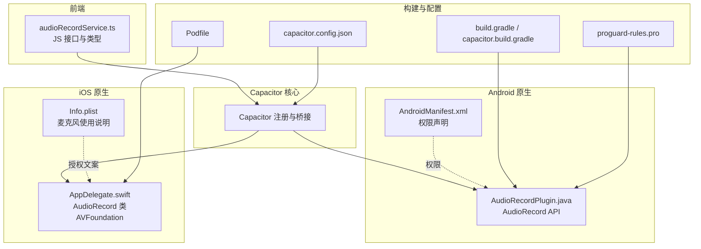
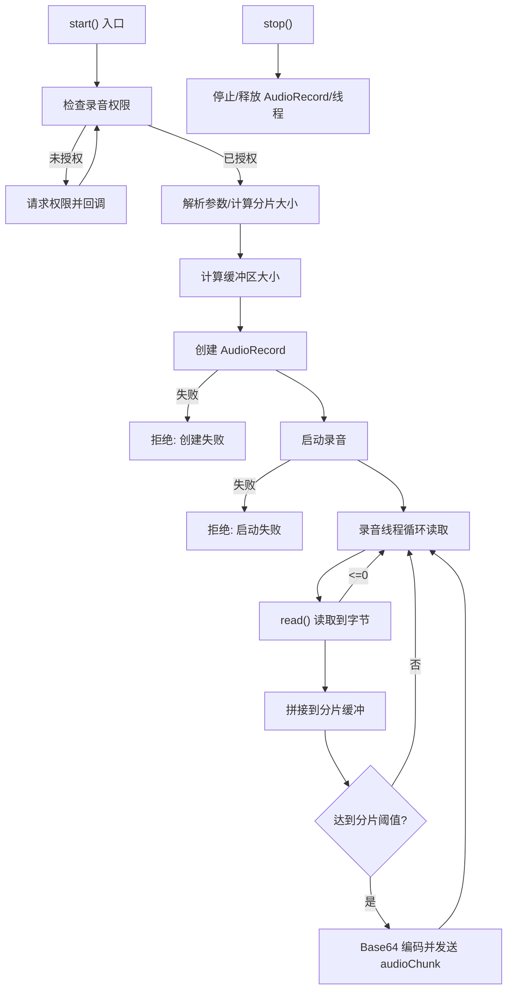
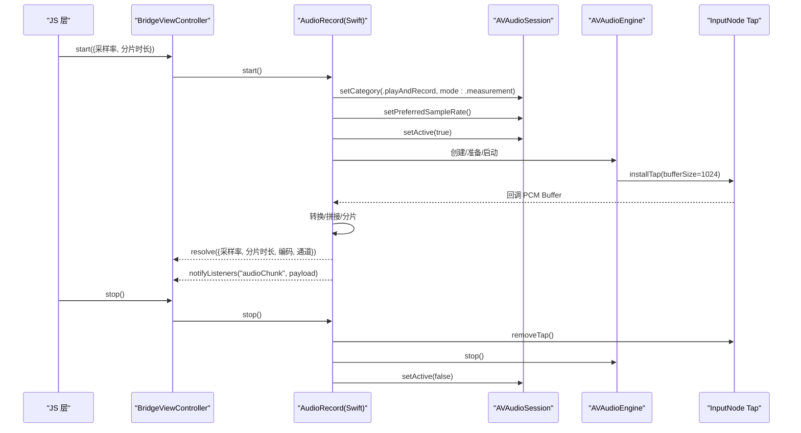
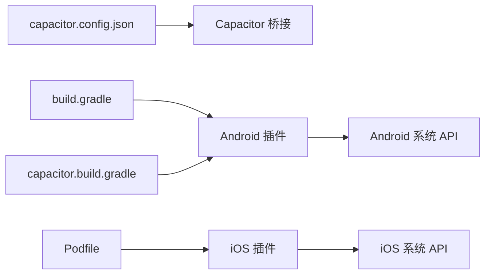

# 平台特定功能

<cite>
**本文引用的文件**
- [android/app/src/main/java/com/shisi/app/v2/plugins/AudioRecordPlugin.java](file://android/app/src/main/java/com/shisi/app/v2/plugins/AudioRecordPlugin.java)
- [ios/App/App/AppDelegate.swift](file://ios/App/App/AppDelegate.swift)
- [src/app/services/audioRecordService.ts](file://src/app/services/audioRecordService.ts)
- [android/app/src/main/AndroidManifest.xml](file://android/app/src/main/AndroidManifest.xml)
- [ios/App/App/Info.plist](file://ios/App/App/Info.plist)
- [capacitor.config.json](file://capacitor.config.json)
- [android/app/build.gradle](file://android/app/build.gradle)
- [android/app/capacitor.build.gradle](file://android/app/capacitor.build.gradle)
- [ios/App/Podfile](file://ios/App/Podfile)
- [android/app/proguard-rules.pro](file://android/app/proguard-rules.pro)
</cite>

## 目录
1. [引言](#引言)
2. [项目结构](#项目结构)
3. [核心组件](#核心组件)
4. [架构总览](#架构总览)
5. [详细组件分析](#详细组件分析)
6. [依赖分析](#依赖分析)
7. [性能考量](#性能考量)
8. [故障排查指南](#故障排查指南)
9. [结论](#结论)
10. [附录](#附录)

## 引言
本文件聚焦于本项目的“平台特定功能”，围绕 Android 与 iOS 的差异化实现展开，重点解释以下方面：
- 原生能力集成：Android 的 AudioRecord API 与 iOS 的 AVFoundation 框架
- 平台特定配置：权限声明、会话设置、构建与打包配置
- 跨平台抽象与兼容：通过 Capacitor 插件统一 JS 接口，屏蔽平台差异
- 性能优化与稳定性策略：缓冲区大小计算、线程优先级、后台/前台生命周期适配
- 版本兼容与降级策略：平台最低版本、API 变更处理
- 安全与合规：麦克风权限、用户授权流程、隐私说明

## 项目结构
本项目采用 Capacitor 跨平台架构，前端位于 src 目录，平台原生代码分别位于 android 与 ios 子工程中。平台特定功能主要体现在：
- 前端服务层：统一的 JS 接口定义与调用
- 原生插件层：Android 与 iOS 分别实现同一插件接口
- 配置层：平台清单与构建脚本、插件配置



**图表来源**
- [src/app/services/audioRecordService.ts:1-35](file://src/app/services/audioRecordService.ts#L1-L35)
- [android/app/src/main/java/com/shisi/app/v2/plugins/AudioRecordPlugin.java:1-230](file://android/app/src/main/java/com/shisi/app/v2/plugins/AudioRecordPlugin.java#L1-L230)
- [ios/App/App/AppDelegate.swift:58-251](file://ios/App/App/AppDelegate.swift#L58-L251)
- [android/app/src/main/AndroidManifest.xml:34-38](file://android/app/src/main/AndroidManifest.xml#L34-L38)
- [ios/App/App/Info.plist:9-10](file://ios/App/App/Info.plist#L9-L10)
- [capacitor.config.json:1-31](file://capacitor.config.json#L1-L31)
- [android/app/build.gradle:1-72](file://android/app/build.gradle#L1-L72)
- [android/app/capacitor.build.gradle:1-21](file://android/app/capacitor.build.gradle#L1-L21)
- [ios/App/Podfile:1-26](file://ios/App/Podfile#L1-L26)
- [android/app/proguard-rules.pro:1-22](file://android/app/proguard-rules.pro#L1-L22)

**章节来源**
- [capacitor.config.json:1-31](file://capacitor.config.json#L1-L31)
- [android/app/build.gradle:1-72](file://android/app/build.gradle#L1-L72)
- [android/app/capacitor.build.gradle:1-21](file://android/app/capacitor.build.gradle#L1-L21)
- [ios/App/Podfile:1-26](file://ios/App/Podfile#L1-L26)

## 核心组件
- 统一 JS 接口与事件模型：前端通过 registerPlugin 注册名为 AudioRecord 的插件，并定义 start/stop 方法与 audioChunk 事件回调。事件载荷包含采样率、分片时长、编码格式、通道数与时间戳等字段，确保跨平台一致性。
- Android 插件：基于 AudioRecord 与 MediaRecorder 实现录音采集，支持动态采样率与分片大小；通过线程优先级与缓冲区策略保证实时性；在 onDestroy 生命周期中释放资源。
- iOS 插件：基于 AVAudioSession、AVAudioEngine 与 AVAudioConverter 实现输入节点 tap 采样与 PCM 转换，按分片阈值拼接后以 Base64 形式回传。

**章节来源**
- [src/app/services/audioRecordService.ts:1-35](file://src/app/services/audioRecordService.ts#L1-L35)
- [android/app/src/main/java/com/shisi/app/v2/plugins/AudioRecordPlugin.java:19-136](file://android/app/src/main/java/com/shisi/app/v2/plugins/AudioRecordPlugin.java#L19-L136)
- [ios/App/App/AppDelegate.swift:58-155](file://ios/App/App/AppDelegate.swift#L58-L155)

## 架构总览
下图展示从前端到原生插件再到系统 API 的调用链路与数据流。

```mermaid
sequenceDiagram
participant FE as "前端<br/>audioRecordService.ts"
participant BR as "Capacitor 桥接"
participant AND as "Android 插件<br/>AudioRecordPlugin"
participant IOS as "iOS 插件<br/>AudioRecord(AppDelegate)"
participant SYS as "系统 API"
FE->>BR : 调用 AudioRecord.start({采样率, 分片时长})
alt Android
BR->>AND : start()
AND->>SYS : AudioRecord 初始化/启动
AND-->>BR : 返回采样率/分片参数
AND-->>BR : 事件 audioChunk(Base64, 字节, 时间戳)
else iOS
BR->>IOS : start()
IOS->>SYS : AVAudioSession 设置/激活
IOS->>SYS : AVAudioEngine 启动/tap
IOS-->>BR : 返回采样率/分片参数
IOS-->>BR : 事件 audioChunk(Base64, 字节, 时间戳)
end
BR-->>FE : 解析结果与事件监听
```

**图表来源**
- [src/app/services/audioRecordService.ts:26-33](file://src/app/services/audioRecordService.ts#L26-L33)
- [android/app/src/main/java/com/shisi/app/v2/plugins/AudioRecordPlugin.java:39-136](file://android/app/src/main/java/com/shisi/app/v2/plugins/AudioRecordPlugin.java#L39-L136)
- [ios/App/App/AppDelegate.swift:80-155](file://ios/App/App/AppDelegate.swift#L80-L155)

## 详细组件分析

### Android 原生插件：AudioRecordPlugin
- 权限与生命周期
  - 通过注解声明录音权限；在权限未授予时触发请求并在回调中继续启动流程；在宿主销毁时释放资源。
- 初始化与参数校验
  - 支持外部传入采样率与分片时长，默认值分别为 16kHz 与 800ms；根据采样率与分片时长计算分片字节数。
- 缓冲区与线程
  - 使用最小缓冲区与分片大小的最大值作为实际缓冲区；设置录音线程为音频优先级；循环读取并按分片阈值拼接，转 Base64 后通过 WebView 线程通知监听者。
- 错误处理
  - 对 AudioRecord 初始化失败、启动失败、状态异常等情况进行拒绝并清理资源；停止时安全释放并等待线程退出。



**图表来源**
- [android/app/src/main/java/com/shisi/app/v2/plugins/AudioRecordPlugin.java:39-219](file://android/app/src/main/java/com/shisi/app/v2/plugins/AudioRecordPlugin.java#L39-L219)

**章节来源**
- [android/app/src/main/java/com/shisi/app/v2/plugins/AudioRecordPlugin.java:19-229](file://android/app/src/main/java/com/shisi/app/v2/plugins/AudioRecordPlugin.java#L19-L229)
- [android/app/src/main/AndroidManifest.xml:34-38](file://android/app/src/main/AndroidManifest.xml#L34-L38)

### iOS 原生插件：AudioRecord（AVFoundation）
- 会话与格式
  - 设置 AVAudioSession 为播放与录制类别，模式为 measurement，允许蓝牙与默认扬声器；根据请求采样率创建输出格式与转换器。
- 输入节点与 tap
  - 在输入节点安装 tap，缓冲区大小固定；回调中进行格式转换，得到 PCM 数据后按分片阈值拼接并发出事件。
- 权限与生命周期
  - 通过 AVAudioSession.recordPermission 判断与请求麦克风权限；停止时移除 tap、停止引擎、释放会话。



**图表来源**
- [ios/App/App/AppDelegate.swift:58-181](file://ios/App/App/AppDelegate.swift#L58-L181)

**章节来源**
- [ios/App/App/AppDelegate.swift:58-251](file://ios/App/App/AppDelegate.swift#L58-L251)
- [ios/App/App/Info.plist:9-10](file://ios/App/App/Info.plist#L9-L10)

### 前端服务层：audioRecordService.ts
- 类型定义：统一事件载荷字段（base64、bytes、sampleRate、chunkDurationMs、encoding、channels、timestampMs），以及 start 参数与返回值类型。
- 插件注册：通过 registerPlugin('AudioRecord') 获取实例，暴露 start/stop 与事件监听方法。

**章节来源**
- [src/app/services/audioRecordService.ts:1-35](file://src/app/services/audioRecordService.ts#L1-L35)

## 依赖分析
- 构建与打包
  - Android：compileSdk/targetSdk/minSdk 由根工程变量控制；启用 Java 17；引入 Capacitor 与社区插件；release 构建开启调试与签名配置。
  - iOS：平台版本 13.0；通过 CocoaPods 管理 Capacitor 与社区插件依赖。
- 配置与桥接
  - Capacitor 配置集中于 capacitor.config.json，包含应用 ID、名称、Web 打包目录与服务器配置；插件通过 Capacitor 注册与桥接。
- 安全与混淆
  - Android 清理明文流量配置；ProGuard 规则可选保留行号信息或隐藏源文件名。



**图表来源**
- [capacitor.config.json:1-31](file://capacitor.config.json#L1-L31)
- [android/app/build.gradle:1-72](file://android/app/build.gradle#L1-L72)
- [android/app/capacitor.build.gradle:1-21](file://android/app/capacitor.build.gradle#L1-L21)
- [ios/App/Podfile:1-26](file://ios/App/Podfile#L1-L26)

**章节来源**
- [android/app/build.gradle:1-72](file://android/app/build.gradle#L1-L72)
- [android/app/capacitor.build.gradle:1-21](file://android/app/capacitor.build.gradle#L1-L21)
- [ios/App/Podfile:1-26](file://ios/App/Podfile#L1-L26)
- [capacitor.config.json:1-31](file://capacitor.config.json#L1-L31)

## 性能考量
- 缓冲区与分片
  - Android：最小缓冲区与分片字节的较大值作为实际缓冲，避免阻塞；分片时长与采样率决定每片字节数，影响网络传输与前端处理压力。
  - iOS：固定 tap 缓冲区大小，结合转换后的 PCM 数据按分片阈值拼接，减少频繁分配。
- 线程与优先级
  - Android：录音线程设置为音频优先级，降低延迟风险；停止时中断并等待线程退出，避免资源泄漏。
  - iOS：使用串行队列处理音频数据与事件通知，主线程仅用于事件派发，保证 UI 流畅。
- 会话与格式
  - iOS：选择 measurement 模式以降低系统处理开销；设置首选采样率与输出格式，减少转换成本。
- 生命周期与后台
  - Android：在宿主销毁时释放资源；建议在应用进入后台时暂停录音以节省电量。
  - iOS：在应用进入后台时释放会话与引擎，避免后台静默录音导致的电池消耗与系统限制。

[本节为通用性能建议，不直接分析具体文件，故无“章节来源”]

## 故障排查指南
- 权限问题
  - Android：确认已在清单中声明录音权限；若未授权，插件会拒绝并提示错误；检查权限回调逻辑。
  - iOS：确认 Info.plist 中包含麦克风使用说明；首次请求权限需在主线程触发。
- 初始化失败
  - Android：AudioRecord 最小缓冲区查询失败、创建失败、启动失败或状态异常均会导致拒绝；检查采样率与通道配置是否受支持。
  - iOS：会话设置失败、格式创建失败或转换器创建失败会拒绝；检查采样率与通道数是否匹配。
- 资源释放
  - Android：停止时需确保 stop/release 成功并等待线程结束；避免重复启动导致的状态冲突。
  - iOS：停止时移除 tap、停止引擎、释放会话；避免后台静默录音。
- 事件丢失
  - 若前端未及时消费 audioChunk，可能导致累积；建议前端侧设置合理的消费速率与背压策略。

**章节来源**
- [android/app/src/main/java/com/shisi/app/v2/plugins/AudioRecordPlugin.java:84-119](file://android/app/src/main/java/com/shisi/app/v2/plugins/AudioRecordPlugin.java#L84-L119)
- [ios/App/App/AppDelegate.swift:108-152](file://ios/App/App/AppDelegate.swift#L108-L152)
- [android/app/src/main/AndroidManifest.xml:34-38](file://android/app/src/main/AndroidManifest.xml#L34-L38)
- [ios/App/App/Info.plist:9-10](file://ios/App/App/Info.plist#L9-L10)

## 结论
本项目通过 Capacitor 将 Android 与 iOS 的录音能力以统一的 JS 接口暴露给前端，平台差异被有效封装在各自原生插件中。Android 侧重 AudioRecord 的缓冲区与线程管理，iOS 则利用 AVFoundation 的会话与转换器实现高精度 PCM 输出。配合严格的权限与生命周期管理，可在保证用户体验的同时兼顾性能与稳定性。

[本节为总结性内容，不直接分析具体文件，故无“章节来源”]

## 附录

### 平台差异与抽象层设计
- 抽象层职责
  - JS 层：定义统一的 start/stop 与事件模型，屏蔽平台差异。
  - 原生层：Android 使用 AudioRecord，iOS 使用 AVFoundation；两者均实现相同事件与参数约定。
- 兼容性策略
  - 默认采样率与分片时长在两端保持一致；当参数非法时统一拒绝。
  - 权限与会话设置在两端分别处理，确保符合平台规范。

**章节来源**
- [src/app/services/audioRecordService.ts:1-35](file://src/app/services/audioRecordService.ts#L1-L35)
- [android/app/src/main/java/com/shisi/app/v2/plugins/AudioRecordPlugin.java:28-31](file://android/app/src/main/java/com/shisi/app/v2/plugins/AudioRecordPlugin.java#L28-L31)
- [ios/App/App/AppDelegate.swift:76-78](file://ios/App/App/AppDelegate.swift#L76-L78)

### 开发与测试指南
- 开发步骤
  - 前端：调用 AudioRecord.start，订阅 audioChunk 事件，按需调用 stop。
  - Android：确保清单权限与插件注册；在 onDestroy 中释放资源。
  - iOS：确保 Info.plist 麦克风使用说明；在应用生命周期回调中正确释放会话与引擎。
- 测试策略
  - 功能测试：验证 start/stop 正常、事件回调稳定、分片大小与采样率一致。
  - 权限测试：模拟未授权场景，验证拒绝与重试流程。
  - 性能测试：在不同设备上测量 CPU 占用与内存占用，评估缓冲区与分片参数对帧率的影响。
  - 兼容性测试：覆盖 Android 不同厂商与 iOS 不同系统版本，验证会话与 API 行为。

**章节来源**
- [src/app/services/audioRecordService.ts:26-33](file://src/app/services/audioRecordService.ts#L26-L33)
- [android/app/src/main/AndroidManifest.xml:34-38](file://android/app/src/main/AndroidManifest.xml#L34-L38)
- [ios/App/App/Info.plist:9-10](file://ios/App/App/Info.plist#L9-L10)

### 版本兼容与降级策略
- Android
  - compileSdk/targetSdk/minSdk 由根工程变量控制；建议在构建脚本中明确各版本范围，避免运行时异常。
  - 若设备不支持指定采样率或通道配置，应捕获异常并回退到默认值或拒绝启动。
- iOS
  - Podfile 指定最低系统版本；若低于该版本，需在前端进行降级处理（例如禁用录音功能或提示升级）。
  - AVFoundation API 变更时，应在原生层增加条件编译或运行时检测，保证向后兼容。

**章节来源**
- [android/app/build.gradle:6-12](file://android/app/build.gradle#L6-L12)
- [ios/App/Podfile:3-3](file://ios/App/Podfile#L3-L3)

### 安全与合规
- 权限与隐私
  - Android：在清单中声明录音权限；在首次使用前请求授权并提示用途。
  - iOS：在 Info.plist 中提供麦克风使用说明；首次请求权限需遵循系统交互规范。
- 数据保护
  - 建议在网络传输前对 Base64 数据进行压缩或加密；在存储本地时采用安全的加密存储方案。
- 合规要求
  - 遵循平台隐私政策与开发者协议；在应用内提供清晰的隐私说明与用户同意机制。

**章节来源**
- [android/app/src/main/AndroidManifest.xml:34-38](file://android/app/src/main/AndroidManifest.xml#L34-L38)
- [ios/App/App/Info.plist:9-10](file://ios/App/App/Info.plist#L9-L10)