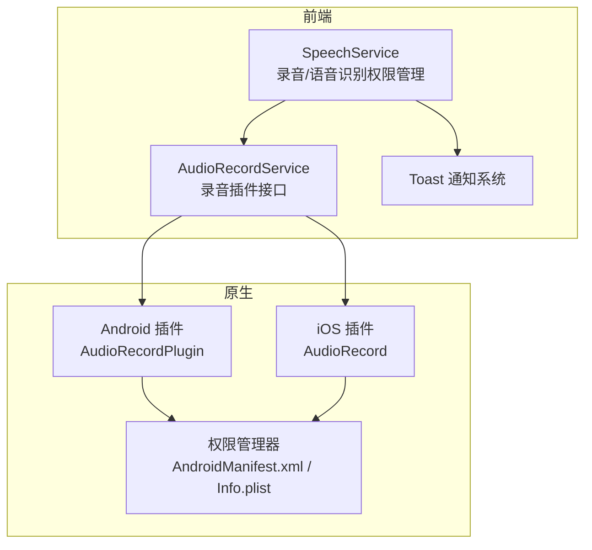
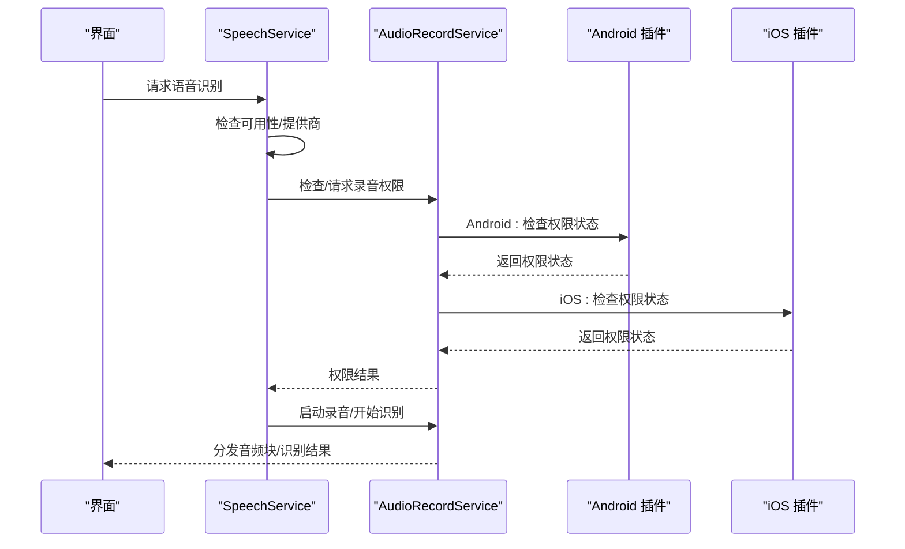
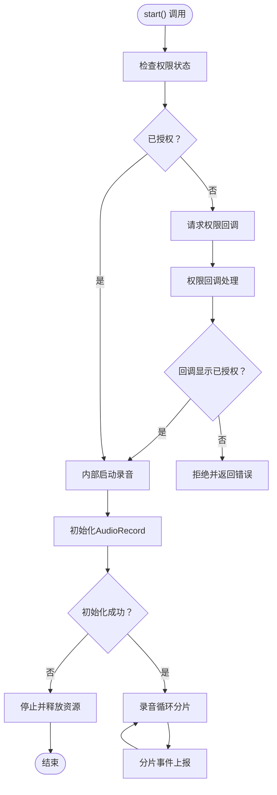
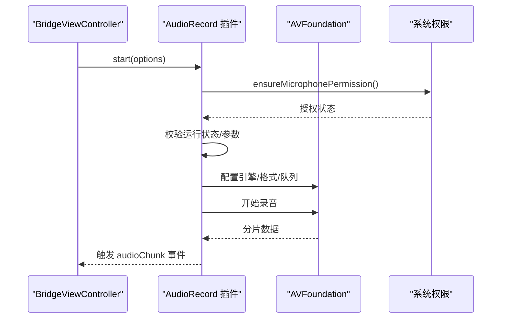
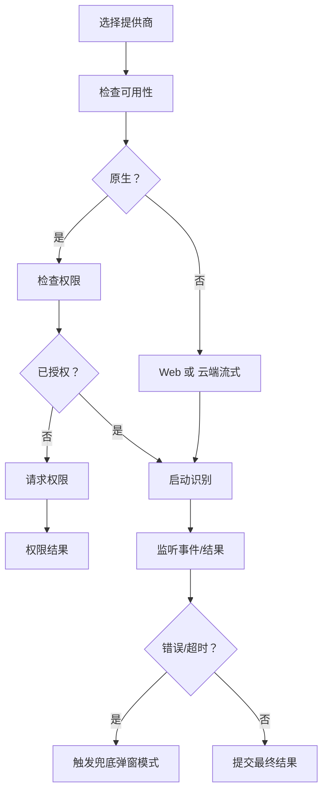
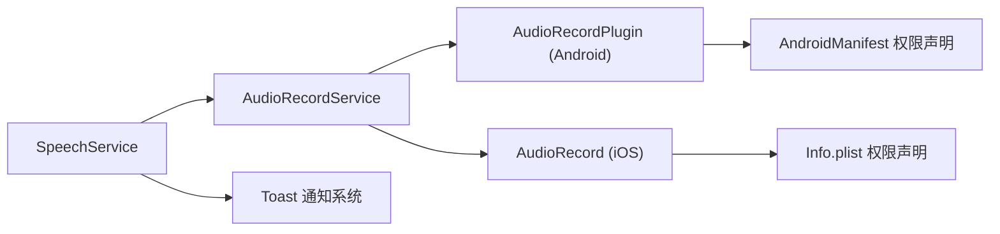

# 权限管理系统

<cite>
**本文档引用的文件**
- [audioRecordService.ts](file://src/app/services/audioRecordService.ts)
- [AudioRecordPlugin.java](file://android/app/src/main/java/com/shisi/app/v2/plugins/AudioRecordPlugin.java)
- [AppDelegate.swift](file://ios/App/App/AppDelegate.swift)
- [speechService.ts](file://src/app/services/speechService.ts)
- [Info.plist](file://ios/App/App/Info.plist)
- [AndroidManifest.xml](file://android/app/src/main/AndroidManifest.xml)
- [MainActivity.java](file://android/app/src/main/java/com/shisi/app/v2/MainActivity.java)
- [Toast.tsx](file://src/app/components/ui/Toast.tsx)
- [capacitor.config.json](file://capacitor.config.json)
</cite>

## 目录
1. [简介](#简介)
2. [项目结构](#项目结构)
3. [核心组件](#核心组件)
4. [架构总览](#架构总览)
5. [详细组件分析](#详细组件分析)
6. [依赖关系分析](#依赖关系分析)
7. [性能考量](#性能考量)
8. [故障排除指南](#故障排除指南)
9. [结论](#结论)

## 简介
本文件为该Note-taking应用前端的权限管理系统技术文档，重点围绕Capacitor权限体系进行深入解析，涵盖权限声明、动态请求与状态管理，以及录音、相机、存储等权限类型的处理方式。文档同时解释权限回调机制与用户授权流程，覆盖权限检查、拒绝处理与权限设置跳转功能，并提供最佳实践、用户体验优化策略、安全与隐私保护措施，以及跨平台权限模型差异与兼容性处理建议。

## 项目结构
该权限系统主要由三层构成：
- 前端服务层：负责权限检查、请求与状态管理，以及与原生能力的交互协调。
- 原生插件层：Android/iOS平台的具体权限实现与回调处理。
- UI反馈层：通过Toast等组件向用户反馈权限状态与错误信息。

**图表来源**
- [speechService.ts:126-144](file://src/app/services/speechService.ts#L126-L144)
- [audioRecordService.ts:26-33](file://src/app/services/audioRecordService.ts#L26-L33)
- [AudioRecordPlugin.java:19-22](file://android/app/src/main/java/com/shisi/app/v2/plugins/AudioRecordPlugin.java#L19-L22)
- [AppDelegate.swift:58-65](file://ios/App/App/AppDelegate.swift#L58-L65)
- [AndroidManifest.xml:36-37](file://android/app/src/main/AndroidManifest.xml#L36-L37)
- [Info.plist:9-10](file://ios/App/App/Info.plist#L9-L10)

**章节来源**
- [speechService.ts:126-144](file://src/app/services/speechService.ts#L126-L144)
- [audioRecordService.ts:26-33](file://src/app/services/audioRecordService.ts#L26-L33)
- [AudioRecordPlugin.java:19-22](file://android/app/src/main/java/com/shisi/app/v2/plugins/AudioRecordPlugin.java#L19-L22)
- [AppDelegate.swift:58-65](file://ios/App/App/AppDelegate.swift#L58-L65)
- [AndroidManifest.xml:36-37](file://android/app/src/main/AndroidManifest.xml#L36-L37)
- [Info.plist:9-10](file://ios/App/App/Info.plist#L9-L10)

## 核心组件
- 录音服务接口：定义录音插件的类型与方法，用于统一前后端交互。
- Android录音插件：声明录音权限、处理权限回调、启动/停止录音与事件分发。
- iOS录音插件：基于AVFoundation实现录音权限检查与录音流程。
- 语音识别服务：封装多提供商（原生、Web、云端流式）的权限检查与请求逻辑。
- 权限配置：Android清单与iOS Info.plist中的权限声明与用途描述。
- 通知系统：统一的Toast反馈，用于权限状态与错误提示。

**章节来源**
- [audioRecordService.ts:26-33](file://src/app/services/audioRecordService.ts#L26-L33)
- [AudioRecordPlugin.java:19-61](file://android/app/src/main/java/com/shisi/app/v2/plugins/AudioRecordPlugin.java#L19-L61)
- [AppDelegate.swift:58-106](file://ios/App/App/AppDelegate.swift#L58-L106)
- [speechService.ts:126-144](file://src/app/services/speechService.ts#L126-L144)
- [AndroidManifest.xml:36-37](file://android/app/src/main/AndroidManifest.xml#L36-L37)
- [Info.plist:9-10](file://ios/App/App/Info.plist#L9-L10)
- [Toast.tsx:107-126](file://src/app/components/ui/Toast.tsx#L107-L126)

## 架构总览
权限系统采用“前端服务 + 原生插件 + 平台配置”的分层架构。前端通过服务层统一管理权限状态与流程，原生插件负责实际权限申请与回调，平台配置确保权限声明完整。语音识别服务进一步抽象了多提供商的权限处理差异。

**图表来源**
- [speechService.ts:126-144](file://src/app/services/speechService.ts#L126-L144)
- [audioRecordService.ts:26-33](file://src/app/services/audioRecordService.ts#L26-L33)
- [AudioRecordPlugin.java:39-61](file://android/app/src/main/java/com/shisi/app/v2/plugins/AudioRecordPlugin.java#L39-L61)
- [AppDelegate.swift:89-106](file://ios/App/App/AppDelegate.swift#L89-L106)

## 详细组件分析

### 录音权限与回调机制（Android）
- 权限声明：插件通过注解声明录音权限别名与系统权限字符串。
- 动态请求：若权限未授予，调用请求方法并指定回调方法名。
- 回调处理：权限回调根据状态决定是否继续启动录音流程。
- 资源管理：线程安全地启动/停止录音，释放AudioRecord资源，避免内存泄漏。

**图表来源**
- [AudioRecordPlugin.java:39-136](file://android/app/src/main/java/com/shisi/app/v2/plugins/AudioRecordPlugin.java#L39-L136)
- [AudioRecordPlugin.java:138-187](file://android/app/src/main/java/com/shisi/app/v2/plugins/AudioRecordPlugin.java#L138-L187)
- [AudioRecordPlugin.java:189-219](file://android/app/src/main/java/com/shisi/app/v2/plugins/AudioRecordPlugin.java#L189-L219)

**章节来源**
- [AudioRecordPlugin.java:19-61](file://android/app/src/main/java/com/shisi/app/v2/plugins/AudioRecordPlugin.java#L19-L61)
- [AudioRecordPlugin.java:39-61](file://android/app/src/main/java/com/shisi/app/v2/plugins/AudioRecordPlugin.java#L39-L61)
- [AudioRecordPlugin.java:138-187](file://android/app/src/main/java/com/shisi/app/v2/plugins/AudioRecordPlugin.java#L138-L187)
- [AudioRecordPlugin.java:189-219](file://android/app/src/main/java/com/shisi/app/v2/plugins/AudioRecordPlugin.java#L189-L219)

### 录音权限与回调机制（iOS）
- 权限声明：Info.plist中包含麦克风使用说明键值。
- 权限检查：插件在启动录音前调用系统权限检查。
- 流程控制：若未授权则拒绝；授权后按配置启动录音队列与分片事件。

**图表来源**
- [AppDelegate.swift:52-56](file://ios/App/App/AppDelegate.swift#L52-L56)
- [AppDelegate.swift:80-106](file://ios/App/App/AppDelegate.swift#L80-L106)
- [AppDelegate.swift:106-187](file://ios/App/App/AppDelegate.swift#L106-L187)

**章节来源**
- [AppDelegate.swift:52-56](file://ios/App/App/AppDelegate.swift#L52-L56)
- [AppDelegate.swift:80-106](file://ios/App/App/AppDelegate.swift#L80-L106)
- [AppDelegate.swift:106-187](file://ios/App/App/AppDelegate.swift#L106-L187)
- [Info.plist:9-10](file://ios/App/App/Info.plist#L9-L10)

### 语音识别权限管理（多提供商）
- 提供商选择：优先原生（Android/iOS），其次Web Speech API，最后云端流式。
- 权限检查：仅当提供商为原生时调用插件检查权限。
- 权限请求：原生提供商通过插件发起权限请求。
- 错误映射：将Web Speech错误码映射为用户可理解的消息。
- 兜底策略：Android端针对无语音/超时场景进行轮询与超时兜底，避免UI卡死。

**图表来源**
- [speechService.ts:92-107](file://src/app/services/speechService.ts#L92-L107)
- [speechService.ts:126-144](file://src/app/services/speechService.ts#L126-L144)
- [speechService.ts:389-405](file://src/app/services/speechService.ts#L389-L405)
- [speechService.ts:508-543](file://src/app/services/speechService.ts#L508-L543)
- [speechService.ts:559-603](file://src/app/services/speechService.ts#L559-L603)

**章节来源**
- [speechService.ts:92-107](file://src/app/services/speechService.ts#L92-L107)
- [speechService.ts:126-144](file://src/app/services/speechService.ts#L126-L144)
- [speechService.ts:389-405](file://src/app/services/speechService.ts#L389-L405)
- [speechService.ts:508-543](file://src/app/services/speechService.ts#L508-L543)
- [speechService.ts:559-603](file://src/app/services/speechService.ts#L559-L603)

### 权限配置与声明
- Android：在清单中声明INTERNET与RECORD_AUDIO权限。
- iOS：在Info.plist中添加麦克风使用说明键值，确保App Store审核合规。
- MainActivity注册录音插件，确保桥接可用。

**章节来源**
- [AndroidManifest.xml:36-37](file://android/app/src/main/AndroidManifest.xml#L36-L37)
- [Info.plist:9-10](file://ios/App/App/Info.plist#L9-L10)
- [MainActivity.java:11-17](file://android/app/src/main/java/com/shisi/app/v2/MainActivity.java#L11-L17)

### 通知与用户体验反馈
- 统一Toast系统：提供多种类型的通知，包括权限不足、网络异常、超时等。
- 自动关闭与交互：支持定时自动关闭、手动关闭与动作按钮。
- 无障碍与一致性：统一的视觉风格与动画反馈，提升用户感知与可操作性。

**章节来源**
- [Toast.tsx:107-126](file://src/app/components/ui/Toast.tsx#L107-L126)
- [Toast.tsx:458-478](file://src/app/components/ui/Toast.tsx#L458-L478)

## 依赖关系分析
- 前端服务依赖Capacitor插件与平台能力，Android侧通过Java插件，iOS侧通过Swift插件。
- 语音识别服务依赖多提供商插件，其中原生提供商依赖系统权限框架。
- UI层依赖Toast组件进行权限状态与错误提示。

**图表来源**
- [speechService.ts:126-144](file://src/app/services/speechService.ts#L126-L144)
- [audioRecordService.ts:26-33](file://src/app/services/audioRecordService.ts#L26-L33)
- [AudioRecordPlugin.java:19-22](file://android/app/src/main/java/com/shisi/app/v2/plugins/AudioRecordPlugin.java#L19-L22)
- [AppDelegate.swift:58-65](file://ios/App/App/AppDelegate.swift#L58-L65)
- [AndroidManifest.xml:36-37](file://android/app/src/main/AndroidManifest.xml#L36-L37)
- [Info.plist:9-10](file://ios/App/App/Info.plist#L9-L10)

**章节来源**
- [speechService.ts:126-144](file://src/app/services/speechService.ts#L126-L144)
- [audioRecordService.ts:26-33](file://src/app/services/audioRecordService.ts#L26-L33)
- [AudioRecordPlugin.java:19-22](file://android/app/src/main/java/com/shisi/app/v2/plugins/AudioRecordPlugin.java#L19-L22)
- [AppDelegate.swift:58-65](file://ios/App/App/AppDelegate.swift#L58-L65)
- [AndroidManifest.xml:36-37](file://android/app/src/main/AndroidManifest.xml#L36-L37)
- [Info.plist:9-10](file://ios/App/App/Info.plist#L9-L10)

## 性能考量
- 分片传输：录音采用固定时长分片，降低单次处理压力，提高实时性与稳定性。
- 线程优先级：Android录音线程设置为音频优先级，减少延迟。
- 资源释放：停止录音时及时释放AudioRecord，避免资源泄露。
- 超时与兜底：对无语音/超时场景设置硬性超时与轮询兜底，避免UI长时间处于聆听态。
- 云端流式：云端流式识别需考虑网络抖动与分片并发度，合理控制并发数与超时时间。

[本节为通用性能讨论，无需特定文件来源]

## 故障排除指南
- 权限未授予：检查平台权限声明与请求流程，确认回调正确处理。
- 录音初始化失败：检查采样率、分片大小与缓冲区配置，确保符合设备要求。
- 无语音/超时：Android端依赖轮询与超时机制，确保UI状态正确切换。
- 错误消息映射：将底层错误码映射为用户可理解的提示，结合Toast进行反馈。
- 权限设置跳转：在UI层引导用户前往系统设置页开启权限（具体实现需在业务层补充）。

**章节来源**
- [AudioRecordPlugin.java:84-118](file://android/app/src/main/java/com/shisi/app/v2/plugins/AudioRecordPlugin.java#L84-L118)
- [speechService.ts:508-543](file://src/app/services/speechService.ts#L508-L543)
- [speechService.ts:611-621](file://src/app/services/speechService.ts#L611-L621)
- [Toast.tsx:107-126](file://src/app/components/ui/Toast.tsx#L107-L126)

## 结论
该权限管理系统通过清晰的分层架构与跨平台适配，实现了录音与语音识别权限的统一管理。前端服务层负责流程编排与错误处理，原生插件层承担权限与硬件交互，平台配置确保合规性。配合Toast等UI反馈，系统在可用性与用户体验方面表现良好。建议在业务层补充权限设置跳转与更细粒度的权限策略，以进一步提升安全性与易用性。