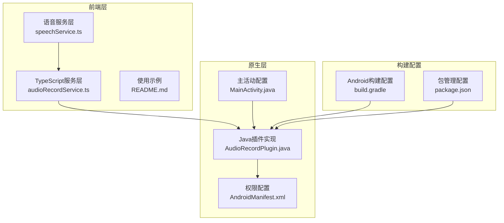
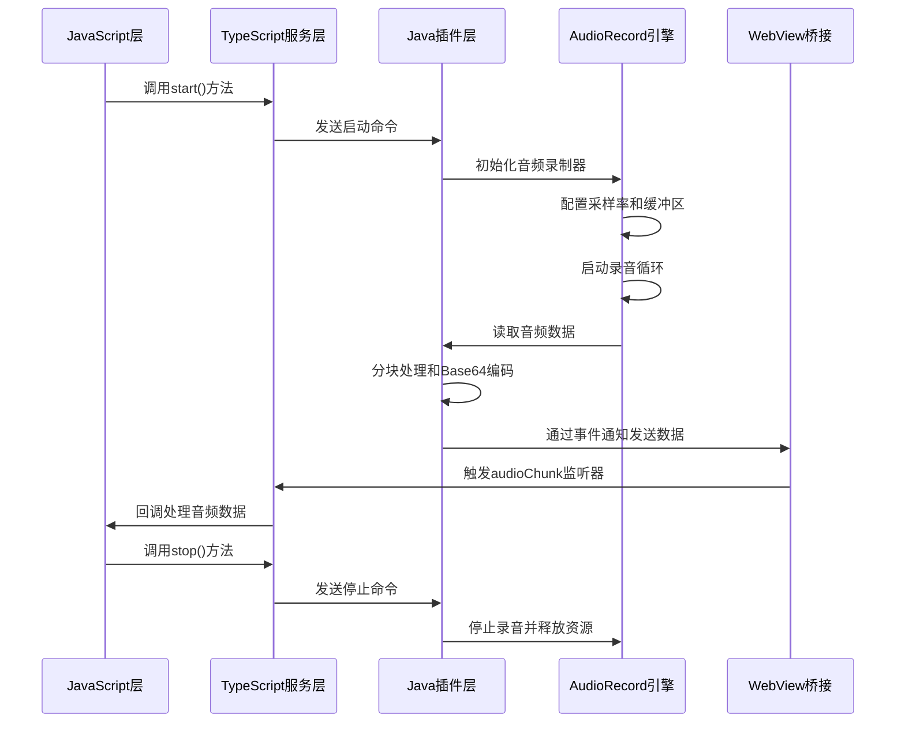
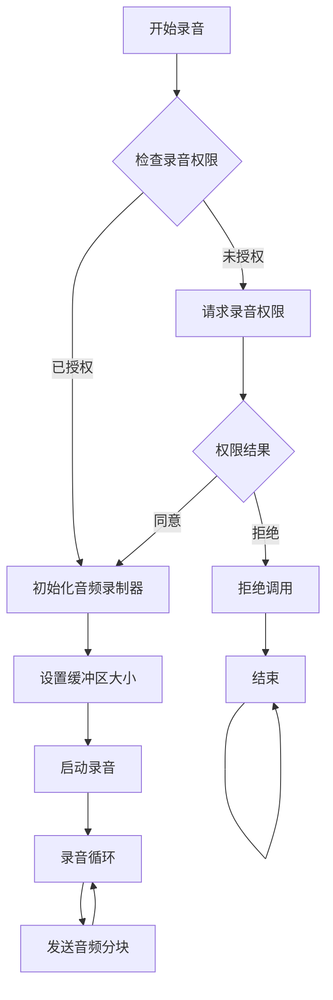
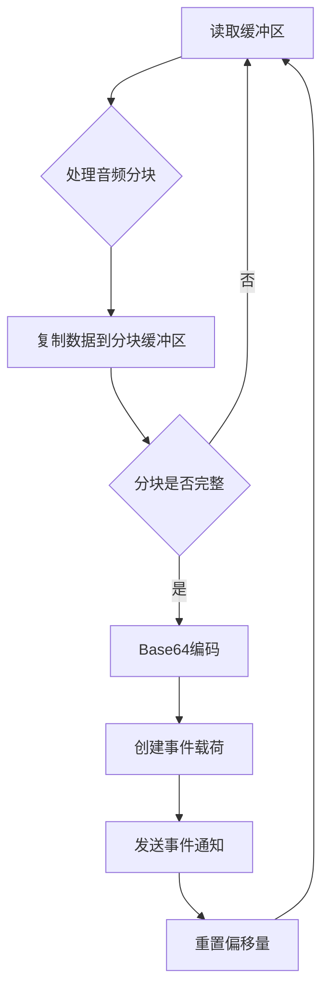
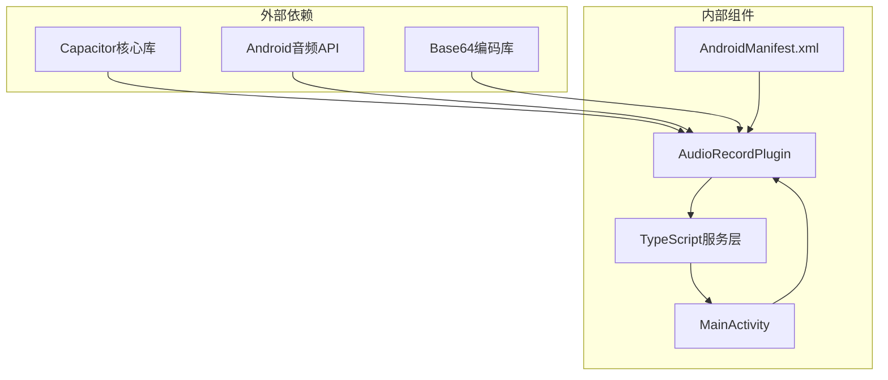

# 音频录制插件实现

<cite>
**本文档引用的文件**
- [AudioRecordPlugin.java](file://android/app/src/main/java/com/shisi/app/v2/plugins/AudioRecordPlugin.java)
- [audioRecordService.ts](file://src/app/services/audioRecordService.ts)
- [MainActivity.java](file://android/app/src/main/java/com/shisi/app/v2/MainActivity.java)
- [AndroidManifest.xml](file://android/app/src/main/AndroidManifest.xml)
- [speechService.ts](file://src/app/services/speechService.ts)
- [README.md](file://README.md)
- [build.gradle](file://android/app/build.gradle)
- [package.json](file://package.json)
</cite>

## 目录
1. [简介](#简介)
2. [项目结构](#项目结构)
3. [核心组件](#核心组件)
4. [架构概览](#架构概览)
5. [详细组件分析](#详细组件分析)
6. [依赖关系分析](#依赖关系分析)
7. [性能考虑](#性能考虑)
8. [故障排除指南](#故障排除指南)
9. [结论](#结论)
10. [附录](#附录)

## 简介

本项目实现了一个基于Capacitor框架的跨平台音频录制插件，支持Android和iOS平台。该插件提供了实时音频流录制功能，能够以指定的采样率和分块大小进行PCM音频数据的采集，并通过Base64编码传输到JavaScript层。

音频录制插件的核心特性包括：
- 支持自定义采样率和音频分块大小
- 实时音频数据流处理
- Base64编码的音频数据传输
- 完整的权限管理和线程安全机制
- 内存管理和资源清理策略
- 跨平台兼容性处理

## 项目结构

该项目采用Capacitor混合应用架构，主要包含以下关键目录和文件：

**图表来源**
- [AudioRecordPlugin.java:1-230](file://android/app/src/main/java/com/shisi/app/v2/plugins/AudioRecordPlugin.java#L1-L230)
- [audioRecordService.ts:1-35](file://src/app/services/audioRecordService.ts#L1-L35)
- [MainActivity.java:1-35](file://android/app/src/main/java/com/shisi/app/v2/MainActivity.java#L1-L35)

**章节来源**
- [AudioRecordPlugin.java:1-230](file://android/app/src/main/java/com/shisi/app/v2/plugins/AudioRecordPlugin.java#L1-L230)
- [audioRecordService.ts:1-35](file://src/app/services/audioRecordService.ts#L1-L35)
- [MainActivity.java:1-35](file://android/app/src/main/java/com/shisi/app/v2/MainActivity.java#L1-L35)

## 核心组件

### Java原生插件组件

AudioRecordPlugin是整个音频录制系统的核心组件，继承自Capacitor的Plugin基类，实现了完整的音频录制生命周期管理。

**主要功能模块：**
- 权限管理系统：集成Android录音权限检查和请求
- 音频配置管理：支持自定义采样率和分块大小
- 实时数据流处理：音频数据的读取、分块和编码
- 事件通知机制：通过Base64编码传输音频数据
- 资源管理：完整的音频硬件资源分配和释放

**章节来源**
- [AudioRecordPlugin.java:23-230](file://android/app/src/main/java/com/shisi/app/v2/plugins/AudioRecordPlugin.java#L23-L230)

### TypeScript服务层组件

TypeScript服务层提供了类型安全的接口封装，定义了完整的事件类型和方法签名。

**核心类型定义：**
- AudioChunkEvent：音频分块事件的数据结构
- AudioRecordStartOptions：启动参数配置
- AudioRecordStartResult：启动结果返回值
- AudioRecordPlugin接口：对外暴露的方法定义

**章节来源**
- [audioRecordService.ts:1-35](file://src/app/services/audioRecordService.ts#L1-L35)

## 架构概览

音频录制系统的整体架构采用分层设计，实现了前后端分离和职责明确的组件划分。

**图表来源**
- [AudioRecordPlugin.java:39-136](file://android/app/src/main/java/com/shisi/app/v2/plugins/AudioRecordPlugin.java#L39-L136)
- [audioRecordService.ts:26-31](file://src/app/services/audioRecordService.ts#L26-L31)

## 详细组件分析

### AudioRecordPlugin核心实现

#### 权限管理机制

插件集成了完整的Android权限管理系统，确保在录音前获得必要的麦克风权限。

**图表来源**
- [AudioRecordPlugin.java:39-61](file://android/app/src/main/java/com/shisi/app/v2/plugins/AudioRecordPlugin.java#L39-L61)

#### 音频配置参数

插件支持灵活的音频配置参数，所有参数都有合理的默认值：

**采样率配置：**
- 默认采样率：16000 Hz
- 可配置范围：根据设备能力动态调整
- 影响因素：音频质量与处理开销的平衡

**分块大小配置：**
- 默认分块时长：800毫秒
- 动态计算：基于采样率和分块时长计算字节数
- 性能优化：平衡延迟和内存使用

**音频格式配置：**
- 编码格式：PCM 16位有符号整数
- 通道配置：单声道（Mono）
- 字节序：小端序（Little Endian）

**章节来源**
- [AudioRecordPlugin.java:28-31](file://android/app/src/main/java/com/shisi/app/v2/plugins/AudioRecordPlugin.java#L28-L31)
- [AudioRecordPlugin.java:76-79](file://android/app/src/main/java/com/shisi/app/v2/plugins/AudioRecordPlugin.java#L76-L79)

#### 实时数据处理流程

音频数据的实时处理采用了高效的分块处理机制：

**图表来源**
- [AudioRecordPlugin.java:138-186](file://android/app/src/main/java/com/shisi/app/v2/plugins/AudioRecordPlugin.java#L138-L186)

#### 线程安全和内存管理

插件实现了完善的线程安全和内存管理策略：

**线程同步机制：**
- 使用synchronized锁保护共享资源
- AtomicBoolean确保运行状态的原子性
- 线程优先级设置为AUDIO优先级

**内存管理策略：**
- 及时释放AudioRecord资源
- 合理的缓冲区大小计算
- 异常情况下的资源清理

**章节来源**
- [AudioRecordPlugin.java:33-34](file://android/app/src/main/java/com/shisi/app/v2/plugins/AudioRecordPlugin.java#L33-L34)
- [AudioRecordPlugin.java:189-219](file://android/app/src/main/java/com/shisi/app/v2/plugins/AudioRecordPlugin.java#L189-L219)

### TypeScript服务层封装

#### 类型安全的接口定义

TypeScript服务层提供了完整的类型定义，确保开发过程中的类型安全：

**事件类型定义：**
- base64：Base64编码的音频数据
- bytes：音频数据字节数
- sampleRate：采样率
- chunkDurationMs：分块时长（毫秒）
- encoding：音频编码格式
- channels：音频通道数
- timestampMs：时间戳（毫秒）

**方法签名定义：**
- start(options?)：启动音频录制
- stop()：停止音频录制
- addListener('audioChunk', listener)：添加音频分块监听器
- removeAllListeners()：移除所有监听器

**章节来源**
- [audioRecordService.ts:4-31](file://src/app/services/audioRecordService.ts#L4-L31)

#### 使用示例和最佳实践

插件提供了清晰的使用示例，展示了正确的集成方式：

**基本使用模式：**
1. 添加音频分块监听器
2. 启动音频录制（指定采样率和分块时长）
3. 处理接收到的音频数据
4. 正确停止录制并清理资源

**错误处理策略：**
- 权限检查和异常捕获
- 资源清理和状态恢复
- 用户友好的错误信息

**章节来源**
- [README.md:16-39](file://README.md#L16-L39)
- [speechService.ts:357-367](file://src/app/services/speechService.ts#L357-L367)

## 依赖关系分析

### 组件间依赖关系

**图表来源**
- [AudioRecordPlugin.java:3-17](file://android/app/src/main/java/com/shisi/app/v2/plugins/AudioRecordPlugin.java#L3-L17)
- [package.json:10-16](file://package.json#L10-L16)

### 版本兼容性

插件使用了稳定的Capacitor 6.x版本，确保了良好的向后兼容性：

**构建配置要点：**
- compileSdkVersion：支持最新的Android SDK
- minSdkVersion：兼容较老的Android版本
- targetSdkVersion：针对目标Android版本优化
- 依赖版本锁定：避免版本冲突

**章节来源**
- [build.gradle:4-12](file://android/app/build.gradle#L4-L12)
- [package.json:10-16](file://package.json#L10-L16)

## 性能考虑

### 音频质量控制

插件在音频质量和性能之间实现了平衡：

**采样率选择：**
- 16kHz采样率适合大多数语音识别场景
- 提供了足够的音频质量同时保持较低的处理开销
- 支持动态配置以适应不同的应用场景

**分块大小优化：**
- 800ms分块提供了良好的实时性
- 减少了网络传输的频率
- 平衡了延迟和带宽使用

**内存使用优化：**
- 动态计算缓冲区大小
- 及时释放不再使用的资源
- 避免内存泄漏

### 错误处理和恢复

插件实现了多层次的错误处理机制：

**初始化阶段错误处理：**
- 音频硬件初始化失败的检测
- 缓冲区配置错误的处理
- 权限申请失败的回退机制

**运行时错误处理：**
- 音频读取异常的恢复
- 线程中断的安全处理
- 资源释放的完整性保证

**章节来源**
- [AudioRecordPlugin.java:83-119](file://android/app/src/main/java/com/shisi/app/v2/plugins/AudioRecordPlugin.java#L83-L119)
- [AudioRecordPlugin.java:154-158](file://android/app/src/main/java/com/shisi/app/v2/plugins/AudioRecordPlugin.java#L154-L158)

## 故障排除指南

### 常见问题和解决方案

**权限相关问题：**
- 确保AndroidManifest.xml中声明了RECORD_AUDIO权限
- 在运行时正确处理权限请求回调
- 检查用户是否拒绝了权限申请

**音频硬件问题：**
- 验证设备是否有可用的麦克风
- 检查音频焦点冲突
- 确认其他应用没有占用音频资源

**内存和性能问题：**
- 监控内存使用情况
- 调整分块大小以优化性能
- 确保及时释放音频资源

**章节来源**
- [AndroidManifest.xml:36-37](file://android/app/src/main/AndroidManifest.xml#L36-L37)
- [AudioRecordPlugin.java:54-61](file://android/app/src/main/java/com/shisi/app/v2/plugins/AudioRecordPlugin.java#L54-L61)

### 调试技巧

**日志记录：**
- 在关键节点添加详细的日志信息
- 区分调试和生产环境的日志级别
- 使用结构化的日志格式便于分析

**性能监控：**
- 监控音频数据的处理延迟
- 跟踪内存使用峰值
- 分析CPU使用情况

**章节来源**
- [AudioRecordPlugin.java:138-186](file://android/app/src/main/java/com/shisi/app/v2/plugins/AudioRecordPlugin.java#L138-L186)

## 结论

本音频录制插件实现了一个功能完整、性能优良的跨平台音频采集解决方案。通过精心设计的架构和严格的实现规范，该插件能够在保证音频质量的同时提供高效的实时数据处理能力。

**主要优势：**
- 完整的权限管理和安全机制
- 高效的实时音频数据处理
- 良好的跨平台兼容性
- 清晰的API设计和类型安全
- 完善的错误处理和资源管理

**适用场景：**
- 语音识别和转录应用
- 实时音频分析系统
- 音频数据采集和处理
- 语音交互应用开发

该插件为开发者提供了一个可靠的音频录制基础，可以作为更复杂音频应用的起点。

## 附录

### 配置参数参考表

| 参数名称 | 默认值 | 可配置范围 | 说明 |
|---------|--------|-----------|------|
| sampleRate | 16000 | 8000-48000 | 采样频率（Hz） |
| chunkDurationMs | 800 | 100-2000 | 音频分块时长（毫秒） |
| encoding | pcm16le | pcm16le | 音频编码格式 |
| channels | 1 | 1-2 | 音频通道数 |

### 使用示例代码路径

**基础录音示例：**
- [README.md:16-39](file://README.md#L16-L39)

**语音识别集成示例：**
- [speechService.ts:357-367](file://src/app/services/speechService.ts#L357-L367)

**章节来源**
- [README.md:16-39](file://README.md#L16-L39)
- [speechService.ts:357-367](file://src/app/services/speechService.ts#L357-L367)