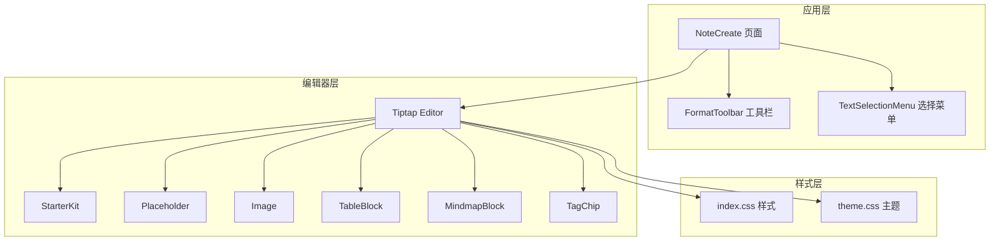
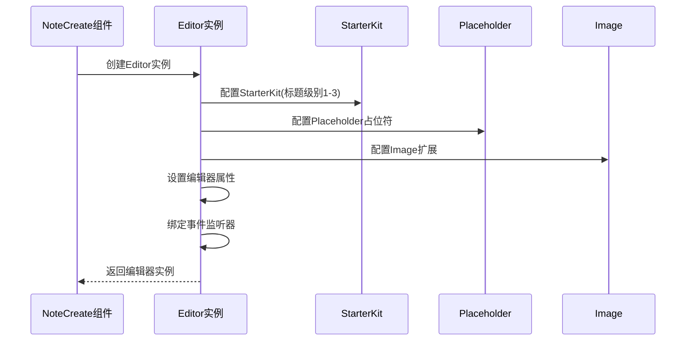
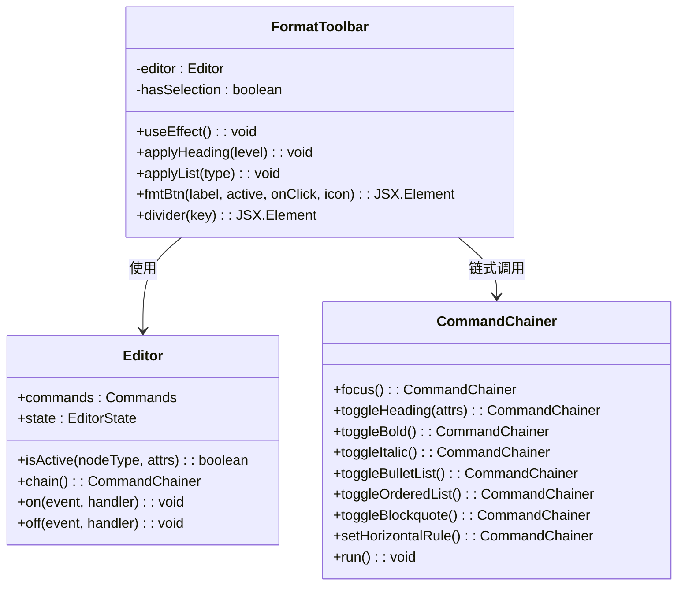
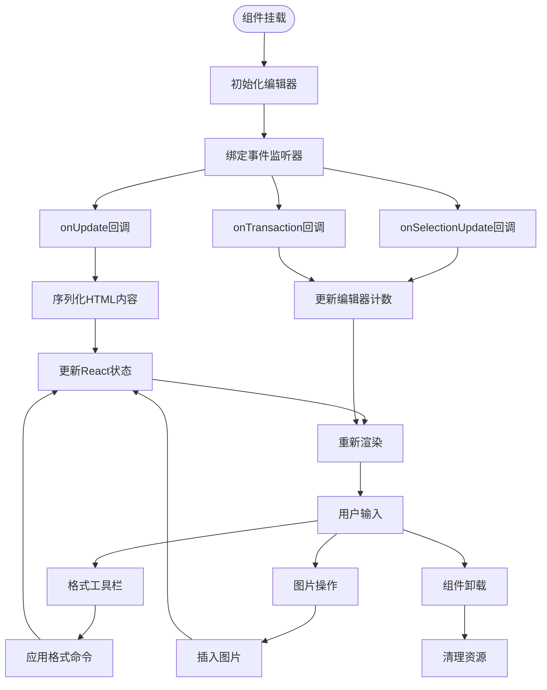
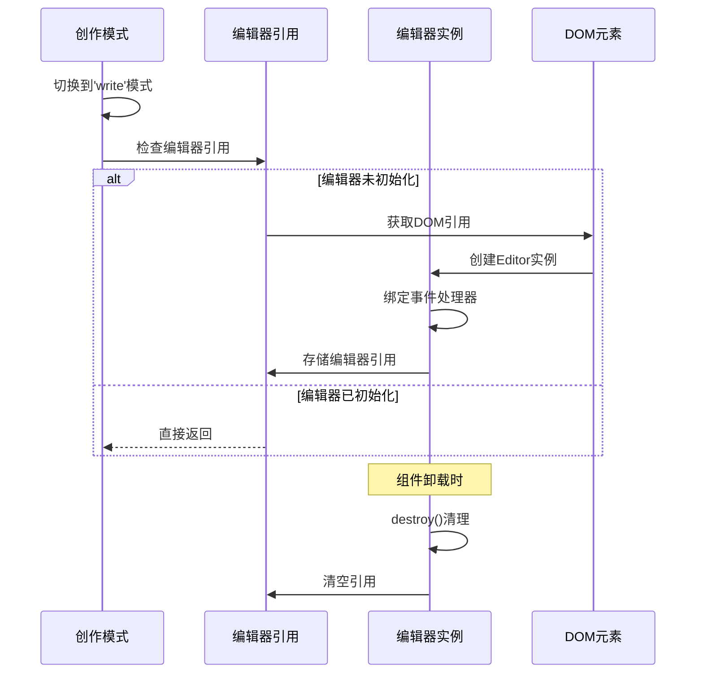
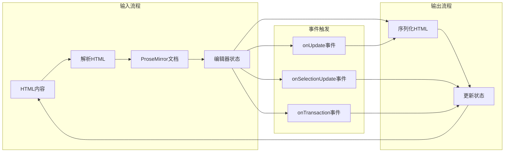
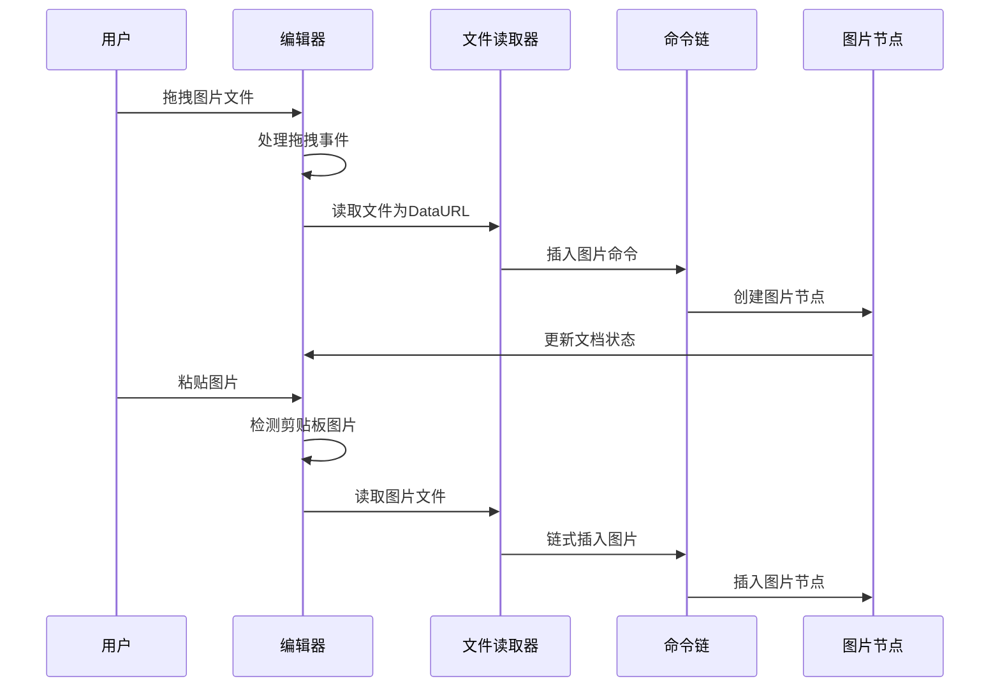
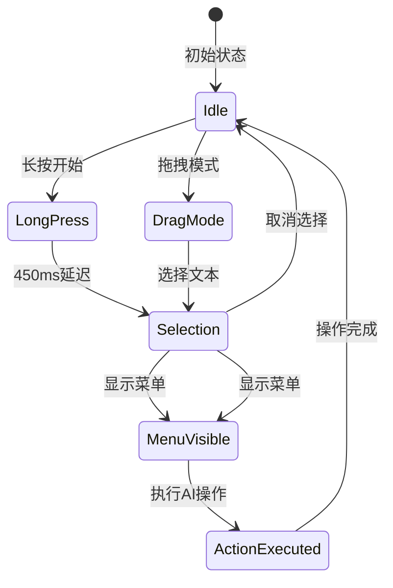

# Tiptap编辑器集成

<cite>
**本文档引用的文件**
- [NoteCreate.tsx](file://src/app/pages/NoteCreate.tsx)
- [vite.config.ts](file://vite.config.ts)
- [index.css](file://src/styles/index.css)
- [theme.css](file://src/styles/theme.css)
- [TextSelectionMenu.tsx](file://src/app/components/TextSelectionMenu.tsx)
- [package.json](file://package.json)
</cite>

## 目录
1. [简介](#简介)
2. [项目结构](#项目结构)
3. [核心组件](#核心组件)
4. [架构概览](#架构概览)
5. [详细组件分析](#详细组件分析)
6. [依赖分析](#依赖分析)
7. [性能考虑](#性能考虑)
8. [故障排除指南](#故障排除指南)
9. [结论](#结论)

## 简介

本项目实现了基于Tiptap的富文本编辑器集成，提供了完整的笔记创作功能。编辑器集成了StarterKit、Placeholder、Image等基础扩展，并扩展了自定义的TableBlock、MindmapBlock和TagChip组件。

该编辑器采用模块作用域定义FormatToolbar组件，避免React Hook重新创建问题，实现了智能的格式按钮状态控制和选择检测机制。编辑器支持实时内容序列化和反序列化，具备完整的生命周期管理和事件监听能力。

## 项目结构

项目采用React + Vite的现代前端架构，Tiptap编辑器集成在NoteCreate页面中：



**图表来源**
- [NoteCreate.tsx:1100-1132](file://src/app/pages/NoteCreate.tsx#L1100-L1132)
- [index.css:49-229](file://src/styles/index.css#L49-L229)

**章节来源**
- [NoteCreate.tsx:1-50](file://src/app/pages/NoteCreate.tsx#L1-L50)
- [vite.config.ts:1-44](file://vite.config.ts#L1-L44)

## 核心组件

### 编辑器初始化配置

编辑器通过模块作用域定义，确保不会因React Hook重新创建而出现问题：



**图表来源**
- [NoteCreate.tsx:1101-1132](file://src/app/pages/NoteCreate.tsx#L1101-L1132)
- [NoteCreate.tsx:1151-1179](file://src/app/pages/NoteCreate.tsx#L1151-L1179)

编辑器配置包含以下关键特性：
- **StarterKit配置**：禁用代码块，仅启用1-3级标题
- **Placeholder扩展**：设置中文占位符文本
- **Image扩展**：支持非内联图片和Base64格式
- **自定义扩展**：TableBlock、MindmapBlock、TagChip

**章节来源**
- [NoteCreate.tsx:1104-1112](file://src/app/pages/NoteCreate.tsx#L1104-L1112)
- [NoteCreate.tsx:1153-1160](file://src/app/pages/NoteCreate.tsx#L1153-L1160)

### FormatToolbar工具栏实现

FormatToolbar组件实现了智能的格式按钮状态控制：



**图表来源**
- [NoteCreate.tsx:41-228](file://src/app/pages/NoteCreate.tsx#L41-L228)

工具栏的智能应用逻辑包括：

1. **标题应用器**：根据选择范围智能切换标题级别
   - 光标位置：标准切换当前块标题
   - 全块选择：标准切换当前块标题  
   - 部分选择：提取选中文本到新标题块

2. **列表应用器**：镜像标题应用器逻辑
   - 光标位置：标准切换列表类型
   - 文本选择：收集范围内每块文本，删除选区后插入全新列表

**章节来源**
- [NoteCreate.tsx:67-149](file://src/app/pages/NoteCreate.tsx#L67-L149)

## 架构概览

编辑器采用事件驱动的架构模式，实现了完整的生命周期管理：



**图表来源**
- [NoteCreate.tsx:1101-1132](file://src/app/pages/NoteCreate.tsx#L1101-L1132)
- [NoteCreate.tsx:1134-1140](file://src/app/pages/NoteCreate.tsx#L1134-L1140)

## 详细组件分析

### 编辑器生命周期管理

编辑器实现了完整的生命周期管理，包括延迟初始化和资源清理：



**图表来源**
- [NoteCreate.tsx:1146-1179](file://src/app/pages/NoteCreate.tsx#L1146-L1179)

### 内容序列化与反序列化

编辑器实现了双向的数据流控制：



**图表来源**
- [NoteCreate.tsx:1114-1119](file://src/app/pages/NoteCreate.tsx#L1114-L1119)
- [NoteCreate.tsx:1162-1167](file://src/app/pages/NoteCreate.tsx#L1162-L1167)

### 图片处理机制

编辑器支持拖拽和粘贴图片操作：



**图表来源**
- [NoteCreate.tsx:1856-1878](file://src/app/pages/NoteCreate.tsx#L1856-L1878)

**章节来源**
- [NoteCreate.tsx:1856-1878](file://src/app/pages/NoteCreate.tsx#L1856-L1878)

### AI辅助功能集成

编辑器集成了智能文本选择和AI助手功能：



**图表来源**
- [NoteCreate.tsx:1588-1650](file://src/app/pages/NoteCreate.tsx#L1588-L1650)

**章节来源**
- [TextSelectionMenu.tsx:12-45](file://src/app/components/TextSelectionMenu.tsx#L12-L45)

## 依赖分析

项目使用Vite进行构建优化，确保React实例的唯一性：

```mermaid
graph TB
subgraph "构建配置"
VC[Vite配置]
RD[React Dedupe]
OB[Optimize Dependencies]
end
subgraph "运行时依赖"
RC[React Core]
RDOM[React DOM]
TIPTAP[@tiptap/*]
MOTION[motion/react]
end
VC --> RD
VC --> OB
RD --> RC
RD --> RDOM
OB --> TIPTAP
OB --> MOTION
```

**图表来源**
- [vite.config.ts:11-25](file://vite.config.ts#L11-L25)
- [vite.config.ts:27-41](file://vite.config.ts#L27-L41)

**章节来源**
- [package.json:10-84](file://package.json#L10-L84)
- [vite.config.ts:1-44](file://vite.config.ts#L1-L44)

## 性能考虑

### 内存管理最佳实践

1. **编辑器生命周期管理**
   - 在组件卸载时调用`destroy()`方法
   - 清空编辑器引用避免内存泄漏
   - 使用`useEffect`清理事件监听器

2. **事件监听优化**
   - 仅在编辑器存在时绑定事件
   - 使用防抖处理频繁更新
   - 合理使用`setEditable(false)`暂停序列化

3. **渲染性能优化**
   - 使用`useMemo`缓存计算结果
   - 避免不必要的组件重渲染
   - 合理使用`React.PureComponent`

### 序列化性能优化

1. **增量更新策略**
   - 仅在必要时进行HTML序列化
   - 使用`onUpdate`事件替代频繁轮询
   - 避免在开发热更新期间进行序列化

2. **样式性能优化**
   - 使用CSS类名而非内联样式
   - 合理利用Tailwind CSS工具类
   - 避免复杂的CSS动画影响性能

## 故障排除指南

### 常见问题及解决方案

1. **编辑器无法初始化**
   - 检查DOM元素是否正确挂载
   - 确认编辑器扩展配置正确
   - 验证React版本兼容性

2. **格式按钮无响应**
   - 确认编辑器实例已正确创建
   - 检查选择状态监听器是否正常工作
   - 验证命令链调用顺序

3. **图片插入失败**
   - 检查文件类型限制
   - 验证Base64编码格式
   - 确认文件大小限制

4. **内存泄漏问题**
   - 确保在`useEffect`清理函数中移除事件监听器
   - 调用`editor.destroy()`清理编辑器实例
   - 检查闭包引用避免循环引用

**章节来源**
- [NoteCreate.tsx:1126-1130](file://src/app/pages/NoteCreate.tsx#L1126-L1130)
- [NoteCreate.tsx:1173-1177](file://src/app/pages/NoteCreate.tsx#L1173-L1177)

## 结论

本项目成功实现了功能完整的Tiptap编辑器集成，具备以下特点：

1. **完整的编辑器功能**：支持富文本编辑、图片插入、智能格式化
2. **优秀的用户体验**：提供直观的工具栏、智能选择菜单和流畅的交互体验
3. **良好的性能表现**：通过合理的内存管理和事件优化确保应用性能
4. **可扩展的架构**：模块化的组件设计便于功能扩展和维护

编辑器集成了多种扩展和自定义组件，提供了丰富的文本处理能力。通过事件驱动的架构和完善的生命周期管理，确保了应用的稳定性和可靠性。同时，通过样式系统的深度定制，实现了与整体应用设计风格的完美融合。