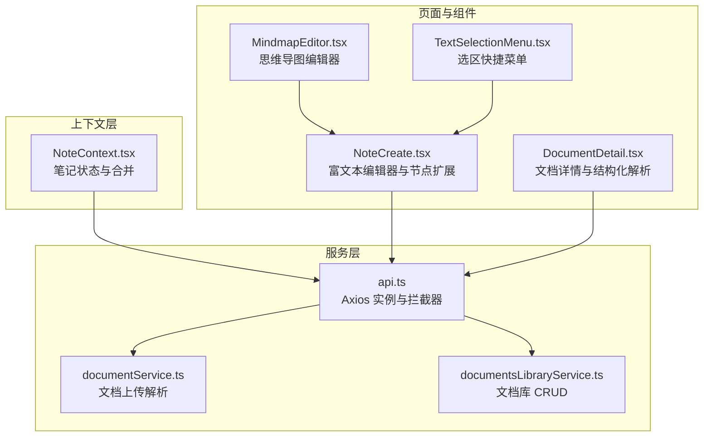
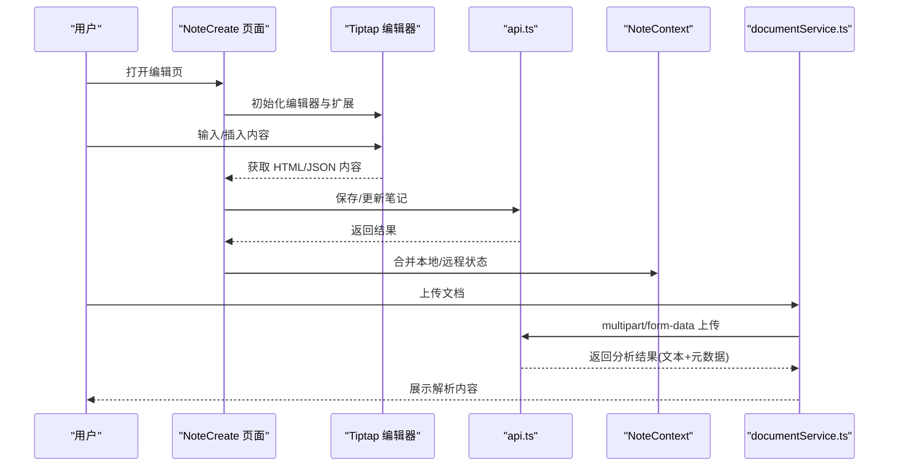
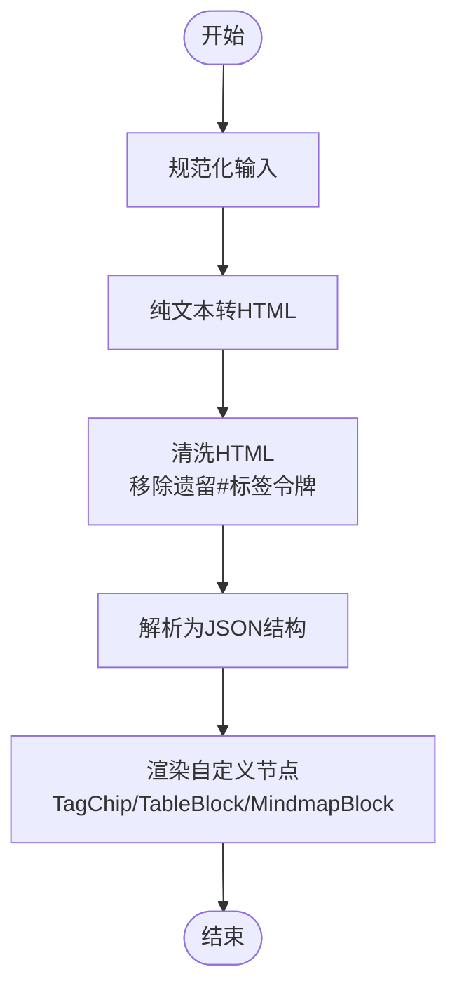
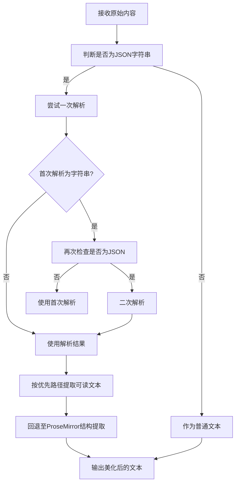
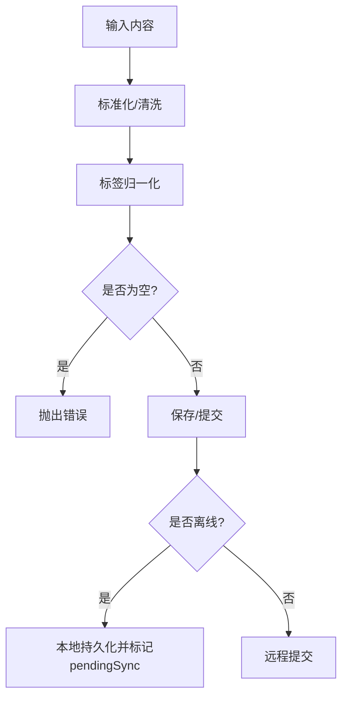
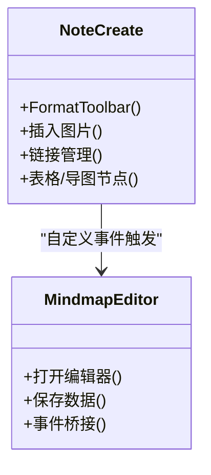
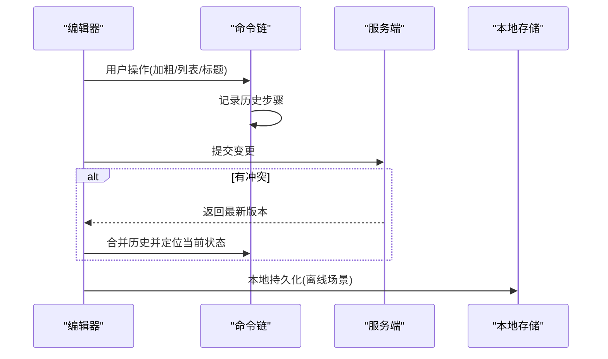
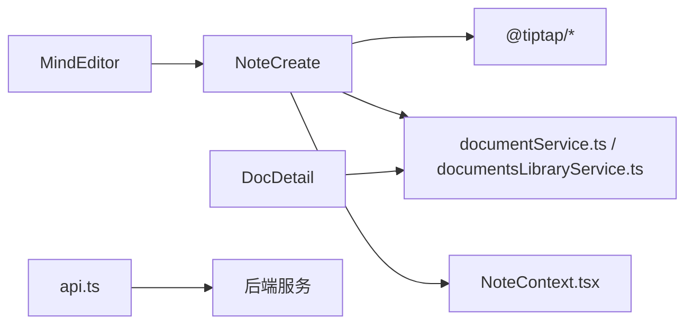

# 内容处理机制

<cite>
**本文引用的文件**
- [README.md](file://README.md)
- [api.ts](file://src/app/services/api.ts)
- [documentService.ts](file://src/app/services/documentService.ts)
- [documentsLibraryService.ts](file://src/app/services/documentsLibraryService.ts)
- [NoteContext.tsx](file://src/app/components/context/NoteContext.tsx)
- [TextSelectionMenu.tsx](file://src/app/components/TextSelectionMenu.tsx)
- [NoteCreate.tsx](file://src/app/pages/NoteCreate.tsx)
- [DocumentDetail.tsx](file://src/app/pages/DocumentDetail.tsx)
- [MindmapEditor.tsx](file://src/app/components/MindmapEditor.tsx)
</cite>

## 目录
1. [简介](#简介)
2. [项目结构](#项目结构)
3. [核心组件](#核心组件)
4. [架构总览](#架构总览)
5. [详细组件分析](#详细组件分析)
6. [依赖关系分析](#依赖关系分析)
7. [性能考量](#性能考量)
8. [故障排查指南](#故障排查指南)
9. [结论](#结论)
10. [附录](#附录)

## 简介
本文件系统性梳理该笔记应用前端的内容处理机制，覆盖富文本内容的序列化与反序列化、HTML/Markdown/结构化数据的转换与标准化、内容验证与安全过滤、多模态内容（图片、链接、媒体）的处理、编辑的撤销重做与版本控制、压缩与存储优化、以及迁移备份与数据完整性保障等。文档面向不同技术背景读者，既提供高层架构视图，也包含代码级细节与可视化图示。

## 项目结构
前端采用模块化组织，围绕“服务层-上下文-页面组件-工具函数”的分层设计：
- 服务层：统一通过 API 封装访问后端接口，负责认证、拦截器、错误翻译与重试。
- 上下文层：NoteContext 提供笔记的本地/远程状态管理、合并与离线同步。
- 页面与组件：NoteCreate、DocumentDetail 等页面承载富文本编辑与文档详情展示；MindmapEditor 提供思维导图编辑；TextSelectionMenu 提供选区快捷操作。
- 工具函数：内容清洗、标签处理、JSON 文本提取、HTML 序列化等。

**图表来源**
- [api.ts:36-127](file://src/app/services/api.ts#L36-L127)
- [documentService.ts:8-47](file://src/app/services/documentService.ts#L8-L47)
- [documentsLibraryService.ts:38-93](file://src/app/services/documentsLibraryService.ts#L38-L93)
- [NoteContext.tsx:89-218](file://src/app/components/context/NoteContext.tsx#L89-L218)
- [NoteCreate.tsx:1-120](file://src/app/pages/NoteCreate.tsx#L1-L120)
- [DocumentDetail.tsx:171-231](file://src/app/pages/DocumentDetail.tsx#L171-L231)
- [MindmapEditor.tsx:31-52](file://src/app/components/MindmapEditor.tsx#L31-L52)
- [TextSelectionMenu.tsx:52-76](file://src/app/components/TextSelectionMenu.tsx#L52-L76)

**章节来源**
- [README.md:1-41](file://README.md#L1-L41)
- [api.ts:36-127](file://src/app/services/api.ts#L36-L127)
- [NoteContext.tsx:89-218](file://src/app/components/context/NoteContext.tsx#L89-L218)

## 核心组件
- 富文本编辑与序列化：基于 Tiptap 的编辑器，支持自定义节点（TagChip、TableBlock、MindmapBlock），提供 HTML/JSON 序列化与反序列化能力。
- 文档解析与结构化：文档上传解析返回结构化文本与元数据；文档详情页支持从 JSON 中提取可读文本并进行结构化摘要渲染。
- 笔记上下文与离线同步：本地持久化与云端合并，支持离线创建、本地标记与上线自动同步。
- 多模态内容：图片、链接、表格、思维导图等通过自定义节点与事件桥接实现。
- 内容验证与安全：HTML 清洗、标签处理、JSON 解析与路径提取、错误翻译与兜底提示。

**章节来源**
- [NoteCreate.tsx:232-263](file://src/app/pages/NoteCreate.tsx#L232-L263)
- [NoteCreate.tsx:270-330](file://src/app/pages/NoteCreate.tsx#L270-L330)
- [NoteCreate.tsx:443-659](file://src/app/pages/NoteCreate.tsx#L443-L659)
- [DocumentDetail.tsx:31-138](file://src/app/pages/DocumentDetail.tsx#L31-L138)
- [NoteContext.tsx:95-146](file://src/app/components/context/NoteContext.tsx#L95-L146)
- [NoteContext.tsx:191-210](file://src/app/components/context/NoteContext.tsx#L191-L210)

## 架构总览
整体流程：用户在页面组件中进行富文本编辑与多模态插入，内容经由服务层与后端交互；上下文层负责本地/远程状态合并与离线同步；文档详情页对结构化数据进行解析与展示。

**图表来源**
- [NoteCreate.tsx:1-120](file://src/app/pages/NoteCreate.tsx#L1-L120)
- [NoteCreate.tsx:232-263](file://src/app/pages/NoteCreate.tsx#L232-L263)
- [api.ts:36-127](file://src/app/services/api.ts#L36-L127)
- [NoteContext.tsx:152-218](file://src/app/components/context/NoteContext.tsx#L152-L218)
- [documentService.ts:15-46](file://src/app/services/documentService.ts#L15-L46)

## 详细组件分析

### 富文本序列化与反序列化（HTML/JSON）
- HTML 序列化：将纯文本段落转换为最小 HTML 片段，便于编辑器渲染与跨平台传输。
- 反序列化与清洗：支持从 HTML 中剥离遗留的纯文本标签令牌，保留自定义 TagChip 节点；对空段落进行清理。
- 自定义节点：
  - TagChip：内联原子节点，渲染为带样式的标签徽章，避免与用户手写文本混淆。
  - TableBlock：只读块级节点，存储 AI 生成的表格数据，DOM 渲染避免重复实例。
  - MindmapBlock：块级节点，内置 SVG 预览与编辑入口，通过自定义事件桥接编辑器更新。

**图表来源**
- [NoteCreate.tsx:232-263](file://src/app/pages/NoteCreate.tsx#L232-L263)
- [NoteCreate.tsx:270-330](file://src/app/pages/NoteCreate.tsx#L270-L330)
- [NoteCreate.tsx:443-659](file://src/app/pages/NoteCreate.tsx#L443-L659)

**章节来源**
- [NoteCreate.tsx:232-263](file://src/app/pages/NoteCreate.tsx#L232-L263)
- [NoteCreate.tsx:270-330](file://src/app/pages/NoteCreate.tsx#L270-L330)
- [NoteCreate.tsx:443-659](file://src/app/pages/NoteCreate.tsx#L443-L659)

### Markdown 处理与结构化数据格式
- 文档详情页支持从 JSON 中提取可读文本：优先路径包括 content/text/textContent，其次回退到 ProseMirror 结构化树，最后广度搜索目标键。
- 对于疑似 JSON 字符串，进行二次解析与美化输出，便于阅读与编辑。
- 结构化摘要渲染：将存储的 JSON 摘要解析为结构化字段（类型、关键词、要点、质量评分等）并分组展示。

**图表来源**
- [DocumentDetail.tsx:31-138](file://src/app/pages/DocumentDetail.tsx#L31-L138)

**章节来源**
- [DocumentDetail.tsx:31-138](file://src/app/pages/DocumentDetail.tsx#L31-L138)

### 内容验证与安全过滤
- HTML 清洗：剥离样式与脚本标签、替换实体字符、清理多余空白，确保渲染安全与一致性。
- 标签处理：兼容数组、字符串与 JSON 字符串数组，支持多种分隔符与空白处理，避免非法标签注入。
- 错误翻译：对网络异常与后端错误进行本地化提示，屏蔽底层 SQL/JSON 错误细节。
- 本地兜底：当无 Token 时，笔记写入本地存储并标记待同步，上线后自动补发。

**图表来源**
- [NoteContext.tsx:30-87](file://src/app/components/context/NoteContext.tsx#L30-L87)
- [NoteContext.tsx:224-272](file://src/app/components/context/NoteContext.tsx#L224-L272)
- [api.ts:108-125](file://src/app/services/api.ts#L108-L125)

**章节来源**
- [NoteContext.tsx:30-87](file://src/app/components/context/NoteContext.tsx#L30-L87)
- [NoteContext.tsx:224-272](file://src/app/components/context/NoteContext.tsx#L224-L272)
- [api.ts:108-125](file://src/app/services/api.ts#L108-L125)

### 多模态内容处理（图片、链接、媒体）
- 图片插入：通过 Tiptap Image 扩展实现，结合页面工具栏与选择菜单，支持键盘栏风格的格式工具条。
- 链接管理：编辑器内置链接扩展，配合 Markdown 渲染组件对 a 标签进行样式定制。
- 表格与思维导图：TableBlock 与 MindmapBlock 自定义节点，MindmapBlock 通过窗口事件桥接编辑器更新，确保双向一致。

**图表来源**
- [NoteCreate.tsx:41-228](file://src/app/pages/NoteCreate.tsx#L41-L228)
- [MindmapEditor.tsx:31-147](file://src/app/components/MindmapEditor.tsx#L31-L147)

**章节来源**
- [NoteCreate.tsx:41-228](file://src/app/pages/NoteCreate.tsx#L41-L228)
- [MindmapEditor.tsx:31-147](file://src/app/components/MindmapEditor.tsx#L31-L147)

### 内容编辑的撤销重做、版本控制与冲突解决
- 撤销重做：基于 Tiptap 的命令链与状态机，通过 chain().focus().toggleHeading()/toggleBold() 等 API 实现细粒度撤销重做。
- 版本控制：文档库服务提供更新接口，支持标题与内容的增量更新；MindmapBlock 通过节点属性记录版本标识，编辑后通过事件桥接刷新。
- 冲突解决：NoteContext 在本地与云端合并时，以服务端为主、本地为辅，避免重复与丢失；本地待同步标记确保上线后补齐。

**图表来源**
- [NoteCreate.tsx:67-100](file://src/app/pages/NoteCreate.tsx#L67-L100)
- [NoteCreate.tsx:110-149](file://src/app/pages/NoteCreate.tsx#L110-L149)
- [NoteContext.tsx:185-210](file://src/app/components/context/NoteContext.tsx#L185-L210)

**章节来源**
- [NoteCreate.tsx:67-100](file://src/app/pages/NoteCreate.tsx#L67-L100)
- [NoteCreate.tsx:110-149](file://src/app/pages/NoteCreate.tsx#L110-L149)
- [NoteContext.tsx:185-210](file://src/app/components/context/NoteContext.tsx#L185-L210)

### 内容压缩、存储优化与传输效率
- 存储优化：MindmapBlock 使用 SVG 预览而非大图，减少渲染与传输成本；TagChip 采用轻量 DOM 节点，避免复杂 React 实例。
- 传输优化：文档上传采用 multipart/form-data，后端返回结构化文本与元数据，前端仅渲染必要字段；Markdown 渲染按需启用，避免全量解析。
- 离线优先：本地笔记以最小字段集存储，上线后批量同步，降低网络压力。

**章节来源**
- [NoteCreate.tsx:443-659](file://src/app/pages/NoteCreate.tsx#L443-L659)
- [documentService.ts:15-46](file://src/app/services/documentService.ts#L15-L46)
- [NoteContext.tsx:129-146](file://src/app/components/context/NoteContext.tsx#L129-L146)

### 内容迁移、备份恢复与数据完整性
- 迁移与备份：本地笔记以 JSON 形式持久化，包含必要字段与结构化数据；支持导出/导入（建议通过服务端接口或外部工具）。
- 恢复策略：登录后自动合并本地与云端，缺失项补齐；MindmapBlock 数据通过节点属性持久化，编辑器关闭后仍可恢复。
- 完整性保障：API 拦截器统一错误翻译与兜底；文档解析严格校验 JSON 结构与路径，避免渲染崩溃。

**章节来源**
- [NoteContext.tsx:95-146](file://src/app/components/context/NoteContext.tsx#L95-L146)
- [NoteContext.tsx:191-210](file://src/app/components/context/NoteContext.tsx#L191-L210)
- [DocumentDetail.tsx:85-138](file://src/app/pages/DocumentDetail.tsx#L85-L138)

## 依赖关系分析
- 组件耦合：NoteCreate 依赖 Tiptap 扩展与服务层；MindmapEditor 通过自定义事件与 NoteCreate 协作；DocumentDetail 依赖 documentsLibraryService 与 aiService。
- 外部依赖：Axios 作为 HTTP 客户端，Capacitor 用于原生平台适配；@tiptap/* 提供富文本核心能力。

**图表来源**
- [NoteCreate.tsx:1-30](file://src/app/pages/NoteCreate.tsx#L1-L30)
- [MindmapEditor.tsx:10-21](file://src/app/components/MindmapEditor.tsx#L10-L21)
- [DocumentDetail.tsx:1-10](file://src/app/pages/DocumentDetail.tsx#L1-L10)
- [api.ts:1-10](file://src/app/services/api.ts#L1-L10)

**章节来源**
- [NoteCreate.tsx:1-30](file://src/app/pages/NoteCreate.tsx#L1-L30)
- [MindmapEditor.tsx:10-21](file://src/app/components/MindmapEditor.tsx#L10-L21)
- [DocumentDetail.tsx:1-10](file://src/app/pages/DocumentDetail.tsx#L1-L10)
- [api.ts:1-10](file://src/app/services/api.ts#L1-L10)

## 性能考量
- 渲染性能：MindmapBlock 使用纯 DOM 渲染，避免 React 重复实例；TagChip 与 TableBlock 采用轻量节点，减少重排。
- 网络性能：批量同步本地笔记，避免频繁请求；文档上传采用流式表单，后端返回结构化文本，前端按需解析。
- 内存占用：HTML 清洗与 JSON 解析均限制深度与长度，避免大文档导致内存峰值过高。

## 故障排查指南
- 401 未授权：自动刷新 Token 并重试，失败则跳转登录页。
- 网络异常：统一提示“网络开小差了”，引导检查网络。
- 后端错误：屏蔽底层 SQL/JSON 细节，返回简洁错误信息。
- 文档上传失败：捕获错误 ID 与错误码，拼接友好提示；重复文档提示在 Web 端处理。

**章节来源**
- [api.ts:56-125](file://src/app/services/api.ts#L56-L125)
- [documentService.ts:36-45](file://src/app/services/documentService.ts#L36-L45)
- [documentsLibraryService.ts:49-82](file://src/app/services/documentsLibraryService.ts#L49-L82)

## 结论
该前端内容处理机制以 Tiptap 为核心，结合自定义节点与事件桥接，实现了富文本、结构化数据与多模态内容的统一管理；通过上下文层的本地/远程合并与离线同步，保障了用户体验与数据一致性；服务层的拦截器与错误翻译提升了健壮性与可用性。后续可在版本号管理、增量同步与缓存策略上进一步优化，以应对更大规模的数据与更复杂的协作场景。

## 附录
- 选区快捷菜单：在文本选区出现，提供“智能生成/校对/总结/生成脑图”等动作，支持防溢出布局与动画过渡。
- 思维导图编辑：全屏弹窗模式，支持缩放、添加分支、删除节点与文字编辑，保存后通过事件桥接刷新编辑器。

**章节来源**
- [TextSelectionMenu.tsx:52-276](file://src/app/components/TextSelectionMenu.tsx#L52-L276)
- [MindmapEditor.tsx:31-390](file://src/app/components/MindmapEditor.tsx#L31-L390)