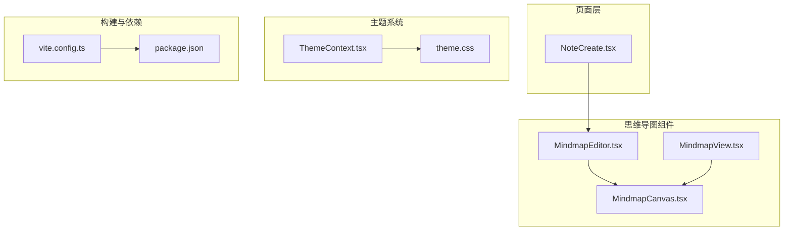
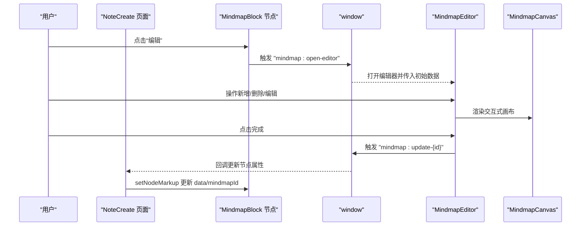
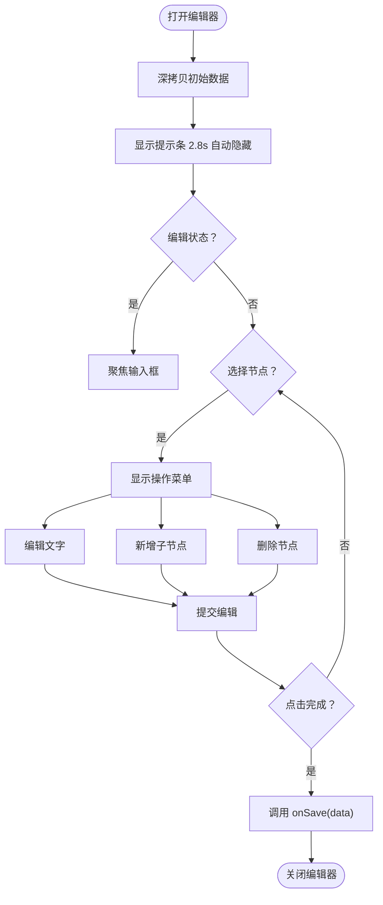
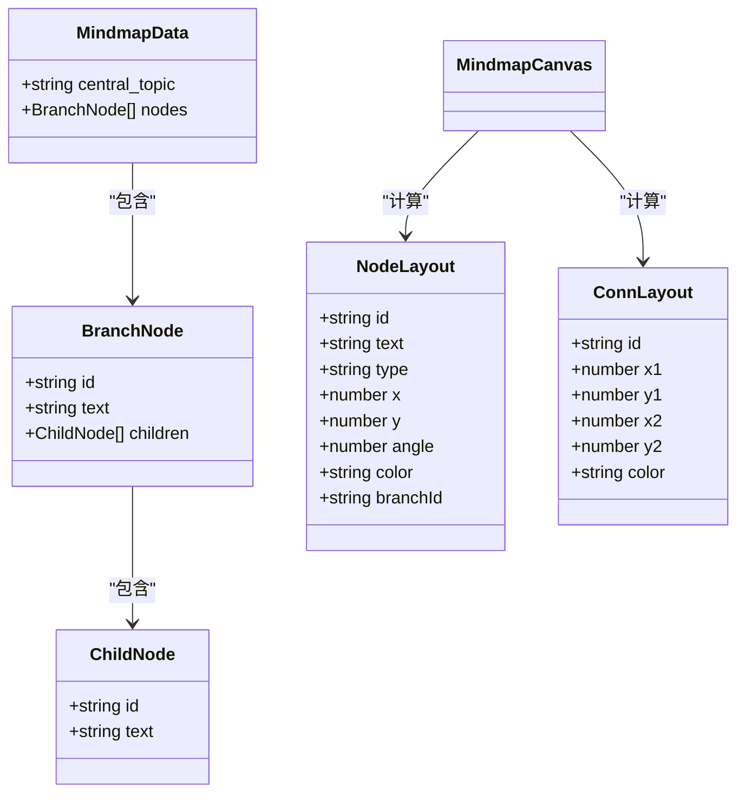
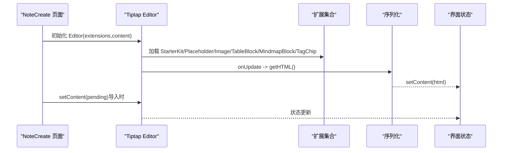
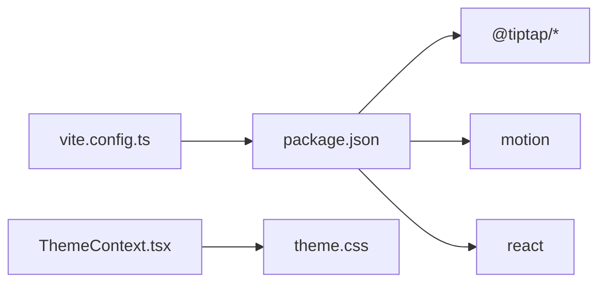

# 富文本编辑器

<cite>
**本文引用的文件**
- [MindmapEditor.tsx](file://src/app/components/MindmapEditor.tsx)
- [MindmapCanvas.tsx](file://src/app/components/MindmapCanvas.tsx)
- [MindmapView.tsx](file://src/app/components/MindmapView.tsx)
- [NoteCreate.tsx](file://src/app/pages/NoteCreate.tsx)
- [vite.config.ts](file://vite.config.ts)
- [package.json](file://package.json)
- [ThemeContext.tsx](file://src/app/components/context/ThemeContext.tsx)
- [theme.css](file://src/styles/theme.css)
- [utils.ts](file://src/app/components/ui/utils.ts)
</cite>

## 目录
1. [简介](#简介)
2. [项目结构](#项目结构)
3. [核心组件](#核心组件)
4. [架构总览](#架构总览)
5. [详细组件分析](#详细组件分析)
6. [依赖关系分析](#依赖关系分析)
7. [性能考量](#性能考量)
8. [故障排查指南](#故障排查指南)
9. [结论](#结论)
10. [附录](#附录)

## 简介
本技术文档聚焦于富文本编辑器与思维导图编辑器的实现与集成，涵盖以下要点：
- Tiptap 富文本编辑器的集成与配置，包括扩展开发与自定义节点
- 内容序列化、反序列化与格式转换机制
- 思维导图编辑器的完整实现：MindmapEditor、MindmapCanvas、MindmapView 组件设计
- 多模态内容处理：图片插入、链接管理与媒体嵌入
- 编辑器性能优化、插件开发与主题定制最佳实践
- 内容验证、安全过滤与兼容性处理

## 项目结构
本项目采用模块化组织，富文本与思维导图相关代码主要位于 src/app/components 与 src/app/pages 中；主题系统通过上下文与 CSS 变量实现；构建工具通过 Vite 配置进行依赖去重与预打包。

图表来源
- [NoteCreate.tsx](file://src/app/pages/NoteCreate.tsx)
- [MindmapEditor.tsx](file://src/app/components/MindmapEditor.tsx)
- [MindmapCanvas.tsx](file://src/app/components/MindmapCanvas.tsx)
- [MindmapView.tsx](file://src/app/components/MindmapView.tsx)
- [ThemeContext.tsx](file://src/app/components/context/ThemeContext.tsx)
- [theme.css](file://src/styles/theme.css)
- [vite.config.ts](file://vite.config.ts)
- [package.json](file://package.json)

章节来源
- [NoteCreate.tsx](file://src/app/pages/NoteCreate.tsx)
- [MindmapEditor.tsx](file://src/app/components/MindmapEditor.tsx)
- [MindmapCanvas.tsx](file://src/app/components/MindmapCanvas.tsx)
- [MindmapView.tsx](file://src/app/components/MindmapView.tsx)
- [ThemeContext.tsx](file://src/app/components/context/ThemeContext.tsx)
- [theme.css](file://src/styles/theme.css)
- [vite.config.ts](file://vite.config.ts)
- [package.json](file://package.json)

## 核心组件
- 思维导图编辑器入口：MindmapEditor 提供全屏弹窗式交互，支持缩放、提示、底部编辑面板等
- 思维导图画布：MindmapCanvas 负责布局计算、连接线绘制、节点渲染与动作菜单
- 思维导图只读视图：MindmapView 用于在结果卡片中展示紧凑的预览
- 富文本编辑器：NoteCreate 页面集成 Tiptap，包含自定义扩展（MindmapBlock、TagChip、TableBlock）、图片与占位符扩展、内容序列化与反序列化逻辑

章节来源
- [MindmapEditor.tsx](file://src/app/components/MindmapEditor.tsx)
- [MindmapCanvas.tsx](file://src/app/components/MindmapCanvas.tsx)
- [MindmapView.tsx](file://src/app/components/MindmapView.tsx)
- [NoteCreate.tsx](file://src/app/pages/NoteCreate.tsx)

## 架构总览
富文本与思维导图的交互通过自定义节点与事件桥接实现：MindmapBlock 在编辑器中以块级节点呈现，内置“编辑”按钮触发窗口事件，打开 MindmapEditor 进行交互式编辑；MindmapEditor 修改数据后通过自定义事件回传给编辑器，更新节点属性。

图表来源
- [NoteCreate.tsx](file://src/app/pages/NoteCreate.tsx)
- [MindmapEditor.tsx](file://src/app/components/MindmapEditor.tsx)
- [MindmapCanvas.tsx](file://src/app/components/MindmapCanvas.tsx)

## 详细组件分析

### 思维导图编辑器（MindmapEditor）
- 全屏弹窗式交互，支持缩放控制、提示条、底部编辑面板
- 数据同步：打开时深拷贝初始数据，关闭时清空状态
- 文本编辑：底部弹出式输入框，支持 Enter 提交、Esc 取消
- 操作菜单：点击节点显示操作菜单，支持编辑、新增子节点、删除
- 保存回调：调用 onSave 返回最新数据

图表来源
- [MindmapEditor.tsx](file://src/app/components/MindmapEditor.tsx)

章节来源
- [MindmapEditor.tsx](file://src/app/components/MindmapEditor.tsx)

### 思维导图画布（MindmapCanvas）
- 数据模型：MindmapData 包含中心主题与分支节点数组，分支节点包含子节点数组
- 布局算法：根据节点数量与角度分布计算节点坐标，连接线使用二次贝塞尔曲线
- 渲染策略：SVG 绘制，支持渐变背景、阴影滤镜、动画入场
- 交互能力：可选编辑模式，支持节点点击、中央节点点击、动作菜单
- 响应式：支持紧凑模式与背景网格

图表来源
- [MindmapCanvas.tsx](file://src/app/components/MindmapCanvas.tsx)

章节来源
- [MindmapCanvas.tsx](file://src/app/components/MindmapCanvas.tsx)

### 思维导图只读视图（MindmapView）
- 用于在 AI 结果卡片中展示紧凑的思维导图预览
- 直接复用 MindmapCanvas 的渲染逻辑，禁用编辑与紧凑模式

章节来源
- [MindmapView.tsx](file://src/app/components/MindmapView.tsx)

### 富文本编辑器（NoteCreate 页面 + Tiptap）
- 编辑器初始化：使用 @tiptap/core Editor，避免 @tiptap/react 引入导致的重复 React 实例问题
- 扩展配置：StarterKit（标题级别限制、禁用代码块）、Placeholder、Image（允许内联与 Base64）、自定义 MindmapBlock、TagChip、TableBlock
- 内容序列化：onUpdate 中获取 HTML 并更新状态，忽略热更新期间的序列化错误
- 初始内容处理：支持从 HTML 或纯文本构造，剥离旧版注入的 #tag 片段，保留 TagChip 节点
- 插入标签：通过 ProseMirror schema API 直接插入 TagChip 节点，保证跨版本稳定性
- 图片与表格：启用 Image 扩展与 TableBlock，支持媒体嵌入与表格渲染

图表来源
- [NoteCreate.tsx](file://src/app/pages/NoteCreate.tsx)

章节来源
- [NoteCreate.tsx](file://src/app/pages/NoteCreate.tsx)

### 自定义扩展与节点
- MindmapBlock：块级节点，存储数据为 JSON 字符串，支持编辑按钮与窗口事件桥接
- TagChip：标签芯片节点，插入时使用 schema API，避免 insertContent 的版本不一致问题
- TableBlock：表格块节点，返回 DOM 包装器，便于在编辑器中渲染表格

章节来源
- [NoteCreate.tsx](file://src/app/pages/NoteCreate.tsx)

## 依赖关系分析
- 构建与依赖去重：vite.config.ts 对 react、motion、@tiptap/* 进行 dedupe 与 optimizeDeps 预打包，避免“无效钩子调用”与重复实例问题
- 依赖声明：package.json 明确 tiptap 生态与 motion、react 等核心依赖
- 主题系统：ThemeContext 管理主题切换，CSS 变量提供语义化颜色令牌，支持浅色/深色/系统三态

图表来源
- [vite.config.ts](file://vite.config.ts)
- [package.json](file://package.json)
- [ThemeContext.tsx](file://src/app/components/context/ThemeContext.tsx)
- [theme.css](file://src/styles/theme.css)

章节来源
- [vite.config.ts](file://vite.config.ts)
- [package.json](file://package.json)
- [ThemeContext.tsx](file://src/app/components/context/ThemeContext.tsx)
- [theme.css](file://src/styles/theme.css)

## 性能考量
- 依赖去重与预打包：通过 Vite 的 dedupe 与 optimizeDeps，确保单一 React 实例与关键包预构建，减少冷启动与运行时冲突
- 编辑器渲染优化：MindmapCanvas 使用 SVG 与动画库，合理使用 useMemo 计算布局，避免不必要的重渲染
- 内容序列化：在 onUpdate 中捕获 HTML，忽略热更新期间的异常，降低编辑过程中的抖动
- 主题切换：CSS 变量与 data-theme 属性切换，过渡动画时间统一，避免频繁重排

章节来源
- [vite.config.ts](file://vite.config.ts)
- [NoteCreate.tsx](file://src/app/pages/NoteCreate.tsx)
- [MindmapCanvas.tsx](file://src/app/components/MindmapCanvas.tsx)
- [ThemeContext.tsx](file://src/app/components/context/ThemeContext.tsx)

## 故障排查指南
- “无效钩子调用”或重复 React 实例问题
  - 症状：@tiptap/react 引入导致的 React 钩子调用异常
  - 解决：使用 @tiptap/core 单独初始化 Editor，避免重复 React 实例
  - 参考：NoteCreate 页面中 Editor 初始化与扩展配置
- 编辑器内容序列化异常
  - 症状：热更新期间 getHTML 抛错
  - 解决：在 onUpdate 中 try/catch 忽略异常，保证编辑体验稳定
- 标签注入与清理
  - 症状：旧版 #tag 注入到编辑器正文，影响显示
  - 解决：stripHashtagsFromHtml 临时隐藏 TagChip，再清理 #tag，最后恢复 TagChip
- 主题切换不生效
  - 症状：深浅色切换后样式未更新
  - 解决：ThemeContext 将 data-theme 应用到 html 根元素，CSS 变量随主题变化

章节来源
- [NoteCreate.tsx](file://src/app/pages/NoteCreate.tsx)
- [ThemeContext.tsx](file://src/app/components/context/ThemeContext.tsx)

## 结论
本项目通过 Tiptap 与自定义扩展实现了富文本编辑能力，结合 SVG 思维导图画布与事件桥接，提供了完整的思维导图编辑与预览流程。通过依赖去重、主题系统与序列化策略，兼顾了性能与可维护性。建议在后续迭代中持续关注扩展生态的版本演进与安全过滤策略的完善。

## 附录
- 多模态内容处理建议
  - 图片：启用 Image 扩展，支持 Base64 与内联；上传前进行大小与类型校验
  - 链接：使用 Tiptap 链接扩展，配合白名单与安全协议校验
  - 媒体嵌入：优先使用受控组件封装第三方嵌入（如 iframe），并设置 sandbox 与 CSP
- 插件开发最佳实践
  - 使用 @tiptap/core 开发自定义扩展，避免 @tiptap/react 带来的实例问题
  - 通过 schema API 直接插入节点，提升跨版本稳定性
  - 事件桥接采用 window CustomEvent，命名空间化（如 mindmap:update-{id}）
- 主题定制
  - 基于 CSS 变量与 data-theme 切换，提供浅色/深色/系统三态
  - 使用 Tailwind 与 @theme inline 语法，保持样式一致性与可维护性