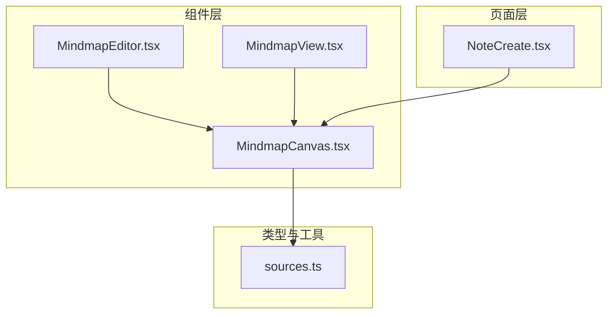
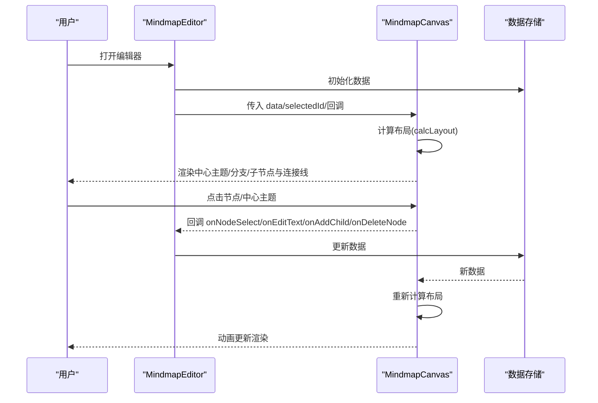
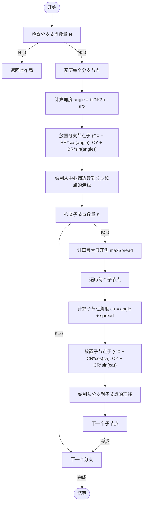
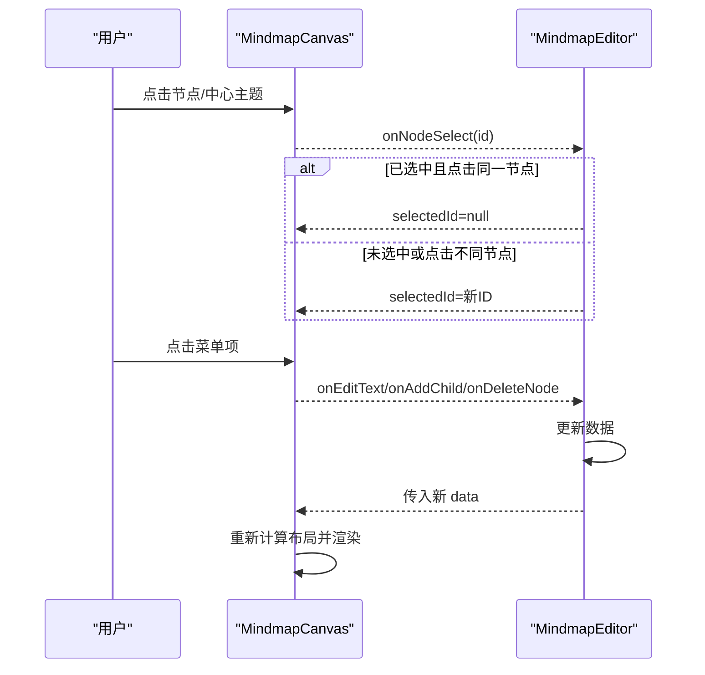
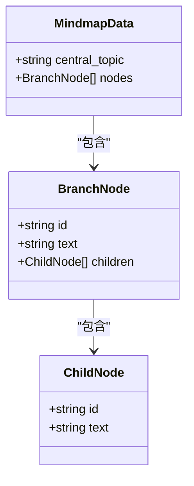
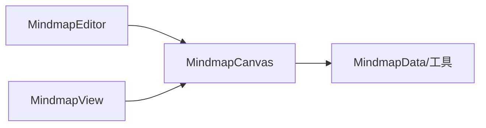

# 思维导图画布组件

<cite>
**本文引用的文件**
- [MindmapCanvas.tsx](file://src/app/components/MindmapCanvas.tsx)
- [MindmapEditor.tsx](file://src/app/components/MindmapEditor.tsx)
- [MindmapView.tsx](file://src/app/components/MindmapView.tsx)
- [NoteCreate.tsx](file://src/app/pages/NoteCreate.tsx)
- [sources.ts](file://src/app/types/sources.ts)
</cite>

## 目录
1. [简介](#简介)
2. [项目结构](#项目结构)
3. [核心组件](#核心组件)
4. [架构总览](#架构总览)
5. [详细组件分析](#详细组件分析)
6. [依赖分析](#依赖分析)
7. [性能考虑](#性能考虑)
8. [故障排查指南](#故障排查指南)
9. [结论](#结论)
10. [附录](#附录)

## 简介
本文件为“思维导图画布组件”的技术文档，聚焦于基于 SVG 的思维导图渲染与交互实现。内容覆盖：
- SVG 画布坐标系统与视口管理
- 节点布局算法（中心主题、分支、子节点）
- 连接线绘制机制（二次贝塞尔曲线）
- 节点渲染系统（中心主题、分支节点、子节点样式差异）
- 交互处理（选择、点击、动作菜单、文本编辑）
- 缩放与变换（编辑器中的缩放控制）
- 数据模型设计（节点 ID 生成、层级关系、数据结构优化）
- SVG 性能优化策略、渲染效率与响应式布局适配

## 项目结构
该组件位于前端应用的组件层，MindmapCanvas 为核心渲染组件，MindmapEditor 提供全屏编辑入口，MindmapView 提供只读预览。NoteCreate 页面中包含历史版本的原生 SVG 实现逻辑，可作为对比参考。

图表来源
- [MindmapCanvas.tsx:1-421](file://src/app/components/MindmapCanvas.tsx#L1-L421)
- [MindmapEditor.tsx:1-390](file://src/app/components/MindmapEditor.tsx#L1-L390)
- [MindmapView.tsx:1-20](file://src/app/components/MindmapView.tsx#L1-L20)
- [NoteCreate.tsx:469-649](file://src/app/pages/NoteCreate.tsx#L469-L649)
- [sources.ts:1-35](file://src/app/types/sources.ts#L1-L35)

章节来源
- [MindmapCanvas.tsx:1-421](file://src/app/components/MindmapCanvas.tsx#L1-L421)
- [MindmapEditor.tsx:1-390](file://src/app/components/MindmapEditor.tsx#L1-L390)
- [MindmapView.tsx:1-20](file://src/app/components/MindmapView.tsx#L1-L20)
- [NoteCreate.tsx:469-649](file://src/app/pages/NoteCreate.tsx#L469-L649)
- [sources.ts:1-35](file://src/app/types/sources.ts#L1-L35)

## 核心组件
- MindmapCanvas：负责数据到布局的计算、SVG 渲染、交互事件绑定、动作菜单与文本编辑触发。
- MindmapEditor：全屏编辑器，提供缩放控制、文本编辑底部面板、保存与关闭等。
- MindmapView：紧凑只读预览，用于 AI 结果卡片展示。
- NoteCreate：历史版本中包含原生 SVG 构建逻辑，便于理解坐标与连接线实现思路。

章节来源
- [MindmapCanvas.tsx:123-343](file://src/app/components/MindmapCanvas.tsx#L123-L343)
- [MindmapEditor.tsx:31-390](file://src/app/components/MindmapEditor.tsx#L31-L390)
- [MindmapView.tsx:13-19](file://src/app/components/MindmapView.tsx#L13-L19)
- [NoteCreate.tsx:469-649](file://src/app/pages/NoteCreate.tsx#L469-L649)

## 架构总览
MindmapCanvas 以纯函数组件形式接收 MindmapData，内部通过布局计算函数生成节点与连接线的布局数据，再使用 SVG 和 Framer Motion 进行渲染与动画。编辑器通过状态驱动数据变更，从而触发重新布局与渲染。

图表来源
- [MindmapCanvas.tsx:59-98](file://src/app/components/MindmapCanvas.tsx#L59-L98)
- [MindmapCanvas.tsx:123-174](file://src/app/components/MindmapCanvas.tsx#L123-L174)
- [MindmapEditor.tsx:32-147](file://src/app/components/MindmapEditor.tsx#L32-L147)

## 详细组件分析

### SVG 画布与坐标系统
- 视口与中心：画布尺寸固定，视口 viewBox 为正方形；中心点位于画布中心，半径常量定义了中心圆、分支圆与子节点圆的半径。
- 坐标系：采用二维笛卡尔坐标系，中心为原点，向右为 x 正方向，向下为 y 正方向。
- 视口管理：MindmapView 使用固定宽高比容器包裹，保证在不同设备上保持正方形显示。

章节来源
- [MindmapCanvas.tsx:38-43](file://src/app/components/MindmapCanvas.tsx#L38-L43)
- [MindmapView.tsx:15-16](file://src/app/components/MindmapView.tsx#L15-L16)

### 节点布局算法
- 中心主题节点：固定在中心位置，渲染为圆形，颜色采用渐变。
- 分支节点：围绕中心呈圆周分布，角度由分支数量决定，半径固定。
- 子节点：在每个分支的角度范围内按最大展开角均匀分布，半径固定。
- 展开角限制：子节点展开角受分支数量与最大展开比例限制，避免过度拥挤。
- 连接线：从中心圆边缘到分支节点起点，从分支到子节点终点，均采用二次贝塞尔曲线，轻微向中心弯曲，增强视觉引导。

图表来源
- [MindmapCanvas.tsx:59-98](file://src/app/components/MindmapCanvas.tsx#L59-L98)
- [MindmapCanvas.tsx:101-108](file://src/app/components/MindmapCanvas.tsx#L101-L108)

章节来源
- [MindmapCanvas.tsx:59-98](file://src/app/components/MindmapCanvas.tsx#L59-L98)
- [MindmapCanvas.tsx:101-108](file://src/app/components/MindmapCanvas.tsx#L101-L108)

### 连接线绘制机制
- 二次贝塞尔曲线：通过起止点与控制点构造曲线，控制点轻微朝中心偏移，形成内凹曲线，提升视觉连贯性。
- 动画：连接线采用路径长度动画，逐条延迟出现，增强进入感。
- 颜色与透明度：根据节点类型分配颜色，线条透明度随模式变化。

章节来源
- [MindmapCanvas.tsx:101-108](file://src/app/components/MindmapCanvas.tsx#L101-L108)
- [MindmapCanvas.tsx:210-225](file://src/app/components/MindmapCanvas.tsx#L210-L225)

### 节点渲染系统
- 中心主题节点：圆形，渐变填充，居中文字，选中时有虚线高亮环。
- 分支节点：椭圆形矩形，文字截断，选中时边框高亮与阴影增强。
- 子节点：更小的椭圆矩形，文字截断，选中时边框与阴影增强。
- 动画：节点入场采用弹性动画，延迟交错，增强层次感。
- 文本截断：根据节点类型设置不同的字符上限，避免溢出。

章节来源
- [MindmapCanvas.tsx:229-292](file://src/app/components/MindmapCanvas.tsx#L229-L292)
- [MindmapCanvas.tsx:294-324](file://src/app/components/MindmapCanvas.tsx#L294-L324)
- [MindmapCanvas.tsx:53-56](file://src/app/components/MindmapCanvas.tsx#L53-L56)

### 交互处理机制
- 节点选择：点击节点或中心主题触发选择回调，支持取消选择。
- 点击事件：SVG 画布点击用于取消选择；节点点击用于切换选择状态。
- 动作菜单：选中后弹出操作菜单，包含编辑、新增子节点、删除按钮，位置根据节点上下方自动调整。
- 文本编辑：点击编辑按钮打开底部面板，输入完成后提交，支持回车确认与 ESC 取消。
- 删除：删除分支或子节点，同时清理相关连接线。

图表来源
- [MindmapCanvas.tsx:135-149](file://src/app/components/MindmapCanvas.tsx#L135-L149)
- [MindmapCanvas.tsx:327-340](file://src/app/components/MindmapCanvas.tsx#L327-L340)
- [MindmapEditor.tsx:69-147](file://src/app/components/MindmapEditor.tsx#L69-L147)

章节来源
- [MindmapCanvas.tsx:135-149](file://src/app/components/MindmapCanvas.tsx#L135-L149)
- [MindmapCanvas.tsx:327-340](file://src/app/components/MindmapCanvas.tsx#L327-L340)
- [MindmapEditor.tsx:69-147](file://src/app/components/MindmapEditor.tsx#L69-L147)

### 缩放与变换功能
- 编辑器缩放：通过状态控制缩放级别，在容器上应用缩放变换，保持画布中心对齐。
- 缩放范围：限定缩放区间，提供放大、缩小与重置按钮。
- 视口管理：缩放通过外层容器的 transform 控制，不改变 SVG 内部坐标，仅影响显示区域。

章节来源
- [MindmapEditor.tsx:240-256](file://src/app/components/MindmapEditor.tsx#L240-L256)
- [MindmapEditor.tsx:258-281](file://src/app/components/MindmapEditor.tsx#L258-L281)

### 数据模型设计
- 数据结构：MindmapData 包含中心主题字符串与分支节点数组；分支节点包含子节点数组。
- 节点 ID：使用随机 ID 生成器，确保唯一性。
- 层级关系：通过分支节点的 children 字段表达层级；中心主题为根节点。
- 数据更新：编辑器通过深拷贝初始化数据，随后在回调中更新对应层级的文字或结构。

图表来源
- [MindmapCanvas.tsx:5-17](file://src/app/components/MindmapCanvas.tsx#L5-L17)
- [MindmapEditor.tsx:32-32](file://src/app/components/MindmapEditor.tsx#L32-L32)
- [MindmapCanvas.tsx:52-52](file://src/app/components/MindmapCanvas.tsx#L52-L52)

章节来源
- [MindmapCanvas.tsx:5-17](file://src/app/components/MindmapCanvas.tsx#L5-L17)
- [MindmapEditor.tsx:32-32](file://src/app/components/MindmapEditor.tsx#L32-L32)
- [MindmapCanvas.tsx:52-52](file://src/app/components/MindmapCanvas.tsx#L52-L52)

### 历史实现对比（原生 SVG）
- NoteCreate 中的历史实现展示了原生 SVG 构建流程：定义渐变、背景网格、中心主题与分支/子节点连线，以及文本标签。
- 对比意义：帮助理解当前基于 React/Framer Motion 的实现如何在保持相同视觉效果的同时获得更好的交互与动画体验。

章节来源
- [NoteCreate.tsx:469-649](file://src/app/pages/NoteCreate.tsx#L469-L649)

## 依赖分析
- 组件间依赖：MindmapEditor 依赖 MindmapCanvas；MindmapView 依赖 MindmapCanvas；两者通过 props 传递数据与回调。
- 外部库：使用 Framer Motion 进行动画与过渡；React 事件系统处理交互。
- 类型与工具：MindmapData 类型定义来自 MindmapCanvas；genId 工具函数来自 MindmapCanvas。

图表来源
- [MindmapEditor.tsx:16-20](file://src/app/components/MindmapEditor.tsx#L16-L20)
- [MindmapView.tsx:7-7](file://src/app/components/MindmapView.tsx#L7-L7)
- [MindmapCanvas.tsx:5-17](file://src/app/components/MindmapCanvas.tsx#L5-L17)

章节来源
- [MindmapEditor.tsx:16-20](file://src/app/components/MindmapEditor.tsx#L16-L20)
- [MindmapView.tsx:7-7](file://src/app/components/MindmapView.tsx#L7-L7)
- [MindmapCanvas.tsx:5-17](file://src/app/components/MindmapCanvas.tsx#L5-L17)

## 性能考虑
- 动画与渲染
  - 使用 Framer Motion 的路径长度动画与弹簧动画，减少不必要的重排与重绘。
  - 节点入场采用延迟交错，避免大量元素同时渲染造成的卡顿。
- SVG 优化
  - 使用二次贝塞尔曲线绘制连接线，路径简洁，渲染成本低。
  - 通过透明度与滤镜实现视觉效果，避免复杂阴影计算。
- 响应式布局
  - MindmapView 使用宽高比容器保证在不同设备上的正方形显示。
  - 编辑器通过外层容器缩放，不改变 SVG 内部坐标，降低复杂度。
- 数据更新
  - 使用 useMemo 缓存布局计算结果，仅在数据变化时重新计算。
  - 文本编辑与菜单弹出采用条件渲染，减少 DOM 节点数量。

章节来源
- [MindmapCanvas.tsx:133-133](file://src/app/components/MindmapCanvas.tsx#L133-L133)
- [MindmapCanvas.tsx:210-225](file://src/app/components/MindmapCanvas.tsx#L210-L225)
- [MindmapView.tsx:15-16](file://src/app/components/MindmapView.tsx#L15-L16)
- [MindmapEditor.tsx:240-256](file://src/app/components/MindmapEditor.tsx#L240-L256)

## 故障排查指南
- 无法选择节点
  - 检查是否处于只读模式（editable=false），编辑器需传入 editable=true。
  - 确认 onNodeSelect 回调已正确传入。
- 动作菜单不显示
  - 确认 selectedId 存在且非空；菜单根据选中节点位置自动调整上下方向。
- 文本编辑无效
  - 确认 onEditText 回调已正确传入；编辑完成后需调用提交逻辑。
- 缩放异常
  - 检查缩放范围是否超出限制；确认缩放状态在编辑器中被正确更新。
- 连接线不显示
  - 检查数据中是否存在分支节点与子节点；确认布局计算返回的连接线列表非空。

章节来源
- [MindmapCanvas.tsx:123-174](file://src/app/components/MindmapCanvas.tsx#L123-L174)
- [MindmapEditor.tsx:258-281](file://src/app/components/MindmapEditor.tsx#L258-L281)

## 结论
MindmapCanvas 通过清晰的数据模型、稳定的布局算法与流畅的动画系统，实现了高性能的思维导图渲染与交互体验。编辑器进一步增强了可用性，提供缩放、文本编辑与动作菜单等能力。整体架构模块化良好，易于扩展与维护。

## 附录
- 关键常量与工具
  - 视口尺寸、中心坐标、半径常量与颜色数组定义在组件内，便于统一管理。
  - ID 生成器与文本截断工具提供基础能力。
- 类型与工具
  - MindmapData 类型定义与工具函数位于 MindmapCanvas；其他类型定义位于 sources.ts。

章节来源
- [MindmapCanvas.tsx:38-49](file://src/app/components/MindmapCanvas.tsx#L38-L49)
- [MindmapCanvas.tsx:52-56](file://src/app/components/MindmapCanvas.tsx#L52-L56)
- [sources.ts:1-35](file://src/app/types/sources.ts#L1-L35)