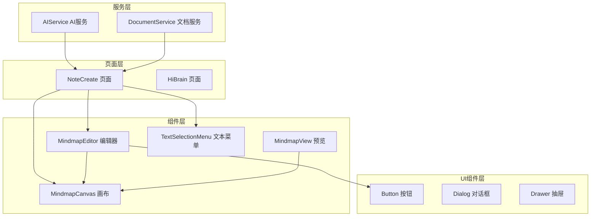
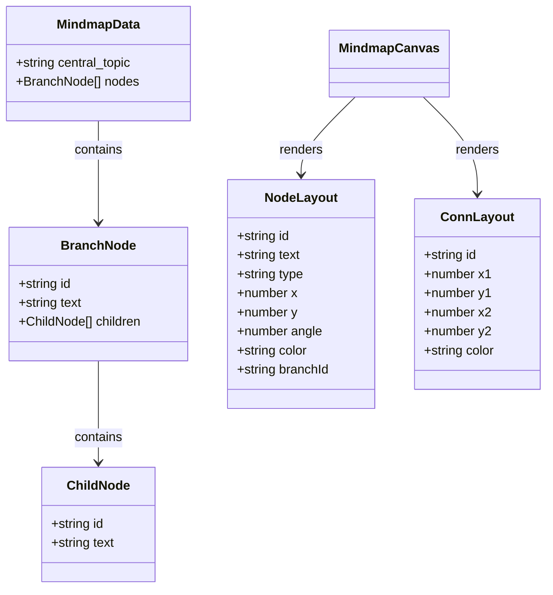
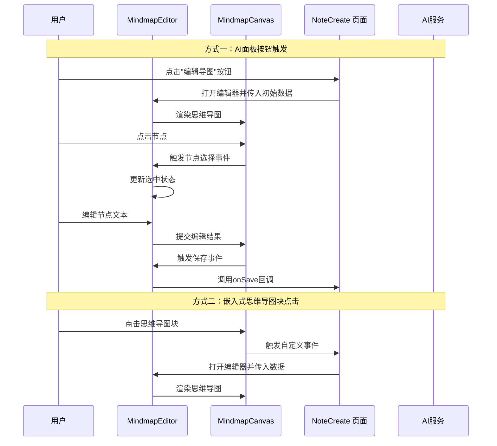
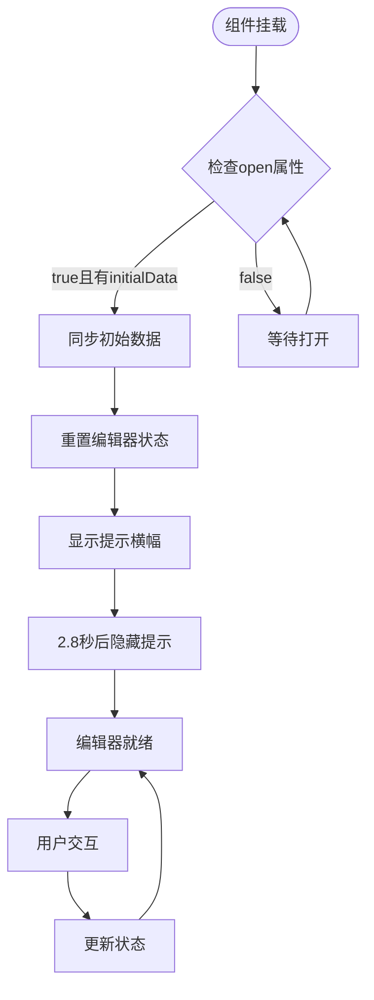
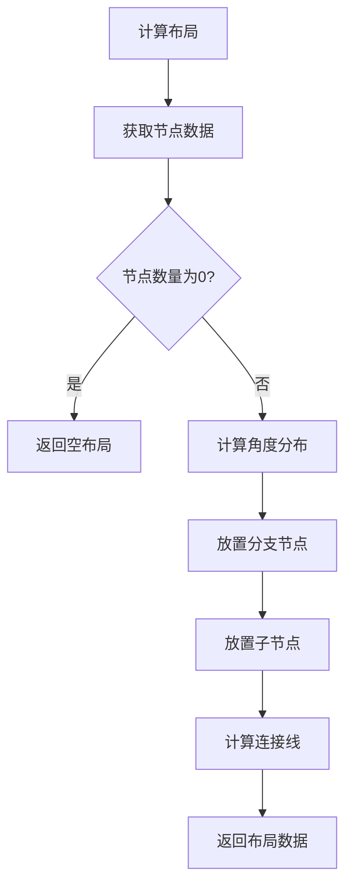
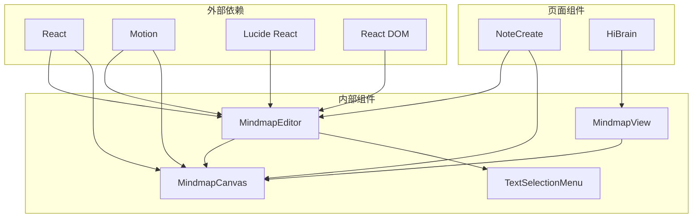

# 思维导图编辑器组件

<cite>
**本文档引用的文件**
- [MindmapEditor.tsx](file://src/app/components/MindmapEditor.tsx)
- [MindmapCanvas.tsx](file://src/app/components/MindmapCanvas.tsx)
- [MindmapView.tsx](file://src/app/components/MindmapView.tsx)
- [NoteCreate.tsx](file://src/app/pages/NoteCreate.tsx)
- [Button.tsx](file://src/app/components/ui/button.tsx)
</cite>

## 目录
1. [简介](#简介)
2. [项目结构](#项目结构)
3. [核心组件](#核心组件)
4. [架构概览](#架构概览)
5. [详细组件分析](#详细组件分析)
6. [依赖关系分析](#依赖关系分析)
7. [性能考虑](#性能考虑)
8. [故障排除指南](#故障排除指南)
9. [结论](#结论)

## 简介

MindmapEditor 是一个全屏门户模态思维导图编辑器组件，为用户提供直观的思维导图创建和编辑体验。该组件支持两种入口方式：AI面板的"编辑导图"按钮触发和嵌入式思维导图块的点击触发。编辑器采用React Hooks和Motion进行状态管理，提供流畅的动画效果和响应式的用户界面。

## 项目结构

思维导图编辑器组件位于应用的组件层，与页面层和UI组件层协同工作：

**图表来源**
- [MindmapEditor.tsx:1-390](file://src/app/components/MindmapEditor.tsx#L1-L390)
- [MindmapCanvas.tsx:1-421](file://src/app/components/MindmapCanvas.tsx#L1-L421)
- [NoteCreate.tsx:1180-1379](file://src/app/pages/NoteCreate.tsx#L1180-L1379)

**章节来源**
- [MindmapEditor.tsx:1-390](file://src/app/components/MindmapEditor.tsx#L1-L390)
- [MindmapCanvas.tsx:1-421](file://src/app/components/MindmapCanvas.tsx#L1-L421)
- [NoteCreate.tsx:1180-1379](file://src/app/pages/NoteCreate.tsx#L1180-L1379)

## 核心组件

### MindmapEditor 组件

MindmapEditor 是整个思维导图编辑系统的核心组件，负责管理编辑器的状态、生命周期和事件处理。

#### 主要特性

- **全屏门户模态设计**：使用React Portal创建独立的编辑器界面
- **双入口支持**：支持AI面板按钮和嵌入式思维导图块两种打开方式
- **实时数据同步**：通过props和回调函数实现数据双向绑定
- **丰富的交互反馈**：包含提示横幅、动画效果和状态指示

#### 状态管理

组件维护以下关键状态：

| 状态名称 | 类型 | 默认值 | 用途 |
|---------|------|--------|------|
| data | MindmapData | `{ central_topic: '', nodes: [] }` | 思维导图数据源 |
| selectedId | string \| null | null | 当前选中的节点ID |
| editingId | string \| null | null | 正在编辑的节点ID |
| editText | string | '' | 编辑框中的文本内容 |
| zoom | number | 0.9 | 缩放级别（0.6-1.4） |
| showTip | boolean | true | 是否显示提示横幅 |

**章节来源**
- [MindmapEditor.tsx:31-52](file://src/app/components/MindmapEditor.tsx#L31-L52)
- [MindmapEditor.tsx:68-147](file://src/app/components/MindmapEditor.tsx#L68-L147)

### MindmapCanvas 组件

MindmapCanvas 负责渲染思维导图的SVG可视化界面，包含所有节点、连接线和交互元素。

#### 数据结构

**图表来源**
- [MindmapCanvas.tsx:5-17](file://src/app/components/MindmapCanvas.tsx#L5-L17)
- [MindmapCanvas.tsx:20-35](file://src/app/components/MindmapCanvas.tsx#L20-L35)

**章节来源**
- [MindmapCanvas.tsx:14-98](file://src/app/components/MindmapCanvas.tsx#L14-L98)

## 架构概览

思维导图编辑器采用分层架构设计，确保组件间的职责分离和松耦合：

**图表来源**
- [MindmapEditor.tsx:4-8](file://src/app/components/MindmapEditor.tsx#L4-L8)
- [NoteCreate.tsx:507-511](file://src/app/pages/NoteCreate.tsx#L507-L511)
- [NoteCreate.tsx:1183-1188](file://src/app/pages/NoteCreate.tsx#L1183-L1188)

## 详细组件分析

### MindmapEditor 组件详解

#### 入口点设计

编辑器支持两种主要的入口方式：

1. **AI面板按钮触发**：通过window.CustomEvent传递mindmapId和data
2. **嵌入式思维导图块点击**：通过编辑按钮触发自定义事件

#### 生命周期管理

**图表来源**
- [MindmapEditor.tsx:44-59](file://src/app/components/MindmapEditor.tsx#L44-L59)
- [MindmapEditor.tsx:149-169](file://src/app/components/MindmapEditor.tsx#L149-L169)

#### 核心功能实现

##### 数据同步机制

编辑器通过以下方式实现数据同步：

1. **初始化同步**：当open为true且存在initialData时，深拷贝初始数据
2. **实时更新**：通过setData函数更新思维导图数据
3. **保存回调**：调用onSave回调函数返回最新数据

##### 节点操作功能

| 操作类型 | 方法 | 功能描述 | 触发条件 |
|---------|------|----------|----------|
| 文本编辑 | handleEditText | 打开文本编辑底部面板 | 点击节点操作菜单的"编辑"按钮 |
| 添加子节点 | handleAddChild | 在指定节点下添加子节点 | 点击操作菜单的"+"按钮 |
| 删除节点 | handleDelete | 删除指定节点及其子节点 | 点击操作菜单的"×"按钮 |
| 保存编辑 | handleSave | 触发保存操作 | 点击顶部工具栏的"完成"按钮 |

**章节来源**
- [MindmapEditor.tsx:69-147](file://src/app/components/MindmapEditor.tsx#L69-L147)

### MindmapCanvas 组件详解

#### 布局算法

MindmapCanvas采用极坐标布局算法计算节点位置：

**图表来源**
- [MindmapCanvas.tsx:59-98](file://src/app/components/MindmapCanvas.tsx#L59-L98)

#### 交互设计

组件提供完整的节点交互功能：

1. **节点选择**：点击节点高亮显示并显示操作菜单
2. **文本编辑**：通过操作菜单触发编辑模式
3. **节点添加**：支持在分支节点上添加子节点
4. **节点删除**：保护中央节点，允许删除分支和子节点

**章节来源**
- [MindmapCanvas.tsx:139-167](file://src/app/components/MindmapCanvas.tsx#L139-L167)

### UI交互设计

#### 顶部工具栏

顶部工具栏包含以下元素：

- **关闭按钮**：点击调用onClose回调
- **标题区域**：显示"编辑思维导图"和统计信息
- **保存按钮**：点击调用onSave回调，保存当前编辑结果

#### 提示横幅

首次打开编辑器时显示提示横幅，包含以下信息：
- 节点点击操作说明
- 编辑、添加、删除操作的快捷键提示

#### 缩放控件

提供三个缩放控制按钮：
- 放大（ZoomIn）：增加缩放级别
- 缩小（ZoomOut）：减少缩放级别  
- 重置（RotateCcw）：恢复默认缩放级别

#### 浮动按钮

"添加主节点"浮动按钮始终可见，支持快速添加新的分支节点。

**章节来源**
- [MindmapEditor.tsx:176-300](file://src/app/components/MindmapEditor.tsx#L176-L300)

## 依赖关系分析

### 组件间依赖

**图表来源**
- [MindmapEditor.tsx:10-20](file://src/app/components/MindmapEditor.tsx#L10-L20)
- [MindmapCanvas.tsx:1-3](file://src/app/components/MindmapCanvas.tsx#L1-L3)

### 外部依赖分析

| 依赖包 | 版本 | 用途 | 性能影响 |
|-------|------|------|----------|
| react | 最新版本 | 核心框架 | 高 |
| motion/react | 最新版本 | 动画效果 | 中等 |
| lucide-react | 最新版本 | 图标组件 | 低 |
| react-dom | 最新版本 | DOM渲染 | 高 |

**章节来源**
- [MindmapEditor.tsx:10-15](file://src/app/components/MindmapEditor.tsx#L10-L15)
- [MindmapCanvas.tsx:1-3](file://src/app/components/MindmapCanvas.tsx#L1-L3)

## 性能考虑

### 渲染优化

1. **虚拟DOM优化**：使用React.memo和useMemo避免不必要的重新渲染
2. **动画性能**：Motion组件提供硬件加速的动画效果
3. **SVG渲染**：MindmapCanvas使用SVG进行高效渲染

### 内存管理

1. **状态清理**：组件卸载时自动清理定时器和事件监听器
2. **引用优化**：使用useRef存储DOM引用，避免重复查询
3. **回调缓存**：useCallback缓存事件处理器，防止函数重建

### 用户体验优化

1. **即时反馈**：所有用户操作都有即时视觉反馈
2. **无障碍支持**：支持键盘导航和屏幕阅读器
3. **响应式设计**：适配不同屏幕尺寸和设备

## 故障排除指南

### 常见问题及解决方案

| 问题类型 | 症状 | 可能原因 | 解决方案 |
|---------|------|----------|----------|
| 编辑器无法打开 | 点击按钮无反应 | 事件监听器未正确设置 | 检查window.addEventListener调用 |
| 数据不更新 | 编辑后数据未保存 | onSave回调未正确实现 | 确保onSave函数正确处理数据 |
| 节点选择异常 | 点击节点无响应 | onNodeSelect回调未设置 | 验证回调函数的正确性 |
| 动画卡顿 | 缩放或切换时动画不流畅 | 性能不足或过度渲染 | 优化组件结构和减少重渲染 |

### 调试技巧

1. **开发者工具**：使用React DevTools检查组件状态
2. **日志输出**：在关键函数中添加console.log进行调试
3. **性能分析**：使用浏览器性能面板分析渲染性能

**章节来源**
- [NoteCreate.tsx:1183-1191](file://src/app/pages/NoteCreate.tsx#L1183-L1191)
- [MindmapEditor.tsx:62-66](file://src/app/components/MindmapEditor.tsx#L62-L66)

## 结论

MindmapEditor编辑器组件是一个功能完整、设计精良的思维导图编辑解决方案。它通过清晰的架构设计、高效的性能优化和优秀的用户体验，为用户提供了直观易用的思维导图编辑功能。

组件的主要优势包括：

1. **灵活的入口设计**：支持多种触发方式，适应不同的使用场景
2. **完整的交互功能**：提供节点选择、文本编辑、节点添加和删除等核心功能
3. **优秀的性能表现**：通过合理的状态管理和渲染优化，确保流畅的用户体验
4. **良好的扩展性**：清晰的组件结构便于后续功能扩展和维护

该组件为整个笔记应用提供了强大的思维导图能力，是现代Web应用中思维导图功能的优秀实现范例。