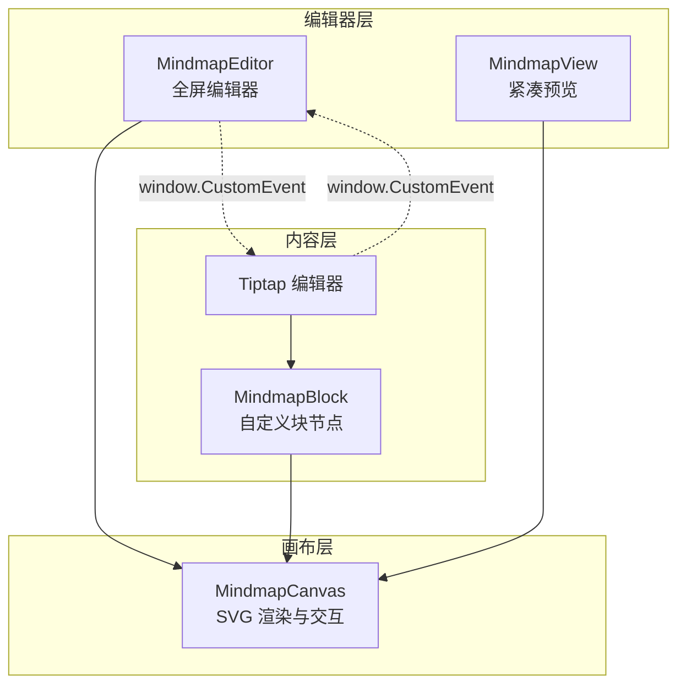
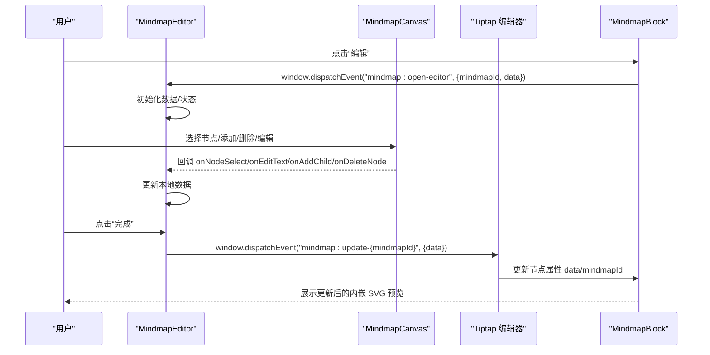
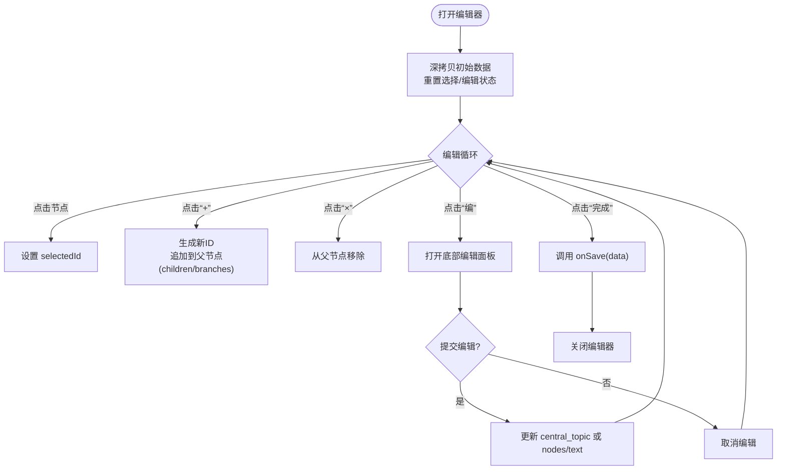
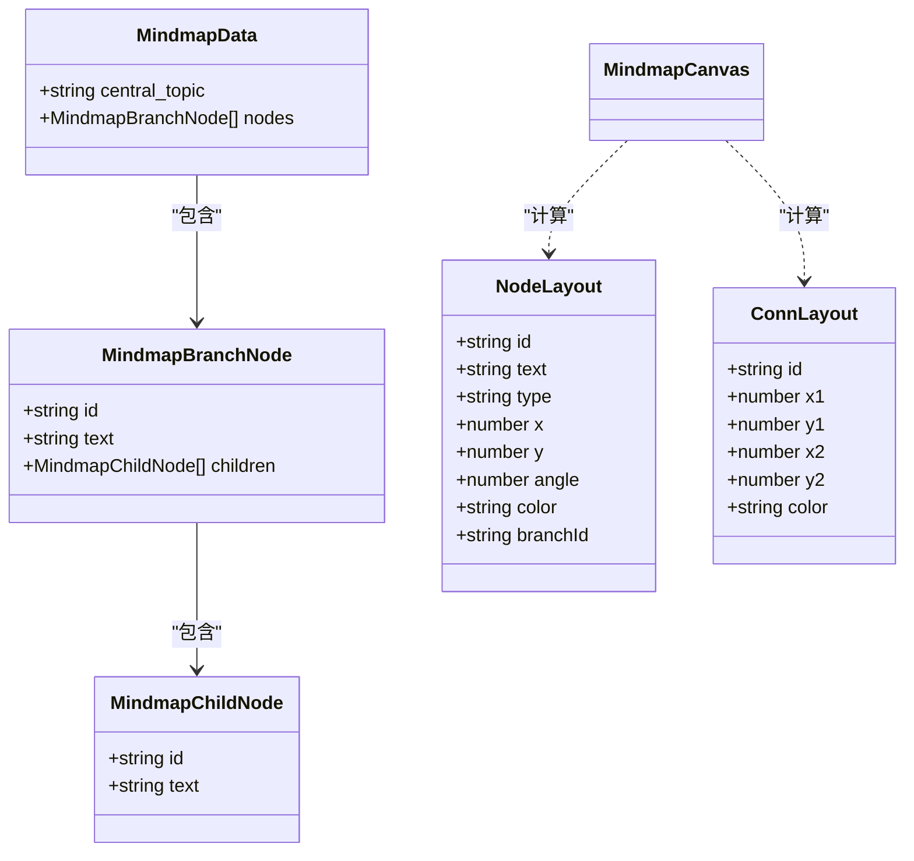
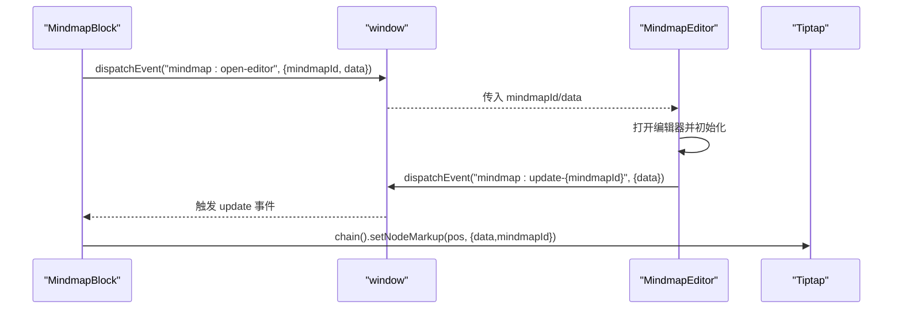
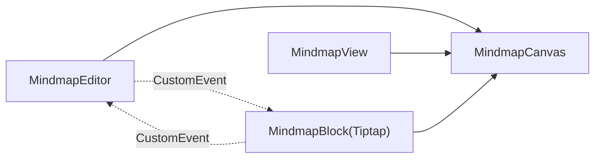

# 思维导图编辑系统

<cite>
**本文引用的文件列表**
- [MindmapEditor.tsx](file://src/app/components/MindmapEditor.tsx)
- [MindmapCanvas.tsx](file://src/app/components/MindmapCanvas.tsx)
- [MindmapView.tsx](file://src/app/components/MindmapView.tsx)
- [NoteCreate.tsx](file://src/app/pages/NoteCreate.tsx)
- [README.md](file://README.md)
</cite>

## 目录
1. [简介](#简介)
2. [项目结构](#项目结构)
3. [核心组件](#核心组件)
4. [架构总览](#架构总览)
5. [组件详解](#组件详解)
6. [依赖关系分析](#依赖关系分析)
7. [性能与内存优化](#性能与内存优化)
8. [故障排查指南](#故障排查指南)
9. [结论](#结论)
10. [附录](#附录)

## 简介
本文件面向“思维导图编辑系统”的技术文档，聚焦以下目标：
- 解释 MindmapEditor 编辑器组件的设计架构，包括编辑模式切换、节点操作与布局调整。
- 详解 MindmapCanvas 画布组件的实现，包括 SVG 绘制、节点渲染与交互处理机制。
- 阐述 MindmapView 视图组件的功能，包括静态展示、缩放控制与响应式布局。
- 解释思维导图数据模型的设计，包括中心主题、分支节点与层级关系的表示方法。
- 说明编辑器与 Tiptap 编辑器的集成方式、数据同步机制与事件通信协议。
- 提供性能优化策略、内存管理与用户体验优化技巧。

## 项目结构
该系统围绕三个核心 React 组件展开：MindmapEditor、MindmapCanvas、MindmapView；同时通过 Tiptap 扩展 MindmapBlock 将思维导图以块级节点嵌入富文本内容中，并通过 window 自定义事件桥接编辑器与 Tiptap 的数据流。

图表来源
- [MindmapEditor.tsx:1-390](file://src/app/components/MindmapEditor.tsx#L1-L390)
- [MindmapCanvas.tsx:1-421](file://src/app/components/MindmapCanvas.tsx#L1-L421)
- [MindmapView.tsx:1-20](file://src/app/components/MindmapView.tsx#L1-L20)
- [NoteCreate.tsx:435-634](file://src/app/pages/NoteCreate.tsx#L435-L634)

章节来源
- [MindmapEditor.tsx:1-390](file://src/app/components/MindmapEditor.tsx#L1-L390)
- [MindmapCanvas.tsx:1-421](file://src/app/components/MindmapCanvas.tsx#L1-L421)
- [MindmapView.tsx:1-20](file://src/app/components/MindmapView.tsx#L1-L20)
- [NoteCreate.tsx:435-634](file://src/app/pages/NoteCreate.tsx#L435-L634)

## 核心组件
- MindmapEditor：全屏弹窗式编辑器，负责数据初始化、节点编辑、新增/删除、缩放控制与保存回调。
- MindmapCanvas：基于 SVG 的画布，负责布局计算、连接线与节点渲染、选择态与动作菜单交互。
- MindmapView：紧凑只读预览，用于 AI 结果卡片等场景。
- MindmapBlock（Tiptap 扩展）：将思维导图数据以内嵌 SVG 预览的方式插入富文本，并支持点击“编辑”触发编辑器。

章节来源
- [MindmapEditor.tsx:31-390](file://src/app/components/MindmapEditor.tsx#L31-L390)
- [MindmapCanvas.tsx:123-421](file://src/app/components/MindmapCanvas.tsx#L123-L421)
- [MindmapView.tsx:13-20](file://src/app/components/MindmapView.tsx#L13-L20)
- [NoteCreate.tsx:443-634](file://src/app/pages/NoteCreate.tsx#L443-L634)

## 架构总览
系统采用“编辑器-画布-视图-内容（Tiptap）”分层设计：
- 数据模型统一：MindmapData → MindmapCanvas 布局计算 → SVG 渲染。
- 交互链路：用户在 MindmapEditor 中进行节点操作，MindmapCanvas 响应选择与菜单；编辑完成后通过 onSave 回调返回给调用方（可能是 Tiptap 的 MindmapBlock）。
- 事件桥接：MindmapEditor 与 MindmapBlock 通过 window.CustomEvent 实现跨组件通信，实现“嵌入式编辑”。

图表来源
- [NoteCreate.tsx:435-634](file://src/app/pages/NoteCreate.tsx#L435-L634)
- [MindmapEditor.tsx:145-147](file://src/app/components/MindmapEditor.tsx#L145-L147)

章节来源
- [NoteCreate.tsx:435-634](file://src/app/pages/NoteCreate.tsx#L435-L634)
- [MindmapEditor.tsx:145-147](file://src/app/components/MindmapEditor.tsx#L145-L147)

## 组件详解

### MindmapEditor 编辑器组件
- 职责
  - 全屏弹窗编辑器，支持缩放、提示气泡、底部文本编辑面板。
  - 节点选择、编辑、新增子节点、删除节点。
  - 保存回调 onSave(data)，关闭 onClose。
- 关键交互
  - 顶部栏：关闭与完成按钮；统计主/子节点数量。
  - 提示横幅：首次打开自动隐藏。
  - 缩放控件：放大、缩小、重置。
  - “添加主节点”悬浮按钮。
  - 底部文本编辑面板：输入节点文字，回车确认或 ESC 取消。
- 数据流
  - 初始数据深拷贝，确保编辑不影响外部数据。
  - 文本编辑提交后，按节点类型更新 central_topic 或 nodes 中对应节点 text。
  - 新增子节点后立即进入编辑态，保证连续操作体验。
  - 删除节点时区分主分支与子节点，分别从 nodes 或 children 中移除。

图表来源
- [MindmapEditor.tsx:69-147](file://src/app/components/MindmapEditor.tsx#L69-L147)

章节来源
- [MindmapEditor.tsx:31-390](file://src/app/components/MindmapEditor.tsx#L31-L390)

### MindmapCanvas 画布组件
- 职责
  - 计算节点布局（中心节点、分支节点、子节点），生成连接线路径。
  - 使用 SVG 渲染节点与连接线，支持动画入场与过渡。
  - 处理节点点击、选择态高亮、动作菜单（编辑/添加/删除）。
- 数据模型
  - MindmapData：包含 central_topic 与 nodes（分支节点数组）。
  - 分支节点：包含 id、text、children（子节点数组）。
  - 子节点：包含 id、text。
- 布局算法
  - 中心节点固定在画布中心。
  - 分支节点沿圆周均匀分布，颜色轮换。
  - 子节点在各自分支角度范围内按最大扩散角均匀分布。
  - 连接线采用二次贝塞尔曲线，轻微向中心弯曲，增强视觉引导。
- 交互机制
  - 点击空白区域清除选择。
  - 点击节点切换选择状态。
  - 动作菜单根据节点类型显示不同按钮（中心节点不可删除）。
- 渲染细节
  - 使用 motion/react 实现入场/退出动画与过渡。
  - 支持 compact 模式以适配更小尺寸展示。
  - 使用 SVG 渐变、滤镜与网格背景提升视觉层次。

图表来源
- [MindmapCanvas.tsx:5-35](file://src/app/components/MindmapCanvas.tsx#L5-L35)

章节来源
- [MindmapCanvas.tsx:59-98](file://src/app/components/MindmapCanvas.tsx#L59-L98)
- [MindmapCanvas.tsx:101-108](file://src/app/components/MindmapCanvas.tsx#L101-L108)
- [MindmapCanvas.tsx:123-343](file://src/app/components/MindmapCanvas.tsx#L123-L343)

### MindmapView 视图组件
- 职责
  - 作为紧凑只读预览，用于 AI 结果卡片等场景。
  - 直接复用 MindmapCanvas，设置 editable=false、compact=false。
- 布局
  - 宽度 100%，等比高度（aspectRatio: 1/1），适配容器。

章节来源
- [MindmapView.tsx:13-19](file://src/app/components/MindmapView.tsx#L13-L19)

### Tiptap 集成与事件通信
- MindmapBlock（自定义块节点）
  - 存储 AI 生成的思维导图数据为 JSON 字符串，并附带 mindmapId。
  - 渲染内嵌 SVG 预览，避免 React/Hook 冲突。
  - 提供“编辑”按钮，点击后通过 window.dispatchEvent('mindmap:open-editor', { mindmapId, data }) 触发编辑器。
  - 监听 window 上的 mindmap:update-{mindmapId} 事件，收到新数据后通过 Tiptap 的 chain 更新节点属性。
- 编辑器回调
  - MindmapEditor.onSave(newData) 后，调用 window.dispatchEvent(`mindmap:update-${mindmapId}`, { data })。
  - 若非嵌入式编辑（AI 面板预览），直接更新本地状态。

图表来源
- [NoteCreate.tsx:435-634](file://src/app/pages/NoteCreate.tsx#L435-L634)
- [MindmapEditor.tsx:2598-2614](file://src/app/pages/NoteCreate.tsx#L2598-L2614)

章节来源
- [NoteCreate.tsx:443-634](file://src/app/pages/NoteCreate.tsx#L443-L634)
- [MindmapEditor.tsx:2598-2614](file://src/app/pages/NoteCreate.tsx#L2598-L2614)

## 依赖关系分析
- 组件耦合
  - MindmapEditor 依赖 MindmapCanvas 的数据类型与 genId 工具。
  - MindmapCanvas 仅依赖内部布局常量与工具函数，保持纯渲染职责。
  - MindmapView 依赖 MindmapCanvas 的 props 与渲染逻辑。
  - Tiptap 的 MindmapBlock 依赖 window 事件桥接与 Tiptap 的命令链。
- 外部依赖
  - motion/react：用于动画入场/过渡与高亮效果。
  - lucide-react：图标库。
  - Tiptap：扩展自定义块节点，支持富文本编辑与插入。

图表来源
- [MindmapEditor.tsx:16-20](file://src/app/components/MindmapEditor.tsx#L16-L20)
- [MindmapCanvas.tsx:123-132](file://src/app/components/MindmapCanvas.tsx#L123-L132)
- [MindmapView.tsx:7](file://src/app/components/MindmapView.tsx#L7)
- [NoteCreate.tsx:435-634](file://src/app/pages/NoteCreate.tsx#L435-L634)

章节来源
- [MindmapEditor.tsx:16-20](file://src/app/components/MindmapEditor.tsx#L16-L20)
- [MindmapCanvas.tsx:123-132](file://src/app/components/MindmapCanvas.tsx#L123-L132)
- [MindmapView.tsx:7](file://src/app/components/MindmapView.tsx#L7)
- [NoteCreate.tsx:435-634](file://src/app/pages/NoteCreate.tsx#L435-L634)

## 性能与内存优化
- 布局计算缓存
  - MindmapCanvas 使用 useMemo 对 calcLayout(data) 的结果进行缓存，避免每次渲染都重新计算布局，降低复杂度。
- 动画与渲染
  - 使用 motion/react 的 AnimatePresence 与动画过渡，仅对新增/删除节点做局部动画，减少全局重排。
  - SVG 渲染使用路径动画与延迟序列，避免同时大量元素动画造成卡顿。
- 事件桥接
  - 通过 window.CustomEvent 传递 mindmapId，避免跨组件状态共享带来的副作用与泄漏风险。
- 输入与状态
  - 文本编辑面板采用受控输入与防抖策略（如输入框失焦后再聚焦），减少不必要的重渲染。
- 响应式布局
  - MindmapView 使用 aspectRatio: 1/1，确保在不同容器尺寸下保持正方形，避免额外计算。

章节来源
- [MindmapCanvas.tsx:133](file://src/app/components/MindmapCanvas.tsx#L133)
- [MindmapEditor.tsx:62-66](file://src/app/components/MindmapEditor.tsx#L62-L66)
- [MindmapView.tsx:15-16](file://src/app/components/MindmapView.tsx#L15-L16)

## 故障排查指南
- 编辑器无法打开
  - 检查 window.addEventListener('mindmap:open-editor', ...) 是否正确注册与注销。
  - 确认 MindmapEditor.open 与 initialData 正确传入。
- 数据未更新
  - 确认 MindmapEditor.onSave 后是否正确 dispatchEvent('mindmap:update-{mindmapId}', ...)。
  - 检查 MindmapBlock 是否监听了对应 mindmapId 的 update 事件。
- 节点点击无反应
  - 确认 MindmapCanvas 的 editable=true 且 onNodeSelect 回调已传入。
  - 检查 SVG 事件冒泡是否被阻止（例如 ActionMenu 的点击事件）。
- 动画异常
  - 检查 motion/react 版本与依赖是否一致，避免动画库冲突。
  - 确认节点 id 在数据结构中唯一，避免重复 key 导致动画错乱。

章节来源
- [NoteCreate.tsx:1181-1191](file://src/app/pages/NoteCreate.tsx#L1181-L1191)
- [NoteCreate.tsx:633-647](file://src/app/pages/NoteCreate.tsx#L633-L647)
- [MindmapCanvas.tsx:135-149](file://src/app/components/MindmapCanvas.tsx#L135-L149)

## 结论
该思维导图编辑系统通过清晰的分层设计与事件桥接，实现了“嵌入式编辑 + 画布渲染”的完整闭环。MindmapEditor 提供直观的交互与编辑能力，MindmapCanvas 以 SVG 高效渲染并支持动画，MindmapView 适配紧凑场景，MindmapBlock 则将思维导图无缝嵌入 Tiptap 富文本。整体架构具备良好的可维护性与扩展性，适合在知识型应用中进一步拓展。

## 附录
- 项目运行说明
  - 安装依赖后启动开发服务器，即可访问前端页面。
- 相关文件
  - README.md：项目运行与音频录制插件说明。

章节来源
- [README.md:1-41](file://README.md#L1-L41)