# 思维导图视图组件

<cite>
**本文档引用的文件**
- [MindmapView.tsx](file://src/app/components/MindmapView.tsx)
- [MindmapCanvas.tsx](file://src/app/components/MindmapCanvas.tsx)
- [MindmapEditor.tsx](file://src/app/components/MindmapEditor.tsx)
- [NoteCreate.tsx](file://src/app/pages/NoteCreate.tsx)
- [NoteList.tsx](file://src/app/pages/NoteList.tsx)
</cite>

## 目录
1. [简介](#简介)
2. [项目结构](#项目结构)
3. [核心组件](#核心组件)
4. [架构概览](#架构概览)
5. [详细组件分析](#详细组件分析)
6. [依赖关系分析](#依赖关系分析)
7. [性能考虑](#性能考虑)
8. [故障排除指南](#故障排除指南)
9. [结论](#结论)

## 简介

MindmapView 是一个专门用于静态思维导图展示的React组件，采用只读模式设计，专注于提供高性能的思维导图预览体验。该组件基于MindmapCanvas构建，实现了完整的径向SVG思维导图渲染系统，支持主题化样式、自适应布局和流畅的动画效果。

该组件的主要特点包括：
- **只读模式**：专为静态展示设计，确保内容安全性和一致性
- **高性能渲染**：使用SVG和Framer Motion实现流畅的动画效果
- **自适应布局**：根据数据动态计算节点位置和连接线路径
- **主题化设计**：支持多种颜色方案和视觉风格
- **响应式设计**：适配不同屏幕尺寸和设备

## 项目结构

思维导图系统在项目中的组织结构如下：

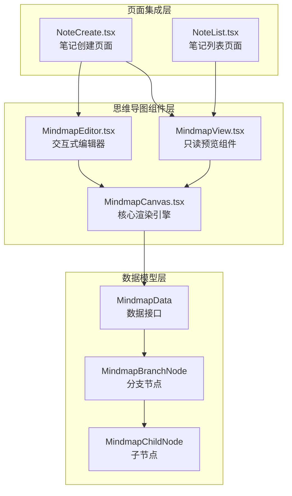

**图表来源**
- [MindmapView.tsx:1-20](file://src/app/components/MindmapView.tsx#L1-L20)
- [MindmapCanvas.tsx:4-17](file://src/app/components/MindmapCanvas.tsx#L4-L17)
- [MindmapEditor.tsx:10-28](file://src/app/components/MindmapEditor.tsx#L10-L28)

**章节来源**
- [MindmapView.tsx:1-20](file://src/app/components/MindmapView.tsx#L1-L20)
- [MindmapCanvas.tsx:1-421](file://src/app/components/MindmapCanvas.tsx#L1-L421)
- [MindmapEditor.tsx:1-390](file://src/app/components/MindmapEditor.tsx#L1-L390)

## 核心组件

### 数据模型架构

思维导图系统采用分层数据模型设计，确保数据结构的清晰性和可维护性：

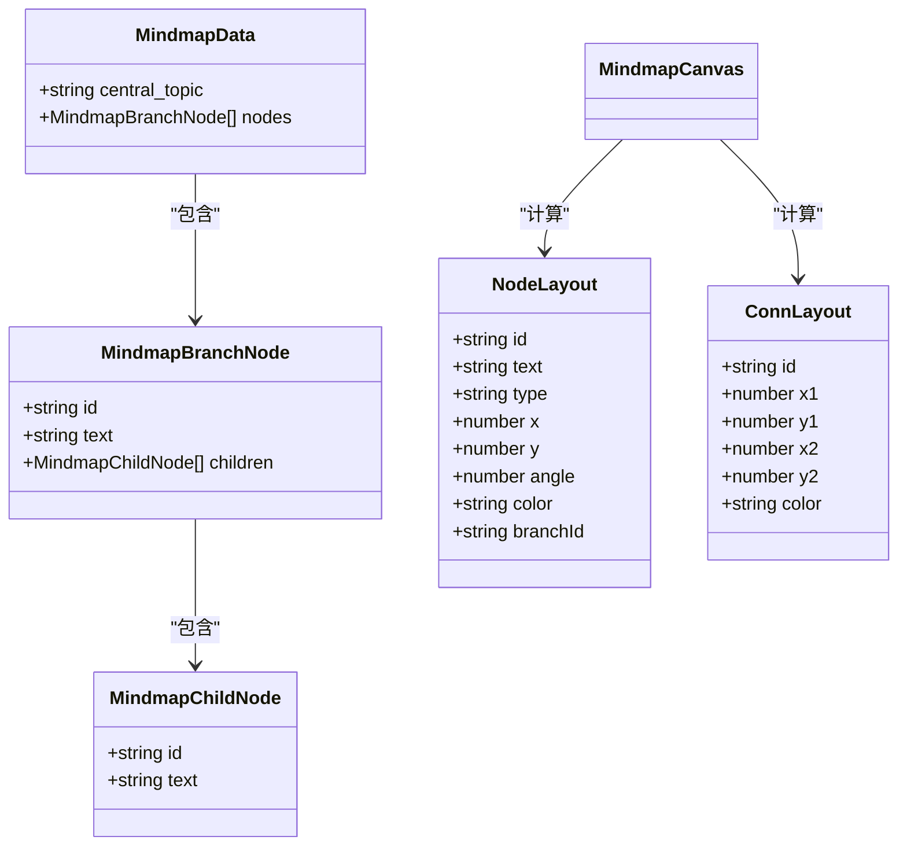

**图表来源**
- [MindmapCanvas.tsx:14-35](file://src/app/components/MindmapCanvas.tsx#L14-L35)

### 组件层次结构

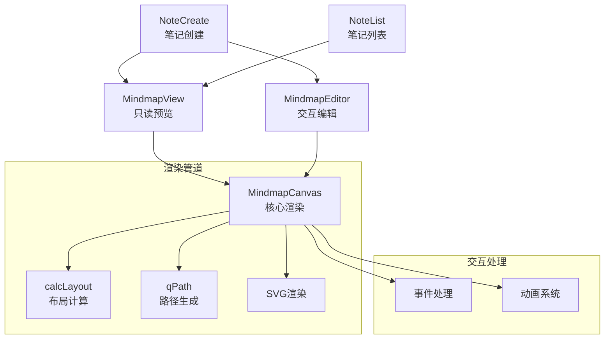

**图表来源**
- [MindmapView.tsx:6-19](file://src/app/components/MindmapView.tsx#L6-L19)
- [MindmapCanvas.tsx:123-343](file://src/app/components/MindmapCanvas.tsx#L123-L343)

**章节来源**
- [MindmapCanvas.tsx:4-17](file://src/app/components/MindmapCanvas.tsx#L4-L17)
- [MindmapView.tsx:9-11](file://src/app/components/MindmapView.tsx#L9-L11)

## 架构概览

思维导图系统的整体架构采用分层设计，确保各组件职责明确且高度解耦：

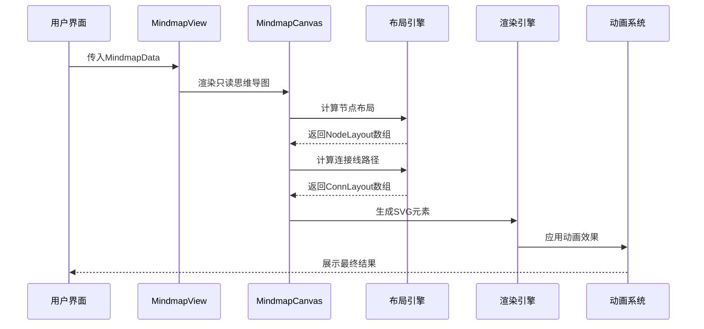

**图表来源**
- [MindmapView.tsx:13-16](file://src/app/components/MindmapView.tsx#L13-L16)
- [MindmapCanvas.tsx:59-98](file://src/app/components/MindmapCanvas.tsx#L59-L98)

### 数据流处理

思维导图系统采用单向数据流设计，确保数据的一致性和可预测性：

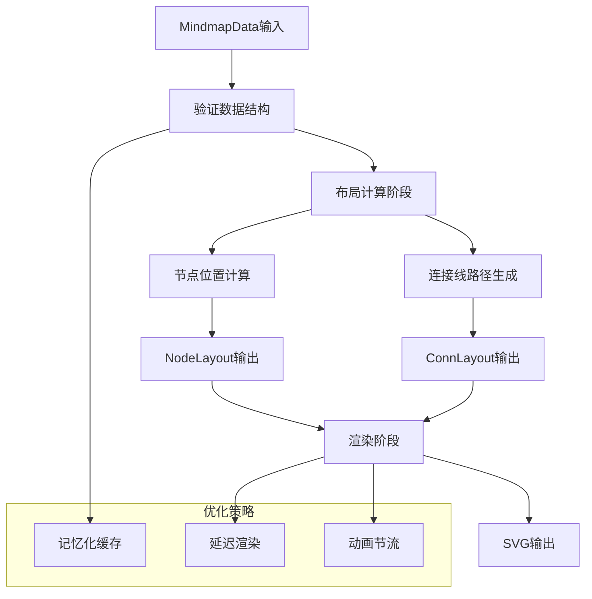

**图表来源**
- [MindmapCanvas.tsx:59-98](file://src/app/components/MindmapCanvas.tsx#L59-L98)
- [MindmapCanvas.tsx:133](file://src/app/components/MindmapCanvas.tsx#L133)

## 详细组件分析

### MindmapView 组件

MindmapView是思维导图系统的入口组件，专门负责只读模式下的思维导图预览：

#### 核心功能特性

- **简化接口设计**：仅接受MindmapData作为输入，隐藏内部复杂性
- **固定宽高比**：保持1:1的宽高比，确保视觉一致性
- **自动禁用编辑**：强制editable=false，确保只读模式
- **紧凑布局**：使用compact=false提供完整视图

#### 组件实现分析

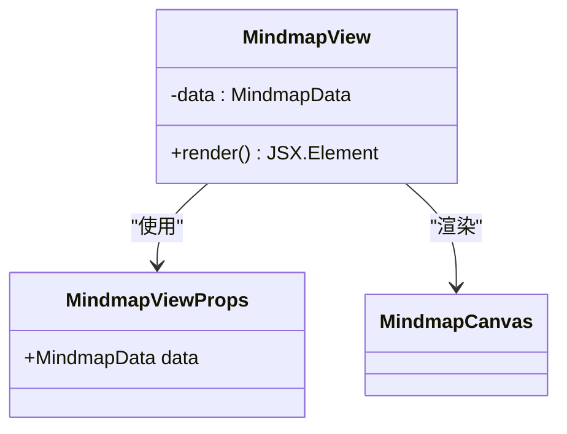

**图表来源**
- [MindmapView.tsx:9-11](file://src/app/components/MindmapView.tsx#L9-L11)
- [MindmapView.tsx:13-16](file://src/app/components/MindmapView.tsx#L13-L16)

**章节来源**
- [MindmapView.tsx:1-20](file://src/app/components/MindmapView.tsx#L1-L20)

### MindmapCanvas 核心渲染引擎

MindmapCanvas是整个思维导图系统的核心，负责所有渲染逻辑和交互处理：

#### 布局算法实现

布局算法采用径向分布设计，确保节点在圆形空间内的最优排列：

```mermaid
flowchart TD
A[开始布局计算] --> B[获取节点数量N]
B --> C{N > 0?}
C --> |否| D[返回空布局]
C --> |是| E[遍历每个分支节点]
E --> F[计算角度: angle = (bi/N) * 2π - π/2]
F --> G[计算分支节点坐标]
G --> H[添加分支节点到布局]
H --> I[绘制中央节点到分支节点连接线]
I --> J[计算子节点分布]
J --> K[应用最大扩散角度限制]
K --> L[计算子节点坐标]
L --> M[添加子节点到布局]
M --> N[绘制分支节点到子节点连接线]
N --> O[返回完整布局]
```

**图表来源**
- [MindmapCanvas.tsx:59-98](file://src/app/components/MindmapCanvas.tsx#L59-L98)

#### 连接线路径生成

连接线采用二次贝塞尔曲线算法，提供自然流畅的视觉效果：

```mermaid
flowchart TD
P1[起点坐标(x1,y1)] --> P2[终点坐标(x2,y2)]
P2 --> M[计算中点(mx,my)]
M --> C[计算控制点坐标]
C --> Q[生成二次贝塞尔路径]
Q --> R[应用内向弯曲效果]
R --> S[返回路径字符串]
subgraph "弯曲参数"
B1[弯曲比例: 12%]
B2[朝向中心偏移]
end
C --> B1
C --> B2
```

**图表来源**
- [MindmapCanvas.tsx:101-108](file://src/app/components/MindmapCanvas.tsx#L101-L108)

#### 动画系统设计

MindmapCanvas集成了完整的动画系统，提供丰富的视觉反馈：

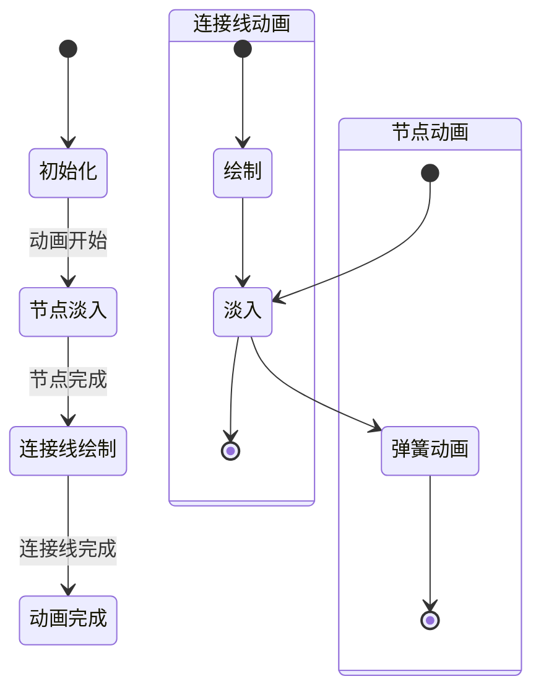

**图表来源**
- [MindmapCanvas.tsx:210-225](file://src/app/components/MindmapCanvas.tsx#L210-L225)
- [MindmapCanvas.tsx:263-271](file://src/app/components/MindmapCanvas.tsx#L263-L271)

**章节来源**
- [MindmapCanvas.tsx:58-98](file://src/app/components/MindmapCanvas.tsx#L58-L98)
- [MindmapCanvas.tsx:100-108](file://src/app/components/MindmapCanvas.tsx#L100-L108)
- [MindmapCanvas.tsx:210-292](file://src/app/components/MindmapCanvas.tsx#L210-L292)

### MindmapEditor 交互编辑器

MindmapEditor提供了完整的思维导图编辑功能，支持实时数据修改和保存：

#### 编辑器功能架构

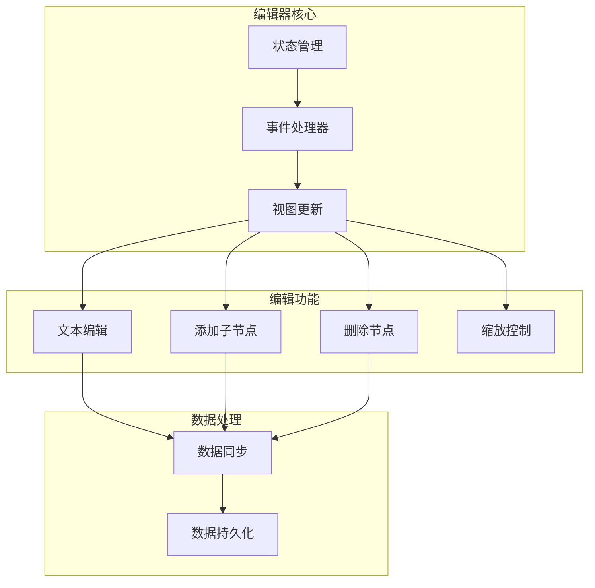

**图表来源**
- [MindmapEditor.tsx:31-147](file://src/app/components/MindmapEditor.tsx#L31-L147)

**章节来源**
- [MindmapEditor.tsx:1-390](file://src/app/components/MindmapEditor.tsx#L1-L390)

## 依赖关系分析

思维导图系统的依赖关系呈现清晰的分层结构：

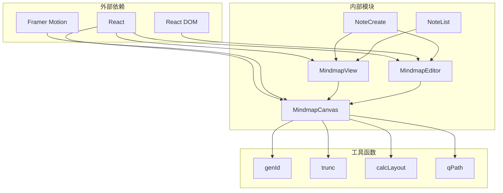

**图表来源**
- [MindmapCanvas.tsx:1-2](file://src/app/components/MindmapCanvas.tsx#L1-L2)
- [MindmapView.tsx:6-7](file://src/app/components/MindmapView.tsx#L6-L7)

### 组件间通信机制

思维导图系统采用事件驱动的通信模式，确保组件间的松耦合：

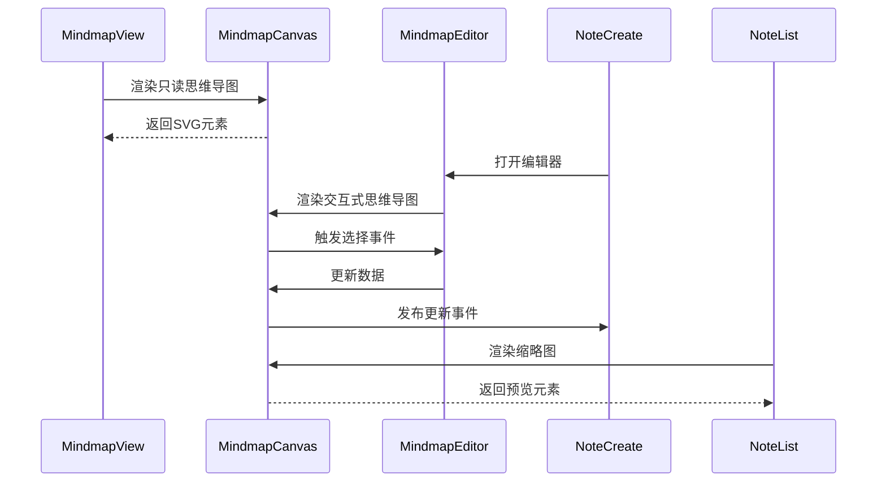

**图表来源**
- [MindmapView.tsx:13-16](file://src/app/components/MindmapView.tsx#L13-L16)
- [MindmapEditor.tsx:151-389](file://src/app/components/MindmapEditor.tsx#L151-L389)

**章节来源**
- [MindmapCanvas.tsx:133-143](file://src/app/components/MindmapCanvas.tsx#L133-L143)
- [MindmapEditor.tsx:68-147](file://src/app/components/MindmapEditor.tsx#L68-L147)

## 性能考虑

### 渲染优化策略

思维导图系统采用了多层次的性能优化策略：

#### 记忆化缓存
- 使用useMemo缓存布局计算结果
- 避免重复的数学计算和SVG路径生成
- 在数据不变时直接复用之前的计算结果

#### 动画节流
- 连接线动画采用渐进式播放
- 节点动画使用弹簧物理效果
- 控制动画延迟和持续时间

#### 虚拟化渲染
- 通过SVG的硬件加速提升渲染性能
- 合理的DOM节点数量控制
- 避免不必要的重排和重绘

### 内存管理

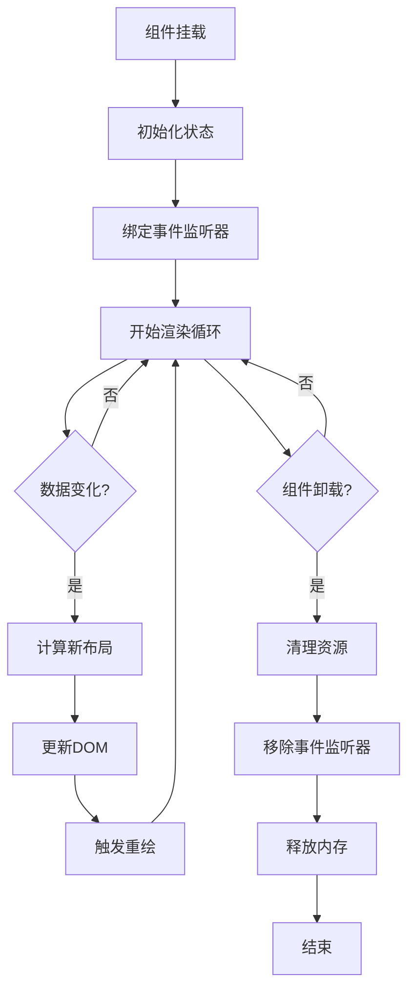

**图表来源**
- [MindmapCanvas.tsx:133](file://src/app/components/MindmapCanvas.tsx#L133)

### 性能监控指标

| 指标类型 | 目标值 | 实现方式 |
|---------|--------|----------|
| 渲染帧率 | ≥60fps | SVG硬件加速 |
| 布局计算 | <5ms | 记忆化缓存 |
| 动画流畅度 | ≤100ms | 动画节流 |
| 内存占用 | <5MB | 资源清理 |

## 故障排除指南

### 常见问题诊断

#### 渲染异常问题

**症状**：思维导图无法正常显示或显示不完整

**可能原因**：
1. MindmapData格式不正确
2. SVG命名空间问题
3. 动画库初始化失败

**解决方案**：
1. 验证数据结构完整性
2. 检查SVG元素的命名空间声明
3. 确认Framer Motion库正确导入

#### 性能问题

**症状**：大尺寸思维导图渲染缓慢或卡顿

**可能原因**：
1. 节点数量过多导致计算复杂度增加
2. 动画效果过于复杂
3. DOM节点数量超限

**解决方案**：
1. 实施节点数量限制
2. 简化动画效果
3. 使用虚拟化技术

#### 交互问题

**症状**：点击事件无响应或响应异常

**可能原因**：
1. 事件冒泡处理不当
2. 只读模式下仍尝试处理编辑事件
3. 事件监听器重复绑定

**解决方案**：
1. 正确处理事件冒泡
2. 在只读模式下禁用编辑功能
3. 确保事件监听器的正确清理

**章节来源**
- [MindmapCanvas.tsx:135-149](file://src/app/components/MindmapCanvas.tsx#L135-L149)
- [MindmapView.tsx:13-16](file://src/app/components/MindmapView.tsx#L13-L16)

## 结论

MindmapView思维导图视图组件展现了现代前端开发的最佳实践，通过精心设计的架构和优化策略，实现了高性能、可维护的思维导图展示系统。

### 主要优势

1. **架构清晰**：分层设计确保了组件职责明确，易于维护和扩展
2. **性能优异**：多层优化策略保证了流畅的用户体验
3. **功能完整**：从只读预览到交互编辑的完整功能覆盖
4. **可扩展性强**：模块化设计便于功能扩展和定制

### 技术亮点

- **径向布局算法**：创新的节点分布策略
- **SVG硬件加速**：充分利用浏览器图形性能
- **动画系统集成**：提供丰富的视觉反馈
- **响应式设计**：适配多种设备和屏幕尺寸

### 改进建议

1. **虚拟滚动**：对于大量节点的情况，可以考虑实现虚拟滚动
2. **懒加载**：支持按需加载大型思维导图
3. **离线缓存**：实现本地缓存机制提升加载速度
4. **无障碍支持**：增强键盘导航和屏幕阅读器支持

该组件为思维导图应用提供了坚实的技术基础，为用户提供了优秀的思维导图展示和编辑体验。