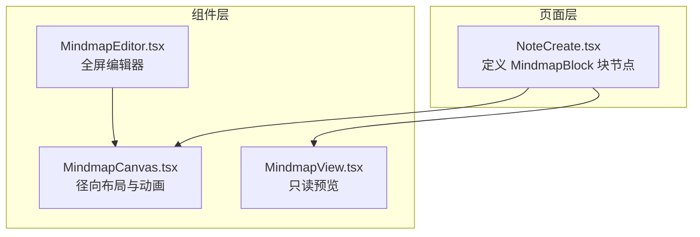
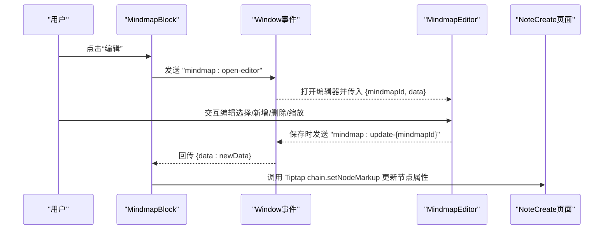
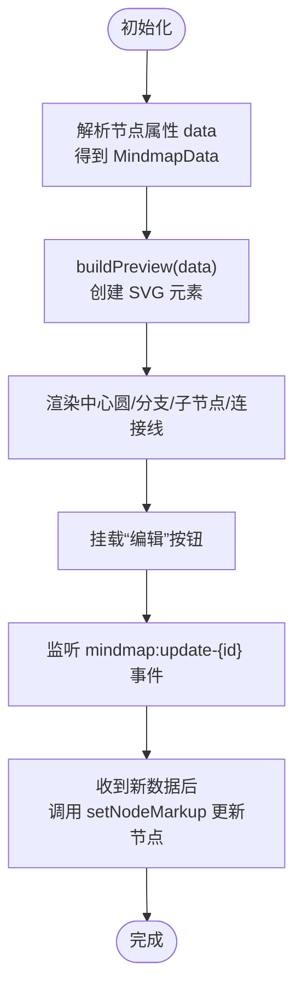
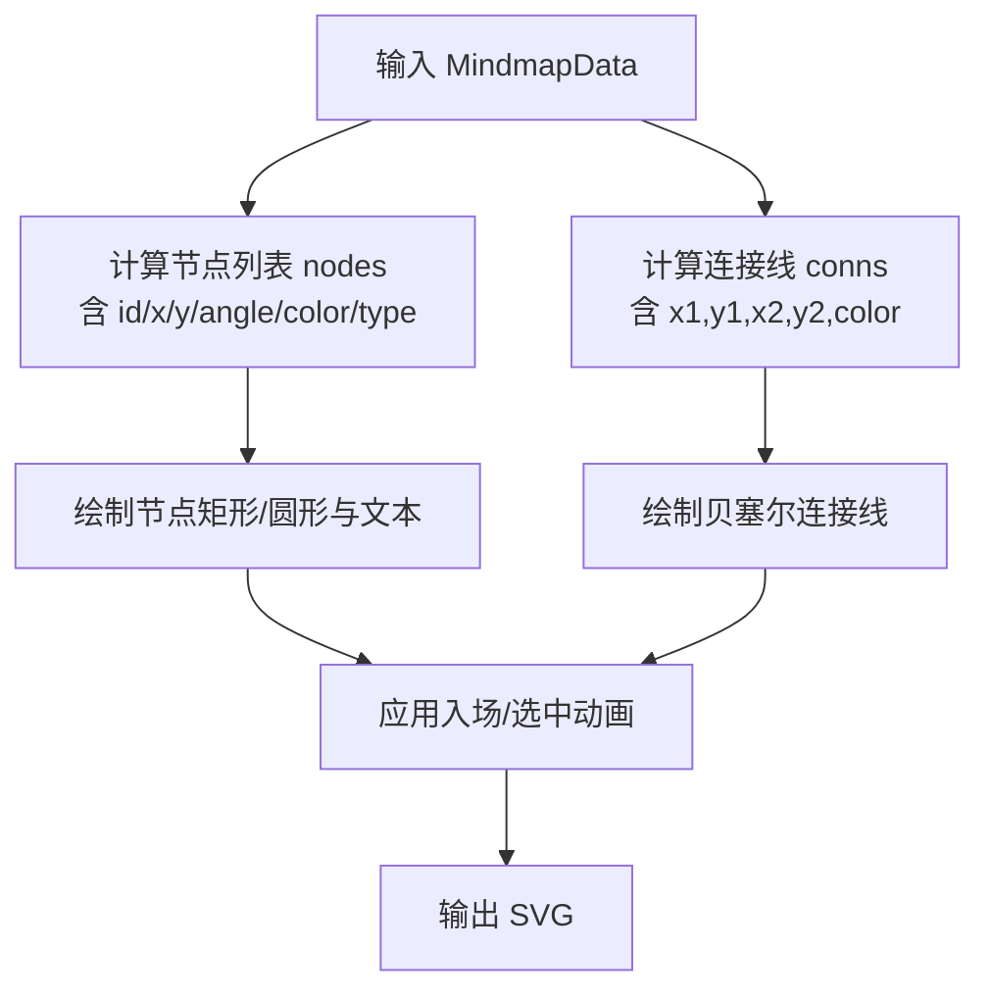
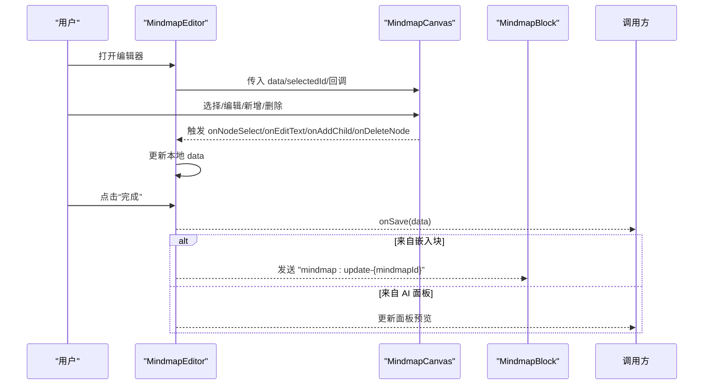
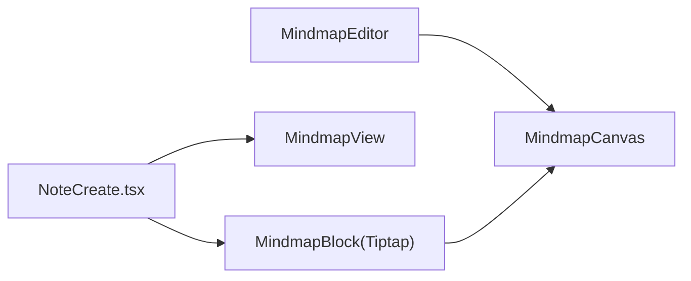

# MindmapBlock思维导图块节点

<cite>
**本文档引用的文件**
- [NoteCreate.tsx](file://src/app/pages/NoteCreate.tsx)
- [MindmapCanvas.tsx](file://src/app/components/MindmapCanvas.tsx)
- [MindmapEditor.tsx](file://src/app/components/MindmapEditor.tsx)
- [MindmapView.tsx](file://src/app/components/MindmapView.tsx)
</cite>

## 目录
1. [简介](#简介)
2. [项目结构](#项目结构)
3. [核心组件](#核心组件)
4. [架构总览](#架构总览)
5. [详细组件分析](#详细组件分析)
6. [依赖关系分析](#依赖关系分析)
7. [性能考虑](#性能考虑)
8. [故障排除指南](#故障排除指南)
9. [结论](#结论)
10. [附录](#附录)

## 简介
本文件面向开发者与产品人员，系统性解析 MindmapBlock 思维导图块节点的实现，覆盖以下关键主题：
- SVG 预览生成机制：从数据到径向布局的完整渲染流程
- 交互事件处理：节点选择、文本编辑、新增/删除节点、缩放控制
- 节点布局算法：基于极坐标的角度分配与贝塞尔曲线连接线
- 动画效果：入场、选中高亮、路径绘制的流畅过渡
- 数据结构设计：中心主题、分支节点与子节点的层级模型
- 编辑模式切换：嵌入式预览与全屏编辑器的无缝联动
- 实时预览更新与数据持久化：CustomEvent 事件桥接与 Tiptap 节点属性更新
- 与 MindmapEditor 组件的集成：事件传递与状态同步
- 使用示例、配置选项与自定义样式方法
- 导出、分享与性能优化策略

## 项目结构
MindmapBlock 的实现横跨三个主要模块：
- NoteCreate 页面：定义 Tiptap 自定义块节点 MindmapBlock，并提供嵌入式 SVG 预览与编辑入口
- MindmapCanvas 组件：负责可交互的径向思维导图绘制与动画
- MindmapEditor 组件：全屏编辑器，支持节点增删改查、缩放与保存
- MindmapView 组件：只读内联预览，用于 AI 结果卡片展示

**图表来源**
- [NoteCreate.tsx:443-659](file://src/app/pages/NoteCreate.tsx#L443-L659)
- [MindmapCanvas.tsx:123-343](file://src/app/components/MindmapCanvas.tsx#L123-L343)
- [MindmapEditor.tsx:31-389](file://src/app/components/MindmapEditor.tsx#L31-L389)
- [MindmapView.tsx:13-19](file://src/app/components/MindmapView.tsx#L13-L19)

**章节来源**
- [NoteCreate.tsx:443-659](file://src/app/pages/NoteCreate.tsx#L443-L659)
- [MindmapCanvas.tsx:123-343](file://src/app/components/MindmapCanvas.tsx#L123-L343)
- [MindmapEditor.tsx:31-389](file://src/app/components/MindmapEditor.tsx#L31-L389)
- [MindmapView.tsx:13-19](file://src/app/components/MindmapView.tsx#L13-L19)

## 核心组件
- MindmapBlock（Tiptap 自定义块节点）：在编辑器中以块级元素呈现，内置纯 DOM 渲染的 SVG 预览与“编辑”按钮；通过 window.CustomEvent 与 MindmapEditor 通信，实现数据更新与回写
- MindmapCanvas（径向画布）：根据 MindmapData 计算节点与连接线布局，使用 SVG/React/Framer Motion 实现平滑动画与交互
- MindmapEditor（编辑器）：全屏模态，提供节点选择、文本编辑、新增/删除、缩放控制与保存回调
- MindmapView（只读预览）：在 AI 结果卡片中展示完整径向 SVG，便于插入前预览

**章节来源**
- [NoteCreate.tsx:443-659](file://src/app/pages/NoteCreate.tsx#L443-L659)
- [MindmapCanvas.tsx:123-343](file://src/app/components/MindmapCanvas.tsx#L123-L343)
- [MindmapEditor.tsx:31-389](file://src/app/components/MindmapEditor.tsx#L31-L389)
- [MindmapView.tsx:13-19](file://src/app/components/MindmapView.tsx#L13-L19)

## 架构总览
MindmapBlock 作为 Tiptap 块节点，承载 MindmapData 并渲染为 SVG 预览；当用户点击“编辑”时，通过 window.CustomEvent 触发 MindmapEditor 打开；编辑完成后，编辑器通过同名 CustomEvent 将更新后的数据回传给 MindmapBlock，后者再通过 Tiptap 的 setNodeMarkup 更新节点属性。

**图表来源**
- [NoteCreate.tsx:506-511](file://src/app/pages/NoteCreate.tsx#L506-L511)
- [NoteCreate.tsx:2604-2606](file://src/app/pages/NoteCreate.tsx#L2604-L2606)
- [NoteCreate.tsx:634-647](file://src/app/pages/NoteCreate.tsx#L634-L647)

**章节来源**
- [NoteCreate.tsx:506-511](file://src/app/pages/NoteCreate.tsx#L506-L511)
- [NoteCreate.tsx:2604-2606](file://src/app/pages/NoteCreate.tsx#L2604-L2606)
- [NoteCreate.tsx:634-647](file://src/app/pages/NoteCreate.tsx#L634-L647)

## 详细组件分析

### MindmapBlock（Tiptap 块节点）
- 节点属性
  - data：JSON 字符串，存储 MindmapData
  - mindmapId：唯一标识，用于事件通道隔离
- 渲染结构
  - 外层容器：带 data-mindmap-block 属性，设置圆角、边框与背景
  - 编辑按钮：右上角覆盖层，触发 window.CustomEvent 'mindmap:open-editor'
  - SVG 预览：径向布局，包含中心圆、分支节点与子节点，以及连接线
- 事件处理
  - 监听 window 上的 "mindmap:update-{mindmapId}" 事件，接收更新后的数据
  - 通过 Tiptap 的 chain.setNodeMarkup 将新数据写回节点属性
- SVG 预览构建
  - 使用 SVG <defs>/<pattern>/<radialGradient> 定义网格背景与渐变
  - 中心圆半径、分支节点半径、子节点半径固定，按节点数量均分角度
  - 连接线采用贝塞尔曲线，略微向中心弯曲，增强视觉层次

**图表来源**
- [NoteCreate.tsx:465-659](file://src/app/pages/NoteCreate.tsx#L465-L659)

**章节来源**
- [NoteCreate.tsx:443-659](file://src/app/pages/NoteCreate.tsx#L443-L659)

### MindmapCanvas（径向画布）
- 数据结构
  - MindmapData：包含 central_topic 与 nodes 数组
  - MindmapBranchNode：包含 id、text 与可选 children 数组
  - MindmapChildNode：包含 id、text
- 布局算法
  - 中心点 (CX, CY)，固定半径：中心圆半径、分支节点半径、子节点半径
  - 角度计算：angle = bi/N*2π - π/2，确保第一个分支位于上方
  - 子节点角度扩散：maxSpread = min(0.32, (2π/N)*0.36)，居中分布
  - 连接线：从中心圆边缘到分支节点，再从分支到子节点
- 动画与交互
  - 使用 Framer Motion 实现路径长度动画、节点入场弹跳、选中高亮脉冲
  - 支持点击取消选择、点击中央节点选择“central”
  - 文本截断：超过长度自动省略
- 只读与紧凑模式
  - editable=false 时禁用交互
  - compact=true 时缩小尺寸与字体，适合内联预览

**图表来源**
- [MindmapCanvas.tsx:59-98](file://src/app/components/MindmapCanvas.tsx#L59-L98)

**章节来源**
- [MindmapCanvas.tsx:123-343](file://src/app/components/MindmapCanvas.tsx#L123-L343)

### MindmapEditor（全屏编辑器）
- 状态管理
  - data：当前思维导图数据副本
  - selectedId：当前选中节点
  - editingId/editText：底部弹层的文本编辑状态
  - zoom：缩放级别（0.6–1.4）
  - showTip：提示条显示控制
- 交互能力
  - 节点选择：点击节点或中央圆，支持取消选择
  - 文本编辑：打开底部弹层，支持 Enter 提交、Esc 取消
  - 新增节点：支持在中央或分支下新增子节点，自动进入编辑状态
  - 删除节点：删除分支或子节点
  - 缩放控制：放大/缩小/重置
- 保存与回传
  - onSave 回调将最新数据返回给调用方
  - 若来自嵌入式块：通过 window.CustomEvent 回传给对应 MindmapBlock
  - 若来自 AI 面板：直接更新面板预览

**图表来源**
- [MindmapEditor.tsx:31-389](file://src/app/components/MindmapEditor.tsx#L31-L389)
- [NoteCreate.tsx:2598-2614](file://src/app/pages/NoteCreate.tsx#L2598-L2614)

**章节来源**
- [MindmapEditor.tsx:31-389](file://src/app/components/MindmapEditor.tsx#L31-L389)
- [NoteCreate.tsx:2598-2614](file://src/app/pages/NoteCreate.tsx#L2598-L2614)

### MindmapView（只读内联预览）
- 用途：在 AI 结果卡片中展示完整径向 SVG，便于插入前确认
- 行为：固定宽高比 1:1，渲染 MindmapCanvas（editable=false）

**章节来源**
- [MindmapView.tsx:13-19](file://src/app/components/MindmapView.tsx#L13-L19)

## 依赖关系分析
- NoteCreate.tsx 依赖 MindmapBlock（Tiptap）、MindmapView（只读预览），并通过 CustomEvent 与 MindmapEditor 协作
- MindmapEditor 依赖 MindmapCanvas 进行可视化编辑
- MindmapCanvas 依赖 Framer Motion 实现动画，内部使用常量与工具函数进行布局与文本截断
- 事件桥接：mindmap:open-editor 与 mindmap:update-{id} 保证跨组件通信

**图表来源**
- [NoteCreate.tsx:443-659](file://src/app/pages/NoteCreate.tsx#L443-L659)
- [MindmapEditor.tsx:31-389](file://src/app/components/MindmapEditor.tsx#L31-L389)
- [MindmapCanvas.tsx:123-343](file://src/app/components/MindmapCanvas.tsx#L123-L343)

**章节来源**
- [NoteCreate.tsx:443-659](file://src/app/pages/NoteCreate.tsx#L443-L659)
- [MindmapEditor.tsx:31-389](file://src/app/components/MindmapEditor.tsx#L31-L389)
- [MindmapCanvas.tsx:123-343](file://src/app/components/MindmapCanvas.tsx#L123-L343)

## 性能考虑
- 布局计算
  - calcLayout 使用 useMemo 缓存结果，避免重复计算
  - 仅在 data 变更时重新计算，降低复杂度
- 动画优化
  - 使用 Framer Motion 的初始/退出动画，配合 spring/damping 参数平衡流畅与性能
  - 路径动画按索引延迟，形成有序入场，减少视觉抖动
- DOM 与 SVG
  - MindmapBlock 内部使用原生 SVG 创建与更新，避免 React 重渲染成本
  - 事件监听在销毁时清理，防止内存泄漏
- 交互节流
  - 文本编辑弹层聚焦与提交采用异步延时，避免频繁重绘
  - 缩放范围限制（0.6–1.4），减少过度缩放带来的重排压力

**章节来源**
- [MindmapCanvas.tsx:133-133](file://src/app/components/MindmapCanvas.tsx#L133-L133)
- [MindmapCanvas.tsx:210-225](file://src/app/components/MindmapCanvas.tsx#L210-L225)
- [MindmapEditor.tsx:62-66](file://src/app/components/MindmapEditor.tsx#L62-L66)
- [NoteCreate.tsx:653-656](file://src/app/pages/NoteCreate.tsx#L653-L656)

## 故障排除指南
- 编辑按钮无响应
  - 检查是否正确派发 'mindmap:open-editor' 事件，且 mindmapId 与 MindmapBlock 一致
  - 确认 window 事件监听已注册
- 预览不更新
  - 确认编辑器保存时是否派发 'mindmap:update-{mindmapId}' 事件
  - 检查 MindmapBlock 是否正确调用 setNodeMarkup 更新节点属性
- 交互无效
  - editable=false 时禁用所有交互
  - 检查事件冒泡是否被阻止（例如 ActionMenu 的点击事件）
- 文本编辑无法提交
  - 确认底部弹层已打开，输入框已聚焦
  - 检查 Enter/Escape 键盘事件绑定与 commitEdit 调用链

**章节来源**
- [NoteCreate.tsx:506-511](file://src/app/pages/NoteCreate.tsx#L506-L511)
- [NoteCreate.tsx:634-647](file://src/app/pages/NoteCreate.tsx#L634-L647)
- [MindmapEditor.tsx:344-347](file://src/app/components/MindmapEditor.tsx#L344-L347)
- [MindmapCanvas.tsx:135-143](file://src/app/components/MindmapCanvas.tsx#L135-L143)

## 结论
MindmapBlock 通过 Tiptap 块节点与自定义 SVG 预览，结合 MindmapEditor 的全屏交互，实现了从 AI 生成到嵌入笔记的完整闭环。其径向布局算法清晰、动画流畅、事件桥接稳定，既满足编辑效率也兼顾了阅读体验。通过合理的缓存与动画参数，系统在复杂节点场景下仍能保持良好性能。

## 附录

### 数据结构与类型
- MindmapData
  - central_topic: string
  - nodes: MindmapBranchNode[]
- MindmapBranchNode
  - id: string
  - text: string
  - children?: MindmapChildNode[]
- MindmapChildNode
  - id: string
  - text: string

**章节来源**
- [MindmapCanvas.tsx:5-17](file://src/app/components/MindmapCanvas.tsx#L5-L17)

### 使用示例与配置选项
- 在 AI 面板中插入思维导图块
  - 通过编辑器链插入 mindmapBlock，设置 data 与 mindmapId
  - 插入后可直接点击“编辑”进入全屏编辑器
- 配置选项
  - editable：是否启用交互（MindmapCanvas）
  - compact：是否紧凑模式（MindmapCanvas）
  - mindmapId：MindmapBlock 唯一标识（NoteCreate 中生成）
- 自定义样式
  - MindmapBlock 外层容器样式可通过内联样式调整
  - SVG 预览颜色方案由 COLORS 常量决定，可在构建函数中扩展
  - MindmapCanvas 的渐变与滤镜定义集中于 <defs>，可按需修改

**章节来源**
- [NoteCreate.tsx:2520-2526](file://src/app/pages/NoteCreate.tsx#L2520-L2526)
- [NoteCreate.tsx:475-482](file://src/app/pages/NoteCreate.tsx#L475-L482)
- [MindmapCanvas.tsx:45-49](file://src/app/components/MindmapCanvas.tsx#L45-L49)
- [MindmapCanvas.tsx:187-202](file://src/app/components/MindmapCanvas.tsx#L187-L202)

### 导出、分享与持久化
- 导出
  - 当前实现以 SVG 预览为主，未见专用导出为图片/PDF 的代码
  - 可通过截图或将 SVG 作为静态资源保存实现导出
- 分享
  - MindmapBlock 以独立节点形式存在于编辑器内容中，可随笔记一起分享
- 持久化
  - MindmapData 以 JSON 字符串形式存储在 Tiptap 节点属性中
  - 编辑器保存时通过 onSave 回调将数据交给调用方，建议结合应用的笔记存储机制进行持久化

**章节来源**
- [NoteCreate.tsx:2520-2526](file://src/app/pages/NoteCreate.tsx#L2520-L2526)
- [NoteCreate.tsx:639-645](file://src/app/pages/NoteCreate.tsx#L639-L645)