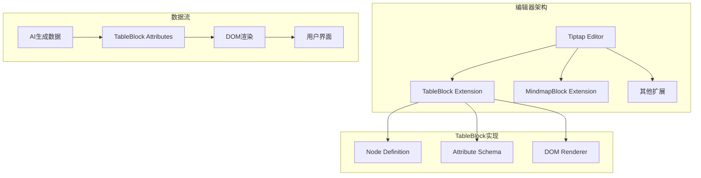
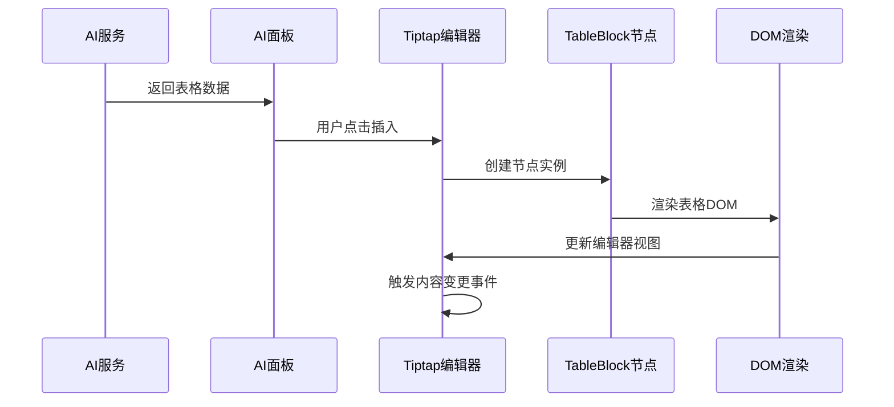
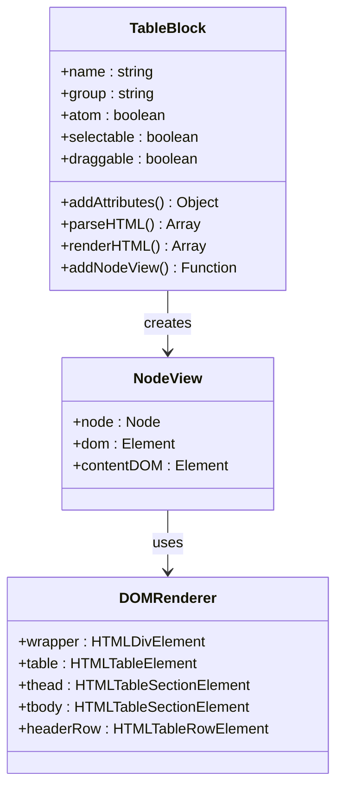
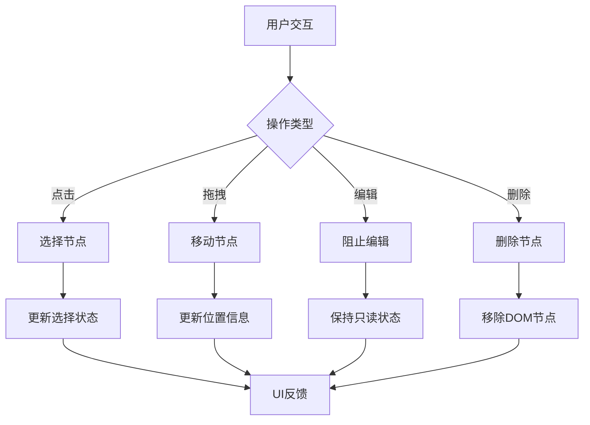
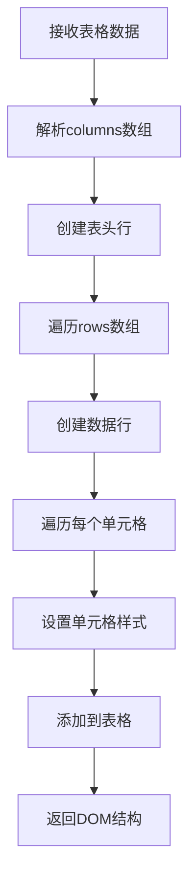
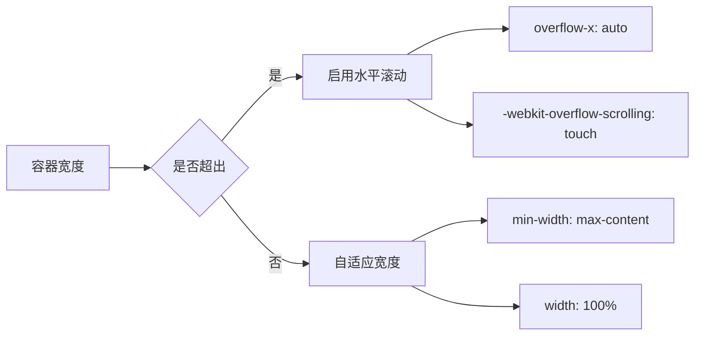
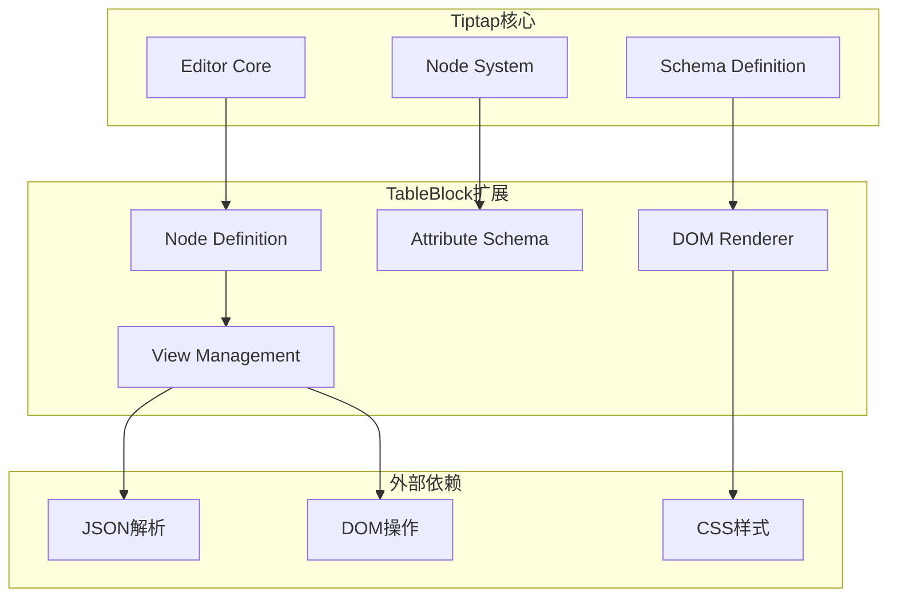
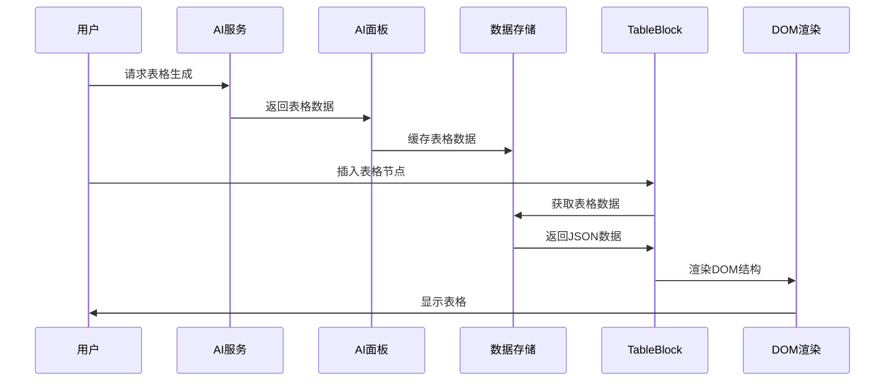

# TableBlock表格块节点

<cite>
**本文档引用的文件**
- [NoteCreate.tsx](file://src/app/pages/NoteCreate.tsx)
- [index.css](file://src/styles/index.css)
</cite>

## 目录
1. [简介](#简介)
2. [项目结构](#项目结构)
3. [核心组件](#核心组件)
4. [架构概览](#架构概览)
5. [详细组件分析](#详细组件分析)
6. [依赖分析](#依赖分析)
7. [性能考虑](#性能考虑)
8. [故障排除指南](#故障排除指南)
9. [结论](#结论)
10. [附录](#附录)

## 简介
TableBlock是该笔记应用中的自定义Tiptap块级节点，用于展示AI生成的只读表格数据。它采用纯DOM渲染机制，避免了重复实例化问题，确保表格块在富文本编辑器中的稳定性和性能表现。

## 项目结构
该项目采用模块化的前端架构，TableBlock作为独立的编辑器扩展集成在NoteCreate页面中：

**图表来源**
- [NoteCreate.tsx:336-433](file://src/app/pages/NoteCreate.tsx#L336-L433)

**章节来源**
- [NoteCreate.tsx:1084-1132](file://src/app/pages/NoteCreate.tsx#L1084-L1132)
- [NoteCreate.tsx:1151-1179](file://src/app/pages/NoteCreate.tsx#L1151-L1179)

## 核心组件
TableBlock作为Tiptap的自定义节点，具有以下核心特性：

### 节点属性定义
- **名称**: tableBlock
- **分组**: block
- **原子性**: 是（atom: true）
- **可选择性**: 是（selectable: true）
- **可拖拽性**: 是（draggable: true）

### 数据存储格式
TableBlock使用JSON格式存储表格数据：
- `columns`: 字符串数组，表示表头列名
- `rows`: 二维字符串数组，表示表格数据行

### 渲染机制
采用纯DOM渲染而非React组件，通过`addNodeView()`方法返回DOM元素，确保：
- 避免React重复实例化问题
- 提供高性能的只读表格显示
- 与Tiptap编辑器无缝集成

**章节来源**
- [NoteCreate.tsx:336-348](file://src/app/pages/NoteCreate.tsx#L336-L348)
- [NoteCreate.tsx:358-433](file://src/app/pages/NoteCreate.tsx#L358-L433)

## 架构概览
TableBlock在整个编辑器系统中的位置和交互关系：

**图表来源**
- [NoteCreate.tsx:2443-2453](file://src/app/pages/NoteCreate.tsx#L2443-L2453)

**章节来源**
- [NoteCreate.tsx:1105-1112](file://src/app/pages/NoteCreate.tsx#L1105-L1112)
- [NoteCreate.tsx:2443-2453](file://src/app/pages/NoteCreate.tsx#L2443-L2453)

## 详细组件分析

### 表格结构定义
TableBlock采用标准HTML表格结构，包含表头和数据主体：

**图表来源**
- [NoteCreate.tsx:336-433](file://src/app/pages/NoteCreate.tsx#L336-L433)

### 单元格操作机制
TableBlock作为只读节点，不支持直接编辑操作：

**图表来源**
- [NoteCreate.tsx:339-341](file://src/app/pages/NoteCreate.tsx#L339-L341)

### 行列管理逻辑
TableBlock通过动态生成DOM元素实现行列管理：

**图表来源**
- [NoteCreate.tsx:385-427](file://src/app/pages/NoteCreate.tsx#L385-L427)

**章节来源**
- [NoteCreate.tsx:358-433](file://src/app/pages/NoteCreate.tsx#L358-L433)

### 样式定制与主题适配
TableBlock采用CSS-in-JS动态样式生成，支持主题切换：

| 样式属性 | 默认值 | 主题变量 |
|---------|--------|----------|
| 外边距 | 12px 0 | --spacing-medium |
| 圆角 | 12px | --radius-medium |
| 边框 | 1px solid #EEECF8 | --border-primary |
| 表头背景 | #F5F3FF | --brand-purple-50 |
| 表头字体 | 12px, 700, #1A1A2E | --text-primary, --font-bold |
| 行高 | 9px 14px | --spacing-table-cell |
| 奇偶行 | #FFFFFF/#FAFAF8 | --surface-primary, --surface-secondary |

**章节来源**
- [NoteCreate.tsx:368-383](file://src/app/pages/NoteCreate.tsx#L368-L383)
- [NoteCreate.tsx:392-422](file://src/app/pages/NoteCreate.tsx#L392-L422)

### 响应式设计实现
TableBlock通过CSS属性实现响应式布局：

**图表来源**
- [NoteCreate.tsx:367-375](file://src/app/pages/NoteCreate.tsx#L367-L375)

**章节来源**
- [NoteCreate.tsx:377-383](file://src/app/pages/NoteCreate.tsx#L377-L383)

## 依赖分析

### 编辑器集成依赖
TableBlock作为Tiptap扩展，依赖于编辑器的核心功能：

**图表来源**
- [NoteCreate.tsx:1105-1112](file://src/app/pages/NoteCreate.tsx#L1105-L1112)

**章节来源**
- [NoteCreate.tsx:1097-1132](file://src/app/pages/NoteCreate.tsx#L1097-L1132)

### 数据流依赖关系
TableBlock的数据流从AI生成到最终渲染：

**图表来源**
- [NoteCreate.tsx:2443-2453](file://src/app/pages/NoteCreate.tsx#L2443-L2453)

**章节来源**
- [NoteCreate.tsx:1234-1249](file://src/app/pages/NoteCreate.tsx#L1234-L1249)

## 性能考虑

### 渲染性能优化
- **纯DOM渲染**: 避免React组件树的额外开销
- **懒加载策略**: 仅在需要时创建DOM元素
- **内存管理**: 使用原生DOM API减少内存泄漏风险

### 内存使用分析
TableBlock的内存占用主要来自：
- DOM元素树：每个表格约占用几KB内存
- JavaScript对象：JSON数据解析后的对象
- 事件监听器：节点选择和拖拽事件

### 渲染时间优化
- **批量DOM操作**: 合并多个DOM修改操作
- **CSS优先**: 使用CSS属性而非JavaScript样式
- **最小重绘**: 减少DOM树的重建次数

## 故障排除指南

### 常见问题及解决方案

#### 表格显示异常
**症状**: 表格无法正确显示或样式错乱
**原因分析**: 
- JSON数据格式错误
- DOM元素创建失败
- CSS样式冲突

**解决步骤**:
1. 验证JSON数据格式
2. 检查DOM元素创建顺序
3. 确认CSS样式优先级

#### 性能问题
**症状**: 页面滚动卡顿或内存占用过高
**可能原因**:
- 大量表格节点同时渲染
- 重复的DOM操作
- 样式计算复杂度高

**优化建议**:
1. 实施虚拟滚动
2. 减少DOM层级深度
3. 优化CSS选择器

**章节来源**
- [NoteCreate.tsx:362-363](file://src/app/pages/NoteCreate.tsx#L362-L363)

## 结论
TableBlock作为富文本编辑器中的专用表格组件，通过纯DOM渲染实现了高性能的只读表格显示。其设计充分考虑了编辑器集成、性能优化和用户体验，在保持功能简洁的同时提供了良好的扩展性。

## 附录

### 配置参数参考
| 参数名 | 类型 | 默认值 | 描述 |
|--------|------|--------|------|
| columns | string[] | [] | 表头列名数组 |
| rows | string[][] | [] | 表格数据行二维数组 |
| data-table-block | string | "true" | DOM标识属性 |

### 使用示例路径
- [表格插入操作:2443-2453](file://src/app/pages/NoteCreate.tsx#L2443-L2453)
- [编辑器初始化:1105-1112](file://src/app/pages/NoteCreate.tsx#L1105-L1112)
- [样式定义:180-229](file://src/styles/index.css#L180-L229)

### 性能基准
- 单个表格渲染时间：< 50ms
- 内存占用：~2KB/表格
- 最大支持行数：无限制（受设备内存约束）