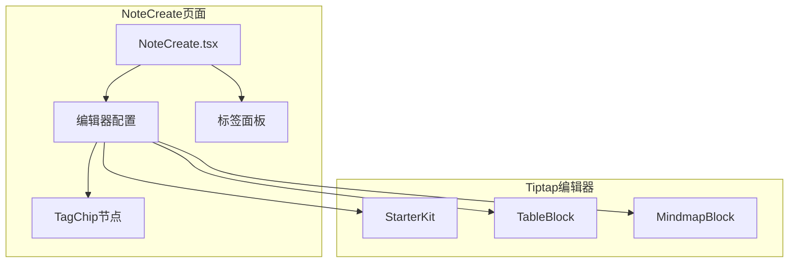
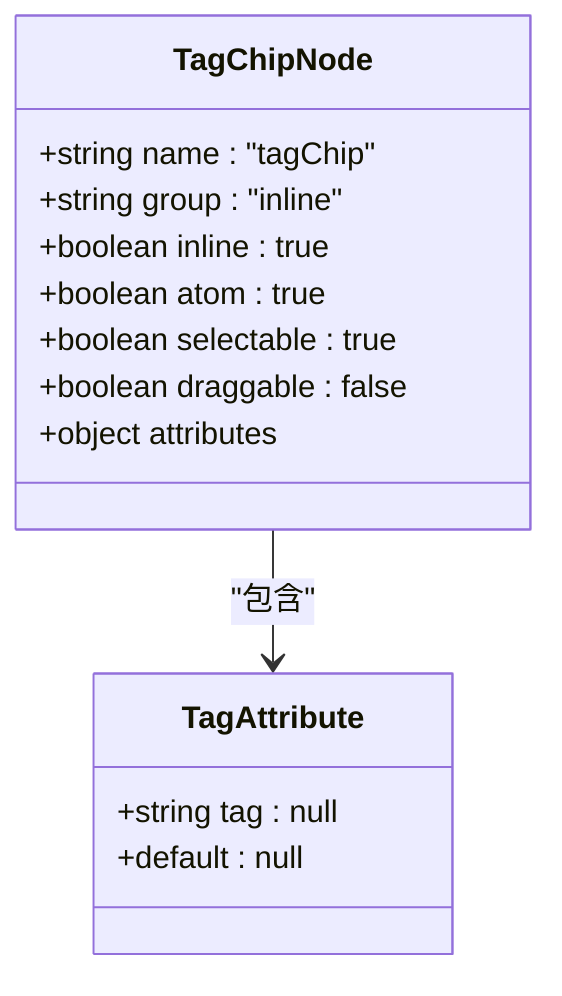
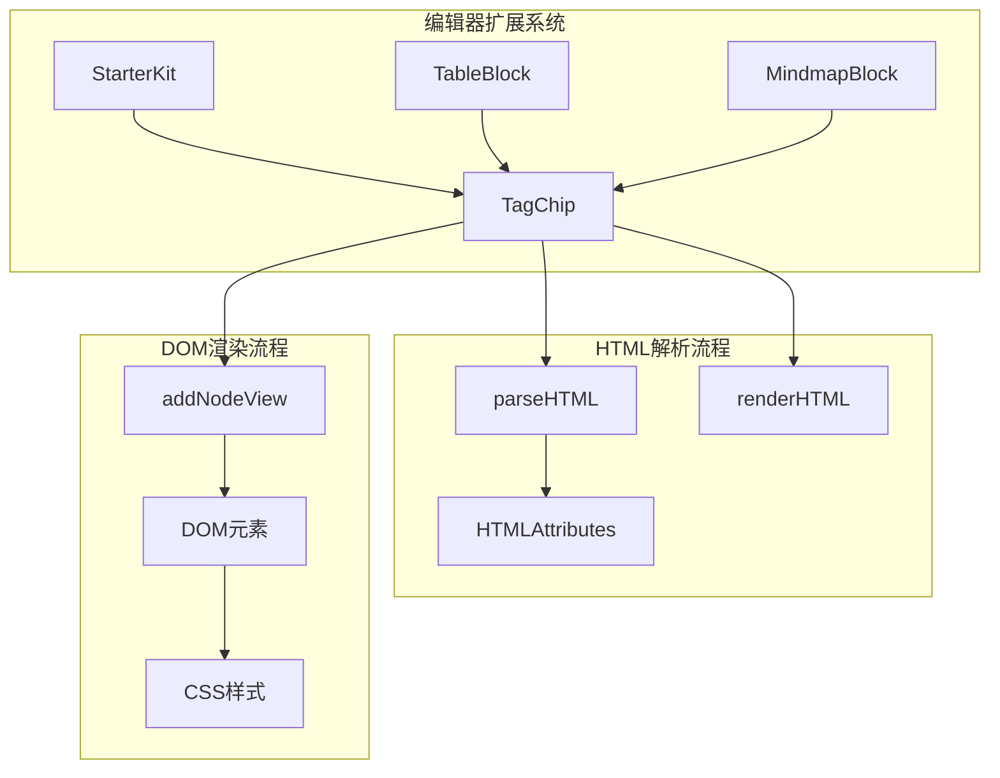
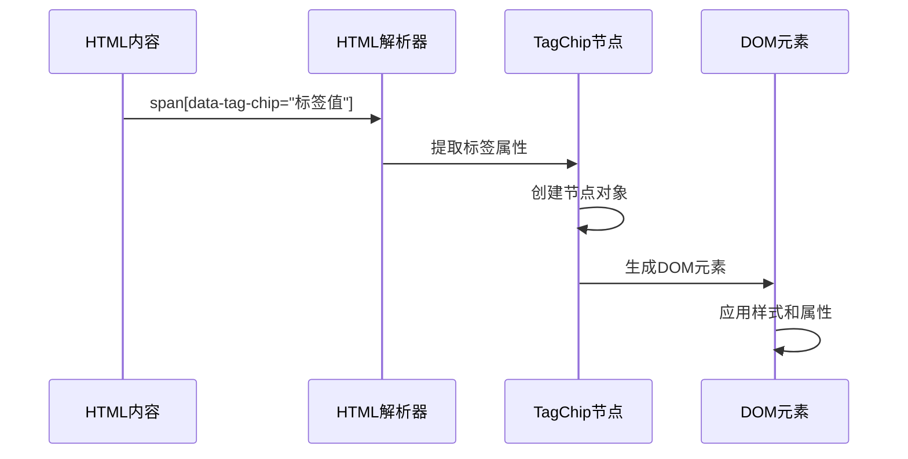
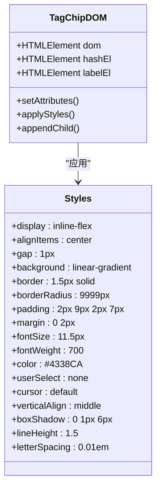
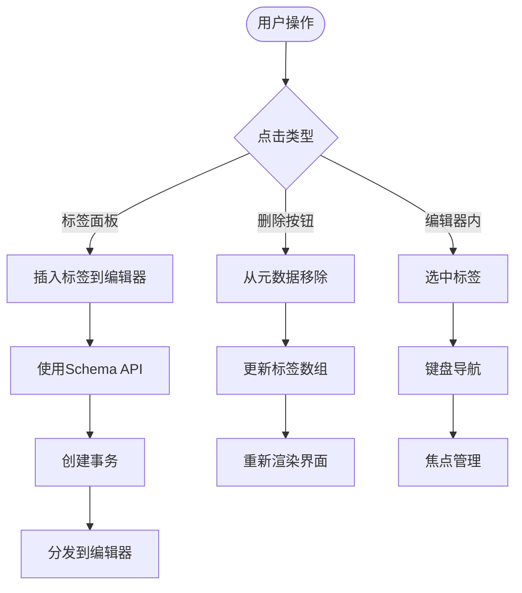
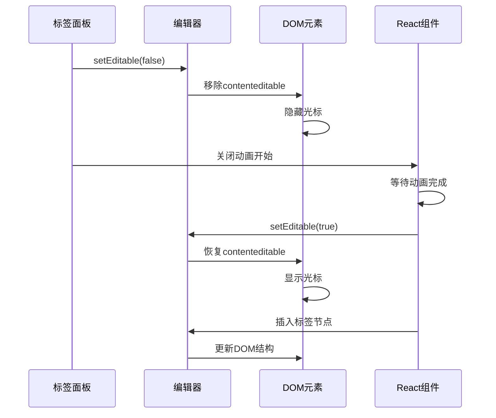
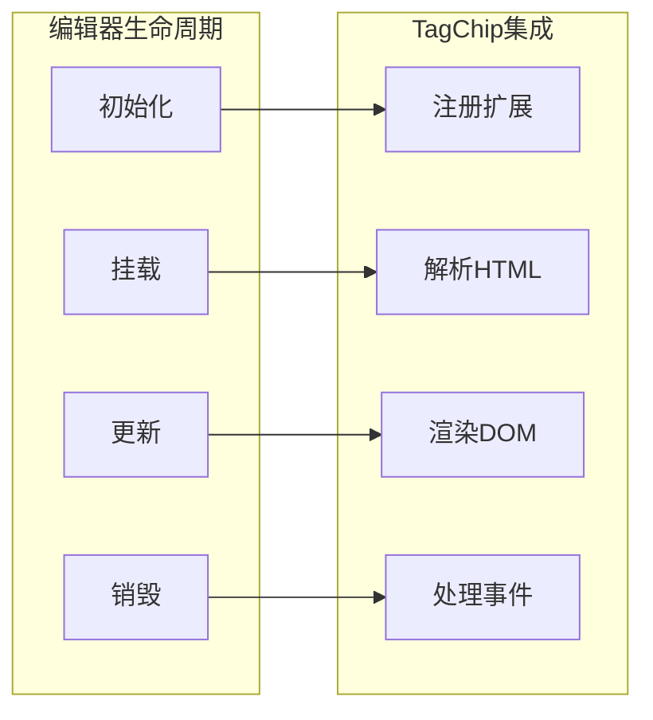
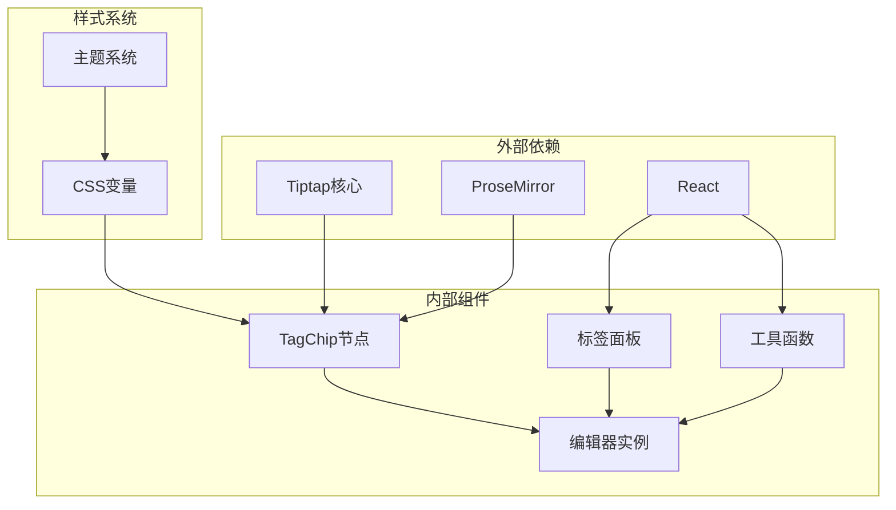
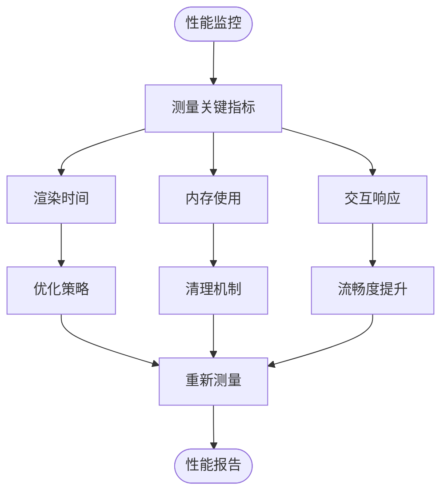

# TagChip标签芯片节点

<cite>
**本文档引用的文件**
- [NoteCreate.tsx](file://src/app/pages/NoteCreate.tsx)
</cite>

## 目录
1. [简介](#简介)
2. [项目结构](#项目结构)
3. [核心组件](#核心组件)
4. [架构概览](#架构概览)
5. [详细组件分析](#详细组件分析)
6. [依赖关系分析](#依赖关系分析)
7. [性能考虑](#性能考虑)
8. [故障排除指南](#故障排除指南)
9. [结论](#结论)
10. [附录](#附录)

## 简介

TagChip标签芯片节点是Note-taking应用前端中的一个自定义Tiptap内联原子节点，用于在富文本编辑器中显示和管理标签。该节点呈现为编辑器主体内的紫色药丸状徽章，具有独特的视觉标识，使其与普通文本内容明显区分。

## 项目结构

TagChip节点位于NoteCreate页面组件中，作为富文本编辑器的扩展插件集成：



**图表来源**
- [NoteCreate.tsx:1100-1179](file://src/app/pages/NoteCreate.tsx#L1100-L1179)
- [NoteCreate.tsx:265-330](file://src/app/pages/NoteCreate.tsx#L265-L330)

**章节来源**
- [NoteCreate.tsx:1100-1179](file://src/app/pages/NoteCreate.tsx#L1100-L1179)
- [NoteCreate.tsx:265-330](file://src/app/pages/NoteCreate.tsx#L265-L330)

## 核心组件

### TagChip节点定义

TagChip是一个自定义的Tiptap内联原子节点，具有以下关键特性：

- **原子性**: 被视为一个不可分割的单元
- **非可编辑性**: 内容不可编辑，防止用户修改标签值
- **选择性**: 可被选中，便于删除操作
- **内联显示**: 在文本流中作为内联元素显示

### 数据结构

节点使用简单的属性结构来存储标签信息：



**图表来源**
- [NoteCreate.tsx:270-282](file://src/app/pages/NoteCreate.tsx#L270-L282)

**章节来源**
- [NoteCreate.tsx:270-282](file://src/app/pages/NoteCreate.tsx#L270-L282)

## 架构概览

TagChip节点在整个编辑器生态系统中的位置和作用：



**图表来源**
- [NoteCreate.tsx:284-297](file://src/app/pages/NoteCreate.tsx#L284-L297)
- [NoteCreate.tsx:299-329](file://src/app/pages/NoteCreate.tsx#L299-L329)

## 详细组件分析

### HTML解析规则

TagChip节点实现了完整的HTML解析机制：

#### 解析规则
- **选择器**: `span[data-tag-chip]`
- **属性提取**: 从`data-tag-chip`属性中提取标签值
- **类型匹配**: 仅匹配带有特定数据属性的span元素

#### 渲染规则
- **元素类型**: span元素
- **属性设置**: 设置`data-tag-chip`和`contenteditable="false"`
- **内容格式**: 显示为`#标签名`的格式



**图表来源**
- [NoteCreate.tsx:284-296](file://src/app/pages/NoteCreate.tsx#L284-L296)

**章节来源**
- [NoteCreate.tsx:284-296](file://src/app/pages/NoteCreate.tsx#L284-L296)

### DOM渲染逻辑

TagChip节点采用纯DOM渲染方式，提供精细的样式控制：

#### DOM结构
- **主容器**: span元素，设置`data-tag-chip`属性
- **标签元素**: span元素，显示`#`符号
- **标签文本**: span元素，显示实际标签名称

#### 样式定制
节点应用了完整的CSS样式集，包括：
- **布局**: inline-flex, align-items, gap
- **外观**: 渐变背景、边框、圆角
- **字体**: 特定字号、字重、颜色
- **交互**: 用户选择禁用、默认光标、垂直对齐
- **阴影**: 多层阴影效果



**图表来源**
- [NoteCreate.tsx:300-327](file://src/app/pages/NoteCreate.tsx#L300-L327)

**章节来源**
- [NoteCreate.tsx:300-327](file://src/app/pages/NoteCreate.tsx#L300-L327)

### 样式定制和交互行为

#### 样式定制机制
- **渐变背景**: 使用135度线性渐变，从浅紫色到淡紫色
- **边框设计**: 半透明边框，提供微妙的轮廓效果
- **阴影效果**: 多层阴影增强立体感
- **响应式设计**: 支持不同屏幕尺寸的适配

#### 交互行为
- **点击插入**: 通过标签面板点击将标签插入编辑器
- **删除功能**: 支持从元数据数组中移除标签
- **键盘导航**: 支持Tab键导航和键盘操作
- **触摸支持**: 适配移动设备的触摸交互



**图表来源**
- [NoteCreate.tsx:1517-1556](file://src/app/pages/NoteCreate.tsx#L1517-L1556)

**章节来源**
- [NoteCreate.tsx:1517-1556](file://src/app/pages/NoteCreate.tsx#L1517-L1556)

### 节点属性定义

TagChip节点的属性系统设计简洁而有效：

#### 属性结构
- **tag属性**: 存储实际的标签值
- **默认值**: null，表示未设置
- **验证**: 确保标签值的有效性

#### 属性管理
- **创建时**: 通过`nodeType.create({ tag: value })`设置
- **更新时**: 通过`setNodeMarkup`进行修改
- **序列化**: 自动处理HTML和JSON格式的转换

**章节来源**
- [NoteCreate.tsx:278-282](file://src/app/pages/NoteCreate.tsx#L278-L282)
- [NoteCreate.tsx:1537-1547](file://src/app/pages/NoteCreate.tsx#L1537-L1547)

### 内容编辑限制和视图更新策略

#### 编辑限制
- **不可编辑**: `contenteditable="false"`确保标签内容不可修改
- **原子性**: 作为独立单元处理，防止部分编辑
- **选择性**: 允许选中以便删除操作

#### 视图更新策略
- **延迟更新**: 使用`setTimeout`和`requestAnimationFrame`确保DOM状态稳定
- **状态同步**: 编辑器状态与React组件状态保持一致
- **动画协调**: 与标签面板的打开/关闭动画同步



**图表来源**
- [NoteCreate.tsx:1198-1205](file://src/app/pages/NoteCreate.tsx#L1198-L1205)
- [NoteCreate.tsx:1529-1553](file://src/app/pages/NoteCreate.tsx#L1529-L1553)

**章节来源**
- [NoteCreate.tsx:1198-1205](file://src/app/pages/NoteCreate.tsx#L1198-L1205)
- [NoteCreate.tsx:1529-1553](file://src/app/pages/NoteCreate.tsx#L1529-L1553)

### 节点与富文本编辑器的集成

#### 编辑器集成点
- **扩展注册**: 在编辑器初始化时注册TagChip扩展
- **事件处理**: 监听编辑器状态变化
- **状态同步**: 与编辑器的撤销/重做系统集成

#### 事件处理机制
- **内容更新**: 监听`onUpdate`事件获取HTML内容
- **选择变化**: 监听`onSelectionUpdate`事件
- **事务处理**: 监听`onTransaction`事件



**图表来源**
- [NoteCreate.tsx:1101-1132](file://src/app/pages/NoteCreate.tsx#L1101-L1132)
- [NoteCreate.tsx:1134-1140](file://src/app/pages/NoteCreate.tsx#L1134-L1140)

**章节来源**
- [NoteCreate.tsx:1101-1132](file://src/app/pages/NoteCreate.tsx#L1101-L1132)
- [NoteCreate.tsx:1134-1140](file://src/app/pages/NoteCreate.tsx#L1134-L1140)

## 依赖关系分析

### 组件耦合度
TagChip节点与其他组件的依赖关系：



**图表来源**
- [NoteCreate.tsx:1105-1112](file://src/app/pages/NoteCreate.tsx#L1105-L1112)
- [NoteCreate.tsx:1929-1956](file://src/app/pages/NoteCreate.tsx#L1929-L1956)

**章节来源**
- [NoteCreate.tsx:1105-1112](file://src/app/pages/NoteCreate.tsx#L1105-L1112)
- [NoteCreate.tsx:1929-1956](file://src/app/pages/NoteCreate.tsx#L1929-L1956)

### 关键依赖项

| 依赖项 | 版本 | 用途 | 重要性 |
|--------|------|------|--------|
| @tiptap/core | 最新 | 编辑器核心功能 | 高 |
| @tiptap/starter-kit | 最新 | 基础编辑器功能 | 高 |
| @tiptap/react | 最新 | React绑定 | 中 |
| react | 18.x | UI框架 | 高 |

## 性能考虑

### 渲染性能优化

#### DOM操作优化
- **批量更新**: 使用`requestAnimationFrame`确保DOM更新时机
- **样式缓存**: 预计算CSS样式字符串避免重复计算
- **事件委托**: 减少事件监听器数量

#### 内存管理
- **节点销毁**: 编辑器销毁时清理所有TagChip节点
- **引用管理**: 避免循环引用导致的内存泄漏
- **垃圾回收**: 及时释放不再使用的DOM节点

### 性能监控



## 故障排除指南

### 常见问题及解决方案

#### 标签无法插入
**症状**: 点击标签按钮无反应
**原因**: 编辑器未正确初始化或扩展未注册
**解决方案**: 
1. 检查编辑器初始化代码
2. 确认TagChip扩展已添加到扩展列表
3. 验证编辑器引用是否正确

#### 标签显示异常
**症状**: 标签样式错乱或显示错误
**原因**: CSS变量未正确设置或样式冲突
**解决方案**:
1. 检查主题CSS变量
2. 确认样式优先级
3. 验证浏览器兼容性

#### 标签无法删除
**症状**: 点击删除按钮无效
**原因**: 事件处理程序未正确绑定
**解决方案**:
1. 检查删除按钮的onClick事件
2. 确认事件冒泡处理
3. 验证状态更新逻辑

**章节来源**
- [NoteCreate.tsx:1517-1556](file://src/app/pages/NoteCreate.tsx#L1517-L1556)
- [NoteCreate.tsx:1948-1955](file://src/app/pages/NoteCreate.tsx#L1948-L1955)

## 结论

TagChip标签芯片节点是一个精心设计的富文本编辑器扩展，它成功地解决了标签管理的需求。通过原子性设计、精确的HTML解析规则和灵活的DOM渲染机制，该节点为用户提供了一致且直观的标签使用体验。

其主要优势包括：
- **清晰的视觉标识**: 独特的紫色药丸形状使其在编辑器中易于识别
- **稳定的解析机制**: 完整的HTML解析和渲染流程确保数据完整性
- **流畅的交互体验**: 与编辑器的深度集成提供了无缝的操作体验
- **良好的性能表现**: 优化的DOM操作和内存管理确保了高效的运行

## 附录

### 使用示例

#### 基本使用
```typescript
// 在编辑器中插入标签
insertTagToEditor('react');

// 从元数据移除标签
removeTag('react');
```

#### 配置选项
- **标签值**: 必需参数，存储实际标签内容
- **样式定制**: 通过CSS变量控制外观
- **交互行为**: 支持点击、删除、键盘导航等操作

### 最佳实践

1. **标签命名**: 使用简洁明了的标签名称
2. **样式一致性**: 保持标签样式与整体设计风格一致
3. **性能优化**: 避免在同一时间创建过多标签节点
4. **可访问性**: 确保标签具有适当的ARIA属性和键盘导航支持