# 自定义节点扩展

<cite>
**本文档引用的文件**
- [NoteCreate.tsx](file://src/app/pages/NoteCreate.tsx)
- [MindmapEditor.tsx](file://src/app/components/MindmapEditor.tsx)
- [MindmapCanvas.tsx](file://src/app/components/MindmapCanvas.tsx)
- [MindmapView.tsx](file://src/app/components/MindmapView.tsx)
</cite>

## 目录
1. [简介](#简介)
2. [项目结构](#项目结构)
3. [核心组件](#核心组件)
4. [架构概览](#架构概览)
5. [详细组件分析](#详细组件分析)
6. [依赖关系分析](#依赖关系分析)
7. [性能考虑](#性能考虑)
8. [故障排除指南](#故障排除指南)
9. [结论](#结论)
10. [附录](#附录)

## 简介

本项目实现了三个自定义的Tiptap节点扩展，为富文本编辑器提供了增强的内容创作能力。这些节点扩展包括：
- **TagChip标签芯片节点**：用于在编辑器中嵌入带标签的芯片元素
- **TableBlock表格块节点**：用于显示AI生成的表格数据
- **MindmapBlock思维导图块节点**：用于展示和编辑思维导图

每个节点都经过精心设计，确保了良好的用户体验、性能表现和可维护性。

## 项目结构

该项目采用模块化的架构设计，主要文件组织如下：

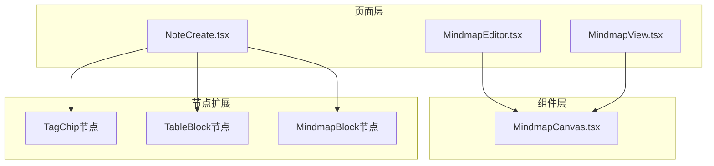

**图表来源**
- [NoteCreate.tsx:265-659](file://src/app/pages/NoteCreate.tsx#L265-L659)
- [MindmapEditor.tsx:1-390](file://src/app/components/MindmapEditor.tsx#L1-L390)
- [MindmapCanvas.tsx:1-421](file://src/app/components/MindmapCanvas.tsx#L1-L421)

**章节来源**
- [NoteCreate.tsx:1084-1180](file://src/app/pages/NoteCreate.tsx#L1084-L1180)

## 核心组件

本项目的核心是三个自定义的Tiptap节点扩展，它们各自具有独特的功能和实现方式：

### 节点扩展类型

1. **TagChip标签芯片节点**
   - 类型：内联原子节点
   - 特性：不可编辑、视觉突出、样式化徽章
   - 用途：在编辑器中插入标签元素

2. **TableBlock表格块节点**
   - 类型：块级原子节点
   - 特性：只读、纯DOM渲染、样式定制
   - 用途：显示AI生成的表格数据

3. **MindmapBlock思维导图块节点**
   - 类型：块级原子节点
   - 特性：SVG预览、交互式编辑、数据更新
   - 用途：展示和编辑思维导图

**章节来源**
- [NoteCreate.tsx:265-659](file://src/app/pages/NoteCreate.tsx#L265-L659)

## 架构概览

整个自定义节点扩展系统采用分层架构设计，确保了清晰的职责分离和良好的可扩展性：

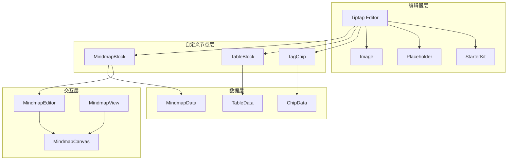

**图表来源**
- [NoteCreate.tsx:1103-1169](file://src/app/pages/NoteCreate.tsx#L1103-L1169)
- [MindmapEditor.tsx:31-390](file://src/app/components/MindmapEditor.tsx#L31-L390)

## 详细组件分析

### TagChip标签芯片节点

TagChip节点是一个内联原子节点，专门用于在富文本编辑器中插入标签元素。

#### 属性定义

| 属性名 | 类型 | 默认值 | 描述 |
|--------|------|--------|------|
| `tag` | string | null | 标签名称，用于标识标签内容 |

#### HTML解析规则

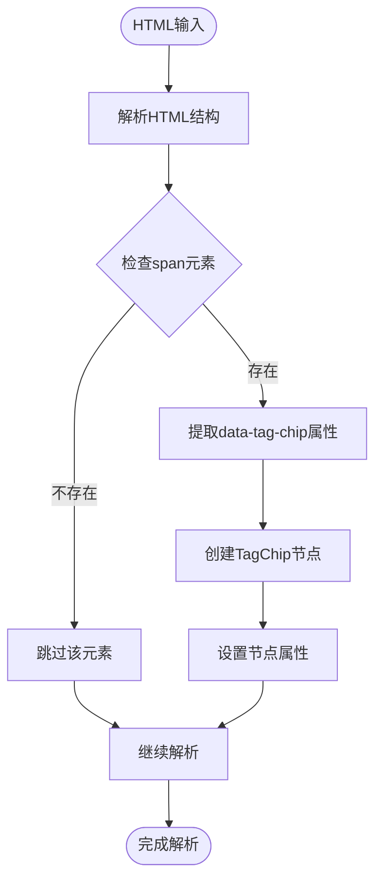

**图表来源**
- [NoteCreate.tsx:284-286](file://src/app/pages/NoteCreate.tsx#L284-L286)

#### DOM渲染逻辑

TagChip节点使用纯DOM渲染方式，避免与React组件系统的冲突：

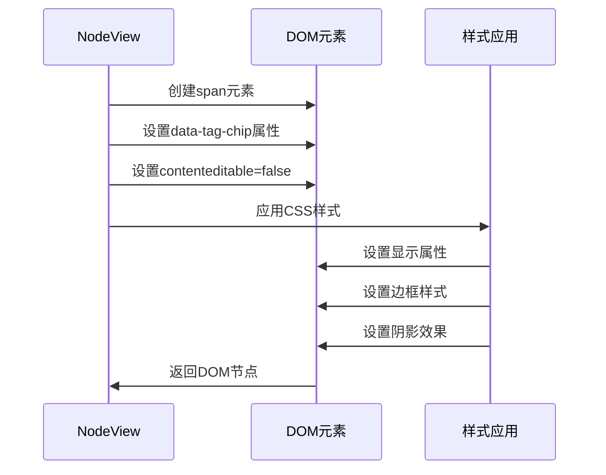

**图表来源**
- [NoteCreate.tsx:299-329](file://src/app/pages/NoteCreate.tsx#L299-L329)

#### 样式特性

TagChip节点采用了精心设计的样式系统：

- **容器样式**：内联弹性布局，居中对齐，圆角设计
- **颜色方案**：紫色渐变背景，半透明边框，阴影效果
- **字体设置**：11.5px字体大小，700字重，#4338CA颜色
- **交互状态**：禁用用户选择，设置默认光标

**章节来源**
- [NoteCreate.tsx:265-330](file://src/app/pages/NoteCreate.tsx#L265-L330)

### TableBlock表格块节点

TableBlock节点是一个块级原子节点，专门用于显示AI生成的表格数据。

#### 数据存储格式

表格数据采用JSON格式存储，包含以下结构：

```typescript
interface TableData {
  columns: string[];  // 表头列名数组
  rows: string[][];   // 表格行数据二维数组
}
```

#### HTML解析规则

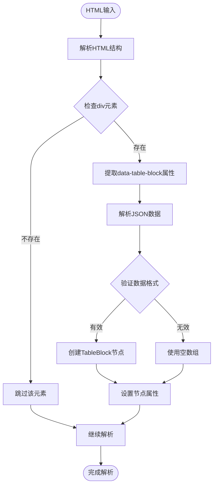

**图表来源**
- [NoteCreate.tsx:350-352](file://src/app/pages/NoteCreate.tsx#L350-L352)

#### DOM渲染逻辑

TableBlock节点使用纯DOM渲染方式，构建完整的表格结构：

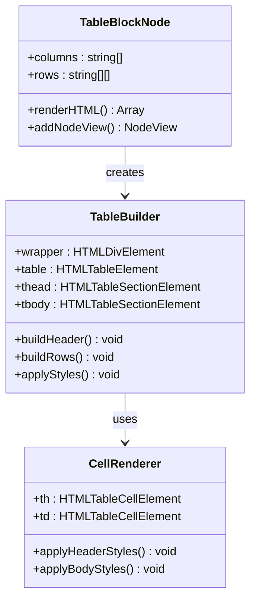

**图表来源**
- [NoteCreate.tsx:358-433](file://src/app/pages/NoteCreate.tsx#L358-L433)

#### 样式定制

TableBlock节点提供了丰富的样式定制选项：

- **容器样式**：12px外边距，14px圆角，#EEECF8边框
- **表头样式**：#F5F3FF背景，1.5px底部边框，#E4E0F5颜色
- **行交替样式**：偶数行#FFFFFF，奇数行#FAFAF8
- **单元格样式**：9px 14px内边距，白色背景，#F3F1F8边框

**章节来源**
- [NoteCreate.tsx:332-433](file://src/app/pages/NoteCreate.tsx#L332-L433)

### MindmapBlock思维导图块节点

MindmapBlock节点是最复杂的自定义节点，集成了SVG预览、交互编辑和数据更新功能。

#### 数据模型

```typescript
interface MindmapData {
  central_topic: string;  // 中心主题
  nodes: MindmapBranchNode[];  // 主分支节点数组
}

interface MindmapBranchNode {
  id: string;           // 分支ID
  text: string;         // 分支文本
  children?: MindmapChildNode[];  // 子节点数组
}

interface MindmapChildNode {
  id: string;           // 子节点ID
  text: string;         // 子节点文本
}
```

#### SVG预览生成

MindmapBlock节点使用SVG技术生成思维导图预览：

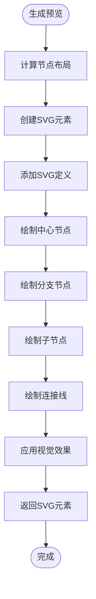

**图表来源**
- [NoteCreate.tsx:519-628](file://src/app/pages/NoteCreate.tsx#L519-L628)

#### 交互事件处理

MindmapBlock节点支持多种交互事件：

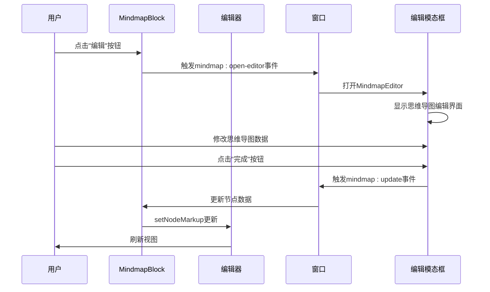

**图表来源**
- [NoteCreate.tsx:506-512](file://src/app/pages/NoteCreate.tsx#L506-L512)
- [NoteCreate.tsx:634-647](file://src/app/pages/NoteCreate.tsx#L634-L647)

#### 数据更新机制

MindmapBlock节点通过CustomEvent实现数据更新：

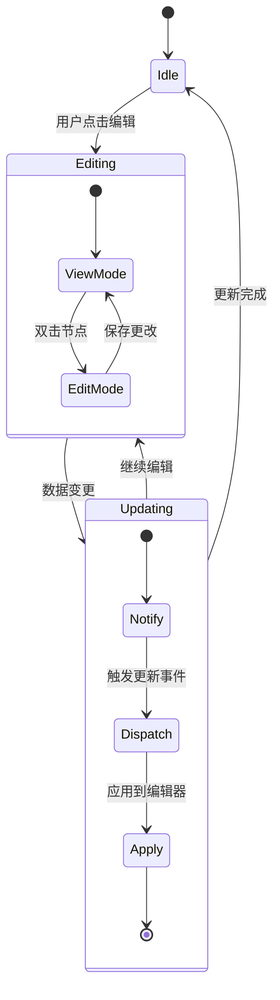

**图表来源**
- [NoteCreate.tsx:633-656](file://src/app/pages/NoteCreate.tsx#L633-L656)

**章节来源**
- [NoteCreate.tsx:435-659](file://src/app/pages/NoteCreate.tsx#L435-L659)

## 依赖关系分析

自定义节点扩展之间的依赖关系体现了清晰的分层架构：

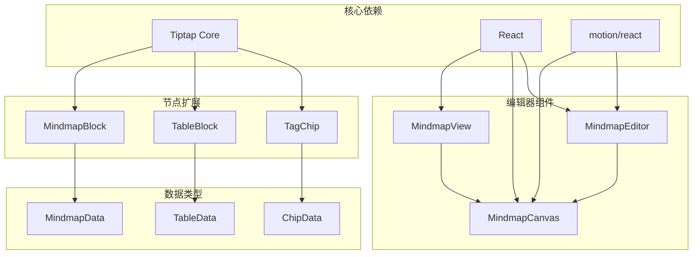

**图表来源**
- [NoteCreate.tsx:1103-1169](file://src/app/pages/NoteCreate.tsx#L1103-L1169)
- [MindmapEditor.tsx:10-21](file://src/app/components/MindmapEditor.tsx#L10-L21)

**章节来源**
- [NoteCreate.tsx:1103-1180](file://src/app/pages/NoteCreate.tsx#L1103-L1180)

## 性能考虑

### 渲染优化策略

1. **纯DOM渲染**：所有自定义节点都使用原生DOM创建，避免React组件树的额外开销
2. **懒加载机制**：MindmapBlock节点仅在需要时才创建复杂的SVG结构
3. **事件委托**：MindmapCanvas组件使用事件委托减少事件监听器数量
4. **内存管理**：节点销毁时正确清理事件监听器和DOM引用

### 内存管理

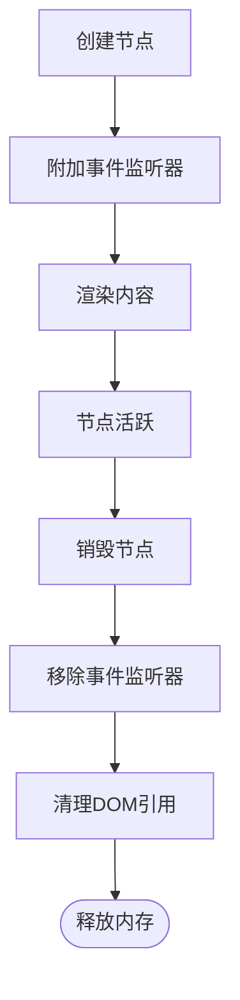

**图表来源**
- [NoteCreate.tsx:651-656](file://src/app/pages/NoteCreate.tsx#L651-L656)

### 性能监控

- **编辑器更新频率**：通过计数器控制React重新渲染频率
- **SVG渲染优化**：使用motion/react进行动画优化
- **事件处理优化**：使用useCallback和useMemo避免不必要的重渲染

## 故障排除指南

### 常见问题及解决方案

#### 节点无法渲染

**问题描述**：自定义节点在编辑器中不显示

**可能原因**：
1. 节点扩展未正确注册到编辑器
2. HTML解析规则不匹配
3. DOM渲染函数错误

**解决方案**：
```typescript
// 确保节点扩展正确注册
extensions: [
  StarterKit.configure({ heading: { levels: [1, 2, 3] }, codeBlock: false }),
  Placeholder.configure({ placeholder: '开始记录你的灵感…' }),
  Image.configure({ inline: false, allowBase64: true }),
  TableBlock,      // 确保这里
  MindmapBlock,    // 和这里
  TagChip,         // 都正确注册
]
```

#### 数据序列化问题

**问题描述**：节点数据在保存或传输时出现格式错误

**解决方案**：
```typescript
// 使用try-catch处理JSON解析
let columns: string[] = [];
let rows: string[][] = [];
try { 
  columns = JSON.parse(node.attrs.columns); 
} catch {
  columns = [];
}
try { 
  rows = JSON.parse(node.attrs.rows); 
} catch {
  rows = [];
}
```

#### 事件监听器泄漏

**问题描述**：节点销毁后仍然响应事件

**解决方案**：
```typescript
// 在destroy函数中清理事件监听器
return {
  dom: wrapper,
  destroy: () => {
    window.removeEventListener(`mindmap:update-${mindmapId}`, handleUpdate);
  },
};
```

**章节来源**
- [NoteCreate.tsx:358-433](file://src/app/pages/NoteCreate.tsx#L358-L433)
- [NoteCreate.tsx:651-656](file://src/app/pages/NoteCreate.tsx#L651-L656)

## 结论

本项目的自定义节点扩展展现了现代前端开发的最佳实践：

1. **架构设计**：采用分层架构，职责清晰，易于维护
2. **性能优化**：通过纯DOM渲染和事件优化确保流畅体验
3. **用户体验**：提供直观的交互和丰富的视觉效果
4. **可扩展性**：模块化设计便于添加新的节点类型

这些节点扩展不仅增强了编辑器的功能，还为开发者提供了可复用的组件模式，可以作为其他自定义节点开发的参考模板。

## 附录

### 开发最佳实践

1. **节点设计原则**
   - 保持单一职责
   - 提供清晰的API接口
   - 实现完整的生命周期管理

2. **性能优化建议**
   - 使用纯DOM渲染避免React开销
   - 合理使用事件委托
   - 及时清理资源和监听器

3. **兼容性处理**
   - 兼容不同浏览器的SVG支持
   - 处理移动端触摸事件
   - 支持键盘导航

4. **测试策略**
   - 单元测试覆盖关键逻辑
   - 集成测试验证整体功能
   - 性能测试确保响应速度