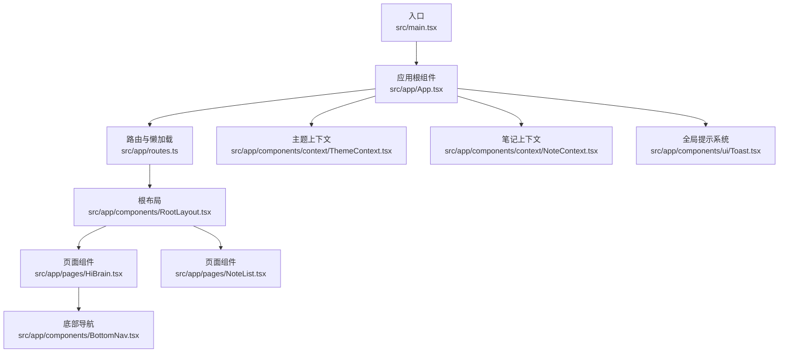
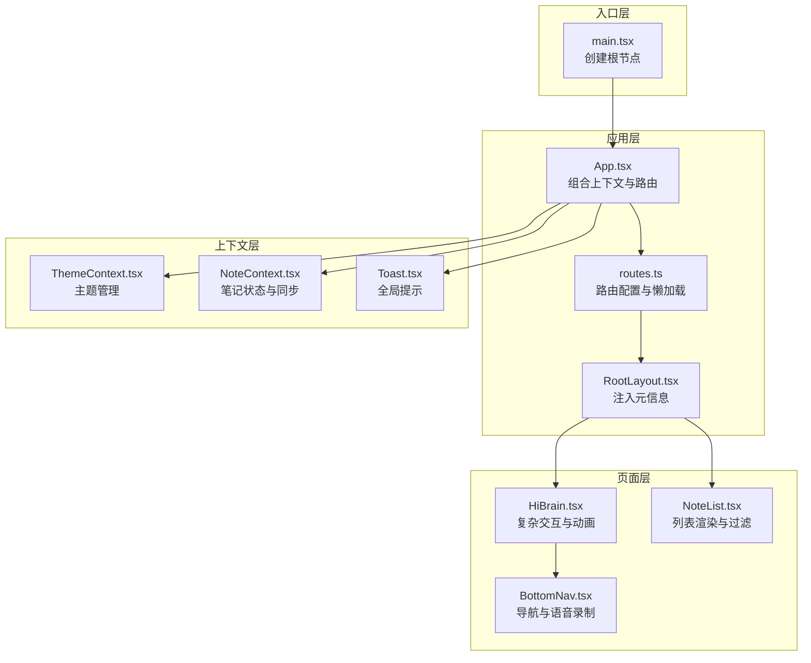
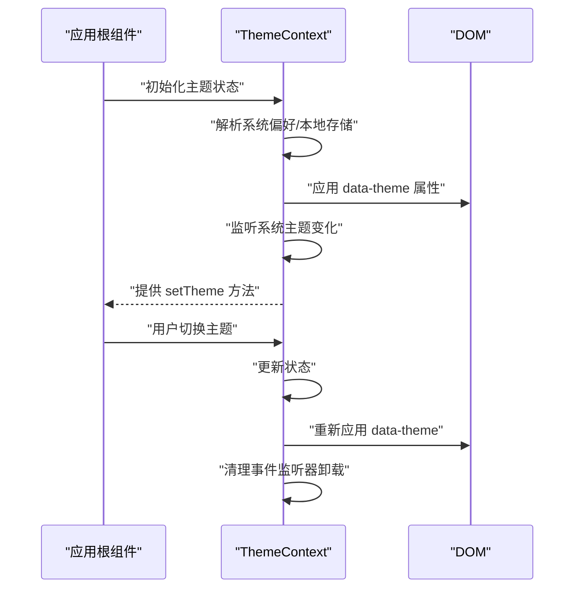
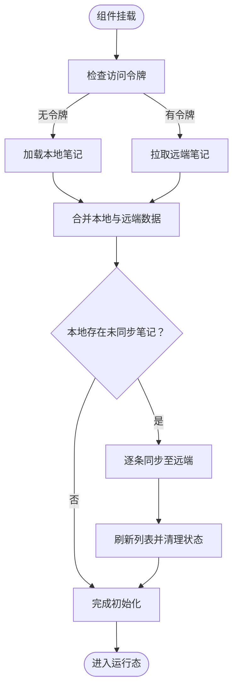
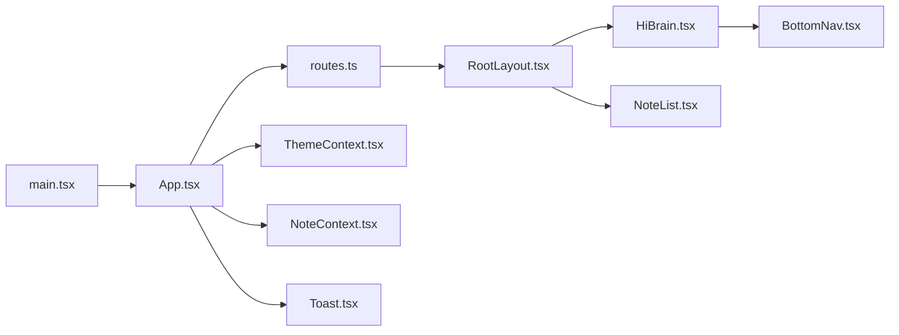

# 节点生命周期管理

<cite>
**本文引用的文件**
- [src/app/App.tsx](file://src/app/App.tsx)
- [src/main.tsx](file://src/main.tsx)
- [src/app/routes.ts](file://src/app/routes.ts)
- [src/app/components/context/NoteContext.tsx](file://src/app/components/context/NoteContext.tsx)
- [src/app/components/context/ThemeContext.tsx](file://src/app/components/context/ThemeContext.tsx)
- [src/app/components/ui/Toast.tsx](file://src/app/components/ui/Toast.tsx)
- [src/app/components/RootLayout.tsx](file://src/app/components/RootLayout.tsx)
- [src/app/components/BottomNav.tsx](file://src/app/components/BottomNav.tsx)
- [src/app/pages/HiBrain.tsx](file://src/app/pages/HiBrain.tsx)
- [src/app/pages/NoteList.tsx](file://src/app/pages/NoteList.tsx)
</cite>

## 目录
1. [简介](#简介)
2. [项目结构](#项目结构)
3. [核心组件](#核心组件)
4. [架构总览](#架构总览)
5. [详细组件分析](#详细组件分析)
6. [依赖关系分析](#依赖关系分析)
7. [性能考量](#性能考量)
8. [故障排查指南](#故障排查指南)
9. [结论](#结论)
10. [附录](#附录)

## 简介
本文件围绕前端应用中的“节点生命周期管理”展开，系统性阐述自定义节点（React 组件）的创建、挂载、更新与销毁过程，覆盖初始化参数、状态管理、内存清理、渲染周期、视图更新策略、性能优化、节点间通信与事件传播、数据同步、错误处理与异常恢复、调试支持，以及热重载、动态加载与卸载机制。文档以实际源码为依据，结合可视化图示帮助读者建立从入口到页面组件的完整生命周期认知。

## 项目结构
应用采用 React + Vite 架构，通过路由懒加载与上下文提供者实现节点的生命周期管理与状态共享。根节点由入口文件创建，顶层布局负责注入元信息与全局主题，路由层负责页面级节点的按需加载与切换，上下文提供者负责跨组件的状态与副作用管理。

图表来源
- [src/main.tsx:1-7](file://src/main.tsx#L1-L7)
- [src/app/App.tsx:1-20](file://src/app/App.tsx#L1-L20)
- [src/app/routes.ts:1-63](file://src/app/routes.ts#L1-L63)
- [src/app/components/context/ThemeContext.tsx:1-110](file://src/app/components/context/ThemeContext.tsx#L1-L110)
- [src/app/components/context/NoteContext.tsx:1-369](file://src/app/components/context/NoteContext.tsx#L1-L369)
- [src/app/components/ui/Toast.tsx:1-495](file://src/app/components/ui/Toast.tsx#L1-L495)
- [src/app/components/RootLayout.tsx:1-52](file://src/app/components/RootLayout.tsx#L1-L52)
- [src/app/pages/HiBrain.tsx:1-800](file://src/app/pages/HiBrain.tsx#L1-L800)
- [src/app/pages/NoteList.tsx:1-800](file://src/app/pages/NoteList.tsx#L1-L800)

章节来源
- [src/main.tsx:1-7](file://src/main.tsx#L1-L7)
- [src/app/App.tsx:1-20](file://src/app/App.tsx#L1-L20)
- [src/app/routes.ts:1-63](file://src/app/routes.ts#L1-L63)

## 核心组件
- 应用根组件：负责组合主题、笔记、提示等上下文，并包裹 Suspense 与 RouterProvider，确保路由切换时的加载占位与错误边界。
- 路由系统：使用 createBrowserRouter 与 lazy 导入实现页面级节点的按需加载；根据特性开关动态拼接路由。
- 上下文提供者：
  - 主题上下文：管理主题模式、深浅色切换、系统偏好监听与 DOM 属性应用。
  - 笔记上下文：统一管理笔记的增删改查、本地持久化、与后端同步、并发控制与错误处理。
- 全局提示系统：提供多种类型的 Toast，支持自动关闭、动作按钮、动画过渡与计时条。
- 根布局：在挂载时注入 viewport 与 theme-color 元信息，保持主题与背景一致性。
- 页面组件：如“HiBrain”、“笔记列表”，承担复杂交互、动画与数据聚合逻辑。

章节来源
- [src/app/App.tsx:1-20](file://src/app/App.tsx#L1-L20)
- [src/app/routes.ts:1-63](file://src/app/routes.ts#L1-L63)
- [src/app/components/context/ThemeContext.tsx:1-110](file://src/app/components/context/ThemeContext.tsx#L1-L110)
- [src/app/components/context/NoteContext.tsx:1-369](file://src/app/components/context/NoteContext.tsx#L1-L369)
- [src/app/components/ui/Toast.tsx:1-495](file://src/app/components/ui/Toast.tsx#L1-L495)
- [src/app/components/RootLayout.tsx:1-52](file://src/app/components/RootLayout.tsx#L1-L52)

## 架构总览
应用采用“入口 -> 根组件 -> 路由 -> 页面组件”的层级结构，配合上下文提供者实现跨组件状态共享与副作用管理。路由层通过懒加载实现节点的动态加载与卸载，页面组件内部通过 useEffect、useMemo、useCallback 等 Hook 实现生命周期管理与性能优化。

图表来源
- [src/main.tsx:1-7](file://src/main.tsx#L1-L7)
- [src/app/App.tsx:1-20](file://src/app/App.tsx#L1-L20)
- [src/app/routes.ts:1-63](file://src/app/routes.ts#L1-L63)
- [src/app/components/context/ThemeContext.tsx:1-110](file://src/app/components/context/ThemeContext.tsx#L1-L110)
- [src/app/components/context/NoteContext.tsx:1-369](file://src/app/components/context/NoteContext.tsx#L1-L369)
- [src/app/components/ui/Toast.tsx:1-495](file://src/app/components/ui/Toast.tsx#L1-L495)
- [src/app/components/RootLayout.tsx:1-52](file://src/app/components/RootLayout.tsx#L1-L52)
- [src/app/pages/HiBrain.tsx:1-800](file://src/app/pages/HiBrain.tsx#L1-L800)
- [src/app/pages/NoteList.tsx:1-800](file://src/app/pages/NoteList.tsx#L1-L800)
- [src/app/components/BottomNav.tsx:1-387](file://src/app/components/BottomNav.tsx#L1-L387)

## 详细组件分析

### 应用根组件与入口
- 入口文件负责创建根节点并渲染应用根组件。
- 根组件通过 Provider 组合主题、笔记、提示上下文，确保子树可访问全局状态与副作用。
- 使用 Suspense 提供路由切换期间的加载占位，提升用户体验。

章节来源
- [src/main.tsx:1-7](file://src/main.tsx#L1-L7)
- [src/app/App.tsx:1-20](file://src/app/App.tsx#L1-L20)

### 路由与节点动态加载
- 使用 createBrowserRouter 定义路由表，页面组件通过 lazy 导入实现按需加载。
- 根据特性开关动态拼接路由，体现节点的条件性挂载。
- 路由切换触发页面节点的卸载与重新挂载，实现节点生命周期的完整循环。

章节来源
- [src/app/routes.ts:1-63](file://src/app/routes.ts#L1-L63)

### 主题上下文：生命周期与状态管理
- 初始化阶段：读取本地存储的主题设置，解析系统偏好，应用到 <html> 的 data-theme 属性。
- 更新阶段：通过 setTheme 触发状态变更，useEffect 监听并在必要时重新解析主题与 DOM 应用。
- 系统偏好监听：当主题为系统模式时，监听 window.matchMedia 变化，自动调整主题。
- 销毁阶段：移除事件监听器，避免内存泄漏。

图表来源
- [src/app/components/context/ThemeContext.tsx:63-105](file://src/app/components/context/ThemeContext.tsx#L63-L105)

章节来源
- [src/app/components/context/ThemeContext.tsx:1-110](file://src/app/components/context/ThemeContext.tsx#L1-L110)

### 笔记上下文：数据流与生命周期
- 初始化：首次加载时尝试读取本地笔记，若存在令牌则拉取后端数据并合并，随后进行本地笔记同步。
- 增删改查：提供 addNote、deleteNote、updateNote 等方法，内部处理本地/远程分支与乐观更新策略。
- 并发与幂等：通过 ref 标记避免重复同步，捕获错误并回退至本地状态。
- 错误处理：统一捕获异常并抛出可读错误消息，保证上层组件可感知失败原因。
- 销毁：fetchNotes 在组件卸载时不会直接执行，但通过局部变量与定时器清理避免悬挂回调。

图表来源
- [src/app/components/context/NoteContext.tsx:155-231](file://src/app/components/context/NoteContext.tsx#L155-L231)
- [src/app/components/context/NoteContext.tsx:194-223](file://src/app/components/context/NoteContext.tsx#L194-L223)

章节来源
- [src/app/components/context/NoteContext.tsx:1-369](file://src/app/components/context/NoteContext.tsx#L1-L369)

### 全局提示系统：节点式通知的生命周期
- 提供 toast.* API 与 dismiss/clear 能力，内部通过 Context 管理通知队列。
- 支持多类型图标、颜色、动画与倒计时条，单个通知具备独立的生命周期（进入、停留、退出）。
- 自动清理：根据配置或手动调用移除通知，避免堆积。

章节来源
- [src/app/components/ui/Toast.tsx:1-495](file://src/app/components/ui/Toast.tsx#L1-L495)

### 根布局：元信息注入与主题联动
- 挂载时注入 viewport-fit、maximum-scale、user-scalable 等元信息，确保移动端体验一致。
- 动态设置 theme-color 与 body 背景，与主题上下文联动。
- 渲染 Outlet，承载路由切换的页面节点。

章节来源
- [src/app/components/RootLayout.tsx:1-52](file://src/app/components/RootLayout.tsx#L1-L52)

### 页面组件：复杂交互与动画节点
- HiBrain 页面：包含多个弹层、抽屉、动画卡片与思维导图预览，大量使用 motion/AnimatePresence 实现节点的进入/退出动画与挂载/卸载。
- 笔记列表：使用 Masonry 布局与响应式网格，配合 useMemo 与 useCallback 优化渲染性能。
- 底部导航：集成语音录制、未读数统计与动态菜单项，涉及事件监听与资源清理。

章节来源
- [src/app/pages/HiBrain.tsx:1-800](file://src/app/pages/HiBrain.tsx#L1-L800)
- [src/app/pages/NoteList.tsx:1-800](file://src/app/pages/NoteList.tsx#L1-L800)
- [src/app/components/BottomNav.tsx:1-387](file://src/app/components/BottomNav.tsx#L1-L387)

## 依赖关系分析
- 入口依赖根组件；根组件依赖路由、上下文与全局提示。
- 路由依赖页面组件；页面组件依赖上下文与服务层。
- 上下文提供者之间低耦合，通过 React Context 解耦跨组件通信。
- 页面组件内部通过 useEffect、useMemo、useCallback 等 Hook 形成自洽的生命周期管理闭环。

图表来源
- [src/main.tsx:1-7](file://src/main.tsx#L1-L7)
- [src/app/App.tsx:1-20](file://src/app/App.tsx#L1-L20)
- [src/app/routes.ts:1-63](file://src/app/routes.ts#L1-L63)
- [src/app/components/context/ThemeContext.tsx:1-110](file://src/app/components/context/ThemeContext.tsx#L1-L110)
- [src/app/components/context/NoteContext.tsx:1-369](file://src/app/components/context/NoteContext.tsx#L1-L369)
- [src/app/components/ui/Toast.tsx:1-495](file://src/app/components/ui/Toast.tsx#L1-L495)
- [src/app/components/RootLayout.tsx:1-52](file://src/app/components/RootLayout.tsx#L1-L52)
- [src/app/pages/HiBrain.tsx:1-800](file://src/app/pages/HiBrain.tsx#L1-L800)
- [src/app/pages/NoteList.tsx:1-800](file://src/app/pages/NoteList.tsx#L1-L800)
- [src/app/components/BottomNav.tsx:1-387](file://src/app/components/BottomNav.tsx#L1-L387)

## 性能考量
- 懒加载与按需渲染：路由层使用 lazy 导入，减少初始包体积与首屏渲染压力。
- 计算缓存：页面组件广泛使用 useMemo 与 useCallback，避免不必要的重渲染。
- 动画与过渡：motion/AnimatePresence 提供硬件加速的过渡动画，降低主线程阻塞。
- 列表渲染优化：使用响应式网格与虚拟化思路（Masonry），限制一次性渲染节点数量。
- 异步与节流：上下文层对网络请求与定时器进行节流与清理，避免重复请求与内存泄漏。

## 故障排查指南
- 主题切换无效：检查系统偏好监听与 DOM 属性应用逻辑，确认事件绑定与清理是否正确。
- 笔记同步失败：查看上下文中的错误捕获与重试逻辑，确认本地存储键名与数据格式。
- 路由切换闪烁：确认 Suspense 占位与 lazy 导入是否正确配置，避免长任务阻塞渲染。
- 通知不消失：检查 Toast 的自动关闭计时器与 dismiss 调用，确认 Context 状态更新路径。
- 语音录制异常：检查录音服务的启动/停止流程与错误回调，确保资源释放与状态复位。

章节来源
- [src/app/components/context/ThemeContext.tsx:83-92](file://src/app/components/context/ThemeContext.tsx#L83-L92)
- [src/app/components/context/NoteContext.tsx:277-284](file://src/app/components/context/NoteContext.tsx#L277-L284)
- [src/app/components/ui/Toast.tsx:208-214](file://src/app/components/ui/Toast.tsx#L208-L214)
- [src/app/components/BottomNav.tsx:135-221](file://src/app/components/BottomNav.tsx#L135-L221)

## 结论
该应用通过“入口 -> 根组件 -> 路由 -> 页面组件”的分层结构，结合上下文提供者与 Hook 生命周期管理，实现了自定义节点的创建、挂载、更新与销毁的完整闭环。路由懒加载与按需渲染降低了初始开销，上下文层统一了状态与副作用，页面组件通过动画与缓存策略提升了交互体验。同时，完善的错误处理与资源清理机制保障了应用的稳定性与可维护性。

## 附录
- 热重载支持：Vite 默认启用热重载，修改源码后浏览器自动刷新，无需重启开发服务器。
- 动态加载与卸载：路由懒加载与页面组件的按需渲染天然支持动态加载与卸载，切换路由即触发节点的卸载与重新挂载。
- 最佳实践：
  - 在页面组件中使用 useMemo/useCallback 缓存计算结果与回调。
  - 在上下文中集中处理副作用与错误，避免分散在多处。
  - 使用 Suspense 与 lazy 导入优化首屏与路由切换体验。
  - 对定时器、事件监听与订阅进行清理，防止内存泄漏。