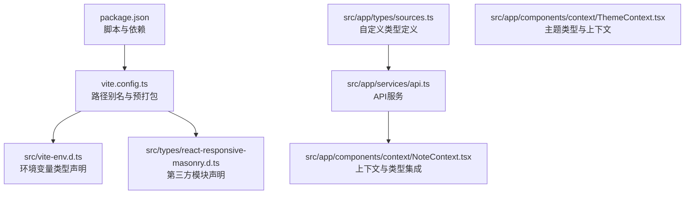
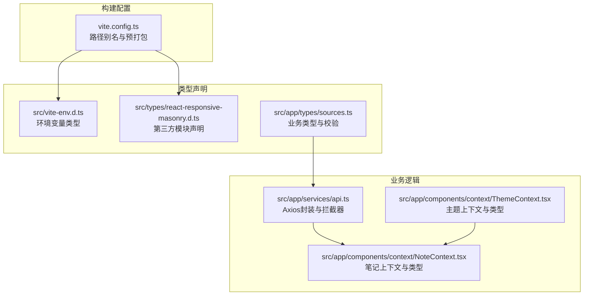
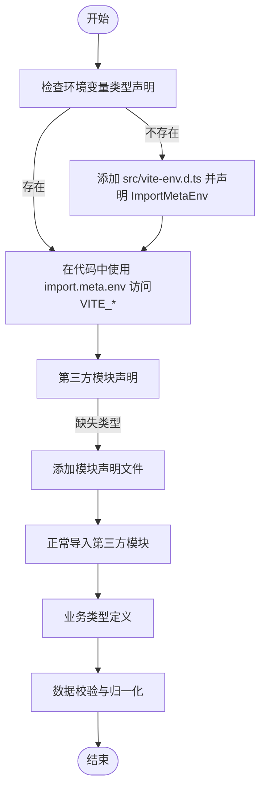
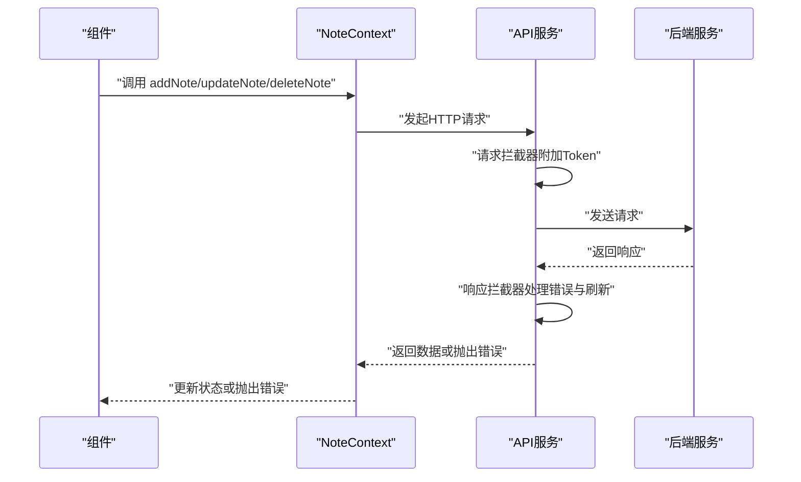
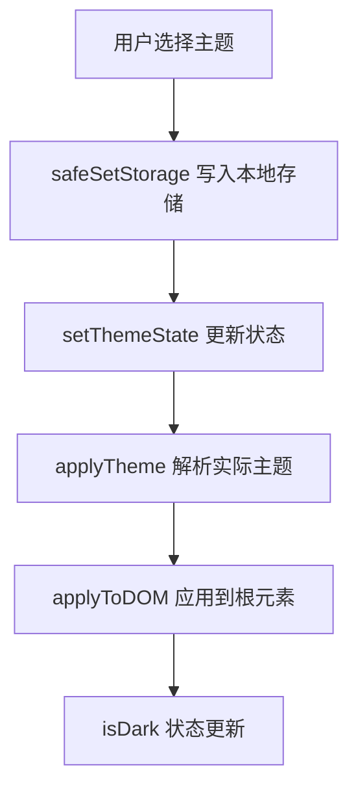
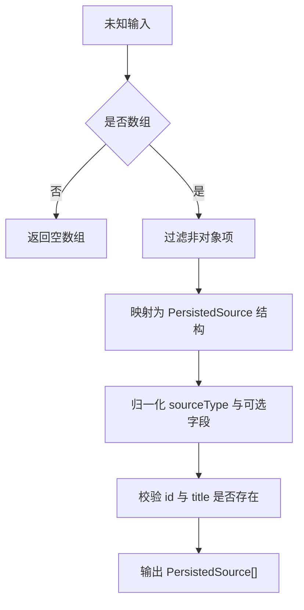
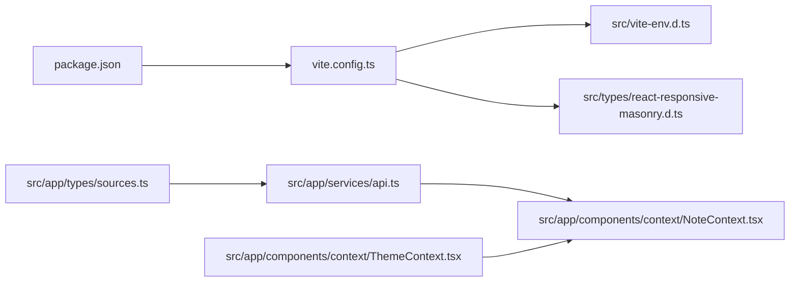

# TypeScript配置与类型安全

<cite>
**本文档引用的文件**
- [package.json](file://package.json)
- [vite.config.ts](file://vite.config.ts)
- [src/vite-env.d.ts](file://src/vite-env.d.ts)
- [src/types/react-responsive-masonry.d.ts](file://src/types/react-responsive-masonry.d.ts)
- [src/app/types/sources.ts](file://src/app/types/sources.ts)
- [src/app/services/api.ts](file://src/app/services/api.ts)
- [src/app/components/context/NoteContext.tsx](file://src/app/components/context/NoteContext.tsx)
- [src/app/components/context/ThemeContext.tsx](file://src/app/components/context/ThemeContext.tsx)
</cite>

## 目录
1. [简介](#简介)
2. [项目结构](#项目结构)
3. [核心组件](#核心组件)
4. [架构总览](#架构总览)
5. [详细组件分析](#详细组件分析)
6. [依赖关系分析](#依赖关系分析)
7. [性能考虑](#性能考虑)
8. [故障排查指南](#故障排查指南)
9. [结论](#结论)
10. [附录](#附录)

## 简介
本指南围绕前端Note-taking应用的TypeScript配置与类型安全实践展开，重点覆盖以下方面：
- 类型定义文件结构：第三方库类型声明与自定义类型定义
- 类型安全最佳实践：接口设计原则、泛型使用、类型推断优化
- 模块声明、路径映射与编译选项配置
- 类型检查策略、错误处理与调试技巧
- 与React组件的类型集成、API响应类型的定义与验证
- 类型声明文件的维护与团队协作中的类型约定

## 项目结构
该项目采用Vite作为构建工具，TypeScript通过Vite插件进行编译与类型检查。项目中存在两类类型声明文件：
- 环境类型声明：用于声明Vite环境变量类型
- 第三方库类型声明：为未内置类型定义的包提供模块声明

图表来源
- [package.json:1-113](file://package.json#L1-L113)
- [vite.config.ts:1-44](file://vite.config.ts#L1-L44)
- [src/vite-env.d.ts:1-13](file://src/vite-env.d.ts#L1-L13)
- [src/types/react-responsive-masonry.d.ts:1-3](file://src/types/react-responsive-masonry.d.ts#L1-L3)
- [src/app/types/sources.ts:1-35](file://src/app/types/sources.ts#L1-L35)
- [src/app/services/api.ts:1-127](file://src/app/services/api.ts#L1-L127)
- [src/app/components/context/NoteContext.tsx:1-356](file://src/app/components/context/NoteContext.tsx#L1-L356)
- [src/app/components/context/ThemeContext.tsx:1-110](file://src/app/components/context/ThemeContext.tsx#L1-L110)

章节来源
- [package.json:1-113](file://package.json#L1-L113)
- [vite.config.ts:1-44](file://vite.config.ts#L1-L44)
- [src/vite-env.d.ts:1-13](file://src/vite-env.d.ts#L1-L13)
- [src/types/react-responsive-masonry.d.ts:1-3](file://src/types/react-responsive-masonry.d.ts#L1-L3)
- [src/app/types/sources.ts:1-35](file://src/app/types/sources.ts#L1-L35)

## 核心组件
- 路径别名与模块解析：通过Vite配置设置@指向src目录，避免相对路径过长带来的可维护性问题
- 环境变量类型声明：在vite-env.d.ts中声明ImportMetaEnv，确保VITE_*变量具备类型提示
- 第三方模块声明：为react-responsive-masonry提供空模块声明，消除模块缺失的类型错误
- 自定义类型定义：在app/types下集中管理业务类型，如数据源类型与校验函数
- 上下文与类型集成：NoteContext与ThemeContext分别定义业务类型与主题类型，并在组件中广泛使用

章节来源
- [vite.config.ts:11-25](file://vite.config.ts#L11-L25)
- [src/vite-env.d.ts:3-10](file://src/vite-env.d.ts#L3-L10)
- [src/types/react-responsive-masonry.d.ts:1-3](file://src/types/react-responsive-masonry.d.ts#L1-L3)
- [src/app/types/sources.ts:1-35](file://src/app/types/sources.ts#L1-L35)
- [src/app/components/context/NoteContext.tsx:4-26](file://src/app/components/context/NoteContext.tsx#L4-L26)
- [src/app/components/context/ThemeContext.tsx:3-15](file://src/app/components/context/ThemeContext.tsx#L3-L15)

## 架构总览
下图展示了TypeScript类型在项目中的分布与交互关系，以及与构建配置的衔接。

图表来源
- [vite.config.ts:1-44](file://vite.config.ts#L1-L44)
- [src/vite-env.d.ts:1-13](file://src/vite-env.d.ts#L1-L13)
- [src/types/react-responsive-masonry.d.ts:1-3](file://src/types/react-responsive-masonry.d.ts#L1-L3)
- [src/app/types/sources.ts:1-35](file://src/app/types/sources.ts#L1-L35)
- [src/app/services/api.ts:1-127](file://src/app/services/api.ts#L1-L127)
- [src/app/components/context/NoteContext.tsx:1-356](file://src/app/components/context/NoteContext.tsx#L1-L356)
- [src/app/components/context/ThemeContext.tsx:1-110](file://src/app/components/context/ThemeContext.tsx#L1-L110)

## 详细组件分析

### 类型定义与模块声明
- 环境变量类型声明：在vite-env.d.ts中为VITE_API_URL与VITE_WIKI_ENABLED声明类型，确保在代码中访问import.meta.env时具备类型提示与约束
- 第三方模块声明：react-responsive-masonry缺少类型定义时，通过空模块声明消除TS报错，便于后续引入其默认导出
- 自定义类型定义：sources.ts集中定义数据源类型与校验函数，包含字符串归一化与数组强制转换，提升数据一致性

图表来源
- [src/vite-env.d.ts:3-10](file://src/vite-env.d.ts#L3-L10)
- [src/types/react-responsive-masonry.d.ts:1-3](file://src/types/react-responsive-masonry.d.ts#L1-L3)
- [src/app/types/sources.ts:12-34](file://src/app/types/sources.ts#L12-L34)

章节来源
- [src/vite-env.d.ts:1-13](file://src/vite-env.d.ts#L1-L13)
- [src/types/react-responsive-masonry.d.ts:1-3](file://src/types/react-responsive-masonry.d.ts#L1-L3)
- [src/app/types/sources.ts:1-35](file://src/app/types/sources.ts#L1-L35)

### API服务与类型集成
- Axios封装：统一设置baseURL、超时与请求头；通过请求/响应拦截器实现鉴权与错误处理
- 类型安全：对响应数据进行结构化访问，避免直接使用any；在错误处理中进行状态码与错误信息的类型化处理
- 与上下文集成：NoteContext通过API服务进行笔记的增删改查，所有操作均基于强类型定义

图表来源
- [src/app/services/api.ts:36-126](file://src/app/services/api.ts#L36-L126)
- [src/app/components/context/NoteContext.tsx:224-340](file://src/app/components/context/NoteContext.tsx#L224-L340)

章节来源
- [src/app/services/api.ts:1-127](file://src/app/services/api.ts#L1-L127)
- [src/app/components/context/NoteContext.tsx:1-356](file://src/app/components/context/NoteContext.tsx#L1-L356)

### 主题上下文与类型设计
- 主题类型：ThemeId枚举约束主题选择范围，结合resolveTheme实现系统/浅色/深色的解析
- 安全存储：通过safeGetStorage与safeSetStorage在受限环境下优雅降级
- DOM应用：applyToDOM将主题状态同步到<html>元素，支持过渡动画

图表来源
- [src/app/components/context/ThemeContext.tsx:63-104](file://src/app/components/context/ThemeContext.tsx#L63-L104)

章节来源
- [src/app/components/context/ThemeContext.tsx:1-110](file://src/app/components/context/ThemeContext.tsx#L1-L110)

### 数据源类型与校验
- 类型定义：PersistedSourceType与PersistedSource定义数据源的类型与字段
- 归一化：normalizeSourceType将输入标准化为受控值，增强兼容性
- 强制转换：coercePersistedSources对未知输入进行过滤与转换，保证输出为强类型数组

图表来源
- [src/app/types/sources.ts:12-34](file://src/app/types/sources.ts#L12-L34)

章节来源
- [src/app/types/sources.ts:1-35](file://src/app/types/sources.ts#L1-L35)

## 依赖关系分析
- 构建与类型：Vite配置影响模块解析与预打包行为，进而影响类型检查与运行时行为
- 环境变量：通过vite-env.d.ts声明的类型确保在不同环境下的变量访问安全
- 第三方模块：react-responsive-masonry等库若无类型定义，需通过模块声明文件补充
- 业务类型：sources.ts中的类型与校验函数被API与上下文广泛使用，形成稳定的类型边界

图表来源
- [package.json:1-113](file://package.json#L1-L113)
- [vite.config.ts:1-44](file://vite.config.ts#L1-L44)
- [src/vite-env.d.ts:1-13](file://src/vite-env.d.ts#L1-L13)
- [src/types/react-responsive-masonry.d.ts:1-3](file://src/types/react-responsive-masonry.d.ts#L1-L3)
- [src/app/types/sources.ts:1-35](file://src/app/types/sources.ts#L1-L35)
- [src/app/services/api.ts:1-127](file://src/app/services/api.ts#L1-L127)
- [src/app/components/context/NoteContext.tsx:1-356](file://src/app/components/context/NoteContext.tsx#L1-L356)
- [src/app/components/context/ThemeContext.tsx:1-110](file://src/app/components/context/ThemeContext.tsx#L1-L110)

章节来源
- [package.json:1-113](file://package.json#L1-L113)
- [vite.config.ts:1-44](file://vite.config.ts#L1-L44)
- [src/vite-env.d.ts:1-13](file://src/vite-env.d.ts#L1-L13)
- [src/types/react-responsive-masonry.d.ts:1-3](file://src/types/react-responsive-masonry.d.ts#L1-L3)
- [src/app/types/sources.ts:1-35](file://src/app/types/sources.ts#L1-L35)
- [src/app/services/api.ts:1-127](file://src/app/services/api.ts#L1-L127)
- [src/app/components/context/NoteContext.tsx:1-356](file://src/app/components/context/NoteContext.tsx#L1-L356)
- [src/app/components/context/ThemeContext.tsx:1-110](file://src/app/components/context/ThemeContext.tsx#L1-L110)

## 性能考虑
- 预打包与去重：通过optimizeDeps与dedupe减少重复依赖，降低运行时内存占用与启动时间
- 路径别名：使用@缩短导入路径，提升IDE索引效率与可读性
- 类型检查粒度：在大型项目中建议拆分类型文件，避免单文件过大导致的类型检查开销

## 故障排查指南
- 环境变量类型错误：确认vite-env.d.ts中已声明所需VITE_*变量，避免在组件中直接使用未声明的键
- 第三方模块类型缺失：当导入的包无类型定义时，参考react-responsive-masonry.d.ts添加空模块声明
- API响应类型不一致：在API服务中对响应数据进行结构化访问与类型断言，避免any污染
- 上下文使用错误：确保在NoteContext外部使用useNotes钩子，否则会抛出未包装的错误
- 本地存储异常：ThemeContext中的safeGetStorage与safeSetStorage在受限环境中会静默失败，需在上层进行降级处理

章节来源
- [src/vite-env.d.ts:3-10](file://src/vite-env.d.ts#L3-L10)
- [src/types/react-responsive-masonry.d.ts:1-3](file://src/types/react-responsive-masonry.d.ts#L1-L3)
- [src/app/services/api.ts:56-126](file://src/app/services/api.ts#L56-L126)
- [src/app/components/context/NoteContext.tsx:349-355](file://src/app/components/context/NoteContext.tsx#L349-L355)
- [src/app/components/context/ThemeContext.tsx:34-48](file://src/app/components/context/ThemeContext.tsx#L34-L48)

## 结论
本项目在TypeScript类型安全方面采取了系统化的实践：通过Vite配置实现路径别名与模块解析优化，借助环境变量与第三方模块声明完善类型边界，以自定义类型定义与上下文集成强化业务稳定性。配合API服务的类型化响应处理与主题上下文的安全存储机制，整体提升了开发体验与运行时可靠性。建议在团队协作中持续完善类型声明文件，保持类型定义的可维护性与一致性。

## 附录
- 建议的类型声明文件维护清单
  - 为每个第三方库补充模块声明（若无内置类型）
  - 在src/app/types下集中管理业务类型与校验函数
  - 在组件中优先使用Partial、Pick、Omit等工具类型提升可维护性
  - 对API响应进行结构化访问与类型守卫，避免any的滥用
- 团队协作中的类型约定
  - 统一使用枚举与字面量类型约束可选值
  - 对外暴露的接口尽量使用只读属性与必要字段
  - 对复杂类型使用类型别名与交叉类型组合，提升可读性