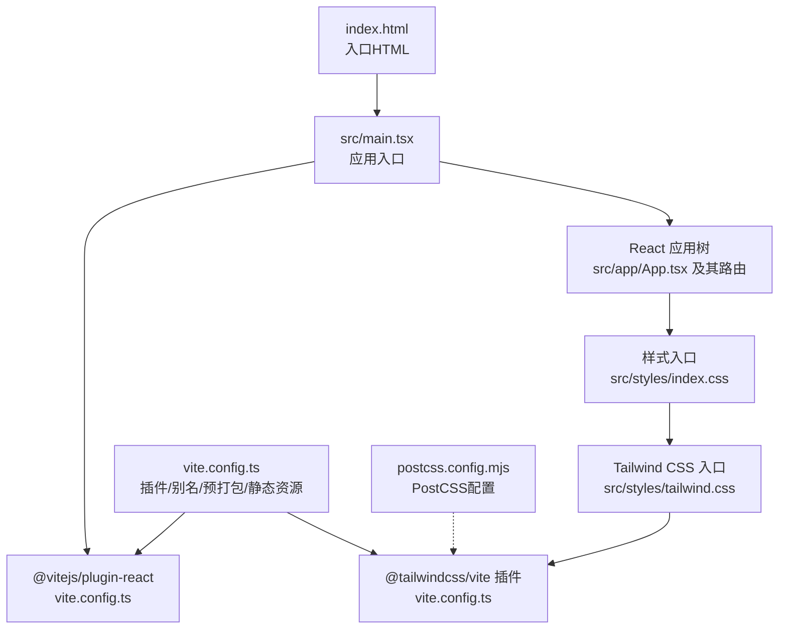
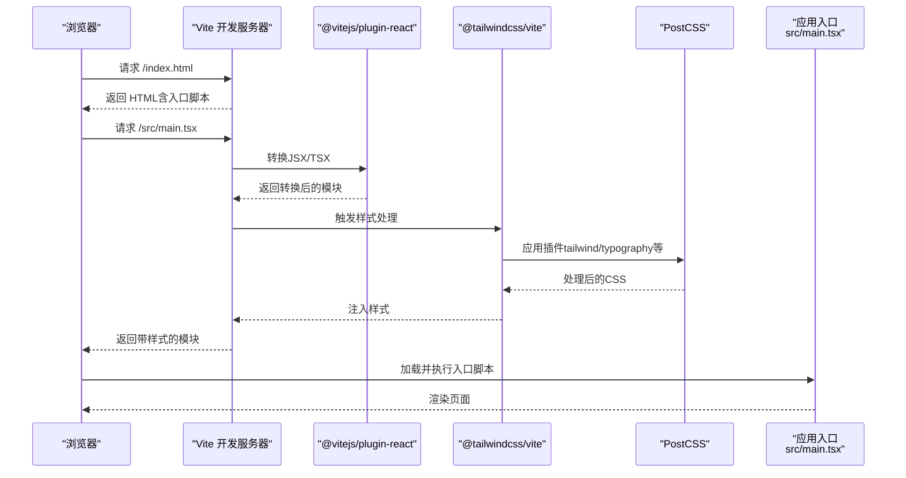
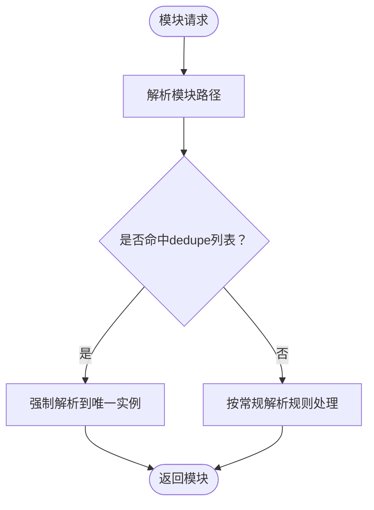
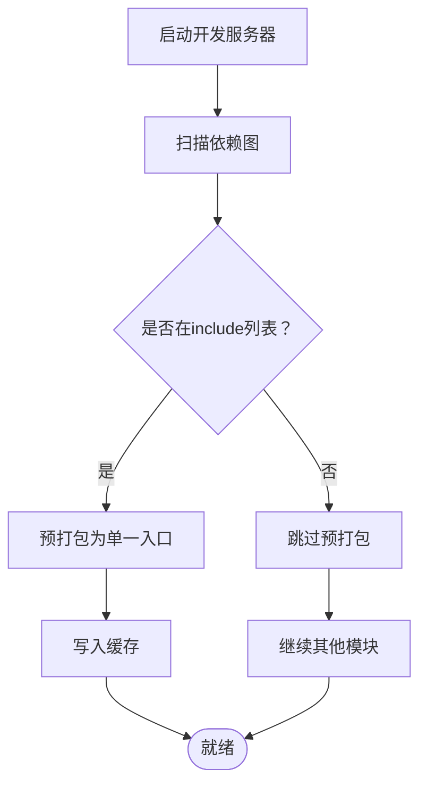
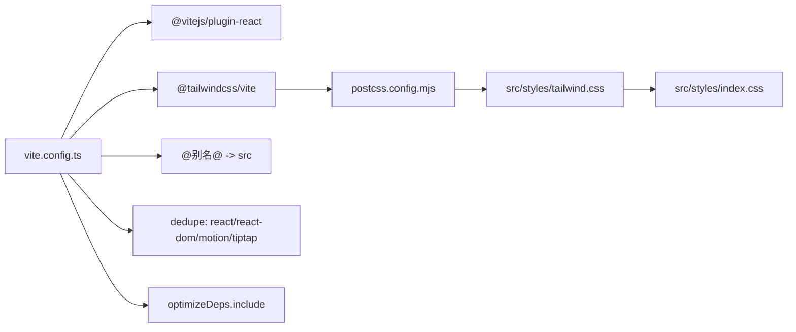

# Vite构建配置

<cite>
**本文引用的文件**
- [vite.config.ts](file://vite.config.ts)
- [package.json](file://package.json)
- [postcss.config.mjs](file://postcss.config.mjs)
- [src/styles/tailwind.css](file://src/styles/tailwind.css)
- [src/styles/index.css](file://src/styles/index.css)
- [src/main.tsx](file://src/main.tsx)
- [index.html](file://index.html)
- [src/vite-env.d.ts](file://src/vite-env.d.ts)
- [README.md](file://README.md)
</cite>

## 目录
1. [简介](#简介)
2. [项目结构](#项目结构)
3. [核心组件](#核心组件)
4. [架构总览](#架构总览)
5. [详细组件分析](#详细组件分析)
6. [依赖关系分析](#依赖关系分析)
7. [性能考量](#性能考量)
8. [故障排查指南](#故障排查指南)
9. [结论](#结论)
10. [附录](#附录)

## 简介
本文件系统性梳理本项目的Vite构建配置，重点覆盖以下方面：
- 插件体系：React与Tailwind CSS插件的集成方式与作用范围
- 路径别名与去重策略：通过dedupe解决React实例冲突
- 依赖预打包优化：optimizeDeps配置对启动速度与运行稳定性的提升
- 开发服务器与热重载：基于Vite的即时反馈机制
- 生产环境优化策略：资源处理与产物质量
- SVG与CSV文件处理：assetsInclude配置与使用场景
- 构建性能调优建议与常见问题排查
- 与其他构建工具的对比与迁移要点

## 项目结构
本项目采用Vite作为前端构建与开发服务器，结合Tailwind CSS v4（通过@tailwindcss/vite插件）进行样式处理，并以React作为主要框架。关键配置集中在vite.config.ts中，样式入口位于src/styles目录，入口脚本在src/main.tsx，HTML模板为index.html。

图表来源
- [vite.config.ts:1-44](file://vite.config.ts#L1-L44)
- [src/main.tsx:1-7](file://src/main.tsx#L1-L7)
- [src/styles/index.css:1-229](file://src/styles/index.css#L1-L229)
- [src/styles/tailwind.css:1-7](file://src/styles/tailwind.css#L1-L7)
- [postcss.config.mjs:1-16](file://postcss.config.mjs#L1-L16)
- [index.html:1-15](file://index.html#L1-L15)

章节来源
- [vite.config.ts:1-44](file://vite.config.ts#L1-L44)
- [src/main.tsx:1-7](file://src/main.tsx#L1-L7)
- [src/styles/index.css:1-229](file://src/styles/index.css#L1-L229)
- [src/styles/tailwind.css:1-7](file://src/styles/tailwind.css#L1-L7)
- [postcss.config.mjs:1-16](file://postcss.config.mjs#L1-L16)
- [index.html:1-15](file://index.html#L1-L15)

## 核心组件
- 插件体系
  - React插件：启用React JSX转换与开发期优化
  - Tailwind CSS插件：通过@tailwindcss/vite自动注入PostCSS管线，无需手动添加tailwindcss/autoprefixer
- 路径别名与去重
  - 别名@指向src目录，便于模块导入
  - dedupe确保React及其生态（如motion、tiptap相关包）解析到同一实例，避免“Invalid hook call”等运行时错误
- 依赖预打包
  - optimizeDeps.include列出高频依赖，保证ESM/CJS混合生态下的一致性与稳定性
- 静态资源处理
  - assetsInclude包含*.svg与*.csv，使这些文件可被直接导入或作为静态资源使用

章节来源
- [vite.config.ts:6-44](file://vite.config.ts#L6-L44)
- [postcss.config.mjs:1-16](file://postcss.config.mjs#L1-L16)
- [package.json:85-112](file://package.json#L85-L112)

## 架构总览
下图展示从浏览器请求到页面渲染的关键流程，包括Vite开发服务器、插件链路、样式管线与资源加载。

图表来源
- [vite.config.ts:6-10](file://vite.config.ts#L6-L10)
- [postcss.config.mjs:1-16](file://postcss.config.mjs#L1-L16)
- [src/main.tsx:1-7](file://src/main.tsx#L1-L7)
- [index.html:10-14](file://index.html#L10-L14)

## 详细组件分析

### 插件配置：React与Tailwind CSS
- React插件
  - 作用：启用JSX/TSX语法转换、开发期HMR优化、常用于React 18并发特性相关的开发体验增强
  - 影响范围：所有源码模块的编译阶段
- Tailwind CSS插件（@tailwindcss/vite）
  - 作用：自动注入Tailwind CSS v4所需的PostCSS插件链，无需在postcss.config.mjs中手动声明tailwindcss/autoprefixer
  - 影响范围：样式模块（CSS/PCSS），与src/styles/tailwind.css配合工作

章节来源
- [vite.config.ts:6-10](file://vite.config.ts#L6-L10)
- [postcss.config.mjs:1-16](file://postcss.config.mjs#L1-L16)
- [src/styles/tailwind.css:1-7](file://src/styles/tailwind.css#L1-L7)

### 路径别名与去重策略（dedupe）
- 路径别名
  - 将@映射到src目录，简化导入路径书写，降低深层相对路径的维护成本
- 去重策略（dedupe）
  - 目标：确保react、react-dom及其运行时入口（jsx-runtime/jsx-dev-runtime）与motion、motion/react等第三方库解析到同一实例
  - 解决的问题：多版本/多实例导致的“Invalid hook call”、状态不一致、HMR异常等问题
  - 实施位置：resolve.dedupe数组

图表来源
- [vite.config.ts:11-25](file://vite.config.ts#L11-L25)

章节来源
- [vite.config.ts:11-25](file://vite.config.ts#L11-L25)

### 依赖预打包优化（optimizeDeps）
- 目标：在冷启动时对高频依赖进行预打包，减少首次请求的解析与转换开销
- include清单：包含react、react-dom、其运行时入口、motion、motion/react及tiptap相关包
- 价值：在ESM/CJS混用环境下，避免重复打包或缺失依赖导致的运行时错误；同时缩短首屏等待时间

图表来源
- [vite.config.ts:27-41](file://vite.config.ts#L27-L41)

章节来源
- [vite.config.ts:27-41](file://vite.config.ts#L27-L41)

### 开发服务器与热重载机制
- 开发服务器
  - 由Vite内置提供，支持模块热替换（HMR）、快速冷启动与实时错误提示
- 热重载
  - React插件与@tailwindcss/vite协同工作，确保样式变更与组件更新即时生效
  - 对于SVG/CSV等静态资源，assetsInclude配置使其可被正确识别与注入

章节来源
- [vite.config.ts:6-10](file://vite.config.ts#L6-L10)
- [vite.config.ts:43](file://vite.config.ts#L43)

### 生产环境优化策略
- 样式处理
  - Tailwind CSS v4通过@tailwindcss/vite自动注入必要插件，无需额外配置
  - 自定义PostCSS插件可在postcss.config.mjs中扩展（当前为空配置）
- 资源处理
  - SVG与CSV通过assetsInclude纳入构建流程，适合图标、数据可视化等场景
- 构建产物
  - 使用Vite默认Rollup打包器，具备现代浏览器优化能力（按需引入、Tree Shaking等）

章节来源
- [postcss.config.mjs:1-16](file://postcss.config.mjs#L1-L16)
- [vite.config.ts:43](file://vite.config.ts#L43)

### SVG与CSV文件处理配置
- 配置位置：vite.config.ts中的assetsInclude
- 作用：允许在代码中直接导入SVG/CSV，或将其作为静态资源分发
- 使用建议：
  - SVG：可作为组件导入或字符串资源使用；注意控制文件体积与缓存策略
  - CSV：适合数据可视化或表格渲染场景，建议配合解析库使用

章节来源
- [vite.config.ts:43](file://vite.config.ts#L43)

### 与其他构建工具的对比与迁移指南
- 与Webpack对比
  - 启动速度：Vite基于原生ESM与esbuild预构建，通常更快
  - HMR：Vite的HMR更细粒度且无需额外配置
  - 样式：Vite+Tailwind CSS v4通过插件自动注入，相较Webpack需要额外loader与插件组合更简洁
- 迁移建议
  - 保留现有React生态（hooks、context、路由等）无需改动
  - 将PostCSS相关配置迁移至postcss.config.mjs或交由@tailwindcss/vite管理
  - 如有自定义loader需求，优先评估是否可通过Vite插件或原生能力替代

## 依赖关系分析
- 组件耦合
  - vite.config.ts集中声明插件与优化策略，与具体业务代码解耦
  - React/Tailwind生态通过插件与样式入口文件连接
- 外部依赖
  - React与React DOM版本由package.json约束并通过pnpm overrides对齐
  - Tailwind CSS v4与@tailwindcss/vite版本匹配，确保插件链正确

图表来源
- [vite.config.ts:6-44](file://vite.config.ts#L6-L44)
- [postcss.config.mjs:1-16](file://postcss.config.mjs#L1-L16)
- [src/styles/tailwind.css:1-7](file://src/styles/tailwind.css#L1-L7)
- [src/styles/index.css:1-229](file://src/styles/index.css#L1-L229)

章节来源
- [vite.config.ts:6-44](file://vite.config.ts#L6-L44)
- [package.json:85-112](file://package.json#L85-L112)

## 性能考量
- 启动与冷启动
  - optimizeDeps.include明确列出高频依赖，减少首次打包与解析时间
  - dedupe避免重复实例带来的额外开销与潜在错误
- 编译与打包
  - React插件启用开发期优化，减少不必要的重渲染与调试负担
  - Tailwind CSS v4通过插件自动注入，避免重复配置导致的编译链冗余
- 资源加载
  - assetsInclude确保SVG/CSV可被按需加载，避免额外网络往返
- 生产构建
  - 保持默认Rollup优化策略，结合现代浏览器特性进行输出优化

## 故障排查指南
- “Invalid hook call”或React实例冲突
  - 检查dedupe配置是否包含react、react-dom及其运行时入口
  - 确认package.json中React版本通过overrides对齐
- 样式未生效或构建报错
  - 确认src/styles/tailwind.css中@import与@source声明正确
  - 若需额外PostCSS插件，仅在postcss.config.mjs中追加，避免重复声明
- SVG/CSV无法导入
  - 检查vite.config.ts中assetsInclude是否包含对应通配符
  - 在代码中以模块方式导入或通过静态资源路径访问
- 开发服务器HMR异常
  - 清理缓存后重启（删除.node_modules/.vite或缓存目录）
  - 确保React插件与@tailwindcss/vite均处于启用状态

章节来源
- [vite.config.ts:11-25](file://vite.config.ts#L11-L25)
- [vite.config.ts:27-41](file://vite.config.ts#L27-L41)
- [vite.config.ts:43](file://vite.config.ts#L43)
- [postcss.config.mjs:1-16](file://postcss.config.mjs#L1-L16)
- [src/styles/tailwind.css:1-7](file://src/styles/tailwind.css#L1-L7)
- [package.json:85-112](file://package.json#L85-L112)

## 结论
本项目的Vite配置围绕“简洁、稳定、高性能”展开：通过@tailwindcss/vite与@vitejs/plugin-react实现开箱即用的现代化开发体验；借助dedupe与optimizeDeps解决React实例冲突与冷启动性能问题；assetsInclude覆盖SVG/CSV等常用静态资源。整体配置与React/Tiptap/Motion等生态高度兼容，适合持续迭代的前端工程化实践。

## 附录
- 环境变量与平台适配
  - 通过src/vite-env.d.ts声明VITE_API_URL、VITE_WIKI_ENABLED等环境变量类型
  - README提供开发与运行说明，便于团队协作与CI/CD集成

章节来源
- [src/vite-env.d.ts:1-12](file://src/vite-env.d.ts#L1-L12)
- [README.md:1-41](file://README.md#L1-L41)