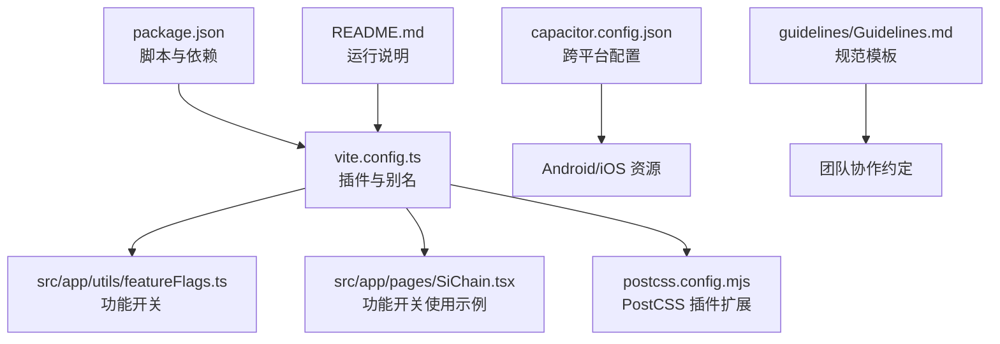
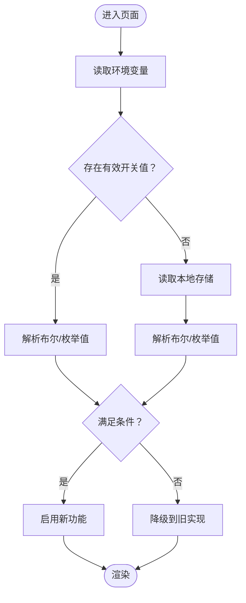
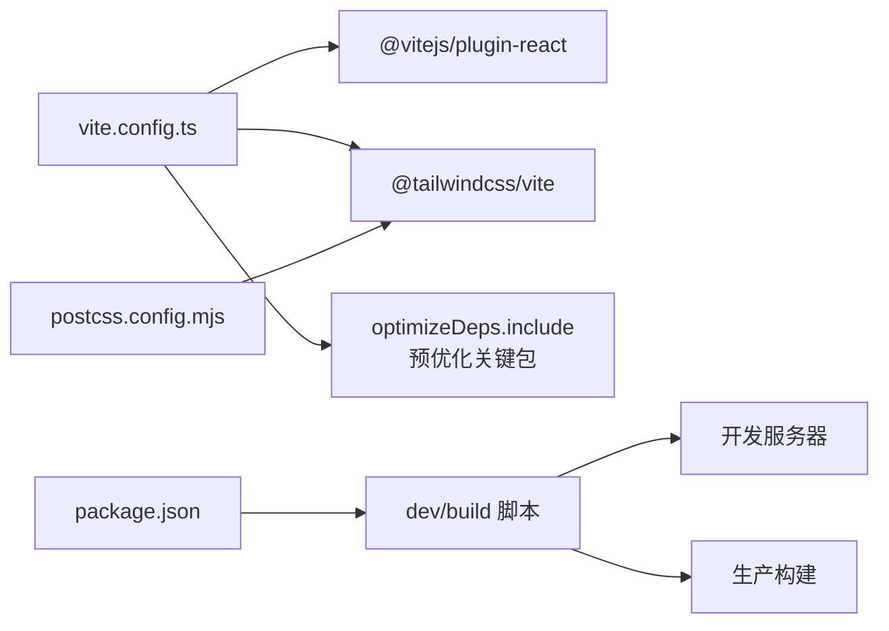

# 代码质量工具

<cite>
**本文引用的文件**
- [package.json](file://package.json)
- [vite.config.ts](file://vite.config.ts)
- [postcss.config.mjs](file://postcss.config.mjs)
- [README.md](file://README.md)
- [guidelines/Guidelines.md](file://guidelines/Guidelines.md)
- [capacitor.config.json](file://capacitor.config.json)
- [src/app/utils/featureFlags.ts](file://src/app/utils/featureFlags.ts)
- [src/app/pages/SiChain.tsx](file://src/app/pages/SiChain.tsx)
</cite>

## 目录
1. [简介](#简介)
2. [项目结构](#项目结构)
3. [核心组件](#核心组件)
4. [架构总览](#架构总览)
5. [详细组件分析](#详细组件分析)
6. [依赖分析](#依赖分析)
7. [性能考虑](#性能考虑)
8. [故障排查指南](#故障排查指南)
9. [结论](#结论)
10. [附录](#附录)

## 简介
本指南面向前端工程团队，系统性梳理并落地代码质量工具与规范，覆盖以下方面：
- ESLint 配置与规则：React 规则、TypeScript 规则、自定义规则建议
- Prettier 格式化：配置与编辑器集成、提交前格式化
- 代码审查流程、静态分析与自动化质量检查
- 代码规范制定、团队协作约定与代码重构策略
- 功能开关（Feature Flags）：渐进式发布与 A/B 测试
- 缓存策略、性能监控与代码覆盖率分析

当前仓库未包含 ESLint 与 Prettier 的显式配置文件，但已具备基础的构建与运行环境，可在此基础上快速接入并标准化。

## 项目结构
前端采用 Vite 构建，React 作为核心框架，Tailwind CSS 通过 Vite 插件集成；Capacitor 用于跨平台打包；部分页面与工具中包含功能开关逻辑，为后续引入 ESLint/Prettier 提供了落地场景。



**图示来源**
- [package.json:1-113](file://package.json#L1-L113)
- [vite.config.ts:1-44](file://vite.config.ts#L1-L44)
- [postcss.config.mjs:1-16](file://postcss.config.mjs#L1-L16)
- [capacitor.config.json:1-31](file://capacitor.config.json#L1-L31)
- [README.md:1-41](file://README.md#L1-L41)
- [guidelines/Guidelines.md:1-62](file://guidelines/Guidelines.md#L1-L62)
- [src/app/utils/featureFlags.ts:1-14](file://src/app/utils/featureFlags.ts#L1-L14)
- [src/app/pages/SiChain.tsx:1502-1547](file://src/app/pages/SiChain.tsx#L1502-L1547)

**章节来源**
- [package.json:1-113](file://package.json#L1-L113)
- [vite.config.ts:1-44](file://vite.config.ts#L1-L44)
- [postcss.config.mjs:1-16](file://postcss.config.mjs#L1-L16)
- [capacitor.config.json:1-31](file://capacitor.config.json#L1-L31)
- [README.md:1-41](file://README.md#L1-L41)
- [guidelines/Guidelines.md:1-62](file://guidelines/Guidelines.md#L1-L62)

## 核心组件
- 构建与开发环境：Vite + React 插件 + Tailwind CSS 插件
- 代码风格：通过 Prettier 统一格式化，结合编辑器钩子与提交前检查
- 静态分析：ESLint（React、TypeScript 规则）与自定义规则
- 代码审查：PR 规范、自动化质量门禁
- 功能开关：基于环境变量与本地存储的功能控制
- 性能与监控：缓存策略、性能指标采集与覆盖率分析

**章节来源**
- [package.json:6-113](file://package.json#L6-L113)
- [vite.config.ts:1-44](file://vite.config.ts#L1-L44)
- [src/app/utils/featureFlags.ts:1-14](file://src/app/utils/featureFlags.ts#L1-L14)

## 架构总览
下图展示从“编辑器保存”到“提交”的质量闭环：编辑器集成 Prettier 自动格式化；提交前通过 Husky + lint-staged 运行 ESLint 与 Prettier；CI 中执行更严格的静态分析与覆盖率检查。

```mermaid
graph TB
subgraph "开发者端"
VS["VS Code/编辑器"] --> P["Prettier 格式化"]
P --> L["ESLint 检查"]
L --> G["git commit"]
end
subgraph "本地钩子"
H["Husky 钩子"] --> S["lint-staged"]
S --> P2["Prettier 格式化"]
S --> L2["ESLint 检查"]
end
subgraph "CI"
CI["CI 服务器"] --> ESL["ESLint 全量检查"]
CI --> COV["覆盖率分析"]
end
G --> H
H --> S
S --> ESL
S --> COV
```

[本图为概念性流程示意，不直接映射具体源码文件，故无“图示来源”]

## 详细组件分析

### ESLint 配置与规则
- React 规则
  - 建议启用 React Hooks 规则集，约束 hooks 使用顺序与依赖数组，避免常见错误。
  - 对 JSX 属性进行一致性校验，确保可读性与可维护性。
- TypeScript 规则
  - 启用 @typescript-eslint 推荐规则，统一类型检查策略。
  - 禁止 any、explicit-function-return-type 等宽松类型，提升类型安全。
- 自定义规则
  - 团队可新增对业务层命名、目录结构、组件命名的强制规则。
  - 对外部依赖版本变更进行白名单校验，防止破坏性更新引入。

[本节为通用实践说明，不直接分析具体文件，故无“章节来源”]

### Prettier 配置与使用
- 配置要点
  - 统一缩进、引号、尾随逗号等风格，与 ESLint 冲突时以 Prettier 为准。
  - 针对 JSON、Markdown、YAML 等非代码文件启用格式化。
- 编辑器集成
  - VS Code 安装 Prettier 扩展，配置“保存时格式化”。
  - 在工作区设置中启用 EditorConfig 与 Prettier 协同。
- 提交前格式化
  - 使用 Husky + lint-staged 在暂存前自动格式化并修复可修复问题。

[本节为通用实践说明，不直接分析具体文件，故无“章节来源”]

### 代码审查流程与自动化质量检查
- PR 规范
  - 必须包含变更摘要、影响范围与测试验证结果。
  - 代码审查至少一名合作者批准，冲突需在合并前解决。
- 自动化门禁
  - CI 中执行 ESLint、Prettier、类型检查与单元测试。
  - 通过覆盖率阈值与关键告警阈值作为合并前置条件。

[本节为通用实践说明，不直接分析具体文件，故无“章节来源”]

### 代码规范制定与重构策略
- 规范制定
  - 参考 guidelines/Guidelines.md 的模板，补充“命名规范、目录结构、组件设计原则、文档要求”等条目。
  - 将规范纳入团队知识库与入职培训材料。
- 重构策略
  - 采用小步快跑，优先处理高风险与高频修改区域。
  - 引入功能开关，逐步替换旧实现，保障线上稳定性。

**章节来源**
- [guidelines/Guidelines.md:1-62](file://guidelines/Guidelines.md#L1-L62)

### 功能开关（Feature Flags）实现与管理
- 实现方式
  - 环境变量：通过 Vite 的 import.meta.env 注入，如 VITE_WIKI_ENABLED。
  - 本地存储：在无后端开关时，回退至 localStorage。
- 使用策略
  - 以布尔值或枚举形式表达开关状态，避免魔法字符串。
  - 在组件渲染与服务调用处统一通过开关函数判断，便于集中治理。
- 渐进式发布与 A/B 测试
  - 通过百分比抽样或用户分群实现灰度发布。
  - 记录开关命中率与关键指标变化，持续优化。



**图示来源**
- [src/app/utils/featureFlags.ts:1-14](file://src/app/utils/featureFlags.ts#L1-L14)
- [src/app/pages/SiChain.tsx:1502-1547](file://src/app/pages/SiChain.tsx#L1502-L1547)

**章节来源**
- [src/app/utils/featureFlags.ts:1-14](file://src/app/utils/featureFlags.ts#L1-L14)
- [src/app/pages/SiChain.tsx:1502-1547](file://src/app/pages/SiChain.tsx#L1502-L1547)

### 缓存策略、性能监控与覆盖率分析
- 缓存策略
  - 前端：合理利用 HTTP 缓存头、Service Worker 与内存缓存，降低重复请求。
  - 移动端：Capacitor 打包后资源缓存与离线策略需结合网络状态动态调整。
- 性能监控
  - 关键指标：首屏时间、交互延迟、内存占用、FPS。
  - 工具：浏览器性能面板、Web Vitals、APM 平台。
- 覆盖率分析
  - 单元测试覆盖率：设置阈值，保证核心路径被覆盖。
  - 集成测试覆盖率：关注跨模块交互与边界场景。

**章节来源**
- [capacitor.config.json:1-31](file://capacitor.config.json#L1-L31)

## 依赖分析
- 构建与样式
  - Vite 提供开发与生产构建能力；Tailwind CSS 通过 @tailwindcss/vite 插件自动配置。
  - PostCSS 配置文件为空，表示默认由 Tailwind 自动处理，如需嵌套等特性可按需扩展。
- 依赖预优化
  - vite.config.ts 中对 React 生态与 tiptap 等关键包进行预优化，减少冷启动与打包体积。
- 运行与开发
  - package.json 提供 dev/build 脚本，README 提供运行说明。



**图示来源**
- [vite.config.ts:1-44](file://vite.config.ts#L1-L44)
- [postcss.config.mjs:1-16](file://postcss.config.mjs#L1-L16)
- [package.json:6-113](file://package.json#L6-L113)

**章节来源**
- [vite.config.ts:1-44](file://vite.config.ts#L1-L44)
- [postcss.config.mjs:1-16](file://postcss.config.mjs#L1-L16)
- [package.json:6-113](file://package.json#L6-L113)

## 性能考虑
- 构建性能
  - 保持依赖精简，避免重复或近似功能的包；利用 optimizeDeps.include 精准预打包。
  - 分包策略：将第三方大包拆分，结合路由懒加载与动态导入。
- 运行性能
  - 组件层面：避免不必要的重渲染，合理使用 memo 与 useMemo/useCallback。
  - 资源层面：图片与字体按需加载，CSS 仅注入必要类名。
- 监控与优化
  - 建立性能基线，定期对比优化前后指标，形成持续改进闭环。

[本节为通用指导，不直接分析具体文件，故无“章节来源”]

## 故障排查指南
- ESLint 报错
  - 若与 Prettier 冲突，优先使用 Prettier 格式化；对不可自动修复的问题手动修正。
  - 检查是否遗漏规则配置或与编辑器扩展冲突。
- Prettier 未生效
  - 确认编辑器已启用保存时格式化；检查 .prettierignore 是否误排除目标文件。
  - 在项目根目录执行一次全量格式化，确保缓存一致。
- 功能开关异常
  - 检查环境变量注入是否正确；确认本地存储键值是否被清理。
  - 通过浏览器控制台输出开关状态，定位解析逻辑问题。
- 构建失败
  - 查看 Vite 日志与报错堆栈；核对 optimizeDeps.include 列表中的包版本兼容性。
  - 清理 node_modules 与 .vite 缓存后重试。

**章节来源**
- [src/app/utils/featureFlags.ts:1-14](file://src/app/utils/featureFlags.ts#L1-L14)
- [README.md:6-11](file://README.md#L6-L11)

## 结论
本指南提供了从工具接入到流程落地的完整方案。建议团队以“先统一格式、再强化规则、最后引入功能开关与监控”的顺序推进，逐步完善质量体系，确保代码一致性、可维护性与可演进性。

[本节为总结性内容，不直接分析具体文件，故无“章节来源”]

## 附录
- 快速落地清单
  - 新增 .eslintrc 与 .prettierrc，统一规则与风格
  - 配置 VS Code 扩展与保存钩子
  - 添加 Husky + lint-staged 提交前检查
  - 在 CI 中增加 ESLint、Prettier、类型检查与覆盖率任务
  - 在 README 中补充代码质量相关说明与贡献指引

[本节为通用附录，不直接分析具体文件，故无“章节来源”]