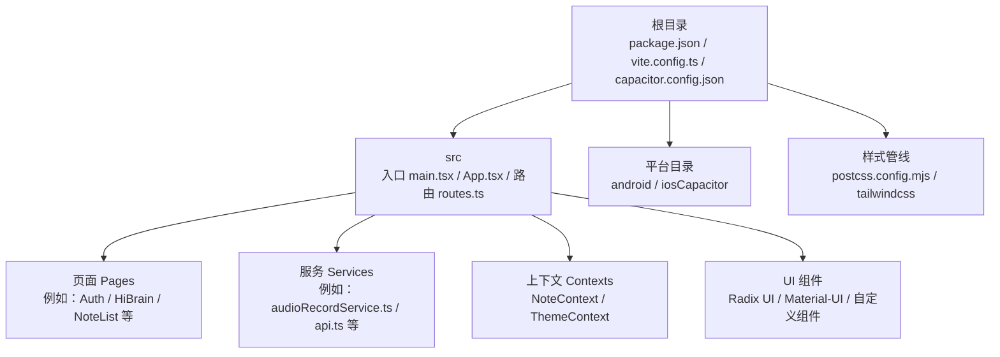
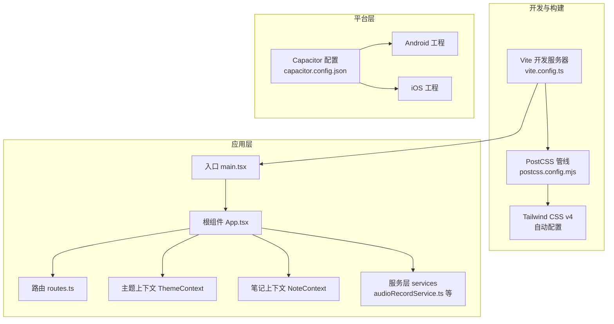
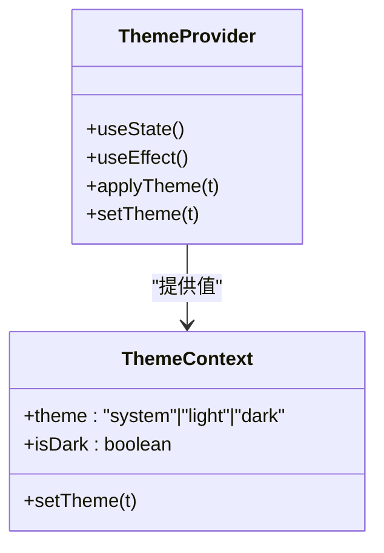
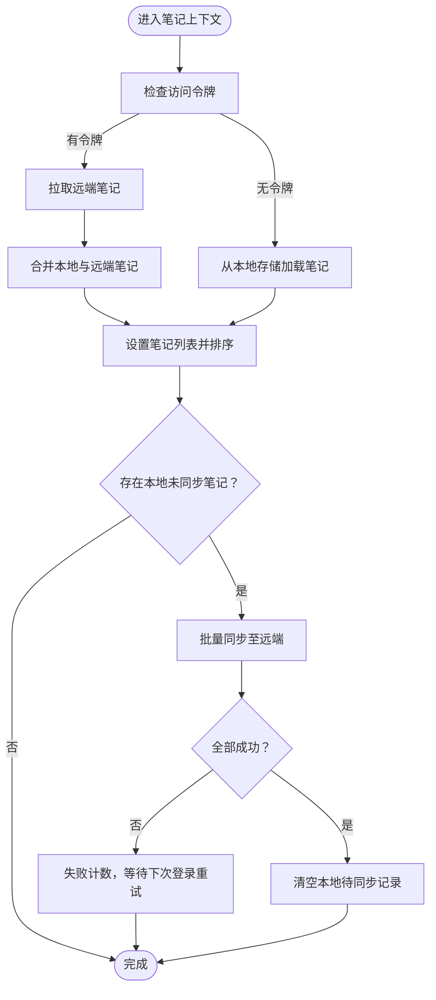
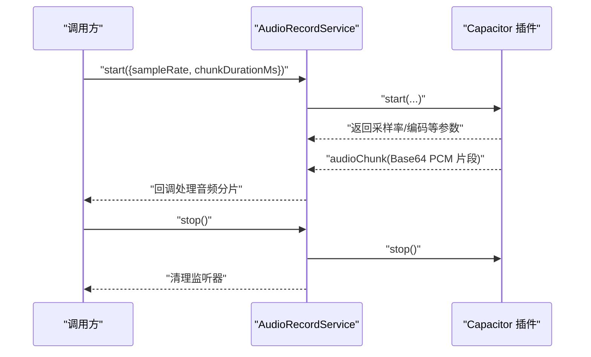
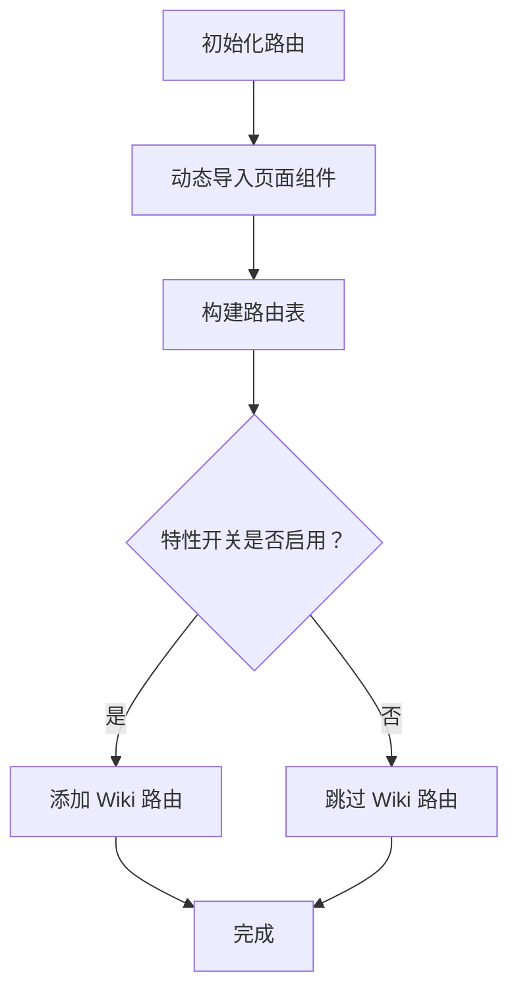
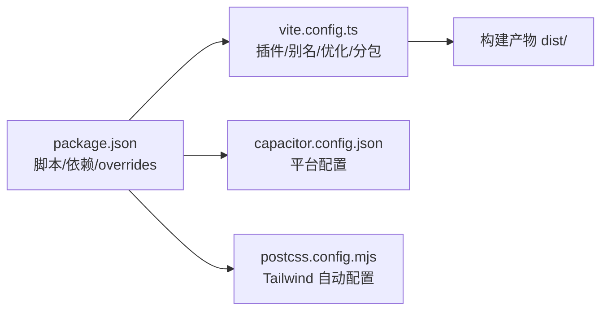

# 开发工作流程

<cite>
**本文引用的文件**
- [README.md](file://README.md)
- [package.json](file://package.json)
- [vite.config.ts](file://vite.config.ts)
- [capacitor.config.json](file://capacitor.config.json)
- [postcss.config.mjs](file://postcss.config.mjs)
- [guidelines/Guidelines.md](file://guidelines/Guidelines.md)
- [src/main.tsx](file://src/main.tsx)
- [src/app/App.tsx](file://src/app/App.tsx)
- [src/app/routes.ts](file://src/app/routes.ts)
- [src/app/services/audioRecordService.ts](file://src/app/services/audioRecordService.ts)
- [src/app/components/context/NoteContext.tsx](file://src/app/components/context/NoteContext.tsx)
- [src/app/components/context/ThemeContext.tsx](file://src/app/components/context/ThemeContext.tsx)
</cite>

## 目录
1. [简介](#简介)
2. [项目结构](#项目结构)
3. [核心组件](#核心组件)
4. [架构总览](#架构总览)
5. [详细组件分析](#详细组件分析)
6. [依赖分析](#依赖分析)
7. [性能考虑](#性能考虑)
8. [故障排查指南](#故障排查指南)
9. [结论](#结论)
10. [附录](#附录)

## 简介
本指南面向前端开发团队，围绕“记事应用前端（V2.0）”项目，系统化梳理开发工作流程与效率工具，覆盖开发环境搭建、依赖管理与版本控制最佳实践；明确 Git 工作流、分支策略与代码合并规范；给出开发工具链配置建议（VS Code 扩展、调试工具、浏览器插件）；总结团队协作流程（任务分配、进度跟踪、知识分享）；解释持续集成与自动化部署流程（构建脚本、测试集成、发布策略），并提供开发效率工具、快捷键与工作环境优化建议。

## 项目结构
该项目采用 Vite + React + Capacitor 的混合移动 Web 架构，前端通过 Vite 提供开发服务器与打包能力，Capacitor 将 Web 应用桥接到原生平台（Android/iOS）。核心目录与职责概览如下：
- 根目录：运行脚本、构建配置、平台配置与样式管线配置
- src：应用入口、路由、页面组件、服务层、上下文与 UI 组件
- 平台目录：android、ios（Capacitor 生成的原生工程）
- guidelines：设计与行为规范模板

图表来源
- [src/main.tsx:1-7](file://src/main.tsx#L1-L7)
- [src/app/App.tsx:1-20](file://src/app/App.tsx#L1-L20)
- [src/app/routes.ts:1-63](file://src/app/routes.ts#L1-L63)
- [vite.config.ts:1-56](file://vite.config.ts#L1-L56)
- [capacitor.config.json:1-31](file://capacitor.config.json#L1-L31)
- [postcss.config.mjs:1-16](file://postcss.config.mjs#L1-L16)

章节来源
- [README.md:1-41](file://README.md#L1-L41)
- [package.json:1-113](file://package.json#L1-L113)
- [vite.config.ts:1-56](file://vite.config.ts#L1-L56)
- [capacitor.config.json:1-31](file://capacitor.config.json#L1-L31)
- [postcss.config.mjs:1-16](file://postcss.config.mjs#L1-L16)
- [src/main.tsx:1-7](file://src/main.tsx#L1-L7)
- [src/app/App.tsx:1-20](file://src/app/App.tsx#L1-L20)
- [src/app/routes.ts:1-63](file://src/app/routes.ts#L1-L63)

## 核心组件
- 应用入口与渲染
  - 入口文件负责挂载根组件与全局样式，确保应用在 DOM 中正确渲染。
  - 参考路径：[src/main.tsx:1-7](file://src/main.tsx#L1-L7)
- 应用根组件
  - 根组件组合主题、笔记与提示等上下文，并注入路由容器，统一提供状态与 UI 能力。
  - 参考路径：[src/app/App.tsx:1-20](file://src/app/App.tsx#L1-L20)
- 路由系统
  - 使用 React Router 的浏览器路由，结合动态导入实现懒加载，支持特性开关控制部分页面启用。
  - 参考路径：[src/app/routes.ts:1-63](file://src/app/routes.ts#L1-L63)
- 上下文体系
  - 主题上下文：提供明暗主题切换与系统偏好感知。
    - 参考路径：[src/app/components/context/ThemeContext.tsx:1-110](file://src/app/components/context/ThemeContext.tsx#L1-L110)
  - 笔记上下文：统一管理笔记的增删改查、本地存储与云端同步逻辑。
    - 参考路径：[src/app/components/context/NoteContext.tsx:1-369](file://src/app/components/context/NoteContext.tsx#L1-L369)
- 音频录音服务
  - 基于 Capacitor 插件封装，提供录音启动、停止与音频分片事件监听。
  - 参考路径：[src/app/services/audioRecordService.ts:1-35](file://src/app/services/audioRecordService.ts#L1-L35)

章节来源
- [src/main.tsx:1-7](file://src/main.tsx#L1-L7)
- [src/app/App.tsx:1-20](file://src/app/App.tsx#L1-L20)
- [src/app/routes.ts:1-63](file://src/app/routes.ts#L1-L63)
- [src/app/components/context/ThemeContext.tsx:1-110](file://src/app/components/context/ThemeContext.tsx#L1-L110)
- [src/app/components/context/NoteContext.tsx:1-369](file://src/app/components/context/NoteContext.tsx#L1-L369)
- [src/app/services/audioRecordService.ts:1-35](file://src/app/services/audioRecordService.ts#L1-L35)

## 架构总览
整体架构以 Vite 为开发与构建引擎，React 负责视图层，Capacitor 提供跨平台桥接能力。样式通过 Tailwind CSS v4 与 PostCSS 管线自动配置，路由采用 React Router，上下文提供全局状态管理，服务层封装平台能力与网络请求。

图表来源
- [vite.config.ts:1-56](file://vite.config.ts#L1-L56)
- [postcss.config.mjs:1-16](file://postcss.config.mjs#L1-L16)
- [src/main.tsx:1-7](file://src/main.tsx#L1-L7)
- [src/app/App.tsx:1-20](file://src/app/App.tsx#L1-L20)
- [src/app/routes.ts:1-63](file://src/app/routes.ts#L1-L63)
- [src/app/components/context/ThemeContext.tsx:1-110](file://src/app/components/context/ThemeContext.tsx#L1-L110)
- [src/app/components/context/NoteContext.tsx:1-369](file://src/app/components/context/NoteContext.tsx#L1-L369)
- [src/app/services/audioRecordService.ts:1-35](file://src/app/services/audioRecordService.ts#L1-L35)
- [capacitor.config.json:1-31](file://capacitor.config.json#L1-L31)

## 详细组件分析

### 组件一：主题上下文（ThemeContext）
- 职责
  - 维护当前主题（系统/浅色/深色），持久化到本地存储，响应系统配色偏好变化。
  - 将主题状态应用到文档根节点，驱动样式切换。
- 关键点
  - 安全读写本地存储，避免受限环境异常。
  - 监听系统配色变更，系统模式下自动更新。
  - DOM 应用采用 data-theme 属性，保证过渡动画与可维护性。
- 适用场景
  - 多主题 UI 切换、暗色模式适配、用户偏好记忆。

图表来源
- [src/app/components/context/ThemeContext.tsx:1-110](file://src/app/components/context/ThemeContext.tsx#L1-L110)

章节来源
- [src/app/components/context/ThemeContext.tsx:1-110](file://src/app/components/context/ThemeContext.tsx#L1-L110)

### 组件二：笔记上下文（NoteContext）
- 职责
  - 统一管理笔记列表、加载状态与错误信息。
  - 支持本地离线笔记与云端同步，优先使用令牌判断登录态。
  - 提供新增、删除、更新与刷新接口，内部处理本地/云端差异合并。
- 关键点
  - 本地存储键名与结构规范化，兼容历史格式与 JSON 字符串标签。
  - 新增笔记时进行内容与标签标准化，避免空内容与脏数据。
  - 同步流程采用“本地优先”，失败重试与下次登录重试策略。
- 适用场景
  - 笔记列表展示、编辑与删除、离线草稿与云端同步。

图表来源
- [src/app/components/context/NoteContext.tsx:155-231](file://src/app/components/context/NoteContext.tsx#L155-L231)

章节来源
- [src/app/components/context/NoteContext.tsx:1-369](file://src/app/components/context/NoteContext.tsx#L1-L369)

### 组件三：音频录音服务（audioRecordService）
- 职责
  - 基于 Capacitor 插件封装录音能力，提供启动/停止与音频分片事件监听。
  - 事件按固定周期推送 PCM16LE 单声道音频片段（Base64），便于后续处理或上传。
- 适用场景
  - 语音转文字、语音备忘、音频素材采集。

图表来源
- [src/app/services/audioRecordService.ts:1-35](file://src/app/services/audioRecordService.ts#L1-L35)

章节来源
- [src/app/services/audioRecordService.ts:1-35](file://src/app/services/audioRecordService.ts#L1-L35)
- [README.md:12-39](file://README.md#L12-L39)

### 组件四：路由与页面懒加载
- 职责
  - 基于 React Router 的浏览器路由，结合动态导入实现页面懒加载，减少首屏体积。
  - 通过特性开关控制 Wiki 页面的启用与禁用。
- 适用场景
  - 大型单页应用的性能优化与功能迭代。

图表来源
- [src/app/routes.ts:1-63](file://src/app/routes.ts#L1-L63)

章节来源
- [src/app/routes.ts:1-63](file://src/app/routes.ts#L1-L63)

## 依赖分析
- 包管理与脚本
  - 使用 npm 脚本启动开发服务器与构建产物；依赖 pnpm overrides 确保核心包版本一致。
  - 参考路径：[package.json:1-113](file://package.json#L1-L113)
- 构建与打包
  - Vite 配置启用 React 与 Tailwind CSS 插件，别名指向 src，预打包关键依赖，Rollup 分包策略优化首屏加载。
  - 参考路径：[vite.config.ts:1-56](file://vite.config.ts#L1-L56)
- 平台桥接
  - Capacitor 配置指定应用标识、Web 目录、服务器参数与插件（状态栏、键盘、启动页）。
  - 参考路径：[capacitor.config.json:1-31](file://capacitor.config.json#L1-L31)
- 样式管线
  - Tailwind CSS v4 通过 @tailwindcss/vite 自动配置 PostCSS 插件，无需手动引入 tailwind/autoprefixer。
  - 参考路径：[postcss.config.mjs:1-16](file://postcss.config.mjs#L1-L16)

图表来源
- [package.json:1-113](file://package.json#L1-L113)
- [vite.config.ts:1-56](file://vite.config.ts#L1-L56)
- [capacitor.config.json:1-31](file://capacitor.config.json#L1-L31)
- [postcss.config.mjs:1-16](file://postcss.config.mjs#L1-L16)

章节来源
- [package.json:1-113](file://package.json#L1-L113)
- [vite.config.ts:1-56](file://vite.config.ts#L1-L56)
- [capacitor.config.json:1-31](file://capacitor.config.json#L1-L31)
- [postcss.config.mjs:1-16](file://postcss.config.mjs#L1-L16)

## 性能考虑
- 依赖去重与预打包
  - 在 Vite 配置中对 React、motion、tiptap 等关键包进行去重与预打包，避免 CJS/ESM 分割导致的重复实例与“无效钩子调用”问题。
  - 参考路径：[vite.config.ts:11-41](file://vite.config.ts#L11-L41)
- 代码分割与懒加载
  - 路由与页面组件采用动态导入，配合 Rollup 的 manualChunks 进一步拆分 vendor-react、vendor-ui、vendor-editor 等公共块，降低首屏体积。
  - 参考路径：[vite.config.ts:45-54](file://vite.config.ts#L45-L54)、[src/app/routes.ts:1-63](file://src/app/routes.ts#L1-L63)
- 样式与资源
  - Tailwind CSS v4 自动配置 PostCSS 插件，减少手动配置成本；SVG/CSS 资源纳入资产包含范围，避免运行时缺失。
  - 参考路径：[postcss.config.mjs:1-16](file://postcss.config.mjs#L1-L16)、[vite.config.ts:43-43](file://vite.config.ts#L43-L43)

章节来源
- [vite.config.ts:11-54](file://vite.config.ts#L11-L54)
- [src/app/routes.ts:1-63](file://src/app/routes.ts#L1-L63)
- [postcss.config.mjs:1-16](file://postcss.config.mjs#L1-L16)

## 故障排查指南
- 开发服务器无法启动
  - 检查 Node.js 与包管理器版本，确保执行安装与启动脚本。
  - 参考路径：[README.md:8-10](file://README.md#L8-L10)
- 构建产物为空或样式缺失
  - 确认 Tailwind CSS v4 与 @tailwindcss/vite 正常加载，PostCSS 配置为空文件即可。
  - 参考路径：[postcss.config.mjs:1-16](file://postcss.config.mjs#L1-L16)
- 移动端调试与热重载
  - 使用 Capacitor CLI 初始化平台工程，确保 webDir 指向构建输出目录。
  - 参考路径：[capacitor.config.json:4-4](file://capacitor.config.json#L4-L4)
- 录音功能异常
  - 确认 Capacitor 插件已注册并监听 audioChunk 事件，注意采样率与分片时长参数。
  - 参考路径：[src/app/services/audioRecordService.ts:1-35](file://src/app/services/audioRecordService.ts#L1-L35)、[README.md:12-39](file://README.md#L12-L39)
- 笔记同步失败
  - 检查访问令牌是否存在，确认本地未同步笔记数量与失败计数；必要时重新登录触发重试。
  - 参考路径：[src/app/components/context/NoteContext.tsx:194-222](file://src/app/components/context/NoteContext.tsx#L194-L222)

章节来源
- [README.md:8-10](file://README.md#L8-L10)
- [postcss.config.mjs:1-16](file://postcss.config.mjs#L1-L16)
- [capacitor.config.json:4-4](file://capacitor.config.json#L4-L4)
- [src/app/services/audioRecordService.ts:1-35](file://src/app/services/audioRecordService.ts#L1-L35)
- [src/app/components/context/NoteContext.tsx:194-222](file://src/app/components/context/NoteContext.tsx#L194-L222)

## 结论
本项目以 Vite + React + Capacitor 为核心，结合 Tailwind CSS v4 与 PostCSS 管线，形成高效、可维护的前端开发与构建体系。通过上下文与服务层抽象，实现主题切换、笔记管理与平台能力封装。建议团队在日常开发中遵循本文档的工具链配置、工作流与协作规范，持续优化性能与稳定性。

## 附录

### 开发环境搭建与依赖管理
- 安装与启动
  - 使用 npm 安装依赖并启动开发服务器。
  - 参考路径：[README.md:8-10](file://README.md#L8-L10)
- 依赖锁定与版本
  - 使用 overrides 固定核心包版本，避免多版本冲突。
  - 参考路径：[package.json:105-111](file://package.json#L105-L111)
- 构建与产物
  - 使用 Vite 构建生产包，默认输出至 dist 目录。
  - 参考路径：[package.json:7-7](file://package.json#L7-L7)、[vite.config.ts:45-54](file://vite.config.ts#L45-L54)

章节来源
- [README.md:8-10](file://README.md#L8-L10)
- [package.json:7-11](file://package.json#L7-L11)
- [vite.config.ts:45-54](file://vite.config.ts#L45-L54)

### 版本控制最佳实践
- 分支策略
  - 主分支用于稳定发布；功能开发在特性分支进行；修复分支用于紧急修复。
- 提交规范
  - 使用清晰的提交信息描述变更类型与影响范围；避免一次性提交过多无关改动。
- 合并与审查
  - Pull Request 必须通过代码审查与自动化检查；合并前确保分支与主干同步。

### 团队协作流程
- 任务分配
  - 使用项目看板（如 Jira/Trello）分配任务并设定优先级。
- 进度跟踪
  - 每日站会同步进展，里程碑评审与回顾会议总结经验。
- 知识分享
  - 建立共享文档（如 Confluence/Notion），沉淀设计规范与技术方案。

### 持续集成与自动化部署
- 构建脚本
  - 使用 npm scripts 或 CI 工具执行安装、构建与测试。
  - 参考路径：[package.json:6-9](file://package.json#L6-L9)
- 测试集成
  - 在 CI 中运行单元测试与端到端测试，确保质量门禁。
- 发布策略
  - 采用语义化版本与标签管理；移动端通过 Capacitor 打包并发布至应用商店。

### 开发效率工具与快捷键
- VS Code 扩展
  - 推荐：ES7+ React/Redux/React-Native Snippets、Tailwind CSS IntelliSense、Prettier、ESLint。
- 调试工具
  - React DevTools、Redux DevTools、浏览器开发者工具。
- 浏览器插件
  - React DevTools、Lighthouse、WAVE（无障碍检测）。
- 快捷键与工作流
  - 使用 Ctrl/Cmd + Shift + P 打开命令面板快速执行常用任务；利用多窗口与分屏提升专注度。

### 设计与行为规范
- 设计系统指南
  - 使用设计系统组件与变量，保持视觉一致性与交互一致性。
  - 参考路径：[guidelines/Guidelines.md:1-62](file://guidelines/Guidelines.md#L1-L62)

章节来源
- [guidelines/Guidelines.md:1-62](file://guidelines/Guidelines.md#L1-L62)