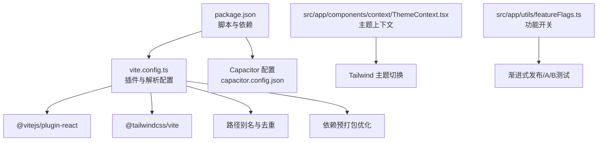
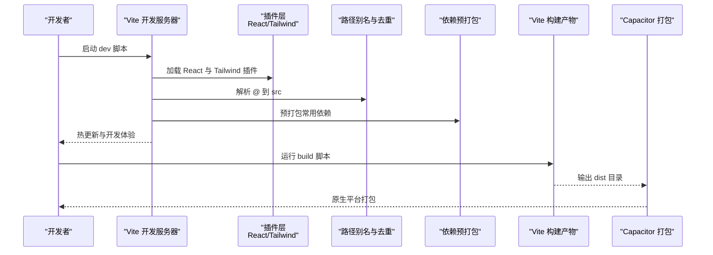
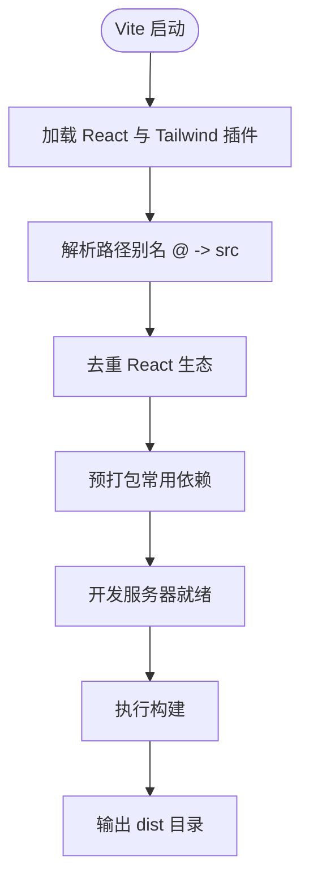
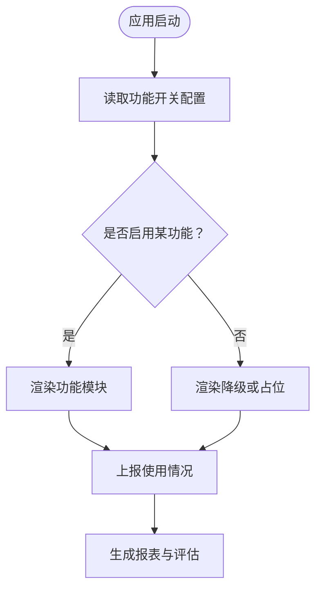
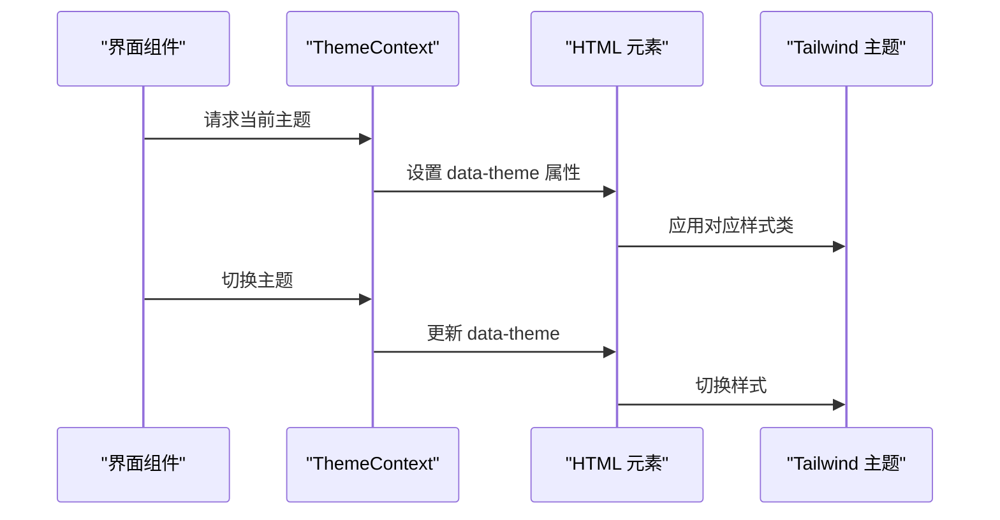
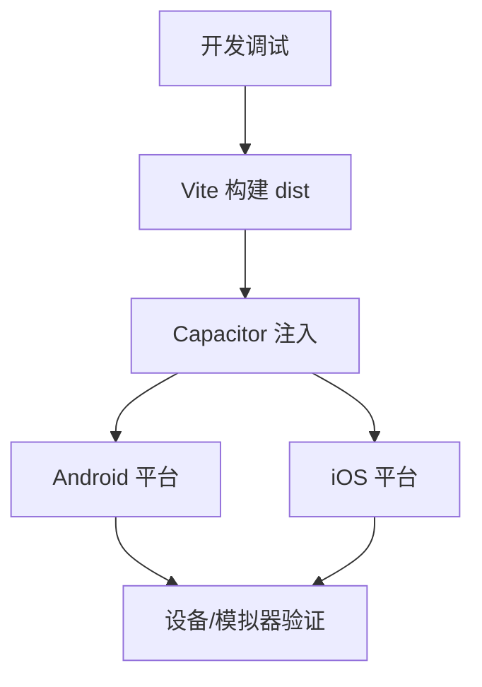
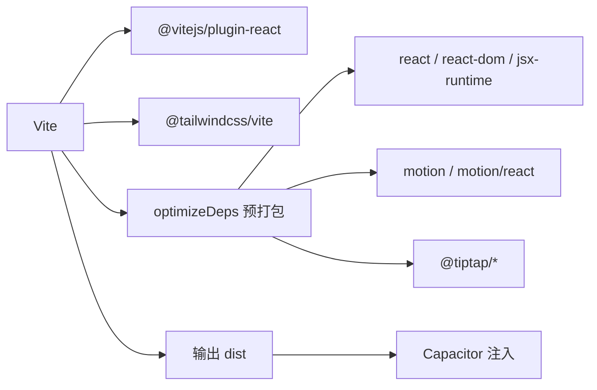

# 开发工具与最佳实践

<cite>
**本文引用的文件**
- [vite.config.ts](file://vite.config.ts)
- [package.json](file://package.json)
- [postcss.config.mjs](file://postcss.config.mjs)
- [capacitor.config.json](file://capacitor.config.json)
- [ThemeContext.tsx](file://src/app/components/context/ThemeContext.tsx)
- [featureFlags.ts](file://src/app/utils/featureFlags.ts)
- [sources.ts](file://src/app/types/sources.ts)
</cite>

## 目录
1. 引言
2. 项目结构
3. 核心组件
4. 架构总览
5. 详细组件分析
6. 依赖关系分析
7. 性能考量
8. 故障排查指南
9. 结论
10. 附录

## 引言
本指南面向Note-taking app前端（V2.0）项目，系统梳理开发工具链与工程化最佳实践，覆盖以下主题：
- Vite构建工具：开发服务器、构建优化、依赖预打包与别名解析
- TypeScript与类型安全：类型定义、接口设计与编译优化建议
- 代码规范与质量保证：ESLint、Prettier与格式化策略
- 性能优化：代码分割、懒加载、缓存与资源处理
- 功能开关：渐进式发布与A/B测试支持
- 调试技巧、测试策略与持续集成
- 开发效率工具、团队协作流程与项目维护

## 项目结构
该项目采用Vite作为核心构建工具，结合Capacitor进行跨平台原生能力封装，前端以React生态为主，使用Tailwind CSS v4（通过@tailwindcss/vite插件）进行样式组织。

图表来源
- [package.json:1-113](file://package.json#L1-L113)
- [vite.config.ts:1-44](file://vite.config.ts#L1-L44)
- [capacitor.config.json:1-31](file://capacitor.config.json#L1-L31)
- [ThemeContext.tsx:1-110](file://src/app/components/context/ThemeContext.tsx#L1-L110)
- [featureFlags.ts](file://src/app/utils/featureFlags.ts)

章节来源
- [package.json:1-113](file://package.json#L1-L113)
- [vite.config.ts:1-44](file://vite.config.ts#L1-L44)
- [postcss.config.mjs:1-16](file://postcss.config.mjs#L1-L16)
- [capacitor.config.json:1-31](file://capacitor.config.json#L1-L31)

## 核心组件
- Vite配置与插件
  - 使用React插件与Tailwind CSS v4插件，启用自动PostCSS配置，避免重复声明插件。
  - 通过dedupe解决多包共享React实例导致的“无效Hook调用”问题。
  - 通过optimizeDeps对常用依赖进行预打包，减少CJS/ESM分裂带来的重复包风险。
  - 增加SVG与CSV资源包含，便于在应用中直接引用。
- Capacitor配置
  - 指定web目录为dist，Android使用明文HTTP，启用键盘与状态栏等插件。
- 主题上下文
  - 提供系统/浅色/深色主题切换，持久化到localStorage，响应式监听系统偏好变化。
- 类型与数据源
  - 类型定义与数据源接口位于types目录，建议统一收敛并在组件中按需引入。

章节来源
- [vite.config.ts:1-44](file://vite.config.ts#L1-L44)
- [package.json:1-113](file://package.json#L1-L113)
- [postcss.config.mjs:1-16](file://postcss.config.mjs#L1-L16)
- [capacitor.config.json:1-31](file://capacitor.config.json#L1-L31)
- [ThemeContext.tsx:1-110](file://src/app/components/context/ThemeContext.tsx#L1-L110)
- [sources.ts](file://src/app/types/sources.ts)

## 架构总览
下图展示从开发到构建的关键流程与模块交互：

图表来源
- [package.json:6-9](file://package.json#L6-L9)
- [vite.config.ts:6-44](file://vite.config.ts#L6-L44)
- [capacitor.config.json:4](file://capacitor.config.json#L4)

## 详细组件分析

### Vite 配置与优化
- 插件体系
  - React插件：提升开发体验与按需编译。
  - Tailwind CSS v4插件：自动配置PostCSS，无需手动添加tailwind与autoprefixer。
- 路径与去重
  - 别名@指向src，统一导入路径风格。
  - dedupe确保React及其生态库仅保留单一实例，避免重复包引发的运行时错误。
- 依赖优化
  - optimizeDeps对react、react-dom、motion、tiptap系列进行预打包，降低冷启动与重复依赖风险。
- 资源处理
  - assetsInclude扩展SVG与CSV，满足富文本与数据可视化场景。

图表来源
- [vite.config.ts:6-44](file://vite.config.ts#L6-L44)

章节来源
- [vite.config.ts:1-44](file://vite.config.ts#L1-L44)
- [postcss.config.mjs:1-16](file://postcss.config.mjs#L1-L16)

### TypeScript 配置与类型安全
- 当前仓库未发现 tsconfig.json 与 eslint.config.mjs、prettier.config.mjs 文件
- 建议实践
  - 在根目录新增tsconfig.json，启用严格模式与合理的目标版本，确保类型推导与编译优化。
  - ESLint与Prettier建议通过官方插件接入，统一规则与格式化行为，CI中强制执行。
  - 对于第三方声明文件（如react-responsive-masonry），建议集中放置在types目录并纳入TS编译范围。

章节来源
- [package.json:85-112](file://package.json#L85-L112)

### 代码规范与质量保证
- 规则制定
  - ESLint：统一语法检查与可读性规则；优先使用TypeScript友好规则集。
  - Prettier：统一缩进、引号、换行等格式；与编辑器保存钩子联动。
- CI集成
  - 在流水线中增加lint与format检查步骤，失败即阻断合并。
- 团队协作
  - 统一编辑器配置（VS Code推荐），共享settings.json与扩展清单。
  - 代码审查中重点关注类型安全、命名一致性与复杂度阈值。

章节来源
- [package.json:85-112](file://package.json#L85-L112)

### 性能优化策略
- 代码分割与懒加载
  - 路由级懒加载：将大型页面或不常用模块拆分，按需加载。
  - 组件级懒加载：对重型UI组件或图表库使用动态导入。
- 缓存与资源
  - 构建产物开启长期缓存策略（内容哈希命名），静态资源CDN化。
  - 图片与媒体资源压缩与WebP转换，SVG内联常用图标。
- 依赖体积控制
  - 通过optimizeDeps与dedupe减少重复包；移除未使用依赖。
- 渲染优化
  - 使用React.memo、useMemo、useCallback避免不必要重渲染。
  - 主题切换与Tailwind类名变更尽量批量处理，减少重排。

章节来源
- [vite.config.ts:27-41](file://vite.config.ts#L27-L41)
- [ThemeContext.tsx:50-61](file://src/app/components/context/ThemeContext.tsx#L50-L61)

### 功能开关与渐进式发布
- 设计思路
  - 将实验性功能置于独立模块，通过集中式开关控制是否启用。
  - 支持用户维度与AB分桶，记录遥测以便评估效果。
- 实现要点
  - featureFlags.ts集中管理开关与默认值，避免散落条件判断。
  - UI层根据开关动态渲染，服务端接口层按开关分流请求。
- A/B测试
  - 通过随机分桶与持久化分组，确保用户视角一致性。
  - 与Telemetry服务联动，收集关键指标并可视化。

图表来源
- [featureFlags.ts](file://src/app/utils/featureFlags.ts)

章节来源
- [featureFlags.ts](file://src/app/utils/featureFlags.ts)

### 主题系统与Tailwind 集成
- 主题上下文
  - 支持系统/浅色/深色三种模式，自动监听系统偏好变化。
  - 使用data-theme属性切换Tailwind主题，过渡动画平滑。
- 存储与回退
  - 本地存储用户选择，沙箱/受限环境安全读写。
- 与构建集成
  - Tailwind v4自动配置PostCSS，无需额外插件；可通过postcss.config.mjs扩展。

图表来源
- [ThemeContext.tsx:63-105](file://src/app/components/context/ThemeContext.tsx#L63-L105)
- [postcss.config.mjs:1-16](file://postcss.config.mjs#L1-L16)

章节来源
- [ThemeContext.tsx:1-110](file://src/app/components/context/ThemeContext.tsx#L1-L110)
- [postcss.config.mjs:1-16](file://postcss.config.mjs#L1-L16)

### Capacitor 打包与原生能力
- 配置要点
  - webDir指向dist，Android明文HTTP允许开发调试。
  - 插件配置包括状态栏、键盘与启动页，确保用户体验一致。
- 开发流程
  - 先在浏览器验证功能，再通过Capacitor同步到原生平台。
  - 构建后在Android/iOS模拟器或真机上验证网络与权限。

图表来源
- [capacitor.config.json:1-31](file://capacitor.config.json#L1-L31)

章节来源
- [capacitor.config.json:1-31](file://capacitor.config.json#L1-L31)

## 依赖关系分析
- 工具链依赖
  - Vite、@vitejs/plugin-react、@tailwindcss/vite构成核心构建与样式管线。
  - pnpm overrides锁定关键依赖版本，确保React生态一致性。
- 前端生态
  - Radix UI、Material UI、Motion、Tiptap等组件与富文本生态，需配合dedupe与预打包策略。
- 原生集成
  - Capacitor插件提供键盘、状态栏、启动屏等能力，与webDir协同工作。

图表来源
- [package.json:85-112](file://package.json#L85-L112)
- [vite.config.ts:27-41](file://vite.config.ts#L27-L41)
- [capacitor.config.json:4](file://capacitor.config.json#L4)

章节来源
- [package.json:85-112](file://package.json#L85-L112)
- [vite.config.ts:27-41](file://vite.config.ts#L27-L41)
- [capacitor.config.json:4](file://capacitor.config.json#L4)

## 性能考量
- 构建阶段
  - 启用长缓存与内容哈希，减少二次加载时间。
  - 对大体积依赖进行预打包，缩短冷启动。
- 运行阶段
  - 懒加载与代码分割降低首屏体积。
  - 主题切换与Tailwind类名变更批量化，避免频繁重绘。
- 资源与网络
  - 图片与媒体压缩，SVG内联常用图标；静态资源CDN化。
  - 网络请求层加入超时与重试策略，结合缓存策略提升稳定性。

## 故障排查指南
- “无效Hook调用”错误
  - 检查是否正确启用dedupe，确保React与motion等库仅存在单一实例。
- 开发服务器无法热更新
  - 确认Vite插件加载顺序与别名配置无冲突；清理缓存后重试。
- 主题切换不生效
  - 检查data-theme属性是否正确设置；确认Tailwind主题类名映射。
- Capacitor 打包后白屏
  - 核对webDir与index.html路径；检查Android明文HTTP与插件配置。

章节来源
- [vite.config.ts:11-25](file://vite.config.ts#L11-L25)
- [ThemeContext.tsx:50-61](file://src/app/components/context/ThemeContext.tsx#L50-L61)
- [capacitor.config.json:5-8](file://capacitor.config.json#L5-L8)

## 结论
本项目已具备现代化前端工程化的基础：Vite提供高效开发体验，Tailwind CSS v4简化样式管线，Capacitor打通原生能力。建议后续补齐TypeScript、ESLint与Prettier配置，完善功能开关与A/B测试体系，并在CI中强化质量门禁，持续提升开发效率与产品稳定性。

## 附录
- 快速对照表
  - Vite开发命令：参见package.json脚本
  - 构建输出目录：dist（Capacitor配置）
  - 路径别名：@ -> src（Vite配置）
  - 去重与预打包：React生态与Tiptap/Motion（Vite配置）
  - 主题切换：ThemeContext（React上下文）

章节来源
- [package.json:6-9](file://package.json#L6-L9)
- [capacitor.config.json:4](file://capacitor.config.json#L4)
- [vite.config.ts:11-25](file://vite.config.ts#L11-L25)
- [ThemeContext.tsx:63-105](file://src/app/components/context/ThemeContext.tsx#L63-L105)