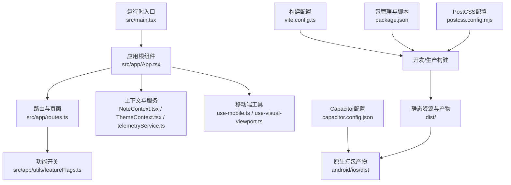
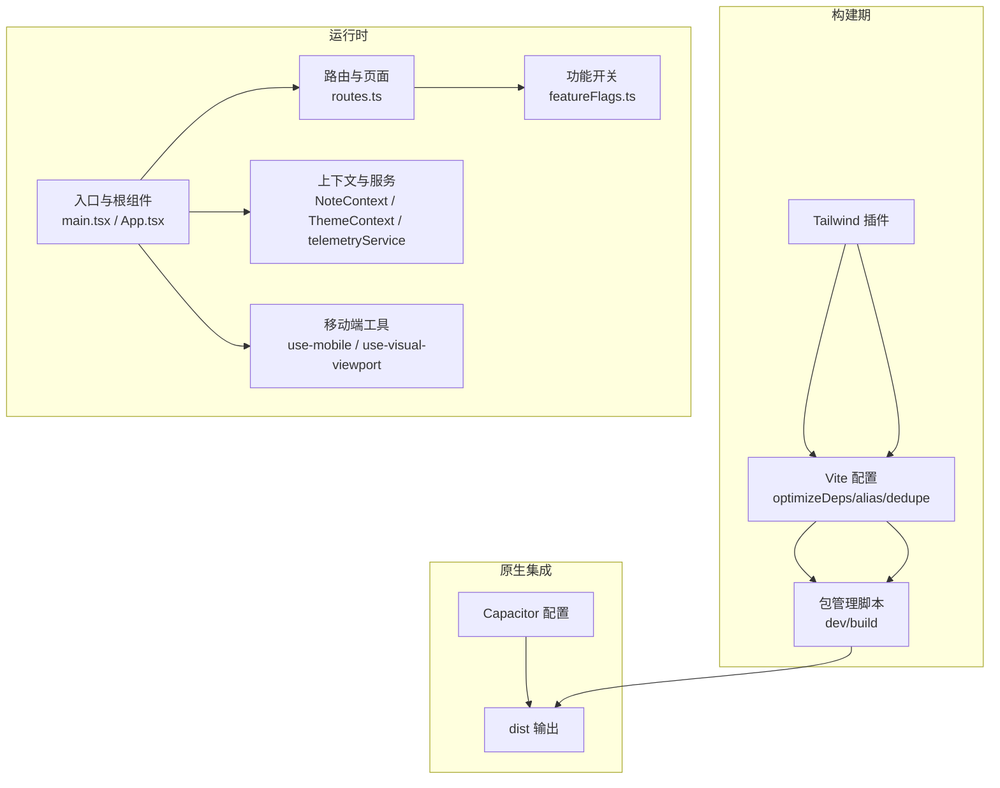
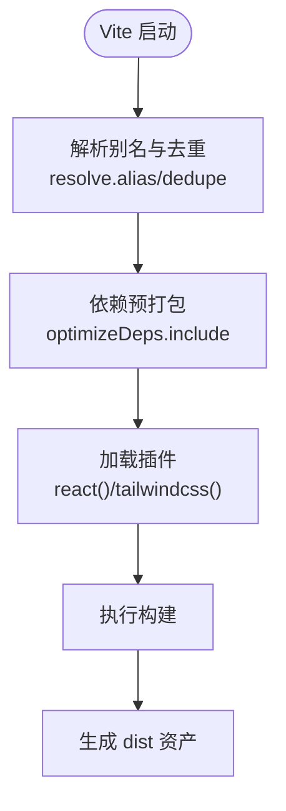
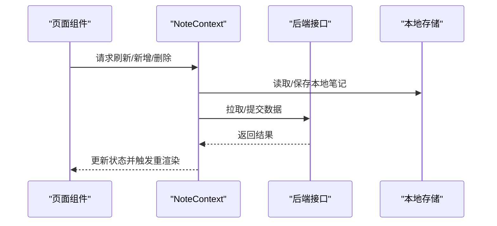
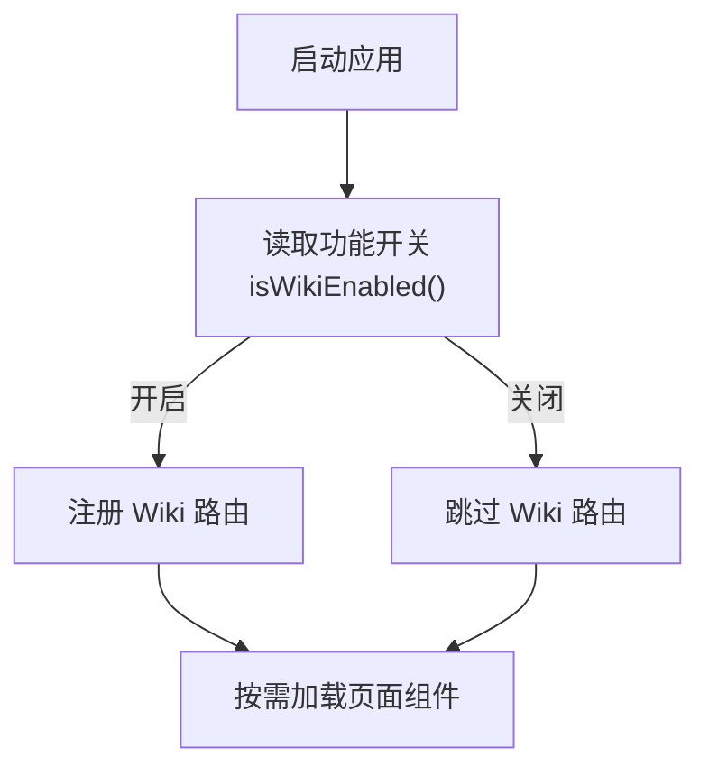
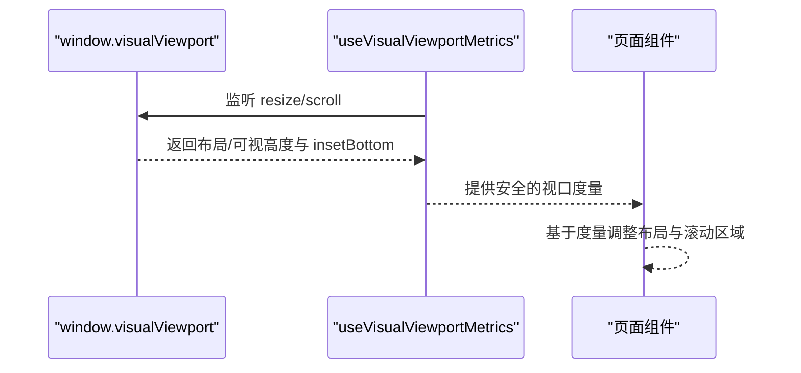
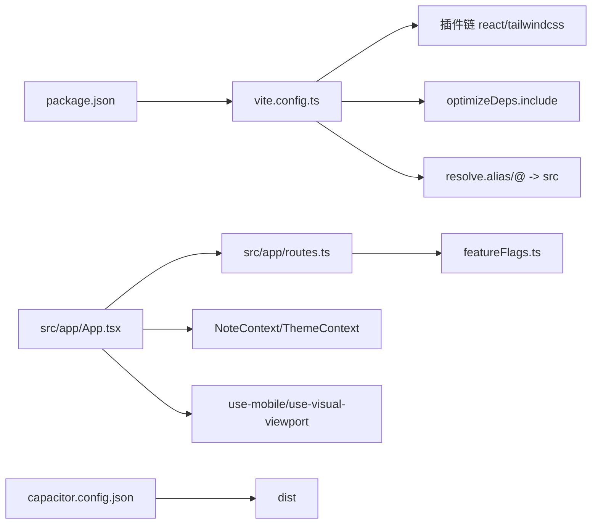

# 性能优化策略

<cite>
**本文引用的文件**
- [package.json](file://package.json)
- [vite.config.ts](file://vite.config.ts)
- [postcss.config.mjs](file://postcss.config.mjs)
- [capacitor.config.json](file://capacitor.config.json)
- [src/main.tsx](file://src/main.tsx)
- [src/app/App.tsx](file://src/app/App.tsx)
- [src/app/routes.ts](file://src/app/routes.ts)
- [src/app/utils/featureFlags.ts](file://src/app/utils/featureFlags.ts)
- [src/app/components/context/NoteContext.tsx](file://src/app/components/context/NoteContext.tsx)
- [src/app/components/context/ThemeContext.tsx](file://src/app/components/context/ThemeContext.tsx)
- [src/app/components/ui/use-mobile.ts](file://src/app/components/ui/use-mobile.ts)
- [src/app/components/ui/use-visual-viewport.ts](file://src/app/components/ui/use-visual-viewport.ts)
- [src/app/pages/HiBrain.tsx](file://src/app/pages/HiBrain.tsx)
- [src/app/pages/NoteList.tsx](file://src/app/pages/NoteList.tsx)
- [src/app/services/telemetryService.ts](file://src/app/services/telemetryService.ts)
</cite>

## 目录
1. [引言](#引言)
2. [项目结构](#项目结构)
3. [核心组件](#核心组件)
4. [架构总览](#架构总览)
5. [详细组件分析](#详细组件分析)
6. [依赖关系分析](#依赖关系分析)
7. [性能考量与优化建议](#性能考量与优化建议)
8. [故障排查指南](#故障排查指南)
9. [结论](#结论)
10. [附录](#附录)

## 引言
本指南围绕该笔记类前端应用的性能优化展开，结合 Vite 构建配置、运行时 React 组件与上下文、移动端适配、以及 Capacitor 混合能力，系统梳理构建期优化（依赖预打包、代码分割）、运行时优化（组件渲染、状态管理、内存与动画）、网络层优化（请求与遥测）、移动端体验（触摸、视口与电池续航），并提供性能监控与功能开关对性能影响的实践建议。

## 项目结构
项目采用 Vite + React + Capacitor 的混合前端架构，源码位于 src 目录，构建产物输出至 dist，Capacitor 配置指向 dist 目录。关键目录与文件如下：
- 构建与样式：vite.config.ts、postcss.config.mjs、package.json
- 运行时入口：src/main.tsx、src/app/App.tsx
- 路由与功能开关：src/app/routes.ts、src/app/utils/featureFlags.ts
- 上下文与服务：src/app/components/context/NoteContext.tsx、ThemeContext.tsx、src/app/services/telemetryService.ts
- 移动端工具：src/app/components/ui/use-mobile.ts、use-visual-viewport.ts
- 页面示例：src/app/pages/HiBrain.tsx、NoteList.tsx

图表来源
- [vite.config.ts:1-44](file://vite.config.ts#L1-L44)
- [package.json:1-113](file://package.json#L1-L113)
- [postcss.config.mjs:1-16](file://postcss.config.mjs#L1-L16)
- [src/main.tsx:1-7](file://src/main.tsx#L1-L7)
- [src/app/App.tsx:1-17](file://src/app/App.tsx#L1-L17)
- [src/app/routes.ts:1-61](file://src/app/routes.ts#L1-L61)
- [src/app/utils/featureFlags.ts:1-14](file://src/app/utils/featureFlags.ts#L1-L14)
- [src/app/components/context/NoteContext.tsx:1-356](file://src/app/components/context/NoteContext.tsx#L1-L356)
- [src/app/components/context/ThemeContext.tsx:1-110](file://src/app/components/context/ThemeContext.tsx#L1-L110)
- [src/app/services/telemetryService.ts:1-22](file://src/app/services/telemetryService.ts#L1-L22)
- [src/app/components/ui/use-mobile.ts:1-22](file://src/app/components/ui/use-mobile.ts#L1-L22)
- [src/app/components/ui/use-visual-viewport.ts:1-73](file://src/app/components/ui/use-visual-viewport.ts#L1-L73)
- [capacitor.config.json:1-31](file://capacitor.config.json#L1-L31)

章节来源
- [vite.config.ts:1-44](file://vite.config.ts#L1-L44)
- [package.json:1-113](file://package.json#L1-L113)
- [postcss.config.mjs:1-16](file://postcss.config.mjs#L1-L16)
- [src/main.tsx:1-7](file://src/main.tsx#L1-L7)
- [src/app/App.tsx:1-17](file://src/app/App.tsx#L1-L17)
- [src/app/routes.ts:1-61](file://src/app/routes.ts#L1-L61)
- [src/app/utils/featureFlags.ts:1-14](file://src/app/utils/featureFlags.ts#L1-L14)
- [src/app/components/context/NoteContext.tsx:1-356](file://src/app/components/context/NoteContext.tsx#L1-L356)
- [src/app/components/context/ThemeContext.tsx:1-110](file://src/app/components/context/ThemeContext.tsx#L1-L110)
- [src/app/services/telemetryService.ts:1-22](file://src/app/services/telemetryService.ts#L1-L22)
- [src/app/components/ui/use-mobile.ts:1-22](file://src/app/components/ui/use-mobile.ts#L1-L22)
- [src/app/components/ui/use-visual-viewport.ts:1-73](file://src/app/components/ui/use-visual-viewport.ts#L1-L73)
- [capacitor.config.json:1-31](file://capacitor.config.json#L1-L31)

## 核心组件
- 构建与依赖优化：通过 Vite 的 optimizeDeps 预打包核心依赖，避免多实例导致的 Hook 错误与重复打包；Tailwind CSS 自动化插件减少手动配置。
- 应用入口与路由：单入口挂载 App，App 组合主题、笔记上下文与路由；路由根据功能开关动态启用/禁用部分页面。
- 功能开关：通过环境变量控制特性（如 Wiki）的启用，避免不必要渲染与资源加载。
- 上下文与服务：笔记上下文负责数据拉取、本地存储与合并同步；遥测服务上报事件并设置超时，避免阻塞主线程。
- 移动端工具：媒体查询与视觉视口监听，用于响应式布局与键盘/视口变化下的 UI 调整。

章节来源
- [vite.config.ts:27-41](file://vite.config.ts#L27-L41)
- [src/app/App.tsx:1-17](file://src/app/App.tsx#L1-L17)
- [src/app/routes.ts:22-24](file://src/app/routes.ts#L22-L24)
- [src/app/utils/featureFlags.ts:7-13](file://src/app/utils/featureFlags.ts#L7-L13)
- [src/app/components/context/NoteContext.tsx:89-222](file://src/app/components/context/NoteContext.tsx#L89-L222)
- [src/app/services/telemetryService.ts:9-21](file://src/app/services/telemetryService.ts#L9-L21)
- [src/app/components/ui/use-mobile.ts:5-21](file://src/app/components/ui/use-mobile.ts#L5-L21)
- [src/app/components/ui/use-visual-viewport.ts:40-72](file://src/app/components/ui/use-visual-viewport.ts#L40-L72)

## 架构总览
应用采用“构建期优化 + 运行时上下文 + 路由与功能开关”的分层设计。构建期通过 Vite 与 Tailwind 插件提升打包效率与样式处理；运行时通过上下文与服务抽象数据流与网络调用；移动端通过工具函数适配不同设备与视口。

图表来源
- [vite.config.ts:6-44](file://vite.config.ts#L6-L44)
- [postcss.config.mjs:1-16](file://postcss.config.mjs#L1-L16)
- [package.json:6-9](file://package.json#L6-L9)
- [src/main.tsx:2-6](file://src/main.tsx#L2-L6)
- [src/app/App.tsx:1-17](file://src/app/App.tsx#L1-L17)
- [src/app/routes.ts:22-52](file://src/app/routes.ts#L22-L52)
- [src/app/utils/featureFlags.ts:7-13](file://src/app/utils/featureFlags.ts#L7-L13)
- [src/app/components/context/NoteContext.tsx:89-222](file://src/app/components/context/NoteContext.tsx#L89-L222)
- [src/app/components/context/ThemeContext.tsx:63-105](file://src/app/components/context/ThemeContext.tsx#L63-L105)
- [src/app/services/telemetryService.ts:9-21](file://src/app/services/telemetryService.ts#L9-L21)
- [src/app/components/ui/use-mobile.ts:5-21](file://src/app/components/ui/use-mobile.ts#L5-L21)
- [src/app/components/ui/use-visual-viewport.ts:40-72](file://src/app/components/ui/use-visual-viewport.ts#L40-L72)
- [capacitor.config.json:4](file://capacitor.config.json#L4)

## 详细组件分析

### 构建期优化：Vite 依赖预打包与别名
- 依赖去重与预打包：通过 dedupe 保证 React 生态统一实例，避免“Invalid hook call”；optimizeDeps include 显式声明核心依赖，确保预打包入口稳定，减少 CJS/ESM 分割带来的重复包。
- 路径别名：@ 指向 src，简化导入路径，提升可维护性。
- 资源类型：assetsInclude 扩展支持 SVG/CVS 等资源类型。

图表来源
- [vite.config.ts:11-44](file://vite.config.ts#L11-L44)

章节来源
- [vite.config.ts:11-44](file://vite.config.ts#L11-L44)

### 运行时优化：上下文与数据流
- 笔记上下文：集中管理笔记列表、加载状态、错误处理与 CRUD；本地与远端数据合并与同步，避免重复渲染与无效网络请求。
- 主题上下文：安全读写 localStorage，监听系统深色模式偏好，DOM 属性切换以最小代价更新主题。
- 遥测服务：上报事件带超时，避免阻塞主线程。

图表来源
- [src/app/components/context/NoteContext.tsx:152-218](file://src/app/components/context/NoteContext.tsx#L152-L218)
- [src/app/components/context/ThemeContext.tsx:63-105](file://src/app/components/context/ThemeContext.tsx#L63-L105)
- [src/app/services/telemetryService.ts:9-21](file://src/app/services/telemetryService.ts#L9-L21)

章节来源
- [src/app/components/context/NoteContext.tsx:89-356](file://src/app/components/context/NoteContext.tsx#L89-L356)
- [src/app/components/context/ThemeContext.tsx:17-105](file://src/app/components/context/ThemeContext.tsx#L17-L105)
- [src/app/services/telemetryService.ts:1-22](file://src/app/services/telemetryService.ts#L1-L22)

### 路由与功能开关：按需渲染与资源加载
- 路由定义集中于 routes.ts，根据功能开关动态拼接 Wiki 相关路由，避免在关闭状态下加载对应页面与资源。
- 功能开关通过环境变量解析，支持布尔与字符串“关闭值”判断。

图表来源
- [src/app/routes.ts:22-52](file://src/app/routes.ts#L22-L52)
- [src/app/utils/featureFlags.ts:7-13](file://src/app/utils/featureFlags.ts#L7-L13)

章节来源
- [src/app/routes.ts:22-52](file://src/app/routes.ts#L22-L52)
- [src/app/utils/featureFlags.ts:1-14](file://src/app/utils/featureFlags.ts#L1-L14)

### 移动端优化：触摸、视口与电池续航
- 触摸与交互：页面广泛使用 motion/react 的动画与手势，注意在低端设备上降低动画复杂度或使用 prefers-reduced-motion。
- 视口适配：use-visual-viewport 监听布局高度、可视高度与 insetBottom，配合 UI 使用更稳健的高度计算。
- 电池续航：避免高频重排与长任务，合理拆分渲染与网络请求，使用节流/防抖与懒加载。

图表来源
- [src/app/components/ui/use-visual-viewport.ts:40-72](file://src/app/components/ui/use-visual-viewport.ts#L40-L72)

章节来源
- [src/app/components/ui/use-mobile.ts:1-22](file://src/app/components/ui/use-mobile.ts#L1-L22)
- [src/app/components/ui/use-visual-viewport.ts:1-73](file://src/app/components/ui/use-visual-viewport.ts#L1-L73)

### 页面示例：渲染性能与资源使用
- HiBrain 页面：大量使用 motion/react 动画与 Portal 渲染弹层，建议在低端设备上限制动画数量与复杂度，或在进入页面时延迟初始化非关键动画。
- NoteList 页面：瀑布流/瀑布流卡片渲染较多，建议：
  - 对图片与 SVG 使用懒加载与占位；
  - 对长列表使用虚拟化或分页；
  - 减少每帧 DOM 修改次数，合并样式变更；
  - 使用 useMemo/useCallback 缓存计算结果与回调。

章节来源
- [src/app/pages/HiBrain.tsx:189-405](file://src/app/pages/HiBrain.tsx#L189-L405)
- [src/app/pages/NoteList.tsx:138-344](file://src/app/pages/NoteList.tsx#L138-L344)

## 依赖关系分析
- 构建期：Vite 与 Tailwind 插件依赖 React 插件；optimizeDeps 与 dedupe 依赖 React 生态包。
- 运行时：App 组合多个上下文与服务；路由依赖功能开关；页面依赖上下文与工具函数。
- 原生集成：Capacitor 指向 dist 输出目录，确保构建产物正确注入。

图表来源
- [vite.config.ts:6-44](file://vite.config.ts#L6-L44)
- [package.json:85-111](file://package.json#L85-L111)
- [src/app/App.tsx:1-17](file://src/app/App.tsx#L1-L17)
- [src/app/routes.ts:22-52](file://src/app/routes.ts#L22-L52)
- [src/app/utils/featureFlags.ts:7-13](file://src/app/utils/featureFlags.ts#L7-L13)
- [src/app/components/context/NoteContext.tsx:89-222](file://src/app/components/context/NoteContext.tsx#L89-L222)
- [src/app/components/context/ThemeContext.tsx:63-105](file://src/app/components/context/ThemeContext.tsx#L63-L105)
- [src/app/components/ui/use-mobile.ts:5-21](file://src/app/components/ui/use-mobile.ts#L5-L21)
- [src/app/components/ui/use-visual-viewport.ts:40-72](file://src/app/components/ui/use-visual-viewport.ts#L40-L72)
- [capacitor.config.json:4](file://capacitor.config.json#L4)

章节来源
- [vite.config.ts:6-44](file://vite.config.ts#L6-L44)
- [package.json:85-111](file://package.json#L85-L111)
- [src/app/App.tsx:1-17](file://src/app/App.tsx#L1-L17)
- [src/app/routes.ts:22-52](file://src/app/routes.ts#L22-L52)
- [src/app/utils/featureFlags.ts:7-13](file://src/app/utils/featureFlags.ts#L7-L13)
- [src/app/components/context/NoteContext.tsx:89-222](file://src/app/components/context/NoteContext.tsx#L89-L222)
- [src/app/components/context/ThemeContext.tsx:63-105](file://src/app/components/context/ThemeContext.tsx#L63-L105)
- [src/app/components/ui/use-mobile.ts:5-21](file://src/app/components/ui/use-mobile.ts#L5-L21)
- [src/app/components/ui/use-visual-viewport.ts:40-72](file://src/app/components/ui/use-visual-viewport.ts#L40-L72)
- [capacitor.config.json:4](file://capacitor.config.json#L4)

## 性能考量与优化建议

### 构建期优化
- 依赖预打包与去重
  - 保持 optimizeDeps.include 的稳定性，避免频繁变动导致缓存失效。
  - dedupe 列表覆盖 motion、tiptap 等重型依赖，确保单一实例。
- 代码分割与懒加载
  - 将大型页面与第三方库拆分为独立 chunk，结合路由级懒加载减少首屏体积。
  - 图片与富文本中的资源按需加载，避免阻塞主线程。
- 资源处理
  - Tailwind 自动化插件减少手动配置；如需扩展，仅在必要时添加 PostCSS 插件。

章节来源
- [vite.config.ts:11-44](file://vite.config.ts#L11-L44)
- [postcss.config.mjs:1-16](file://postcss.config.mjs#L1-L16)

### 运行时优化
- React 组件优化
  - 使用 useMemo/useCallback 缓存昂贵计算与回调；对列表项使用 key 与稳定引用。
  - 控制渲染范围，避免不必要的 Provider 重渲染。
- 状态管理与数据流
  - 笔记上下文已做本地/远端合并与同步，建议进一步：
    - 对批量操作使用事务式更新，减少多次重渲染。
    - 对长列表使用分页或虚拟化。
- 内存管理
  - 注意清理定时器、事件监听与订阅；页面卸载时释放大对象引用。
- 渲染性能提升
  - 减少强制同步布局与样式读取；合并 DOM 修改。
  - 在低端设备上降低动画复杂度或禁用非关键动画。

章节来源
- [src/app/components/context/NoteContext.tsx:89-356](file://src/app/components/context/NoteContext.tsx#L89-L356)
- [src/app/pages/HiBrain.tsx:189-405](file://src/app/pages/HiBrain.tsx#L189-L405)
- [src/app/pages/NoteList.tsx:138-344](file://src/app/pages/NoteList.tsx#L138-L344)

### 网络性能优化
- 请求与超时
  - 遥测上报设置超时，避免阻塞；对非关键网络请求采用降级策略。
- 缓存策略
  - 对静态资源启用长效缓存与版本号；对 API 数据采用条件请求与本地缓存。
- CDN 集成
  - 将静态资源托管至 CDN，缩短首屏加载路径。

章节来源
- [src/app/services/telemetryService.ts:9-21](file://src/app/services/telemetryService.ts#L9-L21)

### 移动端性能优化
- 触摸事件优化
  - 使用轻量手势库，避免过度监听与高频回调。
- 动画性能
  - 优先使用 transform/opacity；减少布局抖动；在低端设备上禁用复杂动画。
- 电池续航
  - 合理安排后台任务与轮询频率；利用节流/防抖降低 CPU 占用。

章节来源
- [src/app/components/ui/use-mobile.ts:1-22](file://src/app/components/ui/use-mobile.ts#L1-L22)
- [src/app/components/ui/use-visual-viewport.ts:1-73](file://src/app/components/ui/use-visual-viewport.ts#L1-L73)

### 功能开关与渐进式优化
- 功能开关对性能的影响
  - 关闭不必要特性（如 Wiki）可减少路由、页面与资源加载，降低首屏负担。
- 渐进式功能优化策略
  - 以功能开关为边界，逐步引入新特性并观察性能指标；对高成本特性提供降级方案。

章节来源
- [src/app/routes.ts:22-52](file://src/app/routes.ts#L22-L52)
- [src/app/utils/featureFlags.ts:7-13](file://src/app/utils/featureFlags.ts#L7-L13)

## 故障排查指南
- 构建期问题
  - 依赖重复或 Hook 错误：检查 dedupe 列表是否包含当前使用的 React 生态包。
  - 预打包异常：确认 optimizeDeps.include 中的包版本与实际安装一致。
- 运行时问题
  - 主题切换无效：检查 ThemeContext 的 DOM 属性设置与 localStorage 读写。
  - 笔记列表卡顿：排查长列表渲染、图片加载与动画复杂度。
  - 遥测上报失败：检查超时设置与网络状态。
- 移动端问题
  - 视口高度异常：确认 use-visual-viewport 的监听与回退逻辑。
  - 键盘遮挡：结合 Capacitor 键盘插件与视口 insetBottom 调整布局。

章节来源
- [vite.config.ts:11-44](file://vite.config.ts#L11-L44)
- [src/app/components/context/ThemeContext.tsx:51-61](file://src/app/components/context/ThemeContext.tsx#L51-L61)
- [src/app/components/context/NoteContext.tsx:152-218](file://src/app/components/context/NoteContext.tsx#L152-L218)
- [src/app/services/telemetryService.ts:18](file://src/app/services/telemetryService.ts#L18)
- [src/app/components/ui/use-visual-viewport.ts:11-38](file://src/app/components/ui/use-visual-viewport.ts#L11-L38)
- [capacitor.config.json:15-18](file://capacitor.config.json#L15-L18)

## 结论
通过 Vite 的依赖预打包与去重、Tailwind 自动化、路由与功能开关的按需加载，以及上下文与服务的规范化数据流，本项目在构建期与运行时均具备良好的性能基础。结合页面级渲染优化、网络请求降级、移动端视口与动画策略，以及功能开关驱动的渐进式优化，可在多平台与多设备上获得稳定且高效的用户体验。

## 附录
- 构建命令与脚本：参见 package.json scripts。
- Capacitor 输出目录：参见 capacitor.config.json 的 webDir。

章节来源
- [package.json:6-9](file://package.json#L6-L9)
- [capacitor.config.json:4](file://capacitor.config.json#L4)