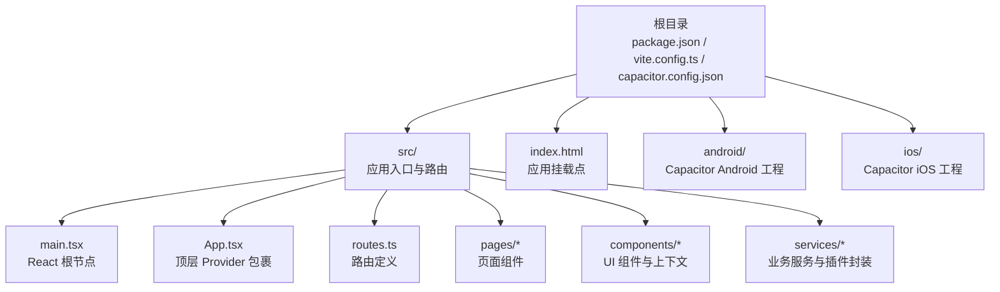
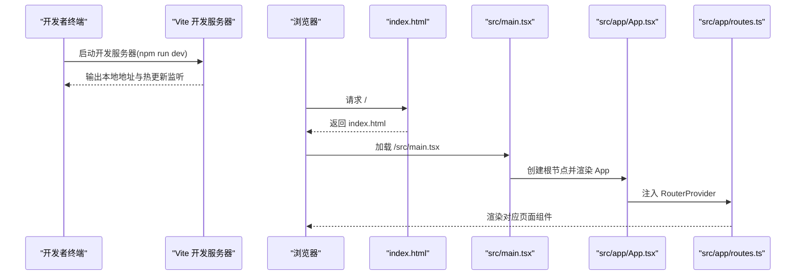

# 快速开始

<cite>
**本文档引用的文件**
- [package.json](file://package.json)
- [README.md](file://README.md)
- [vite.config.ts](file://vite.config.ts)
- [capacitor.config.json](file://capacitor.config.json)
- [src/main.tsx](file://src/main.tsx)
- [index.html](file://index.html)
- [postcss.config.mjs](file://postcss.config.mjs)
- [src/app/App.tsx](file://src/app/App.tsx)
- [src/app/routes.ts](file://src/app/routes.ts)
- [src/app/services/audioRecordService.ts](file://src/app/services/audioRecordService.ts)
</cite>

## 目录
1. [简介](#简介)
2. [项目结构](#项目结构)
3. [核心组件](#核心组件)
4. [架构总览](#架构总览)
5. [详细组件分析](#详细组件分析)
6. [依赖分析](#依赖分析)
7. [性能考虑](#性能考虑)
8. [故障排除指南](#故障排除指南)
9. [结论](#结论)

## 简介
本指南面向首次接触 Note-taking app 前端项目的开发者，帮助你在最短时间内完成环境准备、依赖安装与开发服务器启动，并理解项目的基本架构与关键配置。项目基于 Vite 构建工具，使用 React 18.3.1 作为核心框架，并通过 Capacitor 提供跨平台能力（Android/iOS）。你将学会：
- 环境要求与工具链准备（Node.js、包管理器选择）
- 安装依赖与启动开发服务器
- 配置开发环境与 IDE 设置建议
- 常见问题排查与解决方案

## 项目结构
该前端项目采用以功能域和层次相结合的组织方式：
- 根目录包含构建配置、Capacitor 配置、入口 HTML 与包管理配置
- src 目录下包含应用入口、路由、页面组件、UI 组件、服务层与样式资源
- android/ 与 ios/ 目录为 Capacitor 生成的原生工程桥接文件与资源

图表来源
- [src/main.tsx:1-7](file://src/main.tsx#L1-L7)
- [src/app/App.tsx:1-17](file://src/app/App.tsx#L1-L17)
- [src/app/routes.ts:1-61](file://src/app/routes.ts#L1-L61)
- [capacitor.config.json:1-31](file://capacitor.config.json#L1-L31)

章节来源
- [package.json:1-113](file://package.json#L1-L113)
- [vite.config.ts:1-44](file://vite.config.ts#L1-L44)
- [capacitor.config.json:1-31](file://capacitor.config.json#L1-L31)
- [index.html:1-15](file://index.html#L1-L15)

## 核心组件
- 应用入口与渲染
  - 入口文件负责创建 React 根实例并将 App 渲染到 DOM 中
  - 参考路径：[src/main.tsx:1-7](file://src/main.tsx#L1-L7)
- 应用外壳与 Provider 层
  - App.tsx 通过主题、笔记与全局提示等 Provider 进行上下文注入
  - 参考路径：[src/app/App.tsx:1-17](file://src/app/App.tsx#L1-L17)
- 路由系统
  - 使用 React Router v7 的 createBrowserRouter 定义多页面路由与嵌套路由
  - 参考路径：[src/app/routes.ts:1-61](file://src/app/routes.ts#L1-L61)
- 开发服务器与构建配置
  - Vite 提供热更新与打包能力；Tailwind CSS 通过 @tailwindcss/vite 插件集成
  - 参考路径：[vite.config.ts:1-44](file://vite.config.ts#L1-L44)，[postcss.config.mjs:1-16](file://postcss.config.mjs#L1-L16)
- Capacitor 配置
  - 配置 Web 打包目录、服务器参数与常用插件（状态栏、键盘、启动屏）
  - 参考路径：[capacitor.config.json:1-31](file://capacitor.config.json#L1-L31)

章节来源
- [src/main.tsx:1-7](file://src/main.tsx#L1-L7)
- [src/app/App.tsx:1-17](file://src/app/App.tsx#L1-L17)
- [src/app/routes.ts:1-61](file://src/app/routes.ts#L1-L61)
- [vite.config.ts:1-44](file://vite.config.ts#L1-L44)
- [postcss.config.mjs:1-16](file://postcss.config.mjs#L1-L16)
- [capacitor.config.json:1-31](file://capacitor.config.json#L1-L31)

## 架构总览
下面的时序图展示了从启动开发服务器到浏览器加载应用的关键流程。

图表来源
- [README.md:6-10](file://README.md#L6-L10)
- [index.html:10-12](file://index.html#L10-L12)
- [src/main.tsx:1-7](file://src/main.tsx#L1-L7)
- [src/app/App.tsx:1-17](file://src/app/App.tsx#L1-L17)
- [src/app/routes.ts:1-61](file://src/app/routes.ts#L1-L61)

## 详细组件分析

### 开发服务器与构建配置
- Vite 配置要点
  - 插件：React 与 Tailwind CSS 插件
  - 别名：@ 指向 src 目录
  - 依赖去重：确保 motion、tiptap 等库解析到同一 React 实例
  - 优化预打包：包含 React 生态与 motion、tiptap 等高频依赖
  - 静态资源：支持 SVG 与 CSV
  - 参考路径：[vite.config.ts:1-44](file://vite.config.ts#L1-L44)
- PostCSS 配置
  - 由 Tailwind CSS v4 自动管理所需插件，此处为空配置便于扩展
  - 参考路径：[postcss.config.mjs:1-16](file://postcss.config.mjs#L1-L16)

章节来源
- [vite.config.ts:1-44](file://vite.config.ts#L1-L44)
- [postcss.config.mjs:1-16](file://postcss.config.mjs#L1-L16)

### 应用入口与渲染流程
- 入口文件职责
  - 创建根节点并挂载 App
  - 引入全局样式
  - 参考路径：[src/main.tsx:1-7](file://src/main.tsx#L1-L7)
- HTML 挂载点
  - index.html 中的 #root 即为挂载点
  - 参考路径：[index.html:10-12](file://index.html#L10-L12)

章节来源
- [src/main.tsx:1-7](file://src/main.tsx#L1-L7)
- [index.html:10-12](file://index.html#L10-L12)

### 路由系统与页面导航
- 路由定义
  - 使用 createBrowserRouter 定义多页面与嵌套路由
  - 支持动态路由参数与条件路由（如 Wiki 功能开关）
  - 参考路径：[src/app/routes.ts:1-61](file://src/app/routes.ts#L1-L61)
- 页面组件
  - pages 目录下包含多个页面组件，如首页、笔记列表、文档详情、消息会话等
  - 参考路径：[src/app/routes.ts:26-59](file://src/app/routes.ts#L26-L59)

章节来源
- [src/app/routes.ts:1-61](file://src/app/routes.ts#L1-L61)

### Capacitor 配置与跨平台能力
- Capacitor 配置
  - webDir 指向构建输出目录
  - 服务器参数（Android Scheme、明文通信）
  - 常用插件：StatusBar、Keyboard、SplashScreen
  - 参考路径：[capacitor.config.json:1-31](file://capacitor.config.json#L1-L31)
- 音频录制插件封装
  - JS/TS 封装位于 src/app/services/audioRecordService.ts
  - 事件 audioChunk 每 800ms 推送一次 16kHz PCM16LE 单声道音频 Base64 数据
  - 参考路径：[src/app/services/audioRecordService.ts:1-35](file://src/app/services/audioRecordService.ts#L1-L35)，[README.md:12-39](file://README.md#L12-L39)

章节来源
- [capacitor.config.json:1-31](file://capacitor.config.json#L1-L31)
- [src/app/services/audioRecordService.ts:1-35](file://src/app/services/audioRecordService.ts#L1-L35)
- [README.md:12-39](file://README.md#L12-L39)

## 依赖分析
- 运行时依赖
  - React 18.3.1 与 React DOM
  - React Router v7
  - Material-UI 与 Radix UI 组件体系
  - Tailwind CSS v4（通过 @tailwindcss/vite）
  - 图表与富文本编辑（Recharts、Tiptap）
  - 跨平台能力（Capacitor 核心与插件）
  - 参考路径：[package.json:10-84](file://package.json#L10-L84)
- 开发依赖
  - Vite、@vitejs/plugin-react、@tailwindcss/vite、tailwindcss
  - 参考路径：[package.json:85-92](file://package.json#L85-L92)
- 版本覆盖（pnpm overrides）
  - 固定 Vite、React、React DOM 版本以避免不兼容
  - 参考路径：[package.json:105-111](file://package.json#L105-L111)

章节来源
- [package.json:10-111](file://package.json#L10-L111)

## 性能考虑
- 依赖去重与预打包
  - 通过 Vite 配置对 React 生态与 motion、tiptap 等进行去重与预打包，减少重复实例与冷启动时间
  - 参考路径：[vite.config.ts:11-41](file://vite.config.ts#L11-L41)
- Tailwind CSS 集成
  - 使用 @tailwindcss/vite 插件自动处理样式，避免手动引入导致的冗余
  - 参考路径：[vite.config.ts:3-9](file://vite.config.ts#L3-L9)，[postcss.config.mjs:1-16](file://postcss.config.mjs#L1-L16)
- 静态资源处理
  - 显式声明 SVG 与 CSV 资源类型，确保在开发与构建中正确处理
  - 参考路径：[vite.config.ts:43-44](file://vite.config.ts#L43-L44)

## 故障排除指南
- 启动开发服务器失败
  - 确认已安装 Node.js 并使用推荐版本（参考环境要求）
  - 使用 npm i 安装依赖后再执行 npm run dev
  - 参考路径：[README.md:8-10](file://README.md#L8-L10)
- 浏览器无法访问或空白页
  - 检查 index.html 中的挂载点 #root 是否存在
  - 确认 Vite 已在本地地址启动并监听端口
  - 参考路径：[index.html:10-12](file://index.html#L10-L12)，[README.md](file://README.md#L10)
- 样式未生效或 Tailwind 未编译
  - 确保 @tailwindcss/vite 插件已启用且 PostCSS 配置为空或按需扩展
  - 参考路径：[vite.config.ts:3-9](file://vite.config.ts#L3-L9)，[postcss.config.mjs:1-16](file://postcss.config.mjs#L1-L16)
- Capacitor 相关问题（Android/iOS）
  - 检查 capacitor.config.json 中 webDir、server 参数是否正确
  - 如需调试原生桥接，请查看 android/ 与 ios/ 目录中的生成文件
  - 参考路径：[capacitor.config.json:1-31](file://capacitor.config.json#L1-L31)
- 音频录制事件未触发
  - 确认已在 JS/TS 侧注册 audioChunk 事件监听
  - 检查插件封装与事件推送周期（每 800ms）
  - 参考路径：[src/app/services/audioRecordService.ts:1-35](file://src/app/services/audioRecordService.ts#L1-L35)，[README.md:12-39](file://README.md#L12-L39)

章节来源
- [README.md:8-10](file://README.md#L8-L10)
- [index.html:10-12](file://index.html#L10-L12)
- [vite.config.ts:3-9](file://vite.config.ts#L3-L9)
- [postcss.config.mjs:1-16](file://postcss.config.mjs#L1-L16)
- [capacitor.config.json:1-31](file://capacitor.config.json#L1-L31)
- [src/app/services/audioRecordService.ts:1-35](file://src/app/services/audioRecordService.ts#L1-L35)
- [README.md:12-39](file://README.md#L12-L39)

## 结论
通过本快速开始指南，你已经完成了：
- 环境准备与依赖安装
- 开发服务器启动与页面访问
- 关键配置文件的理解（Vite、Capacitor、路由、入口）
- 常见问题的排查思路

现在你可以基于现有结构继续开发页面、接入服务或扩展 Capacitor 插件。建议在开发过程中关注以下几点：
- 保持 React 与相关生态版本一致（通过 pnpm overrides）
- 使用 Vite 的去重与预打包策略提升开发体验
- 在需要时通过 Capacitor 配置调整原生行为（状态栏、键盘、启动屏）