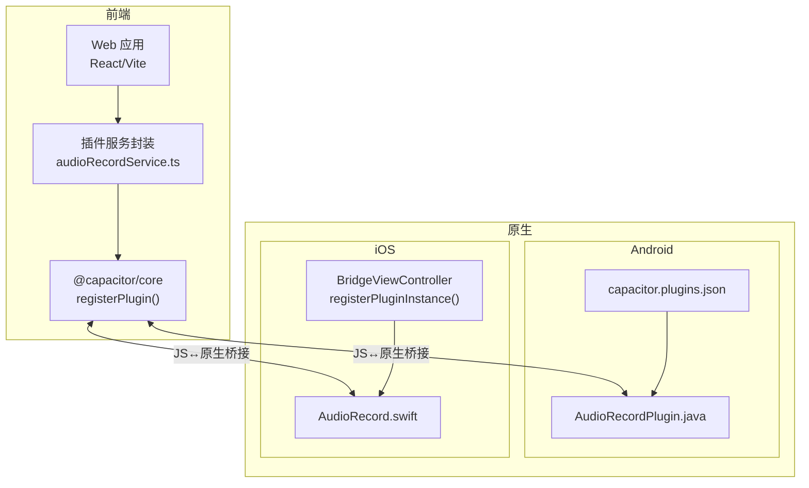
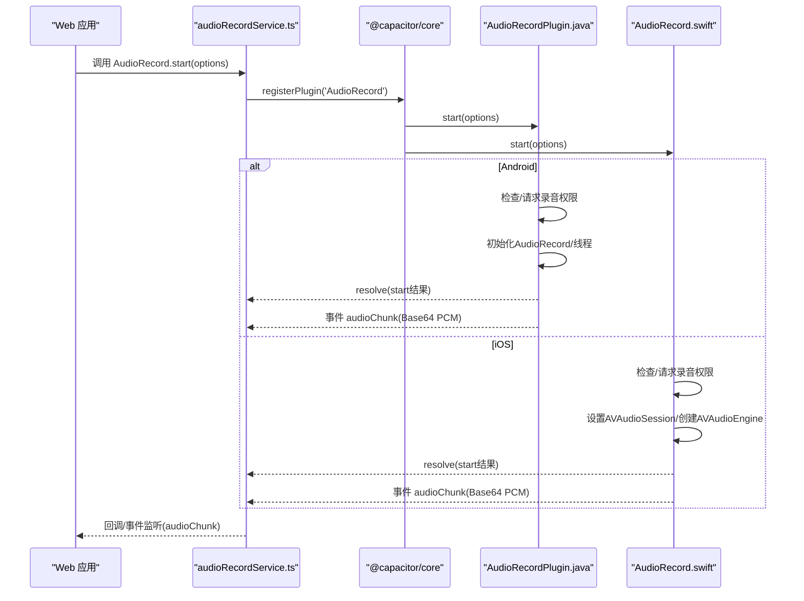
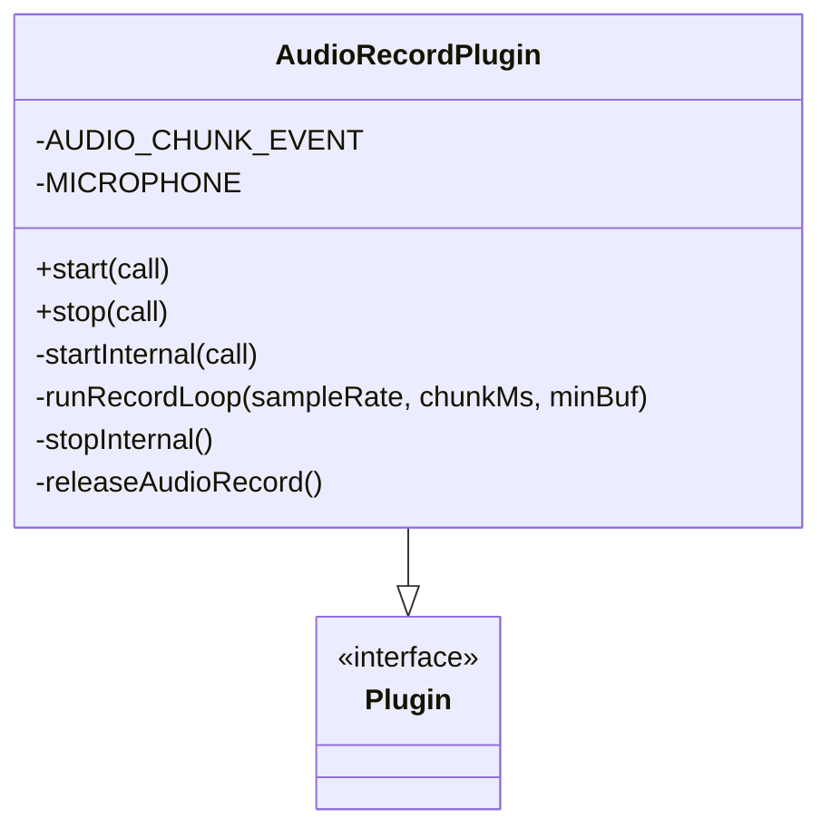
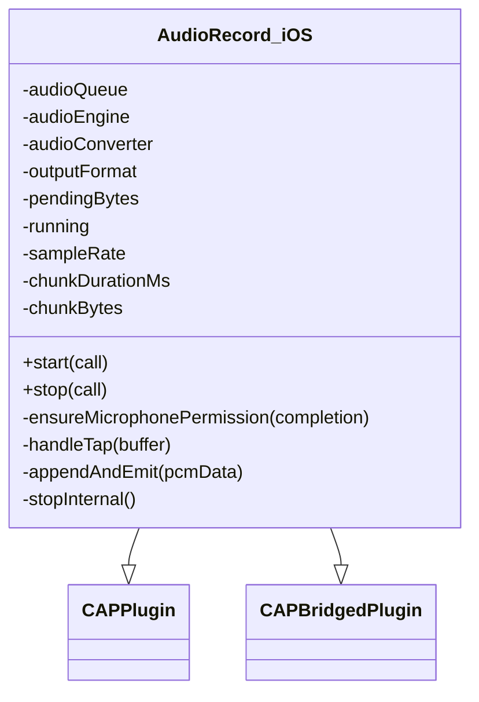
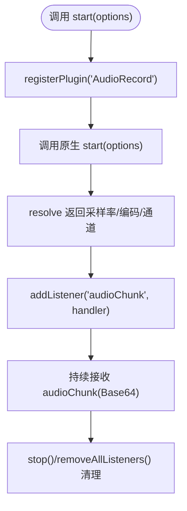
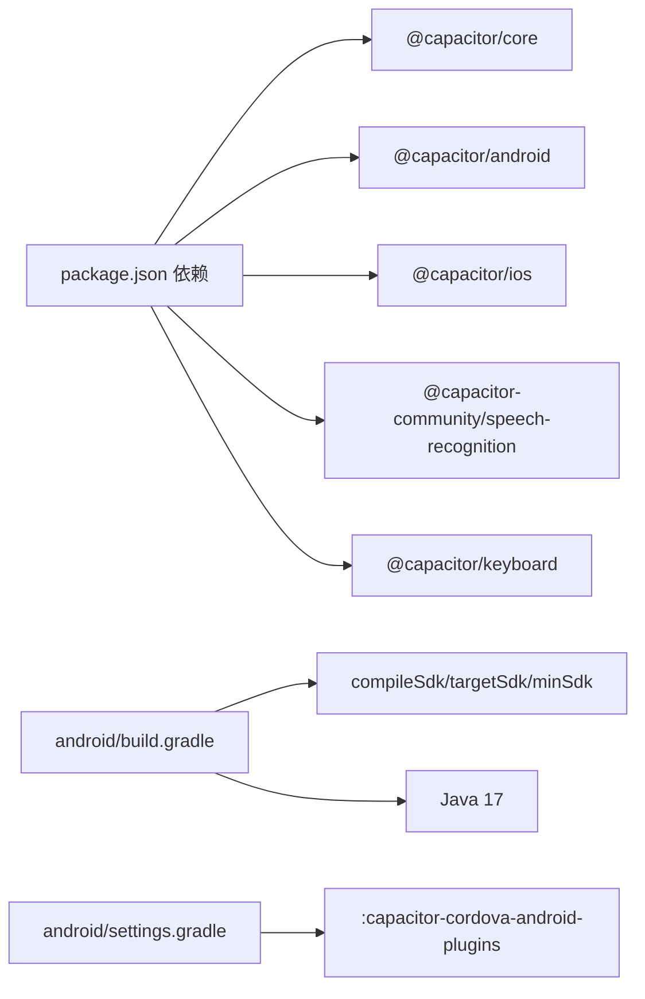

# 插件集成架构

<cite>
**本文引用的文件**
- [capacitor.config.json](file://capacitor.config.json)
- [capacitor.plugins.json](file://android/app/src/main/assets/capacitor.plugins.json)
- [AudioRecordPlugin.java](file://android/app/src/main/java/com/shisi/app/v2/plugins/AudioRecordPlugin.java)
- [audioRecordService.ts](file://src/app/services/audioRecordService.ts)
- [AppDelegate.swift](file://ios/App/App/AppDelegate.swift)
- [package.json](file://package.json)
- [README.md](file://README.md)
- [settings.gradle](file://android/settings.gradle)
- [build.gradle](file://android/capacitor-cordova-android-plugins/build.gradle)
- [cordova.variables.gradle](file://android/capacitor-cordova-android-plugins/cordova.variables.gradle)
</cite>

## 目录
1. [简介](#简介)
2. [项目结构](#项目结构)
3. [核心组件](#核心组件)
4. [架构总览](#架构总览)
5. [详细组件分析](#详细组件分析)
6. [依赖分析](#依赖分析)
7. [性能考虑](#性能考虑)
8. [故障排查指南](#故障排查指南)
9. [结论](#结论)
10. [附录](#附录)

## 简介
本文件面向Note-taking app的Capacitor插件集成，系统性阐述插件架构设计、原生功能访问层实现原理、插件注册机制、JavaScript与原生桥接方式、异步通信模式、生命周期管理、权限申请流程与错误处理策略，并提供自定义插件开发指南、配置选项说明、平台特定实现要点、最佳实践、性能优化建议、调试与测试方法。内容兼顾初学者对Capacitor基本概念的理解与资深开发者对插件架构的深入掌握。

## 项目结构
本项目采用Capacitor跨平台框架，前端基于React/Vite，原生端包含Android与iOS工程，插件以自研与第三方组合的方式集成。关键位置如下：
- 配置层：Capacitor全局配置与插件清单
- 前端服务层：通过@capacitor/core注册与调用插件
- 原生插件层：Android与iOS分别实现同一功能的插件
- 构建与打包：Gradle与CocoaPods负责原生依赖与资源集成

图表来源
- [audioRecordService.ts:1-35](file://src/app/services/audioRecordService.ts#L1-L35)
- [AppDelegate.swift:52-56](file://ios/App/App/AppDelegate.swift#L52-L56)
- [AudioRecordPlugin.java:1-230](file://android/app/src/main/java/com/shisi/app/v2/plugins/AudioRecordPlugin.java#L1-L230)
- [capacitor.plugins.json:1-11](file://android/app/src/main/assets/capacitor.plugins.json#L1-L11)

章节来源
- [capacitor.config.json:1-31](file://capacitor.config.json#L1-L31)
- [package.json:1-113](file://package.json#L1-L113)
- [README.md:1-41](file://README.md#L1-L41)

## 核心组件
- Capacitor配置与插件清单
  - 全局配置用于应用标识、Web目录、服务器参数与内置插件配置
  - Android插件清单用于声明已安装的原生插件类路径
- 插件服务封装
  - 前端通过registerPlugin注册插件接口，暴露start/stop与事件监听等方法
- 原生插件实现
  - Android：基于@CapacitorPlugin注解与Plugin基类，实现权限请求、音频录制与事件推送
  - iOS：基于CAPPlugin/CAPBridgedPlugin，使用AVAudioSession/AVAudioEngine进行录音与分块输出
- 构建与集成
  - Gradle/CocoaPods负责原生依赖与资源打包，settings.gradle与build.gradle控制模块包含与SDK版本

章节来源
- [capacitor.config.json:9-29](file://capacitor.config.json#L9-L29)
- [capacitor.plugins.json:1-11](file://android/app/src/main/assets/capacitor.plugins.json#L1-L11)
- [audioRecordService.ts:1-35](file://src/app/services/audioRecordService.ts#L1-L35)
- [AudioRecordPlugin.java:19-22](file://android/app/src/main/java/com/shisi/app/v2/plugins/AudioRecordPlugin.java#L19-L22)
- [AppDelegate.swift:52-56](file://ios/App/App/AppDelegate.swift#L52-L56)

## 架构总览
下图展示从Web到原生的完整调用链路与数据流，包括插件注册、方法调用、权限申请、事件推送与生命周期管理。

图表来源
- [audioRecordService.ts:26-33](file://src/app/services/audioRecordService.ts#L26-L33)
- [AudioRecordPlugin.java:39-136](file://android/app/src/main/java/com/shisi/app/v2/plugins/AudioRecordPlugin.java#L39-L136)
- [AppDelegate.swift:80-155](file://ios/App/App/AppDelegate.swift#L80-L155)

## 详细组件分析

### 组件一：AudioRecord 插件（Android）
- 注解与权限
  - 使用@CapacitorPlugin声明插件名称与权限别名，权限字符串指向录音权限
- 方法与事件
  - start：校验权限后初始化AudioRecord，启动录音线程，按配置分块读取并以Base64事件推送
  - stop：停止录音、释放资源、中断线程
  - 事件：audioChunk，携带采样率、通道数、编码格式与时间戳
- 生命周期
  - handleOnDestroy中确保停止录音与资源释放
- 错误处理
  - 对AudioRecord初始化、启动状态、缓冲区大小与异常进行拒绝处理
- 性能与并发
  - 使用锁与原子布尔量保证线程安全；设置音频线程优先级；按块拼接与Base64编码降低JS交互频率

图表来源
- [AudioRecordPlugin.java:19-22](file://android/app/src/main/java/com/shisi/app/v2/plugins/AudioRecordPlugin.java#L19-L22)
- [AudioRecordPlugin.java:39-136](file://android/app/src/main/java/com/shisi/app/v2/plugins/AudioRecordPlugin.java#L39-L136)
- [AudioRecordPlugin.java:189-229](file://android/app/src/main/java/com/shisi/app/v2/plugins/AudioRecordPlugin.java#L189-L229)

章节来源
- [AudioRecordPlugin.java:19-22](file://android/app/src/main/java/com/shisi/app/v2/plugins/AudioRecordPlugin.java#L19-L22)
- [AudioRecordPlugin.java:39-136](file://android/app/src/main/java/com/shisi/app/v2/plugins/AudioRecordPlugin.java#L39-L136)
- [AudioRecordPlugin.java:189-229](file://android/app/src/main/java/com/shisi/app/v2/plugins/AudioRecordPlugin.java#L189-L229)

### 组件二：AudioRecord 插件（iOS）
- 插件注册
  - BridgeViewController在capacitorDidLoad时注册插件实例
- 方法与事件
  - start：校验权限，设置AVAudioSession为播放录音模式，创建AVAudioEngine与AVAudioConverter，安装输入节点tap，启动引擎并resolve结果；按块拼接与Base64编码后推送audioChunk事件
  - stop：移除tap、停止引擎、释放会话
  - 事件：audioChunk，字段与Android一致
- 权限与会话
  - 使用AVAudioSession.recordPermission检查与请求录音权限；设置preferredSampleRate与active状态
- 并发与队列
  - 使用专用DispatchQueue处理音频采集与转换，主线程负责resolve/reject与通知监听者

图表来源
- [AppDelegate.swift:52-56](file://ios/App/App/AppDelegate.swift#L52-L56)
- [AppDelegate.swift:58-251](file://ios/App/App/AppDelegate.swift#L58-L251)

章节来源
- [AppDelegate.swift:52-56](file://ios/App/App/AppDelegate.swift#L52-L56)
- [AppDelegate.swift:58-251](file://ios/App/App/AppDelegate.swift#L58-L251)

### 组件三：前端服务封装（audioRecordService.ts）
- 类型与接口
  - 定义事件与start选项/结果类型，统一两端数据结构
- 插件注册
  - 通过registerPlugin注册名为AudioRecord的插件实例
- 事件监听
  - addListener接收audioChunk事件，removeAllListeners清理监听

图表来源
- [audioRecordService.ts:1-35](file://src/app/services/audioRecordService.ts#L1-L35)

章节来源
- [audioRecordService.ts:1-35](file://src/app/services/audioRecordService.ts#L1-L35)

### 组件四：配置与插件清单
- 全局配置
  - appId/appName/webDir/server参数定义应用标识与开发服务器行为
  - plugins段配置内置插件（如StatusBar/Keyboard/SplashScreen）
- Android插件清单
  - assets中的capacitor.plugins.json声明第三方或自研插件的包名与类路径，供运行时加载

章节来源
- [capacitor.config.json:1-31](file://capacitor.config.json#L1-L31)
- [capacitor.plugins.json:1-11](file://android/app/src/main/assets/capacitor.plugins.json#L1-L11)

## 依赖分析
- 前端依赖
  - @capacitor/core/@capacitor/*系列包提供跨平台桥接与平台适配
  - 第三方插件如@capacitor-community/speech-recognition与@capacitor/keyboard通过package.json声明
- 原生构建
  - settings.gradle包含capacitor-cordova-android-plugins库模块
  - build.gradle定义编译SDK、目标SDK、Java版本与仓库源
  - cordova.variables.gradle提供最小SDK等变量

图表来源
- [package.json:10-16](file://package.json#L10-L16)
- [build.gradle:18-34](file://android/capacitor-cordova-android-plugins/build.gradle#L18-L34)
- [settings.gradle:1-5](file://android/settings.gradle#L1-L5)
- [cordova.variables.gradle:1-7](file://android/capacitor-cordova-android-plugins/cordova.variables.gradle#L1-L7)

章节来源
- [package.json:10-16](file://package.json#L10-L16)
- [build.gradle:18-34](file://android/capacitor-cordova-android-plugins/build.gradle#L18-L34)
- [settings.gradle:1-5](file://android/settings.gradle#L1-L5)
- [cordova.variables.gradle:1-7](file://android/capacitor-cordova-android-plugins/cordova.variables.gradle#L1-L7)

## 性能考虑
- 分块传输与Base64编码
  - 将PCM数据按固定时长分块，减少单次传输体积，降低JS桥接开销
- 线程与队列
  - Android设置音频线程优先级，iOS使用专用队列处理音频数据，避免阻塞主线程
- 资源释放
  - 在stop与生命周期回调中及时释放AudioRecord/AVAudioEngine/会话，防止内存泄漏
- 缓冲区与采样率
  - 合理计算缓冲区大小与块字节数，避免频繁分配与拷贝
- 事件频率
  - 控制chunkDurationMs，平衡实时性与性能

## 故障排查指南
- 权限相关
  - Android：若权限未授予，插件会拒绝调用并返回明确错误；确认AndroidManifest与权限回调逻辑
  - iOS：若录音权限被拒或未确定，需引导用户授权；检查AVAudioSession设置
- 录音初始化失败
  - Android：minBufferSize获取失败、AudioRecord初始化失败、startRecording异常、状态非RECORDING均会导致拒绝
  - iOS：会话设置失败、格式创建失败、转换器创建失败、引擎启动失败均会拒绝
- 事件未到达
  - 确认前端已正确添加监听；检查原生是否在正确队列中触发notifyListeners；确认JS端监听句柄未提前移除
- 生命周期问题
  - Android：在handleOnDestroy中确保停止录音与释放资源；避免后台继续占用麦克风
  - iOS：stopInternal中移除tap、停止引擎、释放会话并设为非活跃

章节来源
- [AudioRecordPlugin.java:41-61](file://android/app/src/main/java/com/shisi/app/v2/plugins/AudioRecordPlugin.java#L41-L61)
- [AudioRecordPlugin.java:84-119](file://android/app/src/main/java/com/shisi/app/v2/plugins/AudioRecordPlugin.java#L84-L119)
- [AppDelegate.swift:183-199](file://ios/App/App/AppDelegate.swift#L183-L199)
- [AppDelegate.swift:166-181](file://ios/App/App/AppDelegate.swift#L166-L181)

## 结论
本项目通过统一的插件接口与平台特定实现，实现了稳定的录音能力。前端以服务封装屏蔽差异，原生端分别针对Android与iOS的特性进行优化。结合合理的分块传输、权限与生命周期管理、错误处理策略，可为Note-taking app提供可靠的原生功能扩展能力。后续可在现有基础上扩展更多平台特定功能与第三方插件，同时遵循本文最佳实践以保障稳定性与性能。

## 附录

### 自定义插件开发指南
- 设计原则
  - 明确插件职责边界，统一JS与原生的数据结构与事件命名
  - 在原生端做好权限检查与异常捕获，向JS返回明确的错误信息
- Android
  - 使用@CapacitorPlugin注解与Plugin基类，通过@PluginMethod声明方法，使用@PermissionCallback处理权限回调
  - 事件推送使用bridge.getWebView().post(() -> notifyListeners(...))确保在主线程触发
- iOS
  - 实现CAPPlugin/CAPBridgedPlugin，使用DispatchQueue处理耗时任务，主线程resolve/reject与通知监听者
  - 在BridgeViewController的capacitorDidLoad中注册插件实例
- 前端
  - 使用registerPlugin注册插件，定义类型与事件监听，提供统一的start/stop与事件接口

章节来源
- [AudioRecordPlugin.java:19-22](file://android/app/src/main/java/com/shisi/app/v2/plugins/AudioRecordPlugin.java#L19-L22)
- [AppDelegate.swift:52-56](file://ios/App/App/AppDelegate.swift#L52-L56)
- [audioRecordService.ts:26-33](file://src/app/services/audioRecordService.ts#L26-L33)

### 插件配置选项
- 全局配置（capacitor.config.json）
  - server：androidScheme/cleartext等开发服务器参数
  - plugins：内置插件的样式与行为配置（如StatusBar/Keyboard/SplashScreen）
- Android插件清单（capacitor.plugins.json）
  - pkg/classpath：声明插件包名与类路径，供运行时加载

章节来源
- [capacitor.config.json:5-29](file://capacitor.config.json#L5-L29)
- [capacitor.plugins.json:1-11](file://android/app/src/main/assets/capacitor.plugins.json#L1-L11)

### 平台特定实现要点
- Android
  - 使用AudioRecord与线程模型，注意缓冲区大小与线程优先级
  - 在生命周期回调中释放资源，避免后台占用
- iOS
  - 使用AVAudioSession/AVAudioEngine/AVAudioConverter，注意会话模式与采样率设置
  - 使用DispatchQueue隔离音频处理，主线程负责桥接

章节来源
- [AudioRecordPlugin.java:138-187](file://android/app/src/main/java/com/shisi/app/v2/plugins/AudioRecordPlugin.java#L138-L187)
- [AppDelegate.swift:108-154](file://ios/App/App/AppDelegate.swift#L108-L154)

### 最佳实践
- 数据一致性：JS与原生字段保持一致（采样率、编码、通道、时间戳）
- 异步与并发：避免阻塞主线程，使用专用线程/队列处理音频
- 资源管理：严格在stop与生命周期回调中释放资源
- 错误处理：对初始化、状态、异常进行明确拒绝与日志记录
- 事件频率：合理设置chunkDurationMs，兼顾实时性与性能

### 调试与测试方法
- 日志与断点
  - 在原生端打印关键状态与错误信息，在JS端监听事件并记录时间戳
- 单元测试
  - Android可使用Instrumentation测试；iOS可使用XCTest
- 集成测试
  - 在真实设备上验证权限弹窗、录音质量与事件推送稳定性
- 性能分析
  - 使用Android Studio与Xcode性能工具监控CPU、内存与音频延迟