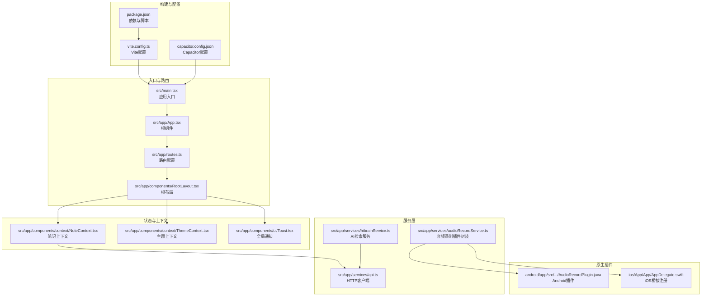
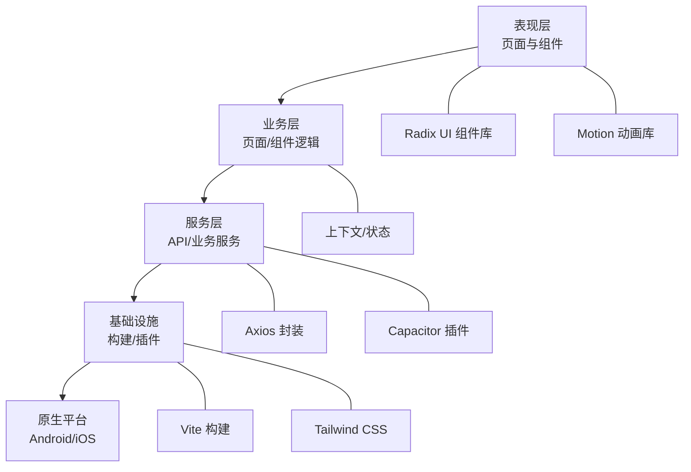
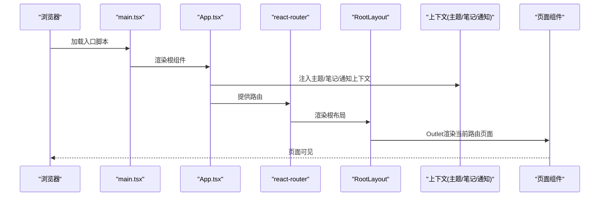
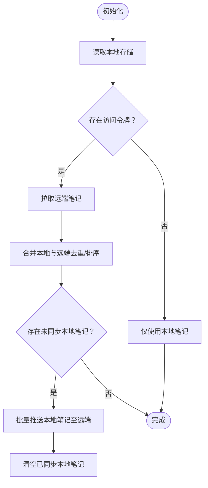
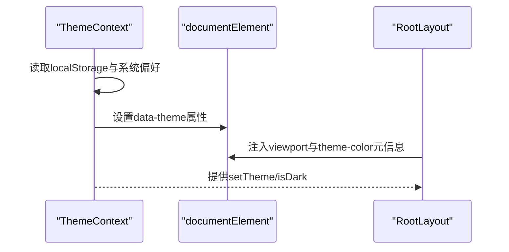
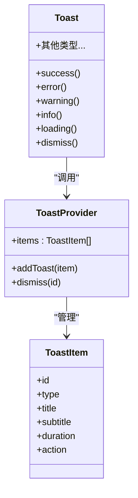
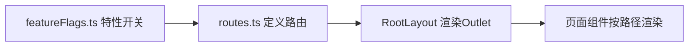
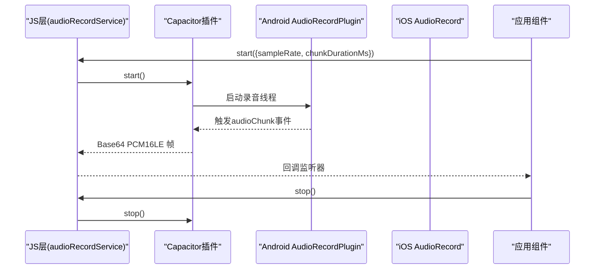
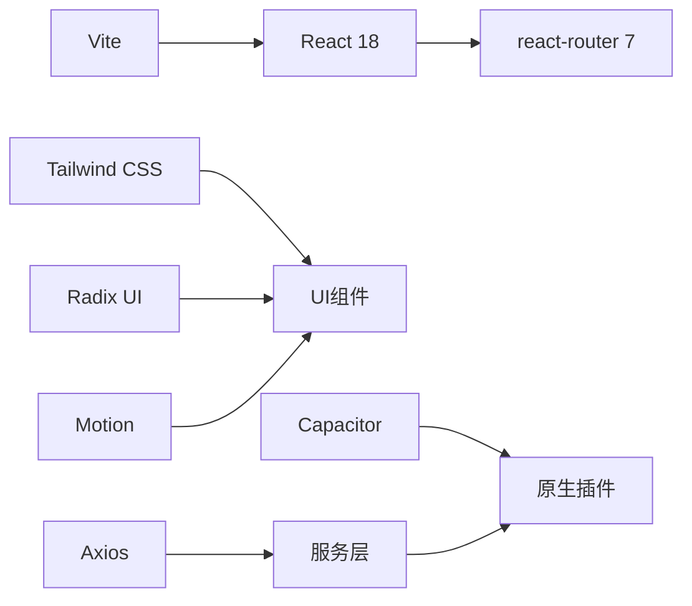

# 整体架构概览

<cite>
**本文档引用的文件**
- [main.tsx](file://src/main.tsx)
- [App.tsx](file://src/app/App.tsx)
- [routes.ts](file://src/app/routes.ts)
- [RootLayout.tsx](file://src/app/components/RootLayout.tsx)
- [NoteContext.tsx](file://src/app/components/context/NoteContext.tsx)
- [ThemeContext.tsx](file://src/app/components/context/ThemeContext.tsx)
- [Toast.tsx](file://src/app/components/ui/Toast.tsx)
- [api.ts](file://src/app/services/api.ts)
- [hibrainService.ts](file://src/app/services/hibrainService.ts)
- [audioRecordService.ts](file://src/app/services/audioRecordService.ts)
- [AudioRecordPlugin.java](file://android/app/src/main/java/com/shisi/app/v2/plugins/AudioRecordPlugin.java)
- [AppDelegate.swift](file://ios/App/App/AppDelegate.swift)
- [vite.config.ts](file://vite.config.ts)
- [package.json](file://package.json)
- [capacitor.config.json](file://capacitor.config.json)
- [featureFlags.ts](file://src/app/utils/featureFlags.ts)
</cite>

## 目录
1. [引言](#引言)
2. [项目结构](#项目结构)
3. [核心组件](#核心组件)
4. [架构总览](#架构总览)
5. [详细组件分析](#详细组件分析)
6. [依赖分析](#依赖分析)
7. [性能考虑](#性能考虑)
8. [故障排除指南](#故障排除指南)
9. [结论](#结论)
10. [附录](#附录)

## 引言
本文件为Note-taking app前端的整体架构概览文档，面向初学者与有经验的开发者，系统阐述应用的架构模式、组件关系、数据流与启动流程，并给出技术栈选择与架构决策的权衡分析。该应用采用组件化架构、分层架构与插件化扩展相结合的设计理念，通过React + Vite构建，结合Capacitor实现跨平台原生能力集成。

## 项目结构
应用采用“按功能域划分”的目录组织方式，核心入口与路由配置清晰分离，上下文与服务层独立，UI组件以Radix UI为基础进行组合与定制。

**图表来源**
- [main.tsx:1-7](file://src/main.tsx#L1-L7)
- [App.tsx:1-17](file://src/app/App.tsx#L1-L17)
- [routes.ts:1-61](file://src/app/routes.ts#L1-L61)
- [RootLayout.tsx:1-52](file://src/app/components/RootLayout.tsx#L1-L52)
- [NoteContext.tsx:1-356](file://src/app/components/context/NoteContext.tsx#L1-L356)
- [ThemeContext.tsx:1-110](file://src/app/components/context/ThemeContext.tsx#L1-L110)
- [Toast.tsx:1-495](file://src/app/components/ui/Toast.tsx#L1-L495)
- [api.ts:1-127](file://src/app/services/api.ts#L1-L127)
- [hibrainService.ts:1-118](file://src/app/services/hibrainService.ts#L1-L118)
- [audioRecordService.ts:1-33](file://src/app/services/audioRecordService.ts#L1-L33)
- [AudioRecordPlugin.java:1-151](file://android/app/src/main/java/com/shisi/app/v2/plugins/AudioRecordPlugin.java#L1-L151)
- [AppDelegate.swift:43-106](file://ios/App/App/AppDelegate.swift#L43-L106)
- [vite.config.ts:1-44](file://vite.config.ts#L1-L44)
- [package.json:1-113](file://package.json#L1-L113)
- [capacitor.config.json:1-31](file://capacitor.config.json#L1-L31)

**章节来源**
- [main.tsx:1-7](file://src/main.tsx#L1-L7)
- [App.tsx:1-17](file://src/app/App.tsx#L1-L17)
- [routes.ts:1-61](file://src/app/routes.ts#L1-L61)
- [RootLayout.tsx:1-52](file://src/app/components/RootLayout.tsx#L1-L52)
- [vite.config.ts:1-44](file://vite.config.ts#L1-L44)
- [package.json:1-113](file://package.json#L1-L113)
- [capacitor.config.json:1-31](file://capacitor.config.json#L1-L31)

## 核心组件
- 应用入口与根组件
  - main.tsx负责挂载React根节点并渲染App。
  - App.tsx作为顶层容器，注入主题、笔记与通知上下文，并提供路由入口。
- 路由与布局
  - routes.ts集中定义页面路由与嵌套路由，RootLayout统一注入移动端viewport元信息与主题色。
- 上下文与状态管理
  - NoteContext：统一管理笔记列表、增删改查、本地/云端同步与合并逻辑。
  - ThemeContext：管理深浅主题切换与系统偏好联动。
  - Toast：全局通知系统，支持多种类型与动画效果。
- 服务层
  - api.ts：Axios封装，统一处理鉴权头、Token刷新与错误翻译。
  - hibrainService：AI检索服务封装，屏蔽底层接口差异。
  - audioRecordService：Capacitor音频录制插件的JS封装，提供事件监听与生命周期管理。
- 构建与运行时
  - vite.config.ts：React与Tailwind插件、别名与去重策略、预打包优化。
  - package.json：依赖与脚本；capacitor.config.json：跨平台配置。

**章节来源**
- [main.tsx:1-7](file://src/main.tsx#L1-L7)
- [App.tsx:1-17](file://src/app/App.tsx#L1-L17)
- [routes.ts:1-61](file://src/app/routes.ts#L1-L61)
- [RootLayout.tsx:1-52](file://src/app/components/RootLayout.tsx#L1-L52)
- [NoteContext.tsx:1-356](file://src/app/components/context/NoteContext.tsx#L1-L356)
- [ThemeContext.tsx:1-110](file://src/app/components/context/ThemeContext.tsx#L1-L110)
- [Toast.tsx:1-495](file://src/app/components/ui/Toast.tsx#L1-L495)
- [api.ts:1-127](file://src/app/services/api.ts#L1-L127)
- [hibrainService.ts:1-118](file://src/app/services/hibrainService.ts#L1-L118)
- [audioRecordService.ts:1-33](file://src/app/services/audioRecordService.ts#L1-L33)
- [vite.config.ts:1-44](file://vite.config.ts#L1-L44)
- [package.json:1-113](file://package.json#L1-L113)
- [capacitor.config.json:1-31](file://capacitor.config.json#L1-L31)

## 架构总览
应用采用“组件化 + 分层 + 插件化”的混合架构：
- 组件化：UI由原子组件（Radix UI等）组合而成，页面组件承担业务逻辑。
- 分层：表现层（UI）、业务层（页面/组件）、服务层（API封装）、基础设施（构建/插件）。
- 插件化：通过Capacitor桥接原生能力（如音频录制），保持JS层抽象与跨平台一致性。

[此图为概念性架构示意，不直接映射具体源码文件，故无图表来源]

## 详细组件分析

### 启动流程与渲染序列
从浏览器加载到页面渲染的关键步骤如下：

**图表来源**
- [main.tsx:1-7](file://src/main.tsx#L1-L7)
- [App.tsx:1-17](file://src/app/App.tsx#L1-L17)
- [routes.ts:1-61](file://src/app/routes.ts#L1-L61)
- [RootLayout.tsx:1-52](file://src/app/components/RootLayout.tsx#L1-L52)

**章节来源**
- [main.tsx:1-7](file://src/main.tsx#L1-L7)
- [App.tsx:1-17](file://src/app/App.tsx#L1-L17)
- [routes.ts:1-61](file://src/app/routes.ts#L1-L61)
- [RootLayout.tsx:1-52](file://src/app/components/RootLayout.tsx#L1-L52)

### 笔记上下文（NoteContext）数据流
笔记上下文负责本地与远端数据的合并、同步与变更处理，包含以下关键流程：

**图表来源**
- [NoteContext.tsx:103-218](file://src/app/components/context/NoteContext.tsx#L103-L218)

**章节来源**
- [NoteContext.tsx:1-356](file://src/app/components/context/NoteContext.tsx#L1-L356)

### 主题上下文（ThemeContext）与根布局
主题上下文负责根据系统偏好与用户设置切换深浅主题，并将主题状态应用到DOM；RootLayout在挂载时注入viewport与主题色元信息。

**图表来源**
- [ThemeContext.tsx:63-105](file://src/app/components/context/ThemeContext.tsx#L63-L105)
- [RootLayout.tsx:10-31](file://src/app/components/RootLayout.tsx#L10-L31)

**章节来源**
- [ThemeContext.tsx:1-110](file://src/app/components/context/ThemeContext.tsx#L1-L110)
- [RootLayout.tsx:1-52](file://src/app/components/RootLayout.tsx#L1-L52)

### 全局通知（Toast）系统
Toast提供统一的通知入口与动画展示，支持多类型与动作按钮，内部维护单项通知队列并通过Portal渲染到body。

**图表来源**
- [Toast.tsx:458-478](file://src/app/components/ui/Toast.tsx#L458-L478)
- [Toast.tsx:100-126](file://src/app/components/ui/Toast.tsx#L100-L126)
- [Toast.tsx:38-42](file://src/app/components/ui/Toast.tsx#L38-L42)

**章节来源**
- [Toast.tsx:1-495](file://src/app/components/ui/Toast.tsx#L1-L495)

### 路由与页面导航
路由采用React Router v7的BrowserRouter，RootLayout包裹Outlet，页面组件按需渲染。特性开关控制部分页面是否启用。

**图表来源**
- [routes.ts:26-60](file://src/app/routes.ts#L26-L60)
- [RootLayout.tsx:32-50](file://src/app/components/RootLayout.tsx#L32-L50)
- [featureFlags.ts:1-14](file://src/app/utils/featureFlags.ts#L1-L14)

**章节来源**
- [routes.ts:1-61](file://src/app/routes.ts#L1-L61)
- [RootLayout.tsx:1-52](file://src/app/components/RootLayout.tsx#L1-L52)
- [featureFlags.ts:1-14](file://src/app/utils/featureFlags.ts#L1-L14)

### 服务层与跨平台插件
- HTTP服务：api.ts统一处理鉴权头、Token刷新与错误翻译，支持开发/生产/原生环境不同基地址。
- AI服务：hibrainService封装查询、记忆与遗忘接口。
- 音频录制：audioRecordService封装Capacitor插件，Android/iOS分别在原生层实现，JS层统一事件监听。

**图表来源**
- [audioRecordService.ts:1-33](file://src/app/services/audioRecordService.ts#L1-L33)
- [AudioRecordPlugin.java:1-151](file://android/app/src/main/java/com/shisi/app/v2/plugins/AudioRecordPlugin.java#L1-L151)
- [AppDelegate.swift:52-106](file://ios/App/App/AppDelegate.swift#L52-L106)

**章节来源**
- [api.ts:1-127](file://src/app/services/api.ts#L1-L127)
- [hibrainService.ts:1-118](file://src/app/services/hibrainService.ts#L1-L118)
- [audioRecordService.ts:1-33](file://src/app/services/audioRecordService.ts#L1-L33)
- [AudioRecordPlugin.java:1-151](file://android/app/src/main/java/com/shisi/app/v2/plugins/AudioRecordPlugin.java#L1-L151)
- [AppDelegate.swift:43-106](file://ios/App/App/AppDelegate.swift#L43-L106)

## 依赖分析
- 技术栈与选择
  - React 18 + react-router 7：现代声明式UI与路由。
  - Vite + Tailwind：快速构建与样式工具链。
  - Capacitor：跨平台原生能力桥接。
  - Radix UI + Motion：可访问性与高性能动画。
  - Axios：HTTP客户端与拦截器。
- 关键依赖关系
  - main.tsx依赖App.tsx；App.tsx依赖路由与上下文；页面组件依赖上下文与服务层；服务层依赖api封装与Capacitor插件。
- 优化与去重
  - Vite配置对React、motion、tiptap等进行dedupe与optimizeDeps，避免重复实例导致的Hook调用异常。

**图表来源**
- [package.json:10-83](file://package.json#L10-L83)
- [vite.config.ts:11-41](file://vite.config.ts#L11-L41)
- [main.tsx:1-7](file://src/main.tsx#L1-L7)

**章节来源**
- [package.json:1-113](file://package.json#L1-L113)
- [vite.config.ts:1-44](file://vite.config.ts#L1-L44)

## 性能考虑
- 构建与打包
  - 通过optimizeDeps与dedupe减少重复包，降低冷启动与内存占用。
  - 预打包关键依赖，缩短首次加载时间。
- 运行时
  - 使用Motion进行流畅动画，避免强制布局抖动。
  - Toast与Dialog等组件通过Portal减少DOM层级，提升渲染效率。
- 数据流
  - NoteContext对本地/远端数据进行合并与去重，避免重复渲染。
  - API拦截器统一处理鉴权与错误，减少页面层样板代码。

[本节为通用性能建议，无需特定文件来源]

## 故障排除指南
- Token过期与刷新
  - 当响应拦截器捕获401且存在refresh_token时自动刷新；若刷新失败则跳转登录页。
- 网络异常与错误翻译
  - 无响应时统一提示“网络开小差”；5xx翻译为“服务器打盹”；后端错误字符串做简单清洗。
- 音频录制
  - 若原生录音未进入RECORDSTATE_RECORDING或权限被拒，会拒绝调用；JS层监听audioChunk事件，停止时需移除监听。

**章节来源**
- [api.ts:56-127](file://src/app/services/api.ts#L56-L127)
- [audioRecordService.ts:1-33](file://src/app/services/audioRecordService.ts#L1-L33)
- [AudioRecordPlugin.java:115-136](file://android/app/src/main/java/com/shisi/app/v2/plugins/AudioRecordPlugin.java#L115-L136)

## 结论
该Note-taking app前端以组件化为核心，结合分层与插件化扩展，形成高内聚、低耦合的架构。通过上下文与服务层解耦UI与数据，配合Capacitor实现跨平台原生能力，既保证了开发效率，也兼顾了用户体验与性能。建议在后续迭代中持续关注依赖去重、路由懒加载与缓存策略，进一步优化首屏与交互体验。

## 附录
- 系统边界
  - 前端：React应用、UI组件、上下文与服务层。
  - 原生：Android/iOS平台，通过Capacitor桥接。
  - 后端：REST API，提供认证、笔记与AI检索等接口。
- 最佳实践
  - 使用上下文统一管理全局状态，避免深层传递。
  - 在服务层集中处理HTTP与错误，保持页面简洁。
  - 对关键依赖进行去重与预打包，提升构建稳定性。
  - 通过特性开关控制实验性功能，降低风险。

[本节为总结性内容，无需特定文件来源]