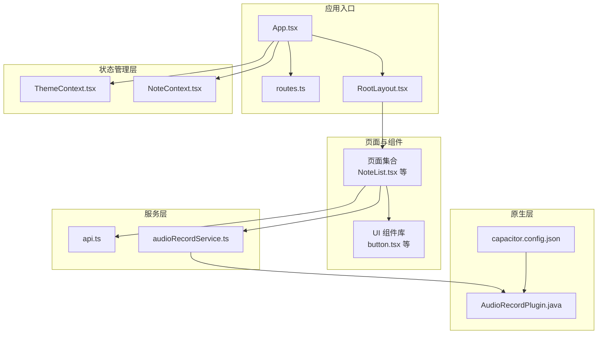
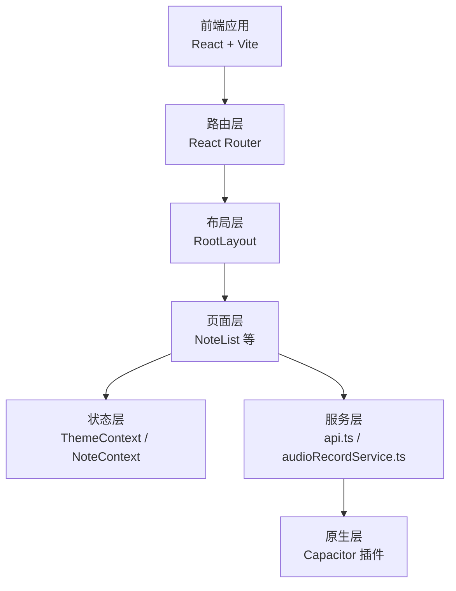
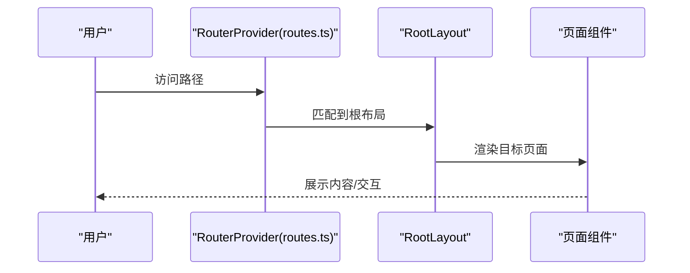
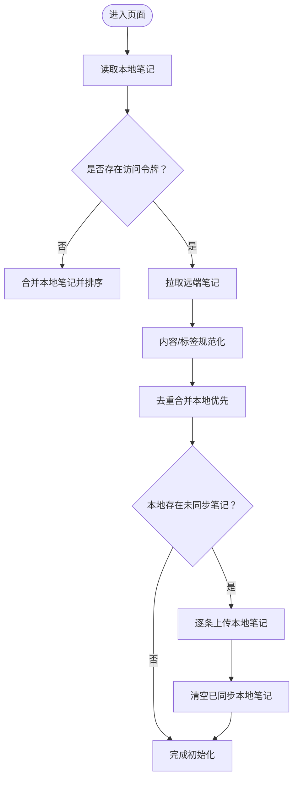
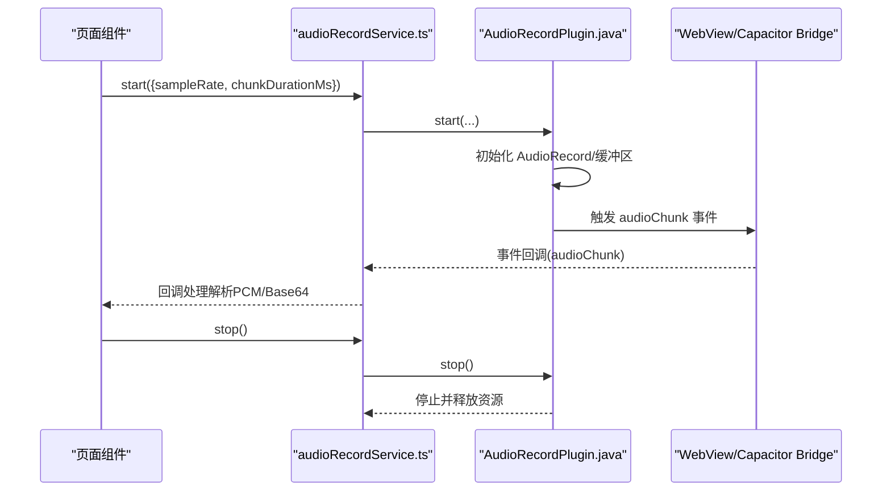
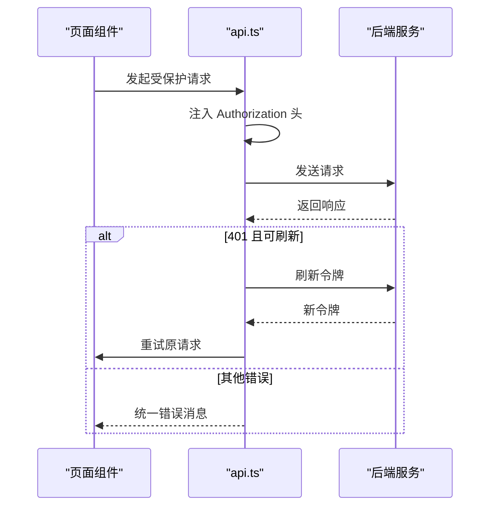
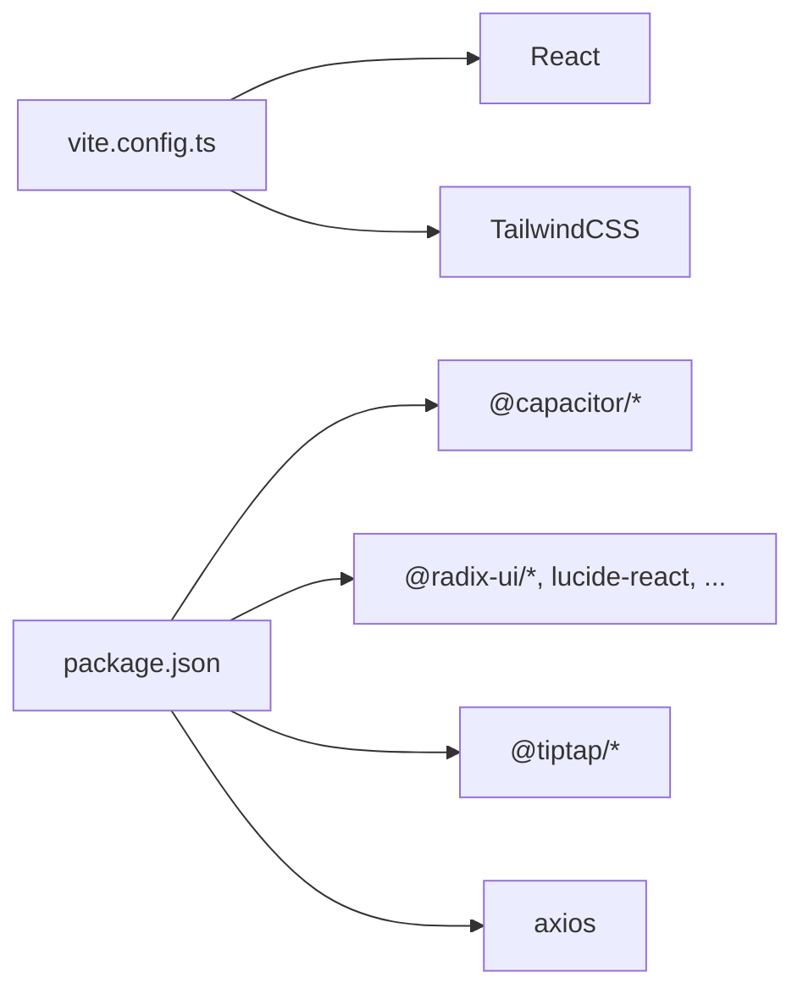

# 架构设计

<cite>
**本文引用的文件**
- [README.md](file://README.md)
- [App.tsx](file://src/app/App.tsx)
- [routes.ts](file://src/app/routes.ts)
- [RootLayout.tsx](file://src/app/components/RootLayout.tsx)
- [NoteContext.tsx](file://src/app/components/context/NoteContext.tsx)
- [ThemeContext.tsx](file://src/app/components/context/ThemeContext.tsx)
- [audioRecordService.ts](file://src/app/services/audioRecordService.ts)
- [AudioRecordPlugin.java](file://android/app/src/main/java/com/shisi/app/v2/plugins/AudioRecordPlugin.java)
- [capacitor.config.json](file://capacitor.config.json)
- [api.ts](file://src/app/services/api.ts)
- [NoteList.tsx](file://src/app/pages/NoteList.tsx)
- [button.tsx](file://src/app/components/ui/button.tsx)
- [package.json](file://package.json)
- [vite.config.ts](file://vite.config.ts)
</cite>

## 目录
1. [简介](#简介)
2. [项目结构](#项目结构)
3. [核心组件](#核心组件)
4. [架构总览](#架构总览)
5. [组件与模块详解](#组件与模块详解)
6. [依赖关系分析](#依赖关系分析)
7. [性能考量](#性能考量)
8. [故障排查指南](#故障排查指南)
9. [结论](#结论)
10. [附录](#附录)

## 简介
本项目是一个跨平台的笔记应用前端，采用组件化架构、分层架构与插件化扩展相结合的设计理念。应用通过 React Router 实现路由与导航，使用 Context Provider 模式进行状态管理，并通过 Capacitor 集成原生能力（如音频录制）。整体目标是在 Web 与原生环境之间保持一致的用户体验，同时支持本地离线笔记与云端同步。

## 项目结构
项目采用“按功能域划分”的组织方式，主要目录与职责如下：
- src/app/App.tsx：应用根组件，负责装配全局 Provider 与 Router。
- src/app/routes.ts：定义路由表，包含多级嵌套路由与条件渲染。
- src/app/components/context：上下文层，提供主题与笔记状态管理。
- src/app/components/ui：可复用 UI 组件库，基于 Radix UI 与 TailwindCSS。
- src/app/services：服务层，封装 API 调用与原生插件桥接。
- android/ 与 ios/：原生工程与 Capacitor 插件源码。
- vite.config.ts 与 package.json：构建与依赖配置。

图表来源
- [App.tsx:1-17](file://src/app/App.tsx#L1-L17)
- [routes.ts:1-61](file://src/app/routes.ts#L1-L61)
- [RootLayout.tsx:1-52](file://src/app/components/RootLayout.tsx#L1-L52)
- [ThemeContext.tsx:1-110](file://src/app/components/context/ThemeContext.tsx#L1-L110)
- [NoteContext.tsx:1-356](file://src/app/components/context/NoteContext.tsx#L1-L356)
- [api.ts:1-127](file://src/app/services/api.ts#L1-L127)
- [audioRecordService.ts:1-35](file://src/app/services/audioRecordService.ts#L1-L35)
- [AudioRecordPlugin.java:1-230](file://android/app/src/main/java/com/shisi/app/v2/plugins/AudioRecordPlugin.java#L1-L230)
- [capacitor.config.json:1-31](file://capacitor.config.json#L1-L31)

章节来源
- [App.tsx:1-17](file://src/app/App.tsx#L1-L17)
- [routes.ts:1-61](file://src/app/routes.ts#L1-L61)
- [RootLayout.tsx:1-52](file://src/app/components/RootLayout.tsx#L1-L52)
- [package.json:1-113](file://package.json#L1-L113)
- [vite.config.ts:1-44](file://vite.config.ts#L1-L44)

## 核心组件
- 应用根组件与路由装配：在根组件中注入主题、笔记与提示等 Provider，并通过 RouterProvider 提供路由能力。
- 主题上下文：统一管理明暗主题与系统跟随策略，持久化存储并响应系统偏好变化。
- 笔记上下文：集中管理笔记列表、加载状态、错误信息与 CRUD 操作；支持本地离线笔记与云端同步。
- 路由系统：基于 React Router 的嵌套路由，支持条件渲染与通配符路由。
- 原生插件桥接：通过 Capacitor 封装音频录制插件，提供事件驱动的数据流。
- 服务层：统一的 API 客户端，内置请求/响应拦截器，处理鉴权与错误翻译。

章节来源
- [App.tsx:1-17](file://src/app/App.tsx#L1-L17)
- [ThemeContext.tsx:1-110](file://src/app/components/context/ThemeContext.tsx#L1-L110)
- [NoteContext.tsx:1-356](file://src/app/components/context/NoteContext.tsx#L1-L356)
- [routes.ts:1-61](file://src/app/routes.ts#L1-L61)
- [audioRecordService.ts:1-35](file://src/app/services/audioRecordService.ts#L1-L35)
- [api.ts:1-127](file://src/app/services/api.ts#L1-L127)

## 架构总览
整体架构采用“组件化 + 分层 + 插件化”设计：
- 组件化：UI 以可复用组件为核心，页面组件组合上下文与服务层能力。
- 分层：视图层（页面/组件）、状态层（Context）、服务层（API/插件）、原生层（Capacitor）清晰分离。
- 插件化：通过 Capacitor 扩展原生能力，保持前端代码与原生命令解耦。

图表来源
- [App.tsx:1-17](file://src/app/App.tsx#L1-L17)
- [routes.ts:1-61](file://src/app/routes.ts#L1-L61)
- [RootLayout.tsx:1-52](file://src/app/components/RootLayout.tsx#L1-L52)
- [NoteContext.tsx:1-356](file://src/app/components/context/NoteContext.tsx#L1-L356)
- [ThemeContext.tsx:1-110](file://src/app/components/context/ThemeContext.tsx#L1-L110)
- [api.ts:1-127](file://src/app/services/api.ts#L1-L127)
- [audioRecordService.ts:1-35](file://src/app/services/audioRecordService.ts#L1-L35)

## 组件与模块详解

### 路由系统与导航
- 路由表定义于 routes.ts，采用嵌套路由与条件渲染，支持动态启用/禁用某些页面（如 Wiki）。
- RootLayout 注入移动端 viewport 与主题色元信息，保证在移动设备上的显示一致性。
- RouterProvider 在 App.tsx 中装配，确保 Provider 层级在路由切换时保持有效。

图表来源
- [routes.ts:1-61](file://src/app/routes.ts#L1-L61)
- [RootLayout.tsx:1-52](file://src/app/components/RootLayout.tsx#L1-L52)
- [App.tsx:1-17](file://src/app/App.tsx#L1-L17)

章节来源
- [routes.ts:1-61](file://src/app/routes.ts#L1-L61)
- [RootLayout.tsx:1-52](file://src/app/components/RootLayout.tsx#L1-L52)
- [App.tsx:1-17](file://src/app/App.tsx#L1-L17)

### 状态管理：Context Provider 模式
- 主题上下文 ThemeContext：提供主题选择、深浅模式判断与系统偏好监听，持久化存储于 localStorage。
- 笔记上下文 NoteContext：统一管理笔记列表、增删改查、加载与错误状态；支持本地离线笔记与云端同步。
- 数据规范化：对后端返回内容进行清洗与归一化，避免脏数据影响 UI。
- 同步策略：当检测到本地存在未同步笔记时，自动尝试上传并清理本地缓存。

图表来源
- [NoteContext.tsx:103-218](file://src/app/components/context/NoteContext.tsx#L103-L218)

章节来源
- [ThemeContext.tsx:1-110](file://src/app/components/context/ThemeContext.tsx#L1-L110)
- [NoteContext.tsx:1-356](file://src/app/components/context/NoteContext.tsx#L1-L356)

### 插件系统：Capacitor 音频录制
- JS 侧封装：audioRecordService.ts 定义插件接口、事件类型与启动参数。
- 原生实现：AudioRecordPlugin.java 使用 Android AudioRecord 进行录音，按固定时间片推送 Base64 编码的 PCM 数据。
- 集成配置：capacitor.config.json 配置插件与系统行为（键盘、状态栏、启动屏等）。
- 事件流：JS 侧通过 addListener 订阅 audioChunk 事件，按 800ms 时间片消费数据。

图表来源
- [audioRecordService.ts:1-35](file://src/app/services/audioRecordService.ts#L1-L35)
- [AudioRecordPlugin.java:1-230](file://android/app/src/main/java/com/shisi/app/v2/plugins/AudioRecordPlugin.java#L1-L230)
- [capacitor.config.json:1-31](file://capacitor.config.json#L1-L31)

章节来源
- [README.md:12-39](file://README.md#L12-L39)
- [audioRecordService.ts:1-35](file://src/app/services/audioRecordService.ts#L1-L35)
- [AudioRecordPlugin.java:1-230](file://android/app/src/main/java/com/shisi/app/v2/plugins/AudioRecordPlugin.java#L1-L230)
- [capacitor.config.json:1-31](file://capacitor.config.json#L1-L31)

### 服务层：API 客户端与错误处理
- 基础地址：根据运行环境（Web/Native/生产）动态选择 API 基础地址。
- 请求拦截：自动附加 Bearer Token。
- 响应拦截：统一处理 401 刷新令牌、网络异常与后端错误翻译，必要时跳转登录页。
- 与页面协作：页面通过 api.ts 发起请求，结合上下文更新状态。

图表来源
- [api.ts:1-127](file://src/app/services/api.ts#L1-L127)

章节来源
- [api.ts:1-127](file://src/app/services/api.ts#L1-L127)

### 页面与 UI 组件
- 页面组件：如 NoteList.tsx 聚合上下文、服务与 UI，承担业务逻辑协调。
- UI 组件：button.tsx 等基于 Variants 设计，提供一致的视觉与交互体验。
- 交互模式：页面通过上下文暴露的方法更新状态，UI 组件通过 props 与事件回调响应状态变化。

章节来源
- [NoteList.tsx:1-200](file://src/app/pages/NoteList.tsx#L1-L200)
- [button.tsx:1-59](file://src/app/components/ui/button.tsx#L1-L59)

## 依赖关系分析
- 构建与工具链：Vite + React + TailwindCSS，通过 optimizeDeps 与 alias 降低包重复与别名冲突风险。
- 依赖管理：package.json 明确声明运行时依赖与开发依赖，Capacitor 生态与第三方 UI 组件齐备。
- 组件耦合：页面与上下文松耦合，通过 hooks 获取状态；服务层对页面透明，便于替换与测试。

图表来源
- [vite.config.ts:1-44](file://vite.config.ts#L1-L44)
- [package.json:1-113](file://package.json#L1-L113)

章节来源
- [vite.config.ts:1-44](file://vite.config.ts#L1-L44)
- [package.json:1-113](file://package.json#L1-L113)

## 性能考量
- 依赖去重与预打包：通过 Vite 的 dedupe 与 optimizeDeps 避免 React 与 Motion 等库的重复实例，减少内存占用与初始化成本。
- 懒加载与按需渲染：页面组件内部可结合路由懒加载与虚拟滚动优化长列表性能。
- 网络与缓存：API 层设置超时与统一错误处理，避免阻塞主线程；本地笔记缓存减少首次加载等待。
- 主题切换过渡：主题切换使用 CSS 变量与过渡动画，保证流畅体验。

章节来源
- [vite.config.ts:1-44](file://vite.config.ts#L1-L44)
- [ThemeContext.tsx:50-61](file://src/app/components/context/ThemeContext.tsx#L50-L61)
- [api.ts:36-42](file://src/app/services/api.ts#L36-L42)

## 故障排查指南
- 登录态失效：响应拦截器会尝试刷新令牌，若失败则清除本地用户信息并跳转登录页。建议检查刷新接口与本地存储键值。
- 网络异常：统一错误翻译为用户可理解的消息，建议在网络层增加重试与退避策略。
- 主题不生效：确认系统偏好与本地存储键值，检查 DOM 上 data-theme 属性是否正确设置。
- 录音权限与事件：JS 侧需先申请权限，原生层拒绝时会返回错误；确保已配置权限并在 Capacitor 配置中声明。
- 路由异常：检查 routes.ts 中路径与组件映射，注意通配符与条件渲染分支。

章节来源
- [api.ts:56-126](file://src/app/services/api.ts#L56-L126)
- [ThemeContext.tsx:63-105](file://src/app/components/context/ThemeContext.tsx#L63-L105)
- [audioRecordService.ts:26-35](file://src/app/services/audioRecordService.ts#L26-L35)
- [AudioRecordPlugin.java:40-61](file://android/app/src/main/java/com/shisi/app/v2/plugins/AudioRecordPlugin.java#L40-L61)
- [routes.ts:24-58](file://src/app/routes.ts#L24-L58)

## 结论
该前端架构以 React Router 与 Context Provider 为核心，结合 Capacitor 插件系统，实现了跨平台的一致性与可扩展性。通过清晰的分层与模块化设计，既满足初学者快速上手，也为高级开发者提供了良好的扩展空间与最佳实践基础。

## 附录
- 技术选型要点
  - 路由：React Router v7
  - 状态：React Context
  - UI：Radix UI + TailwindCSS
  - 编辑器：Tiptap
  - 构建：Vite
  - 原生：Capacitor
- 最佳实践
  - 将 UI 组件与业务逻辑解耦，通过 hooks 传递状态。
  - 在服务层集中处理错误与重试，避免页面分散处理。
  - 对原生能力进行统一封装，保持 JS 侧接口稳定。