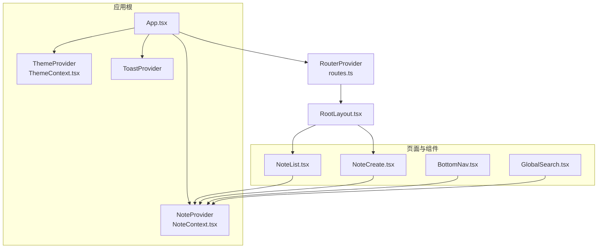
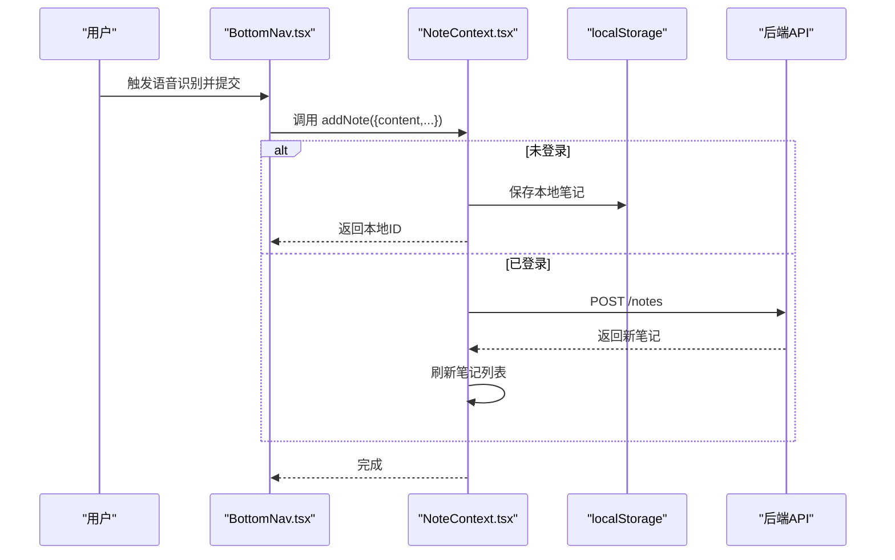
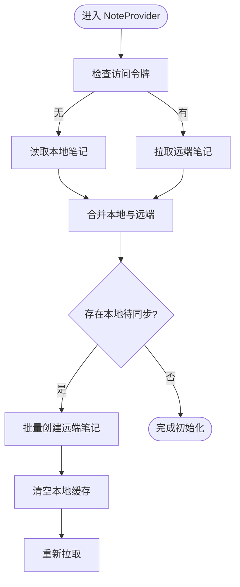
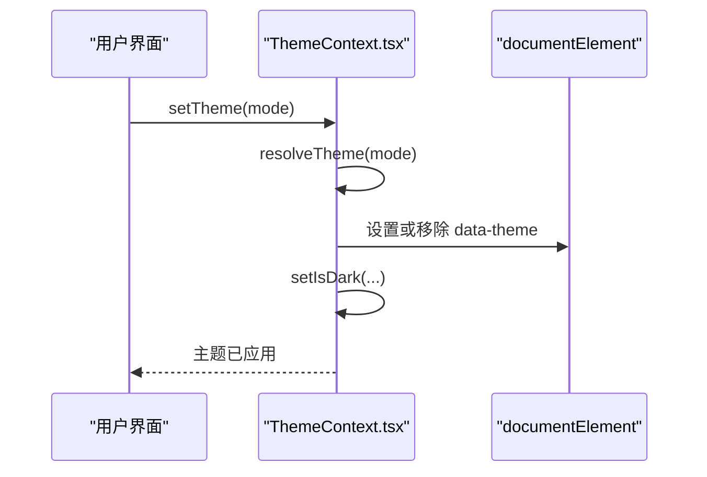
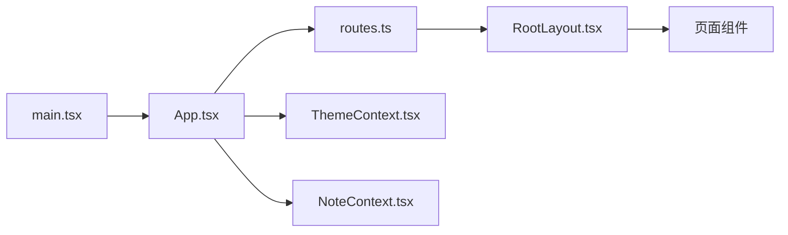

# 状态管理架构

<cite>
**本文引用的文件**
- [NoteContext.tsx](file://src/app/components/context/NoteContext.tsx)
- [ThemeContext.tsx](file://src/app/components/context/ThemeContext.tsx)
- [App.tsx](file://src/app/App.tsx)
- [RootLayout.tsx](file://src/app/components/RootLayout.tsx)
- [NoteList.tsx](file://src/app/pages/NoteList.tsx)
- [NoteCreate.tsx](file://src/app/pages/NoteCreate.tsx)
- [BottomNav.tsx](file://src/app/components/BottomNav.tsx)
- [GlobalSearch.tsx](file://src/app/components/GlobalSearch.tsx)
- [routes.ts](file://src/app/routes.ts)
- [main.tsx](file://src/main.tsx)
- [package.json](file://package.json)
</cite>

## 目录
1. [引言](#引言)
2. [项目结构](#项目结构)
3. [核心组件](#核心组件)
4. [架构总览](#架构总览)
5. [详细组件分析](#详细组件分析)
6. [依赖关系分析](#依赖关系分析)
7. [性能考量](#性能考量)
8. [故障排查指南](#故障排查指南)
9. [结论](#结论)
10. [附录](#附录)

## 引言
本文件系统性阐述该笔记应用前端的状态管理架构，重点围绕 Context Provider 模式，解析 NoteContext（笔记状态）与 ThemeContext（主题状态）的设计与实现，覆盖全局状态管理的架构模式、状态提升策略、组件间共享机制、状态更新与订阅流程、性能优化策略、状态持久化与恢复、以及扩展新状态域的最佳实践。文档同时兼顾初学者与高级开发者的不同需求。

## 项目结构
应用采用“路由驱动 + Context Provider”的组织方式：
- 应用根组件在顶层注入多个 Context Provider，形成全局状态树。
- 页面组件通过自定义 Hook 订阅所需上下文，实现跨层级的状态共享。
- 路由层负责页面切换，不直接参与状态逻辑，保持关注点分离。

图表来源
- [App.tsx:7-16](file://src/app/App.tsx#L7-L16)
- [routes.ts:26-59](file://src/app/routes.ts#L26-L59)
- [RootLayout.tsx:10-30](file://src/app/components/RootLayout.tsx#L10-L30)
- [NoteContext.tsx:89-347](file://src/app/components/context/NoteContext.tsx#L89-L347)
- [ThemeContext.tsx:63-105](file://src/app/components/context/ThemeContext.tsx#L63-L105)

章节来源
- [App.tsx:1-17](file://src/app/App.tsx#L1-L17)
- [routes.ts:1-61](file://src/app/routes.ts#L1-L61)
- [main.tsx:1-7](file://src/main.tsx#L1-L7)

## 核心组件
- NoteContext：统一管理笔记列表、加载状态、错误信息及增删改查操作；内置本地持久化与云端同步逻辑。
- ThemeContext：统一管理主题模式（系统/浅色/深色）、是否深色态与切换函数；持久化到本地存储并在 DOM 上应用。

章节来源
- [NoteContext.tsx:18-355](file://src/app/components/context/NoteContext.tsx#L18-L355)
- [ThemeContext.tsx:5-109](file://src/app/components/context/ThemeContext.tsx#L5-L109)

## 架构总览
- Provider 层：在应用根部注入 ThemeProvider 与 NoteProvider，确保全站可用。
- 页面层：各页面组件通过自定义 Hook 订阅上下文，避免层层 props 下传。
- 服务层：NoteContext 内部通过 API 服务进行网络请求，结合本地存储实现离线体验与数据合并。
- 主题层：ThemeContext 将主题选择映射到 DOM 的 data-theme 属性，影响样式变量。

图表来源
- [BottomNav.tsx:192-203](file://src/app/components/BottomNav.tsx#L192-L203)
- [NoteContext.tsx:224-272](file://src/app/components/context/NoteContext.tsx#L224-L272)
- [NoteContext.tsx:152-218](file://src/app/components/context/NoteContext.tsx#L152-L218)

## 详细组件分析

### NoteContext 设计与实现
- 数据模型与类型
  - Note 类型包含 id、title、content、type、status、createdAt、tags、imageUrl、structuredData 等字段，并支持 localOnly、pendingSync 等标记位。
  - 提供类型安全的上下文值接口，暴露 notes、loading、error 与 addNote/deleteNote/updateNote/refreshNotes 等方法。
- 状态初始化与加载
  - 首次渲染时根据是否存在访问令牌决定加载路径：无令牌则仅加载本地笔记；有令牌则拉取远端笔记并与本地合并。
  - 合并策略：以服务端为主，本地新增项作为补充，最终按创建时间倒序排序。
- 本地持久化与云端同步
  - 本地键名：shisi_local_notes_v1。
  - 本地笔记特征：id 以 local- 开头，标记 localOnly=true、pendingSync=true。
  - 同步流程：首次登录且存在本地笔记时，自动批量向后端创建，成功后清空本地缓存并再次拉取。
- 增删改查
  - 新增：未登录时生成本地ID并立即乐观更新；登录时调用后端接口，随后刷新列表。
  - 删除：本地ID直接从本地移除并持久化；远端ID调用删除接口后更新本地。
  - 更新：本地ID直接更新本地与持久化；远端ID调用更新接口后同步本地。
  - 刷新：统一走 fetchNotes，保证远端与本地合并一致。
- 输入规范化
  - 内容标准化：统一转字符串，去除 HTML 标签与多余空白。
  - 标签标准化：兼容数组、JSON 字符串与分隔符多种输入，统一为去空白非空数组。
  - 标题推导：优先使用标题，否则从正文提取纯文本前若干字符。

图表来源
- [NoteContext.tsx:95-218](file://src/app/components/context/NoteContext.tsx#L95-L218)

章节来源
- [NoteContext.tsx:4-16](file://src/app/components/context/NoteContext.tsx#L4-L16)
- [NoteContext.tsx:89-347](file://src/app/components/context/NoteContext.tsx#L89-L347)

### ThemeContext 设计与实现
- 主题模式
  - 支持三种模式：system（跟随系统）、light、dark。
  - 解析逻辑：resolveTheme 将 system 映射为实际 light/dark。
- DOM 应用
  - 在挂载与主题变化时，将 data-theme='dark' 或移除属性写入 <html>，配合 CSS 变量实现主题切换。
- 本地存储
  - 使用 localStorage 存储用户选择的主题，避免每次刷新丢失。
- 响应系统偏好
  - 当处于 system 模式时，监听 window.matchMedia('(prefers-color-scheme: dark)') 的 change 事件，动态刷新主题。
- 副作用最小化
  - 通过 useCallback 包装 applyTheme/setTheme，减少不必要的重渲染。

图表来源
- [ThemeContext.tsx:63-105](file://src/app/components/context/ThemeContext.tsx#L63-L105)

章节来源
- [ThemeContext.tsx:1-109](file://src/app/components/context/ThemeContext.tsx#L1-L109)
- [RootLayout.tsx:10-30](file://src/app/components/RootLayout.tsx#L10-L30)

### 组件间状态共享与订阅机制
- 自定义 Hook
  - useNotes/useTheme：在组件中解构上下文值，若未包裹于对应 Provider 则抛出错误，强制正确使用。
- 页面与组件使用示例
  - NoteList：订阅 notes 并基于搜索、过滤、标签等派生计算结果。
  - NoteCreate：订阅 useNotes 进行笔记创建与更新。
  - BottomNav：在语音识别结束时调用 addNote 创建笔记。
  - GlobalSearch：订阅 notes 实现全局搜索与标签建议。
- 状态提升策略
  - 将共享状态上提到最近公共祖先（Provider），子组件通过 Hook 订阅，避免多处重复维护同一份状态。

章节来源
- [NoteList.tsx:383-610](file://src/app/pages/NoteList.tsx#L383-L610)
- [NoteCreate.tsx:1-120](file://src/app/pages/NoteCreate.tsx#L1-L120)
- [BottomNav.tsx:95-215](file://src/app/components/BottomNav.tsx#L95-L215)
- [GlobalSearch.tsx:33-90](file://src/app/components/GlobalSearch.tsx#L33-L90)
- [NoteContext.tsx:348-355](file://src/app/components/context/NoteContext.tsx#L348-L355)
- [ThemeContext.tsx:106-109](file://src/app/components/context/ThemeContext.tsx#L106-L109)

### 状态更新流程与订阅机制
- 更新流程
  - 本地更新：直接 setState 并持久化，适用于未登录或本地笔记场景。
  - 远端更新：调用后端接口，成功后再同步本地状态，保证一致性。
- 订阅机制
  - React Context 通过 Provider/Consumer 模式实现跨层级通信；组件内部通过 useContext 获取最新状态。
- 错误处理
  - 统一捕获异常并设置 error 或抛出错误，便于上层 UI 展示与降级处理。

章节来源
- [NoteContext.tsx:224-340](file://src/app/components/context/NoteContext.tsx#L224-L340)

### 性能优化策略
- 计算优化
  - 使用 useMemo 缓存派生结果（如搜索结果、统计指标），降低渲染成本。
- 渲染优化
  - 页面内大量卡片采用动画库与虚拟滚动相关技术，减少重排与重绘。
- 网络与存储
  - 本地持久化与批量同步，避免频繁网络请求；合并策略减少冲突。
- 主题切换
  - DOM 属性切换与过渡动画，避免全量样式重算。

章节来源
- [NoteList.tsx:535-564](file://src/app/pages/NoteList.tsx#L535-L564)
- [ThemeContext.tsx:50-61](file://src/app/components/context/ThemeContext.tsx#L50-L61)

### 状态持久化与恢复机制
- 笔记持久化
  - 本地键：shisi_local_notes_v1；仅保存 localOnly=true 的笔记，避免与远端重复。
  - 恢复：应用启动时读取本地缓存，与远端合并后展示。
- 主题持久化
  - 本地键：hibrain_theme；应用启动时读取并应用。
- 登录态切换
  - 无令牌：仅本地；有令牌：拉取远端并合并本地；首次登录且存在本地：批量同步至远端。

章节来源
- [NoteContext.tsx:95-146](file://src/app/components/context/NoteContext.tsx#L95-L146)
- [ThemeContext.tsx:34-98](file://src/app/components/context/ThemeContext.tsx#L34-L98)

### 扩展新状态域的方法
- 新建 Context 文件，定义类型与默认值。
- 在 App.tsx 中注入 Provider，确保全站可用。
- 编写自定义 Hook useXxx，内部调用 useContext 并做边界检查。
- 在需要的组件中通过 useXxx 订阅状态，避免直接传递 props。
- 如需持久化，参考现有实现添加本地存储与恢复逻辑。

章节来源
- [App.tsx:7-16](file://src/app/App.tsx#L7-L16)
- [NoteContext.tsx:28-355](file://src/app/components/context/NoteContext.tsx#L28-L355)
- [ThemeContext.tsx:11-109](file://src/app/components/context/ThemeContext.tsx#L11-L109)

## 依赖关系分析
- 应用入口与路由
  - main.tsx 创建根节点并渲染 App。
  - App.tsx 注入多个 Provider 并挂载 RouterProvider。
  - routes.ts 定义路由表，RootLayout 作为路由容器。
- 第三方依赖
  - React Router 用于页面导航。
  - Sonner 用于全局提示。
  - Emotion/next-themes 等用于主题与样式。

图表来源
- [main.tsx:1-7](file://src/main.tsx#L1-L7)
- [App.tsx:1-17](file://src/app/App.tsx#L1-L17)
- [routes.ts:1-61](file://src/app/routes.ts#L1-L61)
- [RootLayout.tsx:1-52](file://src/app/components/RootLayout.tsx#L1-L52)

章节来源
- [package.json:10-84](file://package.json#L10-L84)

## 性能考量
- 避免不必要的重渲染：合理使用 useMemo/useCallback，减少上下文变更带来的波及范围。
- 分页与懒加载：对于长列表可考虑分页或虚拟化。
- 网络请求节流：批量同步与幂等设计，避免重复请求。
- 主题切换：尽量通过 DOM 属性切换，减少样式重算。

## 故障排查指南
- “useNotes 必须在 NoteProvider 内使用”
  - 症状：在未包裹 Provider 的组件中调用 useNotes 抛错。
  - 处理：确认 App.tsx 中已注入 NoteProvider。
- 无法加载笔记
  - 症状：loading 长时间为 true 或 error 非空。
  - 处理：检查访问令牌、网络连通性与后端接口；查看 NoteContext 的错误分支。
- 本地笔记未同步
  - 症状：登录后本地笔记未出现在远端。
  - 处理：确认首次登录时的批量创建流程是否执行；检查同步标志位与本地缓存清理逻辑。
- 主题切换无效
  - 症状：切换主题后样式未变化。
  - 处理：确认 data-theme 是否正确写入 <html>；检查系统偏好监听与 resolveTheme 逻辑。

章节来源
- [NoteContext.tsx:348-355](file://src/app/components/context/NoteContext.tsx#L348-L355)
- [ThemeContext.tsx:106-109](file://src/app/components/context/ThemeContext.tsx#L106-L109)

## 结论
该应用采用清晰的 Context Provider 架构，将笔记与主题两大核心状态域解耦并集中管理。通过本地持久化与云端同步、输入规范化与派生计算优化，实现了良好的用户体验与可维护性。建议在后续迭代中继续完善错误边界、网络重试与缓存策略，并引入更细粒度的模块化拆分以进一步提升可扩展性。

## 附录
- 初学者入门要点
  - Context 是 React 的全局状态工具，适合跨层级共享。
  - Provider 负责提供状态，useContext 负责订阅状态。
  - 自定义 Hook 将 Provider 与业务逻辑封装，便于复用。
- 高级实践建议
  - 对复杂状态引入 reducer 与 action，或考虑轻量状态库。
  - 对高频更新的 UI 使用局部 Context 或选择性订阅。
  - 对网络请求增加重试、超时与幂等控制。