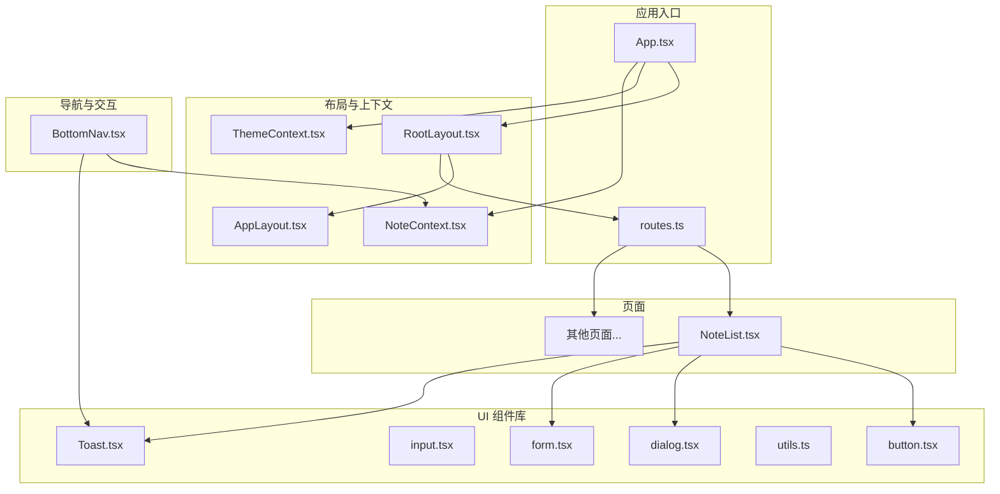
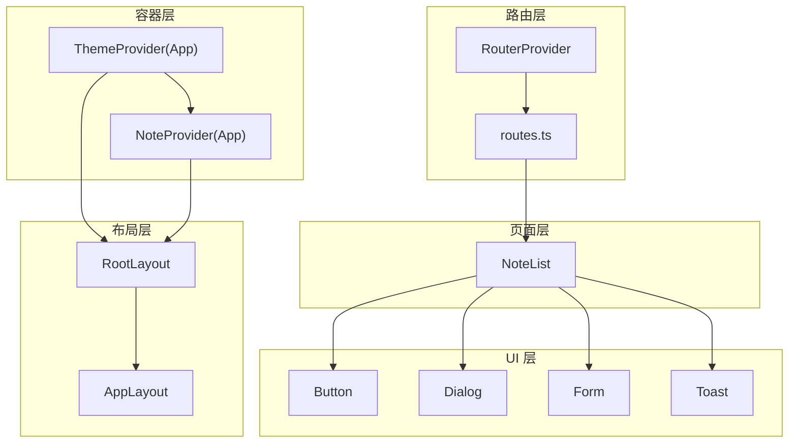
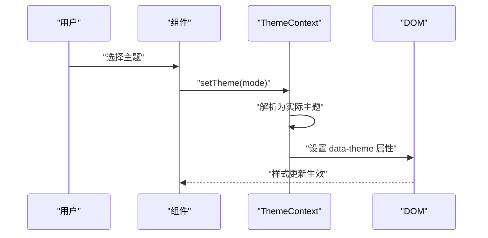
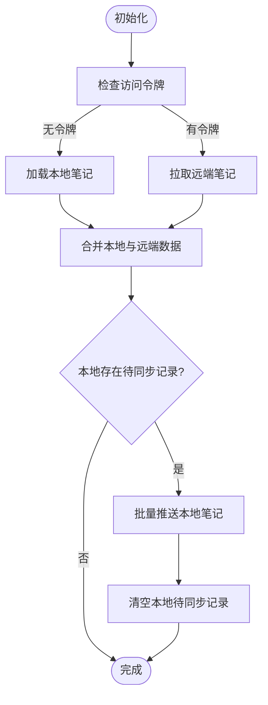
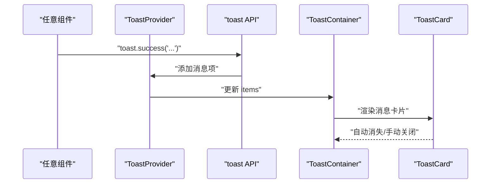
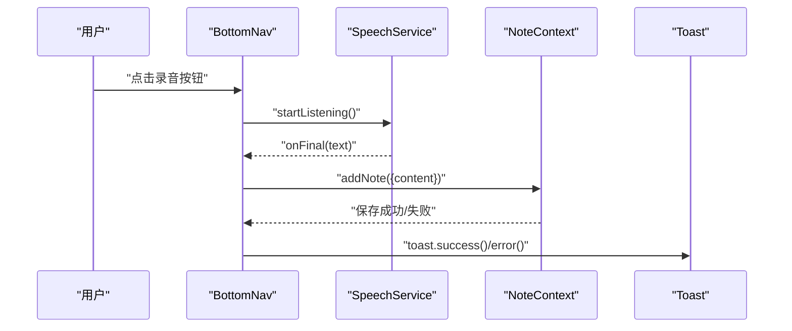
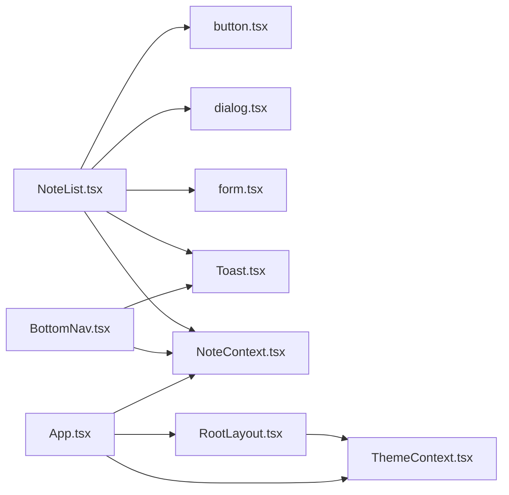

# 组件架构设计

<cite>
**本文引用的文件**
- [README.md](file://README.md)
- [App.tsx](file://src/app/App.tsx)
- [routes.ts](file://src/app/routes.ts)
- [ThemeContext.tsx](file://src/app/components/context/ThemeContext.tsx)
- [NoteContext.tsx](file://src/app/components/context/NoteContext.tsx)
- [Toast.tsx](file://src/app/components/ui/Toast.tsx)
- [RootLayout.tsx](file://src/app/components/RootLayout.tsx)
- [AppLayout.tsx](file://src/app/components/AppLayout.tsx)
- [BottomNav.tsx](file://src/app/components/BottomNav.tsx)
- [utils.ts](file://src/app/components/ui/utils.ts)
- [button.tsx](file://src/app/components/ui/button.tsx)
- [input.tsx](file://src/app/components/ui/input.tsx)
- [dialog.tsx](file://src/app/components/ui/dialog.tsx)
- [form.tsx](file://src/app/components/ui/form.tsx)
- [NoteList.tsx](file://src/app/pages/NoteList.tsx)
</cite>

## 目录
1. [引言](#引言)
2. [项目结构](#项目结构)
3. [核心组件](#核心组件)
4. [架构总览](#架构总览)
5. [详细组件分析](#详细组件分析)
6. [依赖分析](#依赖分析)
7. [性能考量](#性能考量)
8. [故障排查指南](#故障排查指南)
9. [结论](#结论)
10. [附录](#附录)

## 引言
本设计文档面向“Note-taking app”前端的组件化架构，目标是建立一套可复用、可组合、可扩展且具备良好可维护性的组件体系。文档从组件划分原则、通信模式与事件处理、UI 组件库组织、设计规范与继承/组合模式、生命周期与条件渲染、性能优化策略、测试与版本管理等方面进行系统阐述，并给出最佳实践与扩展建议。

## 项目结构
项目采用以功能域为中心的目录组织方式，结合 React Router 的路由分层与上下文提供者（Provider）实现状态与主题的全局注入。页面级组件位于 pages 目录，通用 UI 组件位于 components/ui，布局与上下文位于 components 下的对应子目录；服务层通过 services 提供 API 调用与业务能力封装。

图表来源
- [App.tsx:1-17](file://src/app/App.tsx#L1-L17)
- [routes.ts:1-61](file://src/app/routes.ts#L1-L61)
- [RootLayout.tsx:1-52](file://src/app/components/RootLayout.tsx#L1-L52)
- [AppLayout.tsx:1-15](file://src/app/components/AppLayout.tsx#L1-L15)
- [ThemeContext.tsx:1-110](file://src/app/components/context/ThemeContext.tsx#L1-L110)
- [NoteContext.tsx:1-356](file://src/app/components/context/NoteContext.tsx#L1-L356)
- [NoteList.tsx:1-800](file://src/app/pages/NoteList.tsx#L1-L800)
- [button.tsx:1-59](file://src/app/components/ui/button.tsx#L1-L59)
- [input.tsx:1-22](file://src/app/components/ui/input.tsx#L1-L22)
- [dialog.tsx:1-136](file://src/app/components/ui/dialog.tsx#L1-L136)
- [form.tsx:1-169](file://src/app/components/ui/form.tsx#L1-L169)
- [utils.ts:1-7](file://src/app/components/ui/utils.ts#L1-L7)
- [Toast.tsx:1-495](file://src/app/components/ui/Toast.tsx#L1-L495)
- [BottomNav.tsx:1-387](file://src/app/components/BottomNav.tsx#L1-L387)

章节来源
- [App.tsx:1-17](file://src/app/App.tsx#L1-L17)
- [routes.ts:1-61](file://src/app/routes.ts#L1-L61)

## 核心组件
- 应用根组件与路由：App.tsx 作为顶层容器，注入主题、笔记与全局 Toast 上下文，再由 RouterProvider 管理路由树。
- 布局组件：RootLayout 负责移动端 viewport 注入与主题色设置；AppLayout 在需要时提供笔记上下文。
- 主题上下文：ThemeContext 提供主题切换、系统偏好监听与持久化存储，支持暗/亮/系统三种模式。
- 笔记上下文：NoteContext 聚合本地与远端笔记数据，提供增删改查、合并去重、离线优先等能力。
- UI 组件库：基于 Radix UI 与 class-variance-authority，提供按钮、输入框、对话框、表单等基础组件。
- 导航与交互：BottomNav 提供底部导航、语音识别集成、未读数与动态菜单项控制。

章节来源
- [App.tsx:1-17](file://src/app/App.tsx#L1-L17)
- [RootLayout.tsx:1-52](file://src/app/components/RootLayout.tsx#L1-L52)
- [AppLayout.tsx:1-15](file://src/app/components/AppLayout.tsx#L1-L15)
- [ThemeContext.tsx:1-110](file://src/app/components/context/ThemeContext.tsx#L1-L110)
- [NoteContext.tsx:1-356](file://src/app/components/context/NoteContext.tsx#L1-L356)
- [button.tsx:1-59](file://src/app/components/ui/button.tsx#L1-L59)
- [input.tsx:1-22](file://src/app/components/ui/input.tsx#L1-L22)
- [dialog.tsx:1-136](file://src/app/components/ui/dialog.tsx#L1-L136)
- [form.tsx:1-169](file://src/app/components/ui/form.tsx#L1-L169)
- [BottomNav.tsx:1-387](file://src/app/components/BottomNav.tsx#L1-L387)

## 架构总览
应用采用“容器-展示”分离与“上下文-组件”解耦的设计。容器组件负责数据与状态管理（如 NoteContext），展示组件专注于 UI 表达（如 Button、Dialog）。路由层负责页面级容器的挂载，布局层负责全局样式与主题注入，UI 组件库提供一致的视觉与交互基元。

图表来源
- [App.tsx:1-17](file://src/app/App.tsx#L1-L17)
- [routes.ts:1-61](file://src/app/routes.ts#L1-L61)
- [RootLayout.tsx:1-52](file://src/app/components/RootLayout.tsx#L1-L52)
- [AppLayout.tsx:1-15](file://src/app/components/AppLayout.tsx#L1-L15)
- [NoteList.tsx:1-800](file://src/app/pages/NoteList.tsx#L1-L800)
- [button.tsx:1-59](file://src/app/components/ui/button.tsx#L1-L59)
- [dialog.tsx:1-136](file://src/app/components/ui/dialog.tsx#L1-L136)
- [form.tsx:1-169](file://src/app/components/ui/form.tsx#L1-L169)
- [Toast.tsx:1-495](file://src/app/components/ui/Toast.tsx#L1-L495)

## 详细组件分析

### 主题上下文（ThemeContext）
- 设计要点
  - 将主题状态与 DOM 切换解耦，通过 data-theme 属性与 CSS 变量驱动视觉变化。
  - 支持系统主题监听与本地持久化，保证 SSR/受限环境下的安全回退。
  - 提供轻量的回调式更新，避免不必要的重渲染。
- 生命周期
  - 首次挂载读取本地存储并解析系统偏好；随后在主题变更时重新应用。
  - 监听系统配色变化，当处于“系统”模式时动态刷新。
- 通信模式
  - 通过 React Context 向下提供 theme/isDark/setTheme，子组件通过 useTheme 访问。

图表来源
- [ThemeContext.tsx:63-105](file://src/app/components/context/ThemeContext.tsx#L63-L105)

章节来源
- [ThemeContext.tsx:1-110](file://src/app/components/context/ThemeContext.tsx#L1-L110)

### 笔记上下文（NoteContext）
- 设计要点
  - 合并本地与远端数据，使用 Map 去重与排序，确保一致性。
  - 支持离线优先：无 Token 时直接写入本地存储，Token 获取后异步同步至远端。
  - 规范化内容与标签，兼容多种输入格式，派生显示标题。
- 生命周期
  - 首次加载根据 Token 决定数据源；本地缓存与远端数据合并后统一管理。
- 通信模式
  - 通过 Context 暴露 addNote/deleteNote/updateNote/refreshNotes 等方法，页面组件通过 useNotes 使用。

图表来源
- [NoteContext.tsx:152-218](file://src/app/components/context/NoteContext.tsx#L152-L218)
- [NoteContext.tsx:191-210](file://src/app/components/context/NoteContext.tsx#L191-L210)

章节来源
- [NoteContext.tsx:1-356](file://src/app/components/context/NoteContext.tsx#L1-L356)

### UI 组件库（button、input、dialog、form）
- 设计规范
  - 基于 class-variance-authority 的变体系统，统一尺寸与风格。
  - 通过 cn 工具函数合并 Tailwind 类，保证可维护性与可组合性。
  - 对齐 Radix UI 的语义与无障碍属性，提升可访问性。
- 继承与组合
  - Button 支持 asChild 透传，便于与路由 Link 或原生元素组合。
  - Form 体系通过 FormProvider、FormField、useFormField 实现字段级状态管理与错误传播。
- 事件与 props
  - 所有组件接收原生 props 并透传，保持与 DOM 的一致性。
  - 通过 data-slot 标记内部节点，便于样式覆盖与测试选择器。

```mermaid
classDiagram
class Button {
+variant
+size
+asChild
+className
}
class Input {
+type
+className
}
class Dialog {
+Root
+Trigger
+Portal
+Overlay
+Content
+Header/Footer
+Title/Description
+Close
}
class Form {
+FormProvider
+FormField
+useFormField
+FormItem
+FormLabel
+FormControl
+FormDescription
+FormMessage
}
class Utils {
+cn(...)
}
Button --> Utils : "使用"
Input --> Utils : "使用"
Dialog --> Utils : "使用"
Form --> Utils : "使用"
```

图表来源
- [button.tsx:1-59](file://src/app/components/ui/button.tsx#L1-L59)
- [input.tsx:1-22](file://src/app/components/ui/input.tsx#L1-L22)
- [dialog.tsx:1-136](file://src/app/components/ui/dialog.tsx#L1-L136)
- [form.tsx:1-169](file://src/app/components/ui/form.tsx#L1-L169)
- [utils.ts:1-7](file://src/app/components/ui/utils.ts#L1-L7)

章节来源
- [button.tsx:1-59](file://src/app/components/ui/button.tsx#L1-L59)
- [input.tsx:1-22](file://src/app/components/ui/input.tsx#L1-L22)
- [dialog.tsx:1-136](file://src/app/components/ui/dialog.tsx#L1-L136)
- [form.tsx:1-169](file://src/app/components/ui/form.tsx#L1-L169)
- [utils.ts:1-7](file://src/app/components/ui/utils.ts#L1-L7)

### 全局 Toast 通知系统（Toast）
- 设计要点
  - 单例调度器，集中管理消息队列与动画生命周期。
  - 16 种类型配置，支持动作按钮、倒计时进度条、特殊动效（如成就闪钻、爱心跳动）。
  - 通过 CSS 动画与 Motion 原子组件实现流畅入场/出场与交互反馈。
- 通信模式
  - 通过 ToastProvider 注入上下文，任意组件可通过 toast.* 触发消息。
- 条件渲染与性能
  - 限制同时展示数量，使用 AnimatePresence 控制列表渲染，避免过度重排。

图表来源
- [Toast.tsx:458-478](file://src/app/components/ui/Toast.tsx#L458-L478)
- [Toast.tsx:107-126](file://src/app/components/ui/Toast.tsx#L107-L126)
- [Toast.tsx:434-451](file://src/app/components/ui/Toast.tsx#L434-L451)

章节来源
- [Toast.tsx:1-495](file://src/app/components/ui/Toast.tsx#L1-L495)

### 底部导航（BottomNav）
- 设计要点
  - 动态菜单项（受特性开关影响），支持未读数徽标与录音状态气泡。
  - 集成语音服务，支持开始/停止录音与结果处理，支持直接保存为笔记或回调上层。
- 事件与通信
  - 录音状态通过 ref 与回调管理；最终文本通过 onVoiceResult 回调或直接调用 addNote。
  - 通过 useNotes 与 toast 进行状态与提示联动。

图表来源
- [BottomNav.tsx:135-215](file://src/app/components/BottomNav.tsx#L135-L215)
- [BottomNav.tsx:192-204](file://src/app/components/BottomNav.tsx#L192-L204)
- [NoteContext.tsx:224-272](file://src/app/components/context/NoteContext.tsx#L224-L272)

章节来源
- [BottomNav.tsx:1-387](file://src/app/components/BottomNav.tsx#L1-L387)
- [NoteContext.tsx:1-356](file://src/app/components/context/NoteContext.tsx#L1-L356)

### 页面示例：笔记列表（NoteList）
- 设计要点
  - 复合组件：卡片内嵌富文本预览、脑图缩略图、标签云与时间戳。
  - 条件渲染：根据内容类型与结构化数据动态决定渲染路径。
  - 性能优化：使用 useMemo 缓存过滤结果，Masonry 响应式瀑布流布局。
- 事件与 props
  - 通过 onClick/onTagClick 与父级交互，支持标签筛选与跳转详情。

章节来源
- [NoteList.tsx:1-800](file://src/app/pages/NoteList.tsx#L1-L800)

## 依赖分析
- 组件耦合
  - 页面与 UI 组件：弱耦合，通过 props 与事件交互。
  - 页面与上下文：强耦合，页面通过 hooks 访问上下文提供的状态与方法。
  - 上下文与服务：上下文依赖服务进行数据持久化与网络请求。
- 外部依赖
  - Radix UI：用于可访问性与语义化组件。
  - class-variance-authority：用于变体样式组合。
  - motion/react：用于流畅动画与过渡。
  - react-responsive-masonry：用于响应式瀑布流布局。

图表来源
- [NoteList.tsx:1-800](file://src/app/pages/NoteList.tsx#L1-L800)
- [button.tsx:1-59](file://src/app/components/ui/button.tsx#L1-L59)
- [dialog.tsx:1-136](file://src/app/components/ui/dialog.tsx#L1-L136)
- [form.tsx:1-169](file://src/app/components/ui/form.tsx#L1-L169)
- [Toast.tsx:1-495](file://src/app/components/ui/Toast.tsx#L1-L495)
- [NoteContext.tsx:1-356](file://src/app/components/context/NoteContext.tsx#L1-L356)
- [BottomNav.tsx:1-387](file://src/app/components/BottomNav.tsx#L1-L387)
- [RootLayout.tsx:1-52](file://src/app/components/RootLayout.tsx#L1-L52)
- [ThemeContext.tsx:1-110](file://src/app/components/context/ThemeContext.tsx#L1-L110)
- [App.tsx:1-17](file://src/app/App.tsx#L1-L17)

章节来源
- [App.tsx:1-17](file://src/app/App.tsx#L1-L17)
- [routes.ts:1-61](file://src/app/routes.ts#L1-L61)

## 性能考量
- 渲染优化
  - 使用 useMemo/memo 缓存计算结果，减少重复渲染（如过滤、统计）。
  - 列表渲染使用动画框架的批量渲染与退出动画，避免抖动。
- 数据流优化
  - 上下文层仅暴露必要方法与状态，避免深层订阅导致的全量重渲染。
  - 本地与远端数据合并时使用 Map 去重与排序，降低复杂度。
- 资源与体积
  - UI 组件库采用按需引入与变体裁剪，减少打包体积。
  - 图片与富文本预览在卡片内按需解析，避免全量 DOM 解析。

[本节为通用指导，无需特定文件引用]

## 故障排查指南
- 主题切换无效
  - 检查 data-theme 设置是否被覆盖；确认系统主题监听事件是否注册。
- 笔记无法同步
  - 确认访问令牌是否存在；查看本地待同步记录是否堆积。
- Toast 不显示
  - 确认 ToastProvider 是否包裹在根组件之下；检查消息队列与自动消失逻辑。
- 录音异常
  - 检查浏览器权限与设备可用性；确认回调与 ref 状态是否正确清理。

章节来源
- [ThemeContext.tsx:51-61](file://src/app/components/context/ThemeContext.tsx#L51-L61)
- [NoteContext.tsx:191-210](file://src/app/components/context/NoteContext.tsx#L191-L210)
- [Toast.tsx:458-478](file://src/app/components/ui/Toast.tsx#L458-L478)
- [BottomNav.tsx:135-215](file://src/app/components/BottomNav.tsx#L135-L215)

## 结论
该组件架构以“上下文-容器-展示”为核心，结合 UI 组件库与路由层，实现了主题、状态与页面的清晰分层。通过变体系统与工具函数统一样式与类名，借助动画与响应式布局提升交互体验。建议在后续迭代中进一步完善组件测试与文档规范，强化类型约束与错误边界，持续优化首屏与长列表性能。

[本节为总结性内容，无需特定文件引用]

## 附录
- 组件划分原则
  - 可复用组件：UI 基础组件（Button、Input、Dialog、Form）。
  - 复合组件：页面级容器（NoteList、BottomNav），聚合多个基础组件与上下文。
  - 容器组件：上下文提供者（ThemeContext、NoteContext）与布局容器（RootLayout、AppLayout）。
- 通信与事件
  - Props 自顶向下传递；事件通过回调向上冒泡；上下文跨层级共享状态。
- 测试策略
  - 单元测试：针对上下文与工具函数；快照测试：UI 组件渲染一致性。
  - 集成测试：页面容器与上下文协作；端到端测试：关键流程（新建、保存、同步）。
- 版本管理
  - 组件版本与 UI 库版本解耦；通过变更日志与语义化版本管理发布节奏。
- 最佳实践
  - 明确职责边界，避免跨层依赖；使用 data-slot 与 className 命名规范；保持 props 稳定性与向后兼容。

[本节为通用指导，无需特定文件引用]