# 路由系统架构

<cite>
**本文档引用的文件**
- [src/app/routes.ts](file://src/app/routes.ts)
- [src/app/App.tsx](file://src/app/App.tsx)
- [src/main.tsx](file://src/main.tsx)
- [src/app/components/RootLayout.tsx](file://src/app/components/RootLayout.tsx)
- [src/app/pages/NoteList.tsx](file://src/app/pages/NoteList.tsx)
- [src/app/pages/NoteCreate.tsx](file://src/app/pages/NoteCreate.tsx)
- [src/app/pages/HiBrain.tsx](file://src/app/pages/HiBrain.tsx)
- [src/app/pages/DocumentDetail.tsx](file://src/app/pages/DocumentDetail.tsx)
- [src/app/pages/UserProfile.tsx](file://src/app/pages/UserProfile.tsx)
- [src/app/utils/featureFlags.ts](file://src/app/utils/featureFlags.ts)
- [src/app/components/ui/breadcrumb.tsx](file://src/app/components/ui/breadcrumb.tsx)
- [src/app/pages/Auth.tsx](file://src/app/pages/Auth.tsx)
- [src/app/pages/Splash.tsx](file://src/app/pages/Splash.tsx)
</cite>

## 目录
1. [简介](#简介)
2. [项目结构](#项目结构)
3. [核心组件](#核心组件)
4. [架构概览](#架构概览)
5. [详细组件分析](#详细组件分析)
6. [依赖分析](#依赖分析)
7. [性能考虑](#性能考虑)
8. [故障排除指南](#故障排除指南)
9. [结论](#结论)
10. [附录](#附录)

## 简介

本项目采用 React Router 6 的现代化路由系统，构建了一个功能完整的笔记应用。该路由系统实现了完整的嵌套路由、动态路由参数、条件路由等功能，并集成了移动端适配、SEO 优化和性能优化策略。

## 项目结构

项目采用模块化的路由架构，主要包含以下层次：

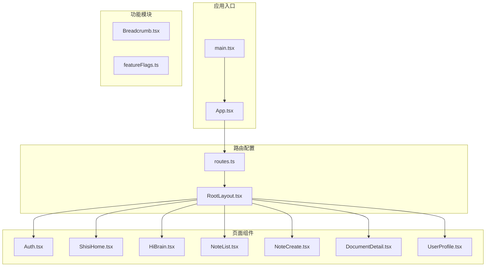

**图表来源**
- [src/main.tsx:1-7](file://src/main.tsx#L1-L7)
- [src/app/App.tsx:1-17](file://src/app/App.tsx#L1-L17)
- [src/app/routes.ts:1-61](file://src/app/routes.ts#L1-L61)

**章节来源**
- [src/main.tsx:1-7](file://src/main.tsx#L1-L7)
- [src/app/App.tsx:1-17](file://src/app/App.tsx#L1-L17)
- [src/app/routes.ts:1-61](file://src/app/routes.ts#L1-L61)

## 核心组件

### 路由配置系统

项目使用 `createBrowserRouter` 创建了统一的路由配置，支持嵌套路由和动态路由参数：

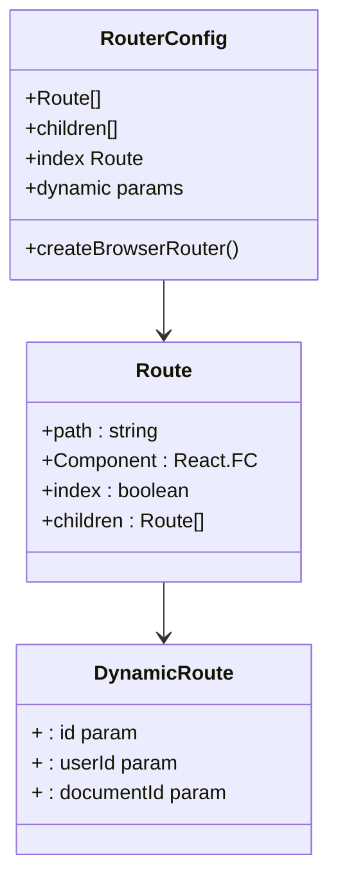

**图表来源**
- [src/app/routes.ts:26-60](file://src/app/routes.ts#L26-L60)

### 布局系统

RootLayout 提供了全局布局和移动端适配功能：

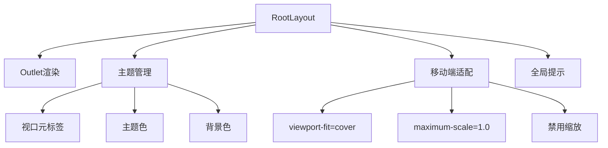

**图表来源**
- [src/app/components/RootLayout.tsx:10-51](file://src/app/components/RootLayout.tsx#L10-L51)

**章节来源**
- [src/app/routes.ts:26-60](file://src/app/routes.ts#L26-L60)
- [src/app/components/RootLayout.tsx:10-51](file://src/app/components/RootLayout.tsx#L10-L51)

## 架构概览

### 路由层次结构

项目采用两级路由架构：

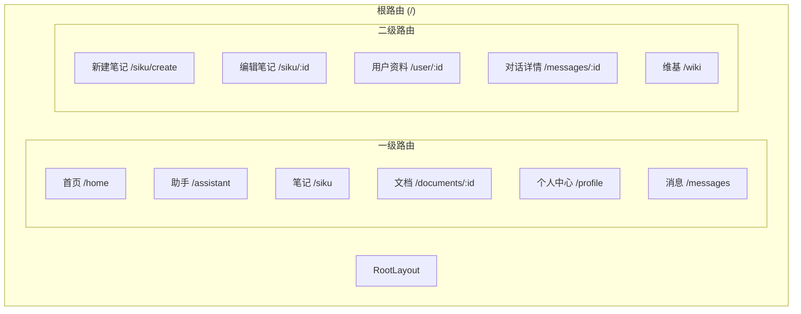

**图表来源**
- [src/app/routes.ts:26-60](file://src/app/routes.ts#L26-L60)

### 动态路由参数

系统支持多种动态路由参数模式：

| 路由模式 | 参数示例 | 使用场景 | 实现方式 |
|---------|---------|---------|---------|
| 路径参数 | `/siku/:id` | 笔记编辑/查看 | useParams() |
| 查询参数 | `/siku?tab=recent` | 笔记筛选 | useSearchParams() |
| 嵌套路由 | `/user/:id/profile` | 用户资料页 | 嵌套 Route |
| 条件路由 | `/wiki` | 功能开关 | featureFlags |

**章节来源**
- [src/app/routes.ts:39-40](file://src/app/routes.ts#L39-L40)
- [src/app/routes.ts:44](file://src/app/routes.ts#L44)
- [src/app/routes.ts:45](file://src/app/routes.ts#L45)

## 详细组件分析

### 页面组件路由集成

#### 笔记列表组件

NoteList 组件展示了路由参数传递和导航的实际应用：

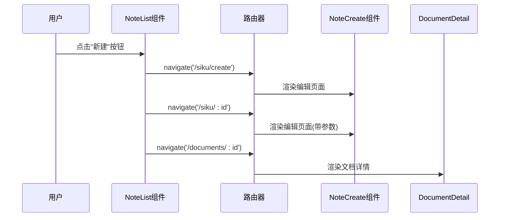

**图表来源**
- [src/app/pages/NoteList.tsx:384-386](file://src/app/pages/NoteList.tsx#L384-L386)
- [src/app/pages/NoteList.tsx:682](file://src/app/pages/NoteList.tsx#L682)
- [src/app/pages/NoteList.tsx:713](file://src/app/pages/NoteList.tsx#L713)

#### 笔记编辑组件

NoteCreate 组件演示了动态路由参数的使用：

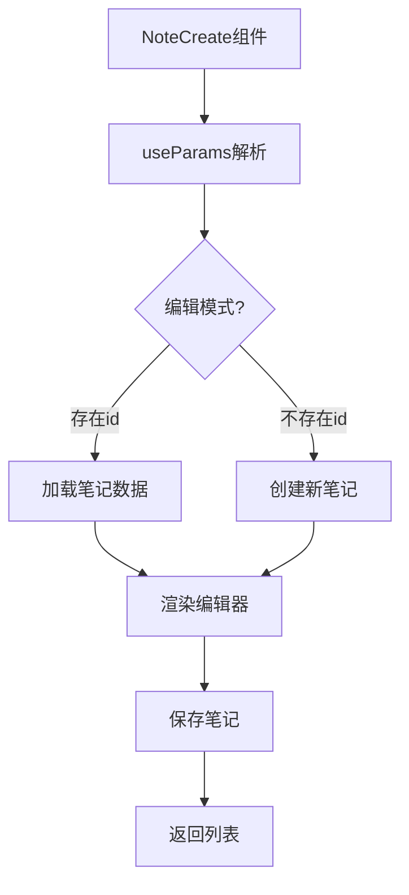

**图表来源**
- [src/app/pages/NoteCreate.tsx:8](file://src/app/pages/NoteCreate.tsx#L8)

**章节来源**
- [src/app/pages/NoteList.tsx:384-386](file://src/app/pages/NoteList.tsx#L384-L386)
- [src/app/pages/NoteList.tsx:682](file://src/app/pages/NoteList.tsx#L682)
- [src/app/pages/NoteList.tsx:713](file://src/app/pages/NoteList.tsx#L713)
- [src/app/pages/NoteCreate.tsx:8](file://src/app/pages/NoteCreate.tsx#L8)

### 路由守卫实现

#### 认证守卫

项目实现了基于本地存储的认证守卫：

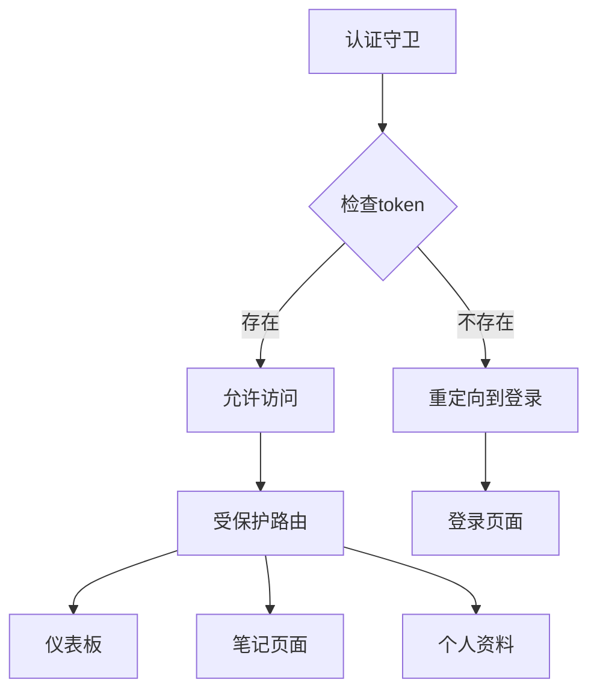

**图表来源**
- [src/app/pages/Auth.tsx:477-481](file://src/app/pages/Auth.tsx#L477-L481)
- [src/app/pages/HiBrain.tsx:997-999](file://src/app/pages/HiBrain.tsx#L997-L999)

#### 功能开关路由

系统支持基于环境变量的功能开关：

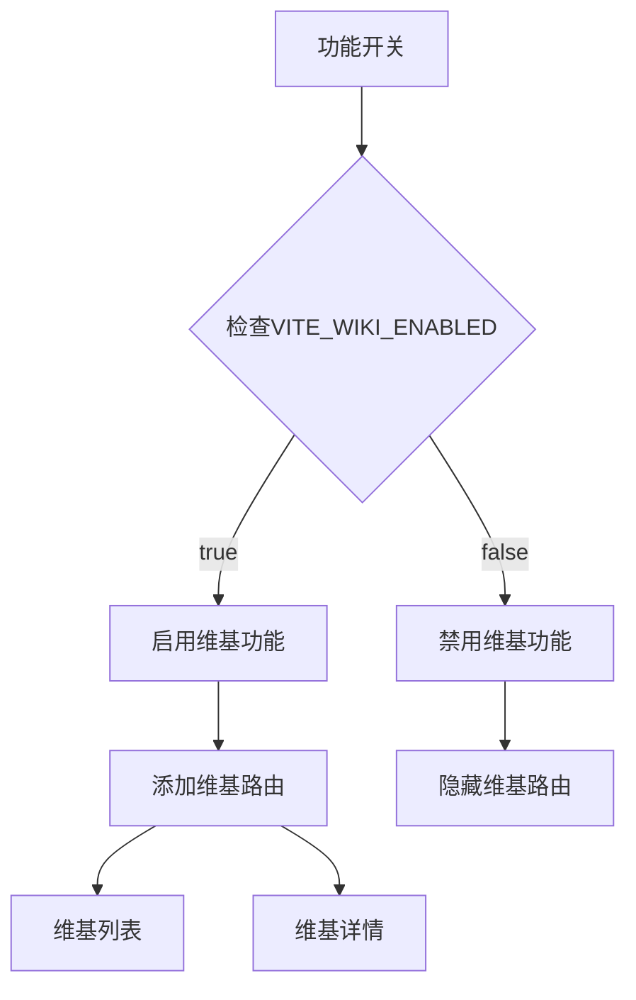

**图表来源**
- [src/app/utils/featureFlags.ts:7-13](file://src/app/utils/featureFlags.ts#L7-L13)
- [src/app/routes.ts:49-52](file://src/app/routes.ts#L49-L52)

**章节来源**
- [src/app/pages/Auth.tsx:477-481](file://src/app/pages/Auth.tsx#L477-L481)
- [src/app/pages/HiBrain.tsx:997-999](file://src/app/pages/HiBrain.tsx#L997-L999)
- [src/app/utils/featureFlags.ts:7-13](file://src/app/utils/featureFlags.ts#L7-L13)
- [src/app/routes.ts:49-52](file://src/app/routes.ts#L49-L52)

### 面包屑导航

项目实现了响应式的面包屑导航系统：

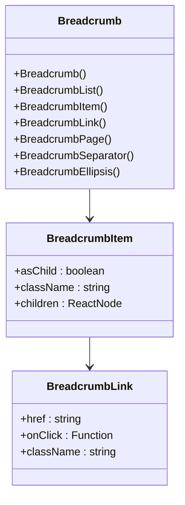

**图表来源**
- [src/app/components/ui/breadcrumb.tsx:7-110](file://src/app/components/ui/breadcrumb.tsx#L7-L110)

**章节来源**
- [src/app/components/ui/breadcrumb.tsx:7-110](file://src/app/components/ui/breadcrumb.tsx#L7-L110)

## 依赖分析

### 组件耦合关系

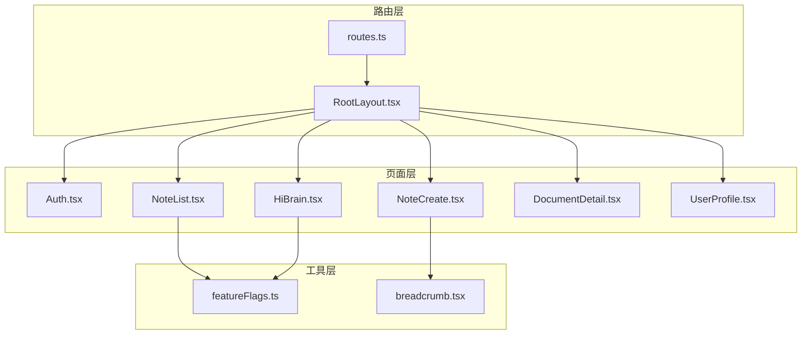

**图表来源**
- [src/app/routes.ts:26-60](file://src/app/routes.ts#L26-L60)
- [src/app/utils/featureFlags.ts:7-13](file://src/app/utils/featureFlags.ts#L7-L13)

### 外部依赖

项目主要依赖以下外部库：

| 依赖库 | 版本 | 用途 |
|-------|------|------|
| react-router | 最新版 | 路由管理 |
| lucide-react | 最新版 | 图标组件 |
| motion/react | 最新版 | 动画效果 |
| @radix-ui/react-slot | 最新版 | 组件组合 |

**章节来源**
- [src/app/routes.ts:1-22](file://src/app/routes.ts#L1-L22)
- [src/app/pages/NoteList.tsx:6-10](file://src/app/pages/NoteList.tsx#L6-L10)

## 性能考虑

### 路由性能优化

1. **懒加载策略**：虽然当前实现使用静态导入，但项目结构已为懒加载做好准备
2. **条件渲染**：基于功能开关的路由条件渲染
3. **移动端优化**：根布局中的视口适配和主题切换优化

### 导航性能

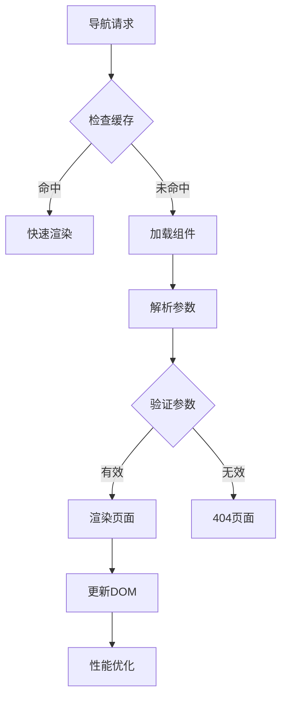

**图表来源**
- [src/app/pages/DocumentDetail.tsx:171-200](file://src/app/pages/DocumentDetail.tsx#L171-L200)

## 故障排除指南

### 常见路由问题

1. **路由不生效**：检查路由配置中的路径是否正确
2. **参数获取失败**：确认使用 `useParams` 获取参数
3. **导航异常**：验证 `useNavigate` 的使用方式
4. **样式冲突**：检查根布局中的样式覆盖

### 调试技巧

**章节来源**
- [src/app/pages/DocumentDetail.tsx:171-200](file://src/app/pages/DocumentDetail.tsx#L171-L200)

## 结论

本项目的路由系统架构体现了现代化 React 应用的最佳实践，具有以下特点：

1. **模块化设计**：清晰的路由层次结构和组件分离
2. **功能完整性**：支持嵌套路由、动态参数、条件路由
3. **性能优化**：移动端适配和条件渲染优化
4. **可扩展性**：基于功能开关的灵活扩展机制

## 附录

### 路由配置最佳实践

1. **路由分层**：合理设计路由层级，避免过深的嵌套
2. **参数命名**：使用语义化的路由参数名称
3. **错误处理**：实现统一的404页面和错误处理
4. **SEO优化**：为重要页面配置合适的标题和描述

### 移动端适配

项目通过根布局实现了全面的移动端适配：

- 视口元标签配置
- 主题色动态切换
- 禁用缩放功能
- 响应式布局支持