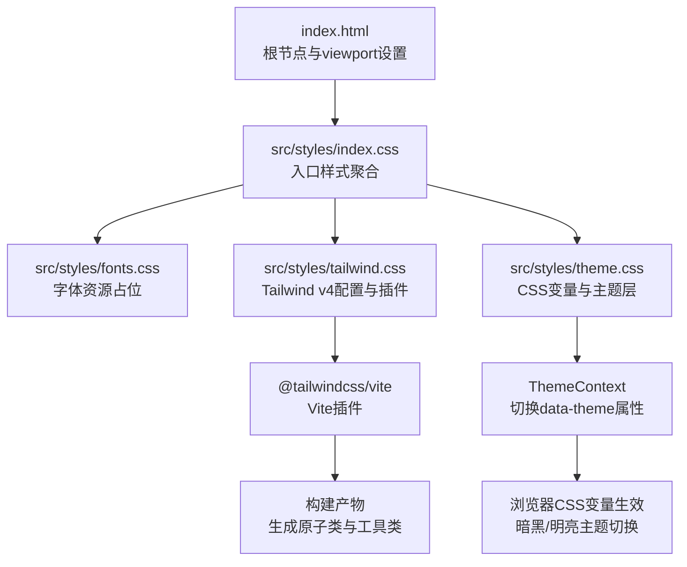
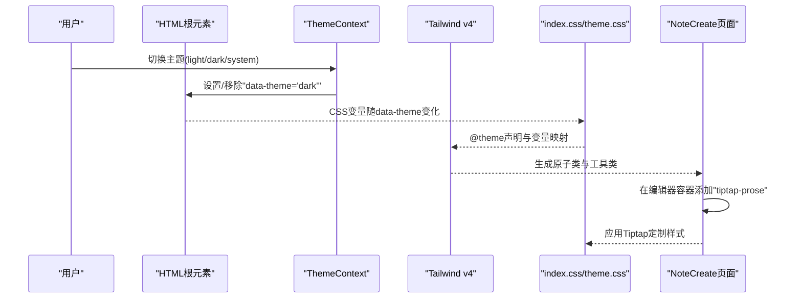
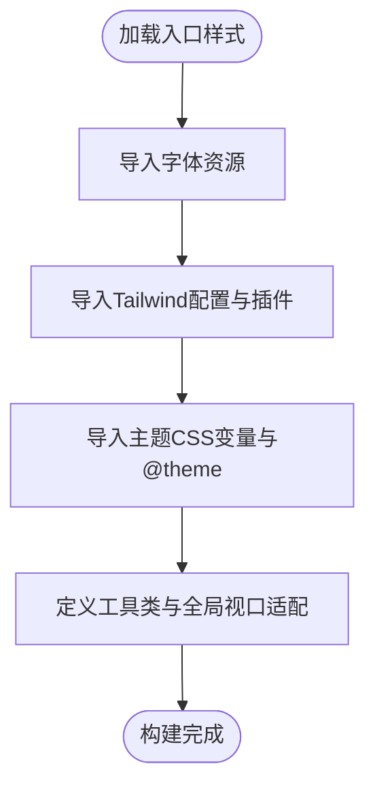
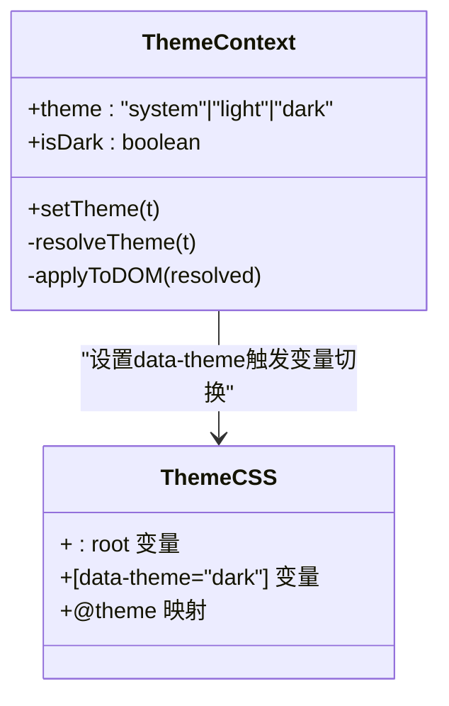
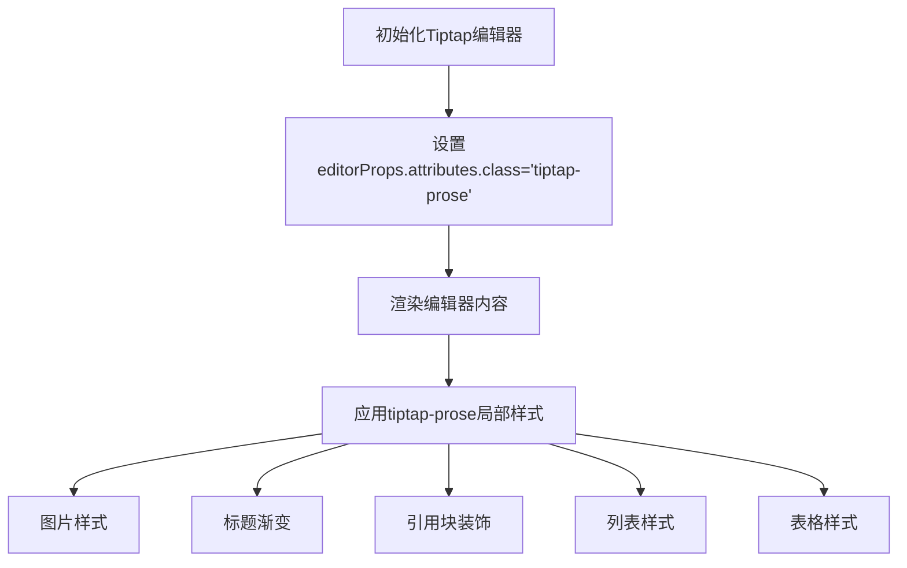
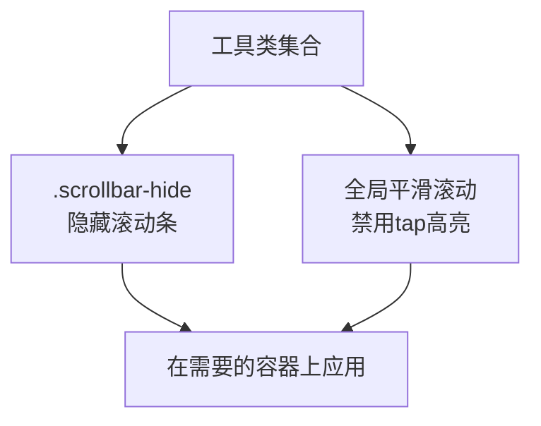
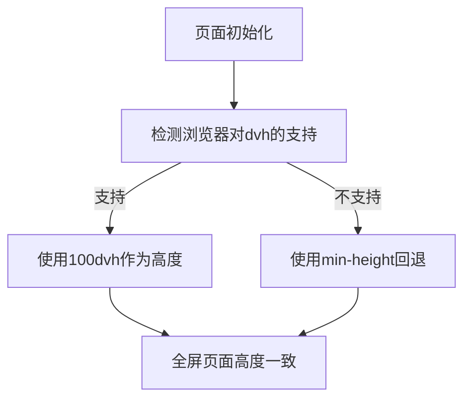
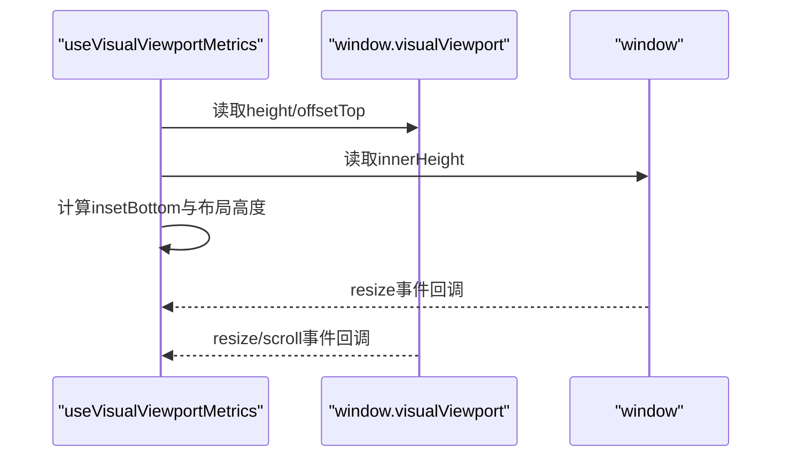
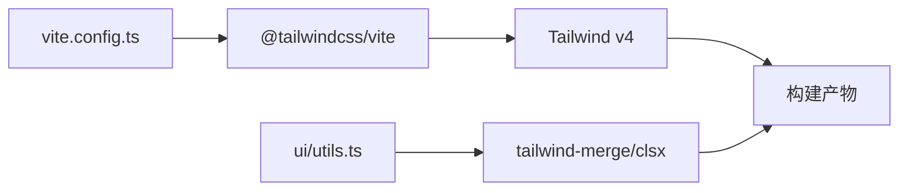

# CSS架构设计

<cite>
**本文档引用的文件**
- [src/styles/index.css](file://src/styles/index.css)
- [src/styles/tailwind.css](file://src/styles/tailwind.css)
- [src/styles/theme.css](file://src/styles/theme.css)
- [src/styles/fonts.css](file://src/styles/fonts.css)
- [postcss.config.mjs](file://postcss.config.mjs)
- [vite.config.ts](file://vite.config.ts)
- [src/app/pages/NoteCreate.tsx](file://src/app/pages/NoteCreate.tsx)
- [src/app/components/context/ThemeContext.tsx](file://src/app/components/context/ThemeContext.tsx)
- [src/app/components/ui/utils.ts](file://src/app/components/ui/utils.ts)
- [src/app/components/ui/use-visual-viewport.ts](file://src/app/components/ui/use-visual-viewport.ts)
- [index.html](file://index.html)
- [package.json](file://package.json)
</cite>

## 目录
1. [简介](#简介)
2. [项目结构](#项目结构)
3. [核心组件](#核心组件)
4. [架构总览](#架构总览)
5. [详细组件分析](#详细组件分析)
6. [依赖关系分析](#依赖关系分析)
7. [性能考量](#性能考量)
8. [故障排查指南](#故障排查指南)
9. [结论](#结论)
10. [附录](#附录)

## 简介
本文件系统性梳理该笔记应用前端的CSS架构设计，重点覆盖以下方面：
- 样式文件的导入顺序与模块化策略
- 全局样式设计理念与移动端优化（视口适配、滚动条隐藏、全屏页面处理）
- Tiptap富文本编辑器的样式定制（标题渐变、引用块、列表、表格）
- CSS工具类设计（滚动隐藏、平滑滚动、触摸高亮）
- 样式调试技巧与浏览器兼容性处理
- 性能优化建议与最佳实践

## 项目结构
该项目采用“入口样式聚合 + Tailwind v4 + 主题变量 + 组件级样式”的分层组织方式：
- 入口聚合：通过入口样式文件集中导入字体、Tailwind、主题等基础层
- 基础层：Tailwind v4自动扫描源码生成原子类；主题变量定义语义化颜色与尺寸
- 组件层：针对特定组件（如Tiptap编辑器）进行局部样式增强
- 工具层：通用工具类（滚动隐藏、平滑滚动、触摸高亮）

图表来源
- [index.html:1-15](file://index.html#L1-L15)
- [src/styles/index.css:1-4](file://src/styles/index.css#L1-L4)
- [src/styles/tailwind.css:1-7](file://src/styles/tailwind.css#L1-L7)
- [src/styles/theme.css:1-280](file://src/styles/theme.css#L1-L280)
- [vite.config.ts:1-44](file://vite.config.ts#L1-L44)

章节来源
- [src/styles/index.css:1-4](file://src/styles/index.css#L1-L4)
- [src/styles/tailwind.css:1-7](file://src/styles/tailwind.css#L1-L7)
- [src/styles/theme.css:1-280](file://src/styles/theme.css#L1-L280)
- [index.html:1-15](file://index.html#L1-L15)
- [vite.config.ts:1-44](file://vite.config.ts#L1-L44)

## 核心组件
- 样式入口聚合：负责导入字体、Tailwind、主题，并定义通用工具类与全局视口/滚动优化
- Tailwind v4：通过Vite插件自动扫描源码，生成原子类与工具类，减少手写样式
- 主题系统：基于CSS自定义属性与@theme声明，提供明/暗两套语义令牌，并通过data-theme控制切换
- Tiptap编辑器样式：在编辑器内容容器上挂载“tiptap-prose”类，实现标题渐变、引用块、列表、表格等定制
- 视口与滚动工具：动态视口高度适配、滚动条隐藏、平滑滚动与触摸高亮

章节来源
- [src/styles/index.css:5-229](file://src/styles/index.css#L5-L229)
- [src/styles/tailwind.css:1-7](file://src/styles/tailwind.css#L1-L7)
- [src/styles/theme.css:1-280](file://src/styles/theme.css#L1-L280)
- [src/app/pages/NoteCreate.tsx:1120-1122](file://src/app/pages/NoteCreate.tsx#L1120-L1122)

## 架构总览
整体流程：入口样式文件在构建时被Tailwind v4扫描，生成原子类；主题变量随data-theme变化生效；组件通过类名组合原子类与局部样式。

图表来源
- [src/app/components/context/ThemeContext.tsx:50-61](file://src/app/components/context/ThemeContext.tsx#L50-L61)
- [src/styles/theme.css:183-222](file://src/styles/theme.css#L183-L222)
- [src/styles/index.css:58-229](file://src/styles/index.css#L58-L229)
- [src/app/pages/NoteCreate.tsx:1120-1122](file://src/app/pages/NoteCreate.tsx#L1120-L1122)

## 详细组件分析

### 样式入口与模块化策略
- 导入顺序：字体 → Tailwind → 主题，确保字体可用、原子类优先、主题变量最后注入
- 工具类：提供滚动隐藏、平滑滚动与触摸高亮，避免影响业务样式
- 全局视口适配：针对旧版iOS与Android Chrome的视口差异，采用min-height与dvh回退策略，并对Tailwind的h-screen进行覆盖

图表来源
- [src/styles/index.css:1-4](file://src/styles/index.css#L1-L4)
- [src/styles/index.css:5-47](file://src/styles/index.css#L5-L47)
- [src/styles/tailwind.css:1-7](file://src/styles/tailwind.css#L1-L7)
- [src/styles/theme.css:183-222](file://src/styles/theme.css#L183-L222)

章节来源
- [src/styles/index.css:1-47](file://src/styles/index.css#L1-L47)
- [src/styles/tailwind.css:1-7](file://src/styles/tailwind.css#L1-L7)
- [src/styles/theme.css:183-222](file://src/styles/theme.css#L183-L222)

### 主题系统与暗黑模式
- CSS变量：在:root与[data-theme="dark"]下分别定义明/暗两套语义令牌
- @theme声明：将CSS变量映射为Tailwind可识别的语义变量，保证原子类与主题一致
- 切换机制：ThemeContext在DOM根元素设置data-theme，配合CSS变量即时生效

图表来源
- [src/app/components/context/ThemeContext.tsx:50-61](file://src/app/components/context/ThemeContext.tsx#L50-L61)
- [src/styles/theme.css:1-280](file://src/styles/theme.css#L1-L280)

章节来源
- [src/app/components/context/ThemeContext.tsx:1-110](file://src/app/components/context/ThemeContext.tsx#L1-L110)
- [src/styles/theme.css:1-280](file://src/styles/theme.css#L1-L280)

### Tiptap富文本编辑器样式定制
- 容器类：在编辑器初始化时为内容容器添加“tiptap-prose”，使局部样式生效
- 图片：限制最大宽度、自动高度、圆角与间距
- 标题：H1/H2/H3应用渐变文字效果
- 引用块：渐变左侧边框、淡色背景、顶部装饰引号、斜体段落
- 列表：恢复无序/有序列表样式，使用渐变圆点与数字
- 表格：圆角边框、紫色表头、交替行色、选中单元格高亮

图表来源
- [src/app/pages/NoteCreate.tsx:1120-1122](file://src/app/pages/NoteCreate.tsx#L1120-L1122)
- [src/app/pages/NoteCreate.tsx:1150-1170](file://src/app/pages/NoteCreate.tsx#L1150-L1170)
- [src/styles/index.css:50-229](file://src/styles/index.css#L50-L229)

章节来源
- [src/app/pages/NoteCreate.tsx:1120-1170](file://src/app/pages/NoteCreate.tsx#L1120-L1170)
- [src/styles/index.css:50-229](file://src/styles/index.css#L50-L229)

### CSS工具类设计
- 滚动隐藏：通过-webkit-scrollbar:none与-ms-overflow-style实现滚动条隐藏
- 平滑滚动：全局禁用tap高亮，提升触摸体验
- 触摸高亮：通过全局规则透明化触摸高亮颜色

图表来源
- [src/styles/index.css:5-17](file://src/styles/index.css#L5-L17)

章节来源
- [src/styles/index.css:5-17](file://src/styles/index.css#L5-L17)

### 移动端优化与视口适配
- 视口适配：针对Android Chrome与旧版iOS的视口差异，采用min-height与dvh回退策略
- 全屏页面：对html/body/#root设置高度与min-height，必要时使用100dvh
- Tailwind h-screen覆盖：将h-screen替换为100dvh，避免浏览器地址栏显示导致的留白

图表来源
- [src/styles/index.css:19-47](file://src/styles/index.css#L19-L47)

章节来源
- [src/styles/index.css:19-47](file://src/styles/index.css#L19-L47)

### 动态视口监听与布局适配
- 使用useVisualViewportMetrics读取layoutHeight、visualHeight、offsetTop、insetBottom等指标
- 监听window与visualViewport的resize与scroll事件，动态计算底部安全区域

图表来源
- [src/app/components/ui/use-visual-viewport.ts:11-38](file://src/app/components/ui/use-visual-viewport.ts#L11-L38)

章节来源
- [src/app/components/ui/use-visual-viewport.ts:1-72](file://src/app/components/ui/use-visual-viewport.ts#L1-L72)

## 依赖关系分析
- 构建链路：Vite通过@tailwindcss/vite插件集成Tailwind v4，无需手动引入tailwindcss/autoprefixer
- 插件生态：tailwindcss与@tailwindcss/typography由Tailwind v4自动管理；tw-animate-css用于动画类
- 类名合并：ui/utils.ts使用tailwind-merge与clsx合并类名，避免冲突与重复

图表来源
- [vite.config.ts:1-44](file://vite.config.ts#L1-L44)
- [src/app/components/ui/utils.ts:1-7](file://src/app/components/ui/utils.ts#L1-L7)
- [package.json:85-91](file://package.json#L85-L91)

章节来源
- [vite.config.ts:1-44](file://vite.config.ts#L1-L44)
- [src/app/components/ui/utils.ts:1-7](file://src/app/components/ui/utils.ts#L1-L7)
- [package.json:85-91](file://package.json#L85-L91)

## 性能考量
- 原子类优先：通过Tailwind v4自动生成原子类，减少手写样式体积与重复
- 变量驱动：主题通过CSS变量与@theme声明，避免多份主题样式重复生成
- 局部样式：Tiptap定制样式限定在tiptap-prose作用域，降低全局污染
- 工具类复用：滚动隐藏、平滑滚动等通用工具类减少重复定义
- 依赖预打包：Vite配置中对React、motion、tiptap等包进行预打包，减少运行时解析成本

章节来源
- [src/styles/index.css:5-47](file://src/styles/index.css#L5-L47)
- [src/styles/theme.css:183-222](file://src/styles/theme.css#L183-L222)
- [vite.config.ts:27-41](file://vite.config.ts#L27-L41)

## 故障排查指南
- 样式未生效
  - 检查入口样式是否正确导入（fonts/tailwind/theme）
  - 确认Tiptap编辑器容器是否包含“tiptap-prose”
  - 核对data-theme是否正确设置于<html>元素
- 视口异常
  - 确认浏览器支持dvh；若不支持，检查min-height回退逻辑是否生效
  - 检查h-screen是否被覆盖为100dvh
- 滚动条问题
  - 检查是否在容器上应用“.scrollbar-hide”
  - 确认浏览器前缀兼容性（-webkit-scrollbar与-ms-overflow-style）
- 动画或过渡异常
  - 检查tw-animate-css插件是否正确启用
  - 确认类名拼写与tailwind-merge合并结果

章节来源
- [src/styles/index.css:1-4](file://src/styles/index.css#L1-L4)
- [src/styles/index.css:58-229](file://src/styles/index.css#L58-L229)
- [src/app/pages/NoteCreate.tsx:1120-1122](file://src/app/pages/NoteCreate.tsx#L1120-L1122)
- [src/app/components/context/ThemeContext.tsx:50-61](file://src/app/components/context/ThemeContext.tsx#L50-L61)

## 结论
该CSS架构以“入口聚合 + Tailwind v4 + 主题变量 + 局部定制”为核心，实现了：
- 清晰的模块化与可维护性
- 跨平台的视口适配与全屏页面一致性
- 面向组件的样式扩展（Tiptap编辑器）
- 通用工具类与性能优化策略

通过合理利用CSS变量、原子类与局部样式，项目在移动端与多主题场景下具备良好的稳定性与可扩展性。

## 附录
- 浏览器兼容性建议
  - dvh单位：在不支持的浏览器中依赖min-height回退
  - CSS变量：现代浏览器原生支持；可通过polyfill处理旧环境
  - -webkit-scrollbar：仅在WebKit内核有效，需配合-ms-overflow-style
- 最佳实践
  - 优先使用Tailwind原子类，减少自定义样式
  - 将主题相关变量集中在theme.css，避免散落定义
  - 对局部样式使用作用域类名（如tiptap-prose），避免全局污染
  - 使用cn函数合并类名，避免重复与冲突